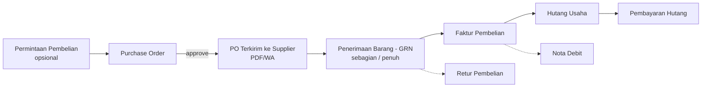

<!-- DIBUAT OTOMATIS dari PRD.md oleh Alat/PecahPrd.py. JANGAN DIEDIT LANGSUNG: ubah PRD.md lalu jalankan ulang skrip. -->

### F-04 · Supplier & Pembelian

**Tujuan:** Barang masuk tercatat benar, HPP akurat, hutang terkendali.
**Aktor:** Staf Gudang/Purchasing, Manajer, Owner (approval).

**Alur:**

**Langkah:**
1. (Opsional) Outlet membuat **Permintaan Pembelian** atau sistem membuat draft dari *Smart Restock* (stok < min).
2. **PO**: pilih supplier, lokasi tujuan, item × qty × satuan × harga, diskon, PPN masukan, ongkir, termin (tunai/tempo N hari).
3. **Approval PO** jika total > batas yang dikonfigurasi (misal > Rp 5 juta butuh Owner).
4. Kirim PO ke supplier (PDF, WA link, email).
5. **GRN**: gudang menerima barang, input qty diterima per item (boleh parsial), batch & expired, foto surat jalan. **Stok bertambah saat GRN diposting.**
6. **Faktur Pembelian**: dicocokkan dengan PO & GRN (*3-way matching*). Selisih harga memicu penyesuaian HPP.
7. **Hutang** tercatat sesuai termin. Muncul di daftar "Jatuh Tempo".
8. **Pembayaran Hutang**: dari akun kas/bank, bisa sebagian, bisa banyak faktur sekaligus.
9. **Retur Pembelian**: barang rusak/salah dikembalikan, stok berkurang, hutang berkurang (atau nota debit/refund).

**Pembelian langsung (UMKM mikro):** mode sederhana "Belanja Stok". Satu form berisi supplier (opsional), item, total, dan bayar tunai. Sistem otomatis membuat GRN + faktur + pembayaran dalam satu langkah.

**State Machine `PesananPembelian.Status`:** `Draf → MenungguPersetujuan → Disetujui → DiterimaSebagian → Diterima → Ditutup` (+ `Dibatalkan` hanya bila belum ada penerimaan barang).

**Aturan Bisnis:**
- BR-04.1 GRN tidak boleh melebihi qty PO kecuali toleransi (%) yang disetel.
- BR-04.2 HPP Moving Average dihitung ulang saat GRN diposting: `HPP_baru = (stok_lama × HPP_lama + qty_masuk × harga_masuk) / (stok_lama + qty_masuk)`. Harga masuk sudah termasuk alokasi ongkir/diskon (landed cost), tidak termasuk PPN masukan yang dapat dikreditkan.
- BR-04.3 Jika stok lama negatif (jual saat kosong), HPP baru = harga masuk, dan selisih HPP dibukukan ke akun "Selisih HPP".
- BR-04.4 Faktur dengan harga berbeda dari GRN: jika stok masih ada → revaluasi persediaan; jika sudah terjual → selisih ke HPP.

**Dampak Jurnal:** lihat §11.3 (J-04.x).
