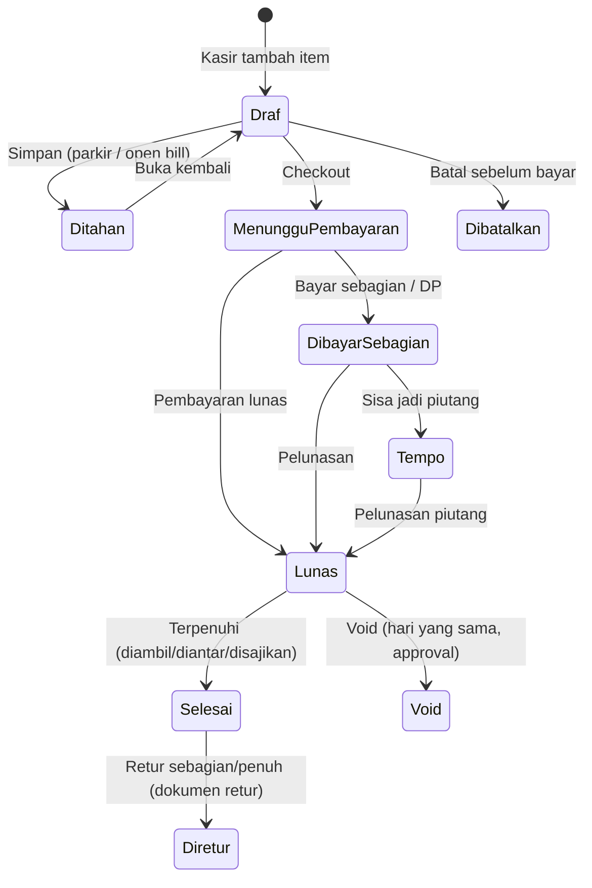

<!-- DIBUAT OTOMATIS dari PRD.md oleh Alat/PecahPrd.py. JANGAN DIEDIT LANGSUNG: ubah PRD.md lalu jalankan ulang skrip. -->

### F-07 · Transaksi Penjualan

**Tujuan:** Mencatat penjualan dengan cepat dan benar di semua mode.

**Alur umum:**


**Langkah (mode retail):**
1. Scan barcode / cari produk / ketuk tombol → item masuk keranjang (qty +1 jika sama).
2. Pilih satuan (jika multi-satuan), varian, modifier.
3. (Opsional) Pilih/daftarkan pelanggan (no. HP) → harga tier & poin aktif.
4. Sistem menghitung: subtotal → promo otomatis → diskon manual (izin) → service charge → pajak → pembulatan → **total**.
5. Kasir menekan **Bayar** → F-08.
6. Struk dicetak dan/atau dikirim (WA/email/QR struk digital).

**Urutan kalkulasi (wajib konsisten server & klien):**
```
1. BrutoBaris          = HargaSatuan × Jumlah (+ harga pilihan/modifier)
2. DiskonBaris         = promo item + diskon item manual
3. NettoBaris          = BrutoBaris − DiskonBaris
4. Subtotal            = Σ NettoBaris
5. DiskonPesanan       = promo pesanan + diskon pesanan manual (dialokasikan pro-rata ke baris)
6. BiayaLayanan        = % × (Subtotal − DiskonPesanan)          [jika aktif]
7. DasarPengenaanPajak = per baris, sesuai kategori pajak & mode inklusif/eksklusif
                         (biaya layanan ikut DPP PB1 sesuai konfigurasi daerah)
8. TotalPajak          = Σ Tarif × DPP (per jenis pajak, dibulatkan per dokumen)
9. Pembulatan          = pembulatan tunai (mis. ke Rp 100 terdekat), dicatat terpisah
10. TotalAkhir         = Subtotal − DiskonPesanan + BiayaLayanan + TotalPajak(eksklusif) + Pembulatan
```
- Aritmatika uang memakai **decimal presisi tetap** (bukan float/`double`) di server (brick/math) dan di aplikasi POS (paket Dart `decimal`). Engine kalkulasi ada dua implementasi, **PHP (server)** dan **Dart (aplikasi POS, offline)**, yang wajib lulus **test vector JSON** yang sama (Lampiran D). Web publik (self-order/toko online) **tidak** menghitung sendiri. Web publik meminta kalkulasi ke endpoint server (`/{slugTenant}/keranjang/hitung`).

**Aturan Bisnis:**
- BR-07.1 Nomor dokumen: `{PREFIX}/{OUTLET}/{YYMMDD}/{DEVICE}-{SEQ}`, misal `INV/JKT1/260922/K02-0042`. Sekuens per perangkat agar aman offline.
- BR-07.2 Harga, pajak, promo, dan HPP **di-snapshot** ke baris transaksi.
- BR-07.3 Diskon manual melebihi batas role (misal kasir maks 10%) memicu approval PIN supervisor.
- BR-07.4 Penjualan tidak bisa dibuat tanpa shift aktif (kecuali channel online/self-order yang memakai "shift virtual" per hari).
- BR-07.5 Open bill (held) otomatis mengunci baris yang sudah dikirim ke dapur. Pengurangan item setelah dikirim = **void item** dengan alasan (masuk laporan void).
- BR-07.6 Semua transaksi punya `UuidKlien` (dibuat di perangkat) untuk idempotensi sinkron.

**Rincian F-07a (v1.42, mesin kalkulasi; diputuskan agen atas mandat D-12):**
- Satu algoritma, dua implementasi: PHP `App\Domain\Penjualan\Kalkulasi` dan Dart `Paket/MesinKasir` (`Kalkulasi/`). Keduanya dijalankan terhadap semua vektor `Spesifikasi/VektorUjiKalkulasi/*.json` dan harus sama persis sampai sen. Semua uang skala 2, jumlah boleh desimal. Pembulatan uang **setengah ke atas** (menjauhi nol) kecuali disebut lain.
- Masukan: pengaturan (`HargaTermasukPajak` bawaan, `PersenBiayaLayanan`, `PembulatanTunai {Kelipatan, Arah: Bawah|Atas|Terdekat}` atau kosong), daftar pajak dokumen `{Kode, Tarif (persen), PengaliDpp "p/q" (bawaan 1/1), DasarPengenaan: Subtotal|SubtotalPlusLayanan}`, baris `{Jumlah, HargaSatuan, HargaPilihan, HargaTermasukPajak? (kosong = ikut pengaturan), Pajak? (daftar kode; kosong = semua pajak dokumen), DiskonManual? {Persen|Jumlah}}`, potongan promo yang sudah diterapkan (item: tetap/persen per baris; pesanan: tetap/persen), `DiskonManualPesanan`, dan pembayaran (daftar `{Metode, Jumlah?}`).
- Langkah: (1) `Bruto` = bulat((HargaSatuan + HargaPilihan) × Jumlah). (2) Diskon baris = Σ potongan (persen = bulat(Bruto × persen/100)), dibatasi `Bruto`; `Netto` = Bruto − Diskon. (3) `Subtotal` = Σ Netto. (4) Diskon pesanan = Σ potongan pesanan (persen dari Subtotal), dibatasi Subtotal, dialokasikan ke baris sebanding Netto. (5) `BiayaLayanan` = bulat(persen × (Subtotal − DiskonPesanan)), dialokasikan ke baris sebanding Netto akhir. (6) Pajak per baris dengan pecahan eksak (tanpa pembulatan antara): baris eksklusif `DPP = (NettoAkhir + [BiayaLayanan baris bila SubtotalPlusLayanan]) × p/q`; baris inklusif `Dasar = NettoAkhir ÷ (1 + Σ tarif×p/q)`, `DPP = Dasar × p/q`, dan pajak atas bagian biaya layanan selalu **ditambahkan** (biaya layanan tidak termasuk harga). (7) Pembulatan per dokumen per jenis pajak, terpisah untuk bagian eksklusif dan inklusif; jumlah per baris dialokasikan dari angka dokumen. (8) `TotalAkhir` = Subtotal − DiskonPesanan + BiayaLayanan + pajak eksklusif + Pembulatan.
- Alokasi ke baris memakai **metode sisa terbesar**: setiap bagian dibulatkan ke bawah ke sen, sisa sen diberikan satu-satu ke baris dengan pecahan terbesar (seri: baris lebih awal). Σ baris selalu sama persis dengan angka dokumen.
- Pembulatan tunai (BR-08.6) hanya bila ada pembayaran tunai: `SisaTunai` = total sebelum pembulatan − Σ pembayaran non-tunai; bila > 0 dibulatkan ke `Kelipatan` menurut `Arah` (`Terdekat`: setengah ke atas). `Kembalian` = uang tunai diterima − (TotalAkhir − non-tunai); tunai tanpa jumlah = uang pas.
- Keluaran: Subtotal, DiskonBaris, DiskonPesanan, TotalDiskon, BiayaLayanan, TotalPajak, TotalPajakEksklusif, Pembulatan, TotalAkhir, Kembalian, rincian per kode pajak `{Dpp, Jumlah}`, dan per baris `{Bruto, Diskon, DiskonPesanan, BiayaLayanan, Pajak, PajakEksklusif, TotalBaris}` (disnapshot ke `PenjualanDetail`, BR-07.2). Vektor boleh hanya memuat sebagian `Harapan`; yang tercantum wajib sama.

**Dampak Stok:** mutasi `Penjualan` untuk produk `Stok`/`Produksi`, bahan resep, komponen bundle, dan modifier yang berbahan (diposting saat status `Lunas` atau, untuk F&B, saat item berstatus `DikirimKeDapur` sesuai konfigurasi).
**Dampak Jurnal:** J-07.x (§11.3).
