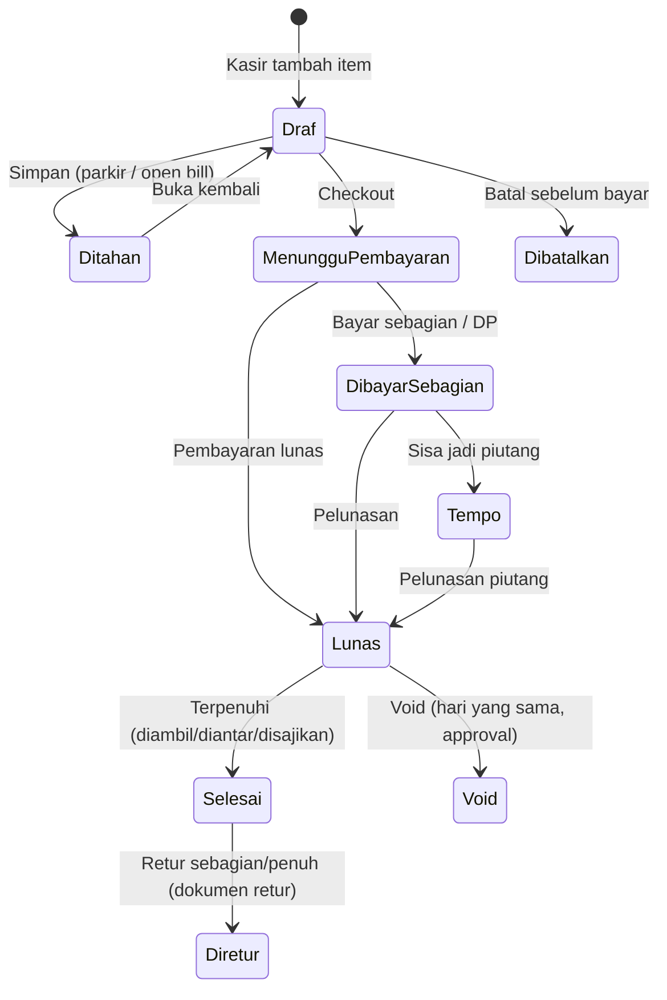

<!-- DIBUAT OTOMATIS dari PRD.md oleh Alat/PecahPrd.py. JANGAN DIEDIT LANGSUNG: ubah PRD.md lalu jalankan ulang skrip. -->

### F-07 · Transaksi Penjualan

**Tujuan:** Mencatat penjualan dengan cepat dan benar di semua mode.

**Alur umum:**


**Langkah (mode retail):**
1. Scan barcode / cari produk / ketuk tombol → item masuk keranjang (qty +1 jika sama).
2. Pilih satuan (jika multi-satuan), varian, modifier.
3. (Opsional) Pilih/daftarkan pelanggan (no. HP) → harga tier & poin aktif.
4. Sistem menghitung: subtotal → promo otomatis → diskon manual (izin) → service charge → pajak → pembulatan → **total**.
5. Kasir menekan **Bayar** → F-08.
6. Struk dicetak dan/atau dikirim (WA/email/QR struk digital).

**Urutan kalkulasi (wajib konsisten server & klien):**
```
1. BrutoBaris          = HargaSatuan × Jumlah (+ harga pilihan/modifier)
2. DiskonBaris         = promo item + diskon item manual
3. NettoBaris          = BrutoBaris − DiskonBaris
4. Subtotal            = Σ NettoBaris
5. DiskonPesanan       = promo pesanan + diskon pesanan manual (dialokasikan pro-rata ke baris)
6. BiayaLayanan        = % × (Subtotal − DiskonPesanan)          [jika aktif]
7. DasarPengenaanPajak = per baris, sesuai kategori pajak & mode inklusif/eksklusif
                         (biaya layanan ikut DPP PB1 sesuai konfigurasi daerah)
8. TotalPajak          = Σ Tarif × DPP (per jenis pajak, dibulatkan per dokumen)
9. Pembulatan          = pembulatan tunai (mis. ke Rp 100 terdekat), dicatat terpisah
10. TotalAkhir         = Subtotal − DiskonPesanan + BiayaLayanan + TotalPajak(eksklusif) + Pembulatan
```
- Aritmatika uang memakai **decimal presisi tetap** (bukan float/`double`) di server (brick/math) dan di aplikasi POS (paket Dart `decimal`). Engine kalkulasi ada dua implementasi, **PHP (server)** dan **Dart (aplikasi POS, offline)**, yang wajib lulus **test vector JSON** yang sama (Lampiran D). Web publik (self-order/toko online) **tidak** menghitung sendiri. Web publik meminta kalkulasi ke endpoint server (`/{slugTenant}/keranjang/hitung`).

**Aturan Bisnis:**
- BR-07.1 Nomor dokumen: `{PREFIX}/{OUTLET}/{YYMMDD}/{DEVICE}-{SEQ}`, misal `INV/JKT1/260922/K02-0042`. Sekuens per perangkat agar aman offline.
- BR-07.2 Harga, pajak, promo, dan HPP **di-snapshot** ke baris transaksi.
- BR-07.3 Diskon manual melebihi batas role (misal kasir maks 10%) memicu approval PIN supervisor.
- BR-07.4 Penjualan tidak bisa dibuat tanpa shift aktif (kecuali channel online/self-order yang memakai "shift virtual" per hari).
- BR-07.5 Open bill (held) otomatis mengunci baris yang sudah dikirim ke dapur. Pengurangan item setelah dikirim = **void item** dengan alasan (masuk laporan void).
- BR-07.6 Semua transaksi punya `UuidKlien` (dibuat di perangkat) untuk idempotensi sinkron.

**Rincian F-07a (v1.42, mesin kalkulasi; diputuskan agen atas mandat D-12):**
- Satu algoritma, dua implementasi: PHP `App\Domain\Penjualan\Kalkulasi` dan Dart `Paket/MesinKasir` (`Kalkulasi/`). Keduanya dijalankan terhadap semua vektor `Spesifikasi/VektorUjiKalkulasi/*.json` dan harus sama persis sampai sen. Semua uang skala 2, jumlah boleh desimal. Pembulatan uang **setengah ke atas** (menjauhi nol) kecuali disebut lain.
- Masukan: pengaturan (`HargaTermasukPajak` bawaan, `PersenBiayaLayanan`, `PembulatanTunai {Kelipatan, Arah: Bawah|Atas|Terdekat}` atau kosong), daftar pajak dokumen `{Kode, Tarif (persen), PengaliDpp "p/q" (bawaan 1/1), DasarPengenaan: Subtotal|SubtotalPlusLayanan}`, baris `{Jumlah, HargaSatuan, HargaPilihan, HargaTermasukPajak? (kosong = ikut pengaturan), Pajak? (daftar kode; kosong = semua pajak dokumen), DiskonManual? {Persen|Jumlah}}`, potongan promo yang sudah diterapkan (item: tetap/persen per baris; pesanan: tetap/persen), `DiskonManualPesanan`, dan pembayaran (daftar `{Metode, Jumlah?}`).
- Langkah: (1) `Bruto` = bulat((HargaSatuan + HargaPilihan) × Jumlah). (2) Diskon baris = Σ potongan (persen = bulat(Bruto × persen/100)), dibatasi `Bruto`; `Netto` = Bruto − Diskon. (3) `Subtotal` = Σ Netto. (4) Diskon pesanan = Σ potongan pesanan (persen dari Subtotal), dibatasi Subtotal, dialokasikan ke baris sebanding Netto. (5) `BiayaLayanan` = bulat(persen × (Subtotal − DiskonPesanan)), dialokasikan ke baris sebanding Netto akhir. (6) Pajak per baris dengan pecahan eksak (tanpa pembulatan antara): baris eksklusif `DPP = (NettoAkhir + [BiayaLayanan baris bila SubtotalPlusLayanan]) × p/q`; baris inklusif `Dasar = NettoAkhir ÷ (1 + Σ tarif×p/q)`, `DPP = Dasar × p/q`, dan pajak atas bagian biaya layanan selalu **ditambahkan** (biaya layanan tidak termasuk harga). (7) Pembulatan per dokumen per jenis pajak, terpisah untuk bagian eksklusif dan inklusif; jumlah per baris dialokasikan dari angka dokumen. (8) `TotalAkhir` = Subtotal − DiskonPesanan + BiayaLayanan + pajak eksklusif + Pembulatan.
- Alokasi ke baris memakai **metode sisa terbesar**: setiap bagian dibulatkan ke bawah ke sen, sisa sen diberikan satu-satu ke baris dengan pecahan terbesar (seri: baris lebih awal). Σ baris selalu sama persis dengan angka dokumen.
- Pembulatan tunai (BR-08.6) hanya bila ada pembayaran tunai: `SisaTunai` = total sebelum pembulatan − Σ pembayaran non-tunai; bila > 0 dibulatkan ke `Kelipatan` menurut `Arah` (`Terdekat`: setengah ke atas). `Kembalian` = uang tunai diterima − (TotalAkhir − non-tunai); tunai tanpa jumlah = uang pas.
- Keluaran: Subtotal, DiskonBaris, DiskonPesanan, TotalDiskon, BiayaLayanan, TotalPajak, TotalPajakEksklusif, Pembulatan, TotalAkhir, Kembalian, rincian per kode pajak `{Dpp, Jumlah}`, dan per baris `{Bruto, Diskon, DiskonPesanan, BiayaLayanan, Pajak, PajakEksklusif, TotalBaris}` (disnapshot ke `PenjualanDetail`, BR-07.2). Vektor boleh hanya memuat sebagian `Harapan`; yang tercantum wajib sama.

**Rincian F-07b (v1.43, server penjualan fase 1 mode retail/cepat; diputuskan agen atas mandat D-12):**
- Penjualan fase 1 dibuat di perangkat (bisa offline) dan dikirim lewat `sinkron/kirim` sebagai item `Penjualan.Buat` (Uuid item = `UuidKlien`). Hanya penjualan **lunas** yang dikirim; penjualan yang ditahan (parkir) tetap lokal di perangkat sampai dibayar atau dibatalkan (open bill tersinkron = F-07 mode meja fase 2). Data: `UuidShift`, `UuidPengguna` (kasir), `Nomor`, `Kanal` (bawaan `BawaPulang`), `DibuatPada`, `HargaTermasukPajak`, `PersenBiayaLayanan`, `PembulatanTunai {Kelipatan, Arah}|null`, `Pajak [{Kode, Tarif, PengaliDppPembilang, PengaliDppPenyebut, DasarPengenaan}]`, `Baris [{Uuid, UuidProduk, UuidProdukSatuan|null, Jumlah, HargaSatuan, HargaPilihan, Pilihan [{UuidPilihan, Nama, Harga}], HargaTermasukPajak|null, KodePajak [..], DiskonManual {Persen|Jumlah}|null, Catatan}]`, `DiskonManualPesanan|null`, `UuidPenyetujuDiskon|null`, `Pembayaran [{Uuid, UuidMetodePembayaran, Jumlah, Referensi|null}]` (tunai: `Jumlah` = uang diterima), `Ringkasan {Subtotal, TotalPajak, Pembulatan, TotalAkhir, Kembalian}`, `Catatan`.
- Server (satu transaksi DB per item): (1) Uuid sama → `Duplikat` bila Nomor & TotalAkhir sama, selain itu `UuidSudahDipakai`. (2) Shift ber-`UuidShift` milik perangkat ini wajib ada (`ShiftTidakDitemukan`; outbox FIFO menjamin shift terkirim lebih dulu). (3) Kasir anggota outlet dengan `penjualan.buat` (`KasirTidakDitemukan`/`TanpaIzin`). (4) Nomor `INV/{KodeOutlet}/{YYMMDD}/{KodePerangkat}-{SEQ≥4}` (BR-07.1), unik per tenant (`NomorSudahDipakai`). (5) Produk ada di tenant (termasuk yang sudah diarsipkan/dihapus setelah dijual offline); jenis `IndukVarian`, `BahanBaku`, `Konsinyasi` dan produk berpelacakan batch/seri ditolak di fase ini (`ProdukTidakBisaDijual`, `PelacakanBelumDidukung`). (6) Setiap pajak snapshot wajib sama dengan `TarifPajak` terbit untuk kode jenis itu (daerah: wilayah outlet; nasional: tanpa wilayah) yang berlaku pada tanggal bisnis penjualan (`TarifPajakTidakSah`, CLAUDE.md #12). (7) BR-07.3: diskon manual butuh `penjualan.diskon.manual`; persen efektif (diskon ÷ bruto baris, atau ÷ subtotal untuk pesanan) di atas `BatasDiskonManual` (bawaan 10%) butuh penyetuju ber-izin baru `penjualan.diskon.setujui` (bawaan Supervisor, Manajer Outlet, Admin) sampai `BatasDiskonPenyetuju` (bawaan 30%); Pemilik tanpa batas (`DiskonMelebihiBatas`). (8) Server menghitung ulang dengan `MesinKalkulasi` dari snapshot; beda dengan `Ringkasan` = `HitunganTidakCocok` (harga jual snapshot tidak dianggap konflik, §18.3). (9) Pembayaran fase 1: jenis Tunai, QrisStatis, Edc, Transfer, Ewallet (lainnya `MetodeBayarBelumDidukung`), maksimal satu baris tunai, non-tunai tidak boleh melebihi total, Σ pembayaran ≥ TotalAkhir (`PembayaranKurang`); metode yang dinonaktifkan setelah transaksi offline tetap diterima.
- Disimpan: `Penjualan` (Status `Lunas`, `TanggalBisnis` dari `TanggalBisnisOutlet` waktu `DibuatPada`, `DibuatOfflinePada`, `DiterimaPada`, `IdPengguna` kasir, `IdPenyetujuDiskon`, `TotalDiskon`, `DiskonPesanan`, `TotalDibayar`, `Kembalian`, `TotalHpp`, `PerluTinjauan` + `AlasanTinjauan`), `PenjualanDetail` (snapshot harga, `Bruto`, diskon, alokasi diskon pesanan & biaya layanan, `JumlahPajak`, `PajakEksklusif`, `SnapshotPajak`, `TotalBaris`, `KonversiKeDasar`, HPP), `PenjualanPembayaran`, dan tabel baru `PenjualanPajak` (per kode pajak: `KodeJenisPajak`, `Tarif`, pengali DPP, `DasarPengenaan`, `Dpp`, `Jumlah`). Dokumen lunas tidak bisa diubah; koreksi lewat void/retur (F-09).
- Stok (aturan #9–#10, di transaksi yang sama): mutasi `Penjualan` dari gudang Toko outlet (gudang jenis `Toko` pertama) untuk produk `Stok`/`Produksi`, bahan resep versi terbaru untuk `Resep`, komponen untuk `Paket` (rekursif), dan bahan pilihan (`Pilihan.UuidProdukBahan` × jumlah); jumlah dikonversi ke satuan dasar. Stok tidak cukup **tidak menolak** penjualan (§18.3): mutasi tetap dicatat dan penjualan ditandai `PerluTinjauan` (`StokTidakCukup`). HPP per baris dari hasil mutasi.
- Jurnal satu dokumen (`JenisSumberJurnal::Penjualan`), di transaksi yang sama: Dr akun per pembayaran (tunai → akun metode atau `KasOutlet`, dikurangi kembalian; QRIS/EDC/e-wallet → akun kliring metode atau `PiutangPencairan`; transfer → akun metode atau `Bank`) + Dr `DiskonPenjualan` (total diskon); Cr `Penjualan`/`PendapatanJasa` (bruto dikurangi pajak inklusif), Cr `PendapatanBiayaLayanan`, Cr pajak (`Ppn` → `PpnKeluaran`, lainnya → `HutangPbjt`), pembulatan ke `PendapatanLain` (debit bila negatif); Dr `Hpp` / Cr persediaan per jenis produk (J-07.2). Periode terkunci → ditolak `PeriodeTerkunci` (sementara; kebijakan §18.3 "posting ke periode terbuka berikutnya" menjadi utang).
- Pengaturan kasir tenant ditambah `BatasDiskonManual`, `BatasDiskonPenyetuju`, dan `PembulatanTunai {Kelipatan, Arah}` (dibaca dari `Tenant.Pengaturan`, diisi template sektor; dapat diubah di Pengaturan kasir, izin `outlet.kelola`).
- `data-awal` ditambah: `Pengaturan.{BatasDiskonManual, BatasDiskonPenyetuju, PembulatanTunai}`, `Outlet {Uuid, Kode, Nama, Alamat, Telepon}`, `Perangkat {Uuid, Kode}`, `ProfilPajak {Pkp, PungutPbjt, HargaTermasukPajak, BiayaLayanan {Aktif, Persen}}`, `TarifPajak [{KodeJenisPajak, Tarif, PengaliDppPembilang, PengaliDppPenyebut, BerlakuMulai, BerlakuSampai}]` (tarif terbit nasional + wilayah outlet yang belum berakhir, termasuk yang akan berlaku), `MetodePembayaran [{Uuid, Jenis, Nama, NomorRekening, NamaPemilikRekening, AdaGambarQris, Urutan}]` (aktif, jenis fase 1). Gambar QRIS statis: `GET /api/pos/v1/metode-pembayaran/{uuid}/gambar-qris`.
- Back-office: daftar penjualan `/kelola/penjualan` (`TabelData` server: Nomor, Waktu, Outlet, Kasir, Kanal, Total, Metode, Status, tinjauan; saring outlet/status/tanggal) dan detail (baris, pajak, pembayaran, tautan shift, jurnal, dan kartu stok), izin `laporan.penjualan.lihat`, dibatasi outlet akses. Detail shift menampilkan penjualannya.

**Rincian F-07c (v1.43, layar Jual & Bayar Aplikasi POS):**
- Katalog diunduh dari `/katalog` (lengkap lalu delta lewat kursor) ke tabel Drift bernama sama dengan server; migrasi skema lokal tidak menyentuh outbox (§18.3 no. 9). Harga lewat `PenentuHarga`, total lewat `MesinKalkulasi` (paket `MesinKasir`).
- Layar Jual di area kerja `RuangKerja`: pencarian produk (nama/SKU/barcode), kategori, ubin produk, keranjang di sisi yang diatur (kiri/kanan), ubah jumlah, satuan, pilihan wajib/opsional, catatan, diskon manual baris & pesanan (di atas batas → dialog PIN penyetuju), simpan/buka pesanan tertahan lokal, batal. Pemindai barcode tanpa fokus (input keyboard cepat diakhiri Enter) dan pintasan keyboard desktop mengikuti §17.2.3 (F1 cari, F8 bayar, F9 uang pas, Esc tutup panel atau hapus item terakhir; F2 dicadangkan untuk pelanggan).
- Bayar: tunai (tombol pecahan cepat & uang pas), QRIS statis (gambar QR + konfirmasi kasir), EDC (bank/nomor approval), transfer & e-wallet (referensi), split pembayaran (BR-08.1), pembulatan tunai hanya bagian tunai (BR-08.6), layar selesai dengan kembalian. Nomor `INV/{KodeOutlet}/{YYMMDD}/{KodePerangkat}-{SEQ4}` dengan sekuens per perangkat per hari disimpan lokal. Penjualan + detail + pembayaran + outbox dalam satu transaksi SQLite (§18.3 no. 3). Penjualan tanpa shift terbuka tidak bisa (BR-07.4).
- Riwayat transaksi perangkat (hari ini) di navigasi Ruang Kerja dengan status sinkron per transaksi. Cetak struk: lihat Rincian cetak struk (v1.79).

**Rincian cetak struk bagian 1 (v1.79, POS-11 struk thermal, POS-17 buka laci, PLT-06 pengaturan struk; keputusan pemilik produk v1.79: pengaturan struk dapat diatur dari UI back-office, **satu pengaturan untuk semua outlet**; rincian lain diputuskan agen atas mandat D-12):**
- Back-office `Kasir › Pengaturan struk` (`/kelola/kasir/struk`, izin `outlet.kelola`): nama di struk (kosong = nama usaha), maks 3 baris kepala (jam buka, media sosial), saklar logo/alamat outlet/telepon outlet/NPWP/nama kasir/nama pelanggan/total hemat, catatan kaki (maks 200 karakter), kalimat penutup (kosong = "Terima kasih atas kunjungan Anda"). Pratinjau langsung kertas 58 mm (32 kolom) dan 80 mm (48 kolom). Disimpan di `Tenant.Pengaturan.Struk`, audit `struk.pengaturan.ubah`. Alamat & telepon tetap per outlet (data outlet). Tanda air "Dibuat dengan PAYOU" otomatis untuk paket tanpa fitur `struk.tanpa-watermark` (Gratis) dan tidak bisa dimatikan di halaman ini.
- `data-awal` ditambah `Struk` = pengaturan di atas + `NamaUsaha`, `Npwp` (hanya bila outlet PKP), `AdaLogo`, `TandaAir` (kompatibel mundur: aplikasi lama mengabaikan). Logo: `GET /api/pos/v1/logo-struk` (404 bila tanpa logo atau logo dimatikan); aplikasi mengubahnya ke gambar 1 bit (lebar 256 titik, dithering) dan menyimpannya lokal agar struk berlogo tetap tercetak offline.
- `Paket/AdaptorPerangkat` (Dart murni): `DokumenStruk` → `TataLetakStruk` (ASCII, selebar kolom kertas; sama untuk pratinjau & cetak) → `PengodeEscPos` (ESC @, tebal/besar, QR `GS ( k`, raster `GS v 0`, potong kertas, laci `ESC p`) → `TransportPrinter`. Fase ini `TransportJaringan` (RAW port 9100; Android, iOS/iPadOS, Windows). Pengode ditulis sendiri, bukan `esc_pos_utils_plus`, karena profil kemampuannya memuat aset lewat Flutter sehingga paket tidak bisa tetap Dart murni.
- Aplikasi kasir: printer diatur per perangkat di Pengaturan (alamat IP, port, lebar kertas 58/80 mm, cetak otomatis, buka laci untuk tunai; **cetak uji** sebelum simpan). Setelah pembayaran tersimpan, struk dicetak otomatis dan laci dibuka bila ada pembayaran tunai. Gagal cetak tidak membatalkan transaksi: pesan galat (apa yang terjadi + apa yang dilakukan) tampil dengan tombol "Coba cetak lagi". Cetak kedua dan cetak dari Riwayat bertanda **CETAK ULANG**; penjualan void bertanda **DIBATALKAN**. Bilah status: "Printer belum diatur" / "Printer siap" / "Mencetak…" / "Printer bermasalah". Profil printer lokal di tabel `Pengaturan` (tidak ikut data awal; skema lokal tetap 11).
- Isi struk: logo, nama, baris kepala, nama outlet, alamat, telepon, NPWP, nomor, tanggal & jam (waktu perangkat), kasir, pelanggan (hanya cetak langsung setelah bayar; nama pelanggan tidak disimpan lokal), baris produk (+ pilihan, jumlah × harga, diskon baris, catatan), subtotal, diskon pesanan, biaya layanan, pajak eksklusif, pembulatan, TOTAL, pembayaran per metode, kembalian, "Harga termasuk pajak Rp …" bila pajak inklusif, "Anda hemat Rp …", catatan kaki, penutup, tanda air.
- **Belum** (bagian berikutnya): printer Bluetooth Klasik/BLE, USB, printer bawaan all-in-one (Sunmi, iMin) & fallback printer sistem, Wizard Uji Perangkat & `Perangkat.ProfilHardware`, struk digital `/s/{kodeStruk}` + QR di struk, struk retur/void/tutup shift/pre-order, tiket dapur per stasiun.

**Keputusan implementasi F-07b/F-07c (v1.44):**
- Kunci opsional `Penjualan.Buat`: `Kanal`, `PembulatanTunai`, `Pajak`, `HargaPilihan`, `Pilihan`, `KodePajak` (null = semua pajak dokumen, `[]` = tanpa pajak), `DiskonManual`, `Catatan`, `Referensi`. `DibuatPada` ISO-8601 berzona; > 10 menit di masa depan atau sebelum buka shift − 10 menit → `WaktuTidakValid`. `HargaPilihan` wajib = Σ harga `Pilihan`; `Ringkasan.Kembalian` ikut dicocokkan. `YYMMDD` nomor = tanggal bisnis (aplikasi memakai `Outlet.JamTutupBuku`); `{DEVICE}` = `Perangkat.Kode` apa adanya. Kode galat tambahan: `NomorTidakValid`, `ProdukTidakDikenal`, `SatuanTidakDikenal`, `MetodeBayarTidakDikenal`, `PembayaranTidakValid`, `PenyetujuTidakBerwenang`, `LokasiStokTidakAda`.
- BR-07.3: kasir yang sendiri berizin `penjualan.diskon.setujui` menyetujui diskonnya sendiri (tanpa PIN) sampai `BatasDiskonPenyetuju`; di atasnya hanya Pemilik. Peran Kasir bawaan tidak punya `penjualan.diskon.manual`, jadi setiap diskon kasir butuh PIN penyetuju. Batas penyetuju ≥ batas kasir.
- Produk/pilihan yang dihapus setelah dijual offline: penjualan diterima, stoknya tidak dikurangi, ditandai `PerluTinjauan` (`ProdukDihapus`/`PilihanTidakDikenal`). Bahan/komponen berpelacakan batch/seri → `PelacakanBelumDidukung`. Penjualan diterima walau shiftnya sudah ditutup (outbox FIFO). Penjualan Rp 0 tidak dijurnal. Snapshot jenis & nama metode bayar ikut disimpan.
- Buku stok: `DataDokumenMutasi.abaikanBatasMinus` melewati BR-05.2 dan melaporkan baris yang melanggar; alasan tinjauan `StokTidakCukup` hanya bila BR-05.2 benar-benar dilanggar.
- **Tindak lanjut tinjauan (v1.46):** (a) Server mencocokkan snapshot `HargaTermasukPajak`, `PersenBiayaLayanan`, `PembulatanTunai`, dan himpunan pajak per baris dengan pengaturan tenant & `Outlet.ProfilPajak` serta kelompok pajak produk pada tanggal bisnis; beda (misal pengaturan berubah saat perangkat offline, atau pajak wajib tidak ada) tetap **diterima** dengan `PerluTinjauan` (`PengaturanBerbeda`/`PajakBerbeda`), karena uang sudah diterima (§18.3). `PembulatanTunai.Kelipatan` hanya 1–1.000 dan |pembulatan| < kelipatan. (b) Kasir yang masih anggota tenant tetapi izin/outletnya berubah, atau diskon melebihi batas yang berlaku saat diterima, **diterima + `PerluTinjauan`** (`IzinBerubah`/`DiskonMelebihiBatas`); yang ditolak hanya data yang tidak mungkin sah (pengguna bukan anggota tenant, penyetuju tanpa izin sama sekali). (c) Persen diskon efektif = diskon (hasil mesin, sudah dibulatkan) ÷ bruto baris (atau ÷ subtotal untuk pesanan), dipakai sama di aplikasi dan server. (d) Tanggal bisnis & `YYMMDD` di perangkat memakai `Outlet.ZonaWaktu`, bukan zona perangkat. (e) `data-awal` menyertakan nomor urut terakhir penjualan per perangkat per tanggal agar pemasangan ulang aplikasi tidak memakai nomor yang sama. (f) Kasir tanpa `penjualan.diskon.manual` diarahkan ke PIN penyetuju, bukan ditolak. Kode jenis pajak untuk syarat PKP/PBJT dan akun jurnal dibaca dari atribut `JenisPajak` (kategori PPN/PBJT), bukan string tetap.
- **Implementasi tindak lanjut (v1.49):** anggota tenant yang dinonaktifkan/pindah outlet/kehilangan izin → diterima + `IzinBerubah`; semua pelanggaran diskon → diterima + `DiskonMelebihiBatas` (kode `TanpaIzin` tidak lagi dipakai untuk penjualan); penyetuju bukan anggota atau tanpa `penjualan.diskon.setujui` tetap `PenyetujuTidakBerwenang`. Batas diskon dibandingkan eksak (diskon × 100 > batas × dasar). Bentrok indeks unik saat kiriman bersamaan dibaca ulang → `Duplikat` bila Nomor & TotalAkhir sama. Kolom HPP/jurnal penjualan hanya bisa diisi di dalam proses penerimaan. Alasan tinjauan ditampilkan sebagai label (`KodeAlasanTinjauan`); `Penjualan.AlasanTinjauan` diperlebar ke 1.000 karakter. `abaikanBatasMinus` ditolak untuk produk batch/seri. Gambar QRIS POS hanya untuk metode aktif. Detail shift menampilkan 200 penjualan terakhir.
- Aplikasi: tarif pajak `BerlakuSampai` inklusif; bila satu kode pajak ada di beberapa kelompok, dasar pengenaan dari kelompok pertama; katalog diperbarui berkala hanya saat keranjang kosong dan tanpa panel terbuka; resep & komponen paket tidak disimpan di perangkat (stok dihitung server); harga ditentukan ulang saat jumlah/satuan berubah, pesanan tertahan memakai harga snapshot; EDC wajib nomor approval, QRIS statis wajib konfirmasi "Dana sudah masuk". Item navigasi baru "Riwayat".

**Dampak Stok:** mutasi `Penjualan` untuk produk `Stok`/`Produksi`, bahan resep, komponen bundle, dan modifier yang berbahan (diposting saat status `Lunas` atau, untuk F&B, saat item berstatus `DikirimKeDapur` sesuai konfigurasi).
**Dampak Jurnal:** J-07.x (§11.3).
