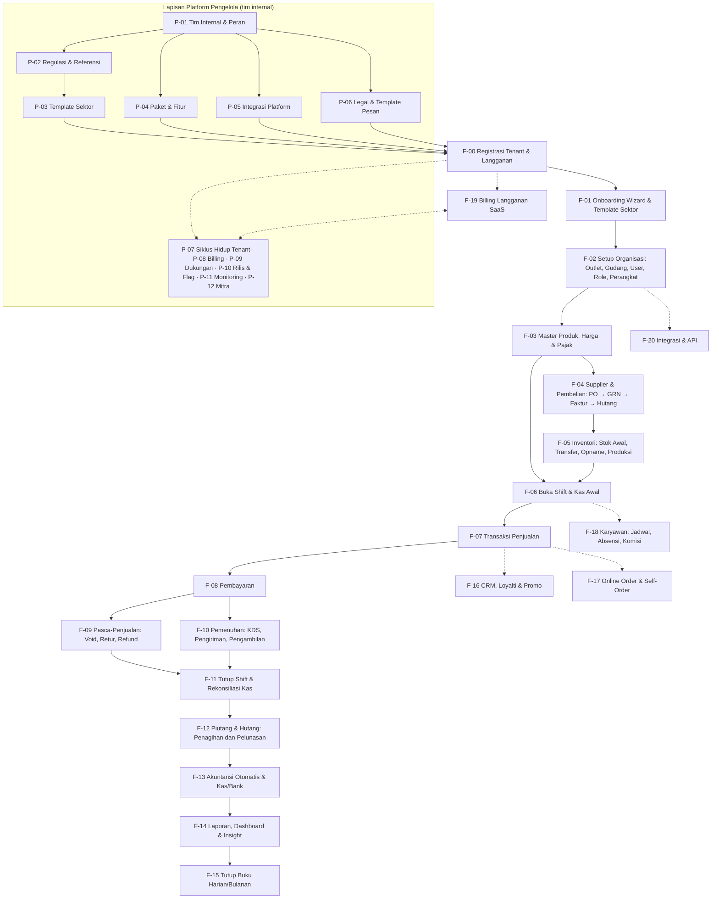

<!-- DIBUAT OTOMATIS dari PRD.md oleh Alat/PecahPrd.py. JANGAN DIEDIT LANGSUNG: ubah PRD.md lalu jalankan ulang skrip. -->

## 7. Peta Flow Bisnis Induk (Master Business Flow)

### 7.1 Diagram Induk

Sistem punya **dua lapisan flow**: lapisan **Platform Pengelola** (dijalankan tim internal {{APP}}) yang menyiapkan dan mengoperasikan platform, lalu lapisan **Tenant** (dijalankan pemilik usaha) yang memakai platform tersebut.

### 7.2 Urutan Implementasi (Dependency Order)

| Urutan | Flow | Bergantung pada | Fase |
|---|---|---|---|
| P1 | P-01 Tim Internal & Peran | — | 0 |
| P2 | P-02 Master Regulasi & Referensi (wilayah, PPN, PBJT, hari libur) | P-01 | 0 |
| P3 | P-04 Katalog Paket & Fitur | P-01 | 0 |
| P4 | P-03 Template Sektor (3 template MVP) | P-02, P-04 | 0 |
| P5 | P-05 Integrasi Platform (email, CAPTCHA, storage) | P-01 | 0 |
| P6 | P-06 Dokumen Legal | P-01 | 0 |
| P7 | P-07 Siklus Hidup Tenant (dasar) + P-08 Tagihan manual + P-09 Tiket dasar + P-11 Monitoring dasar | P-04 | 0 |
| 1 | F-00 Registrasi & Tenant | P-02 s.d. P-06 | 0 |
| 2 | F-02 Organisasi (outlet, user, role) | F-00 | 0 |
| 3 | F-01 Onboarding & Template Sektor | F-00, F-02 | 1 |
| 4 | F-03 Master Produk, Harga, Pajak | F-02 | 1 |
| 5 | F-05a Stok Awal & Ledger Stok | F-03 | 1 |
| 6 | F-06 Shift & Kas | F-02 | 1 |
| 7 | F-07 Penjualan (retail/quick) | F-03, F-05a, F-06 | 1 |
| 8 | F-08 Pembayaran (tunai, QRIS statis, EDC manual) | F-07 | 1 |
| 9 | F-09 Void/Retur | F-07, F-08 | 1 |
| 10 | F-11 Tutup Shift | F-06, F-08 | 1 |
| 11 | F-13a Jurnal Otomatis (penjualan, kas) | F-07–F-11 | 1 |
| 12 | F-14a Laporan inti | F-07–F-13a | 1 |
| 13 | F-04 Pembelian & Hutang | F-03, F-05a | 1 |
| 14 | F-05b Transfer, Opname, Penyesuaian | F-05a | 1 |
| 15 | F-07 Mode `table` + F-10 KDS | F-07 | 2 |
| 16 | F-16 CRM, Loyalti, Promo Engine | F-07 | 2 |
| 17 | F-12 Piutang/Tempo & Wholesale | F-07, F-08 | 2 |
| 18 | F-18 Karyawan & Komisi | F-02, F-07 | 2 |
| 19 | F-07 Mode `service` (booking) | F-07, F-18 | 2 |
| 20 | F-17 Self-order & Online Order | F-07, F-08, F-10 | 2 |
| 21 | F-13b Akuntansi penuh + F-15 Tutup Buku | F-13a | 3 |
| 22 | F-05c Produksi/Resep lanjutan, Konsinyasi | F-05 | 3 |
| 23 | F-20 Open API & Webhook | semua | 3 |
| 24 | F-19 Billing SaaS otomatis | F-00, P-08 | 1 (manual) → 3 (otomatis) |
| — | P-09 Akses Dukungan & P-10 Rilis Aplikasi | P-07 | 1 (sebelum beta tertutup) |
| — | P-08 Billing otomatis, skor kesehatan, analitik platform, insiden | P-07, P-08 | 2 |
| — | P-12 Mitra, portal mitra, faktur pajak langganan | P-08 | 3 |
