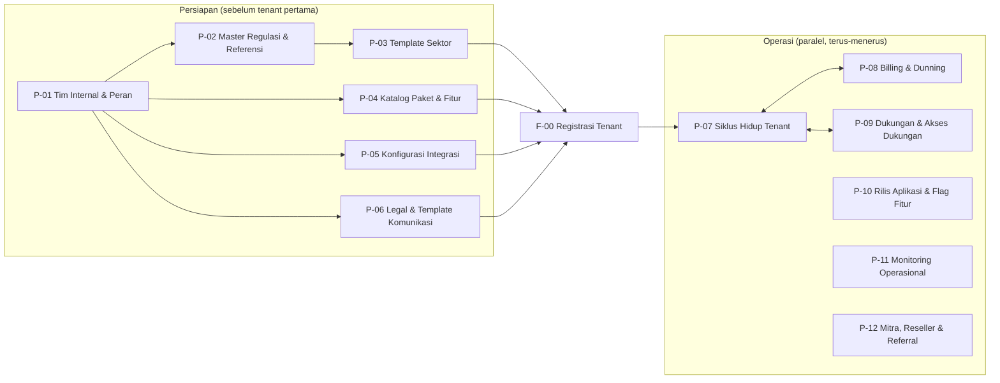

<!-- DIBUAT OTOMATIS dari PRD.md oleh Alat/PecahPrd.py. JANGAN DIEDIT LANGSUNG: ubah PRD.md lalu jalankan ulang skrip. -->

## 8. Spesifikasi Flow Bisnis Detail

> Konvensi: **BR** = Business Rule, **AC** = Acceptance Criteria, **Dr/Cr** = Debit/Kredit.
> Semua nominal dalam Rupiah (IDR). Semua waktu disimpan dalam UTC dan ditampilkan sesuai zona waktu outlet (WIB/WITA/WIT).

### Bagian A — Flow Platform Pengelola (P-01 s.d. P-12)

> **Platform Pengelola** adalah lapisan yang dipakai **tim internal {{APP}}** (bukan tenant) untuk mengoperasikan bisnis SaaS: menyiapkan data master, paket, template, regulasi, mengelola tenant, tagihan, dukungan, rilis aplikasi, dan mitra. Flow P-01 s.d. P-06 **wajib selesai sebelum** flow tenant F-00 bisa berjalan. Flow P-07 s.d. P-12 berjalan paralel selama platform beroperasi.
>
> Diakses melalui `https://pengelola.{{app}}.id` (atau `/pengelola`), dengan akun, autentikasi, dan layout terpisah dari back-office tenant (§13.8).

---

Detail setiap flow ada di folder `Dokumen/Flow/` (lihat Indeks.md).
