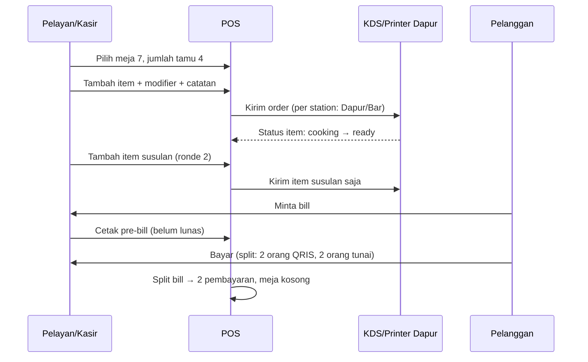

<!-- DIBUAT OTOMATIS dari PRD.md oleh Alat/PecahPrd.py. JANGAN DIEDIT LANGSUNG: ubah PRD.md lalu jalankan ulang skrip. -->

## 9. Flow Khusus per Sektor

### 9.1 F&B Restoran (Mode `table`)



Fitur khusus:
- Denah meja visual (drag & drop editor), area (Indoor/Outdoor/VIP), status warna (kosong/terisi/minta bill/perlu dibersihkan).
- Pindah meja, gabung meja, gabung bill, pisah bill.
- Kursus/course (appetizer, main, dessert) dengan "tahan & kirim" (hold & fire).
- Reservasi meja dengan DP (fase 3).
- Minimum charge per meja/area (VIP).
- **Menu engineering:** klasifikasi Star/Plowhorse/Puzzle/Dog berdasarkan popularitas × margin.
- **Food cost %** harian: HPP teoretis (resep) vs HPP aktual (opname), sehingga selisih pemakaian bahan terlihat.

### 9.2 Kafe / QSR (Mode `quick`)

- Grid tombol besar per kategori, favorit, pencarian.
- Modifier wajib muncul sebagai pop-up cepat.
- Nomor order/antrian otomatis, layar panggil antrian.
- Mode "bayar dulu" (default QSR) vs "open bill" (kafe duduk).
- Customer Display (layar kedua) menampilkan pesanan & QRIS.

### 9.3 Retail Umum / Minimarket (Mode `retail`)

- Fokus input scanner (keyboard wedge). Kursor selalu di field scan.
- Shortcut keyboard (F1 cari, F2 pelanggan, F8 bayar, F9 tunai pas, Esc batal item).
- Barcode timbangan (prefix 20–29: harga/berat terenkode di barcode EAN-13).
- Multi-satuan otomatis dari barcode (scan barcode dus → satuan dus).
- Cek harga cepat tanpa menambah ke keranjang.
- Label harga & barcode cetak massal (fase 2).

### 9.4 Fashion

- Matrix varian ukuran × warna (input stok & harga dalam grid).
- Tukar barang (ukuran) dalam satu layar.
- Koleksi/musim, markdown (diskon cuci gudang) terjadwal.

### 9.5 Apotek / Toko Obat

- Batch & expired wajib, FEFO otomatis.
- Golongan obat (bebas, bebas terbatas, keras, psikotropika/narkotika). Obat keras wajib **input resep** (nama dokter, no. resep) dan hanya bisa dijual oleh role Apoteker.
- Harga HNA + margin → HJA, embalase/tuslah (biaya racik).
- Racikan: resep racik sebagai produk `recipe` sementara.
- Laporan obat mendekati kadaluarsa & laporan penjualan obat keras.
- ⚠️ Kepatuhan laporan ke regulator (misal SIPNAP) di luar lingkup v1. Sistem menyediakan export data pendukung.

### 9.6 Elektronik (Serial/IMEI)

- Serial wajib saat GRN dan saat jual. Pencarian riwayat serial.
- Kartu garansi (tanggal jual + masa garansi) tercetak di struk.
- Modul servis sederhana (terima unit, estimasi, status, ambil) memakai Work Order (§9.10).

### 9.7 Grosir & Distributor (Mode `wholesale`)

- **Sales Order** (SO) → Delivery Order (DO) → Invoice → Piutang → Pelunasan.
- Harga per level pelanggan, harga bertingkat qty, harga khusus per pelanggan.
- Salesman lapangan (kanvas/taking order) via **modul Salesman di aplikasi Flutter** (HP Android/iPhone), bisa offline: ambil order, lihat stok, lihat piutang pelanggan, kunjungan (check-in lokasi).
- Pengiriman: rute, armada, surat jalan, konfirmasi terima.
- Retur dari toko, nota kredit.
- Limit kredit & blokir otomatis.

### 9.8 Salon / Barbershop / Spa (Mode `service`)

```
Booking online/WA → Konfirmasi → Reminder H-1 (WA) → Check-in
  → Layanan (staf ditugaskan, bahan terpakai opsional) → Pembayaran
  → Komisi staf → Follow-up/rebooking
```
- Kalender per staf (slot waktu, durasi layanan, buffer).
- Antrian walk-in + booking dalam satu tampilan.
- Paket sesi/membership & saldo deposit.
- Komisi bertingkat (staf senior/junior), komisi penjualan produk.
- Pemakaian bahan per layanan (cat rambut) sebagai resep layanan.

### 9.9 Laundry

- Tiket laundry: berat (kg) atau per item (jas, bed cover), layanan (reguler/express), parfum, estimasi selesai otomatis.
- Label/nota bernomor + QR untuk tracking.
- Status proses (F-10) + notifikasi WA "siap diambil".
- Bayar di depan / saat ambil (piutang pendek), deposit langganan.
- Laporan cucian belum diambil > N hari.

### 9.10 Bengkel

- Data kendaraan (plat, merk, tipe, tahun, km) terhubung ke pelanggan.
- Work Order: keluhan → diagnosis → estimasi (jasa + part) → persetujuan pelanggan (via WA link) → pengerjaan → QC → invoice.
- Mekanik ditugaskan per jasa (komisi).
- Riwayat servis per kendaraan, pengingat servis berkala (km/waktu).

### 9.11 Bakery / Produksi Harian

- Rencana produksi harian (berdasarkan forecast/pre-order).
- Order produksi (F-05e) → stok produk jadi.
- Pre-order kue ulang tahun: DP, spesifikasi kustom, tanggal ambil, status.
- Produk expired hari yang sama → diskon sore otomatis (promo terjadwal) → sisa dicatat waste.

### 9.12 Bahan Bangunan

- Qty desimal & konversi (batang ↔ meter, sak, m³).
- Harga sering berubah: update harga massal (% atau nominal per kategori).
- Pengiriman dengan armada, ongkir per jarak/zona.
- Penjualan tempo ke kontraktor dengan limit & aging.
