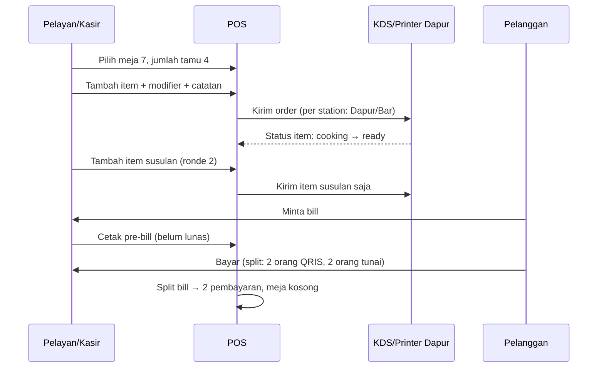

<!-- DIBUAT OTOMATIS dari PRD.md oleh Alat/PecahPrd.py. JANGAN DIEDIT LANGSUNG: ubah PRD.md lalu jalankan ulang skrip. -->

## 9. Flow Khusus per Sektor

### 9.1 F&B Restoran (Mode `table`)


```mermaid
sequenceDiagram
    participant W as Pelayan/Kasir
    participant POS
    participant KDS as KDS/Printer Dapur
    participant C as Pelanggan
    W->>POS: Pilih meja 7, jumlah tamu 4
    W->>POS: Tambah item + modifier + catatan
    POS->>KDS: Kirim order (per station: Dapur/Bar)
    KDS-->>POS: Status item: cooking → ready
    W->>POS: Tambah item susulan (ronde 2)
    POS->>KDS: Kirim item susulan saja
    C->>W: Minta bill
    W->>POS: Cetak pre-bill (belum lunas)
    C->>W: Bayar (split: 2 orang QRIS, 2 orang tunai)
    POS->>POS: Split bill → 2 pembayaran, meja kosong
```

Fitur khusus:
- Denah meja visual (drag & drop editor), area (Indoor/Outdoor/VIP), status warna (kosong/terisi/minta bill/perlu dibersihkan).
- Pindah meja, gabung meja, gabung bill, pisah bill.
- Kursus/course (appetizer, main, dessert) dengan "tahan & kirim" (hold & fire).
- Reservasi meja dengan DP (fase 3).
- Minimum charge per meja/area (VIP).
- **Menu engineering:** klasifikasi Star/Plowhorse/Puzzle/Dog berdasarkan popularitas × margin.
- **Food cost %** harian: HPP teoretis (resep) vs HPP aktual (opname), sehingga selisih pemakaian bahan terlihat.

### 9.2 Kafe / QSR (Mode `quick`)

- Grid tombol besar per kategori, favorit, pencarian.
- Modifier wajib muncul sebagai pop-up cepat.
- Nomor order/antrian otomatis, layar panggil antrian.
- Mode "bayar dulu" (default QSR) vs "open bill" (kafe duduk).
- Customer Display (layar kedua) menampilkan pesanan & QRIS.

### 9.3 Retail Umum / Minimarket (Mode `retail`)

- Fokus input scanner (keyboard wedge). Kursor selalu di field scan.
- Shortcut keyboard (F1 cari, F2 pelanggan, F8 bayar, F9 tunai pas, Esc batal item).
- Barcode timbangan (prefix 20–29: harga/berat terenkode di barcode EAN-13).
- Multi-satuan otomatis dari barcode (scan barcode dus → satuan dus).
- Cek harga cepat tanpa menambah ke keranjang.
- Label harga & barcode cetak massal (fase 2).

### 9.4 Fashion

- Matrix varian ukuran × warna (input stok & harga dalam grid).
- Tukar barang (ukuran) dalam satu layar.
- Koleksi/musim, markdown (diskon cuci gudang) terjadwal.

### 9.5 Apotek / Toko Obat

- Batch & expired wajib, FEFO otomatis.
- Golongan obat (bebas, bebas terbatas, keras, psikotropika/narkotika). Obat keras wajib **input resep** (nama dokter, no. resep) dan hanya bisa dijual oleh role Apoteker.
- Harga HNA + margin → HJA, embalase/tuslah (biaya racik).
- Racikan: resep racik sebagai produk `recipe` sementara.
- Laporan obat mendekati kadaluarsa & laporan penjualan obat keras.
- ⚠️ Kepatuhan laporan ke regulator (misal SIPNAP) di luar lingkup v1. Sistem menyediakan export data pendukung.

### 9.6 Elektronik (Serial/IMEI)

- Serial wajib saat GRN dan saat jual. Pencarian riwayat serial.
- Kartu garansi (tanggal jual + masa garansi) tercetak di struk.
- Modul servis sederhana (terima unit, estimasi, status, ambil) memakai Work Order (§9.10).

### 9.7 Grosir & Distributor (Mode `wholesale`)

- **Sales Order** (SO) → Delivery Order (DO) → Invoice → Piutang → Pelunasan.
- Harga per level pelanggan, harga bertingkat qty, harga khusus per pelanggan.
- Salesman lapangan (kanvas/taking order) via **modul Salesman di aplikasi Flutter** (HP Android/iPhone), bisa offline: ambil order, lihat stok, lihat piutang pelanggan, kunjungan (check-in lokasi).
- Pengiriman: rute, armada, surat jalan, konfirmasi terima.
- Retur dari toko, nota kredit.
- Limit kredit & blokir otomatis.

### 9.8 Salon / Barbershop / Spa (Mode `service`)

```
Booking online/WA → Konfirmasi → Reminder H-1 (WA) → Check-in
  → Layanan (staf ditugaskan, bahan terpakai opsional) → Pembayaran
  → Komisi staf → Follow-up/rebooking
```
- Kalender per staf (slot waktu, durasi layanan, buffer).
- Antrian walk-in + booking dalam satu tampilan.
- Paket sesi/membership & saldo deposit.
- Komisi bertingkat (staf senior/junior), komisi penjualan produk.
- Pemakaian bahan per layanan (cat rambut) sebagai resep layanan.

**Rincian F-07 mode service bagian 1 (v2.23; rincian diputuskan agen atas mandat D-12 dan urutan §22):**
- **Layanan yang bisa direservasi** = produk berjenis Jasa, aktif, dengan isian baru **Durasi layanan** (`Produk.DurasiMenit`, 5–720 menit). Reservasi online hanya layanan yang juga "Tampil di toko online". Harga yang ditampilkan = harga dasar produk (pembayaran tetap di kasir).
- **Slot**: dihitung server dari **jadwal kerja staf** (F-18 `JadwalKerja`) di outlet pada tanggal itu, mulai tiap `IntervalSlotMenit` (bawaan 30) sejak jam mulai jadwal dan selesai paling lambat jam selesai jadwal. Slot dibuang bila bentrok dengan reservasi staf yang masih memakai slot (Menunggu/Dikonfirmasi/Hadir, di outlet mana pun) ditambah `JedaMenit` sebelum/sesudah. Staf boleh dipilih atau "siapa saja" (staf kosong pertama menurut nama). Tanpa jadwal kerja = tidak ada slot (layar memberi petunjuk mengisi jadwal).
- **Anti-bentrok**: pembuatan & pindah jadwal dikunci per staf (kunci cache atomik) lalu slot dihitung ulang di dalam kunci, sehingga dua pemesan tidak mendapat staf & jam yang sama.
- **Tabel `Reservasi`**: `Nomor` `RS/YYYY/MM/NNNN`, outlet, pelanggan (ditautkan bila nomor HP terdaftar), `NamaPelanggan`, `NoHp` (dinormalisasi `62…`), layanan, staf, `MulaiPada`/`SelesaiPada` (UTC), `Status`, `Sumber` (BackOffice/Online/Pos), catatan, alasan batal, `KodeAkses` (12 karakter, untuk halaman publik), `IdPenjualan` (disiapkan untuk bagian 2), `HadirPada`, `PengingatTerkirimPada`. Transisi: Menunggu → Dikonfirmasi/Hadir/Batal; Dikonfirmasi → Hadir/Batal/TidakDatang (hanya setelah jam mulai lewat); Hadir → Selesai/Batal. Setiap perubahan dicatat di `RiwayatStatusDokumen` dan audit (bila oleh pengguna). Batal oleh toko wajib alasan.
- **Back-office `/kelola/reservasi`** (izin baru `reservasi.kelola`: Owner, Admin, Manajer Outlet, Supervisor; peran kustom bisa ditambah; dibatasi outlet akses): TabelData (cari nomor/nama/HP, saring tanggal, status, staf, outlet), **Catat reservasi** (telepon/WA/datang langsung), aksi status, **Pindah jadwal** (slot tanpa reservasi itu sendiri; pengingat dikirim ulang), **Pengaturan** (pengguna tanpa batas outlet): reservasi online, konfirmasi otomatis, interval 10–120 menit, jeda 0–60 menit, paling jauh 1–180 hari, paling cepat 0–2.880 menit sebelumnya, pengingat H-1.
- **Reservasi online** `/{slugToko}/reservasi` (tanpa login, hanya bila diaktifkan): pilih outlet, layanan, staf (opsional), tanggal (hari ini s.d. batas hari), jam kosong, nama, nomor WhatsApp, catatan, dan **persetujuan** pemakaian data untuk reservasi & pengingat (UU 27/2022 PDP). Status awal Dikonfirmasi bila konfirmasi otomatis aktif, selain itu Menunggu (butir Kotak Tindakan "Reservasi online menunggu konfirmasi"). Anti-spam: batas laju per IP dan paling banyak 3 reservasi mendatang aktif per nomor. Setelah memesan pelanggan dibawa ke `/{slugToko}/reservasi/{kodeAkses}` (status + tombol batal selama belum datang dan jam belum lewat). Slug situs pemasaran dengan bagian kedua `reservasi` ditolak.
- **Pengingat H-1**: jadwal `reservasi:kirim-pengingat` tiap jam mengantrekan WhatsApp untuk reservasi Menunggu/Dikonfirmasi yang mulai 20–28 jam lagi dan belum diingatkan (bila pengaturan pengingat aktif dan WhatsApp platform aktif). Templat resmi opsional `NamaTemplatPengingatReservasi` (toko, layanan, waktu, tautan). Nomor pelanggan tidak ikut antrean maupun log.
- **Belum di bagian 1**: lihat bagian 2 di bawah; deposit/DP reservasi, pemakaian bahan per layanan, dan follow-up/rebooking belum dikerjakan.

**Rincian F-07 mode service bagian 2 (v2.24; aplikasi kasir, rincian diputuskan agen atas mandat D-12):**
- **Antrian (online):** `GET /api/pos/v1/reservasi?tanggal=YYYY-MM-DD` (bawaan hari ini menurut zona outlet) → `{Reservasi: [{Uuid, Nomor, MulaiPada, SelesaiPada (UTC), NamaPelanggan, NoHp (terformat), Pelanggan ({Uuid, Nama, NoHp tersamar, KodeTier, NamaTier} atau null), UuidProduk, NamaLayanan, UuidStaf, NamaStaf, Status, LabelStatus, Catatan}]}` urut jam, hanya outlet perangkat. Offline = `PerluOnline` (pembayaran tetap offline-first).
- **Check-in:** `POST /api/pos/v1/reservasi/{uuid}/hadir {UuidPengguna}`; pengguna wajib anggota outlet dengan izin `penjualan.buat` atau `reservasi.kelola` (selain itu 403), reservasi outlet lain/tidak dikenal 404; sudah Hadir = idempoten; transisi lain mengikuti aturan bagian 1 (422). Riwayat status dicatat.
- **Layani di kasir:** Riwayat › **Reservasi hari ini** (panel di Ruang Kerja) → **Layani {nama}**: perangkat memeriksa layanan ada di katalog lokal dulu, lalu check-in, lalu keranjang diisi layanan (harga katalog saat ini, harga tier pelanggan bila ada) dengan **staf pelaksana** reservasi (dasar komisi F-18) dan pelanggan tertaut. Keranjang harus kosong. Panel Bayar menampilkan "Melayani reservasi {Nomor}"; tombol "Jadikan pre-order" disembunyikan. Kasir boleh menambah barang lain sebelum membayar.
- **Penyelesaian:** `Penjualan.Buat` membawa `UuidReservasi` (opsional, ULID). Server, di transaksi DB yang sama dengan penjualan, menandai reservasi Hadir (bila belum) lalu **Selesai** dan mengisi `IdPenjualan`. Reservasi tidak dikenal, di outlet lain, atau sudah Selesai/Dibatalkan/TidakDatang → penjualan tetap diterima (offline-first) + tinjauan **`Reservasi`**. Kiriman ulang item yang sama = `Duplikat` tanpa efek.
- **Walk-in** tanpa reservasi tetap dijual langsung dengan memilih staf per baris (F-18 komisi); membuat reservasi dari aplikasi kasir belum ada (lewat back-office atau halaman publik).

### 9.9 Laundry

- Tiket laundry: berat (kg) atau per item (jas, bed cover), layanan (reguler/express), parfum, estimasi selesai otomatis.
- Label/nota bernomor + QR untuk tracking.
- Status proses (F-10) + notifikasi WA "siap diambil".
- Bayar di depan / saat ambil (piutang pendek), deposit langganan.
- Laporan cucian belum diambil > N hari.

### 9.10 Bengkel

- Data kendaraan (plat, merk, tipe, tahun, km) terhubung ke pelanggan.
- Work Order: keluhan → diagnosis → estimasi (jasa + part) → persetujuan pelanggan (via WA link) → pengerjaan → QC → invoice.
- Mekanik ditugaskan per jasa (komisi).
- Riwayat servis per kendaraan, pengingat servis berkala (km/waktu).

### 9.11 Bakery / Produksi Harian

- Rencana produksi harian (berdasarkan forecast/pre-order).
- Order produksi (F-05e) → stok produk jadi.
- Pre-order kue ulang tahun: DP, spesifikasi kustom, tanggal ambil, status.
- Produk expired hari yang sama → diskon sore otomatis (promo terjadwal) → sisa dicatat waste.

### 9.12 Bahan Bangunan

- Qty desimal & konversi (batang ↔ meter, sak, m³).
- Harga sering berubah: update harga massal (% atau nominal per kategori).
- Pengiriman dengan armada, ongkir per jarak/zona.
- Penjualan tempo ke kontraktor dengan limit & aging.
