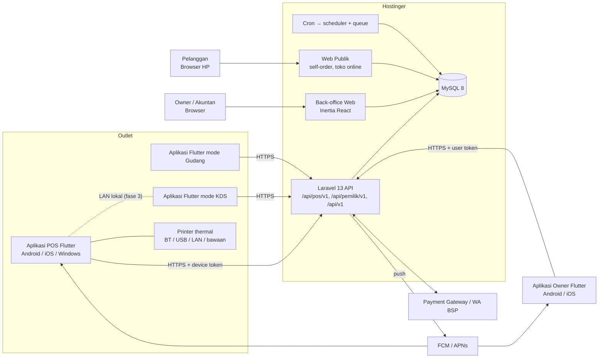

<!-- DIBUAT OTOMATIS dari PRD.md oleh Alat/PecahPrd.py. JANGAN DIEDIT LANGSUNG: ubah PRD.md lalu jalankan ulang skrip. -->

## 13. Arsitektur Teknis

### 13.0 Gambaran Sistem



**Struktur repositori (monorepo, penamaan sesuai §13.7):**

```
/
├── Backend/                     # Laravel 13 (API + back-office Inertia React + web publik)
├── Aplikasi/
│   ├── Kasir/                   # Aplikasi POS Flutter (Android, iOS/iPadOS, Windows)   · paket Dart: kasir
│   └── Pemilik/                 # Aplikasi Owner Flutter (Android, iOS)                  · paket Dart: pemilik
├── Paket/
│   ├── MesinKasir/              # Dart murni: kalkulator keranjang, pajak, promo, pembulatan · mesin_kasir
│   ├── Inti/                    # Uang, format Rupiah, ULID, galat, log                        · inti
│   ├── KlienApi/                # Klien API (dio + DTO freezed) /api/pos/v1 & /api/pemilik/v1    · klien_api
│   ├── SistemDesain/            # Tema, token, widget bersama (TeksUang, LencanaStatus, grafik) · sistem_desain
│   └── AdaptorPerangkat/        # Adaptor hardware: printer, laci, layar pelanggan, scanner      · adaptor_perangkat
├── Spesifikasi/
│   ├── VektorUjiKalkulasi/      # Test vector JSON bersama (dipakai Pest & dart test)
│   ├── OpenApi/                 # Spesifikasi OpenAPI API POS, Owner & publik (dihasilkan dari Laravel)
│   └── TokenDesain/             # Token desain JSON → Tailwind @theme & Flutter ThemeExtension
└── .github/workflows/           # CI backend, CI Flutter, rilis aplikasi, deploy Hostinger (pengecualian)
```

### 13.1 Stack

**A. Backend & Back-office Web**

| Lapisan | Teknologi | Alasan |
|---|---|---|
| Bahasa server | **PHP 8.3** | Didukung Hostinger. Readonly class, typed class constants, enum. |
| Framework | **Laravel 13** | Ekosistem matang: queue, scheduler, policy, event, Sanctum. |
| Database | **MySQL 8** (InnoDB, `utf8mb4_unicode_ci`) | Tersedia di Hostinger. Transaksi ACID, JSON column, generated column. |
| Bridge SPA | **Inertia.js** (versi stabil terbaru yang kompatibel dengan Laravel 13) | Routing & auth tetap di Laravel, tanpa perlu API terpisah untuk halaman back-office. |
| UI | **React 19 + TypeScript** (strict) | Tipe aman, ekosistem luas. |
| Styling | **Tailwind CSS 4** (`@tailwindcss/vite`, konfigurasi CSS-first `@theme`) | Cepat, konsisten, design token. |
| Komponen | **shadcn/ui** (Radix primitives) + **lucide-react** | Aksesibel, bisa dimiliki penuh (copy-in), cocok dengan Tailwind 4. |
| Server state | **TanStack Query v5** | Cache, polling, optimistic update untuk back-office & web publik. |
| Tabel/virtual list | **TanStack Table** + **TanStack Virtual** | Laporan besar & daftar ribuan SKU di back-office. |
| Form & validasi | **react-hook-form** + **zod** (atau `useForm` Inertia untuk form sederhana) | Validasi klien. Server tetap sumber kebenaran (Form Request). |
| Uang/angka | **brick/money** & **brick/math** (PHP), **big.js** (TS, hanya untuk tampilan) | Hindari float. |
| Auth API POS | **Laravel Sanctum** (token perangkat dengan *abilities*) | Aplikasi Flutter tidak memakai cookie sesi. |
| Dokumentasi API | **Scramble** (dedoc/scramble) → OpenAPI 3.1 | Kontrak API POS & publik tersinkron dengan kode. Dipakai untuk generate model Dart. |
| Push notification | **FCM HTTP v1** (Firebase Cloud Messaging, meneruskan ke APNs untuk iOS) via queue | Tidak butuh WebSocket server. Cukup HTTP keluar dari Hostinger. |
| Build | **Vite** | Default Laravel. Build dilakukan di CI, bukan di server hosting. |
| Tipe lintas stack | **spatie/laravel-data** + **typescript-transformer**, **Laravel Wayfinder** (typed route/action untuk TS) | DTO PHP ↔ tipe TS otomatis, route type-safe. |
| Otorisasi | **spatie/laravel-permission** (dengan team = tenant) + Policy | RBAC fleksibel. |
| Audit | **spatie/laravel-activitylog** + tabel audit khusus transaksi | X14. |
| Excel/CSV | **spatie/simple-excel** (OpenSpout, streaming, hemat memori) | Cocok dengan batas memori shared hosting. |
| PDF | **barryvdh/laravel-dompdf** (dokumen ringan: struk A4, PO, invoice) | Tanpa binary eksternal (Chrome/wkhtmltopdf tidak tersedia di shared hosting). |
| Testing | **Pest** (PHP), **Vitest** + Testing Library (TS), **Playwright** (E2E web) | §23. |
| Kualitas kode | **Larastan** (level max bertahap), **Pint**, **Rector**, **ESLint**, **Prettier**, `tsc --noEmit` | CI gate. |
| Monitoring | **Sentry** (PHP, JS, Flutter) atau alternatif, log harian ke file + alert | Visibilitas error produksi. |

**B. Aplikasi POS (Flutter)**

| Lapisan | Teknologi | Alasan |
|---|---|---|
| Framework | **Flutter (channel stable terbaru) + Dart 3** | Satu basis kode untuk Android, iOS/iPadOS, dan Windows (POS) serta Android & iOS (Owner). Performa native, akses hardware penuh. |
| Monorepo Dart | **Melos** (atau Dart pub workspaces) | Mengelola `Aplikasi/*` & `Paket/*`: bootstrap, test, analyze serentak. |
| State management & DI | **Riverpod** (dengan `riverpod_generator`) | Teruji, mudah diuji, mendukung async & dependency override untuk test. |
| Database lokal | **Drift** (SQLite) + `sqlite3_flutter_libs`. Enkripsi opsional **SQLCipher** (`sqlcipher_flutter_libs`) | SQL bertipe, migrasi skema, query reaktif (stream), jalan di semua platform, cepat untuk 10.000+ SKU. |
| HTTP | **dio** + interceptor (auth token, retry, `Idempotency-Key`, log) | Kontrol penuh timeout & retry. |
| Model/serialisasi | **freezed** + **json_serializable** (sebagian digenerate dari OpenAPI) | Immutable, `copyWith`, union type untuk state. |
| Routing | **go_router** | Deep link (misal dari notifikasi), guard login/shift. |
| Uang/angka | Paket **`decimal`** + value object `Uang` sendiri | Konsisten dengan brick/money di server. Dilarang `double` untuk uang. |
| ID | **ULID** (paket `ulid`) | ID dibuat di perangkat untuk offline. |
| Penyimpanan rahasia | **flutter_secure_storage** (Keychain/Keystore/DPAPI) | Device token & kunci enkripsi DB. |
| Konektivitas | **connectivity_plus** + heartbeat ke server | Status online yang sebenarnya, bukan sekadar Wi-Fi tersambung. |
| Background sync | Isolate/timer saat aplikasi aktif. **workmanager** (Android) untuk sinkron saat di latar. iOS terbatas (sinkron saat aplikasi dibuka/aktif) | Sesuai batasan OS. |
| Printer | **esc_pos_utils_plus** (builder perintah ESC/POS) + transport per platform (§17.6) | Struk & tiket dapur. |
| Scanner | Scanner HID (keyboard) via `HardwareKeyboard`, kamera via **mobile_scanner** | Retail & gudang. |
| Layar pelanggan | **desktop_multi_window** (Windows), *presentation display* Android untuk perangkat dual-screen all-in-one | Customer display. |
| Push | **firebase_messaging** | Approval jarak jauh, order baru, pemicu sinkron. |
| Lokalisasi | `flutter_localizations` + `intl` (ARB) | ID default, EN. |
| Crash & log | **sentry_flutter** | Konteks tenant/device, breadcrumb sinkron. |
| Update | Play Store in-app update (Android), App Store (iOS), mekanisme update Windows sesuai kanal distribusi yang dipilih kelak | §14.6. |
| Grafik (Owner) | **fl_chart** (atau setara) | Grafik omzet & tren di Aplikasi Owner. |
| Biometrik (Owner) | **local_auth** | Membuka Aplikasi Owner & konfirmasi approval dengan sidik jari/Face ID. |
| Testing | `flutter_test`, **golden test**, `integration_test` / **Patrol** | §23. |
| Kualitas | `flutter analyze` (lint ketat, `very_good_analysis` atau setara), `dart format`, `custom_lint`/`riverpod_lint` | CI gate. |

### 13.2 Gaya Arsitektur: Modular Monolith Berbasis Domain

Satu aplikasi Laravel, dibagi menjadi modul domain yang mengikuti flow bisnis. Batas antar modul tegas: modul lain hanya boleh memakai **Aksi/Layanan publik** atau **Peristiwa** milik modul tersebut, bukan query langsung ke tabelnya. Semua nama folder, file, class, dan method mengikuti §13.7.

```
Backend/app/
├── Domain/
│   ├── Tenant/           # Tenant, Langganan, Paket, OutletFitur            (F-00, F-19)
│   ├── Organisasi/       # Outlet, Gudang, Perangkat, Pengguna, Peran        (F-02)
│   ├── PanduanAwal/      # Wizard onboarding, TemplateSektor, Importir       (F-01)
│   ├── Katalog/          # Produk, Varian, Satuan, Pilihan, Resep, DaftarHarga (F-03)
│   ├── Pajak/            # JenisPajak, TarifPajak, KalkulatorPajak           (§12)
│   ├── Referensi/        # Wilayah, HariLibur, ReferensiBank, SatuanStandar (dibaca tenant, dikelola lewat P-02)
│   ├── Pembelian/        # Pemasok, PesananPembelian, PenerimaanBarang, FakturPembelian, Hutang (F-04)
│   ├── Persediaan/       # MutasiStok, SaldoStok, TransferStok, StokOpname, Produksi (F-05)
│   ├── Kasir/            # Shift, MutasiKas, SesiPerangkat                   (F-06, F-11)
│   ├── Penjualan/        # Penjualan, PenjualanDetail, Pembayaran, Retur, Void (F-07–F-09)
│   ├── Pemenuhan/        # TiketDapur, Pengiriman, PerintahKerja, TiketLaundry (F-10)
│   ├── Piutang/          # Faktur, Piutang, Penagihan                        (F-12)
│   ├── Akuntansi/        # Akun, Jurnal, AturanPosting, KunciPeriode         (F-13, F-15)
│   ├── Pelanggan/        # Pelanggan, Poin, Deposit, Keanggotaan             (F-16)
│   ├── Promo/            # MesinPromo, Voucher                               (F-16)
│   ├── Kanal/            # PesanSendiri, TokoOnline, Marketplace             (F-17)
│   ├── Karyawan/         # Karyawan, JadwalKerja, Absensi, Komisi            (F-18)
│   ├── Laporan/          # Kueri laporan, tabel ringkasan                    (F-14)
│   ├── Integrasi/        # GerbangPembayaran, WhatsApp, Webhook, ApiPublik   (F-20)
│   ├── Pengelola/        # Platform Pengelola: tim internal, referensi, template, paket, tagihan, dukungan, rilis, mitra (P-01–P-12, §13.8)
│   └── Bersama/          # Uang, Kuantitas, NomorDokumen, ModelDasar, LogAudit
│
│   Di dalam setiap domain:
│   ├── Aksi/             # Satu use case = satu class (SelesaikanPenjualan, PostingPenerimaanBarang), method Jalankan()
│   ├── Data/             # DTO (spatie/laravel-data) → juga jadi tipe TS
│   ├── Enum/             # Status, jenis (backed enum + transisi status)
│   ├── Peristiwa/        # PenjualanSelesai, BarangDiterima, ...
│   ├── Penangan/         # PostingJurnalPenjualan, KurangiStokPenjualan, ...
│   ├── Model/
│   ├── Kebijakan/
│   ├── Kueri/            # Objek kueri untuk laporan/daftar
│   └── Status/           # State machine dokumen
├── Http/                 # (pengecualian nama folder, §13.7.4)
│   ├── Kontroler/Web/          # Kontroler Inertia (return Inertia::render)
│   ├── Kontroler/Internal/     # JSON untuk TanStack Query back-office (session auth)
│   ├── Kontroler/Pos/V1/       # API Aplikasi POS: aktivasi, bootstrap, delta, sinkron (device token)
│   ├── Kontroler/Pemilik/V1/   # API Aplikasi Owner: dasbor, laporan ringkas, persetujuan, notifikasi (user token)
│   ├── Kontroler/Api/V1/       # API publik (token Sanctum)
│   ├── Kontroler/Webhook/      # Gerbang pembayaran, WA gateway
│   ├── Kontroler/Pengelola/    # Platform Pengelola (subdomain pengelola., guard pengelola)
│   ├── Perantara/              # IdentifikasiTenant, PastikanAksesOutlet, PastikanFiturAktif, PastikanLanggananAktif
│   └── Permintaan/             # Form request: SimpanProdukPermintaan, ...
└── Providers/            # (pengecualian)
```

### 13.3 Pola Inti

**Aksi + Peristiwa + Penangan:**

```php
// Backend/app/Domain/Penjualan/Aksi/SelesaikanPenjualan.php
final class SelesaikanPenjualan
{
    public function __construct(
        private readonly KalkulatorPenjualan $kalkulator,
        private readonly GeneratorNomorDokumen $nomorDokumen,
    ) {}

    public function Jalankan(DataSelesaikanPenjualan $data): Penjualan
    {
        return DB::transaction(function () use ($data) {
            // 1. Idempotensi: jika UuidKlien sudah ada, kembalikan Penjualan yang ada
            // 2. Validasi shift, harga, promo (re-kalkulasi server)
            // 3. Simpan Penjualan + PenjualanDetail + PenjualanPembayaran (snapshot harga/pajak/HPP)
            // 4. Picu peristiwa di dalam transaksi (penangan sinkron: stok & jurnal)
            PenjualanSelesai::dispatch($penjualan);
            return $penjualan;
        });
    }
}
```

- Penangan **stok** dan **jurnal** berjalan **sinkron di dalam transaksi DB yang sama** agar tidak ada penjualan tanpa jurnal/stok (konsistensi kuat, karena queue di shared hosting tidak real-time).
- Penangan non-kritis (notifikasi WA, update poin agregat, webhook keluar, ringkasan laporan) memakai **queue** (`ShouldQueue` + `afterCommit`).

**State machine dokumen:** backed enum dengan method `BisaBerubahKe()`, dan setiap transisi dicatat di tabel `RiwayatStatusDokumen`.

**Idempotensi:** semua endpoint mutasi dari POS menerima header `Idempotency-Key` (= `UuidKlien`). Unique index `(IdTenant, UuidKlien)`.

**Konkurensi stok:** update `SaldoStok` memakai `SELECT ... FOR UPDATE` per (produk, gudang), dengan urutan penguncian konsisten (urut `IdProduk`) untuk menghindari deadlock. Nomor dokumen server-side memakai tabel `NomorUrutDokumen` dengan row lock.

### 13.4 Multi-Tenancy

**Strategi: single database, shared schema, kolom `IdTenant`.**

Alasan: di Hostinger jumlah database MySQL per akun terbatas dan pembuatan database tidak bisa diotomatisasi dengan mudah dari aplikasi. Model ini paling murah dan paling sederhana di-backup.

Implementasi:
- Semua tabel milik tenant punya `IdTenant BIGINT UNSIGNED NOT NULL` + indeks komposit yang **diawali `IdTenant`**.
- Trait `MilikTenant`: global scope `where IdTenant = Sekarang()`, dan otomatis mengisi `IdTenant` saat `creating`.
- `KonteksTenant` di-resolve oleh perantara `IdentifikasiTenant` dari **sesi user** (back-office, tenant aktif), **device token** (Aplikasi POS: tenant & outlet perangkat), **token API** (tenant pemilik token), **user token** (Aplikasi Owner: user + tenant aktif yang dipilih, dengan pengecekan akses outlet), atau **slug** (self-order/toko online publik).
- Job queue membawa `IdTenant` (middleware job `DenganTenant`) sehingga scope tetap aktif di worker.
- **Guard ganda:** test otomatis "isolasi tenant" untuk setiap model/endpoint (user tenant A tidak bisa membaca/mengubah data tenant B, termasuk via ID yang ditebak). Route model binding selalu lewat scope tenant.
- ID publik di URL memakai **ULID/UUID**, bukan auto-increment, untuk mencegah enumerasi.
- Jalur migrasi masa depan: tenant enterprise bisa dipindah ke database terdedikasi (VPS) karena `IdTenant` sudah ada di semua tabel.

### 13.5 Pembagian Tugas Klien

| Kebutuhan | Klien | Pendekatan |
|---|---|---|
| Kasir, open bill, pembayaran, shift, struk | **Aplikasi Flutter** | Drift (SQLite) sebagai sumber data lokal + outbox, sinkron ke `/api/pos/v1` (§18) |
| KDS, antrian dapur | **Aplikasi Flutter** (mode KDS) | Polling delta 5 detik + push sebagai pemicu. Mode LAN di fase 3 |
| Operasional gudang (terima barang, transfer, opname via scan) | **Aplikasi Flutter** (mode Gudang) | Online-first dengan draft lokal. Posting saat online |
| Dashboard owner, approval jarak jauh, notifikasi, aksi cepat | **Aplikasi Owner (Flutter)** | Online-first + cache lokal ringan (Drift) untuk dibuka cepat & dibaca saat sinyal lemah. `/api/pemilik/v1` |
| Navigasi halaman back-office, form CRUD, pengaturan | **Web (Inertia)** | Props dari controller, `useForm`, partial reload, deferred props |
| Tabel laporan besar dengan filter/pagination server | **Web (TanStack Query)** | `placeholderData: keepPreviousData` + TanStack Table, endpoint `/internal/laporan/*` |
| Data back-office yang di-polling (dashboard, notifikasi) | **Web (TanStack Query)** | `refetchInterval` adaptif |
| Pencarian/autocomplete di back-office | **Web (TanStack Query)** | Debounce |
| Self-order, toko online, struk digital | **Web publik (React ringan)** | TanStack Query. Kalkulasi harga lewat server |

Endpoint `/internal/*` memakai **autentikasi sesi** (cookie + CSRF, Sanctum SPA stateful). Endpoint `/api/pos/v1/*` memakai **device token** (Bearer). Endpoint `/api/pemilik/v1/*` memakai **user token** (Sanctum, masa berlaku terbatas + refresh, dicabut saat logout/ganti password).

### 13.6 Struktur Rute

```
/                         Landing (marketing)
/daftar, /masuk, /lupa-kata-sandi, ...   Autentikasi
/kelola/...                     Back-office (Inertia), prefix per modul: /kelola/produk, /kelola/stok-opname, /kelola/laporan/penjualan
/unduh                          Halaman unduh aplikasi POS & Owner (link store + installer Windows)
/internal/...                   JSON untuk TanStack Query back-office (session auth)
/api/pos/v1/...                 API Aplikasi POS Flutter (device token)
/api/pemilik/v1/...             API Aplikasi Owner (user token)
/api/v1/...                     API publik (token)
/webhook/{penyedia}             Webhook masuk (signature diverifikasi)
/sehat                          Health check (dikonfigurasi di bootstrap/app.php, pengganti /up)
/s/{kodeStruk}                  Struk digital
/{slugTenant}                   Toko online publik
/{slugTenant}/meja/{tokenMeja}  Self-order meja
/{slugTenant}/reservasi         Booking layanan
pengelola.{{app}}.id           Platform Pengelola (tim internal, §13.8)
/mitra                          Portal mitra/reseller (fase 3)
```

### 13.7 Konvensi Penamaan: Bahasa Indonesia + PascalCase (Keputusan D-05)

#### 13.7.1 Aturan Utama

**Database, folder, file, dan function/method memakai Bahasa Indonesia dengan PascalCase**, di semua komponen: Backend Laravel, back-office React, Aplikasi Kasir, dan Aplikasi Pemilik (Flutter).

| Objek | Aturan | Contoh |
|---|---|---|
| Nama tabel (MySQL & SQLite lokal) | PascalCase, kata benda **tunggal** | `Penjualan`, `PenjualanDetail`, `MutasiStok`, `SaldoStok` |
| Nama kolom | PascalCase | `Id`, `Uuid`, `IdOutlet`, `TanggalBisnis`, `TotalAkhir`, `DibuatPada` |
| Primary key / foreign key | `Id` / `Id{Tabel}` (+ peran bila perlu) | `IdPenjualan`, `IdGudangAsal` |
| Indeks & constraint | `Idx…`, `Uniq…`, `Fk…` + PascalCase | `UniqPenjualanIdTenantUuidKlien` |
| Folder | PascalCase | `Domain/Penjualan/Aksi/`, `Fitur/Keranjang/` |
| File | PascalCase, sama dengan nama class/komponen utama di dalamnya | `SelesaikanPenjualan.php`, `KalkulatorKeranjang.dart`, `FormProduk.tsx` |
| Function / method | PascalCase, diawali **kata kerja** | `Jalankan()`, `HitungTotal()`, `SimpanPenjualan()`, `AmbilSaldoStok()` |
| Class / komponen React / widget Flutter | PascalCase, kata benda | `KalkulatorPenjualan`, `TabelData`, `LayarPembayaran` |
| Relasi Eloquent | PascalCase, nama objek relasi | `Outlet()`, `Detail()`, `Pembayaran()` |
| Enum & nilainya | PascalCase | `enum StatusPenjualan { Draf, Ditahan, Lunas, Void }` |
| Migration | Stempel waktu Laravel + PascalCase | `2026_10_01_000000_BuatTabelPenjualan.php` |
| Key JSON API & properti DTO | PascalCase, **sama persis dengan nama kolom** agar tidak ada lapisan pemetaan | `{"TotalAkhir": "63500.00", "IdOutlet": "01J…"}` |
| Variabel lokal & parameter | camelCase Bahasa Indonesia | `$totalBayar`, `jumlahItem` |
| **URL / endpoint** (D-06) | Bahasa Indonesia, **huruf kecil kebab-case**, kata benda tunggal, aksi sebagai sub-segmen kata kerja | `/kelola/produk`, `/api/pos/v1/sinkron/kirim`, `/api/pemilik/v1/persetujuan/{id}/setujui` |
| Parameter route & query | Parameter route camelCase (`{idOutlet}`, `{slugTenant}`), query huruf kecil (`?sejak=`, `?kata=`, `saring[...]`, `urut=`) | `/internal/outlet/{idOutlet}/perangkat?sejak=…` |
| Nama route Laravel | Titik + kebab-case Indonesia | `kelola.produk.daftar`, `pos.sinkron.kirim` |
| Scope token API | `{objek}:{aksi}` | `produk:baca`, `stok:tulis` |
| Nama permission | `{modul}.{objek}.{aksi}` huruf kecil kebab-case | `penjualan.void`, `produk.harga.ubah`, `laporan.keuangan.lihat` |
| Nama event webhook | `{objek}.{kata-kerja-pasif}` huruf kecil kebab-case | `penjualan.selesai`, `stok.menipis`, `pesanan-pembelian.disetujui` |
| Header HTTP kustom | `X-` + kata Indonesia, Title-Case dengan tanda hubung | `X-Id-Kasir`, `X-Versi-Aplikasi`, `X-Skema-Sinkron`, `X-Tanda-Tangan` |

**Kamus istilah** (satu istilah untuk satu konsep, dipakai konsisten di tabel, class, dan UI):

| Konsep | Nama | Konsep | Nama |
|---|---|---|---|
| tenant | `Tenant` (serapan) | sale / sale line | `Penjualan` / `PenjualanDetail` |
| outlet | `Outlet` (serapan) | payment | `PenjualanPembayaran`, `Pembayaran` |
| warehouse / location | `Gudang` | sale return / void | `ReturPenjualan` / `VoidPenjualan` |
| device | `Perangkat` | shift | `Shift` (serapan) |
| hardware | `PerangkatKeras` | cash movement | `MutasiKas` |
| user / role / permission | `Pengguna` / `Peran` / `Izin` | stock level / stock movement | `SaldoStok` / `MutasiStok` |
| product / category / unit | `Produk` / `Kategori` / `Satuan` | stock transfer / opname / adjustment | `TransferStok` / `StokOpname` / `PenyesuaianStok` |
| modifier group / modifier | `KelompokPilihan` / `Pilihan` | recipe / production | `Resep` / `Produksi` |
| price list / price history | `DaftarHarga` / `RiwayatHarga` | supplier | `Pemasok` |
| customer | `Pelanggan` | purchase order | `PesananPembelian` |
| promotion / voucher | `Promo` / `Voucher` | goods receipt | `PenerimaanBarang` |
| loyalty points / deposit | `MutasiPoin` / `MutasiDeposit` | purchase invoice | `FakturPembelian` |
| employee / attendance / commission | `Karyawan` / `Absensi` / `Komisi` | receivable / payable | `Piutang` / `Hutang` |
| account / journal / journal line | `Akun` / `Jurnal` / `JurnalDetail` | account mapping / posting rule | `PemetaanAkun` / `AturanPosting` |
| tax type / rate / group | `JenisPajak` / `TarifPajak` / `KelompokPajak` | period lock | `KunciPeriode` |
| approval | `Persetujuan` | audit log | `LogAudit` |
| subscription / plan | `Langganan` / `Paket` | document number sequence | `NomorUrutDokumen` |
| table (resto) / table area | `Meja` / `AreaMeja` | kitchen station / ticket | `StasiunDapur` / `TiketDapur` |
| booking / work order | `Reservasi` / `PerintahKerja` | daily summary | `RingkasanPenjualanHarian` |
| sync / outbox | `Sinkron` / `Outbox` (serapan) | action / event / listener | `Aksi` / `Peristiwa` / `Penangan` |
| controller / middleware / request | `Kontroler` / `Perantara` / `Permintaan` | policy / query / service | `Kebijakan` / `Kueri` / `Layanan` |
| job | `Tugas` | repository | `Repositori` |
| Owner app | `Pemilik` (folder `Aplikasi/Pemilik`) | POS app | `Kasir` (folder `Aplikasi/Kasir`) |

Pola penamaan class per jenis (**{Objek}{Jenis}**, agar file satu domain berdekatan saat diurutkan):
`PenjualanKontroler`, `PenjualanKebijakan`, `SimpanProdukPermintaan`, `ProdukRespons`, `KirimStrukWaTugas`. Pengecualian: class **Aksi** dan **Peristiwa** memakai kalimat langsung, misal Aksi `SelesaikanPenjualan`, Peristiwa `PenjualanSelesai`, Penangan `KurangiStokPenjualan`.

#### 13.7.2 Contoh Backend (Laravel)

```php
// Backend/app/Domain/Bersama/Model/ModelDasar.php
abstract class ModelDasar extends Model
{
    protected $primaryKey = 'Id';
    const CREATED_AT = 'DibuatPada';
    const UPDATED_AT = 'DiubahPada';
    const DELETED_AT = 'DihapusPada';

    // hasMany() menebak foreign key "Id{NamaModel}", misal IdPenjualan
    public function getForeignKey(): string
    {
        return 'Id' . class_basename($this);
    }
}

// Backend/app/Domain/Penjualan/Model/Penjualan.php
final class Penjualan extends ModelDasar
{
    use MilikTenant;                       // global scope IdTenant
    protected $table = 'Penjualan';

    public function Outlet(): BelongsTo
    {
        return $this->belongsTo(Outlet::class, 'IdOutlet', 'Id');   // selalu eksplisit
    }

    public function Detail(): HasMany
    {
        return $this->hasMany(PenjualanDetail::class);            // → IdPenjualan
    }

    public function HitungSisaTagihan(): Uang
    {
        return Uang::Dari($this->TotalAkhir)->Kurangi($this->TotalDibayar);
    }
}

// Backend/database/migrations/2026_10_01_000000_BuatTabelPenjualan.php
return new class extends Migration {
    public function up(): void                       // up/down: wajib oleh Laravel
    {
        Schema::create('Penjualan', function (Blueprint $tabel) {
            $tabel->id('Id');
            $tabel->char('Uuid', 26)->unique('UniqPenjualanUuid');
            $tabel->foreignId('IdTenant')->constrained('Tenant', 'Id');
            $tabel->foreignId('IdOutlet')->constrained('Outlet', 'Id');
            $tabel->char('UuidKlien', 26);
            $tabel->date('TanggalBisnis');
            $tabel->decimal('TotalAkhir', 18, 2);
            $tabel->WaktuStandar();                  // macro Blueprint: DibuatPada, DiubahPada
            $tabel->unique(['IdTenant', 'UuidKlien'], 'UniqPenjualanIdTenantUuidKlien');
            $tabel->index(['IdTenant', 'IdOutlet', 'TanggalBisnis'], 'IdxPenjualanTenantOutletTanggal');
        });
    }
};
```

#### 13.7.3 Contoh Flutter & React

```dart
// Aplikasi/Kasir/lib/Fitur/Keranjang/KalkulatorKeranjang.dart
class KalkulatorKeranjang {
  Uang HitungSubtotal(List<ItemKeranjang> daftarItem) { ... }
  Uang HitungPajak(Uang dasarPengenaan, TarifPajak tarif) { ... }
}

// Aplikasi/Kasir/lib/Data/Db/Tabel/Produk.dart  (Drift, build.yaml: case_from_dart_to_sql: preserve)
class Produk extends Table {
  IntColumn get Id => integer().autoIncrement()();
  TextColumn get Nama => text()();
  TextColumn get HargaDasar => text()();   // decimal disimpan sebagai string
}
```

```tsx
// Backend/resources/js/Halaman/Katalog/Produk/Daftar.tsx
export default function Daftar({ Filter }: Props) {
  const { data } = useDaftarProduk(Filter);          // hook wajib diawali "use" (aturan React)
  return <TabelData Kolom={KolomProduk} Data={data?.Data ?? []} />;
}

// Backend/resources/js/Pustaka/Format.ts
export function FormatRupiah(nilai: string): string { ... }
```

#### 13.7.4 Pengecualian (Wajib oleh Framework, Bahasa, atau Alat)

Nama-nama berikut **tidak** diubah karena diwajibkan oleh framework/alat, dan mengubahnya akan merusak build atau fitur bawaan:

| Area | Pengecualian | Alasan |
|---|---|---|
| Folder root Laravel & Composer | `app/`, `bootstrap/`, `config/`, `database/`, `routes/`, `resources/`, `public/`, `storage/`, `tests/`, `vendor/`, `lang/`, `app/Http/`, `app/Providers/`, `app/Console/` | Konvensi & path bawaan Laravel/Composer/Artisan |
| File konfigurasi | `composer.json`, `package.json`, `vite.config.ts`, `tsconfig.json`, `phpunit.xml`, `.env`, `config/*.php`, `routes/web.php`, `routes/api.php`, `routes/console.php`, `bootstrap/app.php`, `pubspec.yaml`, `analysis_options.yaml`, `build.yaml`, `l10n.yaml`, `pubspec.lock`, `.github/workflows/*`, test Dart `*_test.dart` (akhiran wajib `flutter test`, misal `Uang_test.dart`) | Nama dicari otomatis oleh alat masing-masing. File route tambahan boleh PascalCase: `routes/Pos.php`, `routes/Pemilik.php` |
| Method hook framework (PHP) | `up`, `down`, `handle`, `boot`, `register`, `rules`, `authorize`, `messages`, `toArray`, `casts`, `render`, `broadcastOn`, `via`, `toMail`, `__construct`, `__invoke` | Dipanggil otomatis oleh Laravel/PHP |
| Method hook framework (Flutter/Dart) | `main`, `build`, `createState`, `initState`, `dispose`, `didChangeDependencies`, `toJson`, `fromJson`, `copyWith`, `==`, `hashCode`, `toString` | Dipanggil/digenerate oleh Dart, Flutter, freezed, json_serializable |
| Hook React | Awalan `use` (camelCase): `useDaftarProduk`, `useKeranjang` | Aturan React Hooks & lint `react-hooks` mendeteksi hook dari awalan `use` |
| Nama paket Dart (`name:` di pubspec) | huruf kecil + underscore: `kasir`, `pemilik`, `mesin_kasir`, `inti`, `klien_api`, `sistem_desain`, `adaptor_perangkat` | Syarat wajib Dart pub. **Folder** paket tetap PascalCase |
| Folder wajib Flutter | `lib/`, `test/`, `integration_test/`, `android/`, `ios/`, `windows/`, `assets/` | Path bawaan Flutter tooling & platform |
| Tabel bawaan framework/paket | `migrations`, `jobs`, `job_batches`, `failed_jobs`, `cache`, `cache_locks`, `sessions`, `password_reset_tokens`, `personal_access_tokens`, tabel spatie (`roles`, `permissions`, `model_has_roles`, `activity_log`, dsb.) | Dikelola paket. Mengganti nama menambah risiko upgrade. Dapat ditinjau ulang kelak |
| Nama yang diwajibkan alat AI & GitHub | Nama skill & subagent Claude Code (`.claude/skills/mulai-flow/SKILL.md`, `.claude/agents/penjaga-konvensi.md`: huruf kecil + tanda hubung), `.github/pull_request_template.md`, `.github/CODEOWNERS`, `.github/workflows/` | Format nama ditentukan Claude Code & GitHub |
| Kode hasil generate & vendor | `*.g.dart`, `*.freezed.dart`, provider Riverpod hasil generate, file shadcn/ui hasil CLI, tipe TS hasil generate | Dibuat ulang oleh alat. Tidak diedit manual |
| Header HTTP standar | `Idempotency-Key`, `Authorization`, `Content-Type`, `X-Frame-Options`, `Referrer-Policy`, nama field OpenAPI standar | Standar protokol. Header **kustom** tetap berbahasa Indonesia (§13.7.1) |
| Bagian URL yang merupakan standar/akronim | `/api`, versi `/v1`, akronim `pos`, `kds`, `qris`, `otp`, serta segmen serapan `internal`, `admin`, `webhook`, `tenant`, `outlet` | Standar umum atau sudah menjadi kata serapan |

#### 13.7.5 Konfigurasi agar Konvensi Berjalan

| Stack | Pengaturan |
|---|---|
| Laravel | `ModelDasar` (PK `Id`, `DibuatPada`/`DiubahPada`/`DihapusPada`, `getForeignKey()`), macro Blueprint `WaktuStandar()`, `UuidPublik()` & `IdTenant()` (bukan `Uuid()`: nama method PHP tidak peka huruf besar sehingga bentrok dengan `uuid()` bawaan), relasi `belongsTo` selalu menyebut kolom eksplisit, `phpunit.xml` suffix test `Tes.php` (misal `SelesaikanPenjualanTes.php`), aturan Pint/PHPStan untuk nama method PascalCase |
| spatie/laravel-data | Tidak memakai mapper `snake_case`. Properti DTO = nama kolom PascalCase, sehingga JSON API PascalCase |
| React/TypeScript | Resolver Inertia diarahkan ke `./Halaman/**/*.tsx`, entry Vite `resources/js/Aplikasi.tsx`, alias `@/` ke `resources/js`, ESLint `@typescript-eslint/naming-convention` (function PascalCase, pengecualian `use*`), `components.json` shadcn diarahkan ke `Komponen/Ui` |
| Flutter/Dart | `analysis_options.yaml`: nonaktifkan lint `file_names`, `non_constant_identifier_names`, dan `constant_identifier_names` (nilai enum PascalCase). Drift `build.yaml`: `case_from_dart_to_sql: preserve`. `json_serializable`: `field_rename: none` (key JSON = nama field PascalCase). Flavor entrypoint `lib/UtamaDev.dart`, `lib/UtamaStaging.dart`, `lib/UtamaProduksi.dart` (fungsi `main()` di dalamnya tetap `main`). Satu ruang kerja pub (`workspace:`) di `pubspec.yaml` akar dengan satu `pubspec.lock`; skrip melos (`melos run periksa`) di bagian `melos:` pubspec akar |
| MySQL | **Nama tabel case-sensitive di Linux** (Hostinger: `lower_case_table_names = 0`). Query harus memakai huruf besar/kecil persis. Lingkungan dev **wajib** MySQL Linux (Docker/WSL2), bukan MySQL bawaan Windows/macOS yang mengubah nama tabel jadi huruf kecil. CI punya test yang membandingkan `SHOW TABLES` dengan daftar nama PascalCase yang diharapkan |
| Review kode | Checklist PR: nama baru mengikuti kamus istilah §13.7.1. Istilah baru ditambahkan ke kamus dulu |

#### 13.7.6 Konsekuensi yang Diterima

- Contoh dan dokumentasi Laravel/Flutter umumnya berbahasa Inggris dan snake_case/camelCase, sehingga developer baru perlu adaptasi. Kamus istilah dan `ModelDasar` mengurangi gesekan.
- Beberapa perilaku "otomatis" Laravel (tebakan nama tabel, foreign key, timestamp) diganti konfigurasi eksplisit di `ModelDasar`.
- Nama tabel case-sensitive menuntut disiplin lingkungan dev (MySQL Linux).
- Lint bawaan Dart & TS perlu disesuaikan. Hasil analisis statis tetap dijaga ketat untuk aturan lain.

### 13.8 Arsitektur Platform Pengelola

Platform Pengelola berada di aplikasi Laravel yang sama (satu kode, satu database) tetapi **dipisahkan tegas** dari area tenant.

| Aspek | Tenant (back-office) | Platform Pengelola |
|---|---|---|
| Alamat | `https://{{app}}.id/kelola/...` | `https://pengelola.{{app}}.id` (subdomain Hostinger) |
| Tabel akun | `Pengguna` | `PenggunaPengelola` |
| Guard autentikasi | `web` (sesi tenant) | `pengelola` (sesi terpisah, cookie berbeda) |
| 2FA | Wajib untuk Owner/Admin di paket Bisnis | **Wajib untuk semua akun** |
| Scope data | Selalu dibatasi `MilikTenant` (satu tenant) | Lintas tenant, **hanya lewat layanan `Pengelola`** yang diaudit |
| Entry frontend | `resources/js/Aplikasi.tsx` | `resources/js/Pengelola.tsx` (bundle terpisah, kode pengelola tidak pernah terkirim ke browser tenant) |
| Layout | `TataLetakAplikasi` | `TataLetakPengelola` (warna berbeda, penanda lingkungan staging/produksi) |

**Struktur kode:**

```
Backend/app/Domain/Pengelola/
├── TimInternal/        # PenggunaPengelola, PeranPengelola, LogAuditPengelola        (P-01)
├── Referensi/          # Aksi kelola/ajukan/setujui data referensi (P-02); modelnya di Domain/Referensi & Domain/Pajak
├── TemplateSektor/     # TemplateSektor, TemplateSektorVersi, ValidatorTemplate, Sandbox (P-03)
├── Katalog/            # Fitur, Paket, Addon, KuponLangganan, EvaluatorFitur          (P-04)
├── Integrasi/          # KonfigurasiIntegrasi, UjiKoneksi                              (P-05)
├── Konten/             # DokumenLegal, TemplatePesan, ArtikelBantuan                   (P-06)
├── Tenant/             # Tampilan360, OverrideTenant, SkorKesehatan, PenghapusanData   (P-07)
├── Tagihan/            # TagihanLangganan, PembayaranLangganan, Dunning, LaporanMrr    (P-08)
├── Dukungan/           # TiketDukungan, AksesDukungan, AlatBantu                       (P-09)
├── Rilis/              # RilisAplikasi, FlagFitur, Pengumuman                          (P-10)
├── Operasional/        # DasborOperasional, Insiden, Alert                             (P-11)
└── Mitra/              # Mitra, AtribusiMitra, KomisiMitra, PencairanKomisi            (P-12)

Backend/app/Http/Kontroler/Pengelola/      # Kontroler Inertia untuk pengelola
Backend/routes/Pengelola.php               # rute subdomain pengelola
Backend/resources/js/Halaman/Pengelola/    # halaman Inertia pengelola
```

**Aturan keamanan arsitektur:**
- Melewati scope `MilikTenant` hanya boleh dilakukan melalui `KonteksPengelola::JalankanLintasTenant(alasan, fn)`, yang **mencatat audit** setiap pemanggilan. Aturan ini ditegakkan dengan **test arsitektur Pest** (`arch()`): kelas di luar `App\Domain\Pengelola` dilarang memanggilnya.
- Perantara rute pengelola: `PastikanPenggunaPengelola`, `WajibDuaFaktor`, `BatasiIpPengelola` (opsional), `CatatAuditPengelola`.
- Akses dukungan (P-09) diimplementasikan sebagai **sesi tenant terbatas** yang dibuat dari izin `AksesDukungan` (bukan login memakai akun Owner), dengan cakupan dan waktu berakhir yang ditegakkan oleh perantara.
- Hostinger mendukung subdomain. Subdomain `pengelola.` diarahkan ke folder `public` yang sama, dan rute dibedakan dengan `Route::domain()`.
