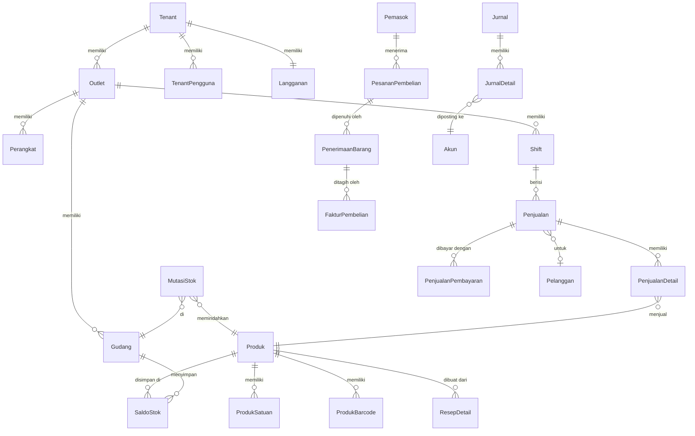

<!-- DIBUAT OTOMATIS dari PRD.md oleh Alat/PecahPrd.py. JANGAN DIEDIT LANGSUNG: ubah PRD.md lalu jalankan ulang skrip. -->

## 15. Model Data (Skema Database)

> Semua nama tabel dan kolom memakai **Bahasa Indonesia, PascalCase, bentuk tunggal** (keputusan D-05, aturan lengkap di §13.7). Contoh: tabel `Penjualan`, kolom `IdOutlet`, `TanggalBisnis`, `TotalAkhir`.

### 15.1 Konvensi

- PK `Id BIGINT UNSIGNED AUTO_INCREMENT` (internal) + `Uuid CHAR(26)` ULID (publik, offline, dan API).
- Foreign key: `Id` + nama tabel rujukan, misal `IdTenant`, `IdOutlet`, `IdProduk`. Jika satu tabel merujuk tabel yang sama dua kali, tambahkan peran: `IdGudangAsal`, `IdGudangTujuan`.
- `IdTenant` di semua tabel milik tenant. Indeks komposit diawali `IdTenant`.
- Nama indeks: `Idx{Tabel}{Kolom...}`, unique: `Uniq{Tabel}{Kolom...}`, foreign key: `Fk{Tabel}{Kolom}`. Contoh: `IdxPenjualanIdTenantIdOutletTanggalBisnis`. Jika melebihi 64 karakter (batas MySQL), singkat secara konsisten.
- Uang: `DECIMAL(18,2)`. Harga pokok per unit: `DECIMAL(19,6)`. Jumlah (qty): `DECIMAL(18,4)`. Persen/tarif: `DECIMAL(9,6)`.
- Waktu: `TIMESTAMP` UTC + `TanggalBisnis DATE` (tanggal bisnis menurut zona waktu outlet & jam tutup buku, misal kafe yang tutup jam 02:00 tetap masuk tanggal kemarin).
- Kolom waktu standar: `DibuatPada`, `DiubahPada`, `DihapusPada` (soft delete, **hanya** untuk master data). Dokumen transaksi tidak pernah dihapus.
- Kolom boolean diawali `Is`/`Apakah` **tidak** dipakai. Gunakan kata sifat/status yang jelas: `Aktif`, `Pkp`, `Otomatis`, `BolehMinus`.
- Kolom snapshot (nama produk, harga, pajak) di baris transaksi agar laporan historis stabil.
- `DibuatOleh`, `DiubahOleh`, `IdPerangkat` di dokumen transaksi.
- Tabel detail memakai pola `{Induk}Detail` (misal `PenjualanDetail`, `JurnalDetail`) agar berurutan dengan induknya saat diurutkan.

### 15.2 ERD Inti

### 15.3 Tabel Utama (ringkas)

**Tenancy & Organisasi**

| Tabel | Kolom kunci |
|---|---|
| `Tenant` | Id, Uuid, Nama, Slug (unik), Npwp, Pkp, ZonaWaktu, Pengaturan JSON, Status (Aktif; status penghapusan data ditambah P-07), Penanda (Uji/Demo/Internal, null = tenant biasa; P-07 BR-P07.8) |
| `Paket` / `PaketFitur` | Kode, Nama, Status (Draf/Aktif/Diarsipkan), HargaNegosiasi, MasaTrialHari, BatasOutlet, BatasPerangkatPerOutlet, BatasPengguna, BatasSku, KuotaPesanWaBulanan, BatasPenyimpananMb (batas `null` = tak terbatas), Urutan / IdPaket, KunciFitur |
| `HargaPaket` | IdPaket, HargaBulanan, HargaTahunan (decimal 18,2), BerlakuMulai, BerlakuSampai, TerapkanKePelangganLama, Status (Draf/MenungguTinjauan/Terbit), IdPenggunaPengelolaPengaju, DiajukanPada, PutaranTinjauan, DaftarIdPenyusun JSON. Harga paket hanya ada di tabel ini (berversi, BR-P04.1) |
| `Langganan` | IdTenant (unik), IdPaket, Status (Trial/Aktif/Tertunggak/Ditangguhkan/Berhenti/Gratis), StatusSebelumDitangguhkan (diisi saat tangguhkan manual, P-07 BR-P07.4), TrialBerakhirPada, PeriodeMulai, PeriodeSelesai, SiklusTagihan (Bulanan/Tahunan) |
| `TagihanLangganan` | IdTenant, Nomor, Jumlah, Status, DibayarPada, RefGateway. Rincian P-08 Fase 0: `Jumlah` disimpan sebagai `Total`; Jenis (Aktivasi/Perpanjangan), IdPaket, IdHargaPaket (snapshot), Siklus, JumlahBulan, Subtotal, IdKuponLangganan, KodeKupon, Diskon, IdTarifPajak, TarifPpn, PengaliDppPembilang/PengaliDppPenyebut, DasarPengenaanPajak, JumlahPpn, TerbitPada, JatuhTempoPada, DibatalkanPada, AlasanBatal, PeriodeMulai, PeriodeSelesai, MulaiLanggananPaket (jangkar grandfathering), IdPenggunaPembuat. `MilikTenant`; angka tidak berubah setelah terbit, tidak pernah dihapus. Penghitung nomor: `NomorUrutTagihanLangganan` (Tahun unik, NomorTerakhir) |
| `Pengguna` | Id, Uuid, Nama, Email, NoHp, KataSandi, Rahasia2fa, KodePemulihan2fa (terenkripsi), DuaFaktorAktifPada (BR-00.8) |
| `TenantPengguna` | IdTenant, IdPengguna, Pemilik, HashPin, Status |
| `Merek` | IdTenant, Nama |
| `Outlet` | IdTenant, IdMerek, Kode, Nama, Alamat, KodeKota, ZonaWaktu, TemplateSektor, JamTutupBuku (misal 04:00), ProfilPajak JSON |
| `OutletFitur` | IdTenant, IdOutlet, KunciFitur, Aktif, Konfigurasi JSON |
| `Gudang` | IdTenant, IdOutlet, Kode, Nama, Jenis (Toko/Dapur/Bar/Gudang/Rusak/DalamPerjalanan) |
| `Perangkat` | IdTenant, IdOutlet, Uuid, Kode, Nama, Jenis (Kasir/Kds/Gudang/Pelayan/Salesman), Platform (Android/Ios/Windows), VersiOs, VersiAplikasi, VersiSkemaSinkron, TokenPush, ProfilHardware JSON (printer, laci, layar kedua), TerakhirAktifPada, JumlahOutboxTertunda, DicabutPada |
| `PerangkatPengguna` | IdPengguna, IdTenant, Aplikasi (Owner/Pos), Platform (Android/Ios/Windows), TokenPush, VersiAplikasi, TerakhirAktifPada, DicabutPada |
| `KodeAktivasi` | IdTenant, IdOutlet, IdPerangkat, HashKode, KedaluwarsaPada, DipakaiPada |
| `RilisAplikasi` | Aplikasi (Pos/Owner), Platform, Kanal (Beta/Stabil), Versi, Build, VersiMinimum, UrlUnduh, CatatanRilis, PersenRollout |
| `OutletPengguna` | IdTenant, IdOutlet, IdPengguna, IdPeran |

**Katalog & Harga**

| Tabel | Kolom kunci |
|---|---|
| `Kategori` | IdTenant, IdInduk, Nama, IdStasiunDapur, Urutan |
| `Produk` | IdTenant, Uuid, Sku, Nama, NamaStruk, Jenis, IdKategori, Merek, IdSatuanDasar, Pelacakan (Tidak/Batch/Seri), IdKelompokPajak, MetodeHpp, BolehMinus, Aktif, TampilDiPos, TampilOnline, IdInduk (varian), AtributVarian JSON |
| `Satuan` | IdTenant, Nama, Simbol, BolehDesimal |
| `ProdukSatuan` | IdProduk, IdSatuan, KonversiKeDasar, DefaultJual, DefaultBeli |
| `ProdukBarcode` | IdTenant, IdProduk, IdProdukSatuan, Barcode (unik per tenant) |
| `ProdukHarga` | IdTenant, IdProduk, IdProdukSatuan, IdDaftarHarga (null = dasar), JumlahMinimum, Harga |
| `DaftarHarga` | IdTenant, Nama, IdOutlet JSON, Kanal, TierPelanggan, MulaiPada, SelesaiPada, Prioritas |
| `KelompokPilihan` / `Pilihan` (modifier) | MinimalPilih, MaksimalPilih / Nama, Harga, IdProduk (bahan, opsional), Jumlah |
| `ProdukKelompokPilihan` | IdProduk, IdKelompokPilihan, Urutan |
| `Resep` / `ResepDetail` | IdProduk, JumlahHasil, Versi / IdProdukBahan, Jumlah, IdSatuan, PersenSusut |
| `PaketProdukDetail` (bundle) | IdProdukPaket, IdProdukKomponen, Jumlah, AlokasiHarga |
| `RiwayatHarga` | IdProduk, HargaLama, HargaBaru, DiubahOleh |

**Inventori**

| Tabel | Kolom kunci |
|---|---|
| `SaldoStok` | IdTenant, IdProduk, IdGudang, JumlahTersedia, JumlahDipesan, HppRataRata, DiubahPada. **Unik (IdTenant, IdProduk, IdGudang)** |
| `MutasiStok` | IdTenant, IdProduk, IdGudang, IdBatch, IdNomorSeri, JenisMutasi, Jumlah (±, satuan dasar), HppSatuan, TotalHpp, SaldoSetelah, JenisReferensi, IdReferensi, TanggalBisnis, DibuatOleh |
| `BatchStok` | IdProduk, IdGudang, NomorBatch, TanggalKedaluwarsa, JumlahSisa, HppSatuan |
| `NomorSeri` | IdProduk, Nomor, Status, IdGudang, IdPenjualanDetail |
| `TransferStok` / `TransferStokDetail` | IdGudangAsal, IdGudangTujuan, Status, DikirimPada, DiterimaPada / JumlahDikirim, JumlahDiterima |
| `StokOpname` / `StokOpnameDetail` | IdGudang, Status, HitungButa, SnapshotPada / JumlahSistem, JumlahFisik, Selisih, DihitungOleh |
| `PenyesuaianStok` / `PenyesuaianStokDetail` | KodeAlasan, Status, DisetujuiOleh |
| `Produksi` / `ProduksiDetail` | IdProdukHasil, Jumlah, Status / bahan terpakai |
| `LapisanFifo` (jika FIFO) | IdProduk, IdGudang, JumlahSisa, HppSatuan, IdMutasiSumber |

**Pembelian**

| Tabel | Kolom kunci |
|---|---|
| `Pemasok` | IdTenant, Nama, NoHp, Npwp, TerminHari, Penitip (konsinyasi) |
| `PesananPembelian` / `PesananPembelianDetail` | Nomor, IdPemasok, IdGudang, Status, PerkiraanTiba, Subtotal, Diskon, Pajak, Ongkir, Total, DisetujuiOleh / IdProduk, IdSatuan, Jumlah, Harga, Diskon, TarifPajak, JumlahDiterima |
| `PenerimaanBarang` / `PenerimaanBarangDetail` | IdPesananPembelian, Nomor, Status, DiterimaPada, NomorSuratJalan, Lampiran / IdPesananPembelianDetail, Jumlah, NomorBatch, TanggalKedaluwarsa, HppSatuan |
| `FakturPembelian` / `FakturPembelianDetail` | NomorFakturPemasok, JatuhTempo, Total, JumlahDibayar, Status |
| `ReturPembelian` / `ReturPembelianDetail` | IdPenerimaanBarang, Alasan, Status |
| `PembayaranHutang` / `PembayaranHutangAlokasi` | IdAkun, Jumlah / IdFakturPembelian, Jumlah |

**Kasir & Penjualan**

| Tabel | Kolom kunci |
|---|---|
| `Shift` | IdTenant, IdOutlet, IdPerangkat, Uuid, DibukaOleh, DibukaPada, KasAwal, DitutupOleh, DitutupPada, KasSeharusnya, KasAktual, Selisih, Pecahan JSON, Status |
| `MutasiKas` | IdShift, Jenis (Masuk/Keluar/Setoran), Kategori, Jumlah, Catatan, Lampiran, DisetujuiOleh |
| `Penjualan` | IdTenant, IdOutlet, IdShift, IdPerangkat, Uuid, **UuidKlien (unik)**, Nomor, Kanal (MakanDiTempat/BawaPulang/Antar/Online/PesanSendiri/Marketplace), IdMeja, IdPelanggan, Status, TanggalBisnis, Subtotal, TotalDiskon, BiayaLayanan, TotalPajak, Pembulatan, TotalAkhir, TotalDibayar, Kembalian, TotalHpp, JumlahTamu, Catatan, DisinkronPada, DibuatOfflinePada |
| `PenjualanDetail` | IdPenjualan, Uuid, IdProduk, NamaProduk (snapshot), IdSatuan, Jumlah, HargaSatuan, JumlahDiskon, IdPromo, SnapshotPajak JSON, JumlahPajak, TotalBaris, HppSatuan, TotalHpp, Pilihan JSON, Catatan, StatusDapur, IdKaryawan (komisi), AlasanVoid |
| `PenjualanPembayaran` | IdPenjualan, Uuid, IdMetodePembayaran, Jumlah, Status, Referensi (kode approval/ref gateway), RefEksternal (unik), DibayarPada |
| `MetodePembayaran` | IdTenant, Jenis (Tunai/QrisStatis/QrisDinamis/Edc/Transfer/Ewallet/Tempo/Deposit/Poin/Voucher/Marketplace), Nama, IdAkun, IdAkunKliring, PersenBiaya, BiayaTetap, Aktif |
| `ReturPenjualan` / `ReturPenjualanDetail` | IdPenjualanAsal, Nomor, Alasan, MetodeRefund, Status / IdPenjualanDetail, Jumlah, IdGudangRestok, Kondisi |
| `VoidPenjualan` | IdPenjualan, Alasan, DisetujuiOleh, DivoidOleh |
| `Persetujuan` | IdTenant, Jenis, JenisSubjek, IdSubjek, DimintaOleh, DisetujuiOleh, Metode (Pin/Otp/JarakJauh), Alasan, Jumlah |

**Meja, Dapur, Layanan**

| Tabel | Kolom kunci |
|---|---|
| `AreaMeja` / `Meja` | IdOutlet, Nama, Kapasitas, PosisiX, PosisiY, Bentuk, TokenQr, Status |
| `StasiunDapur` | IdOutlet, Nama, KonfigurasiPrinter JSON |
| `TiketDapur` / `TiketDapurDetail` | IdPenjualan, IdStasiunDapur, Ronde, Status, DikirimPada, SiapPada |
| `Reservasi` | IdOutlet, IdPelanggan, IdKaryawan, IdProdukLayanan, MulaiPada, SelesaiPada, Status, Deposit |
| `PerintahKerja` (work order) | IdOutlet, IdPelanggan, IdKendaraan, Status, Keluhan, Estimasi JSON, IdPenjualan |
| `TiketLaundry` | IdPenjualan, Berat, Item JSON, Status, SelesaiPada, DiambilPada |
| `Kendaraan` | IdPelanggan, NomorPolisi, Merek, Tipe, Tahun, KmTerakhir |

**CRM & Promo**

| Tabel | Kolom kunci |
|---|---|
| `Pelanggan` | IdTenant, Uuid, Nama, NoHp (unik per tenant), Email, TanggalLahir, IdTier, LevelHarga, LimitKredit, SetujuPemasaran, Tag JSON |
| `MutasiPoin` | IdPelanggan, Poin (±), JenisSumber, IdSumber, KedaluwarsaPada |
| `MutasiDeposit` | IdPelanggan, Jumlah (±), SaldoSetelah, Sumber |
| `Keanggotaan` / `KeanggotaanPemakaian` | IdPelanggan, IdProdukPaket, TotalSesi, SesiTerpakai, KedaluwarsaPada |
| `Promo` | IdTenant, Nama, Definisi JSON (sesuai skema F-16), Prioritas, Eksklusif, MulaiPada, SelesaiPada, Status, KuotaTerpakai |
| `Voucher` | IdPromo, Kode, MaksimalPakai, JumlahDipakai, KedaluwarsaPada |
| `PromoPemakaian` | IdPromo, IdPenjualan, IdPelanggan, JumlahDiskon |

**Piutang & Akuntansi**

| Tabel | Kolom kunci |
|---|---|
| `Piutang` | IdPelanggan, Sumber (Penjualan/Faktur), Jumlah, JumlahDibayar, JatuhTempo, Status |
| `PembayaranPiutang` / `PembayaranPiutangAlokasi` | IdAkun, Jumlah |
| `Akun` | IdTenant, Kode, Nama, Jenis (Aset/Kewajiban/Ekuitas/Pendapatan/Hpp/Beban), IdInduk, Sistem, IdOutlet (opsional), SaldoNormal |
| `PemetaanAkun` | IdTenant, Kunci (misal `Penjualan.Pendapatan`, `Pembayaran.Qris.Kliring`), IdAkun, IdOutlet (override) |
| `Jurnal` | IdTenant, Nomor, Tanggal, JenisSumber, IdSumber, Keterangan, Otomatis, IdJurnalDibalik, Periode |
| `JurnalDetail` | IdJurnal, IdAkun, IdOutlet, Debit, Kredit, Memo |
| `KunciPeriode` | IdTenant, Periode (YYYY-MM), DikunciPada, DikunciOleh |
| `Pengeluaran` | IdOutlet, IdAkun, Jumlah, IdAkunSumberDana, Lampiran |
| `MutasiBank` / `MutasiBankDetail` | fase 3 (rekonsiliasi) |

**Pajak**

| Tabel | Kolom kunci |
|---|---|
| `JenisPajak` | Kode, Nama, Cakupan (Nasional/Daerah/Kustom) |
| `TarifPajak` | IdJenisPajak, Tarif, PengaliDppPembilang, PengaliDppPenyebut, KodeWilayah (null = nasional), BiayaLayananMasukDpp, BerlakuMulai, BerlakuSampai, Status (Draf/MenungguTinjauan/Terbit), NomorDasarHukum, TautanDasarHukum, IdPenggunaPengelolaPengaju, DiajukanPada, PutaranTinjauan (naik setiap diajukan), DaftarIdPenyusun JSON. Tarif `decimal(9,6)` persen. Master platform (P-02); override tenant (BR-P02.3) dirancang di F-03 |
| `KelompokPajak` / `KelompokPajakDetail` | IdTenant, Nama / IdTarifPajak, DasarPengenaan (Subtotal/SubtotalPlusLayanan), Urutan |

**Karyawan**

| Tabel | Kolom kunci |
|---|---|
| `Karyawan` | IdTenant, IdPengguna (opsional), IdOutlet, Nama, Jabatan, GajiPokok |
| `JadwalKerja` | IdKaryawan, Tanggal, JamMulai, JamSelesai |
| `Absensi` | IdKaryawan, MasukPada, KeluarPada, PathSwafoto, Lintang, Bujur, IdPerangkat |
| `AturanKomisi` | Cakupan (Produk/Kategori/Layanan), Jenis (Persen/Tetap), Nilai, LevelStaf |
| `Komisi` | IdKaryawan, IdPenjualanDetail, Jumlah, Periode |
| `Penggajian` / `PenggajianDetail` | Periode, Status / Pendapatan JSON, Potongan JSON |

**Sistem**

| Tabel | Kolom kunci |
|---|---|
| `NomorUrutDokumen` | IdTenant, IdOutlet, IdPerangkat, JenisDokumen, Periode, NomorTerakhir |
| `LogAudit` | IdTenant, IdPengguna, IdPerangkat, Peristiwa, JenisObjek, IdObjek, NilaiLama JSON, NilaiBaru JSON, Ip, AgenPengguna, DibuatPada (**append-only**) |
| `RiwayatStatusDokumen` | JenisDokumen, IdDokumen, StatusDari, StatusKe, DiubahOleh, DiubahPada |
| `BatchSinkron` | IdPerangkat, DiterimaPada, JumlahItem, Status, Galat JSON |
| `WebhookTujuan` / `WebhookPengiriman` | Url, Rahasia, Peristiwa / Payload, Status, JumlahPercobaan, CobaLagiPada |
| `TugasEkspor` / `TugasImpor` | Jenis, Parameter, Status, PathFile, PathLaporanGalat |
| `RingkasanPenjualanHarian` | IdTenant, IdOutlet, TanggalBisnis, Kotor, Diskon, Bersih, Pajak, Hpp, JumlahTransaksi, PerMetodeBayar JSON, PerKanal JSON |
| `RingkasanProdukHarian` | IdTenant, IdOutlet, TanggalBisnis, IdProduk, Jumlah, Bersih, Hpp |
| `jobs`, `failed_jobs`, `cache`, `sessions`, `migrations`, `personal_access_tokens`, tabel spatie | **Pengecualian:** tabel bawaan framework/paket tetap memakai nama asli (§13.7.4) |

**Platform Pengelola** (tabel tanpa `IdTenant` kecuali disebut, §13.8)

| Tabel | Kolom kunci |
|---|---|
| `PenggunaPengelola` | Id, Uuid, Nama, Email, KataSandi, Rahasia2fa, KodePemulihan2fa (terenkripsi), DuaFaktorAktifPada, Aktif, DinonaktifkanPada, TerakhirMasukPada |
| `UndanganPengelola` | Id, Uuid, Email, HashToken, KodePeran JSON, IdPenggunaPengelolaPengundang, BerlakuSampai (48 jam), DiterimaPada, DibatalkanPada. Baris `PenggunaPengelola` baru dibuat saat undangan diterima |
| `PeranPengelola` / `PeranPengelolaIzin` / `PenggunaPengelolaPeran` | Kode, Nama, Bawaan (peran §19.3 dari sistem) / IdPeranPengelola, KunciIzin / IdPenggunaPengelola, IdPeranPengelola |
| `LogAuditPengelola` | IdPenggunaPengelola, Aksi, JenisObjek, IdObjek, IdTenant (nullable), NilaiLama JSON, NilaiBaru JSON, Alasan, Ip, DibuatPada (**append-only**) |
| `Wilayah` | Kode, Nama, Tingkat (Provinsi/KabupatenKota), KodeInduk, ZonaWaktu |
| `HariLibur` | Tanggal, Nama, Jenis (Nasional/CutiBersama), Status (Draf/MenungguTinjauan/Terbit/Dibatalkan), NomorDasarHukum, IdPenggunaPengelolaPengaju, DiajukanPada, PutaranTinjauan, DaftarIdPenyusun JSON, PembatalanDiajukanPada, IdPenggunaPengelolaPengajuBatal, AlasanPembatalan, DibatalkanPada |
| `ReferensiBank` | Kode, Nama, Jenis (Bank/Ewallet/JaringanEdc/PenerbitQris), Aktif |
| `SatuanStandar` | Kode, Nama, Simbol, BolehDesimal, Aktif (disalin ke `Satuan` tenant oleh template sektor) |
| `PersetujuanDataMaster` | JenisData, IdData, Putaran, IdPenggunaPengelola, Keputusan (Setuju/Tolak), Catatan, DibuatPada (append-only; unik per JenisData+IdData+Putaran+peninjau; hanya keputusan pada `PutaranTinjauan` data yang sedang berjalan yang dihitung) |
| `TemplateSektor` / `TemplateSektorVersi` | Kode (misal FNB-CAF), Nama, Keterangan / IdTemplateSektor, Versi (unik per template), Status (Draf/Terbit/Usang), Isi JSON (ModeKasir, ModeKasirDefault, KunciFitur, Akun, PemetaanAkun, Kategori, KodeSatuan, KelompokPajak, Pengaturan, StasiunDapur, AlasanVoid, AlasanPenyesuaian, LaporanUnggulan), HasilValidasi JSON, DivalidasiPada, IdVersiAsal, IdPenggunaPengelolaPenerbit, DiterbitkanPada, DiusangkanPada |
| `Fitur` | Kunci, Nama, Modul, Keterangan |
| `Addon` / `LanggananAddon` | Kode, Nama, HargaBulanan, KunciFitur, TambahanBatas JSON, Status (Aktif/Diarsipkan) / IdLangganan, IdAddon, Jumlah, MulaiPada, SelesaiPada (LanggananAddon dibuat di F-19) |
| `KuponLangganan` / `KuponLanggananPemakaian` | Kode, Jenis (Persen/Nominal), Nilai, DurasiBulan, Kuota, DaftarKodePaket JSON (null = semua paket), BerlakuSampai, Aktif / IdKupon, IdTenant, IdTagihanLangganan (pemakaian dibuat di P-08; rincian: BulanDiskon, Diskon, DibatalkanPada; tanpa `MilikTenant` karena kuota dihitung lintas tenant) |
| `OverrideTenant` | Uuid, IdTenant, Jenis (Batas/Fitur/Trial), Kunci, Nilai, BerakhirPada (wajib; lewat = diabaikan), Alasan, DibuatOleh. Baris tidak dihapus; jenis Trial = jejak perpanjangan trial (BR-P07.6, BR-P07.7). Tanpa `MilikTenant` (data platform) |
| `FlagFitur` | Kunci, Cakupan (Global/Paket/Tenant/Persentase), IdObjek, Nilai, Persen, Alasan, DiubahOleh |
| `KonfigurasiIntegrasi` | Jenis (Email/Captcha/Penyimpanan, bertambah per flow), Lingkungan (Staging/Produksi), Penyedia (Smtp/Turnstile/S3), Pengaturan JSON (tidak rahasia), Kredensial (terenkripsi), PetunjukKredensial JSON (4 karakter terakhir, BR-P05.1), Aktif, Status (BelumDiuji/Terhubung/Gagal), TerakhirDiujiPada, HasilUji JSON, GagalBeruntun, KredensialDiubahPada, RotasiSetiapHari (unik per Jenis + Lingkungan) |
| `DokumenLegal` / `PersetujuanDokumenLegal` | Jenis (SyaratKetentuan/KebijakanPrivasi/PerjanjianPemrosesanData/Sla/KontrakMitra), Versi (angka urut per jenis), Judul, Isi (Markdown), RingkasanPerubahan, Materiil, BerlakuMulai, Status (Draf/Terbit), IdPenggunaPengelolaPenerbit, DiterbitkanPada / IdDokumenLegal, IdTenant, IdPengguna, DisetujuiPada, Ip (dibuat di F-00) |
| `PengumumanDokumenLegal` | IdDokumenLegal, IdPengguna, DikirimPada; unik per versi per pengguna, append-only (BR-P06.5) |
| `TemplatePesan` | Kunci, Kanal (Email/Wa/Push/InApp), Bahasa, Subjek, Isi, StatusPersetujuanWa |
| `ArtikelBantuan` | Judul, Slug, Isi, Kategori, KunciHalamanTerkait, Status |
| `CatatanTenant` | Uuid, IdTenant, Isi, DibuatOleh (append-only, tidak terlihat tenant; BR-P07.9). Tanpa `MilikTenant` (data platform) |
| `SkorKesehatanTenant` | IdTenant, Tanggal, Skor, Kategori (Sehat/PerluPerhatian/Berisiko), Faktor JSON |
| `PermintaanPenghapusanData` | IdTenant, DimintaOleh, Status, DiverifikasiPada, DijadwalkanPada, SelesaiPada |
| `PembayaranLangganan` | IdTagihanLangganan, Metode (Gateway/TransferManual), Jumlah, RefGateway, PathBukti, Status, DiverifikasiOleh. Rincian P-08 Fase 0: IdTenant (`MilikTenant`), Status (Menunggu/Diterima/Ditolak), TanggalTransfer, BankPengirim, NamaPengirim, KodeRekeningTujuan/BankTujuan/NomorRekeningTujuan (snapshot), NamaFileBukti, MimeBukti, UkuranBukti, IdPenggunaPengunggah, EmailPemberitahuan/NamaPemberitahuan (tujuan email hasil verifikasi), `DiverifikasiOleh` = IdPenggunaPengelolaVerifikator, DiverifikasiPada, JumlahDiterima, AlasanTolak |
| `NotaKreditLangganan` | IdTenant, IdTagihanLangganan, Jumlah, Alasan, DisetujuiOleh |
| `TiketDukungan` / `TiketDukunganPesan` | Nomor, IdTenant, IdPelapor, Kanal, Kategori, Prioritas, Status, IdPenanggungJawab, BatasSlaPada, Konteks JSON / IdTiketDukungan, Pengirim, Isi, Lampiran |
| `AksesDukungan` | IdTenant, IdPenggunaPengelola, DiizinkanOleh, Cakupan (BacaSaja/BacaUbah), Alasan, MulaiPada, BerakhirPada, DicabutPada, Darurat |
| `Pengumuman` | Judul, Isi, Jenis (Info/Pemeliharaan/CatatanRilis), Segmen JSON, MulaiPada, SelesaiPada |
| `Insiden` | Judul, Tingkat, Status, Dampak, MulaiPada, SelesaiPada, Kronologi, PascaInsiden |
| `PerangkatKerasTerverifikasi` (HCL) | Merek, Model, Jenis (AllInOne/Printer/Pemindai/LaciKas), StatusKompatibilitas (Tersertifikasi/Kompatibel/Terbatas), VersiAdaptor, Catatan |
| `Mitra` | Kode, Nama, Jenis (Reseller/Referral/Hardware/Implementasi), Status, Npwp, Rekening (terenkripsi), PersenKomisi |
| `AtribusiMitra` | IdMitra, IdTenant, Sumber, MulaiPada, BerakhirPada |
| `KomisiMitra` / `PencairanKomisi` | IdMitra, IdTagihanLangganan, Jumlah, Status (Tertunda/Disetujui/Dibayar/Dibatalkan) / IdMitra, Periode, Total, PotonganPajak, DibayarPada |

Tabel `Paket`, `PaketFitur`, `Langganan`, `TagihanLangganan`, `TarifPajak`, `JenisPajak`, dan `RilisAplikasi` (sudah di atas) juga dikelola dari Platform Pengelola.

### 15.4 Strategi Volume Data

- Laporan periode panjang dibaca dari **tabel ringkasan** yang diperbarui secara inkremental (listener queue + rekonsiliasi malam), bukan dari `PenjualanDetail` mentah.
- Indeks utama: `Penjualan (IdTenant, IdOutlet, TanggalBisnis)`, `PenjualanDetail (IdTenant, IdProduk, TanggalBisnis)`, `MutasiStok (IdTenant, IdProduk, IdGudang, Id)`, `JurnalDetail (IdTenant, IdAkun, Tanggal)`.
- Arsip: data > 3 tahun dapat dipindah ke tabel arsip (tetap bisa diakses via laporan arsip).
- Target: satu tenant dengan 1 juta transaksi/tahun tetap mendapatkan laporan harian < 1 detik.
