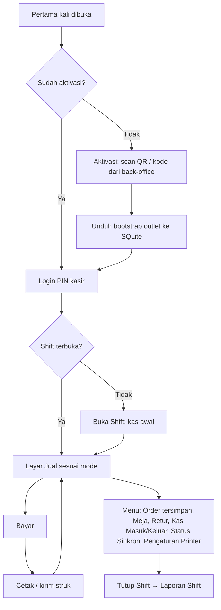

<!-- DIBUAT OTOMATIS dari PRD.md oleh Alat/PecahPrd.py. JANGAN DIEDIT LANGSUNG: ubah PRD.md lalu jalankan ulang skrip. -->

## 17. Arsitektur Klien: Aplikasi POS Flutter & Back-office Web

### 17.1 Pembagian Klien

| Klien | Teknologi | Isi |
|---|---|---|
| **Aplikasi POS {{APP}}** | Flutter | Mode **Kasir** (retail/quick/table/service/wholesale), **Pelayan** (ambil order meja), **KDS**, **Gudang** (GRN, transfer, opname), **Absensi**, **Salesman** (fase 3). Mode ditentukan oleh tipe perangkat & role user. Platform: Android, iOS/iPadOS, Windows. |
| **Aplikasi {{APP}} Owner** | Flutter | Dashboard multi-outlet, laporan ringkas, approval jarak jauh, notifikasi, aksi cepat (§17.3). Platform: Android & iOS. |
| **Back-office Web** | Laravel + Inertia React + TS + Tailwind 4 + TanStack Query | Master data, pembelian, stok, pelanggan, promo, karyawan, keuangan, pajak, laporan, pengaturan, langganan |
| **Web Publik** | React ringan (Inertia/halaman terpisah) | Self-order QR meja, toko online, struk digital, booking |

Satu **design token** (`Spesifikasi/TokenDesain/Token.json`: warna, radius, spacing, tipografi) digenerate menjadi Tailwind `@theme` (web) dan `ThemeExtension` (Flutter), sehingga tampilan brand konsisten.

---

### 17.2 Aplikasi POS Flutter

#### 17.2.1 Arsitektur

**Feature-first + berlapis**: `Tampilan` (widget & controller Riverpod) → `Aplikasi` (use case) → `Domain` (entitas, value object, aturan) → `Data` (DAO Drift, klien API, repositori). Penamaan mengikuti §13.7 (folder & file PascalCase, pengecualian folder wajib Flutter).

```
Aplikasi/Kasir/                     # paket Dart: kasir
├── lib/                            # (wajib Flutter)
│   ├── UtamaDev.dart / UtamaStaging.dart / UtamaProduksi.dart   # flavor (berisi fungsi main())
│   ├── Persiapan.dart              # inisialisasi Sentry, DB, secure storage, DI
│   ├── Aplikasi/
│   │   ├── Rute.dart               # go_router + guard (aktivasi → login PIN → shift)
│   │   ├── Tema/                   # ThemeData + token hasil generate
│   │   └── Bahasa/                 # ARB id/en
│   ├── Inti/
│   │   ├── Uang/                   # Uang, Kuantitas (decimal), FormatRupiah
│   │   ├── Id/                     # ULID, NomorDokumen (per perangkat)
│   │   ├── Hasil/, Galat/, Log/
│   │   └── Platform/               # deteksi platform & kemampuan hardware
│   ├── Data/
│   │   ├── Db/                     # Drift: Tabel/, Dao/, Migrasi/, BasisData.dart
│   │   ├── Api/                    # klien dio, interceptor, DTO (freezed)
│   │   ├── Sinkron/                # Bootstrap, TarikDelta, PengirimOutbox, PenanganKonflik
│   │   └── Repositori/
│   ├── PerangkatKeras/
│   │   ├── Printer/                # PenyusunStruk (ESC/POS), Transport/: Bluetooth/, Usb/, Jaringan/, Vendor/, Sistem/
│   │   ├── Pemindai/               # pendengar HID, pemindai kamera
│   │   ├── LaciKas/
│   │   └── LayarPelanggan/
│   ├── Fitur/
│   │   ├── Aktivasi/  LoginPin/  Shift/  Katalog/  Keranjang/  Pembayaran/
│   │   ├── Pesanan/  Meja/  Kds/  Pelanggan/  Retur/  Kas/
│   │   ├── Gudang/  Absensi/  Persetujuan/  StatusSinkron/  Pengaturan/
│   └── WidgetBersama/              # TeksUang, PapanAngka, PapanPin, PengaturJumlah, ...
├── test/                           # (wajib) unit, widget, golden
├── integration_test/               # (wajib) alur end-to-end di device/emulator
└── pubspec.yaml

Paket/MesinKasir/                   # paket Dart: mesin_kasir (Dart murni, tanpa import Flutter)
├── lib/  KalkulatorKeranjang.dart, KalkulatorPajak.dart, MesinPromo.dart, Pembulatan.dart
└── test/ VektorUji_test.dart       # membaca Spesifikasi/VektorUjiKalkulasi/*.json
```

- `MesinKasir` adalah paket Dart murni. Ia diuji dengan `dart test` di CI tanpa emulator, memakai test vector yang sama dengan Pest (PHP).
- Semua akses database lewat DAO Drift. UI berlangganan **stream query** (misal keranjang, daftar order meja, antrean KDS) sehingga UI otomatis ter-update saat data lokal berubah, termasuk hasil sinkron.

#### 17.2.2 Alur Layar



#### 17.2.3 Layout Adaptif

Layout di bawah adalah isi area kerja **Ruang Kerja Kasir** (§17.2.7): bingkai ruang kerja (bilah atas, rel navigasi, bilah status) selalu ada, dan layar Jual menjadi beranda.

| Lebar layar | Contoh perangkat | Layout |
|---|---|---|
| < 600 dp | HP (pelayan, salesman, kasir mikro) | Satu kolom. Keranjang sebagai bottom sheet. Tombol Bayar menempel di bawah |
| 600–1024 dp | Tablet 8–11", POS Android all-in-one | Dua panel: katalog (kiri) + keranjang (kanan) |
| > 1024 dp | PC Windows, POS all-in-one layar 15" | Dua/tiga panel + **shortcut keyboard** (F1 cari, F2 pelanggan, F8 bayar, F9 uang pas, Esc hapus item) dan dukungan mouse |

```
┌───────────────────────────────────────────────┬──────────────────────────┐
│ [Cari/Scan ______________] [Pelanggan] [≡]    │ Order #K02-0042  Meja 7  │
├───────────────────────────────────────────────┤──────────────────────────│
│ Kategori: [Semua][Kopi][Non-Kopi][Makanan]... │ 2× Es Kopi Susu   36.000 │
│ ┌──────┐┌──────┐┌──────┐┌──────┐              │   · Less sugar           │
│ │ Kopi ││ Latte││ Teh  ││ Roti │  (grid /     │ 1× Croissant      25.000 │
│ │ 18rb ││ 25rb ││ 12rb ││ 25rb │   daftar)    │   Promo Happy Hour -6.000│
│ └──────┘└──────┘└──────┘└──────┘              │──────────────────────────│
│                                               │ Subtotal          55.000 │
│                                               │ Service 5%         2.750 │
│                                               │ PB1 10%            5.775 │
│                                               │ TOTAL             63.525 │
│ ● Online  ⟳ 0 tertunda   Shift: Sari 08:00   │ [Simpan] [Diskon] [BAYAR]│
└───────────────────────────────────────────────┴──────────────────────────┘
```

- Indikator koneksi, jumlah transaksi tertunda, dan status printer **selalu terlihat**.
- Layar bayar: nominal besar, tombol pecahan cepat, pilih metode, split, kembalian besar.
- Target sentuh ≥ 48 dp. Tipografi mengikuti §17.5 (angka tabular untuk uang, font Mono untuk kode). KDS memakai tema terang berkontras tinggi (D-14).
- Mode kiosk: Android *screen pinning*/*lock task* (perangkat terkelola), Windows kiosk/fullscreen, iPad *Guided Access*.

#### 17.2.4 Kinerja

| Metrik | Target (tablet Android kelas bawah, RAM 3 GB) |
|---|---|
| Cold start sampai layar PIN | < 2,5 detik |
| Tambah item ke keranjang | < 50 ms |
| Pencarian produk lokal (10.000 SKU, SQLite FTS5) | < 50 ms |
| Scroll katalog | 60 fps (`ListView.builder`/`GridView.builder`, gambar ter-cache & di-resize) |
| Simpan transaksi + masuk outbox | < 150 ms |
| Ukuran APK (per ABI) | < 35 MB |

- Operasi berat (import bootstrap besar, pembuatan laporan shift) dijalankan di **isolate** terpisah agar UI tidak tersendat.
- Gambar produk diunduh bertahap & di-cache di disk dengan batas ukuran.

#### 17.2.5 Integrasi Hardware (Native)

| Perangkat | Android | iOS / iPadOS | Windows |
|---|---|---|---|
| Printer Bluetooth Classic (SPP, printer 58 mm murah) | ✅ | ❌ (iOS tidak mendukung SPP kecuali printer MFi) | ✅ (via COM port virtual) |
| Printer Bluetooth LE | ✅ | ✅ | ✅ |
| Printer USB | ✅ (USB host) | ❌ | ✅ (driver/spooler RAW) |
| Printer LAN/Wi-Fi (port 9100) | ✅ | ✅ | ✅ |
| Printer bawaan POS all-in-one | ✅ via adaptor vendor (lihat di bawah) | — | ✅ untuk POS all-in-one Windows (driver/COM) |
| Fallback printer sistem (PDF/AirPrint/driver OS) | ✅ (paket `printing`) | ✅ | ✅ |
| Laci kas | Kick via printer (ESC p) atau API vendor | Kick via printer LAN/BLE | Kick via printer |
| Scanner HID (USB/Bluetooth) | ✅ | ✅ | ✅ |
| Scanner bawaan all-in-one | ✅ via adaptor vendor (broadcast/intent atau HID) | — | ✅ (HID) |
| Scanner kamera | ✅ | ✅ | ⚠️ webcam |
| Layar pelanggan | Dual-screen bawaan (presentation display / API vendor) | ⚠️ layar eksternal | Jendela kedua (monitor 2 / VFD via COM) |
| Timbangan | Barcode timbangan (P1). Serial/USB (P3) | Barcode | Barcode, COM port (P3) |
| NFC (kartu member) | ✅ (P3) | ✅ terbatas (P3) | — |

- **Abstraksi `TransportPrinter`** (`BluetoothKlasik`, `Ble`, `Usb`, `Jaringan`, `SdkVendor`, `CetakSistem`) dengan satu `PenyusunStruk` (ESC/POS, lebar 58/80 mm, logo raster, QR struk digital). Tiket dapur dikirim ke printer per *station*.
- Rekomendasi untuk iPad: printer **LAN atau BLE**.
- Setiap perangkat menyimpan profil hardware sendiri dan melaporkannya ke server (kolom `Perangkat.ProfilHardware`) untuk dukungan teknis.

#### 17.2.5a Dukungan Semua Perangkat POS All-in-One (Keputusan D-03)

Target: **semua** perangkat POS Android all-in-one yang beredar di Indonesia bisa dipakai, bukan satu merek saja. Karena setiap vendor punya SDK berbeda, dukungan dibangun berlapis di paket `Paket/AdaptorPerangkat`:

```
KemampuanPerangkat (antarmuka)
├── Printer: PortPrinter        (cetak teks/raster/QR, potong kertas, status kertas habis)
├── LaciKas: PortLaci           (buka laci, status laci)
├── LayarPelanggan: PortLayar   (layar kedua: teks/total/QRIS/gambar promo)
├── Pemindai: PortPemindai      (barcode bawaan)
└── Nfc / Timbangan (opsional)

Implementasi (adaptor):
├── AdaptorSunmi        (SDK Sunmi: printer, laci, layar kedua, scanner)
├── AdaptorImin         (SDK iMin)
├── AdaptorPax, AdaptorTelpo, ... (vendor lain, ditambah bertahap)
├── AdaptorPrinterInternalGenerik (banyak perangkat mengekspos printer bawaan sebagai printer
│                                  Bluetooth virtual / port serial / ESC/POS standar)
└── AdaptorAndroidGenerik         (scanner HID + presentation display + printer eksternal)
```

- **Deteksi otomatis:** saat aplikasi pertama dibuka, sistem membaca `Build.MANUFACTURER`/`MODEL` dan memeriksa ketersediaan layanan vendor, lalu memilih adaptor yang cocok. Jika tidak dikenali, dipakai **adaptor generik**, dan pengguna menjalankan **Wizard Uji Perangkat** (tes cetak, potong, laci, layar kedua, scan). Hasil wizard disimpan sebagai profil.
- **Integrasi SDK vendor** dilakukan lewat *platform channel* (Kotlin) di dalam plugin internal. SDK vendor tidak bocor ke kode fitur.
- **Prioritas penambahan adaptor:** P0 = Sunmi, iMin, dan adaptor generik. P1 = vendor lain berdasarkan data pasar & permintaan tenant (telemetri `ProfilHardware` menunjukkan merek yang paling banyak jatuh ke adaptor generik).
- **Hardware Compatibility List (HCL):** daftar publik perangkat & printer dengan status *Tersertifikasi* (diuji di lab), *Kompatibel* (lolos wizard di lapangan), atau *Terbatas*. Diperbarui setiap rilis.
- **Program mitra hardware:** kerja sama dengan distributor untuk unit uji dan, opsional, bundel perangkat + langganan.
- Perangkat POS all-in-one **berbasis Windows** didukung lewat jalur Windows biasa (driver printer, COM port, monitor kedua/VFD).

#### 17.2.6 Keamanan Aplikasi

- Device token disimpan di **secure storage** (Android Keystore, iOS Keychain, Windows DPAPI).
- Database lokal dapat dienkripsi (**SQLCipher**) dengan kunci acak di secure storage. **Wajib aktif** untuk HP pribadi (mode absensi/salesman) & tenant paket Bisnis.
- Hash PIN kasir & supervisor yang tersinkron ke perangkat memakai algoritme lambat (bcrypt/argon2) dan hanya berada di DB terenkripsi. Salah PIN 5 kali mengunci 5 menit.
- Kasir otomatis terkunci (kembali ke layar PIN) setelah tidak aktif N menit.
- Revoke perangkat dari back-office: token ditolak, lalu aplikasi menghapus data lokal **setelah** outbox berhasil terkirim.
- Pinning sertifikat opsional (fase 3). Android: obfuscation (`--obfuscate --split-debug-info`), simbol debug diunggah ke Sentry.

---

#### 17.2.7 Ruang Kerja Kasir (Keputusan D-16)

Aplikasi POS **bukan kumpulan layar**, melainkan **ruang kerja** tempat kasir bekerja 8–12 jam per hari. Targetnya **elegan tetapi tetap mudah**: tenang dilihat berjam-jam, dan kasir baru bisa melayani transaksi pertama tanpa pelatihan panjang.

**Bingkai ruang kerja (selalu ada setelah masuk):**

| Bagian | Isi | Catatan |
|---|---|---|
| **Bilah atas** | Logo tanda PAYOU, outlet · perangkat, nama kasir, jam, tombol **Kunci** | Ketuk nama kasir → ganti kasir (PIN) tanpa menutup shift |
| **Rel navigasi** (kiri; di HP menjadi bilah bawah) | Jual (beranda) · Order tersimpan · Meja* · Riwayat transaksi · Kas · Pelanggan* · Shift · Pengaturan | Ikon + label, maksimal 8 item, item hanya muncul bila modul/izin aktif (*). Bisa diciutkan menjadi ikon saja |
| **Area kerja** | Layar aktif (Jual: katalog + keranjang, §17.2.3) | Tugas rutin (kas masuk/keluar, cari pelanggan, catatan item, diskon) dibuka sebagai **panel samping atau lembar** di atas area kerja, bukan pindah halaman, sehingga keranjang tidak hilang |
| **Bilah status** (bawah) | Koneksi, transaksi tertunda sinkron, printer, shift (jam buka) | Selalu terlihat; ketuk untuk detail (§17.6.6) |

**Prinsip elegan & mudah:**
1. **Tenang untuk mata.** Latar netral `Latar`, panel `Permukaan`, pemisah garis tipis, satu warna brand hanya untuk aksi utama (BAYAR) dan penanda aktif. Tidak ada animasi berulang, banner berkedip, atau warna jenuh selain status.
2. **Hierarki jelas dalam satu pandangan.** Yang terbesar selalu TOTAL, lalu tombol BAYAR, lalu isi keranjang. Ukuran dari token §17.5 (`Tampilan` untuk TOTAL & kembalian).
3. **Ritme konsisten.** Kisi 8dp, radius 8 panel / 6 kontrol, tinggi baris keranjang tetap, ubin produk seragam (foto nyata atau inisial di atas latar netral bila tanpa foto).
4. **Umpan balik halus tetapi pasti.** Tekan tombol berubah dalam < 100 ms; pindai berhasil/gagal ditandai suara pendek + getar (bisa dimatikan) dan sorot baris keranjang 150 ms; tidak ada toast untuk hal rutin.
5. **Tidak pernah membuat kasir tersesat.** Maksimal dua ketukan dari beranda ke fitur rutin; tombol kembali selalu ke area kerja; tidak ada dialog bertumpuk.

**Kenyamanan kerja berjam-jam:**
- **Kunci cepat & kunci otomatis** saat perangkat diam (bawaan 5 menit, diatur Owner): layar kunci menampilkan nama outlet & jam, buka dengan PIN kasir yang sama atau ganti kasir.
- **Ukuran tampilan per perangkat:** Normal / Besar (skala teks 1,0 / 1,15) dan **posisi keranjang** kiri/kanan (kasir kidal, penempatan layar di meja).
- **Mode layar penuh/kiosk** (§17.2.3) dan layar tetap menyala selama shift terbuka.
- **Input tanpa fokus:** pemindai barcode bekerja di mana pun di layar Jual tanpa perlu mengetuk kolom cari; papan angka besar untuk jumlah & uang; **pintasan keyboard** di desktop (daftar pintasan terlihat lewat `?`).
- **Ingatan kerja:** produk favorit/terlaris outlet di atas katalog, kategori terakhir diingat, keranjang yang belum dibayar selamat bila aplikasi tertutup (tersimpan di SQLite).
- **Tanpa kejutan:** perubahan data dari server (harga, produk) diterapkan di antara transaksi, tidak di tengah keranjang yang sedang dibangun; pesan sistem muncul di bilah status, tidak memotong transaksi.

**Aturan implementasi:**
- Satu widget bingkai `RuangKerja` di `Aplikasi/Kasir/lib/Tampilan/RuangKerja/` membungkus semua layar setelah masuk. Layar fitur hanya mengisi area kerja.
- Komponen visual (ubin produk, baris keranjang, papan angka, panel samping, bilah status) dibuat di `Paket/SistemDesain` agar KDS dan mode Gudang memakai bahasa visual yang sama.
- Setiap layar ruang kerja memiliki test widget di tiga lebar (360, 800, 1280 dp) dan golden test untuk layar Jual & Bayar.

### 17.3 Aplikasi Mobile Owner (Flutter, Android & iOS) — Keputusan D-04

#### 17.3.1 Tujuan

Owner (dan manajer area/outlet) memantau dan mengendalikan usaha dari HP tanpa membuka laptop: melihat angka hari ini, menerima peringatan, dan menyetujui aksi kasir dari jarak jauh.

#### 17.3.2 Layar Utama

| Tab | Isi |
|---|---|
| **Beranda** | Kartu omzet hari ini (vs kemarin & minggu lalu), laba kotor, transaksi, rata-rata keranjang, grafik per jam, pilih outlet atau "Semua Outlet" |
| **Laporan** | Penjualan per produk/kategori/kasir/channel/metode bayar, laporan shift & selisih kas, L/R sederhana, filter periode cepat. Export dikirim sebagai file/tautan |
| **Persetujuan** | Antrean approval jarak jauh (void, diskon, refund, kas keluar, PO, penyesuaian stok) dengan detail & tombol Setujui/Tolak + alasan. Konfirmasi dengan biometrik |
| **Notifikasi** | Pusat notifikasi (selisih kas, anomali kasir, stok kritis, perangkat offline, piutang jatuh tempo, order online) dengan pengaturan per jenis & per outlet |
| **Lainnya** | Stok & harga (cek, ubah harga, tandai habis), promo (aktif/nonaktif), pengeluaran cepat (foto nota), status perangkat POS, karyawan & absensi, langganan, pengaturan akun |

#### 17.3.3 Arsitektur

```
Aplikasi/Pemilik/                   # paket Dart: pemilik
├── lib/
│   ├── Aplikasi/       # Rute (go_router), tema dari Paket/SistemDesain, Bahasa
│   ├── Fitur/
│   │   ├── Autentikasi/  PilihTenant/  Dasbor/  Laporan/  Persetujuan/
│   │   ├── Notifikasi/  StokCepat/  PromoCepat/  Pengeluaran/
│   │   ├── Perangkat/  Karyawan/  Langganan/  Pengaturan/
│   └── Data/           # Repositori → Paket/KlienApi (/api/pemilik/v1), cache Drift ringan
└── test/ integration_test/
```

- **Online-first dengan cache**: data dashboard & laporan terakhir disimpan di cache lokal sehingga aplikasi terbuka instan dan tetap bisa dibaca saat sinyal lemah (ditandai "terakhir diperbarui"). Aksi (approval, ubah harga) wajib online.
- **Data dashboard** diambil dari tabel ringkasan (`RingkasanPenjualanHarian`, dsb.) + delta hari berjalan agar ringan untuk Hostinger. Refresh: tarik-untuk-refresh, polling 60 detik saat layar aktif, dan push sebagai pemicu.
- **Autentikasi:** login email/WA OTP (+ 2FA bila aktif) → user token Sanctum berumur terbatas + refresh token di secure storage. Aplikasi dikunci dengan PIN/biometrik saat dibuka. Hak akses mengikuti role & outlet yang sama dengan back-office.
- **Push:** token FCM per perangkat user disimpan di tabel `PerangkatPengguna`. Notifikasi approval membawa deep link ke layar persetujuan.
- **Batas cakupan:** pengaturan berat (import, COA, pajak, template sektor, penomoran) tetap di back-office web. Aplikasi menautkan ke halaman web terkait bila perlu.

#### 17.3.4 Endpoint `/api/pemilik/v1` (ringkas)

| Method | Endpoint | Fungsi |
|---|---|---|
| POST | `/autentikasi/masuk`, `/autentikasi/otp/verifikasi`, `/autentikasi/perbarui-token`, `/autentikasi/keluar` | Autentikasi |
| GET | `/saya`, `/tenant`, `/outlet` | Profil, pilihan tenant & outlet |
| GET | `/dasbor?outlet=&tanggal=` | Kartu KPI + grafik per jam |
| GET | `/laporan/{nama}?saring[...]` | Laporan ringkas |
| GET/POST | `/persetujuan`, `/persetujuan/{id}/setujui`, `/persetujuan/{id}/tolak` | Approval jarak jauh |
| GET/PATCH | `/notifikasi`, `/pengaturan-notifikasi` | Notifikasi |
| GET/PATCH | `/produk/{id}` (harga, 86), `/promo/{id}` (aktif/nonaktif) | Aksi cepat |
| POST | `/pengeluaran` | Pengeluaran + foto nota |
| GET/POST | `/perangkat`, `/perangkat/{id}/cabut` | Status & cabut perangkat POS |
| POST | `/token-notifikasi` | Daftar token FCM |

#### 17.3.5 Target Kualitas

| Metrik | Target |
|---|---|
| Buka aplikasi sampai dashboard tampil (dari cache) | < 1,5 detik |
| Waktu dari kasir meminta approval sampai notifikasi diterima owner | < 10 detik (bergantung FCM/APNs & cron queue, lihat §14) |
| Crash-free sessions | ≥ 99,5% |

---

### 17.4 Back-office Web

#### 17.4.1 Struktur Folder (di `Aplikasi/Web/`)

```
resources/js/                  # (pengecualian path Laravel/Vite)
├── Aplikasi.tsx               # entry: Inertia bootstrap + QueryClientProvider
├── Halaman/                   # Halaman Inertia back-office (resolver diarahkan ke folder ini)
│   ├── Dasbor/  Katalog/  Persediaan/  Pembelian/  Penjualan/  Perangkat/
│   ├── Pelanggan/  Promo/  Karyawan/  Keuangan/  Laporan/  Pengaturan/
├── Publik/                    # Web publik: PesanSendiri, TokoOnline, StrukDigital, Reservasi
├── Fitur/                     # Hook & komponen per domain (useDaftarProduk, FormProduk, ...)
├── Komponen/Ui/               # shadcn/ui (file hasil CLI: pengecualian)
├── Komponen/                  # TabelData, InputUang, PemilihRentangTanggal, ...
├── TataLetak/                 # TataLetakAplikasi (sidebar), TataLetakAutentikasi, TataLetakPublik
├── Pustaka/                   # KlienApi.ts (fetch + CSRF), KunciKueri.ts, Uang.ts, Format.ts, Izin.ts
├── Tipe/                      # Tipe hasil generate dari PHP (laravel-data) + tipe manual
└── Gaya/Aplikasi.css          # Tailwind 4: @import "tailwindcss"; @theme { ...token... }
```

#### 17.4.2 Pola TanStack Query

```ts
// Pustaka/KunciKueri.ts — pabrik key terpusat
export const KunciKueri = {
  Produk: {
    Daftar: (filter: FilterProduk) => ['Produk', 'Daftar', filter] as const,
    Cari: (kata: string) => ['Produk', 'Cari', kata] as const,
  },
  Perangkat: (idOutlet: string) => ['Perangkat', idOutlet] as const,
  Laporan: (nama: string, filter: FilterLaporan) => ['Laporan', nama, filter] as const,
};

// Fitur/Perangkat/useStatusPerangkat.ts — status perangkat POS (online, outbox tertunda), polling adaptif
export function useStatusPerangkat(idOutlet: string) {
  return useQuery({
    queryKey: KunciKueri.Perangkat(idOutlet),
    queryFn: () => KlienApi.Ambil(`/internal/outlet/${idOutlet}/perangkat`),
    refetchInterval: () => (document.hidden ? 120_000 : 30_000),
  });
}
```

- `staleTime` 30 detik untuk master, 0 untuk data transaksi. `retry` 2 dengan backoff.
- Setelah mutasi Inertia, panggil `queryClient.invalidateQueries` untuk key terkait.

#### 17.4.3 Design System Web

- Token dari `Spesifikasi/TokenDesain` di `@theme` Tailwind 4 (hanya tema terang, D-14), komponen dasar shadcn/ui di `Komponen/Ui/` yang warnanya diturunkan dari token, warna brand per tenant (struk & toko online).
- Komponen wajib: `InputUang`, `TabelData` (lihat di bawah), `PemilihRentangTanggal` (preset Hari ini, Kemarin, 7 hari, Bulan ini), `LencanaStatus`, `DialogPersetujuan`, `KeadaanKosong`, `WizardImpor`, `DialogAktivasiPerangkat` (menampilkan QR aktivasi).
- Bahasa Indonesia sederhana, i18n key siap Inggris. Kontras WCAG AA.
- Code splitting per halaman (`import.meta.glob` lazy). Halaman web publik self-order ditargetkan < 150 KB JS gzip.

**`TabelData` (Keputusan D-16).** Semua tabel data di back-office dan Platform Pengelola **wajib** memakai satu komponen `Komponen/TabelData/` yang dibangun di atas **TanStack Table v8** (logika) dan komponen `Table` shadcn/ui (tampilan), dengan data dari **TanStack Query**. Tidak boleh ada `<table>`/`<Table>` yang dirakit sendiri di halaman.

| Fitur | Aturan |
|---|---|
| Sumber data | **Mode server** (bawaan, untuk semua daftar yang bisa tumbuh): `useQuery` ke endpoint JSON `/internal/...` dengan `placeholderData: keepPreviousData`; paginasi, urut, dan saring dikerjakan server. **Mode lokal** hanya untuk tabel kecil yang datanya sudah ada di halaman dan dibatasi ≤ 200 baris (baris dokumen, isian form, ringkasan) |
| Kontrak kueri | Parameter URL: `cari`, `urut` (`Kolom` atau `-Kolom`, bisa beberapa dipisah koma), `halaman`, `perHalaman` (25/50/100, maks 100), `saring[Kolom]=nilai`. Respons: `{ Data: [...], Meta: { Halaman, PerHalaman, Total, JumlahHalaman } }`. Server memakai daftar putih kolom urut/saring; kolom tak dikenal diabaikan |
| Keadaan di URL | Pencarian, saring, urut, halaman, dan ukuran halaman tersimpan di URL (bisa dibagikan, tombol Kembali berfungsi). Pencarian di-*debounce* 300 ms |
| Pencarian & saring | Kotak cari global + saring per kolom (pilihan tunggal/banyak dengan jumlah per nilai bila tersedia, rentang tanggal dengan preset, rentang angka). Chip saring aktif + tombol "Hapus semua saring" |
| Urut | Klik kepala kolom (naik → turun → mati); Shift+klik untuk urut bertingkat. Kolom yang bisa diurut ditandai ikon |
| Kolom | Atur kolom tampil/sembunyi dan urutan, disimpan per pengguna per tabel (`localStorage`); kolom pertama (identitas) dan kolom aksi menempel saat digulir horizontal; lebar kolom bisa diubah di desktop |
| Pilih baris & aksi massal | Kotak centang per baris + pilih semua di halaman ini / semua hasil saring; bilah aksi massal muncul dengan jumlah terpilih. Hanya bila flow menyediakan aksi massal |
| Aksi baris | Menu aksi per baris (ikon ⋯) dan klik baris membuka detail bila ada |
| Ekspor | Ekspor CSV/Excel mengikuti saring & urut aktif (dikerjakan server lewat antrean bila > 5.000 baris) bila flow menyediakan ekspor |
| Kinerja | Virtualisasi baris (TanStack Virtual) untuk mode lokal > 100 baris; kepala tabel menempel saat halaman digulir |
| Keadaan | Kerangka baris saat memuat pertama, indikator tipis saat memuat ulang (data lama tetap tampil), kosong (bedakan "belum ada data" dan "tidak ada hasil untuk saring ini"), galat + Coba lagi (§17.6.6) |
| Format | Uang & angka rata kanan `tabular-nums`, kode/nomor dokumen font Mono, tanggal `22/09/2026`, lencana status dengan teks |
| Responsif | Lihat §17.4.4: di layar < 640px baris tampil sebagai daftar bertumpuk |
| Aksesibilitas | Tabel semantik (`th scope`, `aria-sort`), navigasi keyboard, kotak centang berlabel |

#### 17.4.4 Web Responsif (Keputusan D-16)

Semua halaman web (back-office, Platform Pengelola, autentikasi, web publik) **wajib berfungsi dan rapi di semua lebar layar** dari **360px** (HP kecil) sampai **1920px ke atas**, tanpa gulir horizontal halaman.

| Lebar | Perangkat acuan | Aturan |
|---|---|---|
| < 640px | HP | Menu samping menjadi *Sheet*; satu kolom; form satu kolom; dialog menjadi lembar layar penuh dari bawah; tombol aksi utama menempel di bawah; `TabelData` tampil sebagai **daftar bertumpuk** (kolom identitas sebagai judul, 2–3 kolom penting, lencana status, menu aksi), saring dibuka lewat tombol "Saring" (Sheet), aksi massal di bilah bawah |
| 640–1023px | Tablet, laptop kecil | Menu samping bisa diciutkan ke ikon; form dua kolom menjadi satu kolom di bawah 768px; `TabelData` menyembunyikan kolom berprioritas rendah (bisa dimunculkan lewat Atur kolom) dan menggulir horizontal dengan kolom identitas menempel |
| 1024–1535px | Laptop, PC | Tata letak penuh; tabel semua kolom bawaan |
| ≥ 1536px | Monitor lebar | Isi dibatasi lebar baca untuk form & detail (maks ±1280px); tabel boleh memakai lebar penuh |

- Target sentuh ≥ 44px pada perangkat sentuh (`pointer: coarse`) walau dalam mode Ringkas.
- Teks tidak pernah terpotong tanpa cara membaca penuh (tooltip/detail); nama panjang dibungkus atau dipotong dengan elipsis + judul.
- Diuji di tiga lebar acuan **360, 768, 1280px** untuk setiap halaman baru/berubah (tangkapan layar Playwright), selain test komponen Vitest.


### 17.5 Tipografi (Keputusan D-08)

**Font resmi {{APP}}** untuk semua klien (Aplikasi POS, Aplikasi Owner, Back-office, Web Publik, Platform Pengelola):

| Peran | Font | Dipakai untuk |
|---|---|---|
| **Utama** | **Atkinson Hyperlegible Next** | Seluruh teks UI: menu, label, tombol, isi tabel, angka uang (dengan angka tabular) |
| **Mono** | **Atkinson Hyperlegible Mono** | Kode yang harus dibaca persis: SKU, barcode, nomor dokumen (`INV/JKT1/260922/K02-0042`), kode voucher, kode aktivasi perangkat, nomor seri/IMEI, isi struk digital |

**Alasan:** font ini dirancang oleh Braille Institute agar setiap huruf mudah dibedakan (1/l/I, 0/O, 5/S, 8/B). Kasir dan staf gudang membaca layar sekilas di bawah tekanan waktu, sering di tablet murah dan cahaya yang kurang ideal. Salah baca angka atau kode berarti salah transaksi. Font ini juga jarang dipakai template dan tool AI, sehingga tampilan {{APP}} punya identitas sendiri.

Fakta teknis: tersedia gratis di Google Fonts dan situs Braille Institute. Varian Next punya 7 ketebalan (Light s.d. ExtraBold, tegak & miring) plus versi *variable*, mendukung 150+ bahasa, dan menyediakan angka tabular sebagai opsi. Varian Mono juga tersedia dalam versi *variable*.

**Skala tipografi (dua mode kepadatan):**

| Token | Nyaman (Aplikasi POS, KDS, Owner) | Ringkas (Back-office, Pengelola) | Ketebalan | Contoh pemakaian |
|---|---|---|---|---|
| `Tampilan` | 36/44 | 30/38 | 700 | TOTAL di layar bayar, angka omzet di beranda Owner |
| `Judul` | 24/32 | 20/28 | 700 | Judul halaman/layar |
| `Subjudul` | 18/26 | 16/24 | 600 | Judul bagian, nama produk di keranjang |
| `Isi` | 16/24 | 14/20 | 400 | Teks umum, isi tabel |
| `Label` | 14/20 | 13/18 | 600 | Label form, tombol, kepala kolom |
| `Keterangan` | 13/18 | 12/16 | 400 | Info tambahan, waktu, catatan |

Format `ukuran/tinggi baris` dalam px (web) atau logical pixel (Flutter). KDS memakai mode Nyaman dengan pengali 1,25 agar terbaca dari jarak 1–2 meter.

**Aturan pemakaian:**
- Semua angka uang dan jumlah memakai **angka tabular** dan rata kanan di tabel.
- Hierarki dari ukuran dan ketebalan, bukan warna. Maksimal 6 token di atas, tidak membuat ukuran baru di luar token.
- *Sentence case* ("Tambah produk", bukan "Tambah Produk" atau "TAMBAH PRODUK"). Huruf kapital penuh hanya untuk label status pendek bila perlu.
- Tidak memakai letter-spacing negatif pada judul, dan tidak memakai teks bergradien.
- **Anti-referensi** (tidak dipakai di UI {{APP}}): Inter, Geist, Plus Jakarta Sans, DM Sans, Manrope, Outfit, Poppins, Space Grotesk.

**Implementasi:**

| Stack | Cara |
|---|---|
| Web (Back-office, Web Publik, Pengelola) | *Self-host* file WOFF2 variable (subset Latin + Latin Extended) di `resources/`, `@font-face` dengan `font-display: swap`. Token di `@theme`: `--font-sans: "Atkinson Hyperlegible Next", system-ui, sans-serif;` dan `--font-mono: "Atkinson Hyperlegible Mono", ui-monospace, monospace;`. Kelas uang memakai `font-variant-numeric: tabular-nums` |
| Flutter (POS & Owner) | File font variable **di-bundle** di `Paket/SistemDesain/assets/fonts/` dan dideklarasikan di `pubspec.yaml`. **Tidak** memakai paket `google_fonts` (mengunduh saat runtime, tidak cocok untuk offline). `ThemeData` memakai font ini. Widget `TeksUang` dan `TeksKode` menerapkan `FontFeature.tabularFigures()` |
| Struk thermal (ESC/POS) | Tetap memakai font internal printer demi kecepatan cetak. Hanya logo yang dicetak sebagai gambar raster. Struk digital (web) memakai font Mono |
| Lisensi | SIL Open Font License. File lisensi disimpan di repo dan ditampilkan di menu "Lisensi Pihak Ketiga" aplikasi (`LicenseRegistry` di Flutter) |
| Pengujian | Golden test Flutter dan screenshot test web memakai font asli. Kasus uji wajib: "Rp 1.250.000", nama produk panjang, kode `IL1O0-8B5S`, semua ketebalan yang dipakai |

Token font menjadi bagian dari `Spesifikasi/TokenDesain/Token.json` sehingga web dan Flutter selalu sama.

### 17.6 Pedoman UI/UX & Design System (Keputusan D-09)

#### 17.6.1 Prinsip Dasar: Alat Kerja, Bukan Brosur

{{APP}} adalah **alat kerja** yang dipakai berjam-jam setiap hari, sering di bawah tekanan antrean. Desain dinilai dari **kecepatan, ketepatan, dan ketenangan**, bukan dari seberapa "keren" tampilannya di tangkapan layar.

1. **Desain mengikuti flow.** Setiap layar berasal dari langkah flow P-xx/F-xx (§8): tugas apa, seberapa sering, di perangkat apa, dalam tekanan waktu atau tidak.
2. **Isi lebih dulu dari hiasan.** Kalau semua warna dihapus, layar tetap harus bisa dipahami.
3. **Warna berarti sesuatu.** Warna hanya untuk aksi utama dan status. Sisanya netral.
4. **Keadaan sulit adalah keadaan normal.** Offline, antrean sinkron, printer terputus, stok minus, dan menunggu persetujuan didesain sejak awal, bukan ditambal belakangan.
5. **Data nyata, bukan data sempurna.** Nama produk panjang, angka jutaan, ribuan SKU, dan kolom kosong menjadi bahan desain dan pengujian.
6. **Konsisten lintas klien.** Web dan Flutter memakai token yang sama (`Spesifikasi/TokenDesain`), sehingga istilah, warna status, dan pola interaksi sama di semua aplikasi.

#### 17.6.2 Arah per Klien

| Klien | Pertanyaan utama pengguna | Arah desain |
|---|---|---|
| **Aplikasi POS (Kasir)** | "Bisa selesai bayar dalam 20 detik tanpa salah, dan tetap nyaman setelah 10 jam?" | **Ruang Kerja Kasir** (§17.2.7): elegan dan tenang, target sentuh besar, kontras tinggi, TOTAL & tombol BAYAR dominan, dekorasi nol, status koneksi/sinkron/printer selalu terlihat, bisa dipakai penuh dengan keyboard/scanner di desktop |
| **KDS** | "Pesanan mana yang harus dibuat sekarang?" | Tema terang berkontras tinggi (D-14), huruf besar (1,25×), urutan waktu, warna umur tiket (normal → kuning → merah), satu ketukan untuk ubah status |
| **Aplikasi Owner** | "Hari ini untung berapa, ada masalah apa?" | Satu angka besar + perbandingan, lalu daftar hal yang butuh tindakan (persetujuan, selisih kas, stok kritis). Bukan dinding widget |
| **Back-office** | "Bisa cari, bandingkan, dan ubah banyak data dengan cepat?" | Padat data, tabel lebih utama dari kartu, filter di atas, aksi massal, detail di panel/halaman terpisah |
| **Platform Pengelola** | "Tenant mana yang perlu ditangani?" | Seperti back-office, dengan penanda lingkungan (Staging/Produksi) yang mencolok di bagian atas |
| **Web Publik** | "Bisa pesan/bayar tanpa bingung di HP?" | Satu kolom, tombol utama menempel di bawah, harga final jelas sebelum bayar, ringan (< 150 KB JS) |

#### 17.6.3 Warna

**Aturan 90/10:** sekitar 90% permukaan memakai warna netral. Warna brand hanya untuk **aksi utama** (Bayar, Simpan, Setujui) dan **penanda posisi aktif** (menu terpilih, tab aktif). Warna semantik hanya untuk **status**.

**Palet merek PAYOU (D-15, sumber `Spesifikasi/Merek/Sumber/LembarMerek.png`):** Primary Indigo `#6366F1`, Navy `#0F2747`, Accent Yellow `#FBBF24`, Warm Neutral `#F9FAFB`, Cool Gray `#E5E7EB`. Warna merek dipakai utuh di logo dan ikon aplikasi. Di UI, warna dipetakan ke token berikut; Indigo digelapkan sedikit menjadi `#5558E8` karena teks putih di atas `#6366F1` hanya 4,47:1 (di bawah WCAG AA). Kuning aksen **tidak** menjadi token UI (tetap hanya di logo) agar tidak tertukar dengan `Peringatan`.

**Token warna (final, v1.36):**

| Token | Nilai | Fungsi |
|---|---|---|
| `Latar` | `#F9FAFB` (Warm Neutral) | Latar halaman |
| `Permukaan` | `#FFFFFF` | Panel, tabel, dialog |
| `Garis` | `#E5E7EB` (Cool Gray) | Pemisah dekoratif |
| `GarisInput` | `#7D8799` | Tepi input & kontrol (kontras 3,5:1 terhadap `Latar`) |
| `TeksUtama` | `#0F2747` (Navy) | Teks utama (14,3:1) |
| `TeksSekunder` | `#4A5873` | Keterangan, label sekunder (6,9:1) |
| `Brand` | `#5558E8` (Indigo) | Aksi utama, penanda aktif (teks putih 5,3:1) |
| `Sukses` | `#2E7D32` | Lunas, berhasil, tersinkron |
| `Peringatan` | `#9A5B00` | Menunggu, tertunda, stok menipis |
| `Bahaya` | `#B3261E` | Void, gagal, selisih kas, offline lama |
| `Info` | `#1F5FAD` | Informasi netral, tautan |

Semua pasangan teks di atas `Permukaan`/`Latar` memenuhi **WCAG AA** (≥ 4,5:1, dihitung saat penyusunan). Teks putih di atas `Brand` dan `Bahaya` juga ≥ 4,5:1. Setiap warna semantik punya varian latar lembut (misal `SuksesLatar`) untuk lencana dan baris tabel.

**Aturan warna:**
- **Status tidak pernah hanya warna.** Selalu disertai teks atau ikon ("Lunas", "Tertunda 3"), agar tetap jelas bagi pengguna buta warna dan di layar murah.
- Makna warna **sama di semua klien**: hijau selalu lunas/berhasil, merah selalu void/gagal, dan seterusnya.
- Tanpa gradien, efek kaca, atau warna dekoratif.
- **Tanpa mode gelap di semua klien, termasuk KDS** (D-14). KDS memakai tema terang berkontras tinggi dengan huruf besar.
- **Satu sumber warna:** web di `Aplikasi/Web/resources/js/Gaya/Aplikasi.css` (bagian "UBAH WARNA DI SINI"; variabel shadcn/ui hanya merujuk token), Flutter di `Paket/SistemDesain/lib/Token/TokenWarna.dart`. Halaman & komponen hanya memakai token; literal warna di luar dua file itu ditolak test penjaga.
- Warna brand tenant (logo/warna struk & toko online) hanya berlaku di struk dan web publik tenant, **tidak** mengubah warna UI {{APP}}.

#### 17.6.4 Bentuk, Ruang & Kepadatan

| Aspek | Aturan |
|---|---|
| Radius | 6px untuk tombol, input, lencana. 8px untuk panel/dialog. Tidak ada kartu super-bulat |
| Pemisah | Garis 1px (`Garis`). Bayangan hanya untuk elemen melayang (popover, dialog, menu) |
| Spasi | Kelipatan 4 (4, 8, 12, 16, 24, 32) |
| Ikon | Satu set: **Lucide** (web & Flutter), garis 1,5–2px, ukuran 16/20/24. Ikon hanya bila membantu mengenali. Tanpa emoji di UI |
| Ilustrasi | Tidak memakai ilustrasi 3D/blob. Foto produk nyata di katalog. Tampilan kosong cukup ikon sederhana + teks + tombol aksi |
| Animasi | Singkat (100–200 ms) dan fungsional (umpan balik tekan, masuk/keluar panel). Hormati pengaturan "kurangi gerakan" |

**Dua mode kepadatan** (terhubung dengan skala tipografi §17.5):

| Mode | Dipakai di | Target sentuh / tinggi baris | Padding kontrol |
|---|---|---|---|
| **Nyaman** | Aplikasi POS, KDS, Aplikasi Owner, Web Publik | Target sentuh ≥ 48dp. Baris daftar 56–64 | 12–16 |
| **Ringkas** | Back-office, Platform Pengelola | Baris tabel 36–40px, kontrol 32–36px | 8–12 |

#### 17.6.5 Pola Layar

**Aplikasi POS:**
- Semua layar setelah masuk berada di dalam bingkai **Ruang Kerja Kasir** (§17.2.7).
- Tata letak dua panel (katalog | keranjang) di tablet/desktop, satu kolom + *bottom sheet* di HP (§17.2.3).
- **Bilah status permanen** di bawah: koneksi, jumlah transaksi tertunda, printer, nama kasir & shift.
- Layar bayar: TOTAL memakai token `Tampilan`, tombol pecahan uang cepat, metode bayar sebagai tombol besar, **kembalian ditampilkan paling besar** setelah bayar tunai.
- Aksi berisiko (void, hapus item terkirim, diskon di atas batas) selalu lewat **dialog PIN supervisor** dengan ringkasan apa yang akan terjadi.
- Tidak ada konfirmasi "Apakah Anda yakin?" untuk aksi rutin. Sediakan **urungkan (undo)** beberapa detik untuk hapus item dari keranjang.

**Back-office & Platform Pengelola:**
- Navigasi samping dikelompokkan mengikuti flow: **Penjualan · Persediaan · Pembelian · Pelanggan & Promo · Karyawan · Keuangan · Laporan · Pengaturan**.
- **Halaman daftar:** judul + tombol aksi utama → `TabelData` (§17.4.3: cari, saring, urut, atur kolom, pilih banyak untuk aksi massal, paginasi server, keadaan di URL). Di HP tampil sebagai daftar bertumpuk (§17.4.4).
- **Halaman detail dokumen:** kepala berisi nomor dokumen (font Mono), lencana status, dan aksi sesuai status (misal PO `Disetujui` → "Terima Barang") → isi → tab riwayat & log audit.
- **Form:** satu kolom untuk form pendek, dua kolom untuk form panjang, dikelompokkan per bagian. Validasi langsung di bawah field. Tombol Simpan tetap terlihat (menempel) di form panjang.
- **Laporan:** filter periode dengan preset (Hari ini, Kemarin, 7 hari, Bulan ini, Bulan lalu) → angka ringkasan (maks 4) → tabel rinci. Grafik hanya bila tren/perbandingan memang penting.

**Aplikasi Owner:**
- Beranda: pilih outlet → **omzet hari ini** (token `Tampilan`) + perbandingan kemarin & minggu lalu → laba kotor & jumlah transaksi → **"Perlu tindakan"** (persetujuan menunggu, selisih kas, stok kritis, perangkat offline) → grafik per jam.
- Persetujuan: kartu per permintaan berisi kasir, outlet, item, nominal, alasan, lalu tombol **Tolak** dan **Setujui** (dengan biometrik).

#### 17.6.6 Keadaan (States) yang Wajib Didesain

Setiap layar/komponen wajib punya desain untuk keadaan berikut sebelum dianggap selesai:

| Keadaan | Contoh |
|---|---|
| Memuat | Kerangka (skeleton) sesuai bentuk isi, bukan pemutar di tengah layar kosong |
| Kosong | "Belum ada produk. **Import dari Excel** atau **Tambah produk**" |
| Galat | Apa yang terjadi + apa yang bisa dilakukan: "Printer dapur tidak tersambung. Cek kabel/Wi-Fi, lalu **Coba lagi**" |
| Offline | Banner tenang (bukan merah menyala) + fitur yang tetap bisa dipakai. Tombol yang butuh online dinonaktifkan dengan penjelasan |
| Tertunda sinkron | Jumlah item tertunda + waktu sinkron terakhir, bisa diketuk untuk detail |
| Butuh persetujuan | Dialog PIN atau status "Menunggu persetujuan Supervisor" |
| Tanpa izin | Menu disembunyikan. Jika dibuka lewat tautan: "Anda tidak punya akses ke halaman ini. Hubungi Owner" |
| Data ekstrem | Nama 60 karakter, angka Rp 1.250.000.000, 2.000 baris, nilai negatif, kolom kosong |

#### 17.6.7 Bahasa & Microcopy

- **Bahasa Indonesia sehari-hari yang sopan dan jelas.** Sapaan "Anda", kalimat aktif, tanpa jargon teknis ("Sinkron gagal" → "Transaksi belum terkirim ke server. Akan dicoba lagi otomatis").
- **Tombol memakai kata kerja spesifik:** "Simpan produk", "Terima barang", "Tutup shift". Hindari "OK", "Submit", "Proses".
- **Konkret dengan angka dan nama:** "Stok Kopi Susu tinggal 3", "3 transaksi belum terkirim".
- **Tanpa emoji, tanpa seru berlebihan, tanpa "Oops!"**.
- **Format Indonesia:** Rupiah `Rp 1.250.000`, tanggal `22 Sep 2026` (tampilan) atau `22/09/2026` (tabel), jam `14.32`, zona waktu outlet (WIB/WITA/WIT) bila relevan.
- **Glosarium istilah UI** mengikuti kamus §13.7.1 (misal "Pemasok", bukan campuran "Supplier/Vendor/Pemasok").

#### 17.6.8 Visualisasi Data

- Grafik hanya bila menjawab pertanyaan tren atau perbandingan. Angka tunggal cukup ditampilkan sebagai angka.
- **Bar/kolom** untuk perbandingan, **garis** untuk tren waktu. Hindari donut/pie untuk lebih dari 3 bagian.
- Label langsung pada grafik, tanpa legenda terpisah bila memungkinkan. Sumbu Rupiah diringkas ("1,2 jt").
- Warna grafik memakai palet kategori netral dan terbatas. Warna semantik hanya untuk makna (misal minus = `Bahaya`).
- *Sparkline* di dalam sel tabel untuk tren per produk/outlet.

#### 17.6.9 Aksesibilitas & Perangkat

- Kontras WCAG AA untuk semua teks. Kontrol & tepi input ≥ 3:1.
- Target sentuh ≥ 48dp di klien sentuh. Fokus keyboard terlihat jelas di web & desktop Windows.
- Mendukung pembesaran teks sistem hingga 130% tanpa tata letak rusak (Flutter `textScaler`, web `rem`).
- Diuji di **tablet Android murah (RAM 3 GB), layar 8"**, di bawah cahaya terang, dari jarak lengan. Ini perangkat acuan, bukan MacBook desainer.
- Web diuji di lebar **360, 768, dan 1280px** (§17.4.4); Aplikasi POS di **360, 800, dan 1280dp** (§17.2.7).

#### 17.6.10 Proses Desain

1. **Flow → tugas:** daftar tugas per layar dari flow P-xx/F-xx, lengkap dengan frekuensi, perangkat, dan tekanan waktu.
2. **Wireframe abu-abu** tanpa warna untuk menguji tata letak dan urutan informasi.
3. **Data nyata & keadaan sulit** (§17.6.6) dimasukkan sejak wireframe.
4. **Uji dengan 5 pengguna nyata** per klien (kasir, staf gudang, owner) memakai prototipe sebelum desain visual final.
5. **Visual dari token**, bukan warna/ukuran lepas. Komponen shadcn/ui dan tema Flutter diturunkan dari token, tidak dipakai dengan tampilan bawaannya.
6. **Referensi dari produk kerja nyata**, misalnya Square POS, Toast, Shopify POS, Loyverse (kasir); Linear, Stripe Dashboard, Xero (back-office); majoo & Moka (pembanding lokal). **Bukan** dari galeri inspirasi visual.
7. **Jika memakai AI untuk desain/kode UI**, sertakan batasan: token §17.5–§17.6, tanpa gradien/bayangan dekoratif, data Indonesia nyata, dan daftar keadaan wajib.

#### 17.6.11 Checklist Review Desain ("Anti-Slop")

Wajib lolos sebelum layar masuk implementasi:

- [ ] Layar tetap bisa dipahami jika semua warna dihapus
- [ ] Warna hanya muncul untuk aksi utama dan status, status selalu disertai teks/ikon
- [ ] Tidak ada gradien, efek kaca, bayangan dekoratif, emoji, atau ilustrasi dekoratif
- [ ] Tidak ada kartu yang lebih jelas bila dijadikan baris tabel
- [ ] Tabel web memakai `TabelData` (TanStack Table + Query) dengan fitur §17.4.3
- [ ] Rapi di lebar 360 / 768 / 1280px tanpa gulir horizontal halaman (web, §17.4.4); layar POS berada di bingkai Ruang Kerja Kasir dan rapi di 360 / 800 / 1280dp (§17.2.7)
- [ ] Font & ukuran hanya dari token §17.5. Angka uang tabular & rata kanan. Kode memakai font Mono
- [ ] Semua keadaan di §17.6.6 sudah didesain
- [ ] Diuji dengan data ekstrem dan di perangkat acuan
- [ ] Microcopy mengikuti §17.6.7 dan kamus istilah
- [ ] Setiap elemen dekoratif yang tidak membantu tugas sudah dibuang
