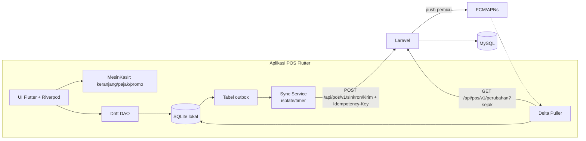

<!-- DIBUAT OTOMATIS dari PRD.md oleh Alat/PecahPrd.py. JANGAN DIEDIT LANGSUNG: ubah PRD.md lalu jalankan ulang skrip. -->

## 18. Offline-First POS & Sinkronisasi

### 18.1 Tujuan

Aplikasi POS dapat menjalankan **seluruh** alur inti tanpa internet selama minimal **72 jam** (login PIN, buka shift, jual, bayar tunai/EDC manual/QRIS statis, void di shift yang sama, cetak struk, tutup shift). Setelah online kembali, semua data tersinkron **tanpa duplikasi dan tanpa kehilangan**.

### 18.2 Komponen

**Tabel lokal utama (Drift/SQLite, penamaan sama dengan server §15):** `Produk`, `ProdukSatuan`, `ProdukBarcode`, `ProdukHarga`, `Pilihan`, `Resep` (untuk HPP estimasi), `TarifPajak`, `Promo`, `MetodePembayaran`, `Meja`, `CachePelanggan`, `PinStaf`, `Pengaturan`, `Shift`, `Penjualan`, `PenjualanDetail`, `PenjualanPembayaran`, `MutasiKas`, `Persetujuan`, `Outbox`, `StatusSinkron` (cursor per entitas), `AntreanCetak`.

### 18.3 Aturan Sinkronisasi

1. **ID dibuat di perangkat** (ULID) untuk shift, sale, line, payment. Server memakai ID tersebut sebagai `UuidKlien` unik, sehingga push ulang aman (idempoten).
2. **Nomor dokumen** dibuat di perangkat dengan sekuens per kode perangkat (`Perangkat.Kode`), sehingga tidak bentrok antar perangkat.
3. **Transaksi lokal atomik.** Simpan sale + lines + payments + entri outbox dalam **satu transaksi SQLite**, jadi tidak ada transaksi yang tersimpan tanpa antrean kirim.
4. **Outbox FIFO per perangkat.** Item dikirim berurutan dalam batch (maks 50). Shift dikirim sebelum sale-nya (dependency order). Retry dengan backoff eksponensial. Item yang ditolak permanen dipindah ke daftar "Perlu Tindakan" di layar Status Sinkron.
5. **Server adalah otoritas akhir** untuk stok, jurnal, HPP, dan poin. Aplikasi hanya menyimpan *snapshot* yang dipakai saat transaksi.
6. **Pemicu sinkron:** setelah setiap transaksi (debounce 2 detik), timer 30 detik, saat koneksi kembali, saat aplikasi kembali ke foreground, dan saat push FCM diterima. Di Android, **workmanager** menjalankan sinkron berkala saat aplikasi di latar. Di iOS, sinkron terutama saat aplikasi aktif (sesuai batasan OS). Kasir iPad dianjurkan membiarkan aplikasi tetap terbuka.
7. **Konflik & kebijakan:**

| Situasi | Kebijakan |
|---|---|
| Harga berubah di server saat perangkat offline | Transaksi tetap memakai harga saat dijual (snapshot). Tidak dianggap konflik. |
| Stok tidak cukup saat sinkron | Diterima (stok bisa negatif) + flag `PerluTinjauan` + notifikasi manajer. Kecuali produk serial yang sudah terjual di tempat lain → masuk antrean review. |
| Promo sudah berakhir/kuota habis | Diterima dengan snapshot promo. Laporan menandai "promo di luar kuota". |
| Voucher sekali pakai dipakai di dua perangkat offline | Transaksi kedua diterima + flag fraud-review (tidak bisa dicegah saat offline). Voucher bernilai tinggi dapat disetel "wajib online". |
| Saldo deposit/poin tidak cukup | Metode bayar deposit/poin **wajib online** secara default (atau batas offline kecil yang bisa dikonfigurasi). |
| Perangkat di-revoke | Batch yang sudah dibuat sebelum revoke diterima + review. Batch setelahnya ditolak. |
| Periode sudah dikunci | Transaksi diterima dengan `TanggalBisnis` asli dan flag untuk review Akuntan (jurnal diposting ke periode terbuka berikutnya dengan catatan). |
| Open bill meja yang sama diubah dari dua perangkat (fase 2, tanpa LAN) | Perubahan per baris (tambah/void item) bersifat *append-only* dengan ULID per baris sehingga digabung tanpa saling menimpa. Header (pindah meja, jumlah tamu) memakai *last-writer-wins* berdasarkan waktu server + log. Pembayaran open bill hanya di satu perangkat (kunci bill online, atau via hub LAN di fase 3). |
| Jam perangkat salah | Server menyimpan `DibuatOfflinePada` dari perangkat dan `DiterimaPada` dari server. Selisih > 10 menit ditandai. Aplikasi menampilkan peringatan jam perangkat. |

8. **Delta pull** master data tiap 60 detik saat online, plus pull langsung saat aplikasi dibuka atau saat menerima push.
9. **Migrasi skema lokal** dikelola oleh Drift (`schemaVersion` + langkah migrasi teruji). Migrasi **tidak boleh** menghapus outbox yang belum terkirim.
10. **Monitoring:** Owner melihat per perangkat: platform, versi app, terakhir online, jumlah tertunda. Muncul peringatan jika sebuah perangkat punya outbox > 2 jam belum terkirim padahal online.

### 18.4 Batasan Offline (Harus Online)

QRIS dinamis, pembayaran gateway, penukaran poin/deposit (default), validasi voucher terbatas, pelanggan baru dengan limit kredit, pencarian pelanggan di luar cache, dan approval jarak jauh.

### 18.5 Mode LAN Lokal / Outlet Hub (Fase 3, X17)

Masalah yang diselesaikan: di restoran, jika internet mati, order dari tablet pelayan tidak sampai ke kasir dan KDS karena semuanya lewat server.

- Satu perangkat (biasanya kasir utama Windows/Android) diaktifkan sebagai **Hub**. Hub menjalankan server HTTP lokal ringan (paket `shelf`) di jaringan Wi-Fi outlet.
- Perangkat lain menemukan Hub via **mDNS** (misal paket `bonsoir`), lalu mendaftar dengan token perangkat.
- Saat internet mati, order meja, status KDS, dan kunci bill dipertukarkan melalui Hub. Hub memegang status *open bill* sebagai otoritas lokal.
- Setiap perangkat tetap menyimpan outbox sendiri ke cloud. Hub hanya perantara real-time dalam outlet, bukan pengganti sinkron cloud.
- Komunikasi LAN dienkripsi (TLS dengan sertifikat per-outlet yang diterbitkan server saat online) dan diautentikasi token perangkat.
- iOS dapat menjadi klien Hub tetapi **tidak disarankan** menjadi Hub karena aplikasi di latar dibatasi OS.
