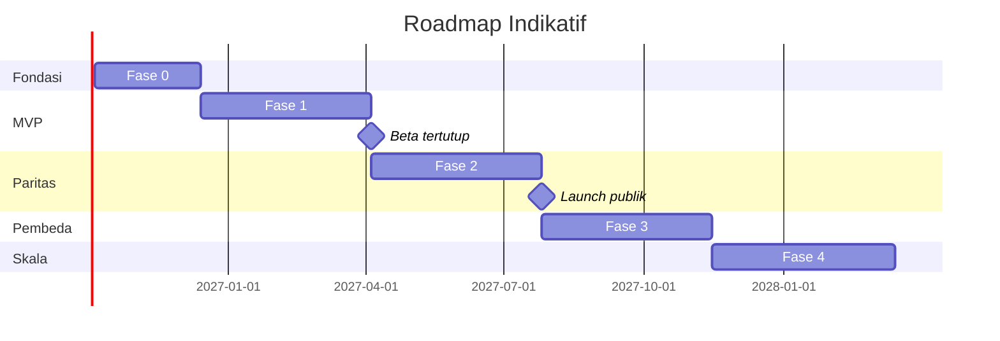

<!-- DIBUAT OTOMATIS dari PRD.md oleh Alat/PecahPrd.py. JANGAN DIEDIT LANGSUNG: ubah PRD.md lalu jalankan ulang skrip. -->

## 22. Roadmap & Fase Pengembangan

> Asumsi tim: 2 backend (Laravel), **3 Flutter** (2 Aplikasi POS, 1 Aplikasi Owner mulai Fase 2), 1 frontend (React/TS, back-office & web publik), 1 fullstack/devops (CI backend + pipeline rilis aplikasi), 1 QA (termasuk uji perangkat & printer), 1 product/UX. Sprint 2 minggu. Estimasi bersifat indikatif.

### Fase 0 — Fondasi & Platform Pengelola Inti (Sprint 1–5, ±10 minggu)

- Monorepo (`Aplikasi/Web/`, `Aplikasi/Kasir/`, `Aplikasi/Pemilik/`, `Paket/`, `Spesifikasi/`) dengan konvensi penamaan §13.7 (termasuk `ModelDasar`, konfigurasi lint, dan MySQL dev berbasis Linux), CI/CD backend ke Hostinger (staging), standar kode (Larastan/Pint/ESLint/Vitest/Pest, `flutter analyze`/`dart test`).
- Kerangka aplikasi Flutter: flavor dev/staging/prod, router, tema dari design token, Drift, dio, Sentry, pipeline build Android & Windows di CI.
- Akun developer: Google Play Console, Apple Developer, sertifikat code signing Windows, proyek Firebase.
- Kerangka modular monolith, domain `Bersama` (Uang, Kuantitas, NomorDokumen, ModelDasar), multi-tenancy + isolation test.
- Auth tenant (register, login, verifikasi, reset, 2FA).
- **Platform Pengelola inti** (dibangun sebelum registrasi tenant dibuka):
  - P-01 tim internal, peran, 2FA wajib, `LogAuditPengelola`, guard & subdomain `pengelola.`
  - P-02 master wilayah, tarif PPN & PBJT (alur tinjauan), hari libur, referensi bank
  - P-04 katalog fitur, paket, batas, add-on, evaluator `FiturAktif`, perantara `PastikanBatasPaket`
  - P-03 template sektor berversi + validasi otomatis (RTL-GEN, FNB-CAF, FNB-QSR)
  - P-05 integrasi email, CAPTCHA, storage + tes koneksi
  - P-06 S&K, Kebijakan Privasi, Perjanjian Pemrosesan Data + pencatatan persetujuan
  - P-07 daftar & detail tenant, perpanjang trial, override, tangguhkan/aktifkan, catatan
  - P-08 tagihan langganan manual + verifikasi bukti transfer
  - P-09 tiket dukungan dasar (email) · P-11 dasbor operasional dasar (scheduler, antrean, job gagal, backup)
- F-02 Organisasi: outlet, gudang, user, role/permission, perangkat, PIN, **aktivasi perangkat (kode/QR → device token)**.
- Design system (Tailwind 4 + shadcn/ui), layout back-office, komponen inti.
- Audit log.

**Exit criteria:** tim internal bisa login ke Platform Pengelola dengan 2FA; paket, 3 template sektor, dan tarif pajak sudah terbit; tenant bisa daftar (menyetujui S&K), membuat outlet & user; tim bisa melihat, memperpanjang trial, dan menagih tenant; isolasi tenant & batas akses pengelola terbukti lewat test (termasuk test arsitektur); aplikasi Flutter (Android & Windows) bisa diaktivasi ke outlet.

### Fase 1 — MVP "Bisa Jualan & Tahu Untung" (Sprint 6–13, ±16 minggu)

Urutan mengikuti flow:
1. F-01 Onboarding wizard + template sektor (RTL-GEN, FNB-CAF, FNB-QSR dulu) + import produk.
2. F-03 Master produk (satuan, varian, modifier, resep, pajak, harga dasar).
3. F-05a Ledger stok + stok awal.
4. F-06 Shift & kas.
5. F-07 **Aplikasi POS Flutter** mode retail & quick + paket `MesinKasir` Dart (dengan test vector bersama PHP/Dart).
6. F-08 Pembayaran (tunai, QRIS statis, EDC, transfer manual, split).
7. **Offline-first** (Drift/SQLite, outbox, bootstrap & delta sync, `/api/pos/v1`).
8. F-09 Void & retur. F-11 Tutup shift.
9. F-13a Jurnal otomatis (penjualan, kas, stok). COA template.
10. F-04 Belanja stok sederhana + PO/GRN/faktur/hutang.
11. F-05b Transfer, opname, penyesuaian.
12. F-14a Laporan inti + dashboard owner + L/R.
13. Cetak struk native (Bluetooth, USB, LAN, printer bawaan Sunmi/iMin, fallback printer sistem), struk digital link.
14. **Rilis iOS/iPadOS** (TestFlight) setelah alur Android/Windows stabil. Mekanisme cek versi & `min_supported_version`. Distribusi Windows selama beta lewat unduhan terbatas (kanal final diputuskan kemudian, D-02).
    Adaptor all-in-one P0: Sunmi, iMin, generik + Wizard Uji Perangkat.
15. Hardware Compatibility List awal (minimal 5 printer & 2 perangkat all-in-one teruji).
16. Beta tertutup dengan 20–30 UMKM (retail & kafe) di campuran Android, Windows, dan iPad.

**Exit criteria:** 30 tenant beta memakai sistem ≥ 4 minggu berturut-turut, 0 kehilangan transaksi offline, jurnal selalu seimbang.

### Fase 2 — Paritas Majoo (Sprint 14–21, ±16 minggu)

- Aplikasi POS mode table (denah, open bill, split/merge), mode **Pelayan** (HP), mode **KDS**, printer dapur per station, customer display (dual-screen Android & monitor kedua desktop).
- Modul **Gudang** di aplikasi (scan GRN, transfer, opname).
- Push notification (FCM/APNs): approval jarak jauh, order online masuk.
- **Aplikasi {{APP}} Owner v1** (Android & iOS): OWN-01 s.d. OWN-09 (dashboard, notifikasi, approval jarak jauh, laporan ringkas, cek stok, aksi cepat, status perangkat, anti-fraud).
- Adaptor all-in-one vendor tambahan (P1) berdasarkan telemetri perangkat.
- Rilis publik di Google Play & App Store (POS dan Owner). Windows memakai kanal yang diputuskan setelah evaluasi stabilitas Fase 1–2.
- Promo engine + voucher + loyalti + tier + deposit + paket sesi.
- Price list & harga tier (X8), harga per channel ojol (input manual).
- Mode service (booking, staf, komisi) + laundry + wholesale (SO/DO/invoice, piutang, limit kredit).
- Karyawan: jadwal, absensi selfie + geofence, komisi, rekap gaji dasar.
- QRIS dinamis & gateway (abstraksi), WhatsApp struk/notifikasi.
- Self-order QR meja.
- Batch & expired, serial, produksi.
- Anti-fraud report & approval jarak jauh.
- Neraca, arus kas, piutang/hutang aging, tutup periode.
- **Launch publik (GA)** + billing semi-otomatis.

### Fase 3 — Melampaui Majoo (Sprint 22–29, ±16 minggu)

- Smart restock & forecast (X6), menu engineering, analisis ABC, insight otomatis mingguan ke owner.
- Open API v1 + webhook + portal developer (X7).
- Konsinyasi (X9), landed cost, rekonsiliasi bank, aset tetap & penyusutan.
- Toko online `/{slugTenant}`, pengiriman & kurir internal.
- Work order bengkel, template sektor lengkap (apotek, elektronik, bahan bangunan, bakery).
- Export e-Faktur/Coretax, laporan PPN.
- Modul Salesman di aplikasi Flutter (kanvas & kunjungan, offline).
- **Mode LAN Lokal / Outlet Hub** (X17).
- Billing SaaS otomatis penuh + referral/reseller.
- Evaluasi migrasi ke VPS (Redis, Supervisor, Reverb) sesuai metrik beban.

### Fase 4 — Skala & Ekosistem

- Franchise & royalti (X10), multi-brand lanjutan.
- Payroll penuh (PPh 21, BPJS).
- Integrasi ojol/marketplace via API resmi (jika tersedia), agregator ekspedisi.
- Aplikasi Owner lanjutan (OWN-10 s.d. OWN-13: karyawan, insight, widget, langganan), NFC kartu member, timbangan serial/USB.
- Marketplace add-on/integrasi pihak ketiga.
- Integrasi Coretax via PJAP.

