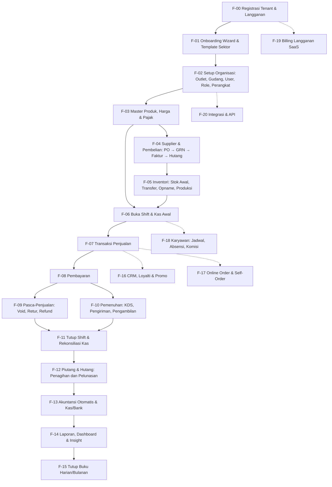
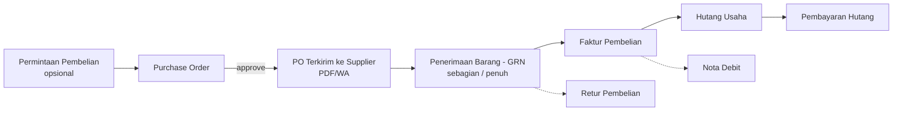
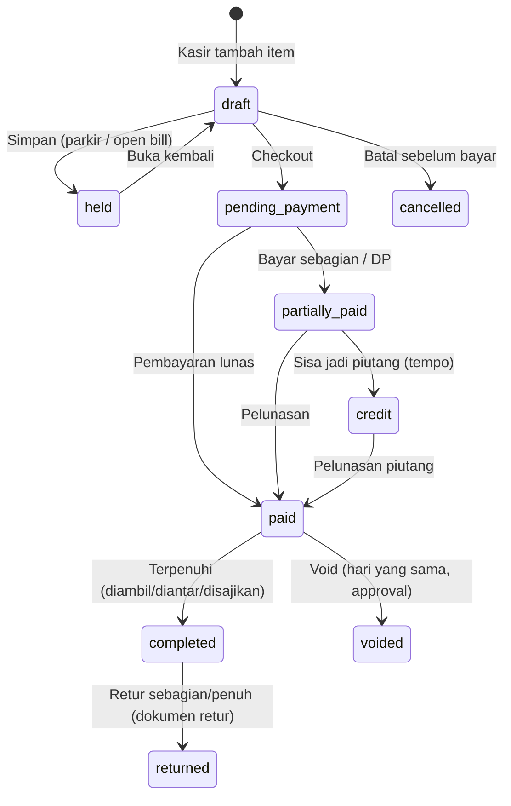
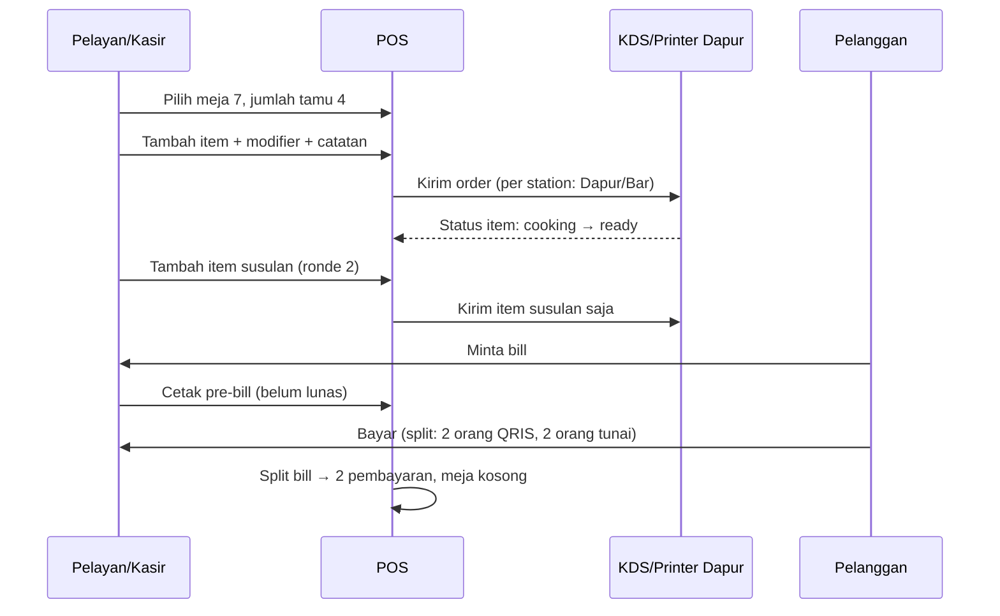
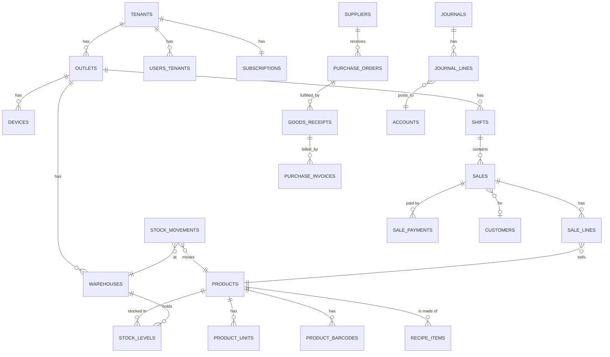
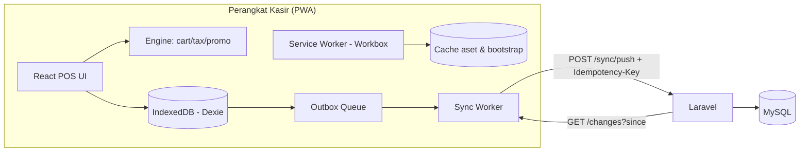
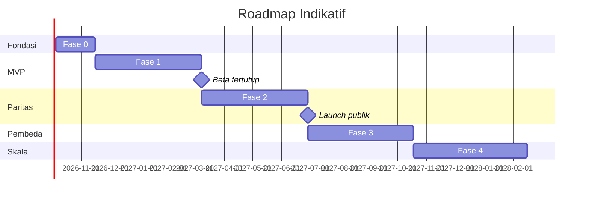

# PRD — POS SaaS Multi-Sektor Indonesia

> **Nama sistem:** belum ditetapkan. Di seluruh dokumen dipakai placeholder **`{{APP}}`**.
> Kandidat nama ada di [Lampiran A](#lampiran-a--kandidat-nama-sistem).

| Atribut | Nilai |
|---|---|
| Dokumen | Product Requirements Document (PRD) |
| Versi | 1.0 (draf awal) |
| Tanggal | 22 September 2026 |
| Status | Draf, menunggu review pemilik produk |
| Pemilik produk | Ahmad Affandi |
| Stack | Laravel 13 · PHP 8.3 · MySQL 8 · Inertia.js + React + TypeScript · Tailwind CSS 4 · TanStack Query |
| Hosting | Hostinger (Web/Cloud Hosting), dengan jalur upgrade ke VPS |
| Bahasa produk | Bahasa Indonesia (utama), English (sekunder) |

---

## Daftar Isi

1. [Ringkasan Eksekutif](#1-ringkasan-eksekutif)
2. [Latar Belakang, Masalah & Peluang](#2-latar-belakang-masalah--peluang)
3. [Analisis Kompetitor & Strategi "Lebih dari Majoo"](#3-analisis-kompetitor--strategi-lebih-dari-majoo)
4. [Tujuan, Non-Tujuan & Metrik Keberhasilan](#4-tujuan-non-tujuan--metrik-keberhasilan)
5. [Sektor Usaha & Persona](#5-sektor-usaha--persona)
6. [Prinsip Pengembangan: Flow-First](#6-prinsip-pengembangan-flow-first)
7. [Peta Flow Bisnis Induk (Master Business Flow)](#7-peta-flow-bisnis-induk-master-business-flow)
8. [Spesifikasi Flow Bisnis Detail (F-00 s.d. F-20)](#8-spesifikasi-flow-bisnis-detail)
9. [Flow Khusus per Sektor](#9-flow-khusus-per-sektor)
10. [Katalog Modul & Fitur (dengan Prioritas)](#10-katalog-modul--fitur)
11. [Akuntansi Otomatis & Pemetaan Jurnal](#11-akuntansi-otomatis--pemetaan-jurnal)
12. [Perpajakan & Regulasi Indonesia](#12-perpajakan--regulasi-indonesia)
13. [Arsitektur Teknis](#13-arsitektur-teknis)
14. [Strategi Hosting di Hostinger](#14-strategi-hosting-di-hostinger)
15. [Model Data (Skema Database)](#15-model-data-skema-database)
16. [Desain API & Integrasi](#16-desain-api--integrasi)
17. [Arsitektur Frontend & UX](#17-arsitektur-frontend--ux)
18. [Offline-First POS & Sinkronisasi](#18-offline-first-pos--sinkronisasi)
19. [Hak Akses (RBAC) & Approval](#19-hak-akses-rbac--approval)
20. [Kebutuhan Non-Fungsional](#20-kebutuhan-non-fungsional)
21. [Paket Langganan & Monetisasi](#21-paket-langganan--monetisasi)
22. [Roadmap & Fase Pengembangan](#22-roadmap--fase-pengembangan)
23. [Strategi Pengujian & Quality Gate](#23-strategi-pengujian--quality-gate)
24. [Risiko & Mitigasi](#24-risiko--mitigasi)
25. [Pertanyaan Terbuka](#25-pertanyaan-terbuka)
26. [Glosarium](#26-glosarium)
27. [Lampiran](#27-lampiran)

---

## 1. Ringkasan Eksekutif

**{{APP}}** adalah platform Point of Sale (POS) dan manajemen usaha berbasis SaaS untuk UMKM hingga usaha menengah multi-outlet di Indonesia. Satu platform melayani banyak sektor (F&B, retail, jasa, grosir, apotek, laundry, bengkel, dan lainnya) melalui **Template Sektor**: saat tenant mendaftar dan memilih jenis usaha, sistem menyalakan modul, alur kasir, bagan akun (COA), satuan, pajak, dan laporan yang sesuai. Tenant tidak perlu mengatur semuanya dari nol.

Pengembangan dimulai dari **flow bisnis**, bukan dari layar atau tabel. Setiap fitur harus bisa ditelusuri ke satu langkah dalam alur bisnis induk:

```
Daftar → Setup Usaha → Master Data → Pembelian & Stok Masuk → Buka Shift
      → Penjualan → Pembayaran → Pasca-Penjualan → Tutup Shift
      → Akuntansi Otomatis → Laporan & Insight → Tutup Buku
```

Setiap transaksi operasional (jual, beli, mutasi stok, kas) **otomatis menghasilkan jurnal akuntansi**. Dengan begitu laporan keuangan (Laba Rugi, Neraca, Arus Kas) selalu siap tanpa input ganda.

**Pembeda utama dibanding majoo dan pemain lain** (rinci di §3):

1. **Offline-first sungguhan.** Kasir tetap bisa berjualan penuh saat internet mati (PWA + IndexedDB), lalu sinkron otomatis tanpa transaksi ganda.
2. **Template Sektor + Feature Toggle.** Satu produk bisa disetel untuk 12+ jenis usaha, dan satu tenant boleh punya beberapa sektor sekaligus (misalnya kafe + retail merchandise).
3. **Promo Engine berbasis aturan.** Buy X Get Y, bundling, happy hour, tier member, voucher, dan stacking rules bisa dikonfigurasi tanpa kode.
4. **Akuntansi dan pajak Indonesia bawaan**, siap untuk PPN (termasuk DPP nilai lain), PB1/PBJT, e-Faktur/Coretax export, dan SAK EMKM/SAK EP.
5. **Audit trail dan approval berlapis.** Void, diskon manual, refund, dan penyesuaian stok wajib beralasan, bisa perlu PIN supervisor, dan tercatat permanen.
6. **Open API dan webhook** untuk integrasi ERP, marketplace, dan akuntansi pihak ketiga.
7. **Insight cerdas**: saran restock berbasis prediksi, deteksi anomali kasir, menu engineering (F&B), dan analisis ABC (retail).
8. **Biaya infrastruktur rendah.** Arsitektur dirancang agar bisa berjalan di shared/cloud hosting Hostinger, sehingga harga langganan bisa lebih kompetitif.

---

## 2. Latar Belakang, Masalah & Peluang

### 2.1 Konteks Pasar

- Indonesia punya lebih dari 60 juta pelaku UMKM. Sebagian besar masih mencatat transaksi secara manual atau semi-manual (buku, Excel, WhatsApp).
- Adopsi QRIS meningkat pesat, sehingga pembayaran non-tunai sudah menjadi standar, bukan fitur tambahan.
- Pemilik usaha multi-outlet butuh kontrol stok dan kas jarak jauh karena kebocoran (fraud kasir, stok hilang) adalah masalah utama.
- Regulasi pajak terus berubah (PPN 12% dengan DPP nilai lain, Coretax DJP, PBJT daerah). Sistem wajib bisa dikonfigurasi, bukan hard-coded.

### 2.2 Masalah Pengguna

| # | Masalah | Dampak | Siapa yang merasakan |
|---|---|---|---|
| P1 | Internet tidak stabil (terutama di luar kota besar) sehingga POS cloud macet | Antrian, transaksi hilang, pelanggan kabur | Kasir, Owner |
| P2 | Stok tidak akurat antara sistem dan fisik | Stockout / overstock, uang tertahan | Owner, Gudang |
| P3 | Kebocoran kas dan fraud kasir (void fiktif, diskon liar) | Kerugian langsung | Owner |
| P4 | Laporan keuangan harus direkap manual | Tidak tahu untung sebenarnya, sulit ajukan kredit | Owner, Akuntan |
| P5 | Satu aplikasi tidak cocok untuk usaha campuran (resto + toko) | Pakai 2–3 aplikasi, data terpisah | Owner |
| P6 | Promo rumit tidak bisa diatur | Kehilangan peluang penjualan | Marketing, Owner |
| P7 | Hitung HPP/resep F&B manual | Harga jual salah, margin tipis | Owner F&B |
| P8 | Pajak (PPN/PB1) salah hitung | Risiko sanksi | Owner, Akuntan |
| P9 | Biaya langganan dan hardware mahal | UMKM mikro enggan beralih | UMKM mikro |

### 2.3 Peluang

Belum ada pemain yang menggabungkan **(a)** offline-first yang andal, **(b)** multi-sektor dalam satu tenant, **(c)** akuntansi dan pajak Indonesia yang benar secara otomatis, dan **(d)** harga terjangkau untuk UMKM mikro. {{APP}} mengisi celah tersebut.

---

## 3. Analisis Kompetitor & Strategi "Lebih dari Majoo"

### 3.1 Lanskap

| Pemain | Kekuatan umum | Celah yang bisa dimanfaatkan |
|---|---|---|
| **majoo** | Ekosistem lengkap (POS, inventori, akuntansi, CRM, karyawan, toko online), banyak sektor, brand kuat | Mode offline terbatas, paket fitur lengkap relatif mahal untuk mikro, kustomisasi promo & approval terbatas, integrasi API terbuka terbatas |
| Moka (GoTo) | Kuat di F&B/retail, ekosistem GoBiz | Akuntansi dasar, fokus ekosistem sendiri |
| Pawoon | Mudah dipakai, F&B | Fitur back-office lebih ringan |
| Qasir | Gratis/murah untuk mikro | Fitur multi-outlet & akuntansi terbatas |
| iSeller / Olsera | Omnichannel retail | Kurang di F&B dan jasa |
| ESB | F&B enterprise, kuat di resto chain | Mahal, kompleks untuk UMKM |

> Catatan: Tabel adalah gambaran umum posisi pasar untuk arah produk, bukan klaim fitur spesifik. Tim wajib melakukan uji langsung (trial akun) setiap kompetitor sebelum finalisasi fitur di tiap fase.

### 3.2 Paritas Wajib (Table Stakes, setara majoo)

Fitur berikut **harus ada** agar {{APP}} layak dibandingkan:

- POS kasir (retail & F&B), multi-pembayaran, QRIS, struk cetak/digital
- Manajemen produk: varian, modifier/add-on, bundling, resep/bahan baku
- Inventori multi-outlet & multi-gudang, transfer stok, stock opname, PO & penerimaan
- Manajemen meja, split bill, kitchen printer/KDS (F&B)
- CRM pelanggan, poin/loyalti, voucher, promo
- Karyawan: shift, absensi, komisi, hak akses
- Akuntansi: jurnal otomatis, Laba Rugi, Neraca, Arus Kas
- Laporan penjualan, stok, kas, per outlet/karyawan/produk
- Toko online / pesan online, integrasi ojol (fase lanjut)
- Aplikasi owner (dashboard mobile)

### 3.3 Pembeda (Beyond Majoo)

| Kode | Pembeda | Deskripsi | Fase |
|---|---|---|---|
| X1 | **Offline-first POS** | Seluruh alur kasir (jual, bayar tunai/EDC manual, cetak struk, buka/tutup shift) berjalan tanpa internet. Sinkron idempoten via outbox. | 1 |
| X2 | **Multi-sektor per tenant** | Satu tenant bisa memakai beberapa template sektor per outlet (outlet A kafe, outlet B toko retail). Satu pelanggan dan satu laporan konsolidasi. | 1 |
| X3 | **Promo Engine (rule-based)** | Kondisi (produk, kategori, waktu, member tier, channel, min. belanja) × aksi (diskon %, nominal, gratis item, harga spesial) dengan prioritas & stacking. | 2 |
| X4 | **Approval Workflow & Anti-Fraud** | PIN/OTP supervisor untuk void, refund, diskon di atas batas, buka laci kas manual. Skor risiko kasir & notifikasi anomali ke owner. | 1–2 |
| X5 | **Akuntansi & Pajak Indonesia native** | COA per sektor, jurnal otomatis dari setiap event, PPN DPP nilai lain, PB1/PBJT, export e-Faktur/Coretax, SAK EMKM. | 1–3 |
| X6 | **Smart Restock & Forecast** | Prediksi kebutuhan stok (moving average + musiman, termasuk Ramadan/Lebaran), draft PO otomatis ke supplier. | 3 |
| X7 | **Open API + Webhook** | REST API v1 bertoken, webhook event (order.paid, stock.low, dll.), dokumentasi publik. | 3 |
| X8 | **Harga multi-level & per channel** | Harga berbeda per outlet, per channel (dine-in, takeaway, GoFood, GrabFood, Shopee), per tier pelanggan (grosir/reseller), per jumlah (tiered pricing). | 2 |
| X9 | **Konsinyasi & titip jual** | Barang titipan supplier: stok tidak masuk aset, hutang timbul hanya saat terjual, laporan settlement ke penitip. | 3 |
| X10 | **Franchise/Kemitraan** | Royalti otomatis per outlet mitra, master menu terpusat, harga terkunci, laporan royalti. | 4 |
| X11 | **Struk & notifikasi WhatsApp** | Kirim struk, invoice, pengingat piutang, dan notifikasi booking via WhatsApp (gateway pihak ketiga). | 2 |
| X12 | **Self-order QR Meja** | Pelanggan scan QR di meja, pesan dan bayar (QRIS) sendiri, order masuk ke KDS. | 2 |
| X13 | **Booking & Antrian (Jasa)** | Booking online salon/barbershop/bengkel, antrian digital, pemilihan staf, reminder otomatis. | 2 |
| X14 | **Audit Trail Permanen** | Setiap perubahan data penting tercatat (siapa, kapan, nilai lama/baru, perangkat, IP). Tidak bisa dihapus tenant. | 1 |
| X15 | **Hardware-agnostic** | Berjalan di browser apa pun (Android tablet murah, PC bekas, iPad). Printer thermal via Bluetooth/USB/LAN. Tidak mewajibkan beli hardware tertentu. | 1 |
| X16 | **Import massal & migrasi dari kompetitor** | Template Excel + importer yang memetakan export dari aplikasi lain agar pindah platform mudah. | 1 |

---

## 4. Tujuan, Non-Tujuan & Metrik Keberhasilan

### 4.1 Tujuan Produk

| ID | Tujuan |
|---|---|
| G1 | Tenant baru bisa melakukan transaksi pertama dalam **≤ 15 menit** setelah daftar (onboarding wizard + template sektor). |
| G2 | Kasir bisa menyelesaikan transaksi retail 5 item dalam **≤ 20 detik**, dan tetap bisa beroperasi offline. |
| G3 | Laporan keuangan (L/R, Neraca) tersedia **real-time** tanpa input akuntansi manual. |
| G4 | Selisih stok sistem vs fisik turun (target tenant aktif: selisih opname < 2% nilai persediaan). |
| G5 | Biaya infra per tenant cukup rendah untuk paket mikro ≤ Rp 99.000/bulan. |

### 4.2 Non-Tujuan (di luar lingkup v1)

- ERP manufaktur penuh (MRP, routing, work center). Hanya produksi sederhana/rakitan (BOM 1 level + multi-level terbatas).
- Payroll lengkap dengan PPh 21 dan BPJS otomatis. v1 hanya rekap gaji, komisi, dan absensi; payroll penuh di fase 4.
- Aplikasi native iOS/Android. v1 memakai **PWA** yang bisa di-install. Pembungkus native (Capacitor) opsional di fase 4 untuk akses hardware tertentu.
- Rumah sakit/klinik dengan rekam medis (butuh regulasi SATUSEHAT). Hanya apotek/toko obat ringan.
- Hotel dengan channel manager OTA.

### 4.3 KPI / Metrik

| Kategori | Metrik | Target 12 bulan setelah launch |
|---|---|---|
| Akuisisi | Tenant terdaftar | 3.000 |
| Aktivasi | % tenant yang transaksi pertama ≤ 24 jam | ≥ 60% |
| Retensi | Retensi tenant berbayar bulan ke-3 | ≥ 75% |
| Monetisasi | Konversi trial → berbayar | ≥ 20% |
| Keandalan | Uptime aplikasi (di luar mode offline) | ≥ 99,5% |
| Keandalan | Transaksi offline gagal sinkron | < 0,01% |
| Kinerja | p95 respons API kasir | < 400 ms |
| Kualitas | Bug kritikal di produksi per bulan | < 2 |
| Kepuasan | NPS tenant | ≥ 40 |

---

## 5. Sektor Usaha & Persona

### 5.1 Template Sektor

Template Sektor adalah paket konfigurasi yang diterapkan saat onboarding (dan bisa ditambah kemudian per outlet). Isinya: modul aktif, mode layar kasir, COA default, satuan default, pajak default, contoh kategori, dan laporan unggulan.

| Kode | Sektor | Contoh usaha | Mode kasir | Modul khas yang aktif |
|---|---|---|---|---|
| FNB-RST | F&B Restoran | Rumah makan, resto keluarga | `table` | Meja & denah, KDS/printer dapur, split/merge bill, service charge, PB1, resep & HPP |
| FNB-CAF | F&B Kafe/Kedai Kopi | Coffee shop, kedai | `quick` + `table` | Modifier (gula, es, size), antrian nomor order, self-order QR |
| FNB-QSR | F&B Cepat Saji/Kaki Lima | Ayam geprek, bakso, angkringan | `quick` | Nomor antrian, paket combo, layar besar tombol |
| FNB-BAK | Bakery & Kue | Toko roti, katering kue | `retail` + pre-order | Produksi harian, pre-order + DP, expired harian |
| RTL-GEN | Retail Umum/Kelontong | Toko kelontong, minimarket | `retail` | Barcode, harga bertingkat, multi-satuan (pcs/pak/dus), expired |
| RTL-FSH | Fashion & Aksesoris | Butik, distro | `retail` | Varian (ukuran × warna) matrix, musim/koleksi, retur tukar |
| RTL-ELC | Elektronik & Gadget | Toko HP, komputer | `retail` | Serial number/IMEI, garansi, servis |
| RTL-PHR | Apotek/Toko Obat | Apotek, toko obat berizin | `retail` | Batch & expired (FEFO), golongan obat, resep dokter, harga HNA/HJA |
| RTL-BLD | Bahan Bangunan | Toko besi, material | `retail` + `wholesale` | Multi-satuan dengan desimal (m, kg, batang), pengiriman, tempo |
| WHS-DST | Grosir & Distributor | Grosir sembako, distributor | `wholesale` | Sales order, harga per level pelanggan, piutang & tempo, salesman, kanvas |
| SVC-SLN | Salon/Barbershop/Spa | Salon, barbershop, spa | `service` | Booking, staf & komisi, paket membership/sesi |
| SVC-LDR | Laundry | Laundry kiloan/satuan | `service` + tracking | Tiket laundry, status proses, estimasi selesai, notifikasi ambil |
| SVC-WRK | Bengkel | Bengkel motor/mobil | `service` + part | Work order, jasa + sparepart, mekanik, riwayat kendaraan |
| SVC-GEN | Jasa Umum | Fotokopi, percetakan, rental | `service` | Order kustom, DP, status pengerjaan |

Mode kasir menentukan layout layar POS (§17.4):

- `retail`: fokus scan barcode, daftar keranjang panjang.
- `quick`: grid tombol produk besar, satu ketukan per item.
- `table`: denah meja, order terbuka per meja.
- `service`: pilih layanan + staf + jadwal.
- `wholesale`: input cepat SKU × qty, harga per level, tempo.

### 5.2 Persona

| Persona | Deskripsi | Kebutuhan utama | Perangkat |
|---|---|---|---|
| **Owner (Bu Rina)** | Pemilik 3 outlet kafe + 1 toko merchandise | Dashboard real-time, laporan laba, kontrol kebocoran, notifikasi | HP Android, laptop |
| **Manajer Outlet (Dimas)** | Mengelola 1 outlet, 8 staf | Jadwal shift, stok, approval void/diskon, opname | Tablet, PC |
| **Kasir (Sari)** | Lulusan SMA, 2 minggu training | Layar sederhana, cepat, tidak takut salah | Tablet Android 10" |
| **Staf Dapur/Barista** | Menyiapkan pesanan | KDS jelas, urutan order, tanda selesai | Tablet/monitor dapur |
| **Staf Gudang (Anto)** | Terima barang, transfer, opname | Scan barcode, form cepat, jelas selisih | HP Android |
| **Akuntan/Konsultan Pajak** | Eksternal, akses baca | Jurnal, buku besar, export e-Faktur, tutup buku | Laptop |
| **Pelanggan Akhir** | Pembeli | Struk digital, poin, self-order, booking | HP |
| **Super Admin {{APP}}** | Tim internal | Kelola tenant, langganan, dukungan, monitoring | Laptop |

---

## 6. Prinsip Pengembangan: Flow-First

### 6.1 Definisi

**Flow-First Development** berarti setiap unit pekerjaan dimulai dari **flow bisnis** yang terdefinisi (aktor, pemicu, langkah, aturan, hasil, dan dampak akuntansi/stok), baru kemudian diturunkan menjadi:

```
Flow Bisnis (F-xx)
   └─ State Machine dokumen (draft → posted → ...)
        └─ Domain Events (SaleCompleted, GoodsReceived, ...)
             └─ Efek samping: Stok (ledger) + Jurnal (akuntansi) + Notifikasi
                  └─ Skema DB + Action class + Test
                       └─ UI (Inertia page + komponen)
```

### 6.2 Aturan Tim

1. **Tidak ada fitur tanpa ID Flow.** Setiap issue/PR mencantumkan `F-xx.langkah`.
2. **Urutan implementasi mengikuti urutan flow induk** (§7). Sebuah flow hanya boleh dikerjakan setelah flow prasyaratnya berstatus *Done*. Contoh: Penjualan (F-07) butuh Master Produk (F-03) dan Shift (F-06).
3. **Setiap flow wajib memiliki**: diagram alur, state machine dokumen, daftar aturan bisnis (BR-xx), dampak stok, dampak jurnal, hak akses, acceptance criteria (Gherkin), dan test otomatis.
4. **Dokumen transaksi bersifat immutable setelah *posted*.** Koreksi dilakukan dengan dokumen pembalik (void/retur/adjustment), bukan edit/hapus.
5. **Stok dan akuntansi adalah turunan (derived) dari event.** Tidak ada input manual ke tabel saldo stok atau saldo akun.
6. **Definition of Done per flow**: happy path + edge case lulus test, jurnal seimbang (debit = kredit), ledger stok konsisten, audit log tercatat, UI bisa dipakai di tablet 10".

### 6.3 Template Spesifikasi Flow

Setiap flow di §8 memakai struktur berikut:

- **Tujuan**, **Aktor**, **Pemicu**, **Prasyarat**
- **Langkah** (bernomor)
- **Aturan Bisnis** (BR)
- **State Machine**
- **Dampak Stok** / **Dampak Jurnal**
- **Acceptance Criteria**

---

## 7. Peta Flow Bisnis Induk (Master Business Flow)

### 7.1 Diagram Induk



### 7.2 Urutan Implementasi (Dependency Order)

| Urutan | Flow | Bergantung pada | Fase |
|---|---|---|---|
| 1 | F-00 Registrasi & Tenant | — | 0 |
| 2 | F-02 Organisasi (outlet, user, role) | F-00 | 0 |
| 3 | F-01 Onboarding & Template Sektor | F-00, F-02 | 1 |
| 4 | F-03 Master Produk, Harga, Pajak | F-02 | 1 |
| 5 | F-05a Stok Awal & Ledger Stok | F-03 | 1 |
| 6 | F-06 Shift & Kas | F-02 | 1 |
| 7 | F-07 Penjualan (retail/quick) | F-03, F-05a, F-06 | 1 |
| 8 | F-08 Pembayaran (tunai, QRIS statis, EDC manual) | F-07 | 1 |
| 9 | F-09 Void/Retur | F-07, F-08 | 1 |
| 10 | F-11 Tutup Shift | F-06, F-08 | 1 |
| 11 | F-13a Jurnal Otomatis (penjualan, kas) | F-07–F-11 | 1 |
| 12 | F-14a Laporan inti | F-07–F-13a | 1 |
| 13 | F-04 Pembelian & Hutang | F-03, F-05a | 1 |
| 14 | F-05b Transfer, Opname, Penyesuaian | F-05a | 1 |
| 15 | F-07 Mode `table` + F-10 KDS | F-07 | 2 |
| 16 | F-16 CRM, Loyalti, Promo Engine | F-07 | 2 |
| 17 | F-12 Piutang/Tempo & Wholesale | F-07, F-08 | 2 |
| 18 | F-18 Karyawan & Komisi | F-02, F-07 | 2 |
| 19 | F-07 Mode `service` (booking) | F-07, F-18 | 2 |
| 20 | F-17 Self-order & Online Order | F-07, F-08, F-10 | 2 |
| 21 | F-13b Akuntansi penuh + F-15 Tutup Buku | F-13a | 3 |
| 22 | F-05c Produksi/Resep lanjutan, Konsinyasi | F-05 | 3 |
| 23 | F-20 Open API & Webhook | semua | 3 |
| 24 | F-19 Billing SaaS otomatis | F-00 | 1 (manual) → 3 (otomatis) |

---

## 8. Spesifikasi Flow Bisnis Detail

> Konvensi: **BR** = Business Rule, **AC** = Acceptance Criteria, **Dr/Cr** = Debit/Kredit.
> Semua nominal dalam Rupiah (IDR). Semua waktu disimpan dalam UTC dan ditampilkan sesuai zona waktu outlet (WIB/WITA/WIT).

### F-00 · Registrasi Tenant & Langganan

**Tujuan:** Calon pelanggan membuat akun usaha (tenant) dan memulai masa trial.
**Aktor:** Calon Owner, Sistem.
**Pemicu:** Klik "Daftar Gratis" di landing page.

**Langkah:**
1. Isi nama, email, no. WhatsApp, password, nama usaha.
2. Verifikasi email (link) **atau** OTP WhatsApp.
3. Sistem membuat: `tenant`, `user` (role Owner), `subscription` (status `trialing`, 14 hari, paket Pro), outlet default "Outlet Utama", gudang default.
4. Redirect ke Onboarding Wizard (F-01).

**Aturan Bisnis:**
- BR-00.1 Email dan nomor WA unik per user. Satu user **boleh** menjadi anggota beberapa tenant (konsultan/akuntan), dengan pemilih tenant setelah login.
- BR-00.2 Slug tenant unik, dibuat otomatis dari nama usaha. Dipakai untuk URL toko online `/{slug}`.
- BR-00.3 Trial tidak butuh kartu kredit. Di akhir trial, tenant turun ke paket Gratis (fitur terbatas), bukan dihapus.
- BR-00.4 Rate-limit registrasi per IP (anti-spam) + CAPTCHA (Cloudflare Turnstile).

**State Machine `subscription`:**
```
trialing → active → past_due → suspended → cancelled
    ↘ free (jika trial habis tanpa bayar)
```
- `past_due`: grace period 7 hari. Semua fitur jalan, tampil banner.
- `suspended`: hanya bisa login, melihat laporan, export data, dan membayar tagihan. POS terkunci, kecuali tenant memilih turun ke paket Gratis (maks 1 outlet, 1 perangkat). Data tenant **tidak pernah dihapus** selama 12 bulan setelah `cancelled`, dan tenant selalu bisa export datanya.
- Transaksi offline yang dibuat sebelum status berubah tetap diterima saat sinkron.

**AC:**
```gherkin
Given calon pengguna mengisi form registrasi dengan data valid
When ia menekan "Daftar"
Then tenant, user owner, outlet "Outlet Utama", gudang default, dan subscription trialing 14 hari terbentuk
And ia diarahkan ke Onboarding Wizard
```

---

### F-01 · Onboarding Wizard & Template Sektor

**Tujuan:** Tenant siap transaksi dalam ≤ 15 menit.
**Aktor:** Owner.

**Langkah (Wizard 6 langkah, bisa dilewati & dilanjutkan):**
1. **Profil usaha**: nama, alamat, provinsi/kota (untuk zona waktu & tarif PBJT), logo, NPWP (opsional), status PKP (ya/tidak).
2. **Pilih sektor** (bisa lebih dari satu), lalu pilih template untuk **Outlet Utama**.
3. **Pajak**: sistem mengusulkan default sesuai sektor & status PKP (F&B: PB1/PBJT 10% + service charge opsional; Retail PKP: PPN). Owner mengonfirmasi atau mengubah.
4. **Produk awal** (pilih salah satu): (a) contoh produk dari template, (b) import Excel/CSV, (c) import dari export aplikasi lain (majoo/Moka/Pawoon/dll. via mapper kolom), (d) tambah manual cepat (nama + harga).
5. **Metode pembayaran**: tunai (default), QRIS (statis upload gambar dulu, dinamis via payment gateway nanti), EDC bank, transfer.
6. **Perangkat & printer**: daftarkan perangkat ini sebagai kasir, tes cetak struk.
7. Selesai. Tampil checklist "Langkah Berikutnya" (undang staf, stok awal, dll.) di dashboard.

**Aturan Bisnis:**
- BR-01.1 Menerapkan template bersifat **idempoten dan aditif**: menambah modul/COA/kategori yang belum ada, tidak menghapus data yang sudah ada.
- BR-01.2 COA dibuat dari gabungan COA inti + ekstensi sektor (§11.2).
- BR-01.3 Feature flag per outlet disimpan di `outlet_features` sehingga layar POS & menu menyesuaikan.

---

### F-02 · Setup Organisasi

**Tujuan:** Struktur usaha tergambar di sistem: Tenant → Brand (opsional) → Outlet → Gudang/Lokasi → Perangkat → User.

**Entitas & hubungan:**
```
Tenant 1─* Brand 1─* Outlet 1─* Warehouse(Location)
                         1─* Device (kasir/KDS/self-order kiosk)
                         1─* Table Area 1─* Table   (F&B)
Tenant 1─* User *─* Outlet (penugasan) + Role per outlet
```

**Langkah:**
1. Tambah outlet (nama, kode 3–5 huruf untuk penomoran dokumen, alamat, zona waktu, template sektor, jam operasional).
2. Tambah gudang/lokasi stok per outlet (default: 1 lokasi "Toko"). Bisa tambah "Gudang Belakang", "Dapur", "Bar".
3. Undang user via email/WA dengan role & outlet yang ditugaskan.
4. Kasir mendapat **PIN 6 digit** untuk login cepat di perangkat kasir bersama.
5. Registrasi perangkat: perangkat mendapat `device_code` (misal `JKT1-K02`) untuk penomoran offline.

**Aturan Bisnis:**
- BR-02.1 Jumlah outlet, perangkat, dan user dibatasi paket langganan.
- BR-02.2 Kode outlet unik per tenant dan **tidak bisa diubah** setelah ada transaksi.
- BR-02.3 Perangkat yang dicabut (revoke) langsung ditolak saat sinkron, tetapi transaksi offline yang sudah dibuat sebelum revoke **tetap diterima** (dengan flag review).
- BR-02.4 Setiap outlet wajib punya minimal 1 lokasi stok dan 1 akun kas (Kas Outlet).

---

### F-03 · Master Produk, Harga & Pajak

**Tujuan:** Katalog lengkap yang mendukung semua sektor.

**Tipe produk:**

| Tipe | Keterangan | Punya stok? | Contoh |
|---|---|---|---|
| `stock` | Barang dagang biasa | Ya | Sabun, kaos |
| `variant_parent` | Induk varian (tidak dijual langsung) | Tidak (anak yang punya stok) | Kaos → S/M/L × Merah/Biru |
| `recipe` | Produk jadi dari resep; stok bahan berkurang saat terjual | Tidak (bahan yang berkurang) | Es kopi susu |
| `manufactured` | Diproduksi dulu (batch), lalu punya stok | Ya | Roti, kue |
| `bundle` | Paket beberapa produk; stok komponen berkurang | Tidak | Paket hemat |
| `service` | Jasa | Tidak | Potong rambut, cuci motor |
| `non_inventory` | Tanpa stok | Tidak | Biaya kirim, kantong plastik gratis |
| `raw_material` | Bahan baku (tidak tampil di POS) | Ya | Susu, gula, biji kopi |
| `consignment` | Titipan | Ya (bukan aset) | Kue titipan |

**Atribut penting produk:**
- SKU (unik per tenant), barcode (bisa banyak per produk/satuan), nama, nama struk (pendek), kategori (bertingkat), brand, gambar.
- **Satuan & konversi:** satuan dasar (pcs) + satuan alternatif (pak = 10 pcs, dus = 12 pak). Harga & barcode boleh berbeda per satuan. Qty desimal diizinkan per produk (kg, meter).
- **Modifier group:** misal "Level Gula" (wajib, pilih 1), "Topping" (opsional, maks 3, masing-masing berharga & opsional mengurangi stok bahan).
- **Resep/BOM:** daftar bahan × qty × satuan, termasuk *yield* & *waste %*. Contoh: 1 cup Es Kopi Susu = 18 g kopi + 150 ml susu + 20 ml gula aren + 1 cup + 1 sedotan.
- **Pelacakan:** `none` | `batch_expiry` | `serial`.
- **Pajak:** kategori pajak produk (Kena PPN, Bebas PPN, Kena PB1, Non-pajak) dan flag harga *termasuk pajak* / *belum termasuk pajak*.
- **HPP:** metode per tenant: **Moving Average (default)** atau **FIFO**.
- Min/Max stok per lokasi (untuk restock), flag "tampil di POS", "tampil di toko online", "boleh jual saat stok kosong".

**Harga (Price Engine):**

Harga final ditentukan berlapis (prioritas tinggi ke rendah):
1. Harga manual kasir (butuh izin `pos.price.override`)
2. Promo aktif (Promo Engine, F-16)
3. **Price List** yang cocok (kombinasi outlet × channel × tier pelanggan × rentang waktu)
4. Harga bertingkat qty (tiered): 1–11 = Rp 5.000, 12+ = Rp 4.500
5. Harga dasar produk per satuan

**Aturan Bisnis:**
- BR-03.1 SKU unik per tenant. Barcode unik per tenant (boleh sama lintas tenant).
- BR-03.2 Produk yang sudah punya transaksi tidak bisa dihapus, hanya diarsipkan.
- BR-03.3 Perubahan harga dicatat di `price_histories` (kapan, siapa, lama/baru).
- BR-03.4 Perubahan resep **tidak** mengubah transaksi lampau (resep di-snapshot saat penjualan untuk kalkulasi HPP).
- BR-03.5 HPP produk resep = Σ (qty bahan × HPP bahan saat itu) / yield.
- BR-03.6 Import massal memakai validasi baris per baris dengan laporan error yang bisa diunduh. Import besar diproses di antrian (queue).

---

### F-04 · Supplier & Pembelian

**Tujuan:** Barang masuk tercatat benar, HPP akurat, hutang terkendali.
**Aktor:** Staf Gudang/Purchasing, Manajer, Owner (approval).

**Alur:**


**Langkah:**
1. (Opsional) Outlet membuat **Permintaan Pembelian** atau sistem membuat draft dari *Smart Restock* (stok < min).
2. **PO**: pilih supplier, lokasi tujuan, item × qty × satuan × harga, diskon, PPN masukan, ongkir, termin (tunai/tempo N hari).
3. **Approval PO** jika total > batas yang dikonfigurasi (misal > Rp 5 juta butuh Owner).
4. Kirim PO ke supplier (PDF, WA link, email).
5. **GRN**: gudang menerima barang, input qty diterima per item (boleh parsial), batch & expired, foto surat jalan. **Stok bertambah saat GRN diposting.**
6. **Faktur Pembelian**: dicocokkan dengan PO & GRN (*3-way matching*). Selisih harga memicu penyesuaian HPP.
7. **Hutang** tercatat sesuai termin. Muncul di daftar "Jatuh Tempo".
8. **Pembayaran Hutang**: dari akun kas/bank, bisa sebagian, bisa banyak faktur sekaligus.
9. **Retur Pembelian**: barang rusak/salah dikembalikan, stok berkurang, hutang berkurang (atau nota debit/refund).

**Pembelian langsung (UMKM mikro):** mode sederhana "Belanja Stok". Satu form berisi supplier (opsional), item, total, dan bayar tunai. Sistem otomatis membuat GRN + faktur + pembayaran dalam satu langkah.

**State Machine PO:** `draft → pending_approval → approved → partially_received → received → closed` (+ `cancelled` hanya bila belum ada GRN).

**Aturan Bisnis:**
- BR-04.1 GRN tidak boleh melebihi qty PO kecuali toleransi (%) yang disetel.
- BR-04.2 HPP Moving Average dihitung ulang saat GRN diposting: `HPP_baru = (stok_lama × HPP_lama + qty_masuk × harga_masuk) / (stok_lama + qty_masuk)`. Harga masuk sudah termasuk alokasi ongkir/diskon (landed cost), tidak termasuk PPN masukan yang dapat dikreditkan.
- BR-04.3 Jika stok lama negatif (jual saat kosong), HPP baru = harga masuk, dan selisih HPP dibukukan ke akun "Selisih HPP".
- BR-04.4 Faktur dengan harga berbeda dari GRN: jika stok masih ada → revaluasi persediaan; jika sudah terjual → selisih ke HPP.

**Dampak Jurnal:** lihat §11.3 (J-04.x).

---

### F-05 · Inventori

**Sumber kebenaran:** tabel `stock_movements` (ledger append-only). Saldo di `stock_levels` adalah cache yang bisa dibangun ulang dari ledger.

**Sub-flow:**

| Kode | Sub-flow | Keterangan |
|---|---|---|
| F-05a | **Stok Awal** | Input/import saldo awal per lokasi + HPP awal. Jurnal: Dr Persediaan, Cr Ekuitas Saldo Awal. |
| F-05b | **Transfer Antar Lokasi/Outlet** | `draft → sent (in-transit) → received` (parsial boleh). Selisih kirim vs terima → penyesuaian dengan alasan. |
| F-05c | **Stock Opname** | Snapshot stok sistem saat mulai; hitung fisik (scan/input, bisa beberapa orang, per rak/kategori); review selisih; approve → penyesuaian otomatis. Opsi *blind count* (penghitung tidak melihat qty sistem). |
| F-05d | **Penyesuaian Stok** | Rusak, hilang, kadaluarsa, sampel, konsumsi internal. Wajib alasan + approval di atas nilai tertentu. |
| F-05e | **Produksi / Rakitan** | Order produksi: konsumsi bahan (resep) → hasil produk jadi. HPP produk jadi = total HPP bahan + biaya overhead opsional. |
| F-05f | **Waste F&B** | Pencatatan bahan terbuang harian (untuk kontrol food cost). |
| F-05g | **Batch & Expired** | Penjualan mengambil batch otomatis dengan FEFO (First Expired First Out). Notifikasi H-30/H-7 sebelum kadaluarsa. |
| F-05h | **Serial/IMEI** | Setiap unit punya serial. Penjualan wajib pilih serial. Riwayat serial dari masuk hingga garansi. |
| F-05i | **Konsinyasi** | Stok titipan tidak menambah aset. Saat terjual → hutang konsinyasi ke penitip. Settlement periodik. |

**Tipe pergerakan stok (`movement_type`):**
`opening`, `purchase_receipt`, `purchase_return`, `sale`, `sale_return`, `transfer_out`, `transfer_in`, `adjustment_in`, `adjustment_out`, `opname_gain`, `opname_loss`, `production_consume`, `production_output`, `waste`, `consignment_in`, `consignment_return`.

**Aturan Bisnis:**
- BR-05.1 Setiap movement menyimpan: produk, lokasi, qty (±, dalam satuan dasar), HPP per unit saat itu, nilai, referensi dokumen (polymorphic), batch/serial, user, waktu.
- BR-05.2 Stok negatif **diizinkan per konfigurasi** (default: diizinkan untuk F&B resep, dilarang untuk apotek/serial).
- BR-05.3 Selama opname berlangsung untuk sebuah lokasi, transaksi tetap berjalan. Qty penyesuaian = fisik − (snapshot + movement selama opname).
- BR-05.4 Penjualan produk resep mengurangi bahan pada **lokasi produksi** yang ditentukan (misal "Dapur"/"Bar"), bukan lokasi toko.

---

### F-06 · Buka Shift & Kas Awal

**Tujuan:** Setiap uang di laci kas bisa dipertanggungjawabkan per kasir per shift.

**Langkah:**
1. Kasir login dengan PIN di perangkat terdaftar.
2. Jika belum ada shift terbuka untuk perangkat tersebut → layar "Buka Shift": input **modal awal (kas awal)**, opsional hitung per pecahan.
3. Shift aktif. Semua transaksi menempel ke `shift_id`.
4. Selama shift: **Kas Masuk/Keluar** non-penjualan (beli es batu, bayar parkir, setor ke owner) dengan kategori & foto bukti.

**Aturan Bisnis:**
- BR-06.1 Satu perangkat hanya punya satu shift terbuka. Satu kasir boleh punya satu shift terbuka per outlet.
- BR-06.2 Mode opsional **"shift bersama"**: beberapa kasir berbagi satu laci (umum di kafe kecil). Transaksi tetap mencatat user kasir.
- BR-06.3 Shift bisa dibuka offline (lihat §18).
- BR-06.4 Kas keluar di atas batas butuh PIN supervisor.

**State Machine Shift:** `open → closing (hitung kas) → closed → (reopened oleh supervisor, dengan alasan)`.

---

### F-07 · Transaksi Penjualan

**Tujuan:** Mencatat penjualan dengan cepat dan benar di semua mode.

**Alur umum:**


**Langkah (mode retail):**
1. Scan barcode / cari produk / ketuk tombol → item masuk keranjang (qty +1 jika sama).
2. Pilih satuan (jika multi-satuan), varian, modifier.
3. (Opsional) Pilih/daftarkan pelanggan (no. HP) → harga tier & poin aktif.
4. Sistem menghitung: subtotal → promo otomatis → diskon manual (izin) → service charge → pajak → pembulatan → **total**.
5. Kasir menekan **Bayar** → F-08.
6. Struk dicetak dan/atau dikirim (WA/email/QR struk digital).

**Urutan kalkulasi (wajib konsisten server & klien):**
```
1. line_gross      = unit_price × qty (+ harga modifier)
2. line_discount   = promo item + diskon item manual
3. line_net        = line_gross − line_discount
4. subtotal        = Σ line_net
5. order_discount  = promo order + diskon order manual (dialokasikan pro-rata ke baris)
6. service_charge  = % × (subtotal − order_discount)       [jika aktif]
7. tax_base (DPP)  = per baris, sesuai kategori pajak & mode inklusif/eksklusif
                     (service charge ikut DPP PB1 sesuai konfigurasi daerah)
8. tax             = Σ tarif × DPP (per jenis pajak, dibulatkan per dokumen)
9. rounding        = pembulatan tunai (mis. ke Rp 100 terdekat), dicatat terpisah
10. grand_total    = subtotal − order_discount + service_charge + tax(eksklusif) + rounding
```
- Aritmatika uang memakai **integer/decimal presisi tetap** (bukan float) di server (brick/math) dan klien (dinero.js/big.js). Logika kalkulasi dibagikan melalui **test vector JSON** yang sama untuk PHP & TypeScript.

**Aturan Bisnis:**
- BR-07.1 Nomor dokumen: `{PREFIX}/{OUTLET}/{YYMMDD}/{DEVICE}-{SEQ}`, misal `INV/JKT1/260922/K02-0042`. Sekuens per perangkat agar aman offline.
- BR-07.2 Harga, pajak, promo, dan HPP **di-snapshot** ke baris transaksi.
- BR-07.3 Diskon manual melebihi batas role (misal kasir maks 10%) memicu approval PIN supervisor.
- BR-07.4 Penjualan tidak bisa dibuat tanpa shift aktif (kecuali channel online/self-order yang memakai "shift virtual" per hari).
- BR-07.5 Open bill (held) otomatis mengunci baris yang sudah dikirim ke dapur. Pengurangan item setelah dikirim = **void item** dengan alasan (masuk laporan void).
- BR-07.6 Semua transaksi punya `client_uuid` (dibuat di perangkat) untuk idempotensi sinkron.

**Dampak Stok:** movement `sale` untuk produk `stock`/`manufactured`, bahan resep, komponen bundle, dan modifier yang berbahan (diposting saat status `paid` atau, untuk F&B, saat `sent_to_kitchen` sesuai konfigurasi).
**Dampak Jurnal:** J-07.x (§11.3).

---

### F-08 · Pembayaran

**Metode yang didukung:**

| Metode | Mekanisme | Offline? | Fase |
|---|---|---|---|
| Tunai | Input uang diterima → kembalian, tombol pecahan cepat (Rp 20rb, 50rb, 100rb, uang pas) | Ya | 1 |
| QRIS Statis | Tampilkan QR statis merchant, kasir konfirmasi manual (+ foto bukti opsional) | Ya | 1 |
| QRIS Dinamis | Dibuat via payment gateway (Midtrans/Xendit/DOKU/dll.), status otomatis via webhook + polling | Tidak | 2 |
| EDC (debit/kredit) | Kasir pilih bank/EDC, input no. approval/4 digit kartu | Ya | 1 |
| E-wallet / VA / Transfer | Konfirmasi manual atau via gateway | Manual: Ya | 1–2 |
| Piutang (Tempo) | Hanya untuk pelanggan terdaftar dengan limit kredit | Ya (cek limit dari cache) | 2 |
| Deposit / Saldo Member | Potong saldo prabayar pelanggan | Terbatas (cache saldo) | 2 |
| Poin Loyalti | Tukar poin sebagai potongan | Terbatas | 2 |
| Voucher / Gift Card | Kode voucher tervalidasi | Terbatas | 2 |
| Platform Ojol | GoFood/GrabFood/ShopeeFood sebagai metode (settlement dari platform) | Ya | 2 |

**Aturan Bisnis:**
- BR-08.1 **Split payment** diizinkan (misal Rp 50rb tunai + sisa QRIS).
- BR-08.2 **Split bill** (F&B): per item, per orang (bagi rata), atau per nominal. Menghasilkan beberapa dokumen pembayaran untuk satu order.
- BR-08.3 Setiap metode pembayaran terhubung ke **akun kas/bank/clearing** di COA. Contoh: QRIS → "Piutang Settlement QRIS" sampai dana masuk rekening.
- BR-08.4 MDR/biaya (QRIS, EDC, ojol) dicatat otomatis sebagai beban saat settlement (§11).
- BR-08.5 QRIS dinamis: timeout default 15 menit. Jika webhook terlambat, kasir bisa "Cek Status". Pembayaran ganda terdeteksi via `external_ref` unik.
- BR-08.6 Pembulatan tunai hanya untuk bagian tunai.

---

### F-09 · Pasca-Penjualan: Void, Retur, Refund

| Aksi | Kapan | Syarat | Efek |
|---|---|---|---|
| **Void item** (sebelum bayar) | Order terbuka, item sudah dikirim ke dapur | Alasan; PIN jika role butuh | Item ditandai void, masuk laporan void. Stok bahan tetap berkurang jika sudah diproduksi (opsi "waste"). |
| **Void transaksi** | Hari & shift yang sama, belum tutup shift | PIN supervisor + alasan | Dokumen `voided`. Stok & jurnal dibalik. Pembayaran dikembalikan (tunai keluar dari laci). |
| **Retur penjualan** | Setelah shift tutup / hari berbeda, dalam batas hari retur | Struk asli, alasan, kondisi barang (layak jual/rusak) | Dokumen retur terpisah. Stok kembali ke lokasi atau ke "Barang Rusak". Refund atau tukar barang atau jadi saldo/nota kredit. |
| **Tukar barang** | Retur + penjualan baru dalam satu layar | Sama dengan retur | Selisih harga dibayar/dikembalikan. |

**Aturan Bisnis:**
- BR-09.1 Dokumen yang sudah `paid` **tidak bisa diedit**, hanya di-void atau diretur.
- BR-09.2 Refund QRIS/kartu memakai refund gateway jika didukung. Jika tidak, dicatat sebagai refund manual (transfer).
- BR-09.3 Semua void/retur masuk **Laporan Anti-Fraud**: frekuensi per kasir, jam, nominal, dan pola (void segera setelah bayar tunai).

---

### F-10 · Pemenuhan Pesanan (Fulfillment)

- **F&B Dine-in/Takeaway:** order dikirim ke **KDS** atau **printer dapur** per *station* (Dapur, Bar, Pastry) berdasarkan kategori produk. Status item: `queued → cooking → ready → served`. Tampilkan timer & warna (hijau < 10 menit, kuning, merah).
- **Nomor antrian / pager:** layar *Customer Display* menampilkan nomor siap.
- **Pengiriman (retail/grosir):** status `to_pack → packed → shipped → delivered`, surat jalan, kurir internal/pihak ketiga, bukti foto.
- **Pre-order & Pesanan kustom (bakery, percetakan):** DP, tanggal ambil, status produksi, pelunasan saat ambil.
- **Laundry:** status `received → washing → drying → ironing → ready → picked_up`, notifikasi WA saat `ready`.
- **Bengkel:** Work Order `check_in → diagnosis → waiting_approval → in_progress → qc → done → picked_up`.

---

### F-11 · Tutup Shift & Rekonsiliasi Kas

**Langkah:**
1. Kasir menekan "Tutup Shift". Sistem **tidak menampilkan** jumlah kas seharusnya (blind close, bisa dikonfigurasi).
2. Kasir menghitung uang per pecahan dan input total non-tunai (opsional, untuk cocokkan slip EDC).
3. Sistem menghitung **selisih** = kas aktual − (modal awal + penjualan tunai + kas masuk − kas keluar − refund tunai).
4. Selisih melebihi toleransi → wajib alasan + approval supervisor.
5. Cetak **Laporan Shift (X/Z report)**: ringkasan penjualan, per metode bayar, void, diskon, pajak, kas.
6. (Opsional) **Setoran**: kas disetor ke brankas/bank. Dokumen setoran memindahkan saldo Kas Laci → Kas Brankas/Bank.

**Dampak Jurnal:** selisih kurang → Dr Beban Selisih Kas, Cr Kas; selisih lebih → Dr Kas, Cr Pendapatan Lain (Selisih Kas).

---

### F-12 · Piutang & Hutang

- **Piutang Usaha:** dari penjualan tempo/grosir. Fitur: limit kredit per pelanggan, umur piutang (aging 0–30/31–60/61–90/>90), pengingat WA otomatis H-3/H0/H+7, pelunasan sebagian, pelunasan banyak invoice sekaligus, giro/cek mundur (fase 3).
- **Hutang Usaha:** dari faktur pembelian (F-04). Jadwal jatuh tempo, pembayaran batch, aging.
- **Uang Muka (DP):** DP penjualan (pre-order) dicatat sebagai **Uang Muka Pelanggan** (kewajiban), baru jadi pendapatan saat pesanan diserahkan.
- BR-12.1 Penjualan tempo ditolak jika melebihi limit kredit atau pelanggan punya piutang lewat jatuh tempo > N hari (konfigurasi), kecuali approval.

---

### F-13 · Akuntansi Otomatis & Kas/Bank

- Setiap domain event yang punya dampak keuangan menghasilkan **Jurnal** melalui `JournalPostingService` memakai **Posting Rules** (pemetaan event → akun) yang dapat dikonfigurasi per tenant (§11.3).
- **Kas & Bank:** akun kas per outlet, rekening bank, transfer antar akun, penerimaan/pengeluaran lain, **rekonsiliasi bank** (import mutasi CSV, fase 3).
- **Biaya operasional:** input pengeluaran (listrik, sewa, gaji) dengan kategori beban & lampiran.
- **Jurnal manual/umum** hanya untuk role Akuntan/Owner, wajib seimbang.
- **Aset tetap & penyusutan** (fase 3): garis lurus, jurnal penyusutan bulanan otomatis.

---

### F-14 · Laporan, Dashboard & Insight

Dirinci di §10 (modul Laporan). Prinsip:
- Dashboard owner: omzet hari ini vs kemarin/minggu lalu, laba kotor, transaksi, rata-rata keranjang, produk terlaris, stok kritis, piutang jatuh tempo, performa outlet, anomali kasir.
- Semua laporan bisa difilter (periode, outlet, kasir, kategori, channel) dan di-export (Excel/PDF). Export besar diproses di antrian lalu diunduh dari "Pusat Unduhan".

---

### F-15 · Tutup Buku (Harian & Bulanan)

- **Tutup Harian (End of Day)** per outlet: memastikan semua shift tertutup, sinkron offline tuntas, lalu membuat ringkasan harian (tabel agregat `daily_sales_summaries` untuk laporan cepat).
- **Tutup Bulan:** kunci periode (`period_locks`). Transaksi dengan tanggal di periode terkunci ditolak, kecuali oleh Akuntan dengan *reopen* yang dicatat audit. Jurnal penyesuaian (penyusutan, akrual) diposting.
- **Tutup Tahun:** jurnal penutup: saldo pendapatan & beban → Laba Ditahan.

---

### F-16 · CRM, Loyalti & Promo Engine

**Pelanggan:** nama, HP (kunci utama), email, tanggal lahir, alamat, tag, tier (Regular/Silver/Gold), level harga (retail/reseller/grosir), limit kredit, riwayat transaksi, saldo deposit, poin.

**Loyalti:**
- Perolehan poin: per Rp X belanja = 1 poin, pengali per tier/kategori/hari.
- Penukaran: poin → potongan atau hadiah produk.
- Poin kadaluarsa (misal 12 bulan, FIFO).
- Naik/turun tier otomatis berdasarkan belanja N bulan terakhir.
- **Membership/paket sesi** (salon, gym, laundry langganan): beli paket 10× potong rambut, sisa sesi terpakai per kunjungan (pendapatan diakui per sesi).

**Promo Engine (X3):**

```yaml
promo:
  name: "Happy Hour Kopi 2 Rp 30rb"
  period: { start: 2026-10-01, end: 2026-12-31, days: [mon,tue,wed,thu,fri], time: "14:00-17:00" }
  scope: { outlets: [JKT1, JKT2], channels: [dine_in, takeaway] }
  eligibility: { member_tiers: [any], min_subtotal: 0 }
  conditions:
    - type: buy_items          # beli item dari kategori
      category: "Kopi"
      qty: 2
  actions:
    - type: fixed_price_bundle # 2 item tersebut jadi Rp 30.000
      amount: 30000
  limits: { per_transaction: 3, per_customer_per_day: null, total_quota: 1000 }
  stacking: { priority: 10, exclusive: false, combinable_with: ["member_discount"] }
  funding: { cost_center: "Marketing", supplier_share_pct: 0 }
```

- **Tipe kondisi:** item/kategori/brand tertentu, min subtotal, min qty, tier member, ulang tahun, transaksi pertama, channel, metode bayar (promo bank/QRIS), kode voucher.
- **Tipe aksi:** diskon % / nominal (item atau order), harga spesial, Buy X Get Y (gratis/diskon), bundling harga tetap, gratis ongkir, poin berlipat.
- **Resolusi konflik:** urut prioritas; `exclusive` menghentikan evaluasi; algoritma memilih kombinasi yang **paling menguntungkan pelanggan** dalam batas aturan stacking (opsi tenant: "best for customer" atau "prioritas ketat").
- Promo dievaluasi **di klien (offline) dan divalidasi ulang di server** memakai spesifikasi dan test vector yang sama.
- Laporan efektivitas promo: jumlah pakai, nilai diskon, uplift penjualan.

**Voucher:** kode tunggal/massal, sekali pakai/berulang, masa berlaku, distribusi via WA/broadcast (fase 3).

---

### F-17 · Online Order & Self-Order

- **Self-Order QR Meja (X12):** QR unik per meja → web ringan (tanpa login) → menu (stok & ketersediaan real-time) → keranjang → catatan → bayar QRIS dinamis **atau** "bayar di kasir" → order masuk ke POS (status `pending_confirmation` jika belum bayar) dan KDS.
- **Toko Online (Web Store):** `/{slug}` katalog, keranjang, checkout, pilih ambil sendiri/kirim, pembayaran gateway, status pesanan. SEO dasar.
- **Integrasi Ojol & Marketplace (fase 3+):** sinkron menu & stok, order masuk otomatis (bergantung ketersediaan API mitra). Sebelum API tersedia: input manual sebagai channel dengan harga channel (X8) + laporan settlement.
- BR-17.1 Order online memakai "shift virtual" harian per outlet. Pembayaran online masuk ke akun clearing gateway.
- BR-17.2 Menu dapat ditandai habis (86) langsung dari POS/KDS, segera tercermin di self-order (TanStack Query polling 15–30 detik).

---

### F-18 · Karyawan: Jadwal, Absensi, Komisi

- **Jadwal shift kerja** mingguan per outlet.
- **Absensi:** clock-in/out dari perangkat outlet dengan PIN + **selfie** + geolokasi (radius outlet), atau dari HP pribadi dengan geofence.
- **Komisi:** aturan per produk/kategori/layanan (persentase atau nominal), per staf yang ditugaskan di baris transaksi (salon, bengkel, sales grosir). Bisa dibagi ke beberapa staf.
- **Target penjualan** per karyawan/outlet + progres.
- **Rekap gaji** (fase 2): gaji pokok + komisi + lembur − potongan (kasbon, selisih kas yang dibebankan). Export ke Excel/transfer. PPh 21 & BPJS di fase 4.
- **Kasbon karyawan:** dicatat sebagai piutang karyawan, dipotong otomatis dari rekap gaji.

---

### F-19 · Billing Langganan SaaS

- Paket & add-on (§21). Tagihan bulanan/tahunan, invoice PDF, pembayaran via payment gateway (VA, QRIS, e-wallet, kartu).
- Proration saat upgrade di tengah periode, downgrade berlaku periode berikutnya.
- Dunning: pengingat H-7, H-3, H0, H+3 via email & WA; `past_due` 7 hari → `suspended`.
- Fase 1: tagihan dan aktivasi manual oleh Super Admin (konfirmasi transfer). Fase 3: otomatis penuh.
- Kode referral & reseller/agen (komisi agen).

---

### F-20 · Integrasi & API

Dirinci di §16: REST API publik v1, webhook, integrasi payment gateway, WhatsApp gateway, akuntansi eksternal (export Jurnal/Accurate/format umum), e-Faktur/Coretax export, marketplace/ojol.

---

## 9. Flow Khusus per Sektor

### 9.1 F&B Restoran (Mode `table`)



Fitur khusus:
- Denah meja visual (drag & drop editor), area (Indoor/Outdoor/VIP), status warna (kosong/terisi/minta bill/perlu dibersihkan).
- Pindah meja, gabung meja, gabung bill, pisah bill.
- Kursus/course (appetizer, main, dessert) dengan "tahan & kirim" (hold & fire).
- Reservasi meja dengan DP (fase 3).
- Minimum charge per meja/area (VIP).
- **Menu engineering:** klasifikasi Star/Plowhorse/Puzzle/Dog berdasarkan popularitas × margin.
- **Food cost %** harian: HPP teoretis (resep) vs HPP aktual (opname), sehingga selisih pemakaian bahan terlihat.

### 9.2 Kafe / QSR (Mode `quick`)

- Grid tombol besar per kategori, favorit, pencarian.
- Modifier wajib muncul sebagai pop-up cepat.
- Nomor order/antrian otomatis, layar panggil antrian.
- Mode "bayar dulu" (default QSR) vs "open bill" (kafe duduk).
- Customer Display (layar kedua) menampilkan pesanan & QRIS.

### 9.3 Retail Umum / Minimarket (Mode `retail`)

- Fokus input scanner (keyboard wedge). Kursor selalu di field scan.
- Shortcut keyboard (F1 cari, F2 pelanggan, F8 bayar, F9 tunai pas, Esc batal item).
- Barcode timbangan (prefix 20–29: harga/berat terenkode di barcode EAN-13).
- Multi-satuan otomatis dari barcode (scan barcode dus → satuan dus).
- Cek harga cepat tanpa menambah ke keranjang.
- Label harga & barcode cetak massal (fase 2).

### 9.4 Fashion

- Matrix varian ukuran × warna (input stok & harga dalam grid).
- Tukar barang (ukuran) dalam satu layar.
- Koleksi/musim, markdown (diskon cuci gudang) terjadwal.

### 9.5 Apotek / Toko Obat

- Batch & expired wajib, FEFO otomatis.
- Golongan obat (bebas, bebas terbatas, keras, psikotropika/narkotika). Obat keras wajib **input resep** (nama dokter, no. resep) dan hanya bisa dijual oleh role Apoteker.
- Harga HNA + margin → HJA, embalase/tuslah (biaya racik).
- Racikan: resep racik sebagai produk `recipe` sementara.
- Laporan obat mendekati kadaluarsa & laporan penjualan obat keras.
- ⚠️ Kepatuhan laporan ke regulator (misal SIPNAP) di luar lingkup v1. Sistem menyediakan export data pendukung.

### 9.6 Elektronik (Serial/IMEI)

- Serial wajib saat GRN dan saat jual. Pencarian riwayat serial.
- Kartu garansi (tanggal jual + masa garansi) tercetak di struk.
- Modul servis sederhana (terima unit, estimasi, status, ambil) memakai Work Order (§9.10).

### 9.7 Grosir & Distributor (Mode `wholesale`)

- **Sales Order** (SO) → Delivery Order (DO) → Invoice → Piutang → Pelunasan.
- Harga per level pelanggan, harga bertingkat qty, harga khusus per pelanggan.
- Salesman lapangan (kanvas/taking order) via PWA di HP: ambil order, lihat stok, lihat piutang pelanggan, kunjungan (check-in lokasi).
- Pengiriman: rute, armada, surat jalan, konfirmasi terima.
- Retur dari toko, nota kredit.
- Limit kredit & blokir otomatis.

### 9.8 Salon / Barbershop / Spa (Mode `service`)

```
Booking online/WA → Konfirmasi → Reminder H-1 (WA) → Check-in
  → Layanan (staf ditugaskan, bahan terpakai opsional) → Pembayaran
  → Komisi staf → Follow-up/rebooking
```
- Kalender per staf (slot waktu, durasi layanan, buffer).
- Antrian walk-in + booking dalam satu tampilan.
- Paket sesi/membership & saldo deposit.
- Komisi bertingkat (staf senior/junior), komisi penjualan produk.
- Pemakaian bahan per layanan (cat rambut) sebagai resep layanan.

### 9.9 Laundry

- Tiket laundry: berat (kg) atau per item (jas, bed cover), layanan (reguler/express), parfum, estimasi selesai otomatis.
- Label/nota bernomor + QR untuk tracking.
- Status proses (F-10) + notifikasi WA "siap diambil".
- Bayar di depan / saat ambil (piutang pendek), deposit langganan.
- Laporan cucian belum diambil > N hari.

### 9.10 Bengkel

- Data kendaraan (plat, merk, tipe, tahun, km) terhubung ke pelanggan.
- Work Order: keluhan → diagnosis → estimasi (jasa + part) → persetujuan pelanggan (via WA link) → pengerjaan → QC → invoice.
- Mekanik ditugaskan per jasa (komisi).
- Riwayat servis per kendaraan, pengingat servis berkala (km/waktu).

### 9.11 Bakery / Produksi Harian

- Rencana produksi harian (berdasarkan forecast/pre-order).
- Order produksi (F-05e) → stok produk jadi.
- Pre-order kue ulang tahun: DP, spesifikasi kustom, tanggal ambil, status.
- Produk expired hari yang sama → diskon sore otomatis (promo terjadwal) → sisa dicatat waste.

### 9.12 Bahan Bangunan

- Qty desimal & konversi (batang ↔ meter, sak, m³).
- Harga sering berubah: update harga massal (% atau nominal per kategori).
- Pengiriman dengan armada, ongkir per jarak/zona.
- Penjualan tempo ke kontraktor dengan limit & aging.

---

## 10. Katalog Modul & Fitur

Prioritas: **P0** = MVP wajib, **P1** = penting (fase 2), **P2** = pembeda (fase 3), **P3** = lanjutan (fase 4).

### 10.1 Modul Platform & Tenant

| ID | Fitur | Prioritas |
|---|---|---|
| PLT-01 | Registrasi, login, verifikasi email/WA OTP, lupa password | P0 |
| PLT-02 | Multi-tenant (isolasi data per tenant) | P0 |
| PLT-03 | Pemilih tenant (user multi-tenant) | P1 |
| PLT-04 | 2FA (TOTP) untuk Owner/Admin | P1 |
| PLT-05 | Onboarding wizard + template sektor | P0 |
| PLT-06 | Pengaturan usaha, logo, struk, penomoran dokumen | P0 |
| PLT-07 | Audit log & activity log | P0 |
| PLT-08 | Notifikasi in-app + email + WA | P1 |
| PLT-09 | Pusat unduhan (export antrian) | P0 |
| PLT-10 | Import massal (produk, pelanggan, supplier, stok awal) | P0 |
| PLT-11 | Super Admin panel (tenant, langganan, impersonate dengan izin & audit, monitoring) | P0 |
| PLT-12 | Help center in-app, tur produk, live chat | P1 |

### 10.2 Modul POS

| ID | Fitur | Prioritas |
|---|---|---|
| POS-01 | Mode retail (scan barcode, keyboard shortcut) | P0 |
| POS-02 | Mode quick (grid tombol) | P0 |
| POS-03 | Mode table (denah meja, open bill) | P1 |
| POS-04 | Mode service (layanan + staf + booking) | P1 |
| POS-05 | Mode wholesale (SO cepat, harga level) | P1 |
| POS-06 | Varian, modifier, catatan item | P0 |
| POS-07 | Diskon item/order dengan batas per role + approval PIN | P0 |
| POS-08 | Parkir/hold transaksi | P0 |
| POS-09 | Split payment | P0 |
| POS-10 | Split/merge bill, pindah meja | P1 |
| POS-11 | Cetak struk thermal 58/80 mm, struk digital (link/QR/WA) | P0 |
| POS-12 | Buka/tutup shift, kas masuk/keluar, blind close | P0 |
| POS-13 | Void & retur dengan alasan & approval | P0 |
| POS-14 | Offline-first penuh | P0 |
| POS-15 | Customer display (layar kedua) | P1 |
| POS-16 | Barcode timbangan | P1 |
| POS-17 | Buka laci kas (via printer) + log | P0 |
| POS-18 | Mode latihan (training mode, tidak memengaruhi data) | P1 |
| POS-19 | Multi-bahasa layar kasir (ID/EN) | P2 |

### 10.3 Modul Produk & Harga

| ID | Fitur | Prioritas |
|---|---|---|
| PRD-01 | Produk, kategori bertingkat, brand, gambar | P0 |
| PRD-02 | Multi-satuan & konversi, multi-barcode | P0 |
| PRD-03 | Varian matrix | P0 |
| PRD-04 | Modifier group | P0 |
| PRD-05 | Resep/BOM + HPP resep | P0 |
| PRD-06 | Bundle/paket | P1 |
| PRD-07 | Price list (outlet × channel × tier × waktu) | P1 |
| PRD-08 | Harga bertingkat qty | P1 |
| PRD-09 | Update harga massal, riwayat harga | P1 |
| PRD-10 | Cetak label harga/barcode | P1 |
| PRD-11 | Ketersediaan per outlet & per channel, tandai habis (86) | P0 |

### 10.4 Modul Inventori & Pembelian

| ID | Fitur | Prioritas |
|---|---|---|
| INV-01 | Ledger stok, stok per lokasi, kartu stok | P0 |
| INV-02 | Stok awal (input/import) | P0 |
| INV-03 | Belanja stok sederhana (mode UMKM) | P0 |
| INV-04 | Supplier, PO, approval, GRN parsial, faktur, hutang | P0 |
| INV-05 | Retur pembelian | P1 |
| INV-06 | Transfer antar lokasi/outlet (in-transit) | P0 |
| INV-07 | Stock opname (blind count, multi-penghitung, scan) | P0 |
| INV-08 | Penyesuaian stok & waste | P0 |
| INV-09 | Batch & expired (FEFO), notifikasi | P1 |
| INV-10 | Serial/IMEI | P1 |
| INV-11 | Produksi/rakitan | P1 |
| INV-12 | Konsinyasi | P2 |
| INV-13 | Smart restock & forecast → draft PO | P2 |
| INV-14 | Landed cost (alokasi ongkir/bea ke HPP) | P2 |
| INV-15 | Portal supplier (lihat PO, konfirmasi) | P3 |

### 10.5 Modul Penjualan Lanjutan & Channel

| ID | Fitur | Prioritas |
|---|---|---|
| SLS-01 | Sales order, DO, invoice (grosir) | P1 |
| SLS-02 | Pre-order & DP | P1 |
| SLS-03 | KDS & printer dapur per station | P1 |
| SLS-04 | Self-order QR meja | P1 |
| SLS-05 | Toko online `/{slug}` | P2 |
| SLS-06 | Pengiriman & kurir internal | P2 |
| SLS-07 | Booking & antrian (jasa) | P1 |
| SLS-08 | Work order (bengkel/servis) | P2 |
| SLS-09 | Tiket laundry & tracking | P1 |
| SLS-10 | Integrasi ojol/marketplace | P3 |
| SLS-11 | Salesman app (PWA) & kunjungan | P2 |

### 10.6 Modul Pelanggan & Marketing

| ID | Fitur | Prioritas |
|---|---|---|
| CRM-01 | Data pelanggan, riwayat, tag | P0 |
| CRM-02 | Tier & level harga pelanggan | P1 |
| CRM-03 | Poin loyalti & penukaran | P1 |
| CRM-04 | Deposit/saldo & paket sesi | P1 |
| CRM-05 | Promo engine | P1 |
| CRM-06 | Voucher & gift card | P1 |
| CRM-07 | Broadcast WA/email bersegmen (RFM) | P2 |
| CRM-08 | Feedback/rating pasca transaksi | P2 |

### 10.7 Modul Karyawan

| ID | Fitur | Prioritas |
|---|---|---|
| EMP-01 | Data karyawan, role, PIN | P0 |
| EMP-02 | Jadwal shift kerja | P1 |
| EMP-03 | Absensi (selfie + geofence) | P1 |
| EMP-04 | Komisi | P1 |
| EMP-05 | Target penjualan | P2 |
| EMP-06 | Rekap gaji & kasbon | P2 |
| EMP-07 | Payroll penuh (PPh 21, BPJS) | P3 |

### 10.8 Modul Keuangan & Akuntansi

| ID | Fitur | Prioritas |
|---|---|---|
| FIN-01 | COA per template sektor | P0 |
| FIN-02 | Jurnal otomatis (penjualan, pembelian, stok, kas) | P0 |
| FIN-03 | Akun kas/bank, transfer, pengeluaran operasional | P0 |
| FIN-04 | Piutang & hutang + aging | P1 |
| FIN-05 | Jurnal umum manual | P1 |
| FIN-06 | Buku besar, neraca saldo | P0 |
| FIN-07 | Laba Rugi, Neraca, Arus Kas | P0 (L/R), P1 (Neraca, Arus Kas) |
| FIN-08 | Tutup periode & kunci | P1 |
| FIN-09 | Rekonsiliasi bank (import mutasi) | P2 |
| FIN-10 | Aset tetap & penyusutan | P2 |
| FIN-11 | Anggaran vs realisasi | P3 |
| FIN-12 | Export ke software akuntansi (CSV umum) | P2 |

### 10.9 Modul Pajak

| ID | Fitur | Prioritas |
|---|---|---|
| TAX-01 | Master tarif pajak (PPN, PB1/PBJT, dll.) yang bisa diubah & berlaku per tanggal | P0 |
| TAX-02 | Harga inklusif/eksklusif pajak | P0 |
| TAX-03 | PPN dengan DPP nilai lain | P0 |
| TAX-04 | Laporan PB1/PBJT per outlet per bulan | P0 |
| TAX-05 | Laporan PPN keluaran/masukan | P1 |
| TAX-06 | Export e-Faktur/Coretax (format impor yang berlaku) | P2 |
| TAX-07 | Faktur pajak per transaksi (atas permintaan pembeli ber-NPWP) | P2 |

### 10.10 Modul Laporan & Analitik

| Kelompok | Laporan | Prioritas |
|---|---|---|
| Penjualan | Ringkasan harian, per produk, per kategori, per jam (heatmap), per kasir, per channel, per metode bayar, per pelanggan, diskon & promo, void & retur | P0 |
| Shift & Kas | Laporan shift (X/Z), selisih kas, kas masuk/keluar | P0 |
| Stok | Posisi stok, kartu stok, mutasi, nilai persediaan, stok kritis, slow/fast moving, analisis ABC, expired | P0/P1 |
| Pembelian | Per supplier, per produk, PO outstanding, hutang & aging | P1 |
| F&B | Food cost teoretis vs aktual, menu engineering, waktu saji KDS | P1/P2 |
| Karyawan | Komisi, absensi, performa kasir | P1 |
| Keuangan | L/R, Neraca, Arus Kas, Buku Besar, Neraca Saldo | P0/P1 |
| Pajak | PB1/PBJT, PPN | P0/P1 |
| Anti-Fraud | Void/diskon/refund per kasir, selisih kas, buka laci tanpa transaksi, pola anomali | P1 |
| Konsolidasi | Semua outlet, perbandingan outlet, brand | P1 |
| Insight | Prediksi penjualan & restock, rekomendasi harga/bundling | P2 |

---

## 11. Akuntansi Otomatis & Pemetaan Jurnal

### 11.1 Prinsip

- **Double-entry penuh.** Setiap jurnal wajib seimbang (Σ debit = Σ kredit). Ini dicek oleh constraint aplikasi dan test invariant.
- Jurnal dibuat oleh `PostingRule` per `event_type`. Pemetaan akun disimpan di `account_mappings` (default dari template, bisa diubah Akuntan).
- Jurnal otomatis **tidak bisa diedit**. Koreksi dilakukan dengan membatalkan dokumen sumber (jurnal pembalik otomatis).
- Mode posting: **real-time per transaksi** (default). Untuk tenant bervolume tinggi tersedia opsi **ringkasan per shift** (satu jurnal per shift per outlet) agar tabel jurnal tidak membengkak.
- Standar pelaporan: **SAK EMKM** (default UMKM) dengan opsi struktur akun sesuai **SAK EP** untuk entitas lebih besar.

### 11.2 Bagan Akun (COA) Default Inti

| Kode | Nama Akun | Tipe |
|---|---|---|
| 1-1100 | Kas Outlet (per outlet) | Aset |
| 1-1150 | Kas Brankas | Aset |
| 1-1200 | Bank (per rekening) | Aset |
| 1-1300 | Piutang Settlement (QRIS/EDC/Gateway/Ojol) | Aset |
| 1-1400 | Piutang Usaha | Aset |
| 1-1450 | Piutang Karyawan (Kasbon) | Aset |
| 1-1500 | Persediaan Barang Dagang | Aset |
| 1-1510 | Persediaan Bahan Baku | Aset |
| 1-1520 | Persediaan Barang Dalam Perjalanan (transfer) | Aset |
| 1-1600 | PPN Masukan | Aset |
| 1-1700 | Uang Muka Pembelian | Aset |
| 1-2000 | Aset Tetap / 1-2900 Akumulasi Penyusutan | Aset |
| 2-1100 | Hutang Usaha | Kewajiban |
| 2-1150 | Hutang Belum Difakturkan (GRNI) | Kewajiban |
| 2-1200 | Hutang Konsinyasi | Kewajiban |
| 2-1300 | PPN Keluaran | Kewajiban |
| 2-1310 | Hutang PB1/PBJT | Kewajiban |
| 2-1400 | Uang Muka Pelanggan (DP) | Kewajiban |
| 2-1500 | Saldo Deposit Pelanggan / Gift Card | Kewajiban |
| 2-1600 | Pendapatan Diterima Dimuka (paket sesi) | Kewajiban |
| 2-1700 | Hutang Service Charge (jika dibagikan ke karyawan) | Kewajiban |
| 3-1000 | Modal Pemilik | Ekuitas |
| 3-2000 | Ekuitas Saldo Awal | Ekuitas |
| 3-3000 | Laba Ditahan | Ekuitas |
| 3-4000 | Prive | Ekuitas |
| 4-1000 | Penjualan | Pendapatan |
| 4-1100 | Diskon Penjualan (kontra) | Pendapatan |
| 4-1200 | Retur Penjualan (kontra) | Pendapatan |
| 4-2000 | Pendapatan Jasa | Pendapatan |
| 4-3000 | Pendapatan Service Charge | Pendapatan |
| 4-9000 | Pendapatan Lain (selisih kas lebih, pembulatan) | Pendapatan |
| 5-1000 | Harga Pokok Penjualan | HPP |
| 5-1100 | Selisih HPP / Penyesuaian Persediaan | HPP |
| 5-1200 | Waste / Barang Rusak | HPP |
| 6-1000 | Beban Gaji & Komisi | Beban |
| 6-2000 | Beban Sewa, Listrik, Air, Internet | Beban |
| 6-3000 | Beban Biaya Pembayaran (MDR QRIS/EDC, komisi ojol) | Beban |
| 6-4000 | Beban Promosi (promo dibiayai marketing, opsi) | Beban |
| 6-5000 | Beban Penyusutan | Beban |
| 6-9000 | Beban Selisih Kas / Lain-lain | Beban |

Ekstensi sektor, contoh: F&B menambah `4-1010 Penjualan Makanan`, `4-1020 Penjualan Minuman`. Grosir menambah akun ongkir dan potongan tunai. Jasa menambah akun per jenis layanan.

### 11.3 Pemetaan Event → Jurnal

| Kode | Event | Debit | Kredit |
|---|---|---|---|
| J-05.1 | Stok awal | Persediaan | Ekuitas Saldo Awal |
| J-04.1 | GRN diposting (sebelum faktur) | Persediaan | Hutang Belum Difakturkan (GRNI) |
| J-04.2 | Faktur pembelian | GRNI + PPN Masukan | Hutang Usaha |
| J-04.3 | Belanja stok tunai (mode UMKM) | Persediaan (+ PPN Masukan) | Kas/Bank |
| J-04.4 | Bayar hutang | Hutang Usaha | Kas/Bank |
| J-04.5 | Retur pembelian | Hutang Usaha | Persediaan (+ PPN Masukan kontra) |
| J-07.1 | Penjualan (pendapatan) | Kas / Piutang Settlement / Piutang Usaha / Uang Muka Pelanggan / Deposit Pelanggan (sesuai metode) + Diskon Penjualan | Penjualan / Pendapatan Jasa + Pendapatan Service Charge + PPN Keluaran / Hutang PB1 + Pendapatan Lain (pembulatan) |
| J-07.2 | Penjualan (HPP) | HPP | Persediaan (barang/bahan) |
| J-07.3 | DP pre-order diterima | Kas | Uang Muka Pelanggan |
| J-09.1 | Void | Pembalik penuh J-07.1 & J-07.2 | |
| J-09.2 | Retur penjualan | Retur Penjualan + PPN/PB1 (kontra) ; Persediaan | Kas/Piutang/Nota Kredit ; HPP |
| J-08.1 | Settlement QRIS/EDC/gateway masuk rekening | Bank + Beban Biaya Pembayaran | Piutang Settlement |
| J-06.1 | Kas keluar (beban) | Beban terkait | Kas Outlet |
| J-11.1 | Selisih kas kurang | Beban Selisih Kas | Kas Outlet |
| J-11.2 | Selisih kas lebih | Kas Outlet | Pendapatan Lain |
| J-11.3 | Setoran kas ke bank | Bank/Kas Brankas | Kas Outlet |
| J-05.2 | Transfer stok dikirim | Persediaan Dalam Perjalanan | Persediaan (lokasi asal) |
| J-05.3 | Transfer stok diterima | Persediaan (lokasi tujuan) | Persediaan Dalam Perjalanan |
| J-05.4 | Opname/penyesuaian kurang | Selisih HPP / Waste | Persediaan |
| J-05.5 | Opname/penyesuaian lebih | Persediaan | Selisih HPP |
| J-05.6 | Produksi | Persediaan Barang Jadi | Persediaan Bahan Baku (+ Overhead Dibebankan) |
| J-05.7 | Konsinyasi terjual | HPP | Hutang Konsinyasi |
| J-16.1 | Top-up deposit / beli gift card | Kas | Saldo Deposit Pelanggan |
| J-16.2 | Beli paket sesi | Kas | Pendapatan Diterima Dimuka |
| J-16.3 | Pemakaian sesi | Pendapatan Diterima Dimuka | Pendapatan Jasa |
| J-16.4 | Penukaran poin (sebagai diskon) | Diskon Penjualan | (bagian dari J-07.1) |
| J-18.1 | Kasbon karyawan | Piutang Karyawan | Kas |
| J-15.1 | Tutup tahun | Semua akun Pendapatan | Semua akun Beban & HPP, selisih ke Laba Ditahan |

> Catatan akuntansi poin loyalti: v1 memperlakukan poin sebagai diskon saat ditukar (pendekatan sederhana UMKM). Opsi akrual liabilitas poin (sesuai standar pengakuan pendapatan) disiapkan di fase 3 untuk tenant yang membutuhkan.

---

## 12. Perpajakan & Regulasi Indonesia

> ⚠️ Aturan pajak di Indonesia sering berubah. **Tidak ada tarif yang di-hard-code.** Semua tarif disimpan di tabel `tax_rates` dengan `effective_from`/`effective_to`, dan diperbarui oleh Super Admin (default nasional) atau tenant (tarif daerah). Nilai di bawah adalah default awal yang **wajib diverifikasi ulang oleh konsultan pajak** sebelum rilis.

### 12.1 Jenis Pajak yang Didukung

| Pajak | Berlaku untuk | Default | Catatan implementasi |
|---|---|---|---|
| **PPN** | Tenant berstatus PKP yang menjual BKP/JKP (retail, grosir, jasa kena pajak) | Tarif 12% dengan **DPP nilai lain 11/12** dari harga jual untuk barang/jasa non-mewah, sehingga beban efektif 11% | Model pajak mendukung `rate` + `base_multiplier` (DPP). Barang mewah memakai DPP penuh. |
| **PB1 / PBJT Makanan & Minuman** | Restoran/kafe (pajak daerah, UU HKPD) | 10% (maksimal, tarif ditetapkan Perda masing-masing kab/kota) | Tarif per outlet sesuai kota. Restoran yang dikenai PBJT **tidak dikenai PPN** atas makanan/minuman tersebut. |
| **Service Charge** | F&B (bukan pajak) | 0–10% (konfigurasi) | Bisa masuk DPP PB1 sesuai konfigurasi daerah. |
| **PPh Final UMKM** | Info untuk owner (0,5% omzet bagi WP yang memenuhi syarat) | Laporan pendukung omzet bulanan | v1 hanya **laporan estimasi**, bukan pemotongan otomatis. |
| **Pajak lain** | Pajak hiburan, parkir, dsb. | Custom | Tenant dapat membuat jenis pajak kustom. |

### 12.2 Struktur Model Pajak

```
tax_types:  PPN, PBJT_FNB, CUSTOM...
tax_rates:  tax_type_id, rate (decimal), base_multiplier (decimal, default 1),
            region_code (nullable), effective_from, effective_to
tax_groups: kombinasi pajak untuk satu kategori produk (misal "F&B Dine-in" = PBJT 10% + SC 5%)
product.tax_group_id, outlet.tax_profile (PKP? kota?), price_includes_tax (per tenant/outlet)
```

- Perhitungan pajak dilakukan **per baris**, dan pembulatan dilakukan **per dokumen per jenis pajak** agar sesuai dengan cara pelaporan.
- Transaksi menyimpan snapshot `tax_rate`, `base_multiplier`, `tax_base`, dan `tax_amount` per baris.

### 12.3 Kepatuhan Lain

| Area | Kebutuhan | Implementasi |
|---|---|---|
| **UU PDP No. 27/2022** (Perlindungan Data Pribadi) | Dasar pemrosesan, hak subjek data (akses, hapus), keamanan, notifikasi insiden | Kebijakan privasi, persetujuan pemasaran (opt-in WA/email), fitur export & anonimisasi data pelanggan, enkripsi field sensitif (NIK, no. HP opsional), log akses, prosedur insiden. |
| **E-Faktur / Coretax DJP** | Faktur pajak untuk PKP | Export data faktur dalam format impor yang berlaku saat itu (XML/Excel sesuai ketentuan DJP). Integrasi langsung via PJAP di fase 4. |
| **Struk** | Mencantumkan identitas usaha, NPWP (jika PKP), rincian pajak | Template struk mendukung semua field ini. |
| **QRIS (Bank Indonesia)** | Transaksi QRIS dan MDR sesuai ketentuan | MDR dikonfigurasi per metode, bukan hard-code. Dinamis via PJP berlisensi (payment gateway). |
| **Retensi dokumen** | Dokumen pembukuan disimpan bertahun-tahun (ketentuan perpajakan umumnya 10 tahun) | Data transaksi tidak pernah dihapus fisik. Arsip export tahunan. |
| **Perlindungan konsumen** | Harga jelas, struk | Harga tampil inklusif pajak di self-order/toko online jika dikonfigurasi. |
| **Mata uang & format** | IDR tanpa desimal di tampilan, pemisah ribuan titik | `Intl.NumberFormat('id-ID', { style: 'currency', currency: 'IDR', maximumFractionDigits: 0 })` |

---

## 13. Arsitektur Teknis

### 13.1 Stack

| Lapisan | Teknologi | Alasan |
|---|---|---|
| Bahasa server | **PHP 8.3** | Didukung Hostinger. Readonly class, typed class constants, enum. |
| Framework | **Laravel 13** | Ekosistem matang: queue, scheduler, policy, event, Sanctum. |
| Database | **MySQL 8** (InnoDB, `utf8mb4_unicode_ci`) | Tersedia di Hostinger. Transaksi ACID, JSON column, generated column. |
| Bridge SPA | **Inertia.js** (versi stabil terbaru yang kompatibel dengan Laravel 13) | Routing & auth tetap di Laravel, tanpa perlu API terpisah untuk halaman back-office. |
| UI | **React 19 + TypeScript** (strict) | Tipe aman, ekosistem luas. |
| Styling | **Tailwind CSS 4** (`@tailwindcss/vite`, konfigurasi CSS-first `@theme`) | Cepat, konsisten, design token. |
| Komponen | **shadcn/ui** (Radix primitives) + **lucide-react** | Aksesibel, bisa dimiliki penuh (copy-in), cocok dengan Tailwind 4. |
| Server state | **TanStack Query v5** | Cache, polling, optimistic update, persist ke IndexedDB untuk offline. |
| Tabel/virtual list | **TanStack Table** + **TanStack Virtual** | Laporan besar & katalog ribuan SKU di POS. |
| Form & validasi | **react-hook-form** + **zod** (atau `useForm` Inertia untuk form sederhana) | Validasi klien. Server tetap sumber kebenaran (Form Request). |
| Offline storage | **Dexie.js** (IndexedDB) + **Workbox** via `vite-plugin-pwa` | PWA offline-first (§18). |
| Uang/angka | **brick/money** & **brick/math** (PHP), **big.js**/**dinero.js** (TS) | Hindari float. |
| Build | **Vite** | Default Laravel. Build dilakukan di CI, bukan di server hosting. |
| Tipe lintas stack | **spatie/laravel-data** + **typescript-transformer**, **Laravel Wayfinder** (typed route/action untuk TS) | DTO PHP ↔ tipe TS otomatis, route type-safe. |
| Otorisasi | **spatie/laravel-permission** (dengan team = tenant) + Policy | RBAC fleksibel. |
| Audit | **spatie/laravel-activitylog** + tabel audit khusus transaksi | X14. |
| Excel/CSV | **spatie/simple-excel** (OpenSpout, streaming, hemat memori) | Cocok dengan batas memori shared hosting. |
| PDF | **barryvdh/laravel-dompdf** (dokumen ringan: struk A4, PO, invoice) | Tanpa binary eksternal (Chrome/wkhtmltopdf tidak tersedia di shared hosting). |
| Testing | **Pest** (PHP), **Vitest** + Testing Library (TS), **Playwright** (E2E) | §23. |
| Kualitas kode | **Larastan** (level max bertahap), **Pint**, **Rector**, **ESLint**, **Prettier**, `tsc --noEmit` | CI gate. |
| Monitoring | **Sentry** (PHP & JS) atau alternatif, log harian ke file + alert | Visibilitas error produksi. |

### 13.2 Gaya Arsitektur: Modular Monolith Berbasis Domain

Satu aplikasi Laravel, dibagi menjadi modul domain yang mengikuti flow bisnis. Batas antar modul tegas: modul lain hanya boleh memakai **Action/Service publik** atau **Event** milik modul tersebut, bukan query langsung ke tabelnya.

```
app/
├── Domain/
│   ├── Tenancy/          # Tenant, Subscription, Plan, Feature flags     (F-00, F-19)
│   ├── Organization/     # Outlet, Warehouse, Device, User, Role          (F-02)
│   ├── Onboarding/       # Wizard, SectorTemplate, Importer               (F-01)
│   ├── Catalog/          # Product, Variant, Unit, Modifier, Recipe, PriceList (F-03)
│   ├── Tax/              # TaxType, TaxRate, TaxCalculator                (§12)
│   ├── Purchasing/       # Supplier, PO, GRN, PurchaseInvoice, Payable    (F-04)
│   ├── Inventory/        # StockMovement, StockLevel, Transfer, Opname, Production (F-05)
│   ├── Cashier/          # Shift, CashMovement, Device session            (F-06, F-11)
│   ├── Sales/            # Order, OrderLine, Payment, Return, Void        (F-07–F-09)
│   ├── Fulfillment/      # KDS ticket, Delivery, WorkOrder, LaundryTicket (F-10)
│   ├── Receivables/      # Invoice, Receivable, Collection                (F-12)
│   ├── Accounting/       # Account, Journal, PostingRule, PeriodLock      (F-13, F-15)
│   ├── Crm/              # Customer, Loyalty, Deposit, Membership         (F-16)
│   ├── Promotion/        # Promo engine, Voucher                          (F-16)
│   ├── Channel/          # SelfOrder, WebStore, Marketplace               (F-17)
│   ├── Workforce/        # Employee, Schedule, Attendance, Commission     (F-18)
│   ├── Reporting/        # Query objects, summary tables                  (F-14)
│   ├── Integration/      # Payment gateway, WhatsApp, Webhook, Public API (F-20)
│   └── Shared/           # Money, Quantity, DocumentNumber, Enums, Audit
│
│   Di dalam setiap domain:
│   ├── Actions/          # Satu use case = satu class (CreateSaleAction, PostGoodsReceiptAction)
│   ├── Data/             # DTO (spatie/laravel-data) → juga jadi tipe TS
│   ├── Enums/            # Status, tipe (backed enum + state transition)
│   ├── Events/           # SaleCompleted, GoodsReceived, ...
│   ├── Listeners/        # PostSaleJournal, DeductStockForSale, ...
│   ├── Models/
│   ├── Policies/
│   ├── Queries/          # Query objects untuk laporan/list
│   └── States/           # State machine dokumen
├── Http/
│   ├── Controllers/Web/        # Controller Inertia (return Inertia::render)
│   ├── Controllers/Internal/   # JSON endpoint untuk TanStack Query (session auth)
│   ├── Controllers/Api/V1/     # Public API (Sanctum token)
│   ├── Controllers/Webhooks/   # Payment gateway, WA gateway
│   ├── Middleware/             # IdentifyTenant, EnsureOutletAccess, EnsureFeatureEnabled, EnsureSubscriptionActive
│   └── Requests/
└── Support/
```

### 13.3 Pola Inti

**Action + Event + Listener:**

```php
final class CompleteSaleAction
{
    public function __construct(
        private readonly SaleCalculator $calculator,
        private readonly DocumentNumberGenerator $numbers,
    ) {}

    public function execute(CompleteSaleData $data): Sale
    {
        return DB::transaction(function () use ($data) {
            // 1. Idempotensi: jika client_uuid sudah ada, kembalikan sale yang ada
            // 2. Validasi shift, harga, promo (re-kalkulasi server)
            // 3. Simpan sale + lines + payments (snapshot harga/pajak/HPP)
            // 4. Dispatch event di dalam transaksi (listener sinkron: stok & jurnal)
            SaleCompleted::dispatch($sale);
            return $sale;
        });
    }
}
```

- Listener **stok** dan **jurnal** berjalan **sinkron di dalam transaksi DB yang sama** agar tidak ada penjualan tanpa jurnal/stok (konsistensi kuat, karena queue di shared hosting tidak real-time).
- Listener non-kritis (notifikasi WA, update poin agregat, webhook keluar, ringkasan laporan) memakai **queue** (`ShouldQueue` + `afterCommit`).

**State machine dokumen:** backed enum dengan method `canTransitionTo()`, dan setiap transisi dicatat di `document_status_histories`.

**Idempotensi:** semua endpoint mutasi dari POS menerima header `Idempotency-Key` (= `client_uuid`). Unique index `(tenant_id, client_uuid)`.

**Konkurensi stok:** update `stock_levels` memakai `SELECT ... FOR UPDATE` per (produk, lokasi), dengan urutan penguncian konsisten (urut `product_id`) untuk menghindari deadlock. Nomor dokumen server-side memakai tabel `document_sequences` dengan row lock.

### 13.4 Multi-Tenancy

**Strategi: single database, shared schema, kolom `tenant_id`.**

Alasan: di Hostinger jumlah database MySQL per akun terbatas dan pembuatan database tidak bisa diotomatisasi dengan mudah dari aplikasi. Model ini paling murah dan paling sederhana di-backup.

Implementasi:
- Semua tabel milik tenant punya `tenant_id BIGINT UNSIGNED NOT NULL` + indeks komposit yang **diawali `tenant_id`**.
- Trait `BelongsToTenant`: global scope `where tenant_id = current()`, dan otomatis mengisi `tenant_id` saat `creating`.
- `TenantContext` di-resolve oleh middleware `IdentifyTenant` dari **sesi user** (tenant aktif), **token API** (tenant pemilik token), atau **slug** (self-order/toko online publik).
- Job queue membawa `tenant_id` (middleware job `WithTenant`) sehingga scope tetap aktif di worker.
- **Guard ganda:** test otomatis "tenant isolation" untuk setiap model/endpoint (user tenant A tidak bisa membaca/mengubah data tenant B, termasuk via ID yang ditebak). Route model binding selalu lewat scope tenant.
- ID publik di URL memakai **ULID/UUID**, bukan auto-increment, untuk mencegah enumerasi.
- Jalur migrasi masa depan: tenant enterprise bisa dipindah ke database terdedikasi (VPS) karena `tenant_id` sudah ada di semua tabel.

### 13.5 Pembagian Tugas Inertia vs TanStack Query

| Kebutuhan | Pendekatan |
|---|---|
| Navigasi halaman back-office, form CRUD, halaman pengaturan | **Inertia** (props dari controller, `useForm`, partial reload, deferred props untuk bagian lambat) |
| Layar POS (katalog, keranjang, pelanggan, promo) | **TanStack Query** + IndexedDB (offline). Data awal di-hydrate dari props Inertia lalu dikelola Query. |
| Data yang di-polling (KDS, status QRIS, status meja, notifikasi) | **TanStack Query** `refetchInterval` + `If-None-Match`/`since` cursor |
| Tabel laporan besar dengan filter/pagination server | **TanStack Query** (`keepPreviousData`) + TanStack Table, endpoint `/internal/reports/*` |
| Pencarian/autocomplete (produk, pelanggan, supplier) | **TanStack Query** dengan debounce |
| Mutasi dari POS (checkout, sync outbox) | **TanStack Query mutation** + outbox Dexie, `Idempotency-Key` |

Endpoint `/internal/*` memakai **autentikasi sesi yang sama** (cookie + CSRF, Sanctum SPA stateful) sehingga tidak perlu token terpisah.

### 13.6 Struktur Rute

```
/                         Landing (marketing)
/register, /login, ...    Auth
/app/...                  Back-office (Inertia) — prefix per modul
/pos                      Aplikasi kasir (PWA scope terpisah: /pos/*)
/kds                      Kitchen Display (PWA)
/internal/...             JSON untuk TanStack Query (session auth)
/api/v1/...               Public API (token)
/webhooks/{provider}      Webhook masuk (signature verified)
/{tenant_slug}            Toko online publik
/{tenant_slug}/t/{table_token}  Self-order meja
/admin/...                Super Admin
```

---

## 14. Strategi Hosting di Hostinger

### 14.1 Realita Shared/Cloud Hosting & Solusinya

Hostinger Web/Cloud Hosting (berbasis LiteSpeed, hPanel) **tidak** menyediakan proses latar belakang yang berjalan terus (tidak ada Supervisor/daemon), Redis, maupun WebSocket server. Arsitektur di atas sudah dirancang untuk batasan ini:

| Batasan | Dampak | Solusi di {{APP}} |
|---|---|---|
| Tidak ada Supervisor/daemon (`queue:work` permanen) | Queue tidak bisa berjalan terus | **Queue driver `database`** + **Cron setiap menit**: `php artisan schedule:run`. Scheduler menjalankan `queue:work --stop-when-empty --max-time=50 --tries=3` dengan `withoutOverlapping()`. Job kritis (stok & jurnal) **tidak** lewat queue (sinkron dalam transaksi). |
| Tidak ada Redis | Cache/session/lock tanpa Redis | `CACHE_STORE=database` (atau `file`), `SESSION_DRIVER=database`, atomic lock via database. Semua driver dari `.env` sehingga saat pindah VPS cukup ganti ke `redis`. |
| Tidak ada WebSocket (Reverb/Soketi) | Tidak ada push real-time native | **Polling via TanStack Query** (KDS 5 detik, status QRIS 3 detik saat menunggu, dashboard 60 detik) dengan endpoint ringan (`since` cursor, respons 304). Opsi fase 2: layanan WebSocket terkelola kompatibel Pusher (Laravel Echo) untuk tenant besar. |
| Tidak ada Node.js untuk build di server (atau tidak disarankan) | `npm run build` tidak di server | **Build di GitHub Actions**, upload hasil `public/build` via SSH/rsync. |
| Batas memori & waktu eksekusi PHP per request | Export/import besar gagal | Import/export **streaming (OpenSpout)** + **chunk** + diproses di queue per batch; PDF besar dipecah; laporan berat dari **tabel ringkasan** (`daily_*_summaries`). |
| Batas koneksi MySQL & entry process | Lonjakan trafik bisa error 503/508 | Query efisien (indeks tepat, tanpa N+1: `Model::preventLazyLoading()` di dev), cache props yang jarang berubah, polling adaptif (melambat saat tab tidak aktif), POS offline-first mengurangi request. |
| Batas inode/disk | Upload gambar menumpuk | Kompres & resize gambar saat upload (WebP), batas ukuran; opsi disk **S3-compatible** (Cloudflare R2/sejenis) via `FILESYSTEM_DISK`. |
| Document root = `public_html` | Struktur Laravel berbeda | Kode aplikasi di luar `public_html` (misal `~/apps/{{app}}/current`). `public_html` menjadi **symlink** ke `current/public` (atau domain di-set ke folder tersebut di hPanel). |
| Cron minimal per menit | Scheduler granular menit | Cukup untuk queue, pengingat, tutup harian, dunning, forecast malam hari. |

### 14.2 Rekomendasi Paket

| Tahap | Paket Hostinger | Kapasitas perkiraan* |
|---|---|---|
| Pengembangan/Staging | Web Hosting Business | Tim internal & beta tester |
| Produksi awal (≤ ~300 tenant aktif) | **Cloud Hosting Startup/Professional** (sumber daya terdedikasi, IP khusus, lebih banyak RAM & proses) | Dengan offline-first + polling adaptif |
| Pertumbuhan (> ~300 tenant aktif / kebutuhan real-time) | **Hostinger VPS (KVM)** | Redis, Supervisor (queue permanen), Laravel Reverb (WebSocket), OPcache + tuning MySQL, opsional Octane |

\* Perkiraan kasar, **wajib divalidasi dengan load test** (§23). Spesifikasi paket Hostinger (RAM, CPU, entry process, SSH, cron, versi PHP) dapat berubah, jadi verifikasi di hPanel sebelum memilih.

**Syarat teknis paket:** akses SSH, PHP 8.3 dengan ekstensi `pdo_mysql`, `mbstring`, `intl`, `bcmath`, `gd`/`imagick`, `zip`, `fileinfo`, `openssl`, `sodium`; Composer; Cron Job; SSL gratis; MySQL 8.

### 14.3 Pipeline Deploy (GitHub Actions → Hostinger via SSH)

```yaml
# .github/workflows/deploy.yml (ringkas)
on: { push: { branches: [main] } }
jobs:
  test:        # composer install, pint --test, larastan, pest (MySQL service), tsc, eslint, vitest
  build:
    needs: test
    steps:
      - composer install --no-dev --optimize-autoloader --classmap-authoritative
      - npm ci && npm run build            # hasil: public/build
      - tar artefak rilis (tanpa node_modules, tests, .git)
  deploy:
    needs: build
    steps:
      - upload artefak via scp/rsync ke ~/apps/app/releases/{timestamp}
      - ssh: symlink shared (.env, storage) ke rilis baru
      - ssh: php artisan migrate --force   # migrasi harus backward-compatible (expand → contract)
      - ssh: php artisan optimize          # config, route, view, event cache
      - ssh: ln -sfn releases/{timestamp} current   # switch atomik
      - ssh: php artisan queue:restart
      - ssh: hapus rilis lama (simpan 5 terakhir)
      - smoke test: curl /up (health check) → gagal = rollback symlink
```

- **Zero-downtime:** switch symlink atomik + migrasi *expand/contract* (kolom baru nullable dulu, hapus kolom lama di rilis berikutnya).
- **Rollback:** arahkan `current` ke rilis sebelumnya.
- **Environment:** `production`, `staging` (subdomain `staging.`), dengan database terpisah.
- **Secret** disimpan di GitHub Secrets (SSH key, host). `.env` produksi hanya ada di server.

### 14.4 Crontab di hPanel

```
* * * * * cd ~/apps/app/current && php artisan schedule:run >> /dev/null 2>&1
```

Isi `routes/console.php` (contoh):

| Jadwal | Tugas |
|---|---|
| Setiap menit | `queue:work --stop-when-empty --max-time=50` (withoutOverlapping) |
| Setiap 5 menit | Cek status pembayaran QRIS pending (fallback webhook), kirim webhook keluar yang gagal (retry) |
| Setiap jam | Notifikasi stok kritis, pengingat booking |
| 00:30 WIB | Tutup harian otomatis (ringkasan), expire poin, cek expired batch |
| 02:00 WIB | Forecast restock, rekalkulasi tier member, pembersihan sesi/token |
| 03:00 WIB | Backup database (mysqldump terkompresi → storage eksternal), prune log |
| Harian 08:00 | Dunning langganan, pengingat piutang pelanggan (WA) |

> Catatan zona waktu: scheduler memakai `Asia/Jakarta` untuk tugas global. Tugas per outlet (misal tutup harian) dijalankan sesuai zona waktu outlet (WIB/WITA/WIT).

### 14.5 Backup & Disaster Recovery

- Backup harian otomatis Hostinger **ditambah** backup mandiri (mysqldump + `storage/app`) ke penyimpanan eksternal terenkripsi, retensi 30 hari harian + 12 bulanan.
- **RPO** ≤ 24 jam (server). Untuk transaksi POS, RPO praktis ≈ 0 karena data juga ada di outbox perangkat sampai dikonfirmasi server.
- **RTO** ≤ 4 jam (restore ke paket baru dengan skrip provisioning terdokumentasi).
- Uji restore setiap bulan.

---

## 15. Model Data (Skema Database)

### 15.1 Konvensi

- PK `id BIGINT UNSIGNED AUTO_INCREMENT` (internal) + `uuid CHAR(26)` ULID (publik, offline, dan API).
- `tenant_id` di semua tabel tenant. Indeks komposit diawali `tenant_id`.
- Uang: `DECIMAL(18,2)`. Harga pokok per unit: `DECIMAL(19,6)`. Qty: `DECIMAL(18,4)`. Persen/tarif: `DECIMAL(9,6)`.
- Waktu: `TIMESTAMP` UTC + `business_date DATE` (tanggal bisnis menurut zona waktu outlet & jam tutup buku, misal kafe yang tutup jam 02:00 tetap masuk tanggal kemarin).
- Soft delete **hanya** untuk master data. Dokumen transaksi tidak pernah dihapus.
- Kolom snapshot (nama produk, harga, pajak) di baris transaksi agar laporan historis stabil.
- `created_by`, `updated_by`, `device_id` di dokumen transaksi.

### 15.2 ERD Inti



### 15.3 Tabel Utama (ringkas)

**Tenancy & Organisasi**

| Tabel | Kolom kunci |
|---|---|
| `tenants` | id, uuid, name, slug, npwp, is_pkp, timezone, settings JSON, status |
| `plans` / `plan_features` | kode paket, harga, limit (outlet, device, user, SKU), fitur |
| `subscriptions` | tenant_id, plan_id, status, trial_ends_at, current_period_start/end, billing_cycle |
| `subscription_invoices` | tenant_id, number, amount, status, paid_at, gateway_ref |
| `users` | id, uuid, name, email, phone, password, two_factor_secret |
| `tenant_user` | tenant_id, user_id, is_owner, pin_hash, status |
| `brands` | tenant_id, name |
| `outlets` | tenant_id, brand_id, code, name, address, city_code, timezone, sector_template, business_day_cutoff (misal 04:00), tax_profile JSON |
| `outlet_features` | tenant_id, outlet_id, feature_key, enabled, config JSON |
| `warehouses` | tenant_id, outlet_id, code, name, type (store/kitchen/bar/warehouse/damaged/in_transit) |
| `devices` | tenant_id, outlet_id, uuid, code, name, type (pos/kds/kiosk), last_seen_at, revoked_at, app_version |
| `outlet_user` | tenant_id, outlet_id, user_id, role_id |

**Katalog & Harga**

| Tabel | Kolom kunci |
|---|---|
| `categories` | tenant_id, parent_id, name, kitchen_station_id, sort |
| `products` | tenant_id, uuid, sku, name, receipt_name, type, category_id, brand, base_unit_id, tracking (none/batch/serial), tax_group_id, cost_method, allow_negative, is_active, show_in_pos, show_online, parent_id (varian), variant_attributes JSON |
| `units` | tenant_id, name, symbol, allow_decimal |
| `product_units` | product_id, unit_id, conversion_to_base, is_default_sale, is_default_purchase |
| `product_barcodes` | tenant_id, product_id, product_unit_id, barcode (unique per tenant) |
| `product_prices` | tenant_id, product_id, product_unit_id, price_list_id (null = dasar), min_qty, price |
| `price_lists` | tenant_id, name, outlet_ids JSON, channel, customer_tier, starts_at, ends_at, priority |
| `modifier_groups` / `modifiers` | min_select, max_select / name, price, product_id (bahan, opsional), qty |
| `product_modifier_group` | product_id, modifier_group_id, sort |
| `recipes` / `recipe_items` | product_id, yield_qty, version / ingredient_product_id, qty, unit_id, waste_pct |
| `bundle_items` | bundle_product_id, component_product_id, qty, price_allocation |
| `price_histories` | product_id, old_price, new_price, changed_by |

**Inventori**

| Tabel | Kolom kunci |
|---|---|
| `stock_levels` | tenant_id, product_id, warehouse_id, qty_on_hand, qty_reserved, avg_cost, updated_at. **Unique (tenant_id, product_id, warehouse_id)** |
| `stock_movements` | tenant_id, product_id, warehouse_id, batch_id, serial_id, movement_type, qty (±, satuan dasar), unit_cost, total_cost, balance_qty_after, reference_type, reference_id, business_date, created_by |
| `stock_batches` | product_id, warehouse_id, batch_no, expiry_date, qty_remaining, unit_cost |
| `stock_serials` | product_id, serial_no, status, warehouse_id, sale_line_id |
| `stock_transfers` / `_lines` | from_warehouse_id, to_warehouse_id, status, sent_at, received_at / qty_sent, qty_received |
| `stock_opnames` / `_lines` | warehouse_id, status, is_blind, snapshot_at / system_qty, counted_qty, difference, counted_by |
| `stock_adjustments` / `_lines` | reason_code, status, approved_by |
| `production_orders` / `_lines` | output_product_id, qty, status / consumed items |
| `fifo_layers` (jika FIFO) | product_id, warehouse_id, qty_remaining, unit_cost, source_movement_id |

**Pembelian**

| Tabel | Kolom kunci |
|---|---|
| `suppliers` | tenant_id, name, phone, npwp, payment_term_days, is_consignor |
| `purchase_orders` / `_lines` | number, supplier_id, warehouse_id, status, expected_at, subtotal, discount, tax, shipping, total, approved_by / product_id, unit_id, qty, price, discount, tax_rate, qty_received |
| `goods_receipts` / `_lines` | purchase_order_id, number, status, received_at, delivery_note_no, attachment / po_line_id, qty, batch_no, expiry, unit_cost |
| `purchase_invoices` / `_lines` | supplier_invoice_no, due_date, total, paid_amount, status |
| `purchase_returns` / `_lines` | goods_receipt_id, reason, status |
| `supplier_payments` / `_allocations` | account_id, amount / purchase_invoice_id, amount |

**Kasir & Penjualan**

| Tabel | Kolom kunci |
|---|---|
| `shifts` | tenant_id, outlet_id, device_id, uuid, opened_by, opened_at, opening_cash, closed_by, closed_at, expected_cash, counted_cash, difference, denominations JSON, status |
| `cash_movements` | shift_id, type (in/out/deposit), category, amount, note, attachment, approved_by |
| `sales` | tenant_id, outlet_id, shift_id, device_id, uuid, **client_uuid (unique)**, number, channel (dine_in/takeaway/delivery/online/self_order/marketplace), table_id, customer_id, status, business_date, subtotal, discount_total, service_charge, tax_total, rounding, grand_total, paid_total, change_amount, cost_total, guest_count, notes, synced_at, offline_created_at |
| `sale_lines` | sale_id, uuid, product_id, product_name (snapshot), unit_id, qty, unit_price, discount_amount, promo_id, tax_group_snapshot JSON, tax_amount, line_total, unit_cost, cost_total, modifiers JSON, note, kitchen_status, staff_id (komisi), void_reason |
| `sale_payments` | sale_id, uuid, payment_method_id, amount, status, reference (approval code/gateway ref), external_ref (unique), paid_at |
| `payment_methods` | tenant_id, type (cash/qris_static/qris_dynamic/edc/transfer/ewallet/credit/deposit/points/voucher/marketplace), name, account_id, clearing_account_id, fee_pct, fee_fixed, is_active |
| `sale_returns` / `_lines` | original_sale_id, number, reason, refund_method, status / sale_line_id, qty, restock_warehouse_id, condition |
| `sale_voids` | sale_id, reason, approved_by, voided_by |
| `approvals` | tenant_id, type, subject_type, subject_id, requested_by, approved_by, method (pin/otp/remote), reason, amount |

**Meja, Dapur, Layanan**

| Tabel | Kolom kunci |
|---|---|
| `table_areas` / `tables` | outlet_id, name, capacity, pos_x, pos_y, shape, qr_token, status |
| `kitchen_stations` | outlet_id, name, printer_config JSON |
| `kitchen_tickets` / `_items` | sale_id, station_id, round_no, status, fired_at, ready_at |
| `bookings` | outlet_id, customer_id, staff_id, service_product_id, start_at, end_at, status, deposit |
| `work_orders` | outlet_id, customer_id, vehicle_id, status, complaint, estimate JSON, sale_id |
| `laundry_tickets` | sale_id, weight, items JSON, status, due_at, picked_up_at |
| `vehicles` | customer_id, plate_no, brand, model, year, last_km |

**CRM & Promo**

| Tabel | Kolom kunci |
|---|---|
| `customers` | tenant_id, uuid, name, phone (unique per tenant), email, birth_date, tier_id, price_level, credit_limit, marketing_consent, tags JSON |
| `loyalty_ledgers` | customer_id, points (±), source_type, source_id, expires_at |
| `customer_deposits` | customer_id, amount (±), balance_after, source |
| `memberships` / `membership_usages` | customer_id, package_product_id, sessions_total, sessions_used, expires_at |
| `promotions` | tenant_id, name, definition JSON (sesuai skema §F-16), priority, is_exclusive, starts_at, ends_at, status, quota_used |
| `vouchers` | promotion_id, code, max_uses, used_count, expires_at |
| `promotion_usages` | promotion_id, sale_id, customer_id, discount_amount |

**Piutang & Akuntansi**

| Tabel | Kolom kunci |
|---|---|
| `receivables` | customer_id, source (sale/invoice), amount, paid_amount, due_date, status |
| `receivable_payments` / `_allocations` | account_id, amount |
| `accounts` | tenant_id, code, name, type (asset/liability/equity/revenue/cogs/expense), parent_id, is_system, outlet_id (opsional), normal_balance |
| `account_mappings` | tenant_id, key (misal `sales.revenue`, `payment.qris.clearing`), account_id, outlet_id (override) |
| `journals` | tenant_id, number, date, source_type, source_id, description, is_auto, reversed_journal_id, period |
| `journal_lines` | journal_id, account_id, outlet_id, debit, credit, memo |
| `period_locks` | tenant_id, period (YYYY-MM), locked_at, locked_by |
| `expenses` | outlet_id, account_id, amount, paid_from_account_id, attachment |
| `bank_statements` / `_lines` | fase 3 (rekonsiliasi) |

**Pajak**

| Tabel | Kolom kunci |
|---|---|
| `tax_types` | code, name, scope (national/regional/custom) |
| `tax_rates` | tax_type_id, rate, base_multiplier, region_code, effective_from, effective_to |
| `tax_groups` / `tax_group_items` | tenant_id, name / tax_rate_id, apply_on (subtotal/subtotal_plus_sc), sequence |

**Karyawan**

| Tabel | Kolom kunci |
|---|---|
| `employees` | tenant_id, user_id (opsional), outlet_id, name, position, base_salary |
| `work_schedules` | employee_id, date, start, end |
| `attendances` | employee_id, clock_in_at, clock_out_at, selfie_path, lat, lng, device_id |
| `commission_rules` | scope (product/category/service), type (pct/fixed), value, staff_level |
| `commissions` | employee_id, sale_line_id, amount, period |
| `payroll_runs` / `_lines` | period, status / earnings JSON, deductions JSON |

**Sistem**

| Tabel | Kolom kunci |
|---|---|
| `document_sequences` | tenant_id, outlet_id, device_id, doc_type, period, last_number |
| `audit_logs` | tenant_id, user_id, device_id, event, auditable_type, auditable_id, old_values JSON, new_values JSON, ip, user_agent, created_at (**append-only**) |
| `sync_batches` | device_id, received_at, item_count, status, errors JSON |
| `webhook_endpoints` / `webhook_deliveries` | url, secret, events / payload, status, attempts, next_retry_at |
| `export_jobs` / `import_jobs` | type, params, status, file_path, error_report_path |
| `daily_sales_summaries` | tenant_id, outlet_id, business_date, gross, discount, net, tax, cost, transactions, by_payment JSON, by_channel JSON |
| `daily_product_summaries` | tenant_id, outlet_id, business_date, product_id, qty, net, cost |
| `jobs`, `failed_jobs`, `cache`, `sessions` | Tabel bawaan Laravel (driver database) |

### 15.4 Strategi Volume Data

- Laporan periode panjang dibaca dari **tabel ringkasan** yang diperbarui secara inkremental (listener queue + rekonsiliasi malam), bukan dari `sale_lines` mentah.
- Indeks utama: `sales (tenant_id, outlet_id, business_date)`, `sale_lines (tenant_id, product_id, business_date)`, `stock_movements (tenant_id, product_id, warehouse_id, id)`, `journal_lines (tenant_id, account_id, date)`.
- Arsip: data > 3 tahun dapat dipindah ke tabel arsip (tetap bisa diakses via laporan arsip).
- Target: satu tenant dengan 1 juta transaksi/tahun tetap mendapatkan laporan harian < 1 detik.

---

## 16. Desain API & Integrasi

### 16.1 Tiga Lapisan API

| Lapisan | Prefix | Auth | Konsumen | Versi |
|---|---|---|---|---|
| Internal | `/internal/*` | Sesi + CSRF (Sanctum stateful) | Frontend {{APP}} (TanStack Query, POS PWA) | Tidak diversi, berubah bersama frontend |
| Sync POS | `/internal/pos/sync/*` | Sesi + `X-Device-Id` + `Idempotency-Key` | POS offline | Berversi skema (`X-Sync-Schema: 3`) |
| Publik | `/api/v1/*` | Sanctum Personal Access Token dengan scope (`products:read`, `sales:read`, `stock:write`, ...) | Integrasi pihak ketiga | Semantic, deprecation ≥ 6 bulan |

### 16.2 Konvensi

- JSON `snake_case`, tanggal ISO-8601 UTC, uang sebagai **string desimal** (`"15000.00"`) agar tidak kehilangan presisi.
- Pagination berbasis cursor untuk list besar. Filter mengikuti gaya `filter[status]=paid&sort=-created_at` (spatie/laravel-query-builder).
- Error format seragam:
  ```json
  { "error": { "code": "STOCK_INSUFFICIENT", "message": "Stok Kopi Susu tidak cukup", "details": { "product_uuid": "...", "available": "2.0000" } } }
  ```
- Rate limit per token/tenant (misal 120 req/menit untuk paket standar).

### 16.3 Endpoint Sync POS (inti offline)

| Method | Endpoint | Fungsi |
|---|---|---|
| GET | `/internal/pos/bootstrap?outlet=` | Paket data awal: produk, harga, modifier, pajak, promo aktif, metode bayar, meja, pengaturan, pelanggan yang sering datang (terbatas) |
| GET | `/internal/pos/changes?since={cursor}` | Delta perubahan master sejak cursor (produk/harga/promo/stok ringkas/86) |
| POST | `/internal/pos/sync/push` | Kirim batch outbox (shift, sale, payment, cash movement, void, retur). Respons per item: `accepted` / `duplicate` / `rejected` + alasan |
| POST | `/internal/pos/heartbeat` | Status perangkat, versi app, jumlah outbox tertunda |

### 16.4 Webhook Keluar (X7)

Event: `sale.completed`, `sale.voided`, `sale.returned`, `payment.received`, `stock.low`, `stock.adjusted`, `product.updated`, `customer.created`, `purchase_order.approved`, `goods_receipt.posted`, `shift.closed`.

- Payload ditandatangani HMAC-SHA256 (`X-Signature`), berisi `event_id` unik untuk dedup di sisi penerima.
- Retry eksponensial (1m, 5m, 30m, 2j, 12j), dikirim oleh queue via cron.
- Log pengiriman terlihat oleh tenant, tersedia tombol "kirim ulang".

### 16.5 Integrasi Pihak Ketiga

| Integrasi | Tujuan | Pola | Fase |
|---|---|---|---|
| Payment Gateway (Midtrans / Xendit / DOKU / sejenis, **abstraksi `PaymentGateway` interface**) | QRIS dinamis, VA, e-wallet, kartu, refund, billing SaaS | Create charge → webhook (verifikasi signature) + polling fallback | 2 |
| WhatsApp (WA Business API via BSP resmi; abstraksi `MessagingChannel`) | Struk, OTP, pengingat piutang/booking, broadcast (dengan opt-in) | Queue + template pesan | 2 |
| Email (SMTP Hostinger / layanan transaksional) | Verifikasi, invoice, laporan terjadwal | Queue | 1 |
| Printer thermal | Struk, dapur | Lihat §17.6 | 1 |
| Ojol/Marketplace | Menu, stok, order | Tergantung API mitra. Awalnya input manual per channel | 3–4 |
| Software akuntansi eksternal | Export jurnal | CSV/Excel terformat, API di fase lanjut | 3 |
| Coretax/e-Faktur | Faktur pajak | Export format impor. Integrasi via PJAP di fase 4 | 3–4 |
| Ekspedisi | Ongkir & resi | Agregator ongkir | 4 |

---

## 17. Arsitektur Frontend & UX

### 17.1 Struktur Folder

```
resources/js/
├── app.tsx                    # Inertia bootstrap + QueryClientProvider
├── pos/                       # Entry PWA kasir terpisah (bundle lebih kecil, service worker sendiri)
│   ├── main.tsx
│   ├── db/                    # Dexie schema (products, prices, outbox, shifts, sales, meta)
│   ├── sync/                  # outbox worker, bootstrap, delta pull, conflict handler
│   ├── engine/                # kalkulator keranjang, pajak, promo (TS murni, diuji dengan test vector)
│   ├── modes/                 # retail/, quick/, table/, service/, wholesale/
│   ├── hardware/              # printer (ESC/POS), cash drawer, scanner, customer display
│   └── screens/
├── kds/                       # Entry Kitchen Display
├── pages/                     # Halaman Inertia back-office (per domain)
│   ├── dashboard/  catalog/  inventory/  purchasing/  sales/
│   ├── customers/  promotions/  employees/  finance/  reports/  settings/
├── features/                  # Hooks & komponen per domain (useProducts, ProductForm, ...)
├── components/ui/             # shadcn/ui
├── components/                # Komponen bersama (DataTable, MoneyInput, DateRangePicker, ...)
├── layouts/                   # AppLayout (sidebar), PosLayout, AuthLayout, PublicLayout
├── lib/                       # api client (fetch + CSRF), queryKeys, money, format, permissions
├── types/                     # Tipe hasil generate dari PHP (laravel-data) + tipe manual
└── css/app.css                # Tailwind 4: @import "tailwindcss"; @theme { --color-brand-...: ... }
```

### 17.2 Pola TanStack Query

```ts
// lib/queryKeys.ts — key factory terpusat
export const qk = {
  products: {
    all: (outletId: string) => ['products', outletId] as const,
    search: (outletId: string, q: string) => ['products', outletId, 'search', q] as const,
  },
  kds: (stationId: string) => ['kds', stationId] as const,
  report: (name: string, filters: ReportFilters) => ['report', name, filters] as const,
};

// Contoh: KDS dengan polling adaptif
useQuery({
  queryKey: qk.kds(stationId),
  queryFn: () => api.get(`/internal/kds/${stationId}/tickets`, { since: cursorRef.current }),
  refetchInterval: (q) => (document.hidden ? 30_000 : 5_000),
  refetchIntervalInBackground: false,
});
```

- `QueryClient` default: `staleTime` 30 detik untuk master, 0 untuk data transaksi; `retry` 2 dengan backoff; `networkMode: 'offlineFirst'` di POS.
- **Persist** cache query POS ke IndexedDB (`@tanstack/query-async-storage-persister` dengan adapter Dexie/idb-keyval).
- Setelah mutasi Inertia di back-office, `queryClient.invalidateQueries` untuk key terkait (misal simpan produk → invalidasi `products`).

### 17.3 Design System

- Token warna, radius, spacing, dan tipografi didefinisikan di `@theme` Tailwind 4. Mendukung **light/dark** dan warna brand per tenant (warna utama struk/toko online).
- Font: Inter atau Plus Jakarta Sans (self-host untuk offline).
- Ukuran target sentuh ≥ 44 px di POS. Font angka tabular (`tabular-nums`) untuk kolom uang.
- Komponen wajib: `MoneyInput` (format Rp saat mengetik), `QtyStepper`, `NumericKeypad` (layar sentuh), `PinPad`, `BarcodeInput`, `DataTable` (server-side), `DateRangePicker` (preset: Hari ini, Kemarin, 7 hari, Bulan ini), `StatusBadge`, `ApprovalDialog`, `EmptyState`, `OfflineBanner`.
- Bahasa UI: Indonesia yang sederhana dan ramah ("Simpan", "Bayar", "Stok Habis"), dengan i18n key agar siap Inggris.
- **Aksesibilitas:** kontras WCAG AA, fokus keyboard jelas, label form.

### 17.4 Layout Layar POS

```
┌───────────────────────────────────────────────┬──────────────────────────┐
│ [Cari/Scan ______________] [Pelanggan] [≡]    │ Order #K02-0042  Meja 7  │
├───────────────────────────────────────────────┤──────────────────────────│
│ Kategori: [Semua][Kopi][Non-Kopi][Makanan]... │ 2× Es Kopi Susu   36.000 │
│ ┌──────┐┌──────┐┌──────┐┌──────┐              │   · Less sugar           │
│ │ Kopi ││ Latte││ Teh  ││ Roti │  (grid /     │ 1× Croissant      25.000 │
│ │ 18rb ││ 25rb ││ 12rb ││ 25rb │   daftar)    │   Promo Happy Hour -6.000│
│ └──────┘└──────┘└──────┘└──────┘              │──────────────────────────│
│                                               │ Subtotal          55.000 │
│                                               │ PB1 10%            5.500 │
│                                               │ TOTAL             60.500 │
│ ● Online  ⟳ 0 tertunda   Shift: Sari 08:00   │ [Simpan] [Diskon] [BAYAR]│
└───────────────────────────────────────────────┴──────────────────────────┘
```

- Tablet potret & HP: keranjang menjadi *bottom sheet*.
- Indikator status koneksi & jumlah transaksi tertunda sinkron **selalu terlihat**.
- Layar bayar: nominal besar, tombol pecahan cepat, pilih metode, split, kembalian ditampilkan besar.

### 17.5 Performa Frontend

- Code splitting per halaman Inertia (`import.meta.glob` lazy). Bundle POS terpisah dan ditargetkan < 300 KB gzip untuk JS awal.
- Katalog POS di-render dengan virtualisasi (ribuan SKU).
- Pencarian produk lokal (IndexedDB + indeks n-gram sederhana / Fuse.js), < 50 ms untuk 10.000 SKU.
- Target di tablet Android kelas menengah bawah (RAM 3 GB): tambah item ke keranjang < 100 ms, pindah layar bayar < 200 ms.

### 17.6 Integrasi Hardware (Browser/PWA)

| Perangkat | Metode | Catatan |
|---|---|---|
| Scanner barcode | Keyboard wedge (USB/Bluetooth HID) | Deteksi input cepat berakhiran Enter. Kamera HP sebagai scanner (BarcodeDetector API / zxing) untuk gudang. |
| Printer thermal USB | **WebUSB** (Chrome/Edge) → perintah ESC/POS | Butuh izin sekali per perangkat. |
| Printer Bluetooth | **Web Bluetooth** (Chrome Android) → ESC/POS | Printer BLE umum. |
| Printer LAN (dapur) | Via aplikasi jembatan (print bridge) atau aplikasi pihak ketiga seperti RawBT di Android | Browser tidak bisa membuka socket TCP langsung. Fase 2: aplikasi **Print Bridge** ringan (Capacitor/Electron) opsional. |
| Fallback | `window.print()` dengan CSS 58/80 mm | Berjalan di semua perangkat. |
| Laci kas | Perintah kick lewat printer (ESC p) | Setiap pembukaan tercatat di log. |
| Customer display | Jendela kedua (`window.open` + BroadcastChannel) di monitor kedua, atau perangkat kedua via sinkron lokal/polling | Fase 2 |
| Timbangan | Barcode timbangan (P1). Serial via Web Serial API (P3) | |

---

## 18. Offline-First POS & Sinkronisasi

### 18.1 Tujuan

Kasir dapat melakukan **seluruh** alur inti tanpa internet selama minimal **72 jam** (buka shift, jual, bayar tunai/EDC manual/QRIS statis, void di shift yang sama, cetak struk, tutup shift). Setelah online kembali, semua data tersinkron **tanpa duplikasi dan tanpa kehilangan**.

### 18.2 Komponen



### 18.3 Aturan Sinkronisasi

1. **ID dibuat di klien** (ULID) untuk shift, sale, line, payment. Server memakai ID tersebut sebagai `client_uuid` unik, sehingga push ulang aman (idempoten).
2. **Nomor dokumen** dibuat di perangkat dengan sekuens per `device_code`, sehingga tidak bentrok antar perangkat.
3. **Outbox FIFO per perangkat.** Item dikirim berurutan dalam batch (maks 50). Shift dikirim sebelum sale-nya (dependency order).
4. **Server adalah otoritas akhir** untuk stok, jurnal, dan poin. Klien hanya menyimpan *snapshot* yang dipakai saat transaksi.
5. **Konflik & kebijakan:**

| Situasi | Kebijakan |
|---|---|
| Harga berubah di server saat perangkat offline | Transaksi tetap memakai harga saat dijual (snapshot). Tidak dianggap konflik. |
| Stok tidak cukup saat sinkron | Diterima (stok bisa negatif) + flag `needs_review` + notifikasi manajer. Kecuali produk serial yang sudah terjual di tempat lain → masuk antrean review. |
| Promo sudah berakhir/kuota habis | Diterima dengan snapshot promo. Laporan menandai "promo di luar kuota". |
| Voucher sekali pakai dipakai di dua perangkat offline | Transaksi kedua diterima + flag fraud-review (tidak bisa dicegah saat offline). Voucher bernilai tinggi dapat disetel "wajib online". |
| Saldo deposit/poin tidak cukup | Metode bayar deposit/poin **wajib online** secara default (atau batas offline kecil yang bisa dikonfigurasi). |
| Perangkat di-revoke | Batch yang sudah dibuat sebelum revoke diterima + review. Batch setelahnya ditolak. |
| Periode sudah dikunci | Transaksi diterima dengan `business_date` asli dan flag untuk review Akuntan (jurnal diposting ke periode terbuka berikutnya dengan catatan). |

6. **Delta pull** master data tiap 60 detik saat online, plus pull langsung saat aplikasi dibuka.
7. **Pembaruan aplikasi:** service worker memberitahu versi baru. Update hanya diterapkan saat tidak ada transaksi aktif dan outbox kosong atau sudah tersimpan aman.
8. **Keamanan data lokal:** data di IndexedDB dibatasi ke outlet perangkat. Logout kasir tidak menghapus outbox. Revoke perangkat memicu wipe setelah outbox terkirim.
9. **Monitoring:** Owner melihat per perangkat: terakhir online, jumlah tertunda, versi app. Muncul peringatan jika sebuah perangkat punya outbox > 2 jam belum terkirim padahal online.

### 18.4 Batasan Offline (Harus Online)

QRIS dinamis, pembayaran gateway, penukaran poin/deposit (default), validasi voucher terbatas, pelanggan baru dengan limit kredit, dan pencarian pelanggan di luar cache.

---

## 19. Hak Akses (RBAC) & Approval

### 19.1 Role Default

| Role | Cakupan |
|---|---|
| **Owner** | Semua akses di semua outlet, termasuk langganan & hapus data |
| **Admin** | Semua kecuali langganan & kepemilikan |
| **Manajer Outlet** | Operasional outlet yang ditugaskan: produk (lihat/ubah harga jika diizinkan), stok, approval, laporan outlet |
| **Supervisor** | Approval di POS (void, diskon, refund, kas keluar), buka ulang shift |
| **Kasir** | POS: jual, bayar, hold, cetak, buka/tutup shift sendiri |
| **Pelayan** | Ambil order meja, kirim ke dapur, tanpa pembayaran |
| **Dapur/Barista** | KDS saja |
| **Gudang** | Penerimaan, transfer, opname, penyesuaian (butuh approval) |
| **Purchasing** | Supplier, PO |
| **Akuntan** | Keuangan, jurnal, pajak, tutup buku; baca semua laporan |
| **Apoteker** | Penjualan obat keras & input resep (RTL-PHR) |
| **Sales/Salesman** | Sales order, pelanggan miliknya, piutang pelanggan |

Owner dapat membuat role kustom dari daftar permission granular: `modul.aksi[.scope]`, misal `sales.void`, `sales.discount.manual`, `inventory.adjustment.approve`, `reports.finance.view`, `products.price.update`.

### 19.2 Batas & Approval yang Bisa Dikonfigurasi

| Aksi | Batas default | Approval |
|---|---|---|
| Diskon manual item/order | Kasir ≤ 10%, Supervisor ≤ 30% | PIN role lebih tinggi |
| Void item setelah kirim ke dapur | Selalu | PIN Supervisor |
| Void transaksi | Selalu | PIN Supervisor + alasan |
| Retur/refund | > Rp 0 | PIN Supervisor |
| Kas keluar | > Rp 200.000 | PIN Supervisor |
| Selisih tutup shift | > Rp 10.000 | Supervisor/Manajer |
| Penyesuaian stok | > Rp 500.000 nilai | Manajer |
| PO | > Rp 5.000.000 | Owner |
| Ubah harga jual | — | Permission `products.price.update` |
| Buka laci tanpa transaksi | Selalu dicatat | Opsional PIN |

**Approval jarak jauh (X4):** jika supervisor tidak di tempat, permintaan dikirim ke HP supervisor/owner (notifikasi in-app/WA link) untuk disetujui dengan satu ketukan (butuh online).

---

## 20. Kebutuhan Non-Fungsional

### 20.1 Kinerja

| Metrik | Target |
|---|---|
| TTFB halaman Inertia (p95) | < 600 ms |
| Endpoint internal POS (p95) | < 400 ms |
| Sync push 50 transaksi | < 3 detik |
| Laporan harian satu outlet | < 1 detik |
| Laporan bulanan multi-outlet (dari tabel ringkasan) | < 3 detik |
| Waktu muat POS dari cache (cold start PWA) | < 2 detik |

### 20.2 Keamanan

- HTTPS wajib (HSTS), cookie `Secure`/`HttpOnly`/`SameSite=Lax`, CSRF untuk semua mutasi sesi.
- Password di-hash dengan Argon2id/bcrypt. PIN kasir di-hash dan di-rate-limit (kunci 5 menit setelah 5 kali gagal).
- 2FA TOTP untuk Owner/Admin/Akuntan (wajib di paket Bisnis ke atas).
- Enkripsi field sensitif (`encrypted` cast): NIK, token integrasi, secret webhook, kredensial gateway.
- Tenant isolation test otomatis di CI (§13.4).
- Security headers: CSP ketat (nonce untuk Vite), `X-Frame-Options` (kecuali embed yang diizinkan), `Referrer-Policy`.
- Validasi upload (MIME, ukuran, re-encode gambar), file privat disajikan lewat signed URL.
- Rate limit login, OTP, registrasi, dan API.
- Audit log append-only dan tidak bisa diubah dari UI.
- Signature verification untuk semua webhook masuk. IP allowlist opsional.
- Dependabot + `composer audit` + `npm audit` di CI.
- Pentest eksternal sebelum GA.

### 20.3 Keandalan & Observabilitas

- Health check `/up`, uptime monitor eksternal (ping tiap 1 menit).
- Error tracking (Sentry) dengan konteks `tenant_id`, `device_id`, dan tanpa PII berlebih.
- Log terstruktur harian, retensi 14 hari.
- Metrik bisnis internal: transaksi/menit, antrean outbox global, job gagal, keterlambatan queue (umur job tertua). Alert jika job tertua > 5 menit (indikasi cron macet).

### 20.4 Skalabilitas

- Semua driver infrastruktur (cache, queue, session, filesystem, broadcast) dikonfigurasi via `.env`, sehingga migrasi Hostinger shared/cloud → VPS tidak butuh perubahan kode.
- Stateless web tier sehingga bisa horizontal di VPS/load balancer kelak.
- Tabel ringkasan & cursor pagination mencegah query berat.

### 20.5 Kompatibilitas

| Platform | Dukungan |
|---|---|
| Chrome/Edge (Windows, Android, ChromeOS) | Penuh (termasuk WebUSB/Web Bluetooth) |
| Safari iPadOS/iOS 16+ | POS & back-office. Printer via print bridge/AirPrint fallback. |
| Firefox | Back-office. POS terbatas (tanpa WebUSB). |
| Resolusi | 360 px (HP) s.d. 1920 px. POS dioptimalkan untuk tablet 8–11" dan layar 15" |

### 20.6 Lokalisasi

- Bahasa Indonesia default, English opsional.
- Format tanggal `dd/MM/yyyy`, mata uang Rupiah, pemisah ribuan titik.
- Zona waktu per outlet (WIB/WITA/WIT).
- Hari libur nasional & cuti bersama (untuk forecast & jadwal).

### 20.7 Privasi & Data

- Data tenant milik tenant: export penuh (Excel/CSV/JSON) kapan saja.
- Persetujuan pemasaran pelanggan akhir tercatat (UU PDP).
- Kebijakan retensi dan penghapusan terdokumentasi. Anonimisasi pelanggan atas permintaan, tanpa merusak integritas transaksi (nama diganti "Pelanggan Terhapus").

---

## 21. Paket Langganan & Monetisasi

> Harga indikatif untuk validasi pasar, bukan final.

| Paket | Harga/bulan per outlet (tahunan diskon ±20%) | Untuk | Batas & fitur utama |
|---|---|---|---|
| **Gratis** | Rp 0 | Usaha mikro coba-coba | 1 outlet, 1 perangkat, 100 SKU, POS retail/quick, laporan dasar, offline, watermark struk |
| **Starter** | ± Rp 79.000 | UMKM 1 outlet | 2 perangkat, SKU tak terbatas, stok & belanja stok, pelanggan, laporan lengkap, L/R sederhana |
| **Pro** | ± Rp 199.000 | Usaha berkembang | 5 perangkat/outlet, mode table/service, KDS, PO & supplier, opname, promo engine, loyalti, karyawan & komisi, akuntansi penuh |
| **Bisnis** | ± Rp 399.000 | Multi-outlet | Perangkat tak terbatas, multi-gudang, transfer, approval jarak jauh, anti-fraud, price list, piutang/grosir, API & webhook, 2FA wajib |
| **Enterprise** | Negosiasi | Chain/franchise | Franchise & royalti, database terdedikasi (VPS), SLA, onboarding khusus |

**Add-on:** self-order QR, toko online, WhatsApp (per pesan/kuota), forecast & insight, outlet tambahan, perangkat tambahan, migrasi data berbantuan, pelatihan on-site.

**Pendapatan lain:** margin MDR payment gateway (sesuai perjanjian dengan PJP), penjualan bundel hardware (opsional, via mitra), program reseller/agen daerah.

---

## 22. Roadmap & Fase Pengembangan

> Asumsi tim: 2 backend (Laravel), 2 frontend (React/TS), 1 fullstack/devops, 1 QA, 1 product/UX. Sprint 2 minggu. Estimasi bersifat indikatif.

### Fase 0 — Fondasi (Sprint 1–3, ±6 minggu)

- Repo, CI/CD ke Hostinger (staging), standar kode, Larastan/Pint/ESLint/Vitest/Pest.
- Kerangka modular monolith, `Shared` (Money, Quantity, DocumentNumber), multi-tenancy + isolation test.
- Auth (register, login, verifikasi, reset, 2FA), tenant, subscription dasar (manual), Super Admin minimal.
- F-02 Organisasi: outlet, gudang, user, role/permission, perangkat, PIN.
- Design system (Tailwind 4 + shadcn/ui), layout back-office, komponen inti.
- Audit log.

**Exit criteria:** tenant bisa daftar, membuat outlet & user, dan isolasi tenant terbukti lewat test.

### Fase 1 — MVP "Bisa Jualan & Tahu Untung" (Sprint 4–11, ±16 minggu)

Urutan mengikuti flow:
1. F-01 Onboarding wizard + template sektor (RTL-GEN, FNB-CAF, FNB-QSR dulu) + import produk.
2. F-03 Master produk (satuan, varian, modifier, resep, pajak, harga dasar).
3. F-05a Ledger stok + stok awal.
4. F-06 Shift & kas.
5. F-07 POS mode retail & quick + engine kalkulasi (dengan test vector PHP/TS).
6. F-08 Pembayaran (tunai, QRIS statis, EDC, transfer manual, split).
7. **Offline-first** (Dexie, outbox, sync, service worker).
8. F-09 Void & retur. F-11 Tutup shift.
9. F-13a Jurnal otomatis (penjualan, kas, stok). COA template.
10. F-04 Belanja stok sederhana + PO/GRN/faktur/hutang.
11. F-05b Transfer, opname, penyesuaian.
12. F-14a Laporan inti + dashboard owner + L/R.
13. Cetak struk (WebUSB/Bluetooth/print), struk digital link.
14. Beta tertutup dengan 20–30 UMKM (retail & kafe).

**Exit criteria:** 30 tenant beta memakai sistem ≥ 4 minggu berturut-turut, 0 kehilangan transaksi offline, jurnal selalu seimbang.

### Fase 2 — Paritas Majoo (Sprint 12–19, ±16 minggu)

- POS mode table (denah, open bill, split/merge) + KDS/printer dapur + customer display.
- Promo engine + voucher + loyalti + tier + deposit + paket sesi.
- Price list & harga tier (X8), harga per channel ojol (input manual).
- Mode service (booking, staf, komisi) + laundry + wholesale (SO/DO/invoice, piutang, limit kredit).
- Karyawan: jadwal, absensi selfie + geofence, komisi, rekap gaji dasar.
- QRIS dinamis & gateway (abstraksi), WhatsApp struk/notifikasi.
- Self-order QR meja.
- Batch & expired, serial, produksi.
- Anti-fraud report & approval jarak jauh.
- Neraca, arus kas, piutang/hutang aging, tutup periode.
- **Launch publik (GA)** + billing semi-otomatis.

### Fase 3 — Melampaui Majoo (Sprint 20–27, ±16 minggu)

- Smart restock & forecast (X6), menu engineering, analisis ABC, insight otomatis mingguan ke owner.
- Open API v1 + webhook + portal developer (X7).
- Konsinyasi (X9), landed cost, rekonsiliasi bank, aset tetap & penyusutan.
- Toko online `/{slug}`, pengiriman & kurir internal.
- Work order bengkel, template sektor lengkap (apotek, elektronik, bahan bangunan, bakery).
- Export e-Faktur/Coretax, laporan PPN.
- Salesman PWA (kanvas & kunjungan).
- Billing SaaS otomatis penuh + referral/reseller.
- Evaluasi migrasi ke VPS (Redis, Supervisor, Reverb) sesuai metrik beban.

### Fase 4 — Skala & Ekosistem

- Franchise & royalti (X10), multi-brand lanjutan.
- Payroll penuh (PPh 21, BPJS).
- Integrasi ojol/marketplace via API resmi (jika tersedia), agregator ekspedisi.
- Aplikasi pembungkus native (Capacitor) untuk printer LAN & performa.
- Marketplace add-on/integrasi pihak ketiga.
- Integrasi Coretax via PJAP.



---

## 23. Strategi Pengujian & Quality Gate

### 23.1 Piramida Pengujian

| Level | Tool | Cakupan |
|---|---|---|
| Unit (PHP) | Pest | Money, TaxCalculator, SaleCalculator, PromoEngine, HPP (moving average/FIFO), state machine, posting rules |
| Unit (TS) | Vitest | Engine keranjang/pajak/promo di klien, format uang, reducer outbox |
| **Test vector bersama** | JSON fixtures dijalankan oleh Pest **dan** Vitest | Menjamin kalkulasi klien (offline) = server. Minimal 200 kasus: pajak inklusif/eksklusif, DPP nilai lain, PB1+SC, pembulatan, promo bertumpuk, split bill |
| Feature/Integration | Pest + MySQL (bukan SQLite, agar perilaku lock & tipe sama) | Setiap flow F-xx: happy path + edge case; tenant isolation; idempotensi sync |
| **Invariant test** | Pest | Setelah setiap skenario: Σ debit = Σ kredit; saldo `stock_levels` = Σ `stock_movements`; nilai persediaan di neraca = Σ nilai stok; kas shift = ekspektasi |
| E2E | Playwright | Alur kritis: daftar → onboarding → produk → shift → jual (online & **offline** via `context.setOffline(true)`) → sinkron → laporan |
| Load | k6 | Simulasi 300 tenant × 3 perangkat, polling KDS, sync burst pagi hari, di lingkungan staging paket Hostinger yang sama dengan produksi |
| Keamanan | Larastan rules, `composer audit`, OWASP ZAP baseline, pentest | Sebelum GA |

### 23.2 Quality Gate CI (wajib hijau untuk merge)

- `pint --test`, `phpstan` (Larastan), `rector --dry-run`
- `tsc --noEmit`, `eslint`, `prettier --check`
- `pest --parallel` (coverage minimum 80% untuk `app/Domain/*/Actions` dan kalkulator)
- `vitest run`
- Playwright smoke (alur jual online + offline)
- Build Vite sukses dan ukuran bundle POS di bawah anggaran

### 23.3 Definition of Done (per flow)

- [ ] Spesifikasi flow (§8 format) disetujui PO
- [ ] Migrasi + model + action + policy + event/listener
- [ ] Dampak stok & jurnal sesuai tabel §11.3, dengan invariant test lulus
- [ ] UI tablet & desktop, state kosong/loading/error, offline (jika POS)
- [ ] Audit log & permission
- [ ] Test (unit, feature, E2E untuk alur kritis)
- [ ] Dokumentasi pengguna singkat (help center)
- [ ] Demo di staging

---

## 24. Risiko & Mitigasi

| # | Risiko | Kemungkinan | Dampak | Mitigasi |
|---|---|---|---|---|
| R1 | Batas sumber daya shared hosting tercapai saat tenant bertambah | Tinggi | Tinggi | Mulai di Cloud Hosting. Offline-first & polling adaptif. Monitoring entry process/CPU. Driver via `.env`. Rencana migrasi VPS di Fase 3 dengan pemicu terukur (CPU > 70% berkelanjutan, error 503/508). |
| R2 | Cron/queue macet sehingga notifikasi & webhook tertunda | Sedang | Sedang | Operasi kritis sinkron. Alert umur job. `withoutOverlapping` + `max-time`. |
| R3 | Konflik/duplikasi data offline | Sedang | Tinggi | ULID klien, idempotency key, outbox FIFO, test E2E offline, dashboard outbox per perangkat. |
| R4 | Selisih kalkulasi klien vs server | Sedang | Tinggi | Test vector bersama, server re-kalkulasi dan menyimpan selisih (jika ada) untuk investigasi. |
| R5 | Perubahan regulasi pajak | Tinggi | Sedang | Tarif berbasis tanggal efektif, konsultan pajak sebagai reviewer, fitur tax rate dikelola Super Admin. |
| R6 | Dukungan WebUSB/Bluetooth printer tidak merata | Tinggi | Sedang | Fallback `window.print()`, daftar printer tersertifikasi, print bridge opsional. |
| R7 | Kebocoran data antar tenant | Rendah | Sangat tinggi | Global scope + test isolasi otomatis + ULID + code review checklist + pentest. |
| R8 | Scope creep karena banyak sektor | Tinggi | Tinggi | Flow-first + prioritas P0–P3 + template sektor bertahap (3 sektor di MVP). |
| R9 | Persaingan harga dengan pemain besar | Tinggi | Sedang | Diferensiasi offline, multi-sektor, akuntansi; paket gratis; biaya infra rendah. |
| R10 | Ketergantungan pada payment gateway/WA BSP | Sedang | Sedang | Abstraksi interface, minimal 2 provider yang bisa dipilih. |
| R11 | Performa MySQL pada tabel transaksi besar | Sedang | Tinggi | Indeks komposit, tabel ringkasan, arsip, query review, `EXPLAIN` di PR yang menyentuh laporan. |
| R12 | Kehilangan data server | Rendah | Sangat tinggi | Backup ganda, uji restore bulanan, outbox perangkat sebagai sumber pemulihan transaksi terakhir. |

---

## 25. Pertanyaan Terbuka

1. **Nama sistem & domain.** Pilih dari kandidat di Lampiran A. Cek ketersediaan domain `.id`/`.com` dan merek di PDKI.
2. **Sektor prioritas MVP.** Usulan: Retail Umum, Kafe, QSR. Apakah ada sektor lain yang lebih strategis (misal laundry atau salon) berdasarkan jaringan pasar Anda?
3. **Payment gateway pertama** yang akan dikerjasamakan (Midtrans, Xendit, DOKU, atau lainnya), dan apakah {{APP}} akan menjadi agregator/sub-merchant.
4. **Provider WhatsApp** (BSP resmi vs gateway non-resmi). Rekomendasi: BSP resmi untuk kepatuhan dan stabilitas.
5. **Paket Hostinger** untuk produksi awal: Cloud Hosting (disarankan) atau Web Hosting Business.
6. **Kebijakan harga** final dan apakah ada paket gratis permanen.
7. **Model posting jurnal default**: per transaksi atau ringkasan per shift?
8. **Target launch** dan ukuran tim riil. Roadmap §22 menyesuaikan.
9. Apakah dibutuhkan **white-label** untuk reseller/franchise sejak awal?
10. Apakah perlu dukungan **multi-mata uang** (turis/perbatasan)? Default: tidak.

---

## 26. Glosarium

| Istilah | Arti |
|---|---|
| Tenant | Satu akun usaha pelanggan SaaS (bisa punya banyak outlet) |
| Outlet | Lokasi usaha fisik/virtual tempat transaksi terjadi |
| Lokasi/Gudang | Tempat penyimpanan stok (toko, dapur, bar, gudang) |
| Shift | Periode kerja kasir dengan kas awal & akhir |
| HPP | Harga Pokok Penjualan (COGS) |
| GRN | Goods Received Note, dokumen penerimaan barang |
| GRNI | Goods Received Not Invoiced, barang diterima tapi faktur belum masuk |
| PO | Purchase Order, pesanan pembelian |
| SO/DO | Sales Order / Delivery Order |
| KDS | Kitchen Display System |
| PB1 / PBJT | Pajak Restoran / Pajak Barang dan Jasa Tertentu atas makanan & minuman (pajak daerah) |
| PPN / DPP | Pajak Pertambahan Nilai / Dasar Pengenaan Pajak |
| PKP | Pengusaha Kena Pajak |
| MDR | Merchant Discount Rate, biaya transaksi non-tunai |
| FEFO | First Expired First Out |
| Opname | Penghitungan fisik stok |
| Outbox | Antrean data lokal di perangkat yang menunggu dikirim ke server |
| Idempotensi | Sifat operasi yang aman diulang tanpa efek ganda |
| 86 | Istilah F&B untuk menu habis |
| PWA | Progressive Web App, web yang bisa di-install & offline |
| COA | Chart of Accounts, bagan akun |
| SAK EMKM / SAK EP | Standar Akuntansi Keuangan untuk Entitas Mikro, Kecil, Menengah / Entitas Privat |

---

## 27. Lampiran

### Lampiran A — Kandidat Nama Sistem

| Nama | Makna/Alasan |
|---|---|
| **Kasira** | "Kasir" + nuansa nama. Mudah diingat, jelas kategorinya |
| **Laris** | Doa pedagang Indonesia ("laris manis"), singkat |
| **Niaga** | Perdagangan. Terdengar profesional |
| **Warunk OS** | Dekat dengan UMKM, kesan "sistem operasi" usaha |
| **Serba** | Multi-sektor ("serba bisa") |
| **Juragan** | Aspiratif untuk pemilik usaha |
| **Dagangan** | Lugas, lokal |

> Wajib cek: ketersediaan domain, handle media sosial, dan pencarian merek di Pangkalan Data Kekayaan Intelektual (PDKI) DJKI.

### Lampiran B — Format Penomoran Dokumen Default

| Dokumen | Format | Contoh |
|---|---|---|
| Penjualan | `INV/{OUTLET}/{YYMMDD}/{DEVICE}-{SEQ4}` | `INV/JKT1/260922/K02-0042` |
| Retur jual | `RJ/{OUTLET}/{YYMM}/{SEQ4}` | `RJ/JKT1/2609/0003` |
| Shift | `SH/{OUTLET}/{YYMMDD}/{DEVICE}-{SEQ2}` | `SH/JKT1/260922/K02-01` |
| PO | `PO/{OUTLET}/{YYMM}/{SEQ4}` | `PO/JKT1/2609/0015` |
| GRN | `GR/{OUTLET}/{YYMM}/{SEQ4}` | `GR/JKT1/2609/0021` |
| Transfer | `TF/{FROM}-{TO}/{YYMM}/{SEQ4}` | `TF/GDG-JKT1/2609/0004` |
| Opname | `SO/{WAREHOUSE}/{YYMM}/{SEQ3}` | `SO/JKT1-DPR/2609/001` |
| Jurnal | `JV/{YYMM}/{SEQ5}` | `JV/2609/00123` |
| Invoice grosir | `SI/{OUTLET}/{YYMM}/{SEQ4}` | `SI/SBY1/2609/0077` |

Format bisa diubah tenant (placeholder `{OUTLET}`, `{DEVICE}`, `{YYYY}`, `{YY}`, `{MM}`, `{DD}`, `{SEQn}`), tetapi **wajib** mengandung `{DEVICE}` untuk dokumen yang dibuat offline.

### Lampiran C — Contoh Struk (80 mm)

```
          KOPI SENJA - JKT1
     Jl. Melati No. 5, Jakarta Selatan
         NPWP: 01.234.567.8-901.000
------------------------------------------
No   : INV/JKT1/260922/K02-0042
Tgl  : 22/09/2026 14:32   Kasir: Sari
Meja : 7                  Tamu : 4
------------------------------------------
2 x Es Kopi Susu          18.000   36.000
    - Less sugar
1 x Croissant             25.000   25.000
    Promo Happy Hour               -6.000
------------------------------------------
Subtotal                           55.000
Service Charge 5%                   2.750
PB1 10%                             5.775
Pembulatan                            -25
------------------------------------------
TOTAL                              63.500
Tunai                             100.000
Kembali                            36.500
------------------------------------------
Poin didapat: 6   Total poin: 128
   Struk digital: kopisenja.{{app}}.id/r/8KQ2
        Terima kasih, sampai jumpa!
```

### Lampiran D — Contoh Test Vector Kalkulasi

```json
{
  "id": "FNB-PB1-SC-EXCL-001",
  "description": "Kafe, harga belum termasuk pajak, SC 5% masuk DPP PB1 10%, pembulatan tunai ke 100 ke bawah",
  "settings": { "price_includes_tax": false, "service_charge_pct": "5", "sc_in_tax_base": true, "cash_rounding": { "unit": 100, "mode": "down" } },
  "lines": [
    { "sku": "EKS", "qty": "2", "unit_price": "18000" },
    { "sku": "CRS", "qty": "1", "unit_price": "25000" }
  ],
  "promotions": [ { "type": "fixed_discount_item", "sku": "EKS", "amount": "6000" } ],
  "payment": { "method": "cash" },
  "expected": {
    "subtotal": "55000.00",
    "service_charge": "2750.00",
    "tax_total": "5775.00",
    "rounding": "-25.00",
    "grand_total": "63500.00"
  }
}
```

### Lampiran E — Checklist Siap Produksi (Go-Live)

- [ ] SSL aktif, HSTS, domain & subdomain staging
- [ ] Cron `schedule:run` aktif dan terpantau (alert umur job)
- [ ] Backup mandiri + uji restore berhasil
- [ ] `.env` produksi: `APP_DEBUG=false`, `APP_ENV=production`, kunci aman, driver sesuai paket
- [ ] `php artisan optimize` di pipeline deploy
- [ ] Sentry/monitoring & uptime check
- [ ] Load test lulus di paket Hostinger target
- [ ] Pentest & perbaikan temuan kritis/tinggi
- [ ] Kebijakan Privasi, Syarat & Ketentuan, SLA dukungan
- [ ] Konsultan pajak meninjau konfigurasi PPN/PBJT & format struk
- [ ] Dokumentasi pengguna & video onboarding
- [ ] Rencana migrasi ke VPS terdokumentasi (pemicu & langkah)

---

*Dokumen ini adalah dokumen hidup. Setiap perubahan flow bisnis wajib memperbarui bagian terkait (§8–§12) sebelum implementasi dimulai.*
