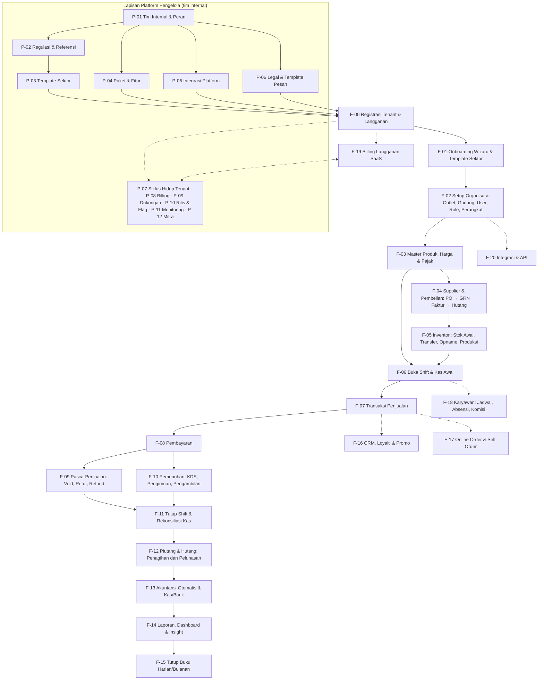
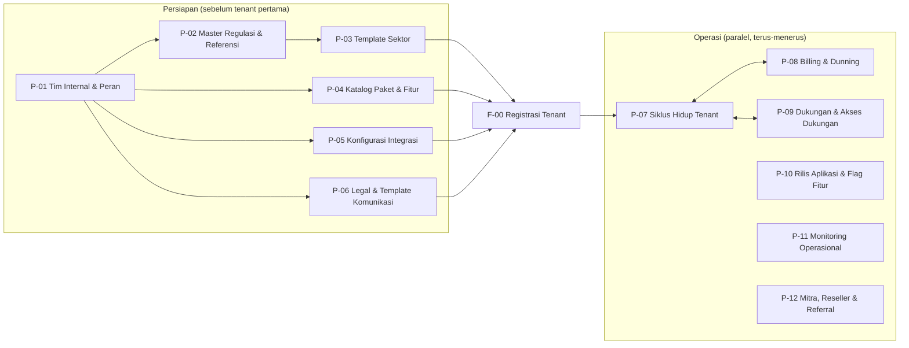
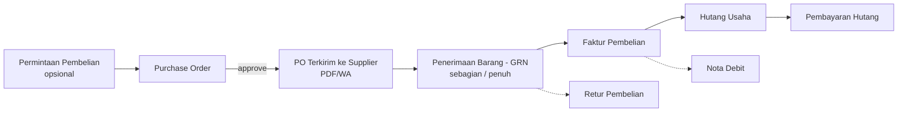
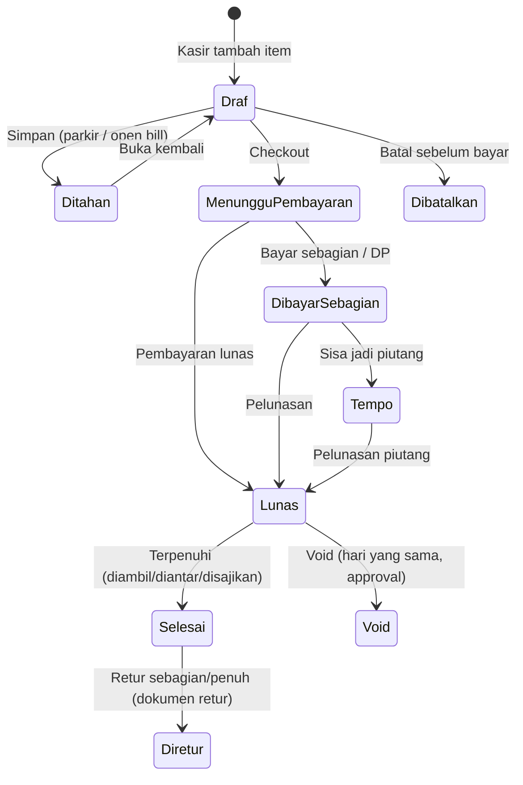
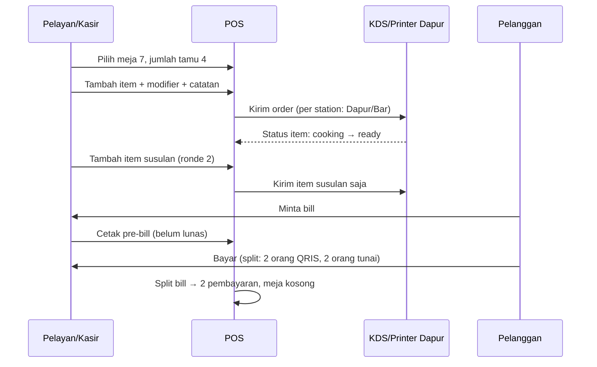
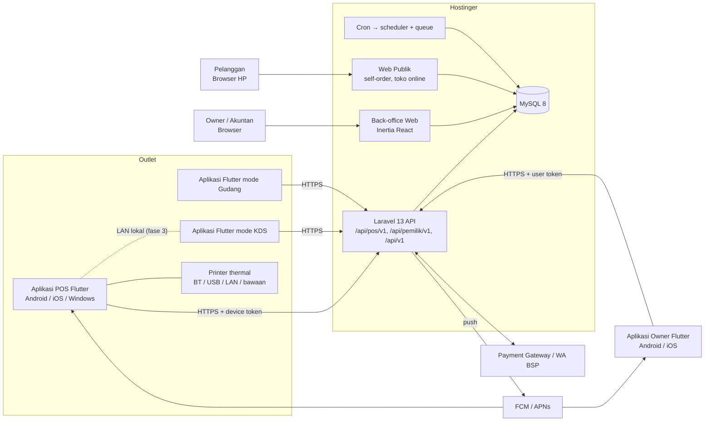
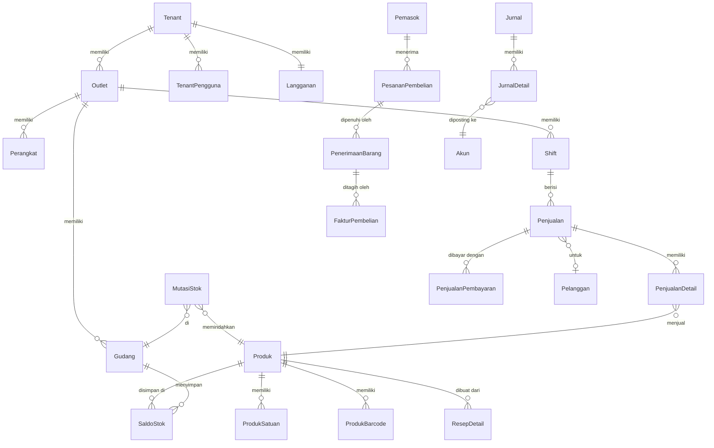
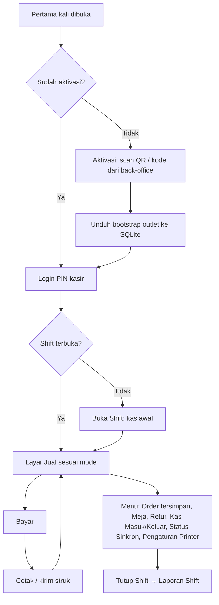
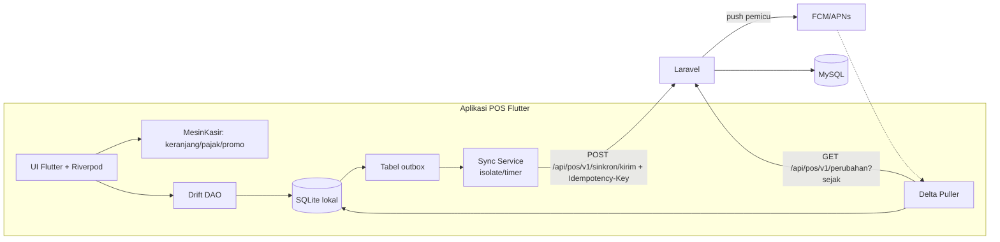
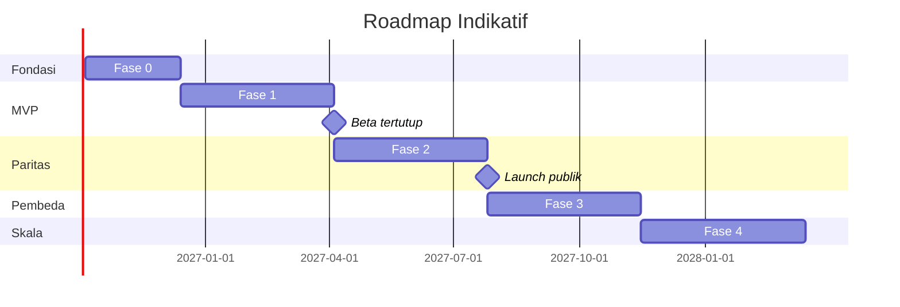

# PRD — POS SaaS Multi-Sektor Indonesia

> **Nama sistem:** **PAYOU**, slogan *"Bisnis Laris, Kelola Praktis."* (D-15, v1.36). Placeholder **`{{APP}}`** yang masih tertulis di dokumen ini dibaca sebagai PAYOU.
> Aset logo & palet merek di `Spesifikasi/Merek/`. Kandidat nama lama tetap di [Lampiran A](#lampiran-a--kandidat-nama-sistem) sebagai arsip.

| Atribut | Nilai |
|---|---|
| Dokumen | Product Requirements Document (PRD) |
| Versi | 1.63 |
| Tanggal | 25 September 2026 |
| Status | Draf, menunggu review pemilik produk |
| Pemilik produk | Ahmad Affandi |
| Stack Backend & Back-office | Laravel 13 · PHP 8.3 · MySQL 8 · Inertia.js + React + TypeScript · Tailwind CSS 4 · TanStack Query |
| Stack Aplikasi POS | **Flutter** (Dart) untuk **Android, iOS/iPadOS, dan Windows** · Drift (SQLite) untuk offline |
| Stack Aplikasi Owner | **Flutter** (Dart) untuk **Android & iOS** |
| Hosting | Hostinger (Web/Cloud Hosting) untuk backend & web, dengan jalur upgrade ke VPS. Aplikasi POS didistribusikan via Google Play, App Store, dan installer desktop |
| Bahasa produk | Bahasa Indonesia (utama), English (sekunder) |

**Riwayat perubahan**

| Versi | Perubahan |
|---|---|
| 1.0 | Draf awal: POS sebagai PWA (React) |
| 1.1 | **Aplikasi POS (kasir, KDS, operasional gudang) dibangun dengan Flutter** untuk iOS, Android, dan Desktop. Back-office tetap web (Laravel + Inertia React). API sinkron POS berbasis token perangkat. Offline memakai SQLite (Drift). Integrasi hardware native. Mode LAN lokal ditambahkan. |
| 1.2 | Keputusan pemilik produk: **platform POS = Android, iOS/iPadOS, Windows** (Linux & macOS tidak ditargetkan). Kanal distribusi desktop **ditentukan setelah sistem stabil**. **Semua perangkat POS Android all-in-one** didukung lewat lapisan adaptor vendor. **Aplikasi Mobile Owner** terpisah (Flutter, Android & iOS). |
| 1.3 | Keputusan D-05: **nama database (tabel, kolom, indeks), folder, file, dan function/method memakai Bahasa Indonesia dengan PascalCase** di semua stack. Konvensi, kamus istilah, pengecualian framework, dan konfigurasi di §13.7. Skema §15, struktur folder, contoh kode, dan nama enum/status diperbarui. |
| 1.4 | Keputusan D-06: **URL/endpoint memakai Bahasa Indonesia** (huruf kecil, kebab-case). Semua rute web, API POS, API Pemilik (`/api/pemilik/v1`), API publik, parameter query, dan scope token diperbarui. |
| 1.5 | Perluasan D-06: nama **event webhook**, **header HTTP kustom**, dan **nama permission** memakai Bahasa Indonesia. Header standar protokol tetap. |
| 1.6 | Keputusan D-07: **Platform Pengelola** (konsol tim internal {{APP}}) dirancang sebagai lapisan pertama sebelum modul tenant: flow P-01 s.d. P-12 (§8 Bagian A), modul PGL (§10.0), arsitektur (§13.8), tabel (§15.3), peran internal (§19.3), dan Fase 0 roadmap direvisi. |
| 1.7 | Keputusan D-08: font resmi **Atkinson Hyperlegible Next** (UI) + **Atkinson Hyperlegible Mono** (kode & nomor dokumen), skala tipografi dua mode kepadatan, aturan pemakaian, dan implementasi web/Flutter (§17.5). |
| 1.8 | Keputusan D-09: **Pedoman UI/UX & Design System** (§17.6): prinsip "alat kerja, bukan brosur", arah per klien, token warna (lolos WCAG AA), bentuk & kepadatan, pola layar, keadaan wajib, microcopy, visualisasi data, aksesibilitas, proses desain, dan checklist review anti-slop. |
| 1.9 | Keputusan D-10: **Tata kelola AI agent** (§23.4): `CLAUDE.md`, `.claude/rules/`, hook, skill `/mulai-flow` & `/cek-dod`, subagent `penjaga-konvensi`, `Alat/CekKonvensi.py`, `Dokumen/` hasil generate, CI kepatuhan, CODEOWNERS, template PR. Pengecualian penamaan untuk file yang namanya diwajibkan alat ditambahkan (§13.7.4). |
| 1.10 | Penyelarasan hasil scaffolding Fase 0: macro `UuidPublik()` (§13.7.4), test Dart berakhiran `_test.dart` (§13.7.4, §17.2.1), ruang kerja pub + melos di `pubspec.yaml` akar (§13.7.4). Lint `constant_identifier_names` dimatikan agar nilai enum PascalCase (§13.7.4). Paket Dart murni diuji dengan `dart test`. Tidak ada perubahan flow. |
| 1.11 | Rincian P-01 hasil perencanaan `/mulai-flow`: BR-P01.1 ditegaskan (tolak menurunkan Super Admin bila aktif ≤ 2), allowlist IP ditunda (§25 no. 13), skema `PenggunaPengelola` (+`DuaFaktorAktifPada`, `KodePemulihan2fa`, `DinonaktifkanPada`) dan tabel baru `UndanganPengelola` (§15.3). |
| 1.12 | Rincian P-02 hasil perencanaan `/mulai-flow`: `PengaliDpp` disimpan sebagai pecahan (`PengaliDppPembilang`/`PengaliDppPenyebut`) agar DPP 11/12 eksak (§12.2), BR-P02.2 ditegaskan (nasional 2 penyetuju, daerah 1, pengaju tidak boleh menyetujui), tabel baru `SatuanStandar` & `PersetujuanDataMaster`, kolom status & dasar hukum pada `TarifPajak`/`HariLibur` (§15.3). Model data referensi berada di `Domain/Referensi` dan `Domain/Pajak` agar bisa dibaca tenant; aksi pengelolaannya di `Domain/Pengelola/Referensi` (§13.2, §13.8). |
| 1.13 | Keputusan tinjauan P-02: data awal tarif dari file data (bukan kode), `BerlakuMulai` tarif tidak boleh di masa lalu saat diajukan/terbit, pembatalan hari libur terbit lewat pengajuan & tinjauan (status `Dibatalkan`), dan four-eyes berlaku untuk semua penyusun draf (BR-P02.2). |
| 1.14 | Rincian P-04 (diputuskan agen atas mandat pemilik produk "tanpa meminta izin terus", disetujui pemilik produk 23/09/2026): harga paket berversi di tabel `HargaPaket` dengan four-eyes (Keuangan mengusulkan, Super Admin menyetujui) dan pilihan grandfathering (BR-P04.1); status paket Draf/Aktif/Diarsipkan; batas `null` = tak terbatas; model katalog di `Domain/Tenant`, aksi kelola di `Domain/Pengelola/Katalog`; data awal katalog dari file data sebagai draf; penegakan batas, `konfigurasi-aplikasi`, downgrade (BR-P04.4), dan pemakaian kupon ditunda ke F-00/F-19/P-08 (BR-P04.5–P04.7). |
| 1.15 | Keputusan D-11 (harga langganan per paket, bukan per outlet; tambahan outlet/perangkat/kuota lewat add-on), batas paket §21 dilengkapi, add-on & kupon tanpa four-eyes, kunci fitur dipertahankan. Pertanyaan terbuka no. 14–17 ditutup. |
| 1.16 | Rincian P-03 (diputuskan agen atas mandat pemilik produk "tanpa meminta izin terus"): model `TemplateSektor`/`TemplateSektorVersi` di `Domain/PanduanAwal` (dibaca F-01), aksi kelola di `Domain/Pengelola/TemplateSektor`; satu draf per template, versi terbit tidak diubah (BR-P03.4); pembagian izin isi bisnis/akun/terbitkan (BR-P03.5); aturan validasi otomatis dirinci (BR-P03.3); nilai mode kasir `Retail`/`Cepat`/`Meja`/`Layanan`/`Grosir` (§5.1); data awal 3 template dari file data sebagai draf; pratinjau sandbox, tawarkan pembaruan, dan pelacakan versi tenant ditunda ke F-01 (BR-P03.6, §25 no. 15). |
| 1.17 | Tindak lanjut tinjauan P-03: nilai enum mode kasir dicantumkan di §5.1, cakupan template sektor ditambahkan ke tabel peran §19.3, peran akun service charge bernama `PendapatanBiayaLayanan` (istilah `BiayaLayanan` Lampiran D), pengaturan pembulatan template memakai bentuk `PembulatanTunai {Kelipatan, Arah}` yang sama dengan test vector, dan aturan validasi BR-P03.3 dilengkapi (tarif nasional harus masih berlaku, urutan pajak, konsistensi service charge masuk DPP). |
| 1.18 | Rincian P-05 Fase 0 (diputuskan agen atas mandat pemilik produk "tanpa meminta izin terus"): integrasi email (SMTP), CAPTCHA (Cloudflare Turnstile), dan penyimpanan objek (S3-compatible, misal Cloudflare R2); kolom `KonfigurasiIntegrasi` dirinci (§15.3); aktivasi wajib tes koneksi berhasil setelah perubahan terakhir (BR-P05.4); rotasi kunci diingatkan lewat banner (BR-P05.5); uji berkala tiap jam lewat scheduler (BR-P05.3); gateway billing, WhatsApp, FCM, Sentry, dan daftar gateway tenant menyusul bersama flow pemakainya. |
| 1.19 | Rincian P-06 Fase 0 (diputuskan agen atas mandat pemilik produk "tanpa meminta izin terus"): dokumen legal berversi Draf → Terbit dengan tanggal berlaku, satu draf per jenis, versi materiil wajib diumumkan ≥ 30 hari (BR-P06.3), status berlaku/terjadwal/digantikan dihitung dari tanggal (BR-P06.4); model di `Domain/Tenant` agar dibaca F-00, aksi kelola di `Domain/Pengelola/Konten`; tabel `PersetujuanDokumenLegal`, pengumuman ke tenant, dan persetujuan ulang saat login dibangun bersama F-00 (BR-P06.5); template komunikasi & help center tetap Fase 1–2 (PGL-07). |
| 1.20 | Rincian F-00 Fase 0 (disetujui pemilik produk: F-00 dikerjakan sebelum P-07; rincian diputuskan agen atas mandat "tanpa meminta izin terus"): data tenant dibuat saat tombol Daftar ditekan dan verifikasi email berjalan setelahnya (BR-00.5), paket trial dari pilihan di halaman harga atau paket bawaan (BR-00.6), CAPTCHA wajib di produksi (BR-00.4), transisi `Langganan.Status` dirinci (BR-00.7); OTP WhatsApp, lupa kata sandi, 2FA tenant, kode mitra (P-12), persetujuan ulang dokumen materiil, dan penegakan batas paket (F-02/F-19) menyusul. |
| 1.21 | Tindak lanjut tinjauan F-00: akhir trial diproses tiap jam (BR-00.7), pengecualian `MilikTenant` untuk tabel data platform dicatat di §13.4, prasyarat email aktif ditegakkan di produksi, utang log audit tenant & pertanyaan enumerasi akun dicatat di §25 (no. 17–18). |
| 1.22 | Penyelesaian Fase 0 oleh tim paralel (diputuskan agen atas mandat pemilik produk "langsung kerjakan semua kekurangannya"): P-07 dasar (BR-P07.4–BR-P07.10: tampilan 360°, perpanjang trial, override berakhir otomatis & terhubung `EvaluatorFitur`, tangguhkan/aktifkan kembali, catatan, penanda, `KonteksPengelola`), P-08 Fase 0 (BR-P08.4–BR-P08.10: tagihan manual ber-PPN dari `TarifPajak`, nomor `INV/tahun/bulan/urut`, bukti transfer, verifikasi Keuangan, kupon, penjadwal tunggakan), P-09 & P-11 dasar (tiket dukungan dengan SLA per paket, detak scheduler, antrean & job gagal, catatan backup, alert), autentikasi tenant (BR-00.8 2FA, BR-00.9 lupa kata sandi, BR-00.10 anti-enumerasi, persetujuan ulang & pengumuman dokumen materiil BR-P06.5), F-02a (peran & izin tenant, outlet/lokasi stok/merek, undangan pengguna, batas outlet & pengguna, `LogAudit` tenant). Transisi `Langganan.Status` diperluas untuk penangguhan manual (P-07) dan tunggakan (P-08). §25 no. 17 & 18 ditutup, no. 14 sebagian. |
| 1.23 | Perbaikan temuan tinjauan integrasi Fase 0 (diputuskan agen atas mandat pemilik produk, menunggu konfirmasi): aktifkan kembali memeriksa tunggakan & masa tenggang (BR-P07.5), penangguhan manual tidak bisa dicabut lewat tagihan/pembayaran (BR-P07.4 × BR-P08.9), `StatusSebelumDitangguhkan` dikosongkan otomatis, penanda Uji/Demo/Internal dikecualikan dari tunggakan, pemakaian di tampilan 360° memakai penghitung batas F-02a (outlet aktif; pengguna aktif + undangan berlaku). |
| 1.24 | Rincian F-02b (diputuskan agen atas mandat pemilik produk, menunggu konfirmasi): perangkat & kode perangkat `{KodeOutlet}-{Jenis}{NN}`, kode aktivasi 8 karakter sekali pakai (HMAC), device token sendiri `{IdTenant}\|{rahasia}` **menggantikan Sanctum** untuk API POS (§13.1/§16.1 disesuaikan), PIN kasir 6 angka dengan penguncian 5× salah/5 menit, `BatasPerangkatPerOutlet` ditegakkan, cabut perangkat (BR-02.3), key JSON `konfigurasi-aplikasi` PascalCase (`VersiTerbaru`, `VersiMinimal`, `TautanUnduh`). `KodeAktivasi` masuk daftar pengecualian `MilikTenant` §13.4. §25 no. 14 bertambah selesai. |
| 1.25 | Tindak lanjut tinjauan integrasi (diputuskan agen atas mandat pemilik produk, menunggu konfirmasi): `/kelola/langganan` memakai izin `langganan.kelola` (khusus Pemilik); izin tenant baru `bantuan.tiket.lihat` & `bantuan.tiket.kelola` (bawaan Pemilik, Admin, Manajer Outlet); 2FA wajib (§20.2, BR-00.8) berlaku untuk peran bawaan Pemilik, Admin, Akuntan di paket ber-`keamanan.2fa-wajib`, dan 2FA milik akun tidak bisa dimatikan selama satu keanggotaan aktif mewajibkannya; tenant `Ditangguhkan` hanya bisa membaca back-office, kecuali langganan/pembayaran, keamanan akun, bantuan, dan persetujuan legal (F-00); banner Tertunggak (dengan batas tenggang) & Ditangguhkan di back-office; `LogAudit` tenant untuk 2FA, atur ulang kata sandi, persetujuan legal, tagihan & bukti transfer (peristiwa tingkat akun dicatat di setiap tenant tempat pengguna aktif). Langkah rilis: jalankan `organisasi:siapkan-peran` agar peran bawaan tenant lama menerima izin baru. |
| 1.26 | **Pemilik produk mendelegasikan semua pertanyaan terbuka agen kepada agen** dengan patokan "terbaik untuk kita dan terbaik untuk tenant" (23/09/2026). Keputusan agen v1.16–v1.25 yang bertanda "menunggu konfirmasi" dianggap **disetujui** lewat delegasi ini. Keputusan baru dicatat di §25.2 dan D-12; Perjanjian Pemrosesan Data kini wajib disetujui saat registrasi (BR-P06.2). |
| 1.27 | D-13 (disetujui pemilik produk): folder `Backend/` dipindah ke `Aplikasi/Web/` karena berisi aplikasi Laravel utuh (API, back-office, web publik, Platform Pengelola), sejajar dengan `Aplikasi/Kasir` & `Aplikasi/Pemilik`. Semua jalur di PRD, `CLAUDE.md`, `.claude/`, `Alat/`, dan CI disesuaikan; penjaga migrasi mengenali jalur lama `Backend/` dan hanya mengizinkan pindah lokasi tanpa perubahan isi. |
| 1.28 | Rincian F-01 (diputuskan agen atas mandat D-12): wizard `PanduanAwal` 6 langkah dengan progres, penerapan template idempoten & aditif ke `Akun`/`PemetaanAkun`/`Kategori`/`Satuan`/`KelompokPajak`/`OutletFitur`, pajak outlet merujuk `JenisPajak` (tarif dicari saat dipakai), `MetodePembayaran`, produk contoh & tambah cepat, izin `panduan-awal.kelola`. Istilah `PiutangSettlement` → `PiutangPencairan` dan `Waste` → `SusutPersediaan` (§11.2, kamus §13.7.1). §25 no. 15 sebagian dan no. 16(a) ditutup. Rincian tabel §15 ditambahkan setelah implementasi digabung. |
| 1.29 | Skema F-01 dicatat di §15 sesuai implementasi (`ProgresPanduanAwal`, kolom baru `Outlet`, `MetodePembayaran`, `Satuan.KodeStandar`, `KelompokPajakDetail.IdJenisPajak`, kunci JSON `Tenant.Pengaturan` & `Outlet.ProfilPajak`); `PemetaanAkun.Kunci` memakai nilai `PeranAkun`; izin `panduan-awal.kelola` di §19.1; batas kewajaran MDR 10% per metode; peran sektor ditunda ke F-10/F-17. Langkah rilis: `organisasi:siapkan-peran` dan `panduan-awal:siapkan-bawaan`. |
| 1.30 | Disetujui pemilik produk: test vector `Spesifikasi/VektorUjiKalkulasi/` tidak lagi file penjaga. Agent boleh **menambah kasus** (wajib lolos di PHP & Dart), tetapi tidak boleh menghapus kasus atau mengubah nilai harapan tanpa alasan bisnis tertulis di PRD (CLAUDE.md #19 tetap berlaku). |
| 1.31 | Rincian F-03 (diputuskan agen atas mandat D-12): skema katalog lengkap di §15 (`ProdukGudang`, `NomorUrutKatalog`, `PenghapusanKatalog`, `ImporProduk`/`ImporProdukBaris`, kolom baru Produk/DaftarHarga/RiwayatHarga/KelompokPajak/Resep/Pilihan), endpoint POS `katalog` & gambar di §16.3, istilah baru di kamus, penegakan izin katalog di §19.1, aturan SKU/barcode otomatis, BatasSku, varian, arsip/hapus, riwayat harga, penentu harga PHP=Dart dengan test vector, rumus susut resep, dan impor/ekspor. Utang F-03 di §25 no. 19. |
| 1.32 | D-14 (keputusan pemilik produk): tanpa mode gelap di semua klien termasuk KDS; kolom "Gelap" dihapus dari token warna §17.6.3; satu sumber warna per platform; seluruh komponen shadcn/ui dipasang dengan warna dari token. |
| 1.33 | Rincian F-05a (diputuskan agen atas mandat D-12): dokumen `StokAwal` & impor stok awal, ledger `MutasiStok` dengan HPP rata-rata bergerak/FIFO, batch & nomor seri, inti jurnal (`PostingJurnal`, `BalikkanJurnal`, kunci periode) yang dibangun lebih awal untuk J-05.1, kolom tambahan §15 (Inventori, Akuntansi, Sistem), izin baru `persediaan.stok-awal.posting` (§19.1), kode galat F-05a, perintah `persediaan:bangun-ulang-saldo`. Utang F-05a di §25 no. 20. |
| 1.34 | Rincian F-06a (diputuskan agen atas mandat D-12): server & back-office shift dan kas. Endpoint `POST /api/pos/v1/sinkron/kirim` (batch outbox, hasil per item Diterima/Duplikat/Ditolak), tabel `Shift`/`MutasiKas` dilengkapi dan tabel baru `KategoriKas` (§15), izin baru `kas.keluar.setujui` (§19.1), pengaturan kasir tenant (batas kas keluar, shift bersama), jurnal kas masuk & setoran (§11.3). Aplikasi kasir Flutter menyusul di F-06b. Utang F-06 di §25 no. 21. |
| 1.35 | Rincian F-06b (diputuskan agen atas mandat D-12): aplikasi kasir Flutter (aktivasi, masuk PIN online/offline, buka shift, kas masuk/keluar/setoran dengan PIN supervisor, status sinkron), PIN offline Argon2id terbungkus kunci perangkat (§25.2 no. 3) dengan vektor uji bersama `Spesifikasi/VektorUjiPin`, `GET /api/pos/v1/data-awal` bagian F-06, kolom `TenantPengguna.VerifierPinOffline` & `Perangkat.KunciPinOffline` (§15). Utang F-06 di §25 no. 21 diperbarui. |
| 1.36 | Keputusan D-15: nama sistem **PAYOU** dan identitas merek dari pemilik produk (logo, ikon, palet). Token warna §17.6.3 final: Navy untuk teks, Indigo untuk brand, netral dingin untuk latar & garis. Aset & turunannya (favicon web, ikon Android/iOS/Windows, logo dalam aplikasi) di `Spesifikasi/Merek/`. Nama tampilan aplikasi: **PAYOU POS** (Aplikasi POS) dan **PAYOU Owner** (Aplikasi Owner). |
| 1.37 | Keputusan D-16 dari pemilik produk: (1) **semua tabel web** memakai komponen `TabelData` berbasis **TanStack Table + TanStack Query** dengan fitur lengkap (§17.4.3); (2) **web responsif penuh** dari 360px sampai layar lebar (§17.4.4); (3) Aplikasi POS dirancang sebagai **Ruang Kerja Kasir** yang elegan dan tetap mudah untuk dipakai berjam-jam (§17.2.7). Tabel §13.5, §17.2.3, §17.6.2, §17.6.5, §17.6.9, §17.6.11, §23.3 disesuaikan. Utang penyesuaian halaman & layar yang sudah ada di §25 no. 22. |
| 1.38 | Pelaksanaan D-16 (keputusan agen, D-12): data `TabelData` mode server dilayani **URL halaman yang sama** dengan `Accept: application/json` (bukan `/internal/*` terpisah); **tabel isian formulir** dan **rincian dokumen kecil** dikecualikan dari `TabelData` (§17.4.3, §25.2 no. 17). Migrasi seluruh daftar web ke `TabelData` selesai (§25 no. 22a). |
| 1.39 | Pemilih tanggal seragam (§17.4.2): `PemilihTanggal`, `PemilihTanggalWaktu`, `PemilihRentangTanggal` menggantikan isian tanggal bawaan peramban di seluruh web; preset rentang ditambah 30 hari terakhir & Tahun ini. |
| 1.40 | Keputusan D-17: agent mengubah file penjaga (PRD, CLAUDE.md, aturan, hook) tanpa meminta izin, dengan batas tidak melemahkan test/lint/CI dan larangan keras tetap berlaku. |
| 1.41 | Pilihan seragam (§17.4.2): `PilihanCari` menggantikan select bawaan peramban; daftar terbuka di bawah pemicu (tidak menutupinya) dan setiap dropdown berisi daftar pilihan wajib punya kotak cari. |
| 1.42 | Rincian F-07a (diputuskan agen atas mandat D-12): aturan pembulatan, alokasi pro-rata, pajak inklusif/eksklusif campuran, dan pembulatan tunai mesin kalkulasi; format test vector diperluas (`Pajak`, `DiskonManual`, `DiskonManualPesanan`, `HargaPilihan`, pembayaran daftar, `Harapan` rinci per baris). |
| 1.43 | Rincian F-07b & F-07c (diputuskan agen atas mandat D-12): item sinkron `Penjualan.Buat`, validasi server (tarif pajak, batas diskon BR-07.3, hitung ulang), stok & jurnal J-07.1/J-07.2 saat Lunas, tabel `PenjualanPajak`, izin `penjualan.diskon.setujui`, pengaturan batas diskon & pembulatan tunai, tambahan `data-awal`, gambar QRIS untuk POS, layar Jual & Bayar di Ruang Kerja Kasir. |
| 1.44 | Keputusan implementasi F-07b/F-07c dicatat: pintasan POS mengikuti §17.2.3 (F1/F8/F9/Esc), persetujuan diskon oleh kasir yang berizin, penanganan produk/pilihan terhapus, nomor & tanggal bisnis, `data-awal` `Outlet.ZonaWaktu/JamTutupBuku`, opsi `abaikanBatasMinus` buku stok; utang F-07 (§25 no. 23). |
| 1.45 | Rincian F-09 fase 1 (void transaksi di shift yang sama, retur dengan refund tunai/transfer manual, daftar void & retur) dan F-11 (tutup shift buta, hitung pecahan, selisih & persetujuan, jurnal selisih, laporan shift X/Z), diputuskan agen atas mandat D-12. Izin baru `shift.selisih.setujui`. |
| 1.46 | Tindak lanjut tinjauan F-07: snapshot pengaturan & pajak dari perangkat dicocokkan dengan pengaturan tenant/outlet (beda → diterima + `PerluTinjauan`), penolakan karena izin/batas yang berubah setelah transaksi offline diganti "terima + tinjau", definisi persen diskon efektif tunggal, tanggal bisnis perangkat memakai zona outlet, nomor urut terakhir per perangkat di `data-awal`. |
| 1.47 | Keputusan implementasi F-09 fase 1 & F-11 dicatat (status `DireturSebagian`, jurnal void, kolom void/retur, kas shift menghitung refund tunai void & retur, idempotensi & kode galat `Shift.Tutup`, kas/penjualan/retur setelah shift ditutup diterima + tinjau). |
| 1.48 | Rincian F-13a (bagan akun, pemetaan akun, transaksi kas/bank back-office: pengeluaran operasional, penerimaan lain, transfer; buku besar, neraca saldo, laba rugi) dan F-14a (dashboard pemilik, laporan penjualan per dimensi, laporan PB1/PBJT & PPN keluaran, nilai persediaan & stok kritis, ringkasan harian lewat antrean), diputuskan agen atas mandat D-12. |
| 1.49 | Implementasi tindak lanjut tinjauan F-07 (server & aplikasi): `JenisPajak.Kategori` (Ppn/Pbjt/Lainnya; semua kode berawalan `Pbjt` → Pbjt), kunci baru `Perangkat.NomorUrutPenjualan`/`NomorUrutRetur`, `TarifPajak[].Kategori`, `KelompokPajak[].Pajak[].Kategori`, `penjualan/cari` baris `BolehDesimal`/`UuidProdukSatuan`; kelipatan pembulatan tunai 1–1.000 juga di pengaturan kasir & template; skema lokal POS v4–v5. |
| 1.50 | Keputusan implementasi F-13a & F-14a dicatat (penanda `Akun.KasBank`, satu sumber aturan tipe akun per peran, pemetaan tingkat tenant hanya untuk pengguna tanpa batas outlet, definisi angka laporan, kolom tambahan `RingkasanPenjualanHarian`, peristiwa penjualan & jadwal bangun ulang); utang F-13a/F-14a (§25 no. 25). |
| 1.51 | Rincian F-04 fase 1 (pemasok, PO + persetujuan, penerimaan barang, faktur & 3-way matching, hutang & pembayaran, retur pembelian, belanja stok) dan F-05b (transfer antar lokasi, stok opname, penyesuaian stok) di back-office, diputuskan agen atas mandat D-12. Izin baru `pembelian.po.setujui`. |
| 1.52 | Keputusan implementasi F-04 fase 1 & F-05b dicatat (selisih harga faktur fase 1 ke `SelisihHpp`, faktur satu pemasok & satu outlet, lokasi "Dalam perjalanan" per outlet asal, aturan opname aktif per lokasi/kategori); utang F-04/F-05b (§25 no. 26). |
| 1.53 | Utang D-16 (c) audit responsif selesai: Playwright 97 URL (74 back-office + 23 Platform Pengelola) × 360/768/1280px; gulir horizontal halaman 142 → 0 (teks panjang di `Pemberitahuan` kini patah baris, tombol navigasi panduan awal membungkus). Penolakan redirect (dokumen berstatus tidak sesuai) dikirim sebagai galat `Umum`, bukan `Kilat` berlabel "Berhasil" (§25 no. 22). |
| 1.54 | Neraca (FIN-07 P1) di back-office F-13: posisi akhir periode vs sehari sebelum periode, laba belum ditutup buku di ekuitas (tahun berjalan & tahun-tahun lalu), tanda seimbang, ekspor CSV, invarian nilai persediaan neraca = Σ nilai stok. Utang §25 no. 25 & 26 diperbarui. |
| 1.55 | Arus kas metode langsung (FIN-07 P1) di back-office F-13; klasifikasi aktivitas dari akun lawan (keputusan agen, D-12). `TabelData`: meta `sembunyiBilaKosong` untuk daftar bertumpuk HP dan tombol Saring di HP hanya tampil bila ada saring/urut. |
| 1.56 | Rincian F-10a: area & meja per outlet, stasiun dapur tingkat tenant + `Kategori.IdStasiunDapur`, gerbang fitur `pos.mode-meja`, stasiun dari template sektor; penyesuaian §15 `StasiunDapur` (tanpa IdOutlet/KonfigurasiPrinter) dan `AreaMeja`/`Meja`. |
| 1.57 | Rincian F-07 mode meja & F-10b fase 1: pesanan terbuka tersinkron (item outbox `PesananTerbuka.*`, tarik delta, kunci bayar online, bayar ganda offline → `PerluTinjauan`), tiket dapur per stasiun & ronde, API KDS. |
| 1.58 | Rincian F-07 mode meja & F-10b fase 1 di aplikasi POS: menu Meja (denah per area, pesanan tanpa meja), mode pesanan di layar Jual (kirim ke dapur per ronde, batal item BR-07.5, bayar menutup pesanan, harga kanal `MakanDiTempat`), tarik snapshot 7 detik dengan ETag, kunci bayar, layar dapur untuk perangkat `Kds`; skema lokal 6. |
| 1.59 | Rincian F-16a (CRM-01 pelanggan): master pelanggan (nomor HP ternormalisasi & unik per tenant), izin `pelanggan.lihat`/`pelanggan.kelola`, back-office daftar & detail riwayat belanja, API POS cari pelanggan, item outbox `Pelanggan.Buat` (offline, alias nomor HP ganda), `Penjualan.Buat` + `UuidPelanggan`, panel pelanggan (F2) di aplikasi kasir; skema lokal 7. |
| 1.60 | Rincian F-16b bagian 1 (CRM-02/03): tier pelanggan (ambang belanja, pengali poin, kode untuk daftar harga, naik/turun otomatis harian + kunci tier), pengaturan loyalti per tenant, buku poin `MutasiPoin` (perolehan di transaksi penjualan, pembalikan void & retur proporsional, kedaluwarsa FIFO, penyesuaian manual), harga tier di aplikasi kasir; skema lokal 8. Keputusan pemilik produk: penukaran poin dicatat sebagai **diskon** (J-16.4, bagian 2). |
| 1.61 | Rincian F-16b bagian 2 (CRM-03 penukaran poin): poin ditukar sebagai **diskon pesanan sebelum pajak** (J-16.4 lewat Diskon Penjualan di J-07.1); mesin kalkulasi PHP & Dart menerima `TukarPoin` (dibatasi sisa subtotal, keluaran `DiskonPoin`) + 3 test vector baru; `Penjualan.Buat` membawa `TukarPoin {Poin, Nilai}`; saldo terkini `GET /api/pos/v1/pelanggan/{uuidPelanggan}/poin` (wajib online, §18.4); pengaturan nilai tukar per poin & minimal tukar; void mengembalikan poin yang ditukar. |
| 1.62 | Rincian F-16c bagian 1 (CRM-05 promo engine): master promo back-office (formulir terstruktur, bukan YAML), mesin promo PHP & Dart murni + 8 test vector bersama `VektorUjiKalkulasi/Promo/` (kondisi barang/kategori/minimal, tier, kanal, outlet, periode/hari/jam; aksi diskon %/nominal barang & pesanan, harga spesial, beli X gratis Y, bundel harga tetap; batas per transaksi, kuota), resolusi konflik `Terbaik`/`PrioritasKetat`, promo di POS (`GET /api/pos/v1/promo`, berlaku offline), `Penjualan.Buat` membawa `Promo` + validasi ulang server (beda = diterima + tinjauan `PromoBerbeda`), `PromoPemakaian` & kuota. Keputusan pemilik produk: dipecah (voucher dll. bagian 2), dua mode resolusi (bawaan Terbaik), beda hasil offline = terima + tinjauan. |
| 1.63 | Rincian F-12 bagian 1 (piutang pelanggan): limit kredit & termin di data pelanggan, metode **Tempo** di POS (hanya bila pelanggan dipilih; metode dibuat sistem saat limit kredit pertama diisi), BR-12.1 dengan PIN penyetuju ber-izin baru `penjualan.tempo.setujui` (cek dari cache perangkat; cache basi = diterima + tinjauan `TempoBermasalah`), piutang per penjualan tempo (jurnal Dr Piutang Usaha), void membatalkan piutang yang belum dibayar, retur memotong piutang lebih dulu, back-office piutang & umur 0–30/31–60/61–90/>90, pelunasan sebagian/banyak piutang sekaligus (Dr Kas/Bank, Cr Piutang Usaha) yang bisa dibatalkan, skema lokal POS v9. Keputusan pemilik produk: F-12 dipecah (DP/uang muka, pengingat WA, giro = bagian 2), PIN penyetuju untuk BR-12.1, void/retur mengurangi piutang. |

---

## Daftar Isi

1. [Ringkasan Eksekutif](#1-ringkasan-eksekutif)
2. [Latar Belakang, Masalah & Peluang](#2-latar-belakang-masalah--peluang)
3. [Analisis Kompetitor & Strategi "Lebih dari Majoo"](#3-analisis-kompetitor--strategi-lebih-dari-majoo)
4. [Tujuan, Non-Tujuan & Metrik Keberhasilan](#4-tujuan-non-tujuan--metrik-keberhasilan)
5. [Sektor Usaha & Persona](#5-sektor-usaha--persona)
6. [Prinsip Pengembangan: Flow-First](#6-prinsip-pengembangan-flow-first)
7. [Peta Flow Bisnis Induk (Master Business Flow)](#7-peta-flow-bisnis-induk-master-business-flow)
8. [Spesifikasi Flow Bisnis Detail (Platform Pengelola P-01 s.d. P-12, Tenant F-00 s.d. F-20)](#8-spesifikasi-flow-bisnis-detail)
9. [Flow Khusus per Sektor](#9-flow-khusus-per-sektor)
10. [Katalog Modul & Fitur (dengan Prioritas)](#10-katalog-modul--fitur)
11. [Akuntansi Otomatis & Pemetaan Jurnal](#11-akuntansi-otomatis--pemetaan-jurnal)
12. [Perpajakan & Regulasi Indonesia](#12-perpajakan--regulasi-indonesia)
13. [Arsitektur Teknis](#13-arsitektur-teknis)
14. [Strategi Hosting di Hostinger](#14-strategi-hosting-di-hostinger)
15. [Model Data (Skema Database)](#15-model-data-skema-database)
16. [Desain API & Integrasi](#16-desain-api--integrasi)
17. [Arsitektur Klien: Aplikasi POS Flutter & Back-office Web](#17-arsitektur-klien-aplikasi-pos-flutter--back-office-web)
18. [Offline-First POS & Sinkronisasi](#18-offline-first-pos--sinkronisasi)
19. [Hak Akses (RBAC) & Approval](#19-hak-akses-rbac--approval)
20. [Kebutuhan Non-Fungsional](#20-kebutuhan-non-fungsional)
21. [Paket Langganan & Monetisasi](#21-paket-langganan--monetisasi)
22. [Roadmap & Fase Pengembangan](#22-roadmap--fase-pengembangan)
23. [Strategi Pengujian & Quality Gate](#23-strategi-pengujian--quality-gate)
24. [Risiko & Mitigasi](#24-risiko--mitigasi)
25. [Pertanyaan Terbuka](#25-pertanyaan-terbuka)
26. [Glosarium](#26-glosarium)
27. [Lampiran](#27-lampiran)

---

## 1. Ringkasan Eksekutif

**{{APP}}** adalah platform Point of Sale (POS) dan manajemen usaha berbasis SaaS untuk UMKM hingga usaha menengah multi-outlet di Indonesia. Satu platform melayani banyak sektor (F&B, retail, jasa, grosir, apotek, laundry, bengkel, dan lainnya) melalui **Template Sektor**: saat tenant mendaftar dan memilih jenis usaha, sistem menyalakan modul, alur kasir, bagan akun (COA), satuan, pajak, dan laporan yang sesuai. Tenant tidak perlu mengatur semuanya dari nol.

Pengembangan dimulai dari **flow bisnis**, bukan dari layar atau tabel. Setiap fitur harus bisa ditelusuri ke satu langkah dalam alur bisnis induk:

```
Daftar → Setup Usaha → Master Data → Pembelian & Stok Masuk → Buka Shift
      → Penjualan → Pembayaran → Pasca-Penjualan → Tutup Shift
      → Akuntansi Otomatis → Laporan & Insight → Tutup Buku
```

Setiap transaksi operasional (jual, beli, mutasi stok, kas) **otomatis menghasilkan jurnal akuntansi**. Dengan begitu laporan keuangan (Laba Rugi, Neraca, Arus Kas) selalu siap tanpa input ganda.

**Empat komponen produk:**

| Komponen | Teknologi | Pengguna | Platform |
|---|---|---|---|
| **Aplikasi POS {{APP}}** (kasir, KDS, operasional gudang, absensi) | **Flutter** | Kasir, pelayan, dapur, gudang, supervisor | Android (tablet, HP, semua perangkat POS all-in-one), iOS/iPadOS, Windows |
| **Aplikasi {{APP}} Owner** (dashboard, laporan, approval, notifikasi, kontrol outlet) | **Flutter** | Owner, manajer area, manajer outlet | Android & iOS (HP) |
| **Back-office Web** (produk, stok, pembelian, laporan, akuntansi, pengaturan) | Laravel 13 + Inertia React + TypeScript + Tailwind 4 + TanStack Query | Owner, manajer, akuntan, admin | Browser desktop & mobile |
| **Web Publik** (self-order QR meja, toko online, struk digital, booking) | Laravel + React (ringan) | Pelanggan akhir | Browser HP |

Keempatnya memakai satu backend Laravel dan satu database MySQL di Hostinger.

**Pembeda utama dibanding majoo dan pemain lain** (rinci di §3):

1. **Offline-first sungguhan.** Aplikasi POS Flutter native dengan database SQLite lokal. Kasir tetap bisa berjualan penuh saat internet mati, lalu sinkron otomatis tanpa transaksi ganda.
2. **Template Sektor + Feature Toggle.** Satu produk bisa disetel untuk 12+ jenis usaha, dan satu tenant boleh punya beberapa sektor sekaligus (misalnya kafe + retail merchandise).
3. **Promo Engine berbasis aturan.** Buy X Get Y, bundling, happy hour, tier member, voucher, dan stacking rules bisa dikonfigurasi tanpa kode.
4. **Akuntansi dan pajak Indonesia bawaan**, siap untuk PPN (termasuk DPP nilai lain), PB1/PBJT, e-Faktur/Coretax export, dan SAK EMKM/SAK EP.
5. **Audit trail dan approval berlapis.** Void, diskon manual, refund, dan penyesuaian stok wajib beralasan, bisa perlu PIN supervisor, dan tercatat permanen.
6. **Open API dan webhook** untuk integrasi ERP, marketplace, dan akuntansi pihak ketiga.
7. **Insight cerdas**: saran restock berbasis prediksi, deteksi anomali kasir, menu engineering (F&B), dan analisis ABC (retail).
8. **Satu aplikasi POS untuk semua perangkat.** Satu basis kode Flutter berjalan di Android, iPad/iPhone, dan Windows, termasuk **semua perangkat POS Android all-in-one** (printer & layar pelanggan bawaan) dan printer LAN dapur tanpa aplikasi tambahan.
9. **Aplikasi Mobile Owner.** Owner memantau omzet, laba, stok, dan kasir semua outlet dari HP, menyetujui void/diskon dari jarak jauh, dan menerima notifikasi anomali secara real-time.
10. **Biaya infrastruktur rendah.** Arsitektur dirancang agar bisa berjalan di shared/cloud hosting Hostinger, sehingga harga langganan bisa lebih kompetitif.

---

## 2. Latar Belakang, Masalah & Peluang

### 2.1 Konteks Pasar

- Indonesia punya lebih dari 60 juta pelaku UMKM. Sebagian besar masih mencatat transaksi secara manual atau semi-manual (buku, Excel, WhatsApp).
- Adopsi QRIS meningkat pesat, sehingga pembayaran non-tunai sudah menjadi standar, bukan fitur tambahan.
- Pemilik usaha multi-outlet butuh kontrol stok dan kas jarak jauh karena kebocoran (fraud kasir, stok hilang) adalah masalah utama.
- Regulasi pajak terus berubah (PPN 12% dengan DPP nilai lain, Coretax DJP, PBJT daerah). Sistem wajib bisa dikonfigurasi, bukan hard-coded.

### 2.2 Masalah Pengguna

| # | Masalah | Dampak | Siapa yang merasakan |
|---|---|---|---|
| P1 | Internet tidak stabil (terutama di luar kota besar) sehingga POS cloud macet | Antrian, transaksi hilang, pelanggan kabur | Kasir, Owner |
| P2 | Stok tidak akurat antara sistem dan fisik | Stockout / overstock, uang tertahan | Owner, Gudang |
| P3 | Kebocoran kas dan fraud kasir (void fiktif, diskon liar) | Kerugian langsung | Owner |
| P4 | Laporan keuangan harus direkap manual | Tidak tahu untung sebenarnya, sulit ajukan kredit | Owner, Akuntan |
| P5 | Satu aplikasi tidak cocok untuk usaha campuran (resto + toko) | Pakai 2–3 aplikasi, data terpisah | Owner |
| P6 | Promo rumit tidak bisa diatur | Kehilangan peluang penjualan | Marketing, Owner |
| P7 | Hitung HPP/resep F&B manual | Harga jual salah, margin tipis | Owner F&B |
| P8 | Pajak (PPN/PB1) salah hitung | Risiko sanksi | Owner, Akuntan |
| P9 | Biaya langganan dan hardware mahal | UMKM mikro enggan beralih | UMKM mikro |

### 2.3 Peluang

Belum ada pemain yang menggabungkan **(a)** offline-first yang andal, **(b)** multi-sektor dalam satu tenant, **(c)** akuntansi dan pajak Indonesia yang benar secara otomatis, dan **(d)** harga terjangkau untuk UMKM mikro. {{APP}} mengisi celah tersebut.

---

## 3. Analisis Kompetitor & Strategi "Lebih dari Majoo"

### 3.1 Lanskap

| Pemain | Kekuatan umum | Celah yang bisa dimanfaatkan |
|---|---|---|
| **majoo** | Ekosistem lengkap (POS, inventori, akuntansi, CRM, karyawan, toko online), banyak sektor, brand kuat | Mode offline terbatas, paket fitur lengkap relatif mahal untuk mikro, kustomisasi promo & approval terbatas, integrasi API terbuka terbatas |
| Moka (GoTo) | Kuat di F&B/retail, ekosistem GoBiz | Akuntansi dasar, fokus ekosistem sendiri |
| Pawoon | Mudah dipakai, F&B | Fitur back-office lebih ringan |
| Qasir | Gratis/murah untuk mikro | Fitur multi-outlet & akuntansi terbatas |
| iSeller / Olsera | Omnichannel retail | Kurang di F&B dan jasa |
| ESB | F&B enterprise, kuat di resto chain | Mahal, kompleks untuk UMKM |

> Catatan: Tabel adalah gambaran umum posisi pasar untuk arah produk, bukan klaim fitur spesifik. Tim wajib melakukan uji langsung (trial akun) setiap kompetitor sebelum finalisasi fitur di tiap fase.

### 3.2 Paritas Wajib (Table Stakes, setara majoo)

Fitur berikut **harus ada** agar {{APP}} layak dibandingkan:

- POS kasir (retail & F&B), multi-pembayaran, QRIS, struk cetak/digital
- Manajemen produk: varian, modifier/add-on, bundling, resep/bahan baku
- Inventori multi-outlet & multi-gudang, transfer stok, stock opname, PO & penerimaan
- Manajemen meja, split bill, kitchen printer/KDS (F&B)
- CRM pelanggan, poin/loyalti, voucher, promo
- Karyawan: shift, absensi, komisi, hak akses
- Akuntansi: jurnal otomatis, Laba Rugi, Neraca, Arus Kas
- Laporan penjualan, stok, kas, per outlet/karyawan/produk
- Toko online / pesan online, integrasi ojol (fase lanjut)
- Aplikasi owner (dashboard mobile) — di {{APP}} dibuat sebagai aplikasi Flutter tersendiri (§17.3)

### 3.3 Pembeda (Beyond Majoo)

| Kode | Pembeda | Deskripsi | Fase |
|---|---|---|---|
| X1 | **Offline-first POS** | Seluruh alur kasir (jual, bayar tunai/EDC manual, cetak struk, buka/tutup shift) berjalan tanpa internet di aplikasi Flutter (SQLite lokal). Sinkron idempoten via outbox. | 1 |
| X2 | **Multi-sektor per tenant** | Satu tenant bisa memakai beberapa template sektor per outlet (outlet A kafe, outlet B toko retail). Satu pelanggan dan satu laporan konsolidasi. | 1 |
| X3 | **Promo Engine (rule-based)** | Kondisi (produk, kategori, waktu, member tier, channel, min. belanja) × aksi (diskon %, nominal, gratis item, harga spesial) dengan prioritas & stacking. | 2 |
| X4 | **Approval Workflow & Anti-Fraud** | PIN/OTP supervisor untuk void, refund, diskon di atas batas, buka laci kas manual. Skor risiko kasir & notifikasi anomali ke owner. | 1–2 |
| X5 | **Akuntansi & Pajak Indonesia native** | COA per sektor, jurnal otomatis dari setiap event, PPN DPP nilai lain, PB1/PBJT, export e-Faktur/Coretax, SAK EMKM. | 1–3 |
| X6 | **Smart Restock & Forecast** | Prediksi kebutuhan stok (moving average + musiman, termasuk Ramadan/Lebaran), draft PO otomatis ke supplier. | 3 |
| X7 | **Open API + Webhook** | REST API v1 bertoken, webhook event (order.paid, stock.low, dll.), dokumentasi publik. | 3 |
| X8 | **Harga multi-level & per channel** | Harga berbeda per outlet, per channel (dine-in, takeaway, GoFood, GrabFood, Shopee), per tier pelanggan (grosir/reseller), per jumlah (tiered pricing). | 2 |
| X9 | **Konsinyasi & titip jual** | Barang titipan supplier: stok tidak masuk aset, hutang timbul hanya saat terjual, laporan settlement ke penitip. | 3 |
| X10 | **Franchise/Kemitraan** | Royalti otomatis per outlet mitra, master menu terpusat, harga terkunci, laporan royalti. | 4 |
| X11 | **Struk & notifikasi WhatsApp** | Kirim struk, invoice, pengingat piutang, dan notifikasi booking via WhatsApp (gateway pihak ketiga). | 2 |
| X12 | **Self-order QR Meja** | Pelanggan scan QR di meja, pesan dan bayar (QRIS) sendiri, order masuk ke KDS. | 2 |
| X13 | **Booking & Antrian (Jasa)** | Booking online salon/barbershop/bengkel, antrian digital, pemilihan staf, reminder otomatis. | 2 |
| X14 | **Audit Trail Permanen** | Setiap perubahan data penting tercatat (siapa, kapan, nilai lama/baru, perangkat, IP). Tidak bisa dihapus tenant. | 1 |
| X15 | **Multi-platform & hardware-agnostic** | Satu aplikasi Flutter untuk Android (tablet murah, HP, **semua perangkat POS all-in-one**: Sunmi, iMin, PAX, Telpo, dan merek lain), iPad/iPhone, dan Windows (PC bekas). Printer thermal via Bluetooth, USB, LAN, atau printer bawaan. Tidak mewajibkan beli hardware tertentu. | 1 |
| X16 | **Import massal & migrasi dari kompetitor** | Template Excel + importer yang memetakan export dari aplikasi lain agar pindah platform mudah. | 1 |
| X17 | **Mode LAN Lokal (Outlet Hub)** | Saat internet mati, perangkat dalam satu outlet (kasir, tablet pelayan, KDS) tetap saling bertukar order lewat Wi-Fi lokal. Satu perangkat bertindak sebagai hub, lalu hub menyinkronkan ke cloud saat online. | 3 |
| X18 | **Push notification native** | Approval jarak jauh, stok kritis, dan order online masuk dikirim sebagai push (FCM/APNs) ke aplikasi, tanpa bergantung pada WebSocket server. | 2 |
| X19 | **Aplikasi Mobile Owner** | Aplikasi Flutter khusus owner (Android & iOS): dashboard real-time multi-outlet, laporan ringkas, approval jarak jauh satu ketukan, notifikasi anomali kasir/stok/selisih kas, cek stok & harga, kelola promo cepat. | 2 |

---

## 4. Tujuan, Non-Tujuan & Metrik Keberhasilan

### 4.1 Tujuan Produk

| ID | Tujuan |
|---|---|
| G1 | Tenant baru bisa melakukan transaksi pertama dalam **≤ 15 menit** setelah daftar (onboarding wizard + template sektor). |
| G2 | Kasir bisa menyelesaikan transaksi retail 5 item dalam **≤ 20 detik** di aplikasi POS (Android, iOS, Windows), dan tetap bisa beroperasi offline. |
| G3 | Laporan keuangan (L/R, Neraca) tersedia **real-time** tanpa input akuntansi manual. |
| G4 | Selisih stok sistem vs fisik turun (target tenant aktif: selisih opname < 2% nilai persediaan). |
| G5 | Biaya infra per tenant cukup rendah untuk paket mikro ≤ Rp 99.000/bulan. |

### 4.2 Non-Tujuan (di luar lingkup v1)

- ERP manufaktur penuh (MRP, routing, work center). Hanya produksi sederhana/rakitan (BOM 1 level + multi-level terbatas).
- Payroll lengkap dengan PPh 21 dan BPJS otomatis. v1 hanya rekap gaji, komisi, dan absensi; payroll penuh di fase 4.
- Back-office lengkap sebagai aplikasi native. Pengaturan & master data lengkap tetap di **web responsif**. Aplikasi Flutter dibagi dua: **Aplikasi POS** (operasional outlet) dan **Aplikasi Owner** (pemantauan, approval, aksi cepat). Aplikasi Owner tidak menggantikan back-office untuk pekerjaan berat seperti import, akuntansi, dan pengaturan pajak.
- POS berbasis browser (PWA). Kasir hanya lewat aplikasi Flutter. Web hanya untuk back-office dan halaman publik pelanggan.
- Aplikasi POS untuk **Linux dan macOS**. Tidak ditargetkan. Pengguna Mac dapat memakai iPad atau back-office web. Karena Flutter mendukung keduanya, platform ini bisa ditambahkan kelak jika ada permintaan pasar.
- Rumah sakit/klinik dengan rekam medis (butuh regulasi SATUSEHAT). Hanya apotek/toko obat ringan.
- Hotel dengan channel manager OTA.

### 4.3 KPI / Metrik

| Kategori | Metrik | Target 12 bulan setelah launch |
|---|---|---|
| Akuisisi | Tenant terdaftar | 3.000 |
| Aktivasi | % tenant yang transaksi pertama ≤ 24 jam | ≥ 60% |
| Retensi | Retensi tenant berbayar bulan ke-3 | ≥ 75% |
| Monetisasi | Konversi trial → berbayar | ≥ 20% |
| Keandalan | Uptime aplikasi (di luar mode offline) | ≥ 99,5% |
| Keandalan | Transaksi offline gagal sinkron | < 0,01% |
| Kinerja | p95 respons API kasir | < 400 ms |
| Kualitas aplikasi | Crash-free sessions aplikasi POS (semua platform) | ≥ 99,5% |
| Kualitas aplikasi | Rating Google Play / App Store | ≥ 4,5 |
| Kualitas | Bug kritikal di produksi per bulan | < 2 |
| Kepuasan | NPS tenant | ≥ 40 |

---

## 5. Sektor Usaha & Persona

### 5.1 Template Sektor

Template Sektor adalah paket konfigurasi yang diterapkan saat onboarding (dan bisa ditambah kemudian per outlet). Isinya: modul aktif, mode layar kasir, COA default, satuan default, pajak default, contoh kategori, dan laporan unggulan.

| Kode | Sektor | Contoh usaha | Mode kasir | Modul khas yang aktif |
|---|---|---|---|---|
| FNB-RST | F&B Restoran | Rumah makan, resto keluarga | `table` | Meja & denah, KDS/printer dapur, split/merge bill, service charge, PB1, resep & HPP |
| FNB-CAF | F&B Kafe/Kedai Kopi | Coffee shop, kedai | `quick` + `table` | Modifier (gula, es, size), antrian nomor order, self-order QR |
| FNB-QSR | F&B Cepat Saji/Kaki Lima | Ayam geprek, bakso, angkringan | `quick` | Nomor antrian, paket combo, layar besar tombol |
| FNB-BAK | Bakery & Kue | Toko roti, katering kue | `retail` + pre-order | Produksi harian, pre-order + DP, expired harian |
| RTL-GEN | Retail Umum/Kelontong | Toko kelontong, minimarket | `retail` | Barcode, harga bertingkat, multi-satuan (pcs/pak/dus), expired |
| RTL-FSH | Fashion & Aksesoris | Butik, distro | `retail` | Varian (ukuran × warna) matrix, musim/koleksi, retur tukar |
| RTL-ELC | Elektronik & Gadget | Toko HP, komputer | `retail` | Serial number/IMEI, garansi, servis |
| RTL-PHR | Apotek/Toko Obat | Apotek, toko obat berizin | `retail` | Batch & expired (FEFO), golongan obat, resep dokter, harga HNA/HJA |
| RTL-BLD | Bahan Bangunan | Toko besi, material | `retail` + `wholesale` | Multi-satuan dengan desimal (m, kg, batang), pengiriman, tempo |
| WHS-DST | Grosir & Distributor | Grosir sembako, distributor | `wholesale` | Sales order, harga per level pelanggan, piutang & tempo, salesman, kanvas |
| SVC-SLN | Salon/Barbershop/Spa | Salon, barbershop, spa | `service` | Booking, staf & komisi, paket membership/sesi |
| SVC-LDR | Laundry | Laundry kiloan/satuan | `service` + tracking | Tiket laundry, status proses, estimasi selesai, notifikasi ambil |
| SVC-WRK | Bengkel | Bengkel motor/mobil | `service` + part | Work order, jasa + sparepart, mekanik, riwayat kendaraan |
| SVC-GEN | Jasa Umum | Fotokopi, percetakan, rental | `service` | Order kustom, DP, status pengerjaan |

Mode kasir menentukan layout layar POS (§17.4). Di kode dan data, nilainya memakai enum `ModeKasir` (D-05) yang tertulis dalam kurung:

- `retail` (`Retail`): fokus scan barcode, daftar keranjang panjang.
- `quick` (`Cepat`): grid tombol produk besar, satu ketukan per item.
- `table` (`Meja`): denah meja, order terbuka per meja.
- `service` (`Layanan`): pilih layanan + staf + jadwal.
- `wholesale` (`Grosir`): input cepat SKU × qty, harga per level, tempo.

### 5.2 Persona

| Persona | Deskripsi | Kebutuhan utama | Perangkat |
|---|---|---|---|
| **Owner (Bu Rina)** | Pemilik 3 outlet kafe + 1 toko merchandise | Dashboard real-time, laporan laba, kontrol kebocoran, notifikasi | HP Android, laptop |
| **Manajer Outlet (Dimas)** | Mengelola 1 outlet, 8 staf | Jadwal shift, stok, approval void/diskon, opname | Tablet, PC |
| **Kasir (Sari)** | Lulusan SMA, 2 minggu training | Layar sederhana, cepat, tidak takut salah | Tablet Android 10" |
| **Staf Dapur/Barista** | Menyiapkan pesanan | KDS jelas, urutan order, tanda selesai | Tablet/monitor dapur |
| **Staf Gudang (Anto)** | Terima barang, transfer, opname | Scan barcode, form cepat, jelas selisih | HP Android |
| **Akuntan/Konsultan Pajak** | Eksternal, akses baca | Jurnal, buku besar, export e-Faktur, tutup buku | Laptop |
| **Pelanggan Akhir** | Pembeli | Struk digital, poin, self-order, booking | HP |
| **Tim Pengelola {{APP}}** (Super Admin, Keuangan, Dukungan, Teknis, Konten & Legal, Mitra & Penjualan, Analis) | Tim internal pengelola SaaS | Menyiapkan paket, template sektor & regulasi; mengelola tenant, tagihan, dukungan, rilis aplikasi, mitra (§8 Bagian A) | Laptop |
| **Mitra/Reseller** | Agen daerah & perujuk | Mendaftarkan dan mendampingi tenant, memantau komisi | HP, laptop |

---

## 6. Prinsip Pengembangan: Flow-First

### 6.1 Definisi

**Flow-First Development** berarti setiap unit pekerjaan dimulai dari **flow bisnis** yang terdefinisi (aktor, pemicu, langkah, aturan, hasil, dan dampak akuntansi/stok), baru kemudian diturunkan menjadi:

```
Flow Bisnis (F-xx)
   └─ State Machine dokumen (Draf → Diposting → ...)
        └─ Domain Events (SaleCompleted, GoodsReceived, ...)
             └─ Efek samping: Stok (ledger) + Jurnal (akuntansi) + Notifikasi
                  └─ Skema DB + Action class + Test
                       └─ UI (Inertia page + komponen)
```

### 6.2 Aturan Tim

1. **Tidak ada fitur tanpa ID Flow.** Setiap issue/PR mencantumkan `P-xx.langkah` (Platform Pengelola) atau `F-xx.langkah` (Tenant).
2. **Urutan implementasi mengikuti urutan flow induk** (§7). Sebuah flow hanya boleh dikerjakan setelah flow prasyaratnya berstatus *Done*. Contoh: Penjualan (F-07) butuh Master Produk (F-03) dan Shift (F-06). **Flow tenant F-00 baru boleh dikerjakan setelah flow persiapan Platform Pengelola P-01 s.d. P-06 selesai.**
3. **Setiap flow wajib memiliki**: diagram alur, state machine dokumen, daftar aturan bisnis (BR-xx), dampak stok, dampak jurnal, hak akses, acceptance criteria (Gherkin), dan test otomatis.
4. **Dokumen transaksi bersifat immutable setelah *posted*.** Koreksi dilakukan dengan dokumen pembalik (void/retur/adjustment), bukan edit/hapus.
5. **Stok dan akuntansi adalah turunan (derived) dari event.** Tidak ada input manual ke tabel saldo stok atau saldo akun.
6. **Definition of Done per flow**: happy path + edge case lulus test, jurnal seimbang (debit = kredit), ledger stok konsisten, audit log tercatat, UI bisa dipakai di tablet 10".

### 6.3 Template Spesifikasi Flow

Setiap flow di §8 memakai struktur berikut:

- **Tujuan**, **Aktor**, **Pemicu**, **Prasyarat**
- **Langkah** (bernomor)
- **Aturan Bisnis** (BR)
- **State Machine**
- **Dampak Stok** / **Dampak Jurnal**
- **Acceptance Criteria**

---

## 7. Peta Flow Bisnis Induk (Master Business Flow)

### 7.1 Diagram Induk

Sistem punya **dua lapisan flow**: lapisan **Platform Pengelola** (dijalankan tim internal {{APP}}) yang menyiapkan dan mengoperasikan platform, lalu lapisan **Tenant** (dijalankan pemilik usaha) yang memakai platform tersebut.



### 7.2 Urutan Implementasi (Dependency Order)

| Urutan | Flow | Bergantung pada | Fase |
|---|---|---|---|
| P1 | P-01 Tim Internal & Peran | — | 0 |
| P2 | P-02 Master Regulasi & Referensi (wilayah, PPN, PBJT, hari libur) | P-01 | 0 |
| P3 | P-04 Katalog Paket & Fitur | P-01 | 0 |
| P4 | P-03 Template Sektor (3 template MVP) | P-02, P-04 | 0 |
| P5 | P-05 Integrasi Platform (email, CAPTCHA, storage) | P-01 | 0 |
| P6 | P-06 Dokumen Legal | P-01 | 0 |
| P7 | P-07 Siklus Hidup Tenant (dasar) + P-08 Tagihan manual + P-09 Tiket dasar + P-11 Monitoring dasar | P-04 | 0 |
| 1 | F-00 Registrasi & Tenant | P-02 s.d. P-06 | 0 |
| 2 | F-02 Organisasi (outlet, user, role) | F-00 | 0 |
| 3 | F-01 Onboarding & Template Sektor | F-00, F-02 | 1 |
| 4 | F-03 Master Produk, Harga, Pajak | F-02 | 1 |
| 5 | F-05a Stok Awal & Ledger Stok | F-03 | 1 |
| 6 | F-06 Shift & Kas | F-02 | 1 |
| 7 | F-07 Penjualan (retail/quick) | F-03, F-05a, F-06 | 1 |
| 8 | F-08 Pembayaran (tunai, QRIS statis, EDC manual) | F-07 | 1 |
| 9 | F-09 Void/Retur | F-07, F-08 | 1 |
| 10 | F-11 Tutup Shift | F-06, F-08 | 1 |
| 11 | F-13a Jurnal Otomatis (penjualan, kas) | F-07–F-11 | 1 |
| 12 | F-14a Laporan inti | F-07–F-13a | 1 |
| 13 | F-04 Pembelian & Hutang | F-03, F-05a | 1 |
| 14 | F-05b Transfer, Opname, Penyesuaian | F-05a | 1 |
| 15 | F-07 Mode `table` + F-10 KDS | F-07 | 2 |
| 16 | F-16 CRM, Loyalti, Promo Engine | F-07 | 2 |
| 17 | F-12 Piutang/Tempo & Wholesale | F-07, F-08 | 2 |
| 18 | F-18 Karyawan & Komisi | F-02, F-07 | 2 |
| 19 | F-07 Mode `service` (booking) | F-07, F-18 | 2 |
| 20 | F-17 Self-order & Online Order | F-07, F-08, F-10 | 2 |
| 21 | F-13b Akuntansi penuh + F-15 Tutup Buku | F-13a | 3 |
| 22 | F-05c Produksi/Resep lanjutan, Konsinyasi | F-05 | 3 |
| 23 | F-20 Open API & Webhook | semua | 3 |
| 24 | F-19 Billing SaaS otomatis | F-00, P-08 | 1 (manual) → 3 (otomatis) |
| — | P-09 Akses Dukungan & P-10 Rilis Aplikasi | P-07 | 1 (sebelum beta tertutup) |
| — | P-08 Billing otomatis, skor kesehatan, analitik platform, insiden | P-07, P-08 | 2 |
| — | P-12 Mitra, portal mitra, faktur pajak langganan | P-08 | 3 |

---

## 8. Spesifikasi Flow Bisnis Detail

> Konvensi: **BR** = Business Rule, **AC** = Acceptance Criteria, **Dr/Cr** = Debit/Kredit.
> Semua nominal dalam Rupiah (IDR). Semua waktu disimpan dalam UTC dan ditampilkan sesuai zona waktu outlet (WIB/WITA/WIT).

### Bagian A — Flow Platform Pengelola (P-01 s.d. P-12)

> **Platform Pengelola** adalah lapisan yang dipakai **tim internal {{APP}}** (bukan tenant) untuk mengoperasikan bisnis SaaS: menyiapkan data master, paket, template, regulasi, mengelola tenant, tagihan, dukungan, rilis aplikasi, dan mitra. Flow P-01 s.d. P-06 **wajib selesai sebelum** flow tenant F-00 bisa berjalan. Flow P-07 s.d. P-12 berjalan paralel selama platform beroperasi.
>
> Diakses melalui `https://pengelola.{{app}}.id` (atau `/pengelola`), dengan akun, autentikasi, dan layout terpisah dari back-office tenant (§13.8).



---

### P-01 · Setup Tim Internal & Peran

**Tujuan:** Hanya orang yang berwenang yang bisa mengakses Platform Pengelola, dengan hak sesuai tugasnya.
**Aktor:** Pemilik platform, Super Admin.
**Pemicu:** Instalasi pertama sistem, atau penambahan anggota tim.

**Langkah:**
1. Super Admin pertama dibuat lewat perintah server `php artisan pengelola:buat-super-admin` (tidak ada halaman daftar publik untuk pengelola).
2. Sistem membuat peran internal default (§19.3): Super Admin, Keuangan, Dukungan, Teknis, Konten & Legal, Mitra & Penjualan, Analis.
3. Super Admin mengundang anggota tim lewat email. Undangan berlaku 48 jam.
4. Anggota tim membuat kata sandi dan **wajib mengaktifkan 2FA** sebelum bisa membuka menu apa pun.
5. Super Admin menetapkan peran. Satu orang boleh punya lebih dari satu peran.
6. Anggota yang keluar dinonaktifkan (tidak dihapus): sesi langsung diputus, token dicabut, riwayat audit tetap ada.

**Aturan Bisnis:**
- BR-P01.1 Minimal **2 Super Admin aktif** setiap saat: sistem menolak menonaktifkan atau mencabut peran Super Admin bila jumlah Super Admin aktif ≤ 2. Selama Super Admin aktif < 2 (misal setelah instalasi pertama), Platform Pengelola menampilkan peringatan untuk segera mengundang Super Admin kedua.
- BR-P01.2 2FA wajib untuk semua akun pengelola. Sesi berakhir setelah 30 menit tidak aktif. Pembatasan IP (allowlist) opsional **ditunda** sampai cakupannya diputuskan (§25 no. 13).
- BR-P01.3 Tidak ada akun bersama. Setiap aksi pengelola tercatat di `LogAuditPengelola` (siapa, apa, kapan, tenant terdampak, nilai lama/baru, alasan, IP).
- BR-P01.4 Akun pengelola **terpisah** dari akun tenant (tabel `PenggunaPengelola`, guard `pengelola`). Email yang sama boleh dipakai di keduanya, tetapi sesinya tidak pernah tercampur.

**AC:**
```gherkin
Given anggota tim baru menerima undangan dan membuat kata sandi
When ia mencoba membuka menu Manajemen Tenant sebelum mengaktifkan 2FA
Then ia diarahkan ke halaman aktivasi 2FA dan akses menu ditolak
```

---

### P-02 · Master Regulasi & Referensi

**Tujuan:** Data acuan nasional (wilayah, pajak, hari libur, bank) dikelola terpusat, bertanggal berlaku, dan otomatis dipakai semua tenant.
**Aktor:** Konten & Legal, Keuangan (peninjau), Super Admin.
**Pemicu:** Persiapan awal, perubahan regulasi (PMK, Perda PBJT), pergantian tahun (hari libur).

**Data yang dikelola:**

| Data | Isi | Dipakai oleh |
|---|---|---|
| Wilayah | Provinsi & kabupaten/kota (kode wilayah resmi), zona waktu (WIB/WITA/WIT) | Profil outlet, tarif PBJT, zona waktu laporan |
| Tarif pajak nasional | PPN (tarif + `PengaliDpp`), jenis pajak lain | Kalkulasi penjualan & pembelian (§12) |
| Tarif pajak daerah | PBJT makanan & minuman per kabupaten/kota, aturan service charge masuk DPP | Outlet F&B sesuai kota |
| Hari libur | Libur nasional & cuti bersama per tahun | Forecast restock, jadwal kerja, laporan |
| Referensi pembayaran | Bank, e-wallet, jaringan EDC, penerbit QRIS | Pilihan metode pembayaran tenant |
| Satuan standar | pcs, kg, liter, meter, dus, dll. | Template sektor & import produk |

**Langkah (perubahan tarif pajak):**
1. Konten & Legal membuat **draf tarif baru** dengan `BerlakuMulai` (tarif lama tidak diedit, hanya diberi `BerlakuSampai`).
2. Melampirkan dasar hukum (nomor PMK/Perda, tautan dokumen).
3. **Peninjau kedua** (Keuangan/Super Admin) menyetujui (*four-eyes principle*).
4. Tarif terbit. Sistem menghitung tenant/outlet terdampak dan mengirim pemberitahuan ("Tarif PBJT Kota X berubah menjadi 10% mulai 1 Januari 2027").
5. Aplikasi POS menerima tarif baru lewat delta sinkron sebelum tanggal berlaku, sehingga perpindahan tarif tetap benar walaupun perangkat offline pada hari H.

**State Machine data master bertanggal:** `Draf → MenungguTinjauan → Terbit → (Berakhir saat BerlakuSampai lewat)`. `Ditolak` kembali ke `Draf`. Khusus hari libur: `Terbit → Dibatalkan` lewat pengajuan pembatalan yang disetujui (BR-P02.6).

**Aturan Bisnis:**
- BR-P02.1 Tarif yang sudah terbit tidak pernah diedit atau dihapus. Koreksi = tarif baru.
- BR-P02.2 Perubahan tarif nasional butuh **2 penyetuju berbeda**. Perubahan tarif daerah dan hari libur butuh **1 penyetuju**. Siapa pun yang pernah membuat, mengubah, atau mengajukan draf (penyusun) tidak boleh menyetujuinya. Satu penolakan mengembalikan data ke `Draf`.
- BR-P02.5 `BerlakuMulai` tarif tidak boleh di masa lalu saat diajukan maupun saat terbit (tarif harus sempat terkirim ke POS sebelum berlaku). Nilai awal tarif (misal PPN) dimuat dari file data sebagai draf, tidak pernah ditulis di kode.
- BR-P02.6 Hari libur terbit tidak diubah. Pembatalan (misal cuti bersama dibatalkan pemerintah) diajukan dengan alasan dan ditinjau 1 penyetuju selain pengaju; bila disetujui statusnya `Dibatalkan` dan baris tetap tersimpan. Penggeseran = pembatalan + hari libur baru.
- BR-P02.3 Tenant boleh **override** tarif daerah untuk outletnya (misal Perda baru belum masuk ke master) dengan konfirmasi dan catatan. Override terlihat di Platform Pengelola sebagai sinyal untuk memperbarui master.
- BR-P02.4 Hari libur tahun berikutnya wajib terbit paling lambat 1 Desember (pengingat otomatis ke Konten & Legal).

---

### P-03 · Template Sektor

**Tujuan:** Setiap sektor usaha (§5.1) punya paket konfigurasi siap pakai yang dipelihara terpusat dan berversi.
**Aktor:** Konten & Legal (isi bisnis), Keuangan (COA & pemetaan akun), Teknis (validasi).
**Pemicu:** Persiapan awal (3 template MVP: RTL-GEN, FNB-CAF, FNB-QSR), penambahan sektor baru, perbaikan template.

**Isi satu template:**
- Modul/fitur aktif (kunci fitur) dan **mode kasir** default
- **COA** (inti + ekstensi sektor) dan **pemetaan akun** untuk semua jenis peristiwa (§11.3)
- Kategori contoh, produk contoh (opsional), satuan, kelompok pajak default
- Pengaturan default: pembulatan, service charge, stok boleh minus, metode HPP
- Stasiun dapur default (F&B), alasan void/penyesuaian default, laporan unggulan di dasbor

**Langkah:**
1. Buat template baru atau **duplikasi** versi terbit untuk membuat versi baru (status `Draf`).
2. Ubah isi melalui editor terstruktur (bukan JSON mentah).
3. **Validasi otomatis:** COA seimbang & tanpa kode ganda, setiap kunci `PemetaanAkun` terisi, kelompok pajak merujuk tarif yang ada di P-02, fitur yang diaktifkan ada di katalog P-04.
4. **Pratinjau sandbox:** sistem membuat tenant uji sementara, menjalankan onboarding F-01 dengan template ini, dan membuat beberapa transaksi contoh untuk memeriksa jurnal & laporan.
5. Terbitkan. Versi sebelumnya menjadi `Usang` untuk tenant baru.
6. (Opsional) **Tawarkan pembaruan** ke tenant yang memakai versi lama. Tenant memilih "Terapkan", dan penerapannya bersifat aditif (BR-01.1).

**State Machine `TemplateSektorVersi.Status`:** `Draf → Terbit → Usang`.

**Aturan Bisnis:**
- BR-P03.1 Tenant menyimpan versi template yang diterapkan. Versi baru **tidak pernah** mengubah data tenant tanpa persetujuan tenant.
- BR-P03.2 Versi yang sedang dipakai tenant tidak bisa dihapus.
- BR-P03.3 Template tidak bisa terbit jika validasi otomatis gagal. Validasi dijalankan ulang saat terbit (data P-02/P-04 bisa berubah sejak draf divalidasi). Aturannya:
  - **COA:** minimal satu akun, kode unik berformat `d-dddd`, digit pertama sesuai tipe (1 Aset, 2 Kewajiban, 3 Ekuitas, 4 Pendapatan, 5 HPP, 6 Beban), dan saldo normal konsisten dengan tipe (Aset/HPP/Beban = Debit, lainnya = Kredit; akun kontra kebalikannya). Inilah arti "COA seimbang" untuk template; keseimbangan Σ debit = Σ kredit diuji pada jurnal (F-13).
  - **Pemetaan akun:** setiap peran akun §11.3 (`PeranAkun`) terisi, merujuk akun yang ada di COA template, dengan tipe yang sesuai perannya.
  - **Kelompok pajak:** merujuk `JenisPajak` P-02 yang ada. Jenis pajak nasional wajib punya minimal satu tarif terbit yang masih berlaku; jenis pajak daerah cukup ada, karena tarifnya dipilih per kota outlet saat F-02. Urutan pajak 1–9 tidak ganda. Dasar pengenaan `SubtotalPlusLayanan` hanya boleh bila pengaturan `BiayaLayananMasukDpp` aktif.
  - **Fitur & satuan:** kunci fitur ada di katalog P-04, kode satuan ada dan aktif di `SatuanStandar`.
  - **Mode kasir & pengaturan:** minimal satu mode kasir dan mode default termasuk di dalamnya; `PembulatanTunai.Kelipatan` bilangan bulat > 0; persen service charge 0–10; daftar berisi teks saja; nama kategori, stasiun dapur, dan alasan tidak ganda.
- BR-P03.4 Satu template hanya punya **satu draf** pada satu waktu. Versi `Terbit` dan `Usang` tidak diubah (koreksi = duplikasi menjadi draf versi baru). Hanya draf yang boleh dihapus; versi terbit/usang tidak pernah dihapus (memenuhi BR-P03.2 tanpa perlu menghitung pemakaian tenant).
- BR-P03.5 Pembagian tugas (§19.3): Konten & Legal mengubah isi bisnis (fitur, mode kasir, kategori, satuan, pengaturan, stasiun dapur, alasan, laporan unggulan); Keuangan mengubah COA, pemetaan akun, dan kelompok pajak; Teknis/Super Admin menerbitkan. Semua peran bisa melihat. Setiap perubahan dicatat di log audit.
- BR-P03.6 Pratinjau sandbox (langkah 4), tawarkan pembaruan ke tenant (langkah 6), pencatatan versi yang diterapkan tenant (BR-P03.1), dan produk contoh dibangun bersama F-01 karena membutuhkan data tenant.

---

### P-04 · Katalog Paket & Fitur

**Tujuan:** Paket langganan, batas pemakaian, dan fitur ditentukan lewat data, bukan hard-code, sehingga harga dan isi paket bisa diubah tanpa rilis kode.
**Aktor:** Super Admin, Keuangan.

**Komponen:**
- **Katalog fitur**: setiap fitur punya kunci unik (misal `pos.mode-meja`, `promo.mesin`, `api.publik`, `persetujuan.jarak-jauh`), nama, modul, keterangan.
- **Paket**: kode, nama, harga bulanan & tahunan, masa trial, fitur yang termasuk, dan **batas**: jumlah outlet, perangkat per outlet, pengguna, SKU, kuota pesan WA, penyimpanan file.
- **Add-on**: fitur atau batas tambahan yang bisa dibeli terpisah (outlet tambahan, self-order QR, WA, insight).
- **Kupon langganan**: kode, diskon (% atau nominal), durasi (bulan), kuota, paket yang berlaku, masa berlaku.

**Evaluasi fitur untuk tenant:**
```
FiturAktif(tenant, kunci) =
    (fitur ada di paket tenant  ATAU  add-on aktif  ATAU  override pengelola aktif)
    DAN flag fitur global mengizinkan (P-10)
    DAN template/outlet mengaktifkan modul tersebut
```

**Aturan Bisnis:**
- BR-P04.1 Perubahan harga paket hanya berlaku untuk **tagihan berikutnya**. Tenant lama dapat dikunci pada harga lama (*grandfathering*) sesuai pilihan saat perubahan.
- BR-P04.2 Paket yang diarsipkan tidak bisa dipilih tenant baru, tetapi tenant yang sudah memakainya tidak terdampak.
- BR-P04.3 Batas ditegakkan di backend (perantara `PastikanBatasPaket`) dan dikirim ke aplikasi lewat `konfigurasi-aplikasi`. Penegakan di aplikasi hanya untuk UX, server tetap penentu.
- BR-P04.4 Saat downgrade melebihi batas (misal 5 outlet ke paket 1 outlet), **data tidak dihapus**. Tenant diminta memilih outlet/perangkat yang tetap aktif, sisanya menjadi hanya-baca.
- BR-P04.5 Harga paket berversi (`HargaPaket`): Keuangan/Super Admin menyusun & mengajukan, **1 penyetuju Super Admin** yang bukan penyusun (four-eyes §19.3). `BerlakuMulai` tidak boleh di masa lalu. Harga terbit tidak diubah; harga baru mengakhiri harga lama sehari sebelumnya. `TerapkanKePelangganLama = false` berarti langganan yang sudah berjalan tetap memakai harga lama (grandfathering).
- BR-P04.6 Paket hanya bisa **diaktifkan** bila punya harga terbit atau ditandai `HargaNegosiasi` (Enterprise). Mengubah fitur/batas paket **Aktif** hanya oleh Super Admin dengan alasan wajib dan tercatat di audit, karena langsung berdampak ke tenant.
- BR-P04.7 Penegakan batas (`PastikanBatasPaket`), `konfigurasi-aplikasi`, downgrade (BR-P04.4), dan pemakaian kupon dibangun bersama `Langganan` (F-00/F-19/P-08). P-04 menyediakan data katalog dan `EvaluatorFitur` murni (fitur aktif & batas efektif = paket + add-on + override).

---

### P-05 · Konfigurasi Integrasi Platform

**Tujuan:** Semua layanan pihak ketiga milik platform terhubung, aman, dan terpantau.
**Aktor:** Teknis, Super Admin.

| Integrasi | Milik | Keterangan |
|---|---|---|
| Payment gateway untuk **tagihan langganan** | Platform | Akun merchant {{APP}} sendiri (P-08) |
| Payment gateway untuk **transaksi tenant** | Tenant | Kredensial per tenant, diisi tenant di back-office. Pengelola hanya mengatur daftar gateway yang didukung |
| Email transaksional (SMTP/layanan email) | Platform | Verifikasi, tagihan, notifikasi |
| WhatsApp BSP | Platform | Nomor pengirim, **status persetujuan template pesan** dari Meta |
| FCM (push Android & iOS) | Platform | Service account, sertifikat APNs |
| Penyimpanan objek | Platform | File installer, lampiran besar, backup |
| CAPTCHA, Sentry, uptime monitor | Platform | Anti-spam, error tracking, pemantauan |

**Langkah:** input kredensial (langsung terenkripsi) → **tes koneksi** → aktifkan per lingkungan (staging/produksi) → pemantauan berkala (P-11) → **rotasi kunci** terjadwal.

**Aturan Bisnis:**
- BR-P05.1 Kredensial tidak pernah ditampilkan ulang secara utuh (hanya 4 karakter terakhir).
- BR-P05.2 Perubahan kredensial produksi hanya oleh Super Admin/Teknis, wajib alasan, tercatat di audit.
- BR-P05.3 Kegagalan tes koneksi berkala memicu alert ke Teknis dan banner status di Platform Pengelola. Uji berkala berjalan tiap jam untuk integrasi aktif di lingkungan server itu; alert email dikirim sekali saat status berubah dari berhasil menjadi gagal (bukan tiap jam), ke anggota Teknis aktif (bila tidak ada, ke Super Admin).
- BR-P05.4 Konfigurasi baru atau yang kredensial/pengaturannya berubah berstatus `BelumDiuji` dan tidak bisa diaktifkan sebelum tes koneksi berhasil. Konfigurasi aktif yang diubah langsung nonaktif sampai diuji ulang, sehingga sistem tidak pernah memakai kredensial yang belum terbukti. Perubahan apa pun pada lingkungan Produksi (simpan, aktifkan, nonaktifkan) wajib alasan.
- BR-P05.5 Setiap konfigurasi punya masa rotasi (default 90 hari sejak kredensial terakhir diganti). Lewat masa itu, banner Platform Pengelola mengingatkan Teknis untuk mengganti kunci.
- BR-P05.6 Kredensial hanya didekripsi di server saat dipakai atau diuji; halaman, log audit, dan respons tidak pernah memuatnya. Log audit mencatat nama kolom kredensial yang berubah, bukan nilainya. Mengosongkan kolom kredensial saat menyunting berarti nilai lama dipertahankan.

**Lingkup Fase 0 (PGL-05):** Email (SMTP), CAPTCHA (Cloudflare Turnstile, BR-00.4), penyimpanan objek (S3-compatible). Konfigurasi dengan lingkungan yang sama dengan server (Staging untuk server non-produksi) diterapkan ke aplikasi saat berjalan. Gateway billing (P-08), WhatsApp BSP, FCM, Sentry/uptime, dan daftar gateway tenant ditambahkan bersama flow pemakainya.

---

### P-06 · Legal & Template Komunikasi

**Tujuan:** Dokumen hukum dan semua pesan ke tenant/pelanggan dikelola terpusat, berversi, dan tercatat persetujuannya.
**Aktor:** Konten & Legal.

**Dokumen legal:** Syarat & Ketentuan, Kebijakan Privasi, **Perjanjian Pemrosesan Data** (UU PDP: {{APP}} bertindak sebagai *pemroses* data pelanggan milik tenant, tenant sebagai *pengendali*), SLA per paket.
- Setiap dokumen punya versi dan tanggal berlaku.
- Saat registrasi (F-00), calon tenant menyetujui versi yang berlaku. Versi baru yang **materiil** diumumkan minimal 30 hari sebelum berlaku, lalu Owner diminta menyetujui saat login berikutnya.
- Persetujuan disimpan: tenant, pengguna, versi, waktu, IP.

**Template komunikasi:** email, WhatsApp, push, dan notifikasi in-app per peristiwa (verifikasi, OTP, tagihan, dunning, struk digital, pengingat piutang, booking, approval), dalam Bahasa Indonesia & Inggris, dengan variabel (`{NamaUsaha}`, `{TotalTagihan}`, dll.) dan pratinjau. Template WA menampilkan status persetujuan dari BSP (`MenungguPersetujuan`, `Disetujui`, `Ditolak`).

**Help center:** artikel bantuan, video, dan tautan kontekstual dari halaman aplikasi.

**Aturan Bisnis:**
- BR-P06.1 Versi dokumen legal yang sudah terbit tidak bisa diubah.
- BR-P06.2 Registrasi tenant ditolak jika belum ada S&K, Kebijakan Privasi, dan Perjanjian Pemrosesan Data (sejak v1.26) berstatus terbit (prasyarat F-00). "Terbit" berarti ada versi terbit yang tanggal berlakunya sudah tiba.
- BR-P06.3 Versi baru hanya bisa terbit dengan `BerlakuMulai` hari ini atau nanti (WIB) dan lebih lambat dari versi terbit sebelumnya. Versi **materiil** yang menggantikan versi sebelumnya wajib `BerlakuMulai` ≥ tanggal terbit + 30 hari. Versi pertama suatu jenis boleh berlaku hari itu juga.
- BR-P06.4 Satu jenis dokumen hanya punya satu draf pada satu waktu, dan draf hanya terlihat oleh penyusun (Konten & Legal, Super Admin). Status tampilan dihitung dari tanggal: *Terjadwal* (terbit, belum berlaku), *Berlaku* (versi terbit terakhir yang tanggalnya sudah tiba), *Digantikan*. Hanya draf yang boleh dihapus.
- BR-P06.5 Pencatatan `PersetujuanDokumenLegal` (tenant, pengguna, versi, waktu, IP), pengumuman versi materiil ke Owner, dan permintaan persetujuan ulang saat login dibangun bersama F-00, karena membutuhkan tabel tenant. P-06 menyediakan kueri versi yang berlaku dan pemeriksaan prasyarat registrasi.
  - Rincian (dibangun bersama F-00): jenis yang disetujui ulang adalah S&K, Kebijakan Privasi, dan Perjanjian Pemrosesan Data. Owner (per tenant) wajib menyetujui versi yang berlaku bila ada versi **materiil** jenis itu yang lebih baru dari versi terakhir yang ia setujui untuk tenant tersebut **dan** mulai berlaku setelah persetujuan pertamanya di tenant itu (registrasi). Sampai disetujui, setiap akses `/kelola` diarahkan ke halaman persetujuan; persetujuan mencatat versi yang berlaku (menutup versi materiil yang terlewat). Anggota non-Owner tidak diminta.
  - Pengumuman: perintah terjadwal harian (09.00 WIB) mengirim email ke semua Owner untuk setiap versi materiil yang sudah terbit tetapi belum berlaku, sekali per versi per pengguna (penanda `PengumumanDokumenLegal`); Owner yang bergabung di masa pengumuman menerima pada putaran berikutnya. Selama masa itu back-office menampilkan banner ke Owner dengan tautan versi terjadwal (`/legal/{jenis}?versi=N`).

---

### P-07 · Siklus Hidup Tenant

**Tujuan:** Tim melihat kondisi setiap tenant secara utuh dan mengambil tindakan yang tepat dan terkendali.
**Aktor:** Dukungan, Mitra & Penjualan, Keuangan, Super Admin.

**Tampilan 360° tenant:** profil usaha, sektor & versi template, paket & add-on, pemakaian vs batas, outlet & perangkat (platform, versi aplikasi, outbox tertunda), riwayat tagihan & pembayaran, tiket dukungan, riwayat akses dukungan, mitra perujuk, catatan internal, dan **skor kesehatan**.

**State Machine `Langganan.Status`** (sama dengan F-00): `Trial → Aktif → Tertunggak → Ditangguhkan → Berhenti`, cabang `Gratis`. Tenant juga bisa diberi penanda `Uji`, `Demo`, atau `Internal` (dikecualikan dari metrik bisnis & tagihan).

**Tindakan pengelola:**

| Tindakan | Peran | Syarat |
|---|---|---|
| Perpanjang trial | Dukungan, Penjualan | Maks 2 kali, alasan wajib |
| Override batas/fitur sementara | Dukungan, Super Admin | Wajib tanggal berakhir & alasan. Berakhir otomatis |
| Ganti paket manual | Keuangan | Proration otomatis |
| Tangguhkan manual | Super Admin | Alasan wajib (penipuan, penyalahgunaan, permintaan hukum). Owner diberi notifikasi |
| Aktifkan kembali | Keuangan, Super Admin | Tagihan lunas atau keputusan tertulis |
| Catatan internal | Semua peran | Tidak terlihat tenant |
| Permintaan penghapusan data (UU PDP) | Super Admin | Lihat langkah di bawah |

**Skor kesehatan** (dihitung harian): hari aktif 14 hari terakhir, tren transaksi, jumlah fitur utama yang dipakai, perangkat yang lama offline, tiket terbuka, tagihan telat. Hasil: **Sehat / Perlu Perhatian / Berisiko**. Skor memicu tugas otomatis, misalnya tenant baru yang belum bertransaksi 48 jam setelah daftar masuk daftar "hubungi untuk bantuan onboarding".

**Langkah permintaan penghapusan data:** verifikasi identitas Owner → tenant mengunduh export lengkap → masa tunggu 14 hari (bisa dibatalkan) → penghapusan data pribadi & anonimisasi (data transaksi dipertahankan sesuai kewajiban retensi pajak dengan identitas dianonimkan) → bukti penghapusan dikirim ke Owner.

**Aturan Bisnis:**
- BR-P07.1 Pengelola tidak pernah menghapus dokumen transaksi tenant.
- BR-P07.2 Transaksi offline yang dibuat sebelum penangguhan tetap diterima saat sinkron.
- BR-P07.3 Semua tindakan pada tabel di atas tercatat di `LogAuditPengelola` dan terlihat di riwayat tenant.

**Rincian Fase 0 (P-07 dasar; diputuskan agen atas mandat pemilik produk, menunggu konfirmasi):**
- BR-P07.4 **Tangguhkan manual** hanya Super Admin, dari status `Trial`, `Aktif`, `Tertunggak`, atau `Gratis` (melengkapi BR-00.7: transisi Trial/Aktif/Gratis → Ditangguhkan). Wajib kategori (`Penipuan`, `Penyalahgunaan`, `PermintaanHukum`, `Lainnya`) dan catatan. Status sebelum penangguhan disimpan di `Langganan.StatusSebelumDitangguhkan`. Owner menerima email berisi kategori saja, catatan tetap internal; kegagalan kirim email tidak membatalkan penangguhan.
- BR-P07.5 **Aktifkan kembali** oleh Keuangan atau Super Admin dengan keputusan tertulis (alasan wajib). Status yang dipulihkan = status sebelum penangguhan (transisi Ditangguhkan → Trial/Tertunggak ditambahkan); trial yang habis selama ditangguhkan turun ke paket Gratis (BR-00.3); penangguhan tanpa status asal (dari penagihan P-08) dipulihkan ke `Aktif`. Syarat "tagihan lunas" diperiksa otomatis (v1.23): untuk status berbayar, periode masih berjalan → `Aktif`; periode habis tetapi masih dalam masa tenggang → `Tertunggak`; lewat masa tenggang → penangguhan karena tunggakan **tidak bisa** diaktifkan lewat tombol (jalannya pembayaran diterima, BR-P08.9), sedangkan penangguhan manual dicabut menjadi penangguhan karena tunggakan (tetap `Ditangguhkan`, tanpa email "aktif kembali"). `StatusSebelumDitangguhkan` hanya terisi selama penangguhan manual dan dikosongkan otomatis begitu langganan keluar dari `Ditangguhkan`.
- BR-P07.6 **Perpanjang trial** oleh Dukungan, Mitra & Penjualan, atau Super Admin: hanya saat status `Trial`, 1–14 hari per perpanjangan, maksimal 2 kali per tenant. Akhir trial baru dihitung dari akhir trial saat ini (atau dari sekarang bila sudah lewat tetapi belum diproses perintah akhir trial). Setiap perpanjangan dicatat sebagai `OverrideTenant` jenis `Trial`. Tenant yang sudah turun ke Gratis tidak bisa dikembalikan ke Trial.
- BR-P07.7 **Override sementara** oleh Dukungan atau Super Admin: jenis `Batas` (kolom batas paket, angka ≥ 0) atau `Fitur` (kunci fitur katalog), berlaku sampai akhir tanggal pilihan (WIB), paling lama 90 hari. Satu kunci hanya satu override aktif; override bisa dicabut lebih awal dengan alasan. Override yang lewat diabaikan otomatis oleh evaluator fitur (P-04).
- BR-P07.8 **Penanda** `Uji`/`Demo`/`Internal` hanya diubah Super Admin dengan alasan, disimpan di `Tenant.Penanda`.
- BR-P07.9 **Catatan internal** append-only, ditulis semua peran yang boleh melihat tenant (Super Admin, Keuangan, Dukungan, Teknis, Mitra & Penjualan). Konten & Legal dan Analis tidak membuka menu tenant (§19.3).
- BR-P07.10 Data usaha tenant (outlet, gudang, merek) di tampilan 360° dibaca lewat `KonteksPengelola::JalankanLintasTenant`, yang mencatat setiap pembukaan (`tenant.data.akses`) di `LogAuditPengelola`. Log akses baca tidak ditampilkan di riwayat tindakan tenant.
- Tampilan 360° Fase 0: profil, paket & status langganan, pemakaian vs batas (outlet, pengguna), outlet & gudang, anggota, persetujuan legal, override, catatan, dan riwayat tindakan. Tagihan (P-08), tiket & akses dukungan (P-09), perangkat, mitra (P-12), skor kesehatan, ganti paket manual (butuh proration P-08), dan penghapusan data UU PDP menyusul.

---

### P-08 · Billing & Dunning Platform

**Tujuan:** Tagihan langganan terbit tepat waktu, pembayaran tercatat benar, dan tunggakan ditangani konsisten. Ini sisi pengelola dari F-19.
**Aktor:** Keuangan, Sistem (cron).

**Langkah:**
1. Cron harian membuat tagihan untuk langganan yang periodenya akan berakhir (H-7), termasuk add-on, kupon, proration, dan **PPN** atas jasa langganan (sesuai status PKP {{APP}}).
2. Tagihan dikirim via email & WA dan tampil di back-office tenant.
3. Pembayaran:
   - **Gateway** (VA/QRIS/e-wallet/kartu): webhook → verifikasi → `Lunas` → periode diperpanjang otomatis.
   - **Transfer manual** (Fase 0–1): tenant mengunggah bukti → Keuangan memverifikasi di antrean "Menunggu Verifikasi" → `Lunas`.
4. **Dunning:** pengingat H-7, H-3, H0, H+3. Setelah jatuh tempo status langganan `Tertunggak` (masa tenggang 7 hari), lalu `Ditangguhkan`.
5. **Refund/kredit:** nota kredit untuk tagihan berikutnya, atau refund ke rekening.
6. **Faktur pajak** untuk tenant PKP yang meminta (export format Coretax, fase 3).
7. **Laporan platform:** MRR, ARR, churn (logo & pendapatan), ARPA, piutang langganan & umurnya, pendapatan per paket, per sektor, dan per mitra.

**State Machine `TagihanLangganan.Status`:** `Draf → Terbit → Lunas`. `Terbit → JatuhTempo → Dihapuskan`. `Terbit → Dibatalkan`. `Lunas → Dikembalikan` (refund).

**Aturan Bisnis:**
- BR-P08.1 Nomor tagihan platform berurutan tanpa celah per tahun (kebutuhan pajak).
- BR-P08.2 Refund di atas Rp 1.000.000 butuh persetujuan kedua (Super Admin).
- BR-P08.3 Pembukuan pendapatan platform dapat dilakukan dengan menjadikan {{APP}} sendiri sebagai **tenant internal** (*dogfooding*), atau diexport ke software akuntansi.

**Rincian Fase 0 — tagihan manual & verifikasi bukti transfer** (keputusan agen atas mandat pemilik produk, 24/09/2026; menunggu konfirmasi):
- BR-P08.4 Owner membuat tagihan sendiri di back-office (`/kelola/langganan`): paket Aktif selain Gratis dan harga negosiasi, siklus Bulanan/Tahunan. Hanya **satu tagihan terbuka** (Terbit/JatuhTempo) per tenant. Saat langganan `Aktif` hanya perpanjangan paket berjalan (termasuk paket yang sudah diarsipkan, BR-P04.2); ganti paket saat Aktif menunggu proration F-19. Tagihan terbuka tanpa bukti yang sedang diverifikasi boleh dibatalkan Owner (nomor tetap terpakai).
- BR-P08.5 Nomor tagihan `INV/{Tahun}/{Bulan}/{Urut 6 digit}` (awalan konfigurasi); urut berjalan per tahun tanpa celah, penghitung dikunci di transaksi yang sama sehingga percobaan gagal tidak memakan nomor.
- BR-P08.6 Kalkulasi: Subtotal = harga siklus dari `HargaPaket` berlaku (grandfathering memakai tanggal mulai berlangganan paket yang sama dari tagihan lunas terakhir). Diskon kupon: Persen = Subtotal × Nilai% × BulanDiskon ÷ JumlahBulan; Nominal = Nilai per bulan × BulanDiskon; dibulatkan ke rupiah terdekat, maksimal Subtotal. DPP = ⌊(Subtotal − Diskon) × PengaliDpp⌋, PPN = ⌊DPP × Tarif⌋ (rupiah penuh, dibulatkan ke bawah), Total = Subtotal − Diskon + PPN. Tarif dari `TarifPajak` Ppn terbit; bila belum terbit tagihan tidak bisa dibuat. Status PKP {{APP}} dan rekening tujuan dari konfigurasi (`config/tagihan.php`), bukan kode.
- BR-P08.7 Kupon: `Kuota` = jumlah tenant berbeda yang boleh memakai; `DurasiBulan` = total bulan berdiskon per tenant (tagihan tahunan memakai sebagian bulannya). Pemakaian dicatat saat tagihan terbit dan dilepas saat tagihan dibatalkan.
- BR-P08.8 Jatuh tempo: aktivasi = terbit + 7 hari (konfigurasi); perpanjangan = akhir periode berjalan. Bukti transfer JPG/PNG/WEBP/PDF maks 5 MB (jenis diperiksa dari isi berkas), disimpan privat dan hanya disajikan ke Owner tenant itu serta Keuangan/Super Admin (setiap pembukaan oleh pengelola diaudit). Jumlah transfer harus sama dengan total (pembayaran sebagian belum didukung); satu bukti `Menunggu` per tagihan, bukti ditolak boleh diganti.
- BR-P08.9 Verifikasi oleh Keuangan/Super Admin tanpa persetujuan kedua (four-eyes P-08 hanya untuk refund, BR-P08.2); jumlah yang masuk di mutasi rekening wajib diisi dan harus sama dengan total. Diterima → tagihan `Lunas` → `Langganan` `Aktif` dengan paket & siklus tagihan; periode perpanjangan menyambung dari akhir periode berjalan (Aktif/Tertunggak), selain itu mulai saat diterima. Ditolak wajib beralasan. Owner diberi email untuk keduanya; semua tercatat di `LogAuditPengelola` dengan IdTenant. Penangguhan manual Super Admin (BR-P07.4: penipuan, permintaan hukum) tidak bisa dicabut lewat tagihan: selama itu Owner tidak bisa membuat tagihan dan Keuangan tidak bisa menerima pembayaran (v1.23). Tenant berpenanda `Uji`/`Demo`/`Internal` dikecualikan dari penjadwal tunggakan. Urutan kunci Langganan → Tagihan → Pembayaran berlaku untuk unggah bukti, verifikasi, dan penjadwal.
- BR-P08.10 Tagihan `JatuhTempo` tetap bisa dilunasi atau dibatalkan (`JatuhTempo → Lunas/Dibatalkan`). Penjadwal tiap jam: tagihan Terbit lewat jatuh tempo → `JatuhTempo`; langganan Aktif lewat `PeriodeSelesai` → `Tertunggak`; Tertunggak lewat masa tenggang 7 hari → `Ditangguhkan`, kecuali ada bukti transfer yang sedang diverifikasi.
- Ditunda: pengingat dunning (email/WA), tagihan otomatis H-7, gateway, add-on, proration, nota kredit & refund, faktur pajak, laporan MRR, tagihan Rp 0 (kupon 100%), pembayaran sebagian.

---

### P-09 · Dukungan & Akses Dukungan

**Tujuan:** Masalah tenant cepat selesai, tanpa mengorbankan privasi dan keamanan data tenant.
**Aktor:** Dukungan (L1/L2), Teknis, Super Admin, Owner tenant.

**Tiket dukungan:**
- Kanal: in-app (tombol Bantuan di back-office & aplikasi), email, WhatsApp. Tiket dari aplikasi otomatis melampirkan konteks: tenant, outlet, perangkat, versi aplikasi, jumlah outbox tertunda, log singkat.
- Prioritas & **SLA per paket** (misal respons pertama: Gratis 2 hari kerja, Starter 1 hari, Pro 8 jam, Bisnis 4 jam).
- Eskalasi L1 → L2 → Teknis.
- **State Machine `TiketDukungan.Status`:** `Baru → Ditangani → MenungguPelanggan → Selesai → Ditutup`. `Selesai` bisa dibuka lagi dalam 7 hari.

**Akses dukungan ("Masuk sebagai tenant"):**
1. Owner memberi izin dari back-office: *"Izinkan tim dukungan mengakses akun saya"* dengan pilihan durasi (1/24/72 jam) dan cakupan (**Baca saja** atau **Baca & Ubah**). Izin juga bisa diberikan melalui tiket.
2. Petugas dukungan membuka sesi akses. Layar menampilkan **banner merah** "Anda mengakses akun {NamaUsaha} sebagai Dukungan".
3. Setiap aksi dalam sesi tercatat di `LogAudit` tenant dengan penanda pelaku pengelola, dan di `LogAuditPengelola`.
4. Owner dapat melihat riwayat akses dan mencabut izin kapan saja.
5. **Akses darurat tanpa izin** hanya untuk Super Admin, dengan alasan insiden keamanan atau permintaan hukum. Owner diberi notifikasi setelahnya.

**Alat bantu dukungan:** cabut/reset perangkat, minta perangkat mengunggah log sinkron, lihat status outbox per perangkat, **bangun ulang `SaldoStok` dari `MutasiStok`**, jalankan ulang ringkasan harian, kirim ulang email/WA, bantu import data.

**Aturan Bisnis:**
- BR-P09.1 Pengelola tidak pernah bisa melihat kata sandi, PIN, atau kredensial integrasi tenant. Data pribadi pelanggan tenant ditampilkan tersamar (masked) secara default.
- BR-P09.2 Aksi ubah dalam sesi dukungan hanya jika cakupan izin "Baca & Ubah".
- BR-P09.3 Alat bantu yang mengubah data (bangun ulang saldo, ringkasan) mencatat hasil sebelum/sesudah.

**AC:**
```gherkin
Given Owner tenant memberi izin akses dukungan "Baca saja" selama 24 jam
When petugas dukungan mencoba mengubah harga produk dalam sesi akses
Then aksi ditolak dengan pesan "Izin akses hanya baca"
And percobaan tersebut tercatat di log audit tenant dan log audit pengelola
```

**Lingkup Fase 0 (PGL-15 dasar):** tiket dari tombol Bantuan back-office (`/kelola/bantuan`): semua anggota aktif tenant boleh membuat, melihat, membalas, dan menandai selesai tiket tenantnya (izin per peran tenant menyusul F-02). Nomor unik platform `TKT-{Tahun WIB}-{6 digit}` berurut per tahun. Prioritas dipilih pelapor (Mendesak/Tinggi/Normal/Rendah) dan bisa diubah tim saat triase. Batas SLA respons pertama = jam kalender dari `config('dukungan.SlaResponsPertamaJam')` per kode paket lalu per prioritas: kolom Normal = janji paket (Gratis 48, Starter 24, Pro 8, Bisnis 4 jam), Mendesak/Tinggi hanya mempercepat paket berbayar, Rendah tidak memperlambat; dihitung ulang saat prioritas diubah selama belum ada respons pertama. Respons pertama = balasan tim pertama yang terlihat tenant. Balasan tim ke tenant: `Baru` → `Ditangani` (atau status pilihan Ditangani/MenungguPelanggan/Selesai), penanggung jawab = pembalas bila belum ada; balasan pelapor saat `MenungguPelanggan` → `Ditangani`; balasan pelapor pada tiket `Selesai` ≤ 7 hari membuka lagi tiket (`Ditangani`), > 7 hari ditolak; tiket `Selesai` > 7 hari ditutup otomatis (harian). Tiket terbuka boleh langsung `Ditutup` oleh tim dengan alasan (duplikat/spam). Catatan internal tim tidak pernah terlihat tenant dan tidak mengubah status/SLA. Lampiran ≤ 3 berkas per pesan, masing-masing ≤ 5 MB (jpg, jpeg, png, webp, pdf, txt, csv), disimpan di disk privat dengan nama acak dan hanya diunduh lewat tiketnya. Email (lewat antrean, setelah commit): tiket baru ke semua anggota Dukungan aktif (bila kosong, Super Admin), balasan tim ke pelapor, balasan/buka ulang pelapor ke penanggung jawab. Tim internal (Dukungan & Super Admin: `dukungan.tiket.lihat`, `dukungan.tiket.tangani`) membaca tiket lintas tenant hanya lewat `KonteksPengelola::JalankanLintasTenant` (tercatat `LogAuditPengelola`); setiap aksi (ambil/tugaskan, balas, catatan internal, ubah status, ubah prioritas, tutup otomatis) tercatat di log audit. Ditunda: tiket via email masuk & WhatsApp, konteks otomatis dari aplikasi kasir, SLA jam kerja & hari libur, eskalasi L1 → L2 → Teknis, akses dukungan berizin (`AksesDukungan`), dan alat bantu dukungan (PGL-16, Fase 1).

---

### P-10 · Rilis Aplikasi & Flag Fitur

**Tujuan:** Versi baru Aplikasi POS dan Aplikasi Owner sampai ke pengguna dengan aman, bertahap, dan bisa dihentikan bila bermasalah.
**Aktor:** Teknis, Super Admin.

**Langkah rilis:**
1. CI mengunggah build dan membuat catatan `RilisAplikasi` (status `Draf`).
2. Uji internal di kanal `Beta` (perangkat lab & tenant uji).
3. **Rollout bertahap** 10% → 50% → 100% (Play Store staged rollout. Windows lewat `RilisAplikasi.PersenRollout`).
4. Pantau crash-free sessions, galat sinkron, dan tiket terkait versi.
5. Bila bermasalah: **hentikan rollout** dan matikan fitur bermasalah lewat flag (*kill switch*) tanpa menunggu review store.
6. Naikkan `VersiMinimum` bila diperlukan (§14.6).

**Flag fitur:** cakupan global, per paket, per tenant, atau persentase tenant. Dipakai untuk peluncuran bertahap fitur baru dan kill switch.

**Pengumuman & pemeliharaan:** banner in-app per segmen (paket, sektor, platform, versi), jadwal pemeliharaan, catatan rilis ("Yang baru").

**Aturan Bisnis:**
- BR-P10.1 Menaikkan `VersiMinimum` wajib diumumkan ≥ 7 hari sebelumnya, kecuali perbaikan keamanan.
- BR-P10.2 Sebelum menaikkan `VersiMinimum`, sistem menampilkan jumlah perangkat di versi lama yang masih punya outbox tertunda. Perangkat tersebut tetap diizinkan mengirim outbox (§14.6).
- BR-P10.3 Setiap perubahan flag produksi tercatat di audit, dengan alasan.

---

### P-11 · Monitoring Operasional

**Tujuan:** Tim Teknis tahu lebih dulu sebelum tenant mengeluh.
**Aktor:** Teknis.

**Dasbor operasional:**
- Detak scheduler (cron terakhir berjalan), umur job antrean tertua, job gagal (lihat detail, coba ulang, buang)
- Error rate & p95 API (POS, Owner, internal), endpoint terlambat
- Perangkat dengan outbox macet > 2 jam (semua tenant), galat sinkron terbanyak
- Webhook keluar gagal, status integrasi (P-05)
- Backup terakhir yang berhasil & hasil uji restore terakhir
- Ukuran database per tenant, tenant dengan beban tertinggi, pemakaian disk/inode hosting
- Crash-free sessions per platform & versi aplikasi

**Alert:** ambang batas per metrik → email/WA/Telegram ke Teknis yang bertugas, dengan tautan ke *runbook*.

**Manajemen insiden:** catat insiden (tingkat, dampak, kronologi), perbarui **halaman status publik** (`status.{{app}}.id`, di-hosting terpisah dari Hostinger agar tetap hidup saat server bermasalah), post-mortem setelah selesai.

**Aturan Bisnis:**
- BR-P11.1 Umur job tertua > 5 menit atau scheduler tidak berdetak > 3 menit = alert kritis (§20.3).
- BR-P11.2 Insiden yang berdampak ke > 10% tenant aktif wajib diumumkan di halaman status dalam 15 menit.

**Lingkup Fase 0 (PGL-20 dasar):** dasbor `/operasional` untuk Teknis & Super Admin (`operasional.lihat`; `operasional.kelola` untuk coba ulang/buang job gagal dan isian backup manual). **Detak scheduler:** perintah `pengelola:detak` tiap menit menyimpan `DetakPenjadwal` lalu memeriksa alert. **Antrean** (tabel `jobs` Laravel): jumlah menunggu/diproses per antrean dan umur job tertua yang sudah waktunya diproses (job tertunda tidak dihitung); worker `queue:work --stop-when-empty` dijalankan scheduler tiap menit (§14.4). **Job gagal** (`failed_jobs`): daftar & detail tanpa isi job terserialisasi (hanya metadata) dan pesan galat yang disaring dari pola rahasia; coba ulang (`queue:retry`) dan buang (wajib alasan) tercatat di log audit. **Backup:** `pengelola:catat-backup` dipanggil skrip backup server (§14.5), ditambah isian manual Teknis (misal hasil uji restore bulanan); lokasi tidak boleh memuat kredensial; catatan append-only. **Alert** (tabel `AlertOperasional`, satu baris per insiden): scheduler tidak berdetak > 3 menit atau belum pernah berdetak (Kritis), job tertua > 5 menit (Kritis), backup berhasil terakhir > 26 jam atau belum ada (Peringatan). Email ke Teknis aktif (bila kosong, Super Admin) dikirim **sekali per insiden**, langsung (bukan lewat antrean), dan dicoba lagi pada pemeriksaan berikutnya bila gagal terkirim; insiden tertutup saat kondisi pulih. Pemeriksaan berjalan dari detak scheduler dan dari `/sehat` (dipanggil uptime monitor eksternal §20.3, paling sering sekali per 30 detik, tidak pernah menggagalkan `/sehat`), sehingga scheduler yang mati tetap terdeteksi. Banner "Masalah operasional" di Platform Pengelola dihitung langsung dari kondisi terkini untuk semua anggota yang masuk. **Kesehatan:** ringkasan status integrasi P-05 (tautan ke halaman integrasi), ukuran database, dan ruang disk storage bila fungsi PHP-nya tersedia di hosting. Ditunda: error rate & p95 API, outbox perangkat macet, webhook keluar gagal, ukuran database per tenant, crash-free sessions, alert WA/Telegram & tautan runbook, manajemen insiden, dan halaman status publik (PGL-21).

---

### P-12 · Mitra, Reseller & Referral

**Tujuan:** Mempercepat akuisisi tenant lewat mitra daerah dan rujukan, dengan komisi yang transparan.
**Aktor:** Mitra & Penjualan, Keuangan, Mitra (eksternal).

**Jenis mitra:**

| Jenis | Peran | Imbalan |
|---|---|---|
| Reseller/Agen daerah | Menjual, onboarding, dukungan tingkat pertama | Komisi berulang (% dari tagihan lunas) |
| Referral | Tenant atau individu yang merekomendasikan | Kredit langganan / komisi sekali |
| Mitra hardware | Distributor perangkat POS & printer | Bundel, masuk daftar perangkat kompatibel (HCL) |
| Mitra implementasi | Migrasi data & pelatihan berbayar | Tarif jasa |

**Langkah:**
1. Pendaftaran mitra → verifikasi identitas (KTP/NPWP, rekening) → persetujuan kontrak (P-06).
2. Mitra mendapat **kode mitra** dan tautan pendaftaran.
3. **Atribusi:** tenant yang mendaftar dengan kode/tautan mitra tercatat di `AtribusiMitra` (berlaku 90 hari sejak klik pertama).
4. Komisi dihitung otomatis dari **tagihan langganan yang lunas** (P-08).
5. Pencairan bulanan oleh Keuangan, dengan pemotongan pajak sesuai ketentuan (dikonsultasikan dengan konsultan pajak).
6. **Portal mitra** (`/mitra`, fase 3): daftar tenant rujukan, status, komisi, materi pemasaran.

**Aturan Bisnis:**
- BR-P12.1 Komisi hanya dari tagihan lunas. Jika tagihan di-refund, komisi terkait dibatalkan (*clawback*).
- BR-P12.2 Satu tenant hanya diatribusikan ke satu mitra.
- BR-P12.3 Mitra tidak otomatis punya akses ke data tenant. Akses mengikuti mekanisme izin P-09.

---

### Bagian B — Flow Tenant (F-00 s.d. F-20)

> Flow berikut dijalankan oleh tenant (pemilik usaha dan stafnya), di atas data master yang disiapkan Platform Pengelola.

### F-00 · Registrasi Tenant & Langganan

**Tujuan:** Calon pelanggan membuat akun usaha (tenant) dan memulai masa trial.
**Aktor:** Calon Owner, Sistem.
**Pemicu:** Klik "Daftar Gratis" di landing page (atau tautan mitra/referral, P-12).
**Prasyarat:** P-02 s.d. P-06 selesai: paket & batas tersedia (P-04), template sektor terbit (P-03), tarif pajak & wilayah (P-02), email & CAPTCHA aktif (P-05), S&K, Kebijakan Privasi, dan Perjanjian Pemrosesan Data terbit (P-06).

**Langkah:**
1. Isi nama, email, no. WhatsApp, password, nama usaha, (opsional) kode mitra/referral, lalu **centang persetujuan S&K, Kebijakan Privasi, dan Perjanjian Pemrosesan Data** versi yang berlaku (tercatat di `PersetujuanDokumenLegal`).
2. Verifikasi email (link) **atau** OTP WhatsApp.
3. Sistem membuat baris di tabel `Tenant`, `Pengguna` (peran Owner), `Langganan` (status `Trial`, durasi & paket sesuai konfigurasi P-04), `AtribusiMitra` bila ada kode mitra, outlet default "Outlet Utama", gudang default.
4. Redirect ke Onboarding Wizard (F-01).

**Aturan Bisnis:**
- BR-00.1 Email dan nomor WA unik per user. Satu user **boleh** menjadi anggota beberapa tenant (konsultan/akuntan), dengan pemilih tenant setelah login.
- BR-00.2 Slug tenant unik, dibuat otomatis dari nama usaha. Dipakai untuk URL toko online `/{slugTenant}`.
- BR-00.3 Trial tidak butuh kartu kredit. Di akhir trial, tenant turun ke paket Gratis (fitur terbatas), bukan dihapus.
- BR-00.4 Rate-limit registrasi per IP (anti-spam) + CAPTCHA (Cloudflare Turnstile). Default 5 percobaan per jam per IP. Di Produksi, registrasi ditutup bila CAPTCHA belum aktif (P-05); lingkungan non-produksi boleh tanpa CAPTCHA.
- BR-00.5 Tombol Daftar langsung membentuk tenant (AC di bawah) dan masuk sebagai Owner; email verifikasi (tautan bertanda tangan, berlaku 24 jam) dikirim bersamaan dan banner pengingat tampil sampai terverifikasi. OTP WhatsApp menyusul bersama integrasi WhatsApp BSP. Email yang sudah terdaftar tidak bisa dipakai mendaftar lagi; menambah usaha kedua untuk pengguna yang sama dibangun bersama F-02 (undangan & pemilih tenant).
- BR-00.6 Paket trial: paket yang dipilih di halaman harga (`?paket=KODE`) bila aktif dan bukan harga negosiasi, selain itu paket bawaan registrasi (konfigurasi, default `PRO`). Durasi trial = `Paket.MasaTrialHari`; paket tanpa masa trial (misal `GRATIS`) langsung berstatus `Gratis`. Registrasi ditolak bila S&K dan Kebijakan Privasi belum berlaku (BR-P06.2) atau paket tidak aktif.
- BR-00.7 Transisi `Langganan.Status` yang sah: Trial → Aktif/Gratis; Aktif → Tertunggak/Berhenti; Tertunggak → Aktif/Ditangguhkan; Ditangguhkan → Aktif/Gratis/Berhenti; Gratis → Aktif. Akhir trial diproses perintah terjadwal tiap jam (agar tenant tidak menikmati trial hingga sehari lebih lama): langganan pindah ke paket Gratis (konfigurasi, default `GRATIS`).
- BR-00.8 2FA TOTP akun tenant (§20.2): diaktifkan dari back-office (`/kelola/keamanan`) dengan memindai QR lalu memasukkan kode pertama; 8 kode pemulihan sekali pakai disimpan terenkripsi dan ditampilkan sekali. Akun ber-2FA masuk dua langkah: kata sandi benar belum membuat sesi masuk, hanya "masuk tertunda" 10 menit sampai kode TOTP atau kode pemulihan terverifikasi (maks. 5 percobaan per 5 menit; kode TOTP yang sudah dipakai ditolak). Menonaktifkan 2FA wajib konfirmasi kata sandi. Owner tenant yang paketnya memuat fitur `keamanan.2fa-wajib` (Bisnis ke atas) tidak bisa membuka menu `/kelola` lain sebelum 2FA aktif dan tidak bisa menonaktifkannya; kewajiban untuk Admin/Akuntan menyusul bersama peran tenant (F-02).
- BR-00.9 Lupa kata sandi: `/lupa-kata-sandi` mengirim tautan atur ulang (token sekali pakai, berlaku 60 menit) dengan jawaban yang sama untuk email terdaftar maupun tidak; permintaan dibatasi 10 per jam per IP dan 3 email per jam per alamat. Setelah kata sandi diganti, token "ingat saya" diganti, sesi lain berakhir, email dianggap terverifikasi (tautan membuktikan kepemilikan email), dan pemilik akun menerima email pemberitahuan.
- BR-00.10 Registrasi dengan email atau nomor WhatsApp yang sudah dipakai ditolak dengan satu pesan umum untuk keduanya ("Email atau nomor WhatsApp tidak dapat dipakai. Jika ini milik Anda, masuk atau atur ulang kata sandi."), tanpa data yang tercipta, dan pemilik akun yang cocok menerima email pemberitahuan upaya pendaftaran (paling banyak satu per jam per akun). Pesan masuk dan lupa kata sandi juga tidak membedakan akun terdaftar atau tidak (UU PDP, §25 no. 18).

**State Machine `Langganan.Status`:**
```
Trial → Aktif → Tertunggak → Ditangguhkan → Berhenti
    ↘ Gratis (jika trial habis tanpa bayar)
```
- `Tertunggak`: grace period 7 hari. Semua fitur jalan, tampil banner.
- `Ditangguhkan`: hanya bisa login, melihat laporan, export data, dan membayar tagihan. POS terkunci, kecuali tenant memilih turun ke paket Gratis (maks 1 outlet, 1 perangkat). Data tenant **tidak pernah dihapus** selama 12 bulan setelah `Berhenti`, dan tenant selalu bisa export datanya.
- Transaksi offline yang dibuat sebelum status berubah tetap diterima saat sinkron.

**AC:**
```gherkin
Given calon pengguna mengisi form registrasi dengan data valid
When ia menekan "Daftar"
Then tenant, user owner, outlet "Outlet Utama", gudang default, dan langganan berstatus Trial 14 hari terbentuk
And ia diarahkan ke Onboarding Wizard
```

---

### F-01 · Onboarding Wizard & Template Sektor

**Tujuan:** Tenant siap transaksi dalam ≤ 15 menit.
**Aktor:** Owner.

**Langkah (Wizard 6 langkah, bisa dilewati & dilanjutkan):**
1. **Profil usaha**: nama, alamat, provinsi/kota (untuk zona waktu & tarif PBJT), logo, NPWP (opsional), status PKP (ya/tidak).
2. **Pilih sektor** (bisa lebih dari satu), lalu pilih template untuk **Outlet Utama**. Yang ditampilkan hanya template berstatus `Terbit` versi terbaru dari P-03.
3. **Pajak**: sistem mengusulkan default sesuai sektor, status PKP, dan tarif kota outlet dari master P-02 (F&B: PB1/PBJT 10% + service charge opsional; Retail PKP: PPN). Owner mengonfirmasi atau mengubah.
4. **Produk awal** (pilih salah satu): (a) contoh produk dari template, (b) import Excel/CSV, (c) import dari export aplikasi lain (majoo/Moka/Pawoon/dll. via mapper kolom), (d) tambah manual cepat (nama + harga).
5. **Metode pembayaran**: tunai (default), QRIS (statis upload gambar dulu, dinamis via payment gateway nanti), EDC bank, transfer.
6. **Perangkat & printer**: daftarkan perangkat ini sebagai kasir, tes cetak struk.
7. Selesai. Tampil checklist "Langkah Berikutnya" (undang staf, stok awal, dll.) di dashboard.

**Aturan Bisnis:**
- BR-01.1 Menerapkan template bersifat **idempoten dan aditif**: menambah modul/COA/kategori yang belum ada, tidak menghapus data yang sudah ada.
- BR-01.2 COA dibuat dari gabungan COA inti + ekstensi sektor (§11.2).
- BR-01.3 Feature flag per outlet disimpan di tabel `OutletFitur` sehingga layar POS & menu menyesuaikan.

**Rincian F-01 (v1.28, diputuskan agen atas mandat pemilik produk D-12):**
- Wizard di `/kelola/panduan-awal`, izin tenant baru `panduan-awal.kelola` (bawaan Pemilik & Admin). Progres per tenant di `ProgresPanduanAwal`; setiap langkah bisa dilewati dan dilanjutkan, beranda menampilkan checklist "Langkah Berikutnya".
- Langkah 2 menerapkan template `Terbit` versi terbaru secara **idempoten & aditif** (BR-01.1): COA inti + ekstensi sektor ke `Akun` & `PemetaanAkun` (BR-01.2), `Kategori`, `Satuan` dari `SatuanStandar`, `KelompokPajak`, `OutletFitur`, dan pengaturan tenant yang belum ada. Data yang sudah ada (termasuk akun yang diganti nama tenant) tidak ditimpa atau dihapus. Mengganti template menambah, bukan membersihkan, dan UI memberi peringatan. Versi template yang diterapkan dicatat di `Outlet.IdTemplateSektorVersi` & `Outlet.TemplateSektorDiterapkanPada` (BR-P03.1). Penerapan mengunci baris tenant (urutan kunci Tenant → Langganan → Outlet → baris data) sehingga klik ganda aman.
- `OutletFitur` menyimpan **pilihan template**; fitur efektif = fitur paket ∩ `OutletFitur`, dihitung saat dibaca (`EvaluatorFitur`). Mode kasir disimpan di konfigurasi fitur `pos.retail`.
- Langkah 3 (pajak): usulan dari sektor, `Tenant.Pkp`, dan tarif PBJT kota outlet. `KelompokPajakDetail` merujuk `IdJenisPajak` (tarif efektif dicari `TarifPajakBerlaku` per kota & tanggal, tidak pernah dibekukan, CLAUDE.md #12); flag outlet di `Outlet.ProfilPajak`. Kota tanpa tarif PBJT di master boleh disimpan dengan peringatan; F-07 memperlakukannya sebagai "PBJT tidak dihitung + peringatan ke Owner", bukan galat penjualan.
- Langkah 4 (produk awal): (a) produk contoh dari kunci template `ProdukContoh` dan (d) tambah manual cepat (nama + harga + kategori opsional), dibatasi `BatasSku`. Impor Excel/CSV dan dari aplikasi lain dikerjakan di F-03 dan tidak ditampilkan di wizard. Produk cepat bertipe Stok untuk Retail/Grosir dan NonStok untuk F&B sampai ada resep; SKU boleh kosong.
- Langkah 5 (metode pembayaran): `MetodePembayaran` per tenant: Tunai (selalu ada, tidak bisa dinonaktifkan), QRIS statis (gambar di disk privat), EDC per bank (`ReferensiBank`), Transfer. `IdAkun` kosong = diturunkan dari `PemetaanAkun` sesuai jenis (Tunai → Kas Outlet, QRIS/EDC → Piutang Pencairan, Transfer → Bank). QRIS dinamis & pembacaan isi QR (NMID) menyusul F-08.
- Nama metode pembayaran unik per tenant (tanpa membedakan huruf besar/kecil) sehingga kirim ganda tidak membuat metode kembar. Langkah Profil usaha, Sektor, dan Pajak hanya berstatus Selesai lewat aksinya sendiri; tandai Selesai langsung hanya untuk Produk, Metode pembayaran, dan Perangkat. Sektor tenant (`Pengaturan.Sektor`) adalah gabungan semua template & sektor tambahan yang pernah dipilih.
- Keterbatasan diketahui: kategori/akun template yang diganti nama tenant akan ditambahkan lagi dengan nama asli bila template diterapkan ulang (aditif, bukan menimpa). Pencegahannya butuh kolom kunci asal template, dikerjakan bersama tawarkan pembaruan template (BR-P03.6).
- Langkah 6 (perangkat): memakai aktivasi F-02b; tes cetak dilakukan di Aplikasi Kasir.
- Logo usaha & gambar QRIS disimpan di disk privat dan diunduh aplikasi lewat API (F-06/F-07), tidak bergantung `storage:link`.
- Kas Outlet memakai satu akun `1-1100` dengan dimensi `JurnalDetail.IdOutlet` (BR-02.4); akun kas terpisah per outlet tetap bisa dibuat di F-13.
- Ditunda (utang tercatat): peran sektor (Pelayan, Dapur/Barista, Apoteker, Salesman) ke F-10/F-17; jam buka outlet ke halaman outlet (F-02); materialisasi StasiunDapur, AlasanVoid, AlasanPenyesuaian, LaporanUnggulan dibaca dari versi template terapan sampai flow masing-masing; "Stok awal" di checklist setelah F-05; pratinjau sandbox & tawarkan pembaruan template (BR-P03.6).

---

### F-02 · Setup Organisasi

**Tujuan:** Struktur usaha tergambar di sistem: Tenant → Brand (opsional) → Outlet → Gudang/Lokasi → Perangkat → User.

**Entitas & hubungan:**
```
Tenant 1─* Brand 1─* Outlet 1─* Warehouse(Location)
                         1─* Device (kasir/KDS/self-order kiosk)
                         1─* Table Area 1─* Table   (F&B)
Tenant 1─* User *─* Outlet (penugasan) + Role per outlet
```

**Langkah:**
1. Tambah outlet (nama, kode 3–5 huruf untuk penomoran dokumen, alamat, zona waktu, template sektor, jam operasional).
2. Tambah gudang/lokasi stok per outlet (default: 1 lokasi "Toko"). Bisa tambah "Gudang Belakang", "Dapur", "Bar".
3. Undang user via email/WA dengan role & outlet yang ditugaskan.
4. Kasir mendapat **PIN 6 digit** untuk login cepat di perangkat kasir bersama.
5. **Aktivasi perangkat**: di back-office, admin membuat perangkat (tipe: Kasir / KDS / Gudang / Pelayan) dan mendapat **kode aktivasi 8 karakter + QR** (berlaku 15 menit). Di aplikasi Flutter, pengguna memindai QR atau mengetik kode. Server mengembalikan **device token** (disimpan di secure storage) dan kode perangkat `Perangkat.Kode` (misal `JKT1-K02`) untuk penomoran offline. Satu instalasi aplikasi = satu perangkat terdaftar.

**Aturan Bisnis:**
- BR-02.1 Jumlah outlet, perangkat, dan user dibatasi paket langganan.
- BR-02.2 Kode outlet unik per tenant dan **tidak bisa diubah** setelah ada transaksi.
- BR-02.3 Perangkat yang dicabut (revoke) langsung ditolak saat sinkron, tetapi transaksi offline yang sudah dibuat sebelum revoke **tetap diterima** (dengan flag review).
- BR-02.4 Setiap outlet wajib punya minimal 1 lokasi stok dan 1 akun kas (Kas Outlet).

**Rincian F-02a (organisasi, pengguna & peran, tanpa perangkat/PIN; diputuskan agen atas mandat pemilik produk):**
- Outlet: kode 3–5 karakter diawali huruf (huruf/angka, disimpan huruf besar, misal `UTAMA`, `JKT1`), unik per tenant termasuk outlet arsip. Kota dari data `Wilayah` P-02; zona waktu (WIB/WITA/WIT) mengikuti kota, dipilih manual bila kota kosong. Jam tutup buku `JJ:MM` (bawaan 04:00). Profil pajak dasar disimpan untuk F-03: PKP, NITKU outlet (22 angka, opsional), memungut PBJT makanan & minuman. Jam operasional & template sektor per outlet diisi F-01.
- BR-02.2 ditegakkan lewat `Outlet.KodeDikunciPada`: diisi oleh flow yang pertama kali membuat transaksi/perangkat outlet (F-02b/F-06/F-07); setelah terisi kode tidak bisa diubah.
- BR-02.4 (bagian lokasi stok): outlet baru otomatis mendapat lokasi stok jenis Toko; lokasi stok jual terakhir (bukan Rusak/Dalam perjalanan) di outlet aktif tidak bisa diarsipkan atau diubah jenisnya. Akun Kas Outlet dibangun bersama COA tenant (F-01/F-13).
- Outlet & lokasi stok tidak pernah dihapus, hanya **diarsipkan** (status Aktif/Diarsipkan) dan bisa dipulihkan; minimal satu outlet aktif. Merek hanya bisa dihapus bila belum pernah dipakai outlet; minimal satu merek.
- BR-02.1 / BR-P04.3: layanan `PastikanBatasPaket` (batas efektif `EvaluatorFitur`, baris `Langganan` dikunci agar penambahan bersamaan tidak lolos) dipanggil saat menambah/memulihkan outlet (`BatasOutlet`, outlet arsip tidak dihitung) dan saat mengundang, menerima undangan, atau mengaktifkan kembali pengguna (`BatasPengguna` = anggota aktif + undangan yang masih berlaku). Pesan penolakan menyebut batas paket dan mengarahkan ke menu Langganan. `BatasPerangkatPerOutlet` di F-02b.
- Undangan pengguna lewat email: berlaku 72 jam, sekali pakai, token hanya disimpan sebagai hash; undangan baru untuk email yang sama membatalkan yang lama. Penerima tanpa akun membuat akun (email dianggap terverifikasi); email yang sudah punya akun (termasuk anggota tenant lain) wajib masuk dulu lalu akunnya ditautkan (BR-00.1). Email anggota aktif/nonaktif tenant yang sama ditolak (nonaktif → aktifkan kembali).
- Peran & izin tenant: peran bawaan §19.1 dibuat untuk setiap tenant saat pendaftaran dan diselaraskan perintah `organisasi:siapkan-peran` (idempoten, juga untuk tenant lama). Peran bawaan tidak bisa diubah; peran kustom dibuat dari izin granular. Pemilik selalu memegang semua izin & semua outlet. Anti-eskalasi: pelaku bukan Pemilik hanya bisa memberi izin/peran yang izinnya ia miliki dan outlet yang ia akses; hanya Pemilik yang menunjuk/mengubah Pemilik; izin `langganan.kelola` khusus Pemilik. Akses outlet: semua outlet atau daftar outlet (`OutletPengguna`).
- Anggota dinonaktifkan, tidak dihapus: sesinya langsung terputus, undangan yang ia kirim dibatalkan. Tidak bisa mengubah akses/status akun sendiri; Pemilik aktif terakhir tidak bisa diturunkan atau dinonaktifkan.
- Semua aksi F-02 serta pendaftaran, masuk, pilih tenant, keluar, dan akhir trial dicatat di `LogAudit` (append-only); halaman log audit untuk pemegang izin `audit.lihat`.
- Ditunda ke F-02b: perangkat, kode aktivasi, PIN kasir, BR-02.3, `BatasPerangkatPerOutlet`.

**Rincian F-02b (perangkat, kode aktivasi, PIN kasir; diputuskan agen atas mandat pemilik produk):**
- Perangkat dikelola di `/kelola/perangkat` (izin `perangkat.lihat` / `perangkat.kelola`; peran bawaan Pemilik, Admin, Manajer Outlet; Manajer hanya outlet yang ditugaskan). Jenis: Kasir, Kds, Gudang, Pelayan (Salesman menyusul). Perangkat tidak pernah dihapus: status Belum diaktifkan → Aktif → Dicabut (final).
- Kode perangkat `{KodeOutlet}-{Huruf}{NN}` (K = Kasir, D = KDS, G = Gudang, P = Pelayan; misal `JKT1-K02`), nomor urut per outlet & jenis, unik per tenant dan **tidak pernah dipakai ulang**, juga setelah dicabut. Perangkat pertama di outlet mengisi `Outlet.KodeDikunciPada` (BR-02.2).
- BR-02.1: `BatasPerangkatPerOutlet` ditegakkan `PastikanBatasPaket` saat menambah perangkat; yang dihitung perangkat yang belum dicabut (termasuk yang belum diaktifkan). Perangkat hanya bisa ditambahkan di outlet aktif.
- Kode aktivasi: 8 karakter dari 32 karakter tanpa 0/O/1/I, berlaku 15 menit, sekali pakai, disimpan sebagai HMAC-SHA256 (kunci aplikasi); ditampilkan sekali bersama QR (isi QR = kode). Membuat kode baru membatalkan kode lama perangkat itu; mencabut perangkat membatalkan kode yang belum dipakai. Kode untuk perangkat yang sudah aktif = pindah/instal ulang: aktivasi berikutnya mengganti token sehingga instalasi lama keluar. Penukaran dibatasi 10 kali/menit per IP; kode salah, kedaluwarsa, dipakai, atau dibatalkan dijawab galat yang sama (`KodeAktivasiTidakBerlaku`). `KodeAktivasi` adalah data platform tanpa `MilikTenant` (seperti `UndanganPengguna`) karena tenant belum diketahui saat kode ditukar.
- Device token: `{IdTenant}|{rahasia}` dengan rahasia 64 byte acak; server hanya menyimpan SHA-256 rahasia di `Perangkat.HashToken`. Bagian `IdTenant` hanya menetapkan scope pencarian (token tenant A dengan IdTenant diganti tidak cocok di tenant lain). Dipilih alih-alih Sanctum karena pencarian tokenable Sanctum memuat `Perangkat` (MilikTenant) sebelum tenant diketahui dan akan memerlukan melewati scope tenant di luar `Domain/Pengelola`. Perantara `AutentikasiPerangkat` menetapkan tenant & perangkat, memperbarui `TerakhirAktifPada` (maks. sekali per menit) dan `VersiAplikasi` dari header `X-Versi-Aplikasi`.
- BR-02.3: token perangkat yang dicabut langsung ditolak (`PerangkatDicabut`, 403). Penerimaan batch offline yang dibuat sebelum pencabutan dibangun bersama sinkron (F-07).
- Langganan `Ditangguhkan`/`Berhenti`: aktivasi perangkat dan endpoint berjualan (mulai `kasir/masuk-pin`) ditolak `LanggananTidakAktif` (403); `konfigurasi-aplikasi` tetap terbuka dengan `Langganan.BolehBertransaksi = false`. Tenant yang turun ke paket Gratis boleh berjualan lagi.
- PIN kasir: 6 angka per keanggotaan tenant (`TenantPengguna.HashPin`, `Hash::make`), ditolak bila angka sama semua atau deret naik/turun (misal 123456, 654321). Setiap anggota mengatur PIN sendiri di `/kelola/keamanan/pin`; pemegang izin `pengguna.pin.atur` (Pemilik, Admin, Manajer Outlet) mengatur ulang PIN anggota lain tanpa bisa melihatnya (bukan PIN Pemilik bila pelaku bukan Pemilik; pelaku berakses outlet terbatas hanya untuk anggota yang semua outletnya ada di outletnya). Verifikasi online `POST /api/pos/v1/kasir/masuk-pin`: hanya anggota aktif dengan akses ke outlet perangkat; 5 kali salah per perangkat + pengguna → terkunci 5 menit (`PinTerkunci`, 429). Distribusi hash PIN ke perangkat untuk verifikasi offline menyusul F-06.
- Log audit: `perangkat.buat`, `perangkat.ubah`, `perangkat.kode-aktivasi.buat`, `perangkat.aktivasi`, `perangkat.cabut`, `outlet.kunci-kode`, `pengguna.pin.atur`, `pengguna.pin.atur-ulang`, `kasir.masuk-pin`, `kasir.pin.terkunci` (tanpa kode, token, atau PIN).
- Versi aplikasi POS per platform (`VersiTerbaru`, `VersiMinimal`, `TautanUnduh`) sementara dari konfigurasi `config/aplikasi.php` sampai `RilisAplikasi` (P-10).

---

### F-03 · Master Produk, Harga & Pajak

**Tujuan:** Katalog lengkap yang mendukung semua sektor.

**Jenis produk (`Produk.Jenis`, enum):**

| Tipe | Keterangan | Punya stok? | Contoh |
|---|---|---|---|
| `Stok` | Barang dagang biasa | Ya | Sabun, kaos |
| `IndukVarian` | Induk varian (tidak dijual langsung) | Tidak (anak yang punya stok) | Kaos → S/M/L × Merah/Biru |
| `Resep` | Produk jadi dari resep; stok bahan berkurang saat terjual | Tidak (bahan yang berkurang) | Es kopi susu |
| `Produksi` | Diproduksi dulu (batch), lalu punya stok | Ya | Roti, kue |
| `Paket` | Paket beberapa produk; stok komponen berkurang | Tidak | Paket hemat |
| `Jasa` | Jasa | Tidak | Potong rambut, cuci motor |
| `NonStok` | Tanpa stok | Tidak | Biaya kirim, kantong plastik gratis |
| `BahanBaku` | Bahan baku (tidak tampil di POS) | Ya | Susu, gula, biji kopi |
| `Konsinyasi` | Titipan | Ya (bukan aset) | Kue titipan |

**Atribut penting produk:**
- SKU (unik per tenant), barcode (bisa banyak per produk/satuan), nama, nama struk (pendek), kategori (bertingkat), brand, gambar.
- **Satuan & konversi:** satuan dasar (pcs) + satuan alternatif (pak = 10 pcs, dus = 12 pak). Harga & barcode boleh berbeda per satuan. Qty desimal diizinkan per produk (kg, meter).
- **Modifier group:** misal "Level Gula" (wajib, pilih 1), "Topping" (opsional, maks 3, masing-masing berharga & opsional mengurangi stok bahan).
- **Resep/BOM:** daftar bahan × qty × satuan, termasuk *yield* & *waste %*. Contoh: 1 cup Es Kopi Susu = 18 g kopi + 150 ml susu + 20 ml gula aren + 1 cup + 1 sedotan.
- **Pelacakan (`Produk.Pelacakan`):** `Tidak` | `Batch` (dengan tanggal kedaluwarsa) | `Seri`.
- **Pajak:** kategori pajak produk (Kena PPN, Bebas PPN, Kena PB1, Non-pajak) dan flag harga *termasuk pajak* / *belum termasuk pajak*.
- **HPP:** metode per tenant: **Moving Average (default)** atau **FIFO**.
- Min/Max stok per lokasi (untuk restock), flag "tampil di POS", "tampil di toko online", "boleh jual saat stok kosong".

**Harga (Price Engine):**

Harga final ditentukan berlapis (prioritas tinggi ke rendah):
1. Harga manual kasir (butuh izin `pos.harga.timpa`)
2. Promo aktif (Promo Engine, F-16)
3. **Price List** yang cocok (kombinasi outlet × channel × tier pelanggan × rentang waktu)
4. Harga bertingkat qty (tiered): 1–11 = Rp 5.000, 12+ = Rp 4.500
5. Harga dasar produk per satuan

**Aturan Bisnis:**
- BR-03.1 SKU unik per tenant. Barcode unik per tenant (boleh sama lintas tenant).
- BR-03.2 Produk yang sudah punya transaksi tidak bisa dihapus, hanya diarsipkan.
- BR-03.3 Perubahan harga dicatat di tabel `RiwayatHarga` (kapan, siapa, lama/baru).
- BR-03.4 Perubahan resep **tidak** mengubah transaksi lampau (resep di-snapshot saat penjualan untuk kalkulasi HPP).
- BR-03.5 HPP produk resep = Σ (qty bahan × HPP bahan saat itu) / yield.
- BR-03.6 Import massal memakai validasi baris per baris dengan laporan error yang bisa diunduh. Import besar diproses di antrian (queue).

**Rincian F-03 (v1.31, diputuskan agen atas mandat D-12):**
- SKU otomatis `PRD-000001` bila kosong dan barcode internal EAN-13 berawalan `20` (dapat dikonfigurasi; parsing barcode timbangan 2x memakai awalan lain per tenant di F-07), keduanya dari `NomorUrutKatalog` di bawah kunci tenant sehingga kirim ganda tidak menggandakan. SKU/barcode dibandingkan tanpa beda huruf besar/kecil.
- `BatasSku` menghitung produk aktif saja: produk diarsipkan, induk varian, dan produk terhapus tidak dihitung. Ditegakkan saat buat, pulihkan, generasi varian, dan impor (berhenti rapi di batas; bisa dilanjutkan setelah kuota bertambah).
- Varian: maks. 3 atribut × 20 nilai, maks. 100 kombinasi per generasi; atribut baru tidak bisa ditambahkan ke induk yang sudah punya anak. Kategori maks. 3 tingkat.
- Hapus (BR-03.2): hanya bila tidak dipakai (bahan resep versi terbaru, bahan pilihan, komponen paket, anak varian terpakai; F-05/F-07 menambah pemeriksa lewat kontrak `PemeriksaPemakaianProduk`); soft delete dengan SKU & kunci varian dikosongkan. Selain itu hanya diarsipkan. Setiap penghapusan meninggalkan jejak `PenghapusanKatalog` untuk POS.
- Harga (BR-03.3): semua perubahan harga dasar, bertingkat, daftar harga, tambah cepat F-01, impor, varian, dan satuan yang dibuang tercatat di `RiwayatHarga` dengan `Sumber`. Harga pilihan (modifier) dicatat di `LogAudit` (lama/baru), bukan `RiwayatHarga`.
- Penentu harga lapis 3–5 (daftar harga → harga bertingkat → harga dasar per satuan) identik di server (`PenentuHarga`) dan `MesinKasir` Dart, diuji test vector `Spesifikasi/VektorUjiKalkulasi/Harga/` (11 berkas, 49 kasus). Pemilihan daftar harga: prioritas, lalu kespesifikan, lalu Uuid terkecil; batas waktu `MulaiPada` inklusif, `SelesaiPada` eksklusif.
- `HargaTermasukPajak` per produk bersifat override (null = ikut outlet); F-07 wajib mendukung baris inklusif & eksklusif campuran dalam satu dokumen dan menambah vektor untuknya.
- Kategori pajak produk: KenaPpn, BebasPpn, KenaPbjt, NonPajak, Lainnya (pajak lain/daerah), diturunkan dari jenis pajak kelompok (tidak ada angka tarif di kode).
- Resep: rumus susut `JumlahKotor = JumlahBersih ÷ (1 − Susut/100)`, susut 0 ≤ s < 100; JumlahKotor skala 4 (sama dengan jumlah yang dipotong dari stok), subtotal & HPP satuan skala 6. HPP resep = Σ(JumlahKotor × HPP bahan) ÷ JumlahHasil (BR-03.5); tampil "HPP belum tersedia" sampai HPP bahan ada (F-05a). Resep melingkar ditolak.
- Impor: xlsx/csv (jenis diperiksa dari isi), maks. 10 MB & 20.000 baris, di atas 300 baris lewat antrean per potongan 50 dan bisa dilanjutkan; mengulang berkas yang sama tidak menggandakan. Preset majoo/Moka/Pawoon bertanda asumsi ("Periksa pemetaan kolom sebelum mengimpor") sampai dicocokkan dengan berkas ekspor asli. Angka Indonesia: koma = desimal; titik = ribuan (berkelompok 3) kecuali satu titik diikuti tepat 2 angka pada uang; tanpa float. Kolom harga tanpa izin `produk.harga.ubah` diabaikan dengan peringatan; Harga Modal & Stok diabaikan (masuk F-05a). Berkas disimpan privat 30 hari. Ekspor memakai kolom templat impor (round trip) dan menetralkan sel berawalan `= + - @`.
- Gambar produk di disk privat, diubah ukuran (besar 800 px, kecil 256 px), nama berversi; URL publik menyusul F-17.

---

### F-04 · Supplier & Pembelian

**Tujuan:** Barang masuk tercatat benar, HPP akurat, hutang terkendali.
**Aktor:** Staf Gudang/Purchasing, Manajer, Owner (approval).

**Alur:**


**Langkah:**
1. (Opsional) Outlet membuat **Permintaan Pembelian** atau sistem membuat draft dari *Smart Restock* (stok < min).
2. **PO**: pilih supplier, lokasi tujuan, item × qty × satuan × harga, diskon, PPN masukan, ongkir, termin (tunai/tempo N hari).
3. **Approval PO** jika total > batas yang dikonfigurasi (misal > Rp 5 juta butuh Owner).
4. Kirim PO ke supplier (PDF, WA link, email).
5. **GRN**: gudang menerima barang, input qty diterima per item (boleh parsial), batch & expired, foto surat jalan. **Stok bertambah saat GRN diposting.**
6. **Faktur Pembelian**: dicocokkan dengan PO & GRN (*3-way matching*). Selisih harga memicu penyesuaian HPP.
7. **Hutang** tercatat sesuai termin. Muncul di daftar "Jatuh Tempo".
8. **Pembayaran Hutang**: dari akun kas/bank, bisa sebagian, bisa banyak faktur sekaligus.
9. **Retur Pembelian**: barang rusak/salah dikembalikan, stok berkurang, hutang berkurang (atau nota debit/refund).

**Pembelian langsung (UMKM mikro):** mode sederhana "Belanja Stok". Satu form berisi supplier (opsional), item, total, dan bayar tunai. Sistem otomatis membuat GRN + faktur + pembayaran dalam satu langkah.

**State Machine `PesananPembelian.Status`:** `Draf → MenungguPersetujuan → Disetujui → DiterimaSebagian → Diterima → Ditutup` (+ `Dibatalkan` hanya bila belum ada penerimaan barang).

**Aturan Bisnis:**
- BR-04.1 GRN tidak boleh melebihi qty PO kecuali toleransi (%) yang disetel.
- BR-04.2 HPP Moving Average dihitung ulang saat GRN diposting: `HPP_baru = (stok_lama × HPP_lama + qty_masuk × harga_masuk) / (stok_lama + qty_masuk)`. Harga masuk sudah termasuk alokasi ongkir/diskon (landed cost), tidak termasuk PPN masukan yang dapat dikreditkan.
- BR-04.3 Jika stok lama negatif (jual saat kosong), HPP baru = harga masuk, dan selisih HPP dibukukan ke akun "Selisih HPP".
- BR-04.4 Faktur dengan harga berbeda dari GRN: jika stok masih ada → revaluasi persediaan; jika sudah terjual → selisih ke HPP.

**Dampak Jurnal:** lihat §11.3 (J-04.x).

**Rincian F-04 fase 1 (v1.51, back-office; diputuskan agen atas mandat D-12):**
- **Pemasok** (`/kelola/pembelian/pemasok`): kode, nama, kontak, alamat, NPWP, termin bawaan (tunai / tempo N hari), rekening; nonaktifkan bukan hapus bila sudah dipakai. Izin `pembelian.kelola`.
- **Pesanan pembelian (PO)** `PO/{OUTLET}/{YYMM}/{SEQ4}`: pemasok, lokasi stok tujuan, baris produk × jumlah × satuan pembelian (konversi ke satuan dasar) × harga, diskon baris, PPN masukan (bila pemasok PKP, tarif dari `TarifPajak`, CLAUDE.md #12), ongkir, termin. Status `Draf → MenungguPersetujuan → Disetujui → DiterimaSebagian → Diterima → Ditutup` (+ `Dibatalkan` bila belum ada penerimaan). Total di atas `BatasPersetujuanPo` (pengaturan pembelian, bawaan Rp 5.000.000, §19.2) butuh persetujuan pemegang izin baru `pembelian.po.setujui` (bawaan Pemilik & Admin) yang bukan pembuatnya; di bawah batas langsung `Disetujui`. Tampilan cetak PO (HTML siap cetak/PDF peramban); kirim WA/email menyusul.
- **Penerimaan barang (GRN)** `GR/{OUTLET}/{YYMM}/{SEQ4}`: dari PO (sisa per baris) atau tanpa PO; jumlah diterima per baris (parsial), batch & kedaluwarsa untuk produk batch, nomor seri untuk produk seri; BR-04.1 toleransi `ToleransiPenerimaanPersen` (bawaan 0). Posting = mutasi `PenerimaanPembelian` bernilai harga landed (harga − diskon + alokasi ongkir sebanding nilai, tanpa PPN masukan yang dapat dikreditkan) → HPP BR-04.2/04.3 oleh buku stok; jurnal J-04.1 (Dr persediaan, Cr `HutangBelumDifakturkan`). Dokumen terposting tidak diubah; pembatalan = pembalik bila stok belum terpakai.
- **Faktur pembelian** `FB/{YYMM}/{SEQ4}` (nomor faktur pemasok disimpan terpisah, unik per pemasok): memilih GRN yang belum difakturkan (3-way matching PO–GRN–faktur, tampilkan selisih jumlah & harga), PPN masukan, jatuh tempo dari termin. Jurnal J-04.2: Dr `HutangBelumDifakturkan` (nilai GRN) + Dr `PpnMasukan` + selisih harga (BR-04.4: bagian yang stoknya masih ada → persediaan, bagian yang sudah terjual → `Hpp`; fase 1 boleh seluruh selisih ke `SelisihHpp` dengan catatan bila pemisahan belum tersedia), Cr `HutangUsaha`.
- **Pembayaran hutang** `BH/{YYMM}/{SEQ4}`: dari akun kas/bank (`Akun.KasBank`), satu atau banyak faktur satu pemasok, boleh sebagian; J-04.4. Daftar hutang & jatuh tempo (umur 0–30/31–60/61–90/>90 hari).
- **Retur pembelian** `RB/{OUTLET}/{YYMM}/{SEQ4}`: dari GRN (jumlah ≤ diterima − sudah diretur), stok keluar `ReturPembelian` bernilai HPP penerimaan, mengurangi hutang faktur (atau hutang belum difakturkan bila belum difakturkan); J-04.5.
- **Belanja stok** (mode UMKM): satu form pemasok opsional, lokasi, baris, total, akun kas/bank pembayar → membuat GRN + faktur + pembayaran lunas sekaligus dalam satu transaksi; J-04.3.
- Semua dokumen di satu transaksi DB bersama stok & jurnal (aturan #9–#10), periode terkunci ditolak, daftar memakai `TabelData`, lampiran (surat jalan/faktur) privat opsional.
- **Keputusan implementasi F-04 (v1.52):** faktur mencakup penerimaan satu pemasok & satu outlet yang belum difakturkan; jumlah baris faktur tidak bisa diubah (jumlah diterima dikurangi retur), hanya harga & diskon; selisih harga BR-04.4 fase 1 seluruhnya ke `SelisihHpp` (pemisahan stok tersisa/terjual menyusul). Nomor faktur pemasok unik per pemasok. Retur pembelian dibuat dari halaman detail penerimaan. Pengaturan pembelian (`BatasPersetujuanPo`, `ToleransiPenerimaanPersen`) berizin `pembelian.po.setujui`. Peran bawaan `StafPembelian` punya `pembelian.kelola`. Cetak PO = halaman HTML siap cetak/PDF peramban.

---

### F-05 · Inventori

**Sumber kebenaran:** tabel `MutasiStok` (ledger append-only). Saldo di tabel `SaldoStok` adalah cache yang bisa dibangun ulang dari ledger.

**Sub-flow:**

| Kode | Sub-flow | Keterangan |
|---|---|---|
| F-05a | **Stok Awal** | Input/import saldo awal per lokasi + HPP awal. Jurnal: Dr Persediaan, Cr Ekuitas Saldo Awal. |
| F-05b | **Transfer Antar Lokasi/Outlet** | `Draf → Dikirim (DalamPerjalanan) → Diterima` (parsial boleh). Selisih kirim vs terima → penyesuaian dengan alasan. |
| F-05c | **Stock Opname** | Snapshot stok sistem saat mulai; hitung fisik (scan/input, bisa beberapa orang, per rak/kategori); review selisih; approve → penyesuaian otomatis. Opsi *blind count* (penghitung tidak melihat qty sistem). |
| F-05d | **Penyesuaian Stok** | Rusak, hilang, kadaluarsa, sampel, konsumsi internal. Wajib alasan + approval di atas nilai tertentu. |
| F-05e | **Produksi / Rakitan** | Order produksi: konsumsi bahan (resep) → hasil produk jadi. HPP produk jadi = total HPP bahan + biaya overhead opsional. |
| F-05f | **Bahan Terbuang F&B** | Pencatatan bahan terbuang harian (untuk kontrol food cost). |
| F-05g | **Batch & Expired** | Penjualan mengambil batch otomatis dengan FEFO (First Expired First Out). Notifikasi H-30/H-7 sebelum kadaluarsa. |
| F-05h | **Serial/IMEI** | Setiap unit punya serial. Penjualan wajib pilih serial. Riwayat serial dari masuk hingga garansi. |
| F-05i | **Konsinyasi** | Stok titipan tidak menambah aset. Saat terjual → hutang konsinyasi ke penitip. Settlement periodik. |

**Jenis mutasi stok (`MutasiStok.JenisMutasi`, enum):**
`StokAwal`, `PenerimaanPembelian`, `ReturPembelian`, `Penjualan`, `ReturPenjualan`, `TransferKeluar`, `TransferMasuk`, `PenyesuaianMasuk`, `PenyesuaianKeluar`, `OpnameLebih`, `OpnameKurang`, `ProduksiPakai`, `ProduksiHasil`, `Susut`, `KonsinyasiMasuk`, `KonsinyasiRetur`.

**Aturan Bisnis:**
- BR-05.1 Setiap movement menyimpan: produk, lokasi, qty (±, dalam satuan dasar), HPP per unit saat itu, nilai, referensi dokumen (polymorphic), batch/serial, user, waktu.
- BR-05.2 Stok negatif **diizinkan per konfigurasi** (default: diizinkan untuk F&B resep, dilarang untuk apotek/serial).
- BR-05.3 Selama opname berlangsung untuk sebuah lokasi, transaksi tetap berjalan. Qty penyesuaian = fisik − (snapshot + movement selama opname).
- BR-05.4 Penjualan produk resep mengurangi bahan pada **lokasi produksi** yang ditentukan (misal "Dapur"/"Bar"), bukan lokasi toko.

**Rincian F-05b (v1.51, back-office; diputuskan agen atas mandat D-12):**
- **Transfer stok** `TF/{ASAL}-{TUJUAN}/{YYMM}/{SEQ4}` antar lokasi stok (antar outlet atau dalam outlet): `Draf → Dikirim → DiterimaSebagian → Diterima` (+ `Dibatalkan` sebelum dikirim). Kirim = mutasi `TransferKeluar` dari asal ke lokasi `DalamPerjalanan` (dinilai HPP asal; J-05.2 Dr `PersediaanDalamPerjalanan`, Cr persediaan); terima (boleh parsial) = `TransferMasuk` ke tujuan bernilai HPP kirim (J-05.3). Selisih kirim vs terima wajib alasan dan menjadi penyesuaian keluar (`Susut`, J-05.4) saat transfer ditutup. Izin `persediaan.kelola`; penerima dibatasi outlet aksesnya.
- **Stok opname** `SO/{LOKASI}/{YYMM}/{SEQ3}` per lokasi stok (seluruh produk atau per kategori): mulai = snapshot saldo sistem; lembar hitung (ketik/pindai, beberapa kali simpan), opsi hitung buta (jumlah sistem disembunyikan); tinjau selisih; setujui (izin `persediaan.penyesuaian.setujui`) → mutasi `OpnameLebih`/`OpnameKurang` dengan jumlah = fisik − (snapshot + mutasi sejak snapshot) (BR-05.3), dinilai HPP berjalan; J-05.4/J-05.5 ke `SelisihHpp`/`SusutPersediaan`. Transaksi tetap berjalan selama opname; satu opname aktif per lokasi (dan per kategori bila parsial).
- **Penyesuaian stok** `PS/{LOKASI}/{YYMM}/{SEQ4}`: alasan wajib (Rusak, Hilang, Kedaluwarsa, Sampel, KonsumsiInternal, Lainnya + keterangan); keluar = `PenyesuaianKeluar`/`Susut` dinilai HPP berjalan (J-05.4 ke akun sesuai alasan: `SusutPersediaan` atau beban lain yang dipetakan), masuk = `PenyesuaianMasuk` dengan nilai per satuan wajib (J-05.5). Nilai di atas `BatasPersetujuanPenyesuaian` (bawaan Rp 500.000, §19.2) butuh persetujuan `persediaan.penyesuaian.setujui` oleh orang lain sebelum diposting.
- Produk batch/seri: transfer, opname, dan penyesuaian menyebut batch/nomor seri per baris. Semua dokumen append-only (koreksi dengan dokumen baru), stok & jurnal di transaksi yang sama, daftar & detail di back-office dengan `TabelData`; aplikasi gudang (`/api/pos/v1/gudang/*`) menyusul.
- **Keputusan implementasi F-05b (v1.52):** lokasi "Dalam perjalanan" dibuat otomatis satu per outlet asal (kode `TRANSIT[-n]`), bukan lokasi jual. Opname seluruh produk tidak boleh berbarengan dengan opname lain di lokasi itu; opname kategori tidak boleh berbarengan dengan opname seluruh produk atau kategori yang sama (`OpnameAktifSudahAda`); snapshot per produk bersaldo ≠ 0, per batch bersisa, per nomor seri tersedia; idempoten per Uuid klien. Jumlah minus ditampilkan dengan tanda "−".

**Rincian F-05a (v1.33, diputuskan agen atas mandat D-12):**
- Dokumen `StokAwal` per lokasi stok: `Draf → Memproses → Diposting → Dibatalkan`, dan `Draf → Dibuang`. Draf **tidak pernah dihapus** (status `Dibuang`), dokumen terposting tidak diedit; pembatalan = mutasi pembalik + jurnal pembalik (`IdJurnalDibalik`, `KunciSumber = Pembatalan`) dengan alasan wajib. Pembatalan ditolak (`StokSudahTerpakai`) bila stok dari dokumen itu sudah terpakai (FIFO: lapisannya sudah dikonsumsi).
- Posting berizin `persediaan.stok-awal.posting`; dokumen besar diposting lewat antrean (status `Memproses`, halaman memantau `/status`), galat aturan bisnis di antrean mengembalikan dokumen ke `Draf` dengan `PesanGalat`. Satu stok awal Diposting per (produk, lokasi) (`StokAwalSudahAda`); tanggal tidak boleh di masa depan atau sebelum mutasi terakhir pasangan itu. Maks. 2.000 baris per dokumen.
- Jumlah dalam **satuan dasar**, HPP per satuan dasar. Produk konsinyasi ditolak (menunggu F-05i). Batch wajib bertanggal kedaluwarsa (`WajibKedaluwarsaBatch`, dapat dikonfigurasi); produk Seri: jumlah = banyaknya nomor seri, nilai dialokasikan per nomor tanpa selisih pembulatan. Stok awal setelah stok minus diperbolehkan; selisih HPP (BR-04.3) dijurnal ke `SelisihHpp`.
- Stok awal bernilai nol diposting tanpa jurnal. Produk berjenis Produksi dijurnal ke `PersediaanBarangDagang` sampai J-05.6 (F-05e).
- Metode HPP per tenant (`RataRataBergerak`/`Fifo`, bukan per produk); **terkunci** setelah ada mutasi (`MetodeHppTerkunci`); alat konversi menyusul. HPP skala 6, nilai skala 2 dengan pembulatan HalfUp; Q = 0 ⇒ nilai = 0. Uji HPP berupa contoh & uji properti di PHP saja (POS tidak menghitung HPP), bukan test vector bersama.
- Ledger: `CatatMutasiStok` satu-satunya penulis `MutasiStok`/`SaldoStok`/`LapisanFifo`, sinkron dalam transaksi pemanggil, urutan kunci tetap (Tenant S → idempotensi → SaldoStok → batch → nomor seri → lapisan FIFO), idempoten per (JenisReferensi, IdReferensi, KunciBaris): kirim ulang = `sudahAda`, sebagian tercatat = `MutasiGanda`; idempotensi diperiksa sebelum kunci periode. Batch tidak pernah minus walau stok boleh minus. Stok tidak cukup memakai kode `StokTidakCukup`. Nilai/saldo/HPP yang melampaui kolom DECIMAL ditolak (`JumlahTidakValid`/`HppTidakValid`), bukan galat server; `Uuid` klien yang sudah dipakai ditolak `UuidSudahDipakai`.
- Pelacakan produk (`Pelacakan`) tidak bisa diubah setelah ada riwayat stok (`PelacakanTerkunci`).
- Impor stok awal: xlsx/csv dengan penjaga berkas F-03, pemetaan kolom, validasi per baris (≤ 300 baris langsung, di atasnya antrean), baris valid dijadikan **draf** per lokasi (dipecah per 2.000 baris) dan **tidak pernah diposting otomatis**. Berkas dipangkas setelah 30 hari; catatan impor yang dirujuk dokumen tetap disimpan sebagai jejak asal.
- Saldo & kartu stok (izin `persediaan.lihat`, HPP ikut terlihat; saringan, urutan, ringkasan, dan paginasi saldo dikerjakan di SQL lewat subkueri publik Katalog `InfoProdukStok::KueriIdNama`, hanya satu halaman yang dimuat), pengaturan persediaan (izin `akuntansi.kelola`). `SaldoStok` adalah cache: `persediaan:bangun-ulang-saldo {--tenant=*} {--periksa}` membangun ulang dari `MutasiStok` dan dijadwalkan memeriksa tiap malam 02:30 WIB.
- Inti jurnal dibangun di F-05a (bukan menunggu F-13): `PostingJurnal` (seimbang, tidak nol, idempoten per sumber, kunci periode, nomor `JU/YYYY/MM/NNNNNN` per tenant) dan `BalikkanJurnal` (sekali per jurnal). Jurnal otomatis diaudit lewat dokumen sumbernya. Penyusun jurnal per domain (`PenyusunJurnalStokAwal` + `PetaAkunPersediaan`) memanggil inti jurnal; pola ini baku sampai F-13 memusatkan `AturanPosting`. Halaman jurnal memakai izin `laporan.keuangan.lihat`.

---

### F-06 · Buka Shift & Kas Awal

**Tujuan:** Setiap uang di laci kas bisa dipertanggungjawabkan per kasir per shift.

**Langkah:**
1. Kasir login dengan PIN di aplikasi POS pada perangkat terdaftar. PIN diverifikasi lokal (hash PIN tersinkron ke perangkat, lihat §18) sehingga login tetap bisa saat offline.
2. Jika belum ada shift terbuka untuk perangkat tersebut → layar "Buka Shift": input **modal awal (kas awal)**, opsional hitung per pecahan.
3. Shift aktif. Semua transaksi menempel ke `IdShift`.
4. Selama shift: **Kas Masuk/Keluar** non-penjualan (beli es batu, bayar parkir, setor ke owner) dengan kategori & foto bukti.

**Aturan Bisnis:**
- BR-06.1 Satu perangkat hanya punya satu shift terbuka. Satu kasir boleh punya satu shift terbuka per outlet.
- BR-06.2 Mode opsional **"shift bersama"**: beberapa kasir berbagi satu laci (umum di kafe kecil). Transaksi tetap mencatat user kasir.
- BR-06.3 Shift bisa dibuka offline (lihat §18).
- BR-06.4 Kas keluar di atas batas butuh PIN supervisor.

**Rincian F-06a (v1.34, diputuskan agen atas mandat D-12):**
- Shift & mutasi kas dibuat di perangkat (ULID, bisa offline) dan dikirim lewat `POST /api/pos/v1/sinkron/kirim`: batch maks. 50 item berurutan `{Jenis, Uuid, Data}` (F-06: `Shift.Buka`, `MutasiKas.Catat`). Hasil per item dengan urutan yang sama: `Diterima`, `Duplikat` (Uuid sudah diterima, aman dihapus dari outbox), atau `Ditolak` + `Galat {Kode, Pesan, Bidang, Detail}` (masuk daftar "Perlu Tindakan"). Setiap item di transaksinya sendiri; galat server = seluruh batch dikirim ulang dan item yang sudah diterima kembali sebagai `Duplikat`. Endpoint ini tetap menerima data saat langganan ditangguhkan agar data offline tidak hilang.
- Membuka shift & mencatat kas memakai izin `penjualan.buat` ("berjualan & shift sendiri"). BR-06.1 per perangkat ditegakkan server (`ShiftSudahTerbuka`); per kasir lintas perangkat bisa terjadi saat offline, jadi shift tetap diterima tetapi ditandai `PerluTinjauan` dengan alasannya. Shift bersama (BR-06.2) adalah pengaturan tenant; di shift yang bukan bersama hanya pembuka shift atau supervisor (`kas.keluar.setujui`) yang boleh mencatat kas.
- Kas awal ≥ 0; hitungan pecahan opsional wajib berjumlah sama dengan kas awal. Kas awal tidak dijurnal (uang hanya berpindah di dalam kas usaha).
- Kas masuk/keluar wajib memilih `KategoriKas` aktif yang dipetakan ke satu akun (back-office, izin `akuntansi.kelola`; kategori tidak dihapus, cukup dinonaktifkan). Setoran tanpa kategori.
- BR-06.4: batas bawaan Rp 200.000 (§19.2), diatur per tenant di Pengaturan kasir (izin `outlet.kelola`, 0 = selalu butuh persetujuan). Kas keluar di atas batas wajib `UuidPenyetuju`; PIN diperiksa di perangkat, server memeriksa penyetuju punya izin `kas.keluar.setujui` di outlet itu.
- Jurnal diposting sinkron saat mutasi diterima (aturan #10): kas keluar J-06.1, kas masuk (Dr Kas Outlet / Cr akun kategori), setoran J-11.3 ke Kas Brankas. Mutasi di periode terkunci ditolak `PeriodeTerkunci`. Mutasi kas append-only; data pembukaan shift tidak bisa diubah.
- Back-office: daftar & detail shift (izin `laporan.penjualan.lihat`, dibatasi outlet akses) dengan ringkasan kas non-penjualan, dan tautan dari jurnal ke shift sumbernya.

**Rincian F-06b (v1.35, aplikasi kasir Flutter):**
- Aktivasi: kode dari back-office ditukar token perangkat + `KunciPinOffline` (sekali); keduanya di secure storage (Keystore/Keychain/DPAPI). Identitas outlet & perangkat serta data awal di basis data lokal Drift (nama tabel & kolom sama dengan server, uang TEXT desimal).
- Masuk PIN: utama verifikasi lokal (Argon2id v1.3, iterasi 2, memori 19 MiB, paralelisme 1, 32 byte; verifier dibungkus AES-256-GCM dengan kunci perangkat), sehingga bisa tanpa internet. Staf yang PIN-nya diatur sebelum F-06 (belum punya verifier) diverifikasi online; offline diberi tahu untuk mengatur ulang PIN. 5 kali salah → PIN dikunci 5 menit di perangkat, juga offline. PIN tidak pernah disimpan.
- Buka shift & kas mengikuti aturan server (BR-06.1–06.4) di perangkat agar kasir langsung tahu bila ditolak; dokumen & entri outbox disimpan dalam satu transaksi SQLite. Hitung pecahan opsional (Rp 100.000 s.d. Rp 100). Kas keluar di atas batas membuka dialog PIN supervisor (staf berizin `kas.keluar.setujui`).
- Sinkron: outbox FIFO maks. 50 item per kirim, otomatis tiap 30 detik saat layar shift terbuka dan setelah setiap simpan; gagal jaringan/5xx dijadwal ulang dengan mundur eksponensial (5 detik × 2^n, maks. 5 menit); item ditolak masuk "Perlu Tindakan" dengan alasan dan bisa dikirim ulang. Perangkat dicabut → token, kunci PIN, dan data staf lokal dihapus; transaksi yang belum terkirim tetap disimpan.


**State Machine `Shift.Status`:** `Terbuka → Menutup (hitung kas) → Tertutup → (DibukaUlang oleh supervisor, dengan alasan)`.

---

### F-07 · Transaksi Penjualan

**Tujuan:** Mencatat penjualan dengan cepat dan benar di semua mode.

**Alur umum:**


**Langkah (mode retail):**
1. Scan barcode / cari produk / ketuk tombol → item masuk keranjang (qty +1 jika sama).
2. Pilih satuan (jika multi-satuan), varian, modifier.
3. (Opsional) Pilih/daftarkan pelanggan (no. HP) → harga tier & poin aktif.
4. Sistem menghitung: subtotal → promo otomatis → diskon manual (izin) → service charge → pajak → pembulatan → **total**.
5. Kasir menekan **Bayar** → F-08.
6. Struk dicetak dan/atau dikirim (WA/email/QR struk digital).

**Urutan kalkulasi (wajib konsisten server & klien):**
```
1. BrutoBaris          = HargaSatuan × Jumlah (+ harga pilihan/modifier)
2. DiskonBaris         = promo item + diskon item manual
3. NettoBaris          = BrutoBaris − DiskonBaris
4. Subtotal            = Σ NettoBaris
5. DiskonPesanan       = promo pesanan + diskon pesanan manual (dialokasikan pro-rata ke baris)
6. BiayaLayanan        = % × (Subtotal − DiskonPesanan)          [jika aktif]
7. DasarPengenaanPajak = per baris, sesuai kategori pajak & mode inklusif/eksklusif
                         (biaya layanan ikut DPP PB1 sesuai konfigurasi daerah)
8. TotalPajak          = Σ Tarif × DPP (per jenis pajak, dibulatkan per dokumen)
9. Pembulatan          = pembulatan tunai (mis. ke Rp 100 terdekat), dicatat terpisah
10. TotalAkhir         = Subtotal − DiskonPesanan + BiayaLayanan + TotalPajak(eksklusif) + Pembulatan
```
- Aritmatika uang memakai **decimal presisi tetap** (bukan float/`double`) di server (brick/math) dan di aplikasi POS (paket Dart `decimal`). Engine kalkulasi ada dua implementasi, **PHP (server)** dan **Dart (aplikasi POS, offline)**, yang wajib lulus **test vector JSON** yang sama (Lampiran D). Web publik (self-order/toko online) **tidak** menghitung sendiri. Web publik meminta kalkulasi ke endpoint server (`/{slugTenant}/keranjang/hitung`).

**Aturan Bisnis:**
- BR-07.1 Nomor dokumen: `{PREFIX}/{OUTLET}/{YYMMDD}/{DEVICE}-{SEQ}`, misal `INV/JKT1/260922/K02-0042`. Sekuens per perangkat agar aman offline.
- BR-07.2 Harga, pajak, promo, dan HPP **di-snapshot** ke baris transaksi.
- BR-07.3 Diskon manual melebihi batas role (misal kasir maks 10%) memicu approval PIN supervisor.
- BR-07.4 Penjualan tidak bisa dibuat tanpa shift aktif (kecuali channel online/self-order yang memakai "shift virtual" per hari).
- BR-07.5 Open bill (held) otomatis mengunci baris yang sudah dikirim ke dapur. Pengurangan item setelah dikirim = **void item** dengan alasan (masuk laporan void).
- BR-07.6 Semua transaksi punya `UuidKlien` (dibuat di perangkat) untuk idempotensi sinkron.

**Rincian F-07a (v1.42, mesin kalkulasi; diputuskan agen atas mandat D-12):**
- Satu algoritma, dua implementasi: PHP `App\Domain\Penjualan\Kalkulasi` dan Dart `Paket/MesinKasir` (`Kalkulasi/`). Keduanya dijalankan terhadap semua vektor `Spesifikasi/VektorUjiKalkulasi/*.json` dan harus sama persis sampai sen. Semua uang skala 2, jumlah boleh desimal. Pembulatan uang **setengah ke atas** (menjauhi nol) kecuali disebut lain.
- Masukan: pengaturan (`HargaTermasukPajak` bawaan, `PersenBiayaLayanan`, `PembulatanTunai {Kelipatan, Arah: Bawah|Atas|Terdekat}` atau kosong), daftar pajak dokumen `{Kode, Tarif (persen), PengaliDpp "p/q" (bawaan 1/1), DasarPengenaan: Subtotal|SubtotalPlusLayanan}`, baris `{Jumlah, HargaSatuan, HargaPilihan, HargaTermasukPajak? (kosong = ikut pengaturan), Pajak? (daftar kode; kosong = semua pajak dokumen), DiskonManual? {Persen|Jumlah}}`, potongan promo yang sudah diterapkan (item: tetap/persen per baris; pesanan: tetap/persen), `DiskonManualPesanan`, dan pembayaran (daftar `{Metode, Jumlah?}`).
- Langkah: (1) `Bruto` = bulat((HargaSatuan + HargaPilihan) × Jumlah). (2) Diskon baris = Σ potongan (persen = bulat(Bruto × persen/100)), dibatasi `Bruto`; `Netto` = Bruto − Diskon. (3) `Subtotal` = Σ Netto. (4) Diskon pesanan = Σ potongan pesanan (persen dari Subtotal), dibatasi Subtotal, dialokasikan ke baris sebanding Netto. (5) `BiayaLayanan` = bulat(persen × (Subtotal − DiskonPesanan)), dialokasikan ke baris sebanding Netto akhir. (6) Pajak per baris dengan pecahan eksak (tanpa pembulatan antara): baris eksklusif `DPP = (NettoAkhir + [BiayaLayanan baris bila SubtotalPlusLayanan]) × p/q`; baris inklusif `Dasar = NettoAkhir ÷ (1 + Σ tarif×p/q)`, `DPP = Dasar × p/q`, dan pajak atas bagian biaya layanan selalu **ditambahkan** (biaya layanan tidak termasuk harga). (7) Pembulatan per dokumen per jenis pajak, terpisah untuk bagian eksklusif dan inklusif; jumlah per baris dialokasikan dari angka dokumen. (8) `TotalAkhir` = Subtotal − DiskonPesanan + BiayaLayanan + pajak eksklusif + Pembulatan.
- Alokasi ke baris memakai **metode sisa terbesar**: setiap bagian dibulatkan ke bawah ke sen, sisa sen diberikan satu-satu ke baris dengan pecahan terbesar (seri: baris lebih awal). Σ baris selalu sama persis dengan angka dokumen.
- Pembulatan tunai (BR-08.6) hanya bila ada pembayaran tunai: `SisaTunai` = total sebelum pembulatan − Σ pembayaran non-tunai; bila > 0 dibulatkan ke `Kelipatan` menurut `Arah` (`Terdekat`: setengah ke atas). `Kembalian` = uang tunai diterima − (TotalAkhir − non-tunai); tunai tanpa jumlah = uang pas.
- Keluaran: Subtotal, DiskonBaris, DiskonPesanan, TotalDiskon, BiayaLayanan, TotalPajak, TotalPajakEksklusif, Pembulatan, TotalAkhir, Kembalian, rincian per kode pajak `{Dpp, Jumlah}`, dan per baris `{Bruto, Diskon, DiskonPesanan, BiayaLayanan, Pajak, PajakEksklusif, TotalBaris}` (disnapshot ke `PenjualanDetail`, BR-07.2). Vektor boleh hanya memuat sebagian `Harapan`; yang tercantum wajib sama.

**Rincian F-07b (v1.43, server penjualan fase 1 mode retail/cepat; diputuskan agen atas mandat D-12):**
- Penjualan fase 1 dibuat di perangkat (bisa offline) dan dikirim lewat `sinkron/kirim` sebagai item `Penjualan.Buat` (Uuid item = `UuidKlien`). Hanya penjualan **lunas** yang dikirim; penjualan yang ditahan (parkir) tetap lokal di perangkat sampai dibayar atau dibatalkan (open bill tersinkron = F-07 mode meja fase 2). Data: `UuidShift`, `UuidPengguna` (kasir), `Nomor`, `Kanal` (bawaan `BawaPulang`), `DibuatPada`, `HargaTermasukPajak`, `PersenBiayaLayanan`, `PembulatanTunai {Kelipatan, Arah}|null`, `Pajak [{Kode, Tarif, PengaliDppPembilang, PengaliDppPenyebut, DasarPengenaan}]`, `Baris [{Uuid, UuidProduk, UuidProdukSatuan|null, Jumlah, HargaSatuan, HargaPilihan, Pilihan [{UuidPilihan, Nama, Harga}], HargaTermasukPajak|null, KodePajak [..], DiskonManual {Persen|Jumlah}|null, Catatan}]`, `DiskonManualPesanan|null`, `UuidPenyetujuDiskon|null`, `Pembayaran [{Uuid, UuidMetodePembayaran, Jumlah, Referensi|null}]` (tunai: `Jumlah` = uang diterima), `Ringkasan {Subtotal, TotalPajak, Pembulatan, TotalAkhir, Kembalian}`, `Catatan`.
- Server (satu transaksi DB per item): (1) Uuid sama → `Duplikat` bila Nomor & TotalAkhir sama, selain itu `UuidSudahDipakai`. (2) Shift ber-`UuidShift` milik perangkat ini wajib ada (`ShiftTidakDitemukan`; outbox FIFO menjamin shift terkirim lebih dulu). (3) Kasir anggota outlet dengan `penjualan.buat` (`KasirTidakDitemukan`/`TanpaIzin`). (4) Nomor `INV/{KodeOutlet}/{YYMMDD}/{KodePerangkat}-{SEQ≥4}` (BR-07.1), unik per tenant (`NomorSudahDipakai`). (5) Produk ada di tenant (termasuk yang sudah diarsipkan/dihapus setelah dijual offline); jenis `IndukVarian`, `BahanBaku`, `Konsinyasi` dan produk berpelacakan batch/seri ditolak di fase ini (`ProdukTidakBisaDijual`, `PelacakanBelumDidukung`). (6) Setiap pajak snapshot wajib sama dengan `TarifPajak` terbit untuk kode jenis itu (daerah: wilayah outlet; nasional: tanpa wilayah) yang berlaku pada tanggal bisnis penjualan (`TarifPajakTidakSah`, CLAUDE.md #12). (7) BR-07.3: diskon manual butuh `penjualan.diskon.manual`; persen efektif (diskon ÷ bruto baris, atau ÷ subtotal untuk pesanan) di atas `BatasDiskonManual` (bawaan 10%) butuh penyetuju ber-izin baru `penjualan.diskon.setujui` (bawaan Supervisor, Manajer Outlet, Admin) sampai `BatasDiskonPenyetuju` (bawaan 30%); Pemilik tanpa batas (`DiskonMelebihiBatas`). (8) Server menghitung ulang dengan `MesinKalkulasi` dari snapshot; beda dengan `Ringkasan` = `HitunganTidakCocok` (harga jual snapshot tidak dianggap konflik, §18.3). (9) Pembayaran fase 1: jenis Tunai, QrisStatis, Edc, Transfer, Ewallet (lainnya `MetodeBayarBelumDidukung`), maksimal satu baris tunai, non-tunai tidak boleh melebihi total, Σ pembayaran ≥ TotalAkhir (`PembayaranKurang`); metode yang dinonaktifkan setelah transaksi offline tetap diterima.
- Disimpan: `Penjualan` (Status `Lunas`, `TanggalBisnis` dari `TanggalBisnisOutlet` waktu `DibuatPada`, `DibuatOfflinePada`, `DiterimaPada`, `IdPengguna` kasir, `IdPenyetujuDiskon`, `TotalDiskon`, `DiskonPesanan`, `TotalDibayar`, `Kembalian`, `TotalHpp`, `PerluTinjauan` + `AlasanTinjauan`), `PenjualanDetail` (snapshot harga, `Bruto`, diskon, alokasi diskon pesanan & biaya layanan, `JumlahPajak`, `PajakEksklusif`, `SnapshotPajak`, `TotalBaris`, `KonversiKeDasar`, HPP), `PenjualanPembayaran`, dan tabel baru `PenjualanPajak` (per kode pajak: `KodeJenisPajak`, `Tarif`, pengali DPP, `DasarPengenaan`, `Dpp`, `Jumlah`). Dokumen lunas tidak bisa diubah; koreksi lewat void/retur (F-09).
- Stok (aturan #9–#10, di transaksi yang sama): mutasi `Penjualan` dari gudang Toko outlet (gudang jenis `Toko` pertama) untuk produk `Stok`/`Produksi`, bahan resep versi terbaru untuk `Resep`, komponen untuk `Paket` (rekursif), dan bahan pilihan (`Pilihan.UuidProdukBahan` × jumlah); jumlah dikonversi ke satuan dasar. Stok tidak cukup **tidak menolak** penjualan (§18.3): mutasi tetap dicatat dan penjualan ditandai `PerluTinjauan` (`StokTidakCukup`). HPP per baris dari hasil mutasi.
- Jurnal satu dokumen (`JenisSumberJurnal::Penjualan`), di transaksi yang sama: Dr akun per pembayaran (tunai → akun metode atau `KasOutlet`, dikurangi kembalian; QRIS/EDC/e-wallet → akun kliring metode atau `PiutangPencairan`; transfer → akun metode atau `Bank`) + Dr `DiskonPenjualan` (total diskon); Cr `Penjualan`/`PendapatanJasa` (bruto dikurangi pajak inklusif), Cr `PendapatanBiayaLayanan`, Cr pajak (`Ppn` → `PpnKeluaran`, lainnya → `HutangPbjt`), pembulatan ke `PendapatanLain` (debit bila negatif); Dr `Hpp` / Cr persediaan per jenis produk (J-07.2). Periode terkunci → ditolak `PeriodeTerkunci` (sementara; kebijakan §18.3 "posting ke periode terbuka berikutnya" menjadi utang).
- Pengaturan kasir tenant ditambah `BatasDiskonManual`, `BatasDiskonPenyetuju`, dan `PembulatanTunai {Kelipatan, Arah}` (dibaca dari `Tenant.Pengaturan`, diisi template sektor; dapat diubah di Pengaturan kasir, izin `outlet.kelola`).
- `data-awal` ditambah: `Pengaturan.{BatasDiskonManual, BatasDiskonPenyetuju, PembulatanTunai}`, `Outlet {Uuid, Kode, Nama, Alamat, Telepon}`, `Perangkat {Uuid, Kode}`, `ProfilPajak {Pkp, PungutPbjt, HargaTermasukPajak, BiayaLayanan {Aktif, Persen}}`, `TarifPajak [{KodeJenisPajak, Tarif, PengaliDppPembilang, PengaliDppPenyebut, BerlakuMulai, BerlakuSampai}]` (tarif terbit nasional + wilayah outlet yang belum berakhir, termasuk yang akan berlaku), `MetodePembayaran [{Uuid, Jenis, Nama, NomorRekening, NamaPemilikRekening, AdaGambarQris, Urutan}]` (aktif, jenis fase 1). Gambar QRIS statis: `GET /api/pos/v1/metode-pembayaran/{uuid}/gambar-qris`.
- Back-office: daftar penjualan `/kelola/penjualan` (`TabelData` server: Nomor, Waktu, Outlet, Kasir, Kanal, Total, Metode, Status, tinjauan; saring outlet/status/tanggal) dan detail (baris, pajak, pembayaran, tautan shift, jurnal, dan kartu stok), izin `laporan.penjualan.lihat`, dibatasi outlet akses. Detail shift menampilkan penjualannya.

**Rincian F-07c (v1.43, layar Jual & Bayar Aplikasi POS):**
- Katalog diunduh dari `/katalog` (lengkap lalu delta lewat kursor) ke tabel Drift bernama sama dengan server; migrasi skema lokal tidak menyentuh outbox (§18.3 no. 9). Harga lewat `PenentuHarga`, total lewat `MesinKalkulasi` (paket `MesinKasir`).
- Layar Jual di area kerja `RuangKerja`: pencarian produk (nama/SKU/barcode), kategori, ubin produk, keranjang di sisi yang diatur (kiri/kanan), ubah jumlah, satuan, pilihan wajib/opsional, catatan, diskon manual baris & pesanan (di atas batas → dialog PIN penyetuju), simpan/buka pesanan tertahan lokal, batal. Pemindai barcode tanpa fokus (input keyboard cepat diakhiri Enter) dan pintasan keyboard desktop mengikuti §17.2.3 (F1 cari, F8 bayar, F9 uang pas, Esc tutup panel atau hapus item terakhir; F2 dicadangkan untuk pelanggan).
- Bayar: tunai (tombol pecahan cepat & uang pas), QRIS statis (gambar QR + konfirmasi kasir), EDC (bank/nomor approval), transfer & e-wallet (referensi), split pembayaran (BR-08.1), pembulatan tunai hanya bagian tunai (BR-08.6), layar selesai dengan kembalian. Nomor `INV/{KodeOutlet}/{YYMMDD}/{KodePerangkat}-{SEQ4}` dengan sekuens per perangkat per hari disimpan lokal. Penjualan + detail + pembayaran + outbox dalam satu transaksi SQLite (§18.3 no. 3). Penjualan tanpa shift terbuka tidak bisa (BR-07.4).
- Riwayat transaksi perangkat (hari ini) di navigasi Ruang Kerja dengan status sinkron per transaksi. Cetak struk menyusul bersama adaptor printer (`Paket/AdaptorPerangkat`).

**Keputusan implementasi F-07b/F-07c (v1.44):**
- Kunci opsional `Penjualan.Buat`: `Kanal`, `PembulatanTunai`, `Pajak`, `HargaPilihan`, `Pilihan`, `KodePajak` (null = semua pajak dokumen, `[]` = tanpa pajak), `DiskonManual`, `Catatan`, `Referensi`. `DibuatPada` ISO-8601 berzona; > 10 menit di masa depan atau sebelum buka shift − 10 menit → `WaktuTidakValid`. `HargaPilihan` wajib = Σ harga `Pilihan`; `Ringkasan.Kembalian` ikut dicocokkan. `YYMMDD` nomor = tanggal bisnis (aplikasi memakai `Outlet.JamTutupBuku`); `{DEVICE}` = `Perangkat.Kode` apa adanya. Kode galat tambahan: `NomorTidakValid`, `ProdukTidakDikenal`, `SatuanTidakDikenal`, `MetodeBayarTidakDikenal`, `PembayaranTidakValid`, `PenyetujuTidakBerwenang`, `LokasiStokTidakAda`.
- BR-07.3: kasir yang sendiri berizin `penjualan.diskon.setujui` menyetujui diskonnya sendiri (tanpa PIN) sampai `BatasDiskonPenyetuju`; di atasnya hanya Pemilik. Peran Kasir bawaan tidak punya `penjualan.diskon.manual`, jadi setiap diskon kasir butuh PIN penyetuju. Batas penyetuju ≥ batas kasir.
- Produk/pilihan yang dihapus setelah dijual offline: penjualan diterima, stoknya tidak dikurangi, ditandai `PerluTinjauan` (`ProdukDihapus`/`PilihanTidakDikenal`). Bahan/komponen berpelacakan batch/seri → `PelacakanBelumDidukung`. Penjualan diterima walau shiftnya sudah ditutup (outbox FIFO). Penjualan Rp 0 tidak dijurnal. Snapshot jenis & nama metode bayar ikut disimpan.
- Buku stok: `DataDokumenMutasi.abaikanBatasMinus` melewati BR-05.2 dan melaporkan baris yang melanggar; alasan tinjauan `StokTidakCukup` hanya bila BR-05.2 benar-benar dilanggar.
- **Tindak lanjut tinjauan (v1.46):** (a) Server mencocokkan snapshot `HargaTermasukPajak`, `PersenBiayaLayanan`, `PembulatanTunai`, dan himpunan pajak per baris dengan pengaturan tenant & `Outlet.ProfilPajak` serta kelompok pajak produk pada tanggal bisnis; beda (misal pengaturan berubah saat perangkat offline, atau pajak wajib tidak ada) tetap **diterima** dengan `PerluTinjauan` (`PengaturanBerbeda`/`PajakBerbeda`), karena uang sudah diterima (§18.3). `PembulatanTunai.Kelipatan` hanya 1–1.000 dan |pembulatan| < kelipatan. (b) Kasir yang masih anggota tenant tetapi izin/outletnya berubah, atau diskon melebihi batas yang berlaku saat diterima, **diterima + `PerluTinjauan`** (`IzinBerubah`/`DiskonMelebihiBatas`); yang ditolak hanya data yang tidak mungkin sah (pengguna bukan anggota tenant, penyetuju tanpa izin sama sekali). (c) Persen diskon efektif = diskon (hasil mesin, sudah dibulatkan) ÷ bruto baris (atau ÷ subtotal untuk pesanan), dipakai sama di aplikasi dan server. (d) Tanggal bisnis & `YYMMDD` di perangkat memakai `Outlet.ZonaWaktu`, bukan zona perangkat. (e) `data-awal` menyertakan nomor urut terakhir penjualan per perangkat per tanggal agar pemasangan ulang aplikasi tidak memakai nomor yang sama. (f) Kasir tanpa `penjualan.diskon.manual` diarahkan ke PIN penyetuju, bukan ditolak. Kode jenis pajak untuk syarat PKP/PBJT dan akun jurnal dibaca dari atribut `JenisPajak` (kategori PPN/PBJT), bukan string tetap.
- **Implementasi tindak lanjut (v1.49):** anggota tenant yang dinonaktifkan/pindah outlet/kehilangan izin → diterima + `IzinBerubah`; semua pelanggaran diskon → diterima + `DiskonMelebihiBatas` (kode `TanpaIzin` tidak lagi dipakai untuk penjualan); penyetuju bukan anggota atau tanpa `penjualan.diskon.setujui` tetap `PenyetujuTidakBerwenang`. Batas diskon dibandingkan eksak (diskon × 100 > batas × dasar). Bentrok indeks unik saat kiriman bersamaan dibaca ulang → `Duplikat` bila Nomor & TotalAkhir sama. Kolom HPP/jurnal penjualan hanya bisa diisi di dalam proses penerimaan. Alasan tinjauan ditampilkan sebagai label (`KodeAlasanTinjauan`); `Penjualan.AlasanTinjauan` diperlebar ke 1.000 karakter. `abaikanBatasMinus` ditolak untuk produk batch/seri. Gambar QRIS POS hanya untuk metode aktif. Detail shift menampilkan 200 penjualan terakhir.
- Aplikasi: tarif pajak `BerlakuSampai` inklusif; bila satu kode pajak ada di beberapa kelompok, dasar pengenaan dari kelompok pertama; katalog diperbarui berkala hanya saat keranjang kosong dan tanpa panel terbuka; resep & komponen paket tidak disimpan di perangkat (stok dihitung server); harga ditentukan ulang saat jumlah/satuan berubah, pesanan tertahan memakai harga snapshot; EDC wajib nomor approval, QRIS statis wajib konfirmasi "Dana sudah masuk". Item navigasi baru "Riwayat".

**Dampak Stok:** mutasi `Penjualan` untuk produk `Stok`/`Produksi`, bahan resep, komponen bundle, dan modifier yang berbahan (diposting saat status `Lunas` atau, untuk F&B, saat item berstatus `DikirimKeDapur` sesuai konfigurasi).
**Dampak Jurnal:** J-07.x (§11.3).

---

### F-08 · Pembayaran

**Metode yang didukung:**

| Metode | Mekanisme | Offline? | Fase |
|---|---|---|---|
| Tunai | Input uang diterima → kembalian, tombol pecahan cepat (Rp 20rb, 50rb, 100rb, uang pas) | Ya | 1 |
| QRIS Statis | Tampilkan QR statis merchant, kasir konfirmasi manual (+ foto bukti opsional) | Ya | 1 |
| QRIS Dinamis | Dibuat via payment gateway (Midtrans/Xendit/DOKU/dll.), status otomatis via webhook + polling | Tidak | 2 |
| EDC (debit/kredit) | Kasir pilih bank/EDC, input no. approval/4 digit kartu | Ya | 1 |
| E-wallet / VA / Transfer | Konfirmasi manual atau via gateway | Manual: Ya | 1–2 |
| Piutang (Tempo) | Hanya untuk pelanggan terdaftar dengan limit kredit | Ya (cek limit dari cache) | 2 |
| Deposit / Saldo Member | Potong saldo prabayar pelanggan | Terbatas (cache saldo) | 2 |
| Poin Loyalti | Tukar poin sebagai potongan | Terbatas | 2 |
| Voucher / Gift Card | Kode voucher tervalidasi | Terbatas | 2 |
| Platform Ojol | GoFood/GrabFood/ShopeeFood sebagai metode (settlement dari platform) | Ya | 2 |

**Aturan Bisnis:**
- BR-08.1 **Split payment** diizinkan (misal Rp 50rb tunai + sisa QRIS).
- BR-08.2 **Split bill** (F&B): per item, per orang (bagi rata), atau per nominal. Menghasilkan beberapa dokumen pembayaran untuk satu order.
- BR-08.3 Setiap metode pembayaran terhubung ke **akun kas/bank/clearing** di COA. Contoh: QRIS → "Piutang Pencairan QRIS" sampai dana cair ke rekening.
- BR-08.4 MDR/biaya (QRIS, EDC, ojol) dicatat otomatis sebagai beban saat settlement (§11).
- BR-08.5 QRIS dinamis: timeout default 15 menit. Jika webhook terlambat, kasir bisa "Cek Status". Pembayaran ganda terdeteksi via kolom unik `PenjualanPembayaran.RefEksternal`.
- BR-08.6 Pembulatan tunai hanya untuk bagian tunai.

---

### F-09 · Pasca-Penjualan: Void, Retur, Refund

| Aksi | Kapan | Syarat | Efek |
|---|---|---|---|
| **Void item** (sebelum bayar) | Order terbuka, item sudah dikirim ke dapur | Alasan; PIN jika role butuh | Item ditandai void, masuk laporan void. Stok bahan tetap berkurang jika sudah diproduksi (opsi "waste"). |
| **Void transaksi** | Hari & shift yang sama, belum tutup shift | PIN supervisor + alasan | Dokumen `voided`. Stok & jurnal dibalik. Pembayaran dikembalikan (tunai keluar dari laci). |
| **Retur penjualan** | Setelah shift tutup / hari berbeda, dalam batas hari retur | Struk asli, alasan, kondisi barang (layak jual/rusak) | Dokumen retur terpisah. Stok kembali ke lokasi atau ke "Barang Rusak". Refund atau tukar barang atau jadi saldo/nota kredit. |
| **Tukar barang** | Retur + penjualan baru dalam satu layar | Sama dengan retur | Selisih harga dibayar/dikembalikan. |

**Aturan Bisnis:**
- BR-09.1 Dokumen yang sudah `paid` **tidak bisa diedit**, hanya di-void atau diretur.
- BR-09.2 Refund QRIS/kartu memakai refund gateway jika didukung. Jika tidak, dicatat sebagai refund manual (transfer).
- BR-09.3 Semua void/retur masuk **Laporan Anti-Fraud**: frekuensi per kasir, jam, nominal, dan pola (void segera setelah bayar tunai).

**Rincian F-09 fase 1 (v1.45, diputuskan agen atas mandat D-12):**
- **Void transaksi** di aplikasi POS: hanya penjualan dari shift yang masih terbuka di perangkat itu, dengan alasan (≥ 5 karakter) dan PIN penyetuju ber-izin `penjualan.void` (kasir yang sendiri ber-izin menyetujui dirinya). Item outbox `Penjualan.Void` `{UuidPenjualan, UuidPengguna, UuidPenyetuju, Alasan, DivoidPada}` (Uuid item = Uuid `VoidPenjualan`). Pengembalian mengikuti pembayaran asal: bagian tunai keluar dari laci (mengurangi kas seharusnya shift), non-tunai dicatat sebagai refund manual (BR-09.2). Server: penjualan wajib ada, `Lunas`, di shift yang belum ditutup pada `DivoidPada` (`VoidTidakDiizinkan`), penyetuju berwenang; menyimpan `VoidPenjualan`, status penjualan `Void`, membalik mutasi stok (baris pembalik `JenisReferensiMutasi::VoidPenjualan`) dan jurnal penjualan (`BalikkanJurnal`, J-09.1) di transaksi yang sama. Idempoten per Uuid; void kedua untuk penjualan yang sama → `SudahDivoid`.
- **Retur penjualan** di aplikasi POS (perlu online untuk mencari struk asal: `GET /api/pos/v1/penjualan/cari?nomor=` mengembalikan penjualan outlet itu beserta jumlah yang masih bisa diretur): untuk penjualan `Lunas` yang tidak di-void, paling lama `BatasHariRetur` hari (pengaturan kasir, bawaan 7) sejak tanggal bisnis penjualan, dengan alasan, kondisi per baris (`LayakJual`/`Rusak`), dan PIN penyetuju ber-izin `penjualan.void`. Refund fase 1: tunai dari laci shift aktif atau transfer manual (metode transfer); tukar barang, nota kredit/saldo, dan refund gateway menyusul. Nomor `RJ/{OUTLET}/{YYMMDD}/{DEVICE}-{SEQ4}`. Item outbox `ReturPenjualan.Buat` `{UuidPenjualanAsal, UuidShift, UuidPengguna, UuidPenyetuju, Nomor, Alasan, DibuatPada, Baris [{Uuid, UuidPenjualanDetail, Jumlah, Kondisi}], Refund [{Uuid, UuidMetodePembayaran, Jumlah}], Ringkasan {TotalRefund}}`.
- Nilai retur per baris = bagian proporsional `TotalBaris` snapshot (jumlah retur ÷ jumlah jual, dibulatkan ke sen; retur terakhir sebuah baris mengambil sisa agar Σ retur = TotalBaris), begitu juga pajak dan biaya layanannya. Jumlah retur ≤ jumlah jual − yang sudah diretur (`JumlahReturMelebihi`). Stok: `LayakJual` kembali ke gudang Toko, `Rusak` ke gudang jenis `Rusak` outlet (bila tidak ada: ke Toko + `PerluTinjauan`), dinilai HPP satuan snapshot. Jurnal J-09.2: Dr `ReturPenjualan` (tanpa pajak) + Dr akun pajak & `PendapatanBiayaLayanan` bagian retur, Cr akun refund; Dr persediaan / Cr `Hpp`. Tabel `ReturPenjualan` & `ReturPenjualanDetail` (§15) ditambah kolom snapshot nilai, dan `ReturPenjualanPembayaran`.
- Back-office: status penjualan menampilkan Void/Diretur sebagian/penuh, detail penjualan menampilkan void & retur, dan daftar **Void & Retur** (`/kelola/penjualan/void-retur`, `TabelData`: waktu, jenis, nomor, kasir, penyetuju, nominal, alasan, jeda sejak bayar) sebagai dasar laporan anti-fraud BR-09.3 (analisis pola menyusul F-14).
- **Keputusan implementasi F-09 (v1.47):** status penjualan `Lunas → Void | DireturSebagian | Diretur` dan `DireturSebagian → Diretur`. Jurnal void = pembalik jurnal penjualan (sumber `Penjualan`, kunci `Void`); retur memakai `JenisSumberJurnal::ReturPenjualan`. Void hanya dari perangkat yang membuat penjualan; pelaku butuh `penjualan.buat` atau `penjualan.void`, penyetuju `penjualan.void` (boleh orang yang sama). `VoidPenjualan` menyimpan juga IdOutlet, IdShift, IdPerangkat, TanggalBisnis, Nominal, RefundTunai, RefundNonTunai, IdJurnal; `ReturPenjualan` menyimpan IdShift (shift refund), MetodeRefund (Tunai/Transfer/Campuran), total nilai/pajak/biaya layanan/refund/HPP, PerluTinjauan; `ReturPenjualanDetail.IdGudang` menggantikan `IdGudangRestok`; tabel baru `ReturPenjualanPembayaran`. Stok retur dibagi proporsional kumulatif dari mutasi penjualan asal baris (bahan resep & komponen paket ikut kembali); pajak retur multi-kode dibagi menurut tarif × pengali DPP. `BatasHariRetur` inklusif (0–365). `penjualan/cari` mencocokkan nomor persis. Retur yang tiba setelah shift ditutup diterima + `PerluTinjauan`.

---

### F-10 · Pemenuhan Pesanan (Fulfillment)

- **F&B Dine-in/Takeaway:** order dikirim ke **KDS** atau **printer dapur** per *station* (Dapur, Bar, Pastry) berdasarkan kategori produk. Status item: `Antre → Dimasak → Siap → Disajikan`. Tampilkan timer & warna (hijau < 10 menit, kuning, merah).
- **Nomor antrian / pager:** layar *Customer Display* menampilkan nomor siap.
- **Pengiriman (retail/grosir):** status `SiapKemas → Dikemas → Dikirim → Diterima`, surat jalan, kurir internal/pihak ketiga, bukti foto.
- **Pre-order & Pesanan kustom (bakery, percetakan):** DP, tanggal ambil, status produksi, pelunasan saat ambil.
- **Laundry:** status `Diterima → Dicuci → Dikeringkan → Disetrika → Siap → Diambil`, notifikasi WA saat `Siap`.
- **Bengkel:** Perintah Kerja `Masuk → Diagnosis → MenungguPersetujuan → Dikerjakan → Qc → Selesai → Diambil`.

**Rincian F-10a (v1.56, data master mode meja & dapur; diputuskan agen atas mandat D-12):**
- **Area & meja per outlet** (domain Organisasi, dikelola di halaman detail outlet `/kelola/outlet/{outlet}`, izin `outlet.kelola`): `AreaMeja` (Nama unik per outlet, Urutan) dan `Meja` (Nama/nomor unik per outlet maks. 30 karakter, area opsional yang harus aktif di outlet yang sama, Kapasitas 1–99, Bentuk `Persegi|Bundar|Panjang`, Urutan; `PosisiX/PosisiY` disiapkan untuk editor denah). Status `Aktif|Diarsipkan` (tidak pernah dihapus karena dirujuk pesanan). Area yang masih punya meja aktif tidak bisa diarsipkan; meja hanya bisa dipulihkan bila areanya aktif. **Status pakai meja** (kosong/terisi/minta bill/perlu dibersihkan) bukan kolom, melainkan diturunkan dari pesanan terbuka di F-07 mode meja. `TokenQr` dibuat F-17.
- **Gerbang fitur:** menambah area/meja butuh fitur paket `pos.mode-meja` aktif di outlet itu (paket/add-on/override ∩ modul template outlet, BR-P04.7, BR-01.3). Setelah turun paket, data lama tetap tampil dan bisa diubah/diarsipkan (tidak ada data yang terkunci), tetapi meja baru ditolak `FiturTidakAktif`. Bagian meja di halaman outlet tampil bila fitur aktif atau sudah ada data.
- **Stasiun dapur tingkat tenant** (penyesuaian §15: tanpa `IdOutlet` dan tanpa `KonfigurasiPrinter`): karena kategori produk berlaku di seluruh tenant, `Kategori.IdStasiunDapur` merujuk stasiun tenant ("Dapur", "Bar", "Pastry"; nama unik per tenant, maks. 20 aktif). Setiap perangkat KDS/printer dapur di outlet memilih stasiun yang dilayaninya dan menyimpan konfigurasi printernya di profil perangkat (F-10b). Halaman `/kelola/stasiun-dapur` (lihat `produk.lihat`, ubah `produk.kelola`); stasiun kategori dipilih di form kategori. Kategori tanpa stasiun, atau yang stasiunnya diarsipkan, dirutekan ke **stasiun bawaan** = stasiun aktif dengan urutan terkecil. Form kategori yang tidak mengirim bidang stasiun (klien lama) tidak mengubah rujukannya.
- **Template sektor:** daftar `StasiunDapur` template (misal FNB-CAF: Bar, Dapur) dibuat saat template diterapkan, aditif & idempoten (BR-01.1; nama yang sudah ada, termasuk yang diarsipkan, dilewati).
- Audit: `area-meja.*`, `meja.*`, `stasiun-dapur.*` (buat, ubah, arsipkan, pulihkan, tambah-template), perubahan stasiun kategori ikut `kategori.ubah`.
- **Belum (F-10b/F-07 mode meja):** editor denah seret-lepas, status pakai meja, paket data meja & stasiun untuk aplikasi kasir, pesanan terbuka tersinkron, tiket dapur (`TiketDapur`), layar KDS, dan printer dapur per stasiun.

**Rincian F-07 mode meja & F-10b fase 1 (v1.57, pesanan terbuka & tiket dapur; diputuskan agen atas mandat D-12, mengikuti §18.3):**
- **Pesanan terbuka** (`PesananTerbuka` + `PesananTerbukaDetail`, domain Penjualan) terpisah dari `Penjualan`: tidak memengaruhi stok & jurnal sampai dibayar. Pembayaran tetap satu `Penjualan.Buat` (lunas) yang menyertakan `UuidPesananTerbuka`; stok, jurnal, snapshot harga/pajak/HPP (BR-07.2) terjadi di penjualan itu, di transaksi yang sama pesanan ditandai `Dibayar`. Status pesanan `Terbuka → Dibayar | Dibatalkan`; pesanan yang sudah ditutup menolak perubahan (`PesananSudahDitutup`). Nomor `OB/{OUTLET}/{YYMMDD}/{PERANGKAT}-{SEQ4}` dibuat di perangkat (BR-07.1).
- **Item outbox** (idempoten per Uuid item, `sinkron/kirim`): `PesananTerbuka.Buka {Uuid pesanan, Nomor, UuidMeja|null, Label|null, JumlahTamu, UuidPengguna, DibukaPada}`; `PesananTerbuka.Tambah {UuidPesanan, Ronde, KirimDapur, Baris [{Uuid, UuidProduk, UuidProdukSatuan|null, Jumlah, HargaSatuan, HargaPilihan, Pilihan [..], Catatan}]}` (baris append-only ULID; Uuid baris yang sudah ada dilewati); `PesananTerbuka.BatalkanBaris {UuidPesanan, UuidBaris [..], Alasan, UuidPengguna, UuidPenyetuju|null}` (BR-07.5: baris yang sudah dikirim ke dapur hanya batal dengan alasan dan dicatat sebagai **void item**; tanpa izin `penjualan.void` wajib penyetuju); `PesananTerbuka.Ubah {UuidPesanan, UuidMeja?, Label?, JumlahTamu?, DiubahPada}` (header *last-writer-wins* menurut `DiubahPada` perangkat; perubahan lebih lama diabaikan tetapi tetap tercatat diterima); `PesananTerbuka.Batal {UuidPesanan, Alasan, UuidPengguna, UuidPenyetuju|null}` (pesanan dengan baris terkirim ke dapur butuh `penjualan.void` atau penyetuju).
- **Bayar ganda offline** (dua perangkat membayar pesanan yang sama tanpa koneksi): penjualan kedua tetap diterima (uang sudah diterima, data tidak dibuang) dan ditandai `PerluTinjauan` alasan `PesananDibayarGanda`. Pencegahan: **kunci bayar online** `POST /api/pos/v1/pesanan-terbuka/{uuid}/kunci-bayar` (berlaku 2 menit, diperpanjang saat layar Bayar terbuka; perangkat lain mendapat 409 `PesananSedangDibayar`), dilepas saat dibayar atau `DELETE`.
- **Tarik pesanan terbuka** `GET /api/pos/v1/pesanan-terbuka`: **snapshot** semua pesanan `Terbuka` outlet perangkat lengkap dengan baris dan status tiket dapurnya, ditambah Uuid pesanan yang ditutup dalam 12 jam terakhir (penanda hapus), dengan `ETag` (`If-None-Match` sama → 304). Dipakai perangkat lain di outlet (kasir, pelayan) setiap 5–10 detik saat online. Snapshot dipilih daripada nomor versi karena nomor auto-increment bisa ter-commit tidak berurutan sehingga perubahan terlewat, sementara pesanan terbuka per outlet sedikit. Item outbox tambahan `PesananTerbuka.KirimDapur {UuidPesanan, Ronde, UuidBaris [..]}` mengirim baris yang sebelumnya disimpan tanpa dikirim (tahan). **Data meja** `GET /api/pos/v1/meja`: area, meja aktif, stasiun dapur aktif, stasiun bawaan, dan peta kategori → stasiun.
- **Tiket dapur** (`TiketDapur` + `TiketDapurDetail`, domain Pemenuhan): dibuat server saat `PesananTerbuka.Tambah` dengan `KirimDapur` atau `Penjualan.Buat` dengan `KirimDapur` (mode cepat, bayar dulu): satu tiket per (dokumen, ronde, stasiun); baris dirutekan menurut stasiun kategori produk (kategori tanpa stasiun/stasiun diarsipkan → stasiun bawaan; tanpa stasiun sama sekali → tidak ada tiket). Status tiket `Antre → Dimasak → Siap → Disajikan` dengan `DikirimPada`, `MulaiPada`, `SiapPada`, `DisajikanPada`; void item yang sudah dikirim menandai baris tiket `Dibatalkan`.
- **KDS** (perangkat berjenis `Kds`, online di fase 1; mode LAN offline = §18.5 fase 3): `GET /api/pos/v1/dapur/tiket?stasiun[]=` (tiket aktif outlet ≤ 12 jam, urut waktu kirim) dan `POST /api/pos/v1/dapur/tiket/{uuid}/status {Status}` (hanya maju satu langkah; mundur satu langkah untuk koreksi salah ketuk). Warna umur tiket: normal < 10 menit, kuning 10–20, merah > 20 (F-10).
- **Batas laju API POS (perbaikan v1.57):** batas `throttle:N,1` bawaan memakai satu penghitung per IP untuk semua rute, sehingga beberapa perangkat outlet di balik satu IP (NAT) saling menghabiskan jatah (polling pesanan terbuka/KDS akan 429). Kini limiter bernama `pos-N` = N per menit **per rute per perangkat** (aktivasi tanpa token tetap per IP); angka batas tidak berubah.
- **Aplikasi POS (v1.58, keputusan agen atas mandat D-12):** menu **Meja** di rel ruang kerja tampil bila `ModeMejaAktif` outlet (dari `GET /meja`, disimpan untuk offline; skema lokal 6: `AreaMeja`, `Meja`, `PesananTerbuka` dengan baris JSON, `NomorUrutPesananTerbuka`). Denah per area: ubin meja kosong/terisi (tamu, jumlah item, lama duduk; status selalu dengan teks & ikon) + pesanan tanpa meja (label wajib). Satu meja satu pesanan terbuka di fase 1 (`MejaTerisi`). Membuka pesanan memindahkan ke layar Jual **mode pesanan**: keranjang = baris tersimpan pesanan (status dapur: Belum dikirim/Terkirim/Di dapur/Dimasak/Siap/Disajikan; jumlah tidak bisa diubah, ketuk = batal item) + item baru; tombol "Tahan" menjadi **Kirim ke dapur** (ronde baru; baris tersimpan yang belum dikirim ikut lewat `KirimDapur`). Diskon item diberikan saat bayar (item baru berdiskon tidak bisa disimpan ke pesanan, `DiskonSaatBayar`); diskon pesanan tetap di panel Bayar. **Bayar** menyimpan item baru ke pesanan (tanpa kirim dapur), mengambil kunci bayar online (diperpanjang 60 detik selama panel Bayar terbuka; offline tetap boleh bayar; 409 menolak), lalu `Penjualan.Buat` membawa `UuidPesananTerbuka` dan kanal `MakanDiTempat` (pesanan ber-meja; harga produk memakai daftar harga kanal itu) — pesanan ditandai `Dibayar` di transaksi SQLite yang sama. Snapshot pesanan ditarik tiap **7 detik** selama ruang kerja terbuka (tidak saat terkunci); pesanan dengan item outbox tertunda tidak ditimpa snapshot dan ETag tidak disimpan selama masih ada yang tertunda (agar item yang ditolak server pulih dari snapshot utuh berikutnya). Perangkat berjenis **Kds** (dari aktivasi) langsung membuka **layar dapur** tanpa pilih kasir & shift: kartu tiket per stasiun terpilih (disimpan per perangkat), umur menurut jam server dengan warna **dan** label (Lama 10–20 menit, Terlambat > 20), tombol maju satu status dan "Mundur/Kembalikan" untuk salah ketuk, tarik ulang 5 detik; offline = pesan + tiket terakhir tetap tampil.
- **Belum di fase 1:** pisah bill per item (split bill fase 1 = satu penjualan dengan beberapa pembayaran, BR-08.1), gabung bill/meja, course hold & fire, minimum charge, printer dapur ESC/POS (menunggu `AdaptorPerangkat`), layar antrean pelanggan, dan mode LAN.

---

### F-11 · Tutup Shift & Rekonsiliasi Kas

**Langkah:**
1. Kasir menekan "Tutup Shift". Sistem **tidak menampilkan** jumlah kas seharusnya (blind close, bisa dikonfigurasi).
2. Kasir menghitung uang per pecahan dan input total non-tunai (opsional, untuk cocokkan slip EDC).
3. Sistem menghitung **selisih** = kas aktual − (modal awal + penjualan tunai + kas masuk − kas keluar − refund tunai).
4. Selisih melebihi toleransi → wajib alasan + approval supervisor.
5. Cetak **Laporan Shift (X/Z report)**: ringkasan penjualan, per metode bayar, void, diskon, pajak, kas.
6. (Opsional) **Setoran**: kas disetor ke brankas/bank. Dokumen setoran memindahkan saldo Kas Laci → Kas Brankas/Bank.

**Dampak Jurnal:** selisih kurang → Dr Beban Selisih Kas, Cr Kas; selisih lebih → Dr Kas, Cr Pendapatan Lain (Selisih Kas).

**Rincian F-11 (v1.45, diputuskan agen atas mandat D-12):**
- Aplikasi POS: "Tutup shift" di layar Shift. Tutup buta bawaan (`TutupShiftButa`, pengaturan kasir) — kas seharusnya tidak ditampilkan sebelum kasir menyimpan hitungan. Kasir mengisi hitungan pecahan (Rp 100.000 s.d. Rp 100) atau total kas aktual, dan opsional total non-tunai per metode (pencocokan slip EDC/QRIS). Pesanan tertahan harus diselesaikan atau dibatalkan dulu.
- Kas seharusnya = kas awal + penjualan tunai bersih (tunai diterima − kembalian) + kas masuk − kas keluar − setoran − refund tunai (void & retur). Selisih = kas aktual − kas seharusnya. |Selisih| > `ToleransiSelisihKas` (pengaturan kasir, bawaan Rp 10.000, §19.2) → wajib alasan + PIN penyetuju ber-izin baru `shift.selisih.setujui` (bawaan Supervisor, Manajer Outlet, Admin).
- Item outbox `Shift.Tutup` `{UuidShift, UuidPengguna, DitutupPada, KasAktual, PecahanKasAkhir|null, NonTunai [{UuidMetodePembayaran, Jumlah}], Alasan|null, UuidPenyetuju|null, Ringkasan {KasSeharusnya, Selisih}}`; dikirim setelah semua penjualan/kas shift itu (outbox FIFO). Server menghitung ulang kas seharusnya dari datanya; beda dengan perangkat → tetap diterima dengan angka server + `PerluTinjauan` (`KasSeharusnyaBerbeda`). Shift menjadi `Tertutup` (`DitutupOleh`, `DitutupPada`, `KasSeharusnya`, `KasAktual`, `Selisih`, `PecahanKasAkhir`, `RingkasanNonTunai` JSON, `AlasanSelisih`, `IdPenyetujuSelisih`). Jurnal selisih di transaksi yang sama: kurang J-11.1 (Dr `BebanSelisihKas`, Cr `KasOutlet`), lebih J-11.2 (Dr `KasOutlet`, Cr `PendapatanLain`). Penjualan/kas yang tiba setelah shift ditutup tetap diterima dengan `PerluTinjauan` (`ShiftSudahDitutup`).
- Laporan shift: **X** (ringkasan berjalan, dapat dibuka kapan saja di aplikasi) dan **Z** (setelah tutup): jumlah transaksi, penjualan kotor/diskon/bersih, pajak, per metode bayar, void & retur, kas masuk/keluar/setoran, kas seharusnya/aktual/selisih. Back-office detail shift menampilkan ringkasan yang sama. Buka ulang shift oleh supervisor menyusul.
- **Keputusan implementasi F-11 (v1.47):** `Shift.Tutup` idempoten per `UuidShift` (penutup, waktu, dan kas aktual sama → `Duplikat`, selain itu `ShiftSudahDitutup`). Kode galat: `ShiftTidakDikenal`, `ShiftTidakAktif`, `BukanShiftSendiri`, `WaktuTidakValid`, `PecahanTidakSesuai`, `AlasanDiperlukan`, `PersetujuanDiperlukan`, `PenyetujuTidakBerwenang`, `PeriodeTerkunci`. Pada shift bukan bersama, penutup adalah pembuka atau pemegang `shift.selisih.setujui`; penutup yang berizin menyetujui dirinya sendiri. Tunai masuk bersih menghitung semua penjualan (termasuk yang kemudian di-void) dan refund tunai void & retur dikurangkan terpisah. Status `Menutup` hanya ada di perangkat. `RingkasanNonTunai` = per metode `{JumlahSistem, JumlahDilaporkan}`. Mutasi kas yang tiba setelah shift ditutup kini diterima + `PerluTinjauan` (sebelumnya ditolak). Laporan Z bertahan sampai kasir menekan "Selesai".

---

### F-12 · Piutang & Hutang

- **Piutang Usaha:** dari penjualan tempo/grosir. Fitur: limit kredit per pelanggan, umur piutang (aging 0–30/31–60/61–90/>90), pengingat WA otomatis H-3/H0/H+7, pelunasan sebagian, pelunasan banyak invoice sekaligus, giro/cek mundur (fase 3).
- **Hutang Usaha:** dari faktur pembelian (F-04). Jadwal jatuh tempo, pembayaran batch, aging.
- **Uang Muka (DP):** DP penjualan (pre-order) dicatat sebagai **Uang Muka Pelanggan** (kewajiban), baru jadi pendapatan saat pesanan diserahkan.
- BR-12.1 Penjualan tempo ditolak jika melebihi limit kredit atau pelanggan punya piutang lewat jatuh tempo > N hari (konfigurasi), kecuali approval.

**Rincian F-12 bagian 1 (v1.63, piutang pelanggan; keputusan pemilik produk v1.63: F-12 dipecah, BR-12.1 lewat PIN penyetuju, void/retur mengurangi piutang; rincian lain diputuskan agen atas mandat D-12):**
- **Data kredit pelanggan:** `Pelanggan.LimitKredit` (kosong = tidak boleh tempo tanpa penyetuju) dan `TerminHari` (bawaan 30, 0–365) diisi di formulir pelanggan back-office (`pelanggan.kelola`); klien lama yang tidak mengirim kolom ini tidak mengubahnya. Limit kredit pertama di tenant menyiapkan metode pembayaran **Tempo** (dibuat sistem sekali, audit `metode-pembayaran.buat`). Detail pelanggan menampilkan limit, termin, sisa piutang, dan hari terlama lewat jatuh tempo.
- **POS:** pencarian pelanggan (`GET /api/pos/v1/pelanggan`) membawa `LimitKredit`, `SisaPiutang`, `HariLewatJatuhTempo`; perangkat menyimpannya di `PelangganLokal` (skema lokal v9) untuk cek offline dan menambah `SisaPiutang` lokal setelah penjualan tempo. Chip Tempo hanya muncul bila pelanggan dipilih, paling banyak satu pembayaran tempo per transaksi (boleh split dengan tunai/non-tunai). **BR-12.1:** melebihi limit (sisa + penjualan ini), tanpa limit, atau ada piutang lewat jatuh tempo lebih dari `Pengaturan.BatasHariLewatJatuhTempo` (pengaturan kasir, bawaan 0) → PIN penyetuju ber-izin baru **`penjualan.tempo.setujui`** (bawaan Manajer Outlet & Supervisor; kasir ber-izin cukup dirinya). `Penjualan.Buat` menerima `UuidPenyetujuTempo?` (dicatat `Penjualan.IdPenyetujuTempo`). Server memeriksa ulang dengan data terkini; bila tidak lolos dan penyetuju tidak sah (data cache perangkat basi), penjualan **tetap diterima** + `PerluTinjauan` `TempoBermasalah` (penjualan offline tidak boleh hilang). Tempo tanpa pelanggan = `TempoTanpaPelanggan`.
- **Piutang:** satu `Piutang` per penjualan tempo (Nomor = nomor penjualan, jatuh tempo = tanggal bisnis + termin pelanggan), status `BelumLunas → DibayarSebagian → Lunas` atau `Dibatalkan`, riwayat di `RiwayatStatusDokumen`. Jurnal penjualan: bagian tempo Dr **Piutang Usaha** (`PeranAkun::PiutangUsaha`). **Void** hanya bila piutangnya belum dibayar (lainnya `VoidTidakDiizinkan`, pakai retur); piutang dibatalkan. **Retur** penjualan tempo wajib memotong piutang lebih dulu sebesar min(nilai retur, sisa piutang) lewat metode Tempo (`MetodeRefund` `Piutang`/`Campuran`), sisanya tunai/transfer; `penjualan/cari` membawa `SisaPiutang` (null = bukan tempo).
- **Back-office** (menu Pelanggan › Piutang pelanggan & Pelunasan piutang; lihat `pelanggan.lihat`, posting & batal `akuntansi.kelola`): `/kelola/piutang` `TabelData` mode server (cari nomor/nama pelanggan, saring umur & pelanggan, urut jatuh tempo) dengan ringkasan Σ sisa per umur **Belum jatuh tempo / 0–30 / 31–60 / 61–90 / > 90 hari** per tanggal bisnis hari ini (pengguna terbatas outlet hanya melihat piutang outletnya). **Pelunasan** `/kelola/piutang/pelunasan` (daftar, formulir, detail): satu pelanggan, banyak piutang sekaligus, per piutang > 0 dan ≤ sisa (`MelebihiSisa`), akun kas/bank aktif, tanggal ≤ hari ini dan periode terbuka; nomor `BP/{YYYY}/{MM}/{SEQ4}`; jurnal Dr akun kas/bank, Cr Piutang Usaha per outlet piutang (`JenisSumberJurnal::PembayaranPiutang`). **Batalkan** (alasan 5–255 karakter): sisa piutang dikembalikan dan jurnal pembalik pada tanggal bisnis hari ini (dokumen asal tidak diubah); idempoten. Audit `pelunasan-piutang.posting|batalkan`.
- **Belum di bagian 1 (bagian 2):** DP/uang muka pre-order, pengingat WA otomatis H-3/H0/H+7, giro/cek mundur, piutang dari faktur penjualan grosir (F-17), cetak nota tagihan.

---

### F-13 · Akuntansi Otomatis & Kas/Bank

- Setiap domain event yang punya dampak keuangan menghasilkan **Jurnal** melalui layanan `LayananPostingJurnal` memakai **Aturan Posting** (pemetaan event → akun) yang dapat dikonfigurasi per tenant (§11.3).
- **Kas & Bank:** akun kas per outlet, rekening bank, transfer antar akun, penerimaan/pengeluaran lain, **rekonsiliasi bank** (import mutasi CSV, fase 3).
- **Biaya operasional:** input pengeluaran (listrik, sewa, gaji) dengan kategori beban & lampiran.
- **Jurnal manual/umum** hanya untuk role Akuntan/Owner, wajib seimbang.
- **Aset tetap & penyusutan** (fase 3): garis lurus, jurnal penyusutan bulanan otomatis.

**Rincian F-13a (v1.48, fase 1; diputuskan agen atas mandat D-12):**
- Jurnal otomatis penjualan, void, retur, kas shift, dan selisih tutup shift sudah diposting oleh flow masing-masing (F-06–F-11) di transaksi yang sama (aturan #10). F-13a menambah pengelolaan dan laporannya di back-office; izin `akuntansi.kelola` (ubah) dan `laporan.keuangan.lihat` (lihat).
- **Bagan akun** `/kelola/akuntansi/akun`: daftar pohon (`TabelData` mode lokal/server) dengan kode, nama, tipe, saldo normal, status; tambah akun anak & ubah nama/status. Kode unik per tenant; akun yang sudah punya jurnal atau dipakai pemetaan/metode bayar/kategori kas tidak bisa dihapus (hanya dinonaktifkan); tipe akun tidak bisa diubah setelah ada jurnal.
- **Pemetaan akun** `/kelola/akuntansi/pemetaan`: setiap `PeranAkun` → akun (per tenant, override per outlet), dengan validasi tipe akun yang sama seperti BR-P03.3; perubahan dicatat di log audit dan hanya berlaku untuk jurnal berikutnya.
- **Transaksi kas & bank** `/kelola/akuntansi/kas-bank` (dokumen `TransaksiKasBank`, nomor `KB/{YYYY}/{MM}/{SEQ4}`, append-only; koreksi dengan dokumen pembalik): `Pengeluaran` (akun kas/bank sumber → akun beban/aset, kategori beban, keterangan, lampiran opsional), `Penerimaan` (akun pendapatan lain/ekuitas/lainnya → akun kas/bank), `Transfer` (kas/bank → kas/bank, termasuk setoran brankas ke bank). Jurnal diposting saat simpan (`JenisSumberJurnal::TransaksiKasBank`); periode terkunci ditolak. Akun kas/bank = akun bertipe Kas/Bank (aset lancar) di bagan akun. Daftar saldo per akun kas/bank.
- **Laporan keuangan** (dari `JurnalDetail`, saring periode & outlet, ekspor CSV): **Buku besar** per akun (saldo awal, mutasi, saldo berjalan, tautan ke dokumen sumber), **Neraca saldo** (per akun: saldo awal, debit, kredit, saldo akhir; Σ debit = Σ kredit ditampilkan), **Laba rugi** (pendapatan − HPP = laba kotor − beban = laba bersih, per kelompok tipe akun, perbandingan periode sebelumnya). Arus kas: lihat butir v1.55 di bawah.
- **Neraca (v1.54, FIN-07 P1)** `/kelola/akuntansi/laporan/neraca` (izin `laporan.keuangan.lihat`, saringan periode & outlet yang sama, ekspor CSV): posisi aset, kewajiban, dan ekuitas pada tanggal akhir periode dibanding sehari sebelum tanggal awal periode, dari `JurnalDetail` (aset = debit − kredit; kewajiban & ekuitas = kredit − debit; akun kontra tampil negatif di kelompoknya). Karena tutup buku (FIN-08) belum ada, laba kumulatif akun pendapatan/HPP/beban tampil di ekuitas sebagai baris **Laba tahun berjalan** (sejak 1 Januari tahun posisi) dan **Laba tahun-tahun lalu (belum ditutup buku)** (sebelum 1 Januari, hanya bila tidak nol); setelah FIN-08 menutup laba ke akun Laba Ditahan, baris kedua otomatis nol. Tanda **Seimbang** = total aset sama dengan total kewajiban + ekuitas pada kedua posisi; saringan outlet bisa tidak seimbang bila satu jurnal memuat baris beberapa outlet (diberi tahu). Invarian test: saldo akun persediaan di neraca = Σ `SaldoStok.NilaiPersediaan`, hutang usaha = Σ sisa faktur.
- **Arus kas (v1.55, FIN-07 P1, metode langsung)** `/kelola/akuntansi/laporan/arus-kas` (izin, saringan & ekspor sama): dari baris jurnal akun kas & bank (`Akun.KasBank`); tiap jurnal menyumbang perubahan kas bersihnya, sehingga transfer antar akun kas & bank bernilai nol dan tidak tampil. Jurnal transaksi kas & bank serta kas masuk/keluar shift dirinci per **akun lawan**; jurnal lain per **jenis sumber** ("Penerimaan dari penjualan", "Pembayaran ke pemasok", "Belanja stok tunai", …) sebagai aktivitas operasi. Klasifikasi akun lawan (keputusan agen atas mandat D-12, mengikuti SAK EMKM & konvensi kode §11.2 `x-1xxx` lancar, `x-2xxx` dst. tidak lancar): ekuitas (modal, prive) dan kewajiban tidak lancar → **pendanaan**; aset tidak lancar (aset tetap) → **investasi**; lainnya → **operasi**. Kas & bank awal periode + kenaikan bersih = kas & bank akhir periode (invarian test = saldo akun kas & bank).
- **Keputusan implementasi F-13a (v1.50):** akun kas/bank ditandai kolom `Akun.KasBank` (diisi migrasi untuk akun yang dipetakan ke `KasOutlet`/`KasBrankas`/`Bank`, dan otomatis saat peran itu dipetakan); kode akun diawali digit tipe akunnya dan unik per tenant; kode & tipe terkunci setelah ada jurnal; aturan tipe akun per `PeranAkun` bersumber tunggal `PeranAkun::PeriksaAkun()` (dipakai validator template & halaman pemetaan). Pemetaan tingkat tenant hanya boleh diubah pengguna tanpa batas outlet; pengguna terbatas hanya override outletnya. Kategori beban = akun beban itu sendiri. Akun nonaktif tidak bisa dipilih untuk data baru. `TransaksiKasBank` hanya bisa dibalik sekali dan pembaliknya tidak bisa dibalik; lampiran privat diunduh lewat rute berizin. Audit `akun.*`, `pemetaan-akun.*`, `kas-bank.*`. Ekspor CSV ber-BOM UTF-8 dengan penetral formula.

---

### F-14 · Laporan, Dashboard & Insight

Dirinci di §10 (modul Laporan). Prinsip:
- Dashboard owner: omzet hari ini vs kemarin/minggu lalu, laba kotor, transaksi, rata-rata keranjang, produk terlaris, stok kritis, piutang jatuh tempo, performa outlet, anomali kasir.
- Semua laporan bisa difilter (periode, outlet, kasir, kategori, channel) dan di-export (Excel/PDF). Export besar diproses di antrian lalu diunduh dari "Pusat Unduhan".

**Rincian F-14a (v1.48, laporan inti fase 1; diputuskan agen atas mandat D-12):**
- **Ringkasan harian** `RingkasanPenjualanHarian` (§15) per tenant/outlet/tanggal bisnis diperbarui lewat antrean setelah penjualan/void/retur diterima (efek non-kritis, aturan #10) dan dibangun ulang oleh perintah `laporan:bangun-ulang-ringkasan {tanggal?}` (dijadwalkan tiap malam untuk H-1 & H-2); nilai selalu dapat dihitung ulang dari dokumen sumber, dan test invariant memastikan ringkasan = Σ dokumen.
- **Dashboard pemilik** (beranda `/kelola`, izin `laporan.penjualan.lihat`, dibatasi outlet akses): omzet bersih hari ini vs kemarin & hari yang sama minggu lalu, jumlah transaksi, rata-rata keranjang, laba kotor (bersih − HPP), grafik penjualan 14 hari, produk terlaris (5), penjualan per outlet, stok kritis (di bawah batas minimum), shift terbuka & selisih kas terbaru, jumlah penjualan `PerluTinjauan`. Pengguna tanpa izin laporan melihat beranda tanpa angka.
- **Laporan penjualan** `/kelola/laporan/penjualan` (izin `laporan.penjualan.lihat`, batas outlet): tab Ringkasan harian, Per produk, Per kategori, Per jam (heatmap hari × jam), Per kasir, Per kanal, Per metode bayar, Diskon; saring periode (maks. 92 hari untuk laporan per baris), outlet, kasir, kanal; ekspor CSV sesuai saring. Angka: kotor, diskon, bersih, pajak, HPP, laba kotor, jumlah transaksi, qty; void dikeluarkan, retur mengurangi pada tanggal returnya.
- **Laporan pajak** `/kelola/laporan/pajak` (izin `laporan.keuangan.lihat`): PB1/PBJT per outlet per bulan (TAX-04: DPP, pajak, per tarif) dan PPN keluaran per bulan (TAX-05 dasar), dari `PenjualanPajak` dikurangi pajak retur.
- **Laporan stok** (izin `persediaan.lihat`): nilai persediaan per gudang/kategori pada tanggal (dari `MutasiStok`) dan stok kritis (saldo ≤ batas minimum per gudang). Posisi & kartu stok sudah ada (F-05a).
- Semua tabel laporan memakai `TabelData`; grafik mengikuti token warna (§17.6); angka uang `tabular-nums` rata kanan. Ekspor Excel/PDF dan Pusat Unduhan menyusul (utang).
- **Keputusan implementasi F-14a (v1.50):** definisi angka mengikuti jurnal J-07/J-09: Kotor = subtotal + diskon baris − pajak inklusif; Bersih = kotor − diskon − retur (di luar pajak & biaya layanan); laba kotor = bersih − HPP; penjualan void dikeluarkan dari tanggal jualnya; retur mengurangi pada tanggal, outlet, dan kasir returnya (kanal ikut penjualan asal); per metode bayar = tunai bersih kembalian dikurangi refund. `RingkasanPenjualanHarian` ditambah kolom `Retur`, `BiayaLayanan`, `JumlahRetur`, `JumlahVoid`, `DihitungPada`. Peristiwa `PenjualanDiterima`, `PenjualanDivoid`, `ReturPenjualanDiterima` dikirim setelah commit; penangan antrean menghitung ulang penuh baris (tenant, outlet, tanggal). Bangun ulang terjadwal 02.45 WIB untuk H-1 & H-2. Dashboard: "hari ini" dihitung langsung dari dokumen menurut zona waktu tenant, pembanding dari ringkasan; stok kritis hanya bagi pemegang `persediaan.lihat`. Tab ringkasan harian membaca tabel ringkasan kecuali saat saring kasir/kanal aktif. Periode laporan > 92 hari dipotong dengan peringatan.

---

### F-15 · Tutup Buku (Harian & Bulanan)

- **Tutup Harian (End of Day)** per outlet: memastikan semua shift tertutup, sinkron offline tuntas, lalu membuat ringkasan harian (tabel agregat `RingkasanPenjualanHarian` untuk laporan cepat).
- **Tutup Bulan:** kunci periode (tabel `KunciPeriode`). Transaksi dengan tanggal di periode terkunci ditolak, kecuali oleh Akuntan dengan *reopen* yang dicatat audit. Jurnal penyesuaian (penyusutan, akrual) diposting.
- **Tutup Tahun:** jurnal penutup: saldo pendapatan & beban → Laba Ditahan.

---

### F-16 · CRM, Loyalti & Promo Engine

**Pelanggan:** nama, HP (kunci utama), email, tanggal lahir, alamat, tag, tier (Regular/Silver/Gold), level harga (retail/reseller/grosir), limit kredit, riwayat transaksi, saldo deposit, poin.

**Loyalti:**
- Perolehan poin: per Rp X belanja = 1 poin, pengali per tier/kategori/hari.
- Penukaran: poin → potongan atau hadiah produk.
- Poin kadaluarsa (misal 12 bulan, FIFO).
- Naik/turun tier otomatis berdasarkan belanja N bulan terakhir.
- **Membership/paket sesi** (salon, gym, laundry langganan): beli paket 10× potong rambut, sisa sesi terpakai per kunjungan (pendapatan diakui per sesi).

**Promo Engine (X3):**

```yaml
promo:
  name: "Happy Hour Kopi 2 Rp 30rb"
  period: { start: 2026-10-01, end: 2026-12-31, days: [mon,tue,wed,thu,fri], time: "14:00-17:00" }
  scope: { outlets: [JKT1, JKT2], channels: [dine_in, takeaway] }
  eligibility: { member_tiers: [any], min_subtotal: 0 }
  conditions:
    - type: buy_items          # beli item dari kategori
      category: "Kopi"
      qty: 2
  actions:
    - type: fixed_price_bundle # 2 item tersebut jadi Rp 30.000
      amount: 30000
  limits: { per_transaction: 3, per_customer_per_day: null, total_quota: 1000 }
  stacking: { priority: 10, exclusive: false, combinable_with: ["member_discount"] }
  funding: { cost_center: "Marketing", supplier_share_pct: 0 }
```

- **Tipe kondisi:** item/kategori/brand tertentu, min subtotal, min qty, tier member, ulang tahun, transaksi pertama, channel, metode bayar (promo bank/QRIS), kode voucher.
- **Tipe aksi:** diskon % / nominal (item atau order), harga spesial, Buy X Get Y (gratis/diskon), bundling harga tetap, gratis ongkir, poin berlipat.
- **Resolusi konflik:** urut prioritas; `exclusive` menghentikan evaluasi; algoritma memilih kombinasi yang **paling menguntungkan pelanggan** dalam batas aturan stacking (opsi tenant: "best for customer" atau "prioritas ketat").
- Promo dievaluasi **di aplikasi POS (engine Dart, bisa offline) dan divalidasi ulang di server (PHP)** memakai spesifikasi dan test vector yang sama.
- Laporan efektivitas promo: jumlah pakai, nilai diskon, uplift penjualan.

**Voucher:** kode tunggal/massal, sekali pakai/berulang, masa berlaku, distribusi via WA/broadcast (fase 3).

**Rincian F-16a (v1.59, CRM-01 data pelanggan; diputuskan agen atas mandat D-12):** F-16 dipecah: **F-16a** data pelanggan (P0), **F-16b** tier, level harga & poin loyalti (CRM-02/03), **F-16c** promo engine & voucher (CRM-05/06, test vector PHP & Dart bersama), **F-16d** deposit & paket sesi (CRM-04).
- **Pelanggan** (domain Pelanggan): Nama, **NoHp** (wajib; disimpan angka saja berawalan kode negara: `0812…`/`+62 812…`/`812…` → `62812…`, 10–15 digit; unik per tenant = kunci pelanggan), Email, TanggalLahir, Alamat, Tag (maks. 10), Catatan, SetujuPemasaran (persetujuan menerima promo, UU PDP), Status `Aktif`/`Diarsipkan` (pelanggan tidak dihapus karena dirujuk penjualan; diarsipkan tidak muncul di pencarian kasir). Nomor HP ditampilkan `0812-3456-7890` di back-office dan **tersamar** (`0812****7890`) di POS & log audit.
- **Back-office** `/kelola/pelanggan` (menu Pelanggan): `TabelData` (cari nama/nomor HP/email, saring Status & Tag, ringkasan jumlah transaksi, total belanja tanpa void & sebelum retur, terakhir belanja), tambah/ubah (`NoHpSudahTerdaftar`, `NoHpTidakValid`), arsipkan/pulihkan, dan detail dengan 50 transaksi terakhir (tautan ke detail penjualan bila ber-izin `laporan.penjualan.lihat`). Detail penjualan menampilkan pelanggannya. Izin baru `pelanggan.lihat` (bawaan Pemilik, Admin, Manajer Outlet, Supervisor, Akuntan) & `pelanggan.kelola` (Pemilik, Admin, Manajer Outlet); tenant lama lewat `organisasi:siapkan-peran`. Audit `pelanggan.tambah|ubah|arsipkan|pulihkan`.
- **POS:** kasir (cukup `penjualan.buat`) memilih pelanggan lewat baris pelanggan di keranjang atau **F2**: cari online `GET /api/pos/v1/pelanggan?kata=` (min. 3 karakter, nama atau nomor HP, maks. 20, nomor tersamar); offline = cari di pelanggan yang pernah dipakai perangkat (tabel lokal `PelangganLokal`, nomor tersamar saja). Pelanggan baru (nama + nomor HP) bisa dibuat offline: item outbox **`Pelanggan.Buat`** `{Nama, NoHp, Email?, UuidPengguna, DibuatPada}` (Uuid item = Uuid pelanggan) dikirim sebelum penjualannya (FIFO). Idempoten per Uuid; nomor HP yang ternyata sudah terdaftar (dibuat perangkat lain selagi offline) **tidak ditolak**: Uuid perangkat dicatat sebagai alias (`PelangganAlias`) pelanggan lama. `Penjualan.Buat` menerima `UuidPelanggan?` (Uuid atau alias → `Penjualan.IdPelanggan`); tidak dikenal = tetap diterima tanpa pelanggan + `PerluTinjauan` `PelangganTidakDikenal`. Pelanggan ikut tersimpan di pesanan tertahan dan pesanan meja; transaksi baru kembali ke pelanggan umum.
- **Belum di F-16a:** tier & level harga pelanggan di penentu harga, poin, limit kredit (F-12), ulang tahun & broadcast (CRM-07), impor/ekspor pelanggan, gabung pelanggan ganda, struk bernama pelanggan (menunggu cetak struk).

**Rincian F-16b bagian 1 (v1.60, CRM-02/03 tier & poin; keputusan pemilik produk v1.60: tier otomatis + bisa dikunci, penukaran poin sebagai diskon; rincian lain diputuskan agen atas mandat D-12):**
- Berlaku untuk tenant yang paketnya punya fitur `pelanggan.loyalti` (Pro ke atas) **dan** mengaktifkannya di **Pengaturan loyalti** (`/kelola/pelanggan/loyalti`, tabel `PengaturanLoyalti`): Rp belanja per poin (bawaan Rp 10.000, min. Rp 100), masa berlaku poin (bawaan 12 bulan, 1–60), periode evaluasi tier (bawaan 12 bulan, 1–24). Tanpa fitur: halaman tetap bisa diatur, perolehan & evaluasi tidak berjalan.
- **Tier pelanggan** (`TierPelanggan`, `/kelola/pelanggan/tier`, maks. 10 aktif): Kode (unik per tenant, huruf besar, tidak bisa diubah karena dirujuk `DaftarHarga.TierPelanggan`), Nama, MinimalBelanja (ambang belanja periode evaluasi), PengaliPoin (0,1–10), Urutan, Status Aktif/Diarsipkan. Form daftar harga memilih tier dari daftar ini (kode lama tetap diterima). `Pelanggan.IdTier`, `TierTetap` (dikunci manual, misal reseller), `TierDievaluasiPada`.
- **Buku poin** `MutasiPoin` (append-only; saldo = Σ Poin; baris positif punya `Sisa` untuk FIFO): **Perolehan** saat `Penjualan.Buat` berpelanggan diterima, di transaksi DB yang sama (idempoten per penjualan) = ⌊TotalAkhir ÷ BelanjaPerPoin × PengaliPoin tier⌋, berlaku sampai tanggal bisnis + masa berlaku. **Void** membalik sisa poin bersih penjualan; **retur** membalik proporsional: poin bersih = ⌊perolehan × (TotalAkhir − Σ TotalRefund) ÷ TotalAkhir⌋ (pembalikan tetap berjalan walau loyalti sudah dinonaktifkan; saldo boleh minus bila poinnya sudah terpakai). Pembalikan memakai lot penjualan asal lebih dulu, lalu yang paling cepat kedaluwarsa. **Penyesuaian manual** di detail pelanggan (±, alasan min. 5 karakter, maks. 100.000, tidak boleh membuat saldo minus). Perolehan poin tidak berjurnal (§11: poin menjadi diskon saat ditukar).
- **Proses malam** `pelanggan:proses-loyalti` (03.00 WIB): hanguskan sisa lot yang kedaluwarsa (baris `Kedaluwarsa`, idempoten per lot), lalu evaluasi tier: tier aktif tertinggi yang `MinimalBelanja` ≤ total belanja (tanpa void) sejak hari ini − periode; pelanggan `TierTetap` & diarsipkan dilewati; belanja di bawah semua ambang = tanpa tier. Audit `pelanggan.tier-otomatis`.
- Back-office: menu Pelanggan menjadi grup (Daftar pelanggan, Tier pelanggan, Pengaturan loyalti); daftar pelanggan menampilkan tier & poin dan bisa disaring per tier; detail pelanggan menampilkan tier & saldo poin, **Atur tier** (termasuk kunci), **Sesuaikan poin**, dan riwayat 100 mutasi poin. Audit `tier-pelanggan.*`, `pelanggan.tier`, `pelanggan.poin-sesuaikan`, `loyalti.pengaturan`.
- **POS:** hasil `GET /api/pos/v1/pelanggan` menambah `KodeTier`, `NamaTier`, `SaldoPoin` (tambahan kompatibel mundur). Memilih pelanggan menghitung ulang harga item baru di keranjang dengan `PenentuHarga` + tier (test vector `HRG-KANAL-TIER-001` sudah mencakup); melepas pelanggan kembali ke harga umum; baris pesanan meja yang sudah tersimpan memakai harga saat dipesan. Tier ikut disimpan di `PelangganLokal` (skema lokal 8) sehingga harga tier tetap berlaku offline; saldo poin hanya tampil saat online.
- **Bagian 2:** lihat Rincian F-16b bagian 2 di bawah.

**Rincian F-16b bagian 2 (v1.61, CRM-03 penukaran poin; keputusan pemilik produk v1.60: penukaran = diskon; rincian lain diputuskan agen atas mandat D-12):**
- **Pengaturan loyalti** menambah **nilai 1 poin saat ditukar** (`NilaiTukarPoin`, bawaan Rp 100, Rp 1 s.d. belanja per poin agar potongan tidak melebihi belanja yang menghasilkan poin) dan **minimal poin sekali tukar** (`MinimalTukarPoin`, bawaan 10, 1–100.000). Kolom lama yang tidak dikirim tidak berubah (kompatibel mundur).
- **Mesin kalkulasi (F-07a) diperluas**: masukan `TukarPoin` (Rupiah, ≥ 0) diterapkan di langkah 4 **setelah** potongan pesanan lain, dibatasi sisa Subtotal, lalu ikut dialokasikan sebanding netto seperti diskon pesanan sehingga **biaya layanan & pajak dihitung dari nilai setelah potongan poin**. Keluaran baru `DiskonPoin` (bagian dari `DiskonPesanan`/`TotalDiskon`). Test vector baru: `RTL-TUKAR-POIN-001` (PPN 12% DPP 11/12, setelah diskon pesanan 10%, pembulatan tunai), `FNB-TUKAR-POIN-SC-001` (biaya layanan 5% + PB1 atas subtotal + layanan, bayar QRIS), `RTL-TUKAR-POIN-BATAS-001` (nilai tukar melebihi sisa subtotal dibatasi). Vektor lama tidak berubah.
- **POS (wajib online, §18.4):** di panel Pelanggan (F2) pelanggan terpilih punya tombol **Tukar poin**; panel mengambil saldo & aturan terkini dari `GET /api/pos/v1/pelanggan/{uuidPelanggan}/poin` → `{Pelanggan {Uuid, SaldoPoin}, TukarPoin {Berlaku, NilaiTukarPoin, MinimalTukarPoin}}` (404 `PelangganTidakDitemukan`). Offline = ditolak dengan pesan. Poin maksimal = min(saldo, ⌊(Subtotal − diskon pesanan lain) ÷ nilai per poin⌋); nilai = poin × nilai per poin. Ganti pelanggan melepas tukar poin; bayar ditolak bila potongan poin terpotong batas (keranjang berubah) sampai poin diubah. Diskon poin **bukan diskon manual** (tidak ikut batas diskon kasir BR-07.3).
- **Sinkron:** `Penjualan.Buat` menerima `TukarPoin {Poin, Nilai}` (wajib bersama `UuidPelanggan`). Server menghitung ulang dengan mesin; `DiskonPoin` ≠ `Nilai` = ditolak `HitunganTidakCocok`. Poin **dipotong di transaksi DB yang sama sebelum perolehan** (poin dari penjualan itu tidak bisa ditukar di penjualan yang sama), baris `MutasiPoin` `Penukaran` idempoten per penjualan, FIFO lot yang paling cepat kedaluwarsa. Karena penjualan sudah terjadi di kasir, saldo kurang, loyalti nonaktif, di bawah minimal, atau nilai ≠ poin × nilai tukar saat ini **tetap diterima** (saldo boleh minus) dan ditandai `PerluTinjauan` `PenukaranPoin`; pelanggan tidak dikenal = poin tidak dipotong + tinjauan. Snapshot `Penjualan.PoinDitukar` & `DiskonPoin`; detail penjualan menampilkan "Termasuk tukar N poin".
- **Void** mengembalikan poin yang ditukar sebagai lot baru `BatalPenukaran` (berlaku hari ini + masa berlaku) selain membalik perolehan. **Retur** tidak mengembalikan poin yang ditukar (nilai refund sudah memperhitungkan potongan poin); perolehan tetap dibalik proporsional seperti bagian 1.
- **Jurnal (J-16.4):** tidak ada jurnal terpisah; `DiskonPoin` termasuk `TotalDiskon` sehingga didebit ke **Diskon Penjualan** dalam jurnal penjualan J-07.1 (tetap seimbang).

**Rincian F-16c bagian 1 (v1.62, CRM-05 promo engine; keputusan pemilik produk v1.62: F-16c dipecah, dua mode resolusi dengan bawaan "terbaik untuk pelanggan", hasil berbeda saat sinkron = diterima + tinjauan; rincian lain diputuskan agen atas mandat D-12):**
- **Master promo** (domain Promo, `/kelola/promo`, menu Pelanggan › Promo; izin memakai `pelanggan.lihat`/`pelanggan.kelola` karena promo bagian CRM, fitur paket `promo.mesin` = Pro ke atas; tanpa fitur promo bisa disiapkan tetapi tidak dikirim ke POS dan tidak dievaluasi server). Tabel `Promo` (Kode unik per tenant & tidak bisa diubah, Nama, `Definisi` JSON kanonik, Prioritas 0–999, Eksklusif, `[MulaiPada, SelesaiPada)` UTC dari tanggal di zona tenant dengan tanggal selesai inklusif, Kuota opsional + KuotaTerpakai, Status Aktif/Diarsipkan), `PengaturanPromo.ModeResolusi` per tenant, `PromoPemakaian` (promo, penjualan, pelanggan, tanggal bisnis, nilai potongan; unik per promo & penjualan). Formulir terstruktur per aksi (bukan YAML); audit `promo.tambah|ubah|arsipkan|pulihkan|pengaturan`. Daftar (`TabelData` lokal, 200 promo terbaru) menampilkan jumlah pakai/kuota dan total potongan (laporan pemakaian dasar); detail penjualan menampilkan promo yang dipakai.
- **`Definisi`**: `{Hari [1=Senin..7], JamMulai/JamSelesai "HH:MM" jam lokal outlet (setengah terbuka; selesai ≤ mulai = lewat tengah malam), Outlet [], Kanal [], Tier [kode], MinimalSubtotal, Kondisi {Jenis Semua|Produk|Kategori, Uuid [], JumlahMinimal}, Aksi {Jenis, Persen|Jumlah|Harga|Beli+Gratis+PersenGratis}, BatasPerTransaksi}`; daftar kosong = tanpa batasan. Aksi bagian 1: `DiskonPersenItem` (persen dari bruto baris), `DiskonTetapItem` (per satuan), `HargaSpesial` (harga per satuan), `BeliXGratisY` (satuan utuh diurutkan termahal dulu, per set X+Y satuan termurahnya dipotong PersenGratis), `BundelHargaTetap` (isi = JumlahMinimal, satuan termahal dulu, potongan = Σ harga − harga bundel dialokasikan sebanding harga), `DiskonPersenPesanan`/`DiskonTetapPesanan`. Batas per transaksi hanya untuk beli X gratis Y & bundel.
- **Mesin promo** (`MesinPromo` PHP di `Penjualan\Kalkulasi` & Dart di `Paket/MesinKasir`, test vector `Spesifikasi/VektorUjiKalkulasi/Promo/`): syarat = kuota, waktu, hari/jam lokal, outlet, kanal, tier, subtotal awal (setelah diskon manual baris) ≥ minimal, jumlah barang kondisi; `PrioritasKetat` = urut prioritas (besar dulu, seri menurut kode), eksklusif hanya bila belum ada yang terpilih dan menghentikan evaluasi; `Terbaik` = semua non-eksklusif bersama vs tiap eksklusif sendiri, potongan terbesar (seri: kandidat lebih awal). Promo barang dulu (dibatasi sisa netto baris), lalu promo pesanan dari subtotal setelah promo barang (dibatasi sisa subtotal); semua menjadi potongan nominal lalu `MesinKalkulasi` (F-07a) menghitung pajak dari netto setelah promo. Promo selalu otomatis (tanpa kode) di bagian 1.
- **POS:** `GET /api/pos/v1/promo` → `{ModeResolusi, Promo [{Uuid, Kode, Nama, Prioritas, Eksklusif, MulaiPada, SelesaiPada, KuotaTersisa, Definisi}], WaktuServer}` (aktif & belum berakhir) diunduh bersama pembaruan katalog dan disimpan di pengaturan lokal (tanpa migrasi skema) sehingga promo berlaku offline; definisi yang tidak dikenali versi aplikasi dilewati. Keranjang dihitung dengan promo otomatis (waktu perangkat, jam lokal outlet, kanal, tier pelanggan); baris keranjang menampilkan "Promo … −Rp", ringkasan menampilkan promo pesanan. Batas diskon manual (BR-07.3) dinilai dari hitungan **tanpa promo** di perangkat dan server.
- **Sinkron:** `Penjualan.Buat` menerima `Promo [{UuidPromo, Kode, DiskonBaris [{UuidBaris, Jumlah}], DiskonPesanan}]` (maks. 20). Server menghitung ulang total **dengan potongan promo perangkat** (beda ringkasan = `HitunganTidakCocok`; baris tak dikenal = `DataTidakValid`), lalu menjalankan `MesinPromo` dengan definisi server (kuota tersisa terkini) pada waktu transaksi; hasil berbeda (promo diubah/diarsipkan/berakhir/kuota habis/promo baru belum terunduh) = **diterima + `PerluTinjauan` `PromoBerbeda`** berisi ringkasan perangkat vs server. `PromoPemakaian` & `KuotaTerpakai` dicatat di transaksi DB yang sama (baris promo dikunci urut Id), idempoten per penjualan; kuota terlampaui ikut dicatat di tinjauan.
- **Jurnal:** tidak ada jurnal terpisah; potongan promo termasuk `TotalDiskon` → **Diskon Penjualan** dalam J-07.1 (pendanaan marketing/pemasok ke Beban Promosi menyusul).
- **Bagian 2 (menyusul):** voucher & kode promo (online), promo metode bayar (bank/QRIS), ulang tahun & transaksi pertama, poin berlipat, gratis ongkir, laporan uplift, pendanaan promo (Beban Promosi/bagi pemasok), batas per pelanggan per hari.


---

### F-17 · Online Order & Self-Order

- **Self-Order QR Meja (X12):** QR unik per meja → web ringan (tanpa login) → menu (stok & ketersediaan real-time) → keranjang → catatan → bayar QRIS dinamis **atau** "bayar di kasir" → order masuk ke POS (status `MenungguKonfirmasi` jika belum bayar) dan KDS.
- **Toko Online (Web Store):** `/{slugTenant}` katalog, keranjang, checkout, pilih ambil sendiri/kirim, pembayaran gateway, status pesanan. SEO dasar.
- **Integrasi Ojol & Marketplace (fase 3+):** sinkron menu & stok, order masuk otomatis (bergantung ketersediaan API mitra). Sebelum API tersedia: input manual sebagai channel dengan harga channel (X8) + laporan settlement.
- BR-17.1 Order online memakai "shift virtual" harian per outlet. Pembayaran online masuk ke akun clearing gateway.
- BR-17.2 Menu dapat ditandai habis (86) langsung dari aplikasi POS/KDS, segera tercermin di self-order web (TanStack Query polling 15–30 detik).
- BR-17.3 Order online/self-order yang masuk diteruskan ke aplikasi POS & KDS lewat delta sync (polling 5–10 detik) dan **push notification** (FCM/APNs) sebagai pemicu tarik data segera.

---

### F-18 · Karyawan: Jadwal, Absensi, Komisi

- **Jadwal shift kerja** mingguan per outlet.
- **Absensi:** clock-in/out dari aplikasi POS di perangkat outlet dengan PIN + **selfie** (kamera native), atau dari aplikasi {{APP}} di HP pribadi dengan geofence (GPS native, deteksi mock location di Android).
- **Komisi:** aturan per produk/kategori/layanan (persentase atau nominal), per staf yang ditugaskan di baris transaksi (salon, bengkel, sales grosir). Bisa dibagi ke beberapa staf.
- **Target penjualan** per karyawan/outlet + progres.
- **Rekap gaji** (fase 2): gaji pokok + komisi + lembur − potongan (kasbon, selisih kas yang dibebankan). Export ke Excel/transfer. PPh 21 & BPJS di fase 4.
- **Kasbon karyawan:** dicatat sebagai piutang karyawan, dipotong otomatis dari rekap gaji.

---

### F-19 · Billing Langganan SaaS

> Ini sisi tenant. Sisi pengelola (pembuatan tagihan, verifikasi, dunning, laporan MRR) ada di **P-08**, dan komisi mitra di **P-12**.

- Paket & add-on (§21). Tagihan bulanan/tahunan, invoice PDF, pembayaran via payment gateway (VA, QRIS, e-wallet, kartu).
- Proration saat upgrade di tengah periode, downgrade berlaku periode berikutnya.
- Dunning: pengingat H-7, H-3, H0, H+3 via email & WA; `Tertunggak` 7 hari → `Ditangguhkan`.
- Fase 0–1: tagihan dan aktivasi manual oleh tim Keuangan di Platform Pengelola (verifikasi bukti transfer). Fase 2: gateway & dunning otomatis. Fase 3: faktur pajak langganan.
- Kode referral & reseller/agen (komisi agen).

---

### F-20 · Integrasi & API

Dirinci di §16: REST API publik v1, webhook, integrasi payment gateway, WhatsApp gateway, akuntansi eksternal (export Jurnal/Accurate/format umum), e-Faktur/Coretax export, marketplace/ojol.

---

## 9. Flow Khusus per Sektor

### 9.1 F&B Restoran (Mode `table`)



Fitur khusus:
- Denah meja visual (drag & drop editor), area (Indoor/Outdoor/VIP), status warna (kosong/terisi/minta bill/perlu dibersihkan).
- Pindah meja, gabung meja, gabung bill, pisah bill.
- Kursus/course (appetizer, main, dessert) dengan "tahan & kirim" (hold & fire).
- Reservasi meja dengan DP (fase 3).
- Minimum charge per meja/area (VIP).
- **Menu engineering:** klasifikasi Star/Plowhorse/Puzzle/Dog berdasarkan popularitas × margin.
- **Food cost %** harian: HPP teoretis (resep) vs HPP aktual (opname), sehingga selisih pemakaian bahan terlihat.

### 9.2 Kafe / QSR (Mode `quick`)

- Grid tombol besar per kategori, favorit, pencarian.
- Modifier wajib muncul sebagai pop-up cepat.
- Nomor order/antrian otomatis, layar panggil antrian.
- Mode "bayar dulu" (default QSR) vs "open bill" (kafe duduk).
- Customer Display (layar kedua) menampilkan pesanan & QRIS.

### 9.3 Retail Umum / Minimarket (Mode `retail`)

- Fokus input scanner (keyboard wedge). Kursor selalu di field scan.
- Shortcut keyboard (F1 cari, F2 pelanggan, F8 bayar, F9 tunai pas, Esc batal item).
- Barcode timbangan (prefix 20–29: harga/berat terenkode di barcode EAN-13).
- Multi-satuan otomatis dari barcode (scan barcode dus → satuan dus).
- Cek harga cepat tanpa menambah ke keranjang.
- Label harga & barcode cetak massal (fase 2).

### 9.4 Fashion

- Matrix varian ukuran × warna (input stok & harga dalam grid).
- Tukar barang (ukuran) dalam satu layar.
- Koleksi/musim, markdown (diskon cuci gudang) terjadwal.

### 9.5 Apotek / Toko Obat

- Batch & expired wajib, FEFO otomatis.
- Golongan obat (bebas, bebas terbatas, keras, psikotropika/narkotika). Obat keras wajib **input resep** (nama dokter, no. resep) dan hanya bisa dijual oleh role Apoteker.
- Harga HNA + margin → HJA, embalase/tuslah (biaya racik).
- Racikan: resep racik sebagai produk `recipe` sementara.
- Laporan obat mendekati kadaluarsa & laporan penjualan obat keras.
- ⚠️ Kepatuhan laporan ke regulator (misal SIPNAP) di luar lingkup v1. Sistem menyediakan export data pendukung.

### 9.6 Elektronik (Serial/IMEI)

- Serial wajib saat GRN dan saat jual. Pencarian riwayat serial.
- Kartu garansi (tanggal jual + masa garansi) tercetak di struk.
- Modul servis sederhana (terima unit, estimasi, status, ambil) memakai Work Order (§9.10).

### 9.7 Grosir & Distributor (Mode `wholesale`)

- **Sales Order** (SO) → Delivery Order (DO) → Invoice → Piutang → Pelunasan.
- Harga per level pelanggan, harga bertingkat qty, harga khusus per pelanggan.
- Salesman lapangan (kanvas/taking order) via **modul Salesman di aplikasi Flutter** (HP Android/iPhone), bisa offline: ambil order, lihat stok, lihat piutang pelanggan, kunjungan (check-in lokasi).
- Pengiriman: rute, armada, surat jalan, konfirmasi terima.
- Retur dari toko, nota kredit.
- Limit kredit & blokir otomatis.

### 9.8 Salon / Barbershop / Spa (Mode `service`)

```
Booking online/WA → Konfirmasi → Reminder H-1 (WA) → Check-in
  → Layanan (staf ditugaskan, bahan terpakai opsional) → Pembayaran
  → Komisi staf → Follow-up/rebooking
```
- Kalender per staf (slot waktu, durasi layanan, buffer).
- Antrian walk-in + booking dalam satu tampilan.
- Paket sesi/membership & saldo deposit.
- Komisi bertingkat (staf senior/junior), komisi penjualan produk.
- Pemakaian bahan per layanan (cat rambut) sebagai resep layanan.

### 9.9 Laundry

- Tiket laundry: berat (kg) atau per item (jas, bed cover), layanan (reguler/express), parfum, estimasi selesai otomatis.
- Label/nota bernomor + QR untuk tracking.
- Status proses (F-10) + notifikasi WA "siap diambil".
- Bayar di depan / saat ambil (piutang pendek), deposit langganan.
- Laporan cucian belum diambil > N hari.

### 9.10 Bengkel

- Data kendaraan (plat, merk, tipe, tahun, km) terhubung ke pelanggan.
- Work Order: keluhan → diagnosis → estimasi (jasa + part) → persetujuan pelanggan (via WA link) → pengerjaan → QC → invoice.
- Mekanik ditugaskan per jasa (komisi).
- Riwayat servis per kendaraan, pengingat servis berkala (km/waktu).

### 9.11 Bakery / Produksi Harian

- Rencana produksi harian (berdasarkan forecast/pre-order).
- Order produksi (F-05e) → stok produk jadi.
- Pre-order kue ulang tahun: DP, spesifikasi kustom, tanggal ambil, status.
- Produk expired hari yang sama → diskon sore otomatis (promo terjadwal) → sisa dicatat waste.

### 9.12 Bahan Bangunan

- Qty desimal & konversi (batang ↔ meter, sak, m³).
- Harga sering berubah: update harga massal (% atau nominal per kategori).
- Pengiriman dengan armada, ongkir per jarak/zona.
- Penjualan tempo ke kontraktor dengan limit & aging.

---

## 10. Katalog Modul & Fitur

Prioritas: **P0** = MVP wajib, **P1** = penting (fase 2), **P2** = pembeda (fase 3), **P3** = lanjutan (fase 4).

### 10.0 Modul Platform Pengelola

Dipakai tim internal {{APP}} (§8 Bagian A, §13.8, §19.3).

| ID | Fitur | Flow | Prioritas / Fase |
|---|---|---|---|
| PGL-01 | Akun tim internal, peran, 2FA wajib, pembatasan IP, log audit pengelola | P-01 | P0 · Fase 0 |
| PGL-02 | Master wilayah, tarif PPN & PBJT bertanggal berlaku dengan alur tinjauan, hari libur, referensi bank/EDC, satuan standar | P-02 | P0 · Fase 0 |
| PGL-03 | Template sektor berversi + validasi otomatis + pratinjau sandbox (3 template MVP) | P-03 | P0 · Fase 0 (template lain bertahap) |
| PGL-04 | Katalog fitur, paket, batas, add-on, kupon langganan, evaluasi `FiturAktif` | P-04 | P0 · Fase 0 (kupon: P1) |
| PGL-05 | Konfigurasi integrasi platform (email, CAPTCHA, storage di Fase 0. Gateway billing, WA, FCM menyusul) + tes koneksi | P-05 | P0 · Fase 0–2 |
| PGL-06 | Dokumen legal berversi + persetujuan tenant | P-06 | P0 · Fase 0 |
| PGL-07 | Template email/WA/push/in-app + help center | P-06 | P1 · Fase 1–2 |
| PGL-08 | Daftar & 360° tenant, perpanjang trial, override, tangguhkan/aktifkan, catatan internal | P-07 | P0 · Fase 0 |
| PGL-09 | Skor kesehatan tenant & tugas otomatis | P-07 | P1 · Fase 2 |
| PGL-10 | Permintaan penghapusan data (UU PDP) | P-07 | P1 · Fase 2 |
| PGL-11 | Tagihan langganan + verifikasi transfer manual | P-08 | P0 · Fase 0 |
| PGL-12 | Pembayaran gateway otomatis + dunning otomatis | P-08 | P1 · Fase 2 |
| PGL-13 | Laporan MRR/ARR/churn/piutang langganan | P-08 | P1 · Fase 2 |
| PGL-14 | Faktur pajak langganan (export Coretax), refund & nota kredit | P-08 | P2 · Fase 3 |
| PGL-15 | Tiket dukungan + SLA per paket | P-09 | P0 (dasar) · Fase 0 → P1 (SLA & kanal WA) · Fase 2 |
| PGL-16 | Akses dukungan berizin (baca saja / baca & ubah) + alat bantu dukungan | P-09 | P0 · Fase 1 (sebelum beta tertutup) |
| PGL-17 | Manajemen rilis aplikasi, rollout, versi minimum | P-10 | P0 · Fase 1 |
| PGL-18 | Flag fitur (global/paket/tenant/persentase) & kill switch | P-10 | P1 · Fase 1 |
| PGL-19 | Pengumuman, banner pemeliharaan, catatan rilis | P-10 | P1 · Fase 2 |
| PGL-20 | Dasbor operasional (scheduler, antrean, job gagal, outbox macet, backup) + alert | P-11 | P0 (dasar) · Fase 0 → lengkap Fase 2 |
| PGL-21 | Manajemen insiden & halaman status publik | P-11 | P1 · Fase 2 |
| PGL-22 | Mitra, atribusi, komisi, pencairan | P-12 | P2 · Fase 3 |
| PGL-23 | Portal mitra `/mitra` | P-12 | P2 · Fase 3 |
| PGL-24 | Analitik platform: funnel daftar → transaksi pertama → bayar, adopsi fitur per sektor, retensi kohort | — | P1 · Fase 2 |

### 10.1 Modul Platform & Tenant

| ID | Fitur | Prioritas |
|---|---|---|
| PLT-01 | Registrasi, login, verifikasi email/WA OTP, lupa password | P0 |
| PLT-02 | Multi-tenant (isolasi data per tenant) | P0 |
| PLT-03 | Pemilih tenant (user multi-tenant) | P1 |
| PLT-04 | 2FA (TOTP) untuk Owner/Admin | P1 |
| PLT-05 | Onboarding wizard + template sektor | P0 |
| PLT-06 | Pengaturan usaha, logo, struk, penomoran dokumen | P0 |
| PLT-07 | Audit log & activity log | P0 |
| PLT-08 | Notifikasi in-app + email + WA | P1 |
| PLT-09 | Pusat unduhan (export antrian) | P0 |
| PLT-10 | Import massal (produk, pelanggan, supplier, stok awal) | P0 |
| PLT-11 | Platform Pengelola (lihat §10.0 dan §8 Bagian A) | P0 |
| PLT-12 | Help center in-app, tur produk, live chat | P1 |

### 10.2 Modul POS

| ID | Fitur | Prioritas |
|---|---|---|
| POS-01 | Mode retail (scan barcode, keyboard shortcut) | P0 |
| POS-02 | Mode quick (grid tombol) | P0 |
| POS-03 | Mode table (denah meja, open bill) | P1 |
| POS-04 | Mode service (layanan + staf + booking) | P1 |
| POS-05 | Mode wholesale (SO cepat, harga level) | P1 |
| POS-06 | Varian, modifier, catatan item | P0 |
| POS-07 | Diskon item/order dengan batas per role + approval PIN | P0 |
| POS-08 | Parkir/hold transaksi | P0 |
| POS-09 | Split payment | P0 |
| POS-10 | Split/merge bill, pindah meja | P1 |
| POS-11 | Cetak struk thermal 58/80 mm, struk digital (link/QR/WA) | P0 |
| POS-12 | Buka/tutup shift, kas masuk/keluar, blind close | P0 |
| POS-13 | Void & retur dengan alasan & approval | P0 |
| POS-14 | Offline-first penuh | P0 |
| POS-15 | Customer display (layar kedua) | P1 |
| POS-16 | Barcode timbangan | P1 |
| POS-17 | Buka laci kas (via printer) + log | P0 |
| POS-18 | Mode latihan (training mode, tidak memengaruhi data) | P1 |
| POS-19 | Multi-bahasa layar kasir (ID/EN) | P2 |
| POS-20 | Aplikasi Flutter Android + Windows (rilis pertama) | P0 |
| POS-21 | Aplikasi Flutter iOS/iPadOS | P0 (akhir Fase 1) |
| POS-22 | Dukungan **semua** perangkat POS Android all-in-one (printer, laci, layar pelanggan, scanner bawaan) via adaptor vendor (§17.2.5) | P0 (Sunmi, iMin, adaptor generik) → P1 (vendor lain) |
| POS-23 | Update otomatis aplikasi (store & desktop auto-updater) + versi minimum wajib | P0 |
| POS-24 | Mode LAN Lokal / Outlet Hub (X17) | P2 |
| POS-25 | Modul Gudang di aplikasi (scan GRN, transfer, opname via kamera/scanner) | P1 |


### 10.2a Modul Aplikasi Owner (Flutter, Android & iOS)

| ID | Fitur | Prioritas |
|---|---|---|
| OWN-01 | Login aman (email/WA OTP + PIN/biometrik perangkat), pilih tenant & outlet | P0 |
| OWN-02 | Dashboard real-time: omzet, laba kotor, transaksi, rata-rata keranjang, per outlet & konsolidasi, perbandingan kemarin/minggu lalu | P0 |
| OWN-03 | Notifikasi push: selisih kas tutup shift, void/diskon/refund di atas batas, stok kritis, perangkat offline lama, piutang jatuh tempo, order online masuk | P0 |
| OWN-04 | **Approval jarak jauh** (void, diskon, refund, kas keluar, PO, penyesuaian stok) satu ketukan dengan detail & alasan | P0 |
| OWN-05 | Laporan ringkas: penjualan per produk/kategori/jam/kasir/channel, laporan shift, L/R sederhana | P0 |
| OWN-06 | Cek stok & nilai persediaan per outlet, riwayat kartu stok | P1 |
| OWN-07 | Aksi cepat: ubah harga, tandai produk habis (86), aktif/nonaktif promo, tambah pengeluaran dengan foto nota | P1 |
| OWN-08 | Status perangkat POS per outlet (online, outbox tertunda, versi app) & cabut perangkat | P1 |
| OWN-09 | Laporan anti-fraud & skor risiko kasir | P1 |
| OWN-10 | Pantau karyawan: absensi, komisi, target | P2 |
| OWN-11 | Insight mingguan otomatis (tren, produk turun, saran restock) | P2 |
| OWN-12 | Widget layar utama (omzet hari ini) Android & iOS | P2 |
| OWN-13 | Kelola langganan & tagihan {{APP}} | P2 |

### 10.3 Modul Produk & Harga

| ID | Fitur | Prioritas |
|---|---|---|
| PRD-01 | Produk, kategori bertingkat, brand, gambar | P0 |
| PRD-02 | Multi-satuan & konversi, multi-barcode | P0 |
| PRD-03 | Varian matrix | P0 |
| PRD-04 | Modifier group | P0 |
| PRD-05 | Resep/BOM + HPP resep | P0 |
| PRD-06 | Bundle/paket | P1 |
| PRD-07 | Price list (outlet × channel × tier × waktu) | P1 |
| PRD-08 | Harga bertingkat qty | P1 |
| PRD-09 | Update harga massal, riwayat harga | P1 |
| PRD-10 | Cetak label harga/barcode | P1 |
| PRD-11 | Ketersediaan per outlet & per channel, tandai habis (86) | P0 |

### 10.4 Modul Inventori & Pembelian

| ID | Fitur | Prioritas |
|---|---|---|
| INV-01 | Ledger stok, stok per lokasi, kartu stok | P0 |
| INV-02 | Stok awal (input/import) | P0 |
| INV-03 | Belanja stok sederhana (mode UMKM) | P0 |
| INV-04 | Supplier, PO, approval, GRN parsial, faktur, hutang | P0 |
| INV-05 | Retur pembelian | P1 |
| INV-06 | Transfer antar lokasi/outlet (in-transit) | P0 |
| INV-07 | Stock opname (blind count, multi-penghitung, scan) | P0 |
| INV-08 | Penyesuaian stok & waste | P0 |
| INV-09 | Batch & expired (FEFO), notifikasi | P1 |
| INV-10 | Serial/IMEI | P1 |
| INV-11 | Produksi/rakitan | P1 |
| INV-12 | Konsinyasi | P2 |
| INV-13 | Smart restock & forecast → draft PO | P2 |
| INV-14 | Landed cost (alokasi ongkir/bea ke HPP) | P2 |
| INV-15 | Portal supplier (lihat PO, konfirmasi) | P3 |

### 10.5 Modul Penjualan Lanjutan & Channel

| ID | Fitur | Prioritas |
|---|---|---|
| SLS-01 | Sales order, DO, invoice (grosir) | P1 |
| SLS-02 | Pre-order & DP | P1 |
| SLS-03 | KDS & printer dapur per station | P1 |
| SLS-04 | Self-order QR meja | P1 |
| SLS-05 | Toko online `/{slugTenant}` | P2 |
| SLS-06 | Pengiriman & kurir internal | P2 |
| SLS-07 | Booking & antrian (jasa) | P1 |
| SLS-08 | Work order (bengkel/servis) | P2 |
| SLS-09 | Tiket laundry & tracking | P1 |
| SLS-10 | Integrasi ojol/marketplace | P3 |
| SLS-11 | Modul Salesman (Flutter) & kunjungan | P2 |

### 10.6 Modul Pelanggan & Marketing

| ID | Fitur | Prioritas |
|---|---|---|
| CRM-01 | Data pelanggan, riwayat, tag | P0 |
| CRM-02 | Tier & level harga pelanggan | P1 |
| CRM-03 | Poin loyalti & penukaran | P1 |
| CRM-04 | Deposit/saldo & paket sesi | P1 |
| CRM-05 | Promo engine | P1 |
| CRM-06 | Voucher & gift card | P1 |
| CRM-07 | Broadcast WA/email bersegmen (RFM) | P2 |
| CRM-08 | Feedback/rating pasca transaksi | P2 |

### 10.7 Modul Karyawan

| ID | Fitur | Prioritas |
|---|---|---|
| EMP-01 | Data karyawan, role, PIN | P0 |
| EMP-02 | Jadwal shift kerja | P1 |
| EMP-03 | Absensi (selfie + geofence) | P1 |
| EMP-04 | Komisi | P1 |
| EMP-05 | Target penjualan | P2 |
| EMP-06 | Rekap gaji & kasbon | P2 |
| EMP-07 | Payroll penuh (PPh 21, BPJS) | P3 |

### 10.8 Modul Keuangan & Akuntansi

| ID | Fitur | Prioritas |
|---|---|---|
| FIN-01 | COA per template sektor | P0 |
| FIN-02 | Jurnal otomatis (penjualan, pembelian, stok, kas) | P0 |
| FIN-03 | Akun kas/bank, transfer, pengeluaran operasional | P0 |
| FIN-04 | Piutang & hutang + aging | P1 |
| FIN-05 | Jurnal umum manual | P1 |
| FIN-06 | Buku besar, neraca saldo | P0 |
| FIN-07 | Laba Rugi, Neraca, Arus Kas | P0 (L/R), P1 (Neraca, Arus Kas) |
| FIN-08 | Tutup periode & kunci | P1 |
| FIN-09 | Rekonsiliasi bank (import mutasi) | P2 |
| FIN-10 | Aset tetap & penyusutan | P2 |
| FIN-11 | Anggaran vs realisasi | P3 |
| FIN-12 | Export ke software akuntansi (CSV umum) | P2 |

### 10.9 Modul Pajak

| ID | Fitur | Prioritas |
|---|---|---|
| TAX-01 | Master tarif pajak (PPN, PB1/PBJT, dll.) yang bisa diubah & berlaku per tanggal | P0 |
| TAX-02 | Harga inklusif/eksklusif pajak | P0 |
| TAX-03 | PPN dengan DPP nilai lain | P0 |
| TAX-04 | Laporan PB1/PBJT per outlet per bulan | P0 |
| TAX-05 | Laporan PPN keluaran/masukan | P1 |
| TAX-06 | Export e-Faktur/Coretax (format impor yang berlaku) | P2 |
| TAX-07 | Faktur pajak per transaksi (atas permintaan pembeli ber-NPWP) | P2 |

### 10.10 Modul Laporan & Analitik

| Kelompok | Laporan | Prioritas |
|---|---|---|
| Penjualan | Ringkasan harian, per produk, per kategori, per jam (heatmap), per kasir, per channel, per metode bayar, per pelanggan, diskon & promo, void & retur | P0 |
| Shift & Kas | Laporan shift (X/Z), selisih kas, kas masuk/keluar | P0 |
| Stok | Posisi stok, kartu stok, mutasi, nilai persediaan, stok kritis, slow/fast moving, analisis ABC, expired | P0/P1 |
| Pembelian | Per supplier, per produk, PO outstanding, hutang & aging | P1 |
| F&B | Food cost teoretis vs aktual, menu engineering, waktu saji KDS | P1/P2 |
| Karyawan | Komisi, absensi, performa kasir | P1 |
| Keuangan | L/R, Neraca, Arus Kas, Buku Besar, Neraca Saldo | P0/P1 |
| Pajak | PB1/PBJT, PPN | P0/P1 |
| Anti-Fraud | Void/diskon/refund per kasir, selisih kas, buka laci tanpa transaksi, pola anomali | P1 |
| Konsolidasi | Semua outlet, perbandingan outlet, brand | P1 |
| Insight | Prediksi penjualan & restock, rekomendasi harga/bundling | P2 |

---

## 11. Akuntansi Otomatis & Pemetaan Jurnal

### 11.1 Prinsip

- **Double-entry penuh.** Setiap jurnal wajib seimbang (Σ debit = Σ kredit). Ini dicek oleh constraint aplikasi dan test invariant.
- Jurnal dibuat oleh `AturanPosting` per jenis peristiwa. Pemetaan akun disimpan di tabel `PemetaanAkun` (default dari template, bisa diubah Akuntan).
- Jurnal otomatis **tidak bisa diedit**. Koreksi dilakukan dengan membatalkan dokumen sumber (jurnal pembalik otomatis).
- Mode posting: **real-time per transaksi** (default). Untuk tenant bervolume tinggi tersedia opsi **ringkasan per shift** (satu jurnal per shift per outlet) agar tabel jurnal tidak membengkak.
- Standar pelaporan: **SAK EMKM** (default UMKM) dengan opsi struktur akun sesuai **SAK EP** untuk entitas lebih besar.

### 11.2 Bagan Akun (COA) Default Inti

| Kode | Nama Akun | Tipe |
|---|---|---|
| 1-1100 | Kas Outlet (per outlet) | Aset |
| 1-1150 | Kas Brankas | Aset |
| 1-1200 | Bank (per rekening) | Aset |
| 1-1300 | Piutang Pencairan (QRIS/EDC/Gateway/Ojol) | Aset |
| 1-1400 | Piutang Usaha | Aset |
| 1-1450 | Piutang Karyawan (Kasbon) | Aset |
| 1-1500 | Persediaan Barang Dagang | Aset |
| 1-1510 | Persediaan Bahan Baku | Aset |
| 1-1520 | Persediaan Barang Dalam Perjalanan (transfer) | Aset |
| 1-1600 | PPN Masukan | Aset |
| 1-1700 | Uang Muka Pembelian | Aset |
| 1-2000 | Aset Tetap / 1-2900 Akumulasi Penyusutan | Aset |
| 2-1100 | Hutang Usaha | Kewajiban |
| 2-1150 | Hutang Belum Difakturkan (GRNI) | Kewajiban |
| 2-1200 | Hutang Konsinyasi | Kewajiban |
| 2-1300 | PPN Keluaran | Kewajiban |
| 2-1310 | Hutang PB1/PBJT | Kewajiban |
| 2-1400 | Uang Muka Pelanggan (DP) | Kewajiban |
| 2-1500 | Saldo Deposit Pelanggan / Gift Card | Kewajiban |
| 2-1600 | Pendapatan Diterima Dimuka (paket sesi) | Kewajiban |
| 2-1700 | Hutang Service Charge (jika dibagikan ke karyawan) | Kewajiban |
| 3-1000 | Modal Pemilik | Ekuitas |
| 3-2000 | Ekuitas Saldo Awal | Ekuitas |
| 3-3000 | Laba Ditahan | Ekuitas |
| 3-4000 | Prive | Ekuitas |
| 4-1000 | Penjualan | Pendapatan |
| 4-1100 | Diskon Penjualan (kontra) | Pendapatan |
| 4-1200 | Retur Penjualan (kontra) | Pendapatan |
| 4-2000 | Pendapatan Jasa | Pendapatan |
| 4-3000 | Pendapatan Service Charge | Pendapatan |
| 4-9000 | Pendapatan Lain (selisih kas lebih, pembulatan) | Pendapatan |
| 5-1000 | Harga Pokok Penjualan | HPP |
| 5-1100 | Selisih HPP / Penyesuaian Persediaan | HPP |
| 5-1200 | Susut & Barang Rusak | HPP |
| 6-1000 | Beban Gaji & Komisi | Beban |
| 6-2000 | Beban Sewa, Listrik, Air, Internet | Beban |
| 6-3000 | Beban Biaya Pembayaran (MDR QRIS/EDC, komisi ojol) | Beban |
| 6-4000 | Beban Promosi (promo dibiayai marketing, opsi) | Beban |
| 6-5000 | Beban Penyusutan | Beban |
| 6-9000 | Beban Selisih Kas / Lain-lain | Beban |

Ekstensi sektor, contoh: F&B menambah `4-1010 Penjualan Makanan`, `4-1020 Penjualan Minuman`. Grosir menambah akun ongkir dan potongan tunai. Jasa menambah akun per jenis layanan.

### 11.3 Pemetaan Event → Jurnal

| Kode | Event | Debit | Kredit |
|---|---|---|---|
| J-05.1 | Stok awal (F-05a: + `SelisihHpp` bila ada selisih BR-04.3; pembatalan = jurnal pembalik) | Persediaan | Ekuitas Saldo Awal |
| J-04.1 | GRN diposting (sebelum faktur) | Persediaan | Hutang Belum Difakturkan (GRNI) |
| J-04.2 | Faktur pembelian | GRNI + PPN Masukan | Hutang Usaha |
| J-04.3 | Belanja stok tunai (mode UMKM) | Persediaan (+ PPN Masukan) | Kas/Bank |
| J-04.4 | Bayar hutang | Hutang Usaha | Kas/Bank |
| J-04.5 | Retur pembelian | Hutang Usaha | Persediaan (+ PPN Masukan kontra) |
| J-07.1 | Penjualan (pendapatan) | Kas / Piutang Pencairan / Piutang Usaha / Uang Muka Pelanggan / Deposit Pelanggan (sesuai metode) + Diskon Penjualan | Penjualan / Pendapatan Jasa + Pendapatan Service Charge + PPN Keluaran / Hutang PB1 + Pendapatan Lain (pembulatan) |
| J-07.2 | Penjualan (HPP) | HPP | Persediaan (barang/bahan) |
| J-07.3 | DP pre-order diterima | Kas | Uang Muka Pelanggan |
| J-09.1 | Void | Pembalik penuh J-07.1 & J-07.2 | |
| J-09.2 | Retur penjualan | Retur Penjualan + PPN/PB1 (kontra) ; Persediaan | Kas/Piutang/Nota Kredit ; HPP |
| J-08.1 | Pencairan QRIS/EDC/gateway masuk rekening | Bank + Beban Biaya Pembayaran | Piutang Pencairan |
| J-06.1 | Kas keluar (beban; F-06: akun dari `KategoriKas`) | Beban terkait | Kas Outlet |
| J-06.2 | Kas masuk non-penjualan (F-06) | Kas Outlet | Akun dari `KategoriKas` (pendapatan lain, ekuitas, dll.) |
| J-11.1 | Selisih kas kurang | Beban Selisih Kas | Kas Outlet |
| J-11.2 | Selisih kas lebih | Kas Outlet | Pendapatan Lain |
| J-11.3 | Setoran kas ke bank (F-06: `MutasiKas` jenis Setoran ke Kas Brankas) | Bank/Kas Brankas | Kas Outlet |
| J-05.2 | Transfer stok dikirim | Persediaan Dalam Perjalanan | Persediaan (lokasi asal) |
| J-05.3 | Transfer stok diterima | Persediaan (lokasi tujuan) | Persediaan Dalam Perjalanan |
| J-05.4 | Opname/penyesuaian kurang | Selisih HPP / Susut & Barang Rusak | Persediaan |
| J-05.5 | Opname/penyesuaian lebih | Persediaan | Selisih HPP |
| J-05.6 | Produksi | Persediaan Barang Jadi | Persediaan Bahan Baku (+ Overhead Dibebankan) |
| J-05.7 | Konsinyasi terjual | HPP | Hutang Konsinyasi |
| J-16.1 | Top-up deposit / beli gift card | Kas | Saldo Deposit Pelanggan |
| J-16.2 | Beli paket sesi | Kas | Pendapatan Diterima Dimuka |
| J-16.3 | Pemakaian sesi | Pendapatan Diterima Dimuka | Pendapatan Jasa |
| J-16.4 | Penukaran poin (sebagai diskon) | Diskon Penjualan | (bagian dari J-07.1) |
| J-18.1 | Kasbon karyawan | Piutang Karyawan | Kas |
| J-15.1 | Tutup tahun | Semua akun Pendapatan | Semua akun Beban & HPP, selisih ke Laba Ditahan |

> Catatan akuntansi poin loyalti: v1 memperlakukan poin sebagai diskon saat ditukar (pendekatan sederhana UMKM). Opsi akrual liabilitas poin (sesuai standar pengakuan pendapatan) disiapkan di fase 3 untuk tenant yang membutuhkan.

---

## 12. Perpajakan & Regulasi Indonesia

> ⚠️ Aturan pajak di Indonesia sering berubah. **Tidak ada tarif yang di-hard-code.** Semua tarif disimpan di tabel `TarifPajak` dengan `BerlakuMulai`/`BerlakuSampai`, dan diperbarui oleh Super Admin (default nasional) atau tenant (tarif daerah). Nilai di bawah adalah default awal yang **wajib diverifikasi ulang oleh konsultan pajak** sebelum rilis.

### 12.1 Jenis Pajak yang Didukung

| Pajak | Berlaku untuk | Default | Catatan implementasi |
|---|---|---|---|
| **PPN** | Tenant berstatus PKP yang menjual BKP/JKP (retail, grosir, jasa kena pajak) | Tarif 12% dengan **DPP nilai lain 11/12** dari harga jual untuk barang/jasa non-mewah, sehingga beban efektif 11% | Model pajak mendukung `Tarif` + `PengaliDpp` (DPP). Barang mewah memakai DPP penuh. |
| **PB1 / PBJT Makanan & Minuman** | Restoran/kafe (pajak daerah, UU HKPD) | 10% (maksimal, tarif ditetapkan Perda masing-masing kab/kota) | Tarif per outlet sesuai kota. Restoran yang dikenai PBJT **tidak dikenai PPN** atas makanan/minuman tersebut. |
| **Service Charge** | F&B (bukan pajak) | 0–10% (konfigurasi) | Bisa masuk DPP PB1 sesuai konfigurasi daerah. |
| **PPh Final UMKM** | Info untuk owner (0,5% omzet bagi WP yang memenuhi syarat) | Laporan pendukung omzet bulanan | v1 hanya **laporan estimasi**, bukan pemotongan otomatis. |
| **Pajak lain** | Pajak hiburan, parkir, dsb. | Custom | Tenant dapat membuat jenis pajak kustom. |

### 12.2 Struktur Model Pajak

```
JenisPajak:     Ppn, PbjtMakananMinuman, Kustom...
TarifPajak:     IdJenisPajak, Tarif (decimal), PengaliDppPembilang/PengaliDppPenyebut (pecahan eksak, default 1/1; PPN non-mewah 11/12),
                KodeWilayah (nullable), BerlakuMulai, BerlakuSampai
KelompokPajak:  kombinasi pajak untuk satu kategori produk (misal "F&B Dine-in" = PBJT 10% + SC 5%)
Produk.IdKelompokPajak, Outlet.ProfilPajak (PKP? kota?), HargaTermasukPajak (per tenant/outlet)
```

- Perhitungan pajak dilakukan **per baris**, dan pembulatan dilakukan **per dokumen per jenis pajak** agar sesuai dengan cara pelaporan.
- `PengaliDpp` selalu disimpan sebagai **pecahan** (pembilang/penyebut), bukan desimal, karena 11/12 tidak bisa ditulis tepat sebagai desimal. DPP dihitung `harga × pembilang ÷ penyebut` dengan pembulatan eksplisit di akhir.
- Transaksi menyimpan snapshot `TarifPajak`, `PengaliDpp` (pembilang & penyebut), `DasarPengenaanPajak`, dan `JumlahPajak` per baris (`PenjualanDetail.SnapshotPajak`).

### 12.3 Kepatuhan Lain

| Area | Kebutuhan | Implementasi |
|---|---|---|
| **UU PDP No. 27/2022** (Perlindungan Data Pribadi) | Dasar pemrosesan, hak subjek data (akses, hapus), keamanan, notifikasi insiden | Kebijakan privasi, persetujuan pemasaran (opt-in WA/email), fitur export & anonimisasi data pelanggan, enkripsi field sensitif (NIK, no. HP opsional), log akses, prosedur insiden. |
| **E-Faktur / Coretax DJP** | Faktur pajak untuk PKP | Export data faktur dalam format impor yang berlaku saat itu (XML/Excel sesuai ketentuan DJP). Integrasi langsung via PJAP di fase 4. |
| **Struk** | Mencantumkan identitas usaha, NPWP (jika PKP), rincian pajak | Template struk mendukung semua field ini. |
| **QRIS (Bank Indonesia)** | Transaksi QRIS dan MDR sesuai ketentuan | MDR dikonfigurasi per metode, bukan hard-code. Dinamis via PJP berlisensi (payment gateway). |
| **Retensi dokumen** | Dokumen pembukuan disimpan bertahun-tahun (ketentuan perpajakan umumnya 10 tahun) | Data transaksi tidak pernah dihapus fisik. Arsip export tahunan. |
| **Perlindungan konsumen** | Harga jelas, struk | Harga tampil inklusif pajak di self-order/toko online jika dikonfigurasi. |
| **Mata uang & format** | IDR tanpa desimal di tampilan, pemisah ribuan titik | `Intl.NumberFormat('id-ID', { style: 'currency', currency: 'IDR', maximumFractionDigits: 0 })` |

---

## 13. Arsitektur Teknis

### 13.0 Gambaran Sistem



**Struktur repositori (monorepo, penamaan sesuai §13.7):**

```
/
├── Aplikasi/
│   ├── Web/                     # Laravel 13: API POS & Owner, back-office Inertia React, web publik, Platform Pengelola (D-13)
│   ├── Kasir/                   # Aplikasi POS Flutter (Android, iOS/iPadOS, Windows)   · paket Dart: kasir
│   └── Pemilik/                 # Aplikasi Owner Flutter (Android, iOS)                  · paket Dart: pemilik
├── Paket/
│   ├── MesinKasir/              # Dart murni: kalkulator keranjang, pajak, promo, pembulatan · mesin_kasir
│   ├── Inti/                    # Uang, format Rupiah, ULID, galat, log                        · inti
│   ├── KlienApi/                # Klien API (dio + DTO freezed) /api/pos/v1 & /api/pemilik/v1    · klien_api
│   ├── SistemDesain/            # Tema, token, widget bersama (TeksUang, LencanaStatus, grafik) · sistem_desain
│   └── AdaptorPerangkat/        # Adaptor hardware: printer, laci, layar pelanggan, scanner      · adaptor_perangkat
├── Spesifikasi/
│   ├── VektorUjiKalkulasi/      # Test vector JSON bersama (dipakai Pest & dart test)
│   ├── OpenApi/                 # Spesifikasi OpenAPI API POS, Owner & publik (dihasilkan dari Laravel)
│   └── TokenDesain/             # Token desain JSON → Tailwind @theme & Flutter ThemeExtension
└── .github/workflows/           # CI backend, CI Flutter, rilis aplikasi, deploy Hostinger (pengecualian)
```

### 13.1 Stack

**A. Backend & Back-office Web**

| Lapisan | Teknologi | Alasan |
|---|---|---|
| Bahasa server | **PHP 8.3** | Didukung Hostinger. Readonly class, typed class constants, enum. |
| Framework | **Laravel 13** | Ekosistem matang: queue, scheduler, policy, event, Sanctum. |
| Database | **MySQL 8** (InnoDB, `utf8mb4_unicode_ci`) | Tersedia di Hostinger. Transaksi ACID, JSON column, generated column. |
| Bridge SPA | **Inertia.js** (versi stabil terbaru yang kompatibel dengan Laravel 13) | Routing & auth tetap di Laravel, tanpa perlu API terpisah untuk halaman back-office. |
| UI | **React 19 + TypeScript** (strict) | Tipe aman, ekosistem luas. |
| Styling | **Tailwind CSS 4** (`@tailwindcss/vite`, konfigurasi CSS-first `@theme`) | Cepat, konsisten, design token. |
| Komponen | **shadcn/ui** (Radix primitives) + **lucide-react** | Aksesibel, bisa dimiliki penuh (copy-in), cocok dengan Tailwind 4. |
| Server state | **TanStack Query v5** | Cache, polling, optimistic update untuk back-office & web publik. |
| Tabel/virtual list | **TanStack Table** + **TanStack Virtual** | Laporan besar & daftar ribuan SKU di back-office. |
| Form & validasi | **react-hook-form** + **zod** (atau `useForm` Inertia untuk form sederhana) | Validasi klien. Server tetap sumber kebenaran (Form Request). |
| Uang/angka | **brick/money** & **brick/math** (PHP), **big.js** (TS, hanya untuk tampilan) | Hindari float. |
| Auth API POS | **Device token sendiri** `{IdTenant}\|{rahasia}` (hanya hash SHA-256 disimpan; v1.24, menggantikan Sanctum agar pencarian token tidak melewati scope tenant) | Aplikasi Flutter tidak memakai cookie sesi. |
| Dokumentasi API | **Scramble** (dedoc/scramble) → OpenAPI 3.1 | Kontrak API POS & publik tersinkron dengan kode. Dipakai untuk generate model Dart. |
| Push notification | **FCM HTTP v1** (Firebase Cloud Messaging, meneruskan ke APNs untuk iOS) via queue | Tidak butuh WebSocket server. Cukup HTTP keluar dari Hostinger. |
| Build | **Vite** | Default Laravel. Build dilakukan di CI, bukan di server hosting. |
| Tipe lintas stack | **spatie/laravel-data** + **typescript-transformer**, **Laravel Wayfinder** (typed route/action untuk TS) | DTO PHP ↔ tipe TS otomatis, route type-safe. |
| Otorisasi | **spatie/laravel-permission** (dengan team = tenant) + Policy | RBAC fleksibel. |
| Audit | **spatie/laravel-activitylog** + tabel audit khusus transaksi | X14. |
| Excel/CSV | **spatie/simple-excel** (OpenSpout, streaming, hemat memori) | Cocok dengan batas memori shared hosting. |
| PDF | **barryvdh/laravel-dompdf** (dokumen ringan: struk A4, PO, invoice) | Tanpa binary eksternal (Chrome/wkhtmltopdf tidak tersedia di shared hosting). |
| Testing | **Pest** (PHP), **Vitest** + Testing Library (TS), **Playwright** (E2E web) | §23. |
| Kualitas kode | **Larastan** (level max bertahap), **Pint**, **Rector**, **ESLint**, **Prettier**, `tsc --noEmit` | CI gate. |
| Monitoring | **Sentry** (PHP, JS, Flutter) atau alternatif, log harian ke file + alert | Visibilitas error produksi. |

**B. Aplikasi POS (Flutter)**

| Lapisan | Teknologi | Alasan |
|---|---|---|
| Framework | **Flutter (channel stable terbaru) + Dart 3** | Satu basis kode untuk Android, iOS/iPadOS, dan Windows (POS) serta Android & iOS (Owner). Performa native, akses hardware penuh. |
| Monorepo Dart | **Melos** (atau Dart pub workspaces) | Mengelola `Aplikasi/*` & `Paket/*`: bootstrap, test, analyze serentak. |
| State management & DI | **Riverpod** (dengan `riverpod_generator`) | Teruji, mudah diuji, mendukung async & dependency override untuk test. |
| Database lokal | **Drift** (SQLite) + `sqlite3_flutter_libs`. Enkripsi opsional **SQLCipher** (`sqlcipher_flutter_libs`) | SQL bertipe, migrasi skema, query reaktif (stream), jalan di semua platform, cepat untuk 10.000+ SKU. |
| HTTP | **dio** + interceptor (auth token, retry, `Idempotency-Key`, log) | Kontrol penuh timeout & retry. |
| Model/serialisasi | **freezed** + **json_serializable** (sebagian digenerate dari OpenAPI) | Immutable, `copyWith`, union type untuk state. |
| Routing | **go_router** | Deep link (misal dari notifikasi), guard login/shift. |
| Uang/angka | Paket **`decimal`** + value object `Uang` sendiri | Konsisten dengan brick/money di server. Dilarang `double` untuk uang. |
| ID | **ULID** (paket `ulid`) | ID dibuat di perangkat untuk offline. |
| Penyimpanan rahasia | **flutter_secure_storage** (Keychain/Keystore/DPAPI) | Device token & kunci enkripsi DB. |
| Konektivitas | **connectivity_plus** + heartbeat ke server | Status online yang sebenarnya, bukan sekadar Wi-Fi tersambung. |
| Background sync | Isolate/timer saat aplikasi aktif. **workmanager** (Android) untuk sinkron saat di latar. iOS terbatas (sinkron saat aplikasi dibuka/aktif) | Sesuai batasan OS. |
| Printer | **esc_pos_utils_plus** (builder perintah ESC/POS) + transport per platform (§17.6) | Struk & tiket dapur. |
| Scanner | Scanner HID (keyboard) via `HardwareKeyboard`, kamera via **mobile_scanner** | Retail & gudang. |
| Layar pelanggan | **desktop_multi_window** (Windows), *presentation display* Android untuk perangkat dual-screen all-in-one | Customer display. |
| Push | **firebase_messaging** | Approval jarak jauh, order baru, pemicu sinkron. |
| Lokalisasi | `flutter_localizations` + `intl` (ARB) | ID default, EN. |
| Crash & log | **sentry_flutter** | Konteks tenant/device, breadcrumb sinkron. |
| Update | Play Store in-app update (Android), App Store (iOS), mekanisme update Windows sesuai kanal distribusi yang dipilih kelak | §14.6. |
| Grafik (Owner) | **fl_chart** (atau setara) | Grafik omzet & tren di Aplikasi Owner. |
| Biometrik (Owner) | **local_auth** | Membuka Aplikasi Owner & konfirmasi approval dengan sidik jari/Face ID. |
| Testing | `flutter_test`, **golden test**, `integration_test` / **Patrol** | §23. |
| Kualitas | `flutter analyze` (lint ketat, `very_good_analysis` atau setara), `dart format`, `custom_lint`/`riverpod_lint` | CI gate. |

### 13.2 Gaya Arsitektur: Modular Monolith Berbasis Domain

Satu aplikasi Laravel, dibagi menjadi modul domain yang mengikuti flow bisnis. Batas antar modul tegas: modul lain hanya boleh memakai **Aksi/Layanan publik** atau **Peristiwa** milik modul tersebut, bukan query langsung ke tabelnya. Semua nama folder, file, class, dan method mengikuti §13.7.

```
Aplikasi/Web/app/
├── Domain/
│   ├── Tenant/           # Tenant, Langganan, Paket, HargaPaket, Fitur, Addon, KuponLangganan, EvaluatorFitur, OutletFitur (P-04, F-00, F-19)
│   ├── Organisasi/       # Outlet, Gudang, Perangkat, Pengguna, Peran        (F-02)
│   ├── PanduanAwal/      # Wizard onboarding, TemplateSektor, Importir       (F-01)
│   ├── Katalog/          # Produk, Varian, Satuan, Pilihan, Resep, DaftarHarga (F-03)
│   ├── Pajak/            # JenisPajak, TarifPajak, KalkulatorPajak           (§12)
│   ├── Referensi/        # Wilayah, HariLibur, ReferensiBank, SatuanStandar (dibaca tenant, dikelola lewat P-02)
│   ├── Pembelian/        # Pemasok, PesananPembelian, PenerimaanBarang, FakturPembelian, Hutang (F-04)
│   ├── Persediaan/       # MutasiStok, SaldoStok, TransferStok, StokOpname, Produksi (F-05)
│   ├── Kasir/            # Shift, MutasiKas, SesiPerangkat                   (F-06, F-11)
│   ├── Penjualan/        # Penjualan, PenjualanDetail, Pembayaran, Retur, Void (F-07–F-09)
│   ├── Pemenuhan/        # TiketDapur, Pengiriman, PerintahKerja, TiketLaundry (F-10)
│   ├── Piutang/          # Faktur, Piutang, Penagihan                        (F-12)
│   ├── Akuntansi/        # Akun, Jurnal, AturanPosting, KunciPeriode         (F-13, F-15)
│   ├── Pelanggan/        # Pelanggan, Poin, Deposit, Keanggotaan             (F-16)
│   ├── Promo/            # MesinPromo, Voucher                               (F-16)
│   ├── Kanal/            # PesanSendiri, TokoOnline, Marketplace             (F-17)
│   ├── Karyawan/         # Karyawan, JadwalKerja, Absensi, Komisi            (F-18)
│   ├── Laporan/          # Kueri laporan, tabel ringkasan                    (F-14)
│   ├── Integrasi/        # GerbangPembayaran, WhatsApp, Webhook, ApiPublik   (F-20)
│   ├── Pengelola/        # Platform Pengelola: tim internal, referensi, template, paket, tagihan, dukungan, rilis, mitra (P-01–P-12, §13.8)
│   └── Bersama/          # Uang, Kuantitas, NomorDokumen, ModelDasar, LogAudit
│
│   Di dalam setiap domain:
│   ├── Aksi/             # Satu use case = satu class (SelesaikanPenjualan, PostingPenerimaanBarang), method Jalankan()
│   ├── Data/             # DTO (spatie/laravel-data) → juga jadi tipe TS
│   ├── Enum/             # Status, jenis (backed enum + transisi status)
│   ├── Peristiwa/        # PenjualanSelesai, BarangDiterima, ...
│   ├── Penangan/         # PostingJurnalPenjualan, KurangiStokPenjualan, ...
│   ├── Model/
│   ├── Kebijakan/
│   ├── Kueri/            # Objek kueri untuk laporan/daftar
│   └── Status/           # State machine dokumen
├── Http/                 # (pengecualian nama folder, §13.7.4)
│   ├── Kontroler/Web/          # Kontroler Inertia (return Inertia::render)
│   ├── Kontroler/Internal/     # JSON untuk TanStack Query back-office (session auth)
│   ├── Kontroler/Pos/V1/       # API Aplikasi POS: aktivasi, bootstrap, delta, sinkron (device token)
│   ├── Kontroler/Pemilik/V1/   # API Aplikasi Owner: dasbor, laporan ringkas, persetujuan, notifikasi (user token)
│   ├── Kontroler/Api/V1/       # API publik (token Sanctum)
│   ├── Kontroler/Webhook/      # Gerbang pembayaran, WA gateway
│   ├── Kontroler/Pengelola/    # Platform Pengelola (subdomain pengelola., guard pengelola)
│   ├── Perantara/              # IdentifikasiTenant, PastikanAksesOutlet, PastikanFiturAktif, PastikanLanggananAktif
│   └── Permintaan/             # Form request: SimpanProdukPermintaan, ...
└── Providers/            # (pengecualian)
```

### 13.3 Pola Inti

**Aksi + Peristiwa + Penangan:**

```php
// Aplikasi/Web/app/Domain/Penjualan/Aksi/SelesaikanPenjualan.php
final class SelesaikanPenjualan
{
    public function __construct(
        private readonly KalkulatorPenjualan $kalkulator,
        private readonly GeneratorNomorDokumen $nomorDokumen,
    ) {}

    public function Jalankan(DataSelesaikanPenjualan $data): Penjualan
    {
        return DB::transaction(function () use ($data) {
            // 1. Idempotensi: jika UuidKlien sudah ada, kembalikan Penjualan yang ada
            // 2. Validasi shift, harga, promo (re-kalkulasi server)
            // 3. Simpan Penjualan + PenjualanDetail + PenjualanPembayaran (snapshot harga/pajak/HPP)
            // 4. Picu peristiwa di dalam transaksi (penangan sinkron: stok & jurnal)
            PenjualanSelesai::dispatch($penjualan);
            return $penjualan;
        });
    }
}
```

- Penangan **stok** dan **jurnal** berjalan **sinkron di dalam transaksi DB yang sama** agar tidak ada penjualan tanpa jurnal/stok (konsistensi kuat, karena queue di shared hosting tidak real-time).
- Penangan non-kritis (notifikasi WA, update poin agregat, webhook keluar, ringkasan laporan) memakai **queue** (`ShouldQueue` + `afterCommit`).

**State machine dokumen:** backed enum dengan method `BisaBerubahKe()`, dan setiap transisi dicatat di tabel `RiwayatStatusDokumen`.

**Idempotensi:** semua endpoint mutasi dari POS menerima header `Idempotency-Key` (= `UuidKlien`). Unique index `(IdTenant, UuidKlien)`.

**Konkurensi stok:** update `SaldoStok` memakai `SELECT ... FOR UPDATE` per (produk, gudang), dengan urutan penguncian konsisten (urut `IdProduk`) untuk menghindari deadlock. Nomor dokumen server-side memakai tabel `NomorUrutDokumen` dengan row lock.

### 13.4 Multi-Tenancy

**Strategi: single database, shared schema, kolom `IdTenant`.**

Alasan: di Hostinger jumlah database MySQL per akun terbatas dan pembuatan database tidak bisa diotomatisasi dengan mudah dari aplikasi. Model ini paling murah dan paling sederhana di-backup.

Implementasi:
- Semua tabel milik tenant punya `IdTenant BIGINT UNSIGNED NOT NULL` + indeks komposit yang **diawali `IdTenant`**.
- Trait `MilikTenant`: global scope `where IdTenant = Sekarang()`, dan otomatis mengisi `IdTenant` saat `creating`.
- `KonteksTenant` di-resolve oleh perantara `IdentifikasiTenant` dari **sesi user** (back-office, tenant aktif), **device token** (Aplikasi POS: tenant & outlet perangkat), **token API** (tenant pemilik token), **user token** (Aplikasi Owner: user + tenant aktif yang dipilih, dengan pengecekan akses outlet), atau **slug** (self-order/toko online publik).
- Job queue membawa `IdTenant` (middleware job `DenganTenant`) sehingga scope tetap aktif di worker.
- **Guard ganda:** test otomatis "isolasi tenant" untuk setiap model/endpoint (user tenant A tidak bisa membaca/mengubah data tenant B, termasuk via ID yang ditebak). Route model binding selalu lewat scope tenant.
- ID publik di URL memakai **ULID/UUID**, bukan auto-increment, untuk mencegah enumerasi.
- **Tabel data platform yang memuat `IdTenant` tanpa `MilikTenant`** (usulan agen di v1.21, menunggu konfirmasi pemilik produk): `TenantPengguna` (dibaca lintas tenant untuk pemilih tenant, selalu disaring `IdPengguna` milik pengguna yang masuk), `Langganan` dan `PersetujuanDokumenLegal` (data hubungan platform–tenant yang dikelola sistem & Platform Pengelola, misal proses akhir trial). Tabel data usaha tenant tetap wajib `MilikTenant`. Dari P-07/P-08/F-02 bertambah: `OverrideTenant`, `CatatanTenant`, `KuponLanggananPemakaian`, `UndanganPengguna`, dan `KodeAktivasi` (F-02b; ditukar sebelum tenant diketahui, dicari lewat hash kode) (data platform tanpa `MilikTenant`); `TagihanLangganan` & `PembayaranLangganan` memakai `MilikTenant` agar tenant hanya melihat miliknya, dan pengelola membacanya lintas tenant hanya lewat `KonteksPengelola::KueriDataPlatform` (daftar putih catatan platform). Data usaha tenant dibaca pengelola lewat `KonteksPengelola::JalankanLintasTenant(alasan, fn, idTenant)` yang mencatat `tenant.data.akses`.
- Jalur migrasi masa depan: tenant enterprise bisa dipindah ke database terdedikasi (VPS) karena `IdTenant` sudah ada di semua tabel.

### 13.5 Pembagian Tugas Klien

| Kebutuhan | Klien | Pendekatan |
|---|---|---|
| Kasir, open bill, pembayaran, shift, struk | **Aplikasi Flutter** | Drift (SQLite) sebagai sumber data lokal + outbox, sinkron ke `/api/pos/v1` (§18) |
| KDS, antrian dapur | **Aplikasi Flutter** (mode KDS) | Polling delta 5 detik + push sebagai pemicu. Mode LAN di fase 3 |
| Operasional gudang (terima barang, transfer, opname via scan) | **Aplikasi Flutter** (mode Gudang) | Online-first dengan draft lokal. Posting saat online |
| Dashboard owner, approval jarak jauh, notifikasi, aksi cepat | **Aplikasi Owner (Flutter)** | Online-first + cache lokal ringan (Drift) untuk dibuka cepat & dibaca saat sinyal lemah. `/api/pemilik/v1` |
| Navigasi halaman back-office, form CRUD, pengaturan | **Web (Inertia)** | Props dari controller, `useForm`, partial reload, deferred props |
| **Semua tabel data** (daftar master, dokumen, laporan, log) | **Web (TanStack Table + TanStack Query)** | Komponen `TabelData` (§17.4.3): data JSON dari URL halaman yang sama (`Accept: application/json`, §25.2 no. 17) dengan paginasi, urut, dan saring di server, `placeholderData: keepPreviousData`, keadaan tabel di URL (D-16) |
| Data back-office yang di-polling (dashboard, notifikasi) | **Web (TanStack Query)** | `refetchInterval` adaptif |
| Pencarian/autocomplete di back-office | **Web (TanStack Query)** | Debounce |
| Self-order, toko online, struk digital | **Web publik (React ringan)** | TanStack Query. Kalkulasi harga lewat server |

Endpoint `/internal/*` memakai **autentikasi sesi** (cookie + CSRF, Sanctum SPA stateful). Endpoint `/api/pos/v1/*` memakai **device token** (Bearer). Endpoint `/api/pemilik/v1/*` memakai **user token** (Sanctum, masa berlaku terbatas + refresh, dicabut saat logout/ganti password).

### 13.6 Struktur Rute

```
/                         Landing (marketing)
/daftar, /masuk, /lupa-kata-sandi, ...   Autentikasi
/kelola/...                     Back-office (Inertia), prefix per modul: /kelola/produk, /kelola/stok-opname, /kelola/laporan/penjualan
/unduh                          Halaman unduh aplikasi POS & Owner (link store + installer Windows)
/internal/...                   JSON untuk TanStack Query back-office (session auth)
/api/pos/v1/...                 API Aplikasi POS Flutter (device token)
/api/pemilik/v1/...             API Aplikasi Owner (user token)
/api/v1/...                     API publik (token)
/webhook/{penyedia}             Webhook masuk (signature diverifikasi)
/sehat                          Health check (dikonfigurasi di bootstrap/app.php, pengganti /up)
/s/{kodeStruk}                  Struk digital
/{slugTenant}                   Toko online publik
/{slugTenant}/meja/{tokenMeja}  Self-order meja
/{slugTenant}/reservasi         Booking layanan
pengelola.{{app}}.id           Platform Pengelola (tim internal, §13.8)
/mitra                          Portal mitra/reseller (fase 3)
```

### 13.7 Konvensi Penamaan: Bahasa Indonesia + PascalCase (Keputusan D-05)

#### 13.7.1 Aturan Utama

**Database, folder, file, dan function/method memakai Bahasa Indonesia dengan PascalCase**, di semua komponen: Backend Laravel, back-office React, Aplikasi Kasir, dan Aplikasi Pemilik (Flutter).

| Objek | Aturan | Contoh |
|---|---|---|
| Nama tabel (MySQL & SQLite lokal) | PascalCase, kata benda **tunggal** | `Penjualan`, `PenjualanDetail`, `MutasiStok`, `SaldoStok` |
| Nama kolom | PascalCase | `Id`, `Uuid`, `IdOutlet`, `TanggalBisnis`, `TotalAkhir`, `DibuatPada` |
| Primary key / foreign key | `Id` / `Id{Tabel}` (+ peran bila perlu) | `IdPenjualan`, `IdGudangAsal` |
| Indeks & constraint | `Idx…`, `Uniq…`, `Fk…` + PascalCase | `UniqPenjualanIdTenantUuidKlien` |
| Folder | PascalCase | `Domain/Penjualan/Aksi/`, `Fitur/Keranjang/` |
| File | PascalCase, sama dengan nama class/komponen utama di dalamnya | `SelesaikanPenjualan.php`, `KalkulatorKeranjang.dart`, `FormProduk.tsx` |
| Function / method | PascalCase, diawali **kata kerja** | `Jalankan()`, `HitungTotal()`, `SimpanPenjualan()`, `AmbilSaldoStok()` |
| Class / komponen React / widget Flutter | PascalCase, kata benda | `KalkulatorPenjualan`, `TabelData`, `LayarPembayaran` |
| Relasi Eloquent | PascalCase, nama objek relasi | `Outlet()`, `Detail()`, `Pembayaran()` |
| Enum & nilainya | PascalCase | `enum StatusPenjualan { Draf, Ditahan, Lunas, Void }` |
| Migration | Stempel waktu Laravel + PascalCase | `2026_10_01_000000_BuatTabelPenjualan.php` |
| Key JSON API & properti DTO | PascalCase, **sama persis dengan nama kolom** agar tidak ada lapisan pemetaan | `{"TotalAkhir": "63500.00", "IdOutlet": "01J…"}` |
| Variabel lokal & parameter | camelCase Bahasa Indonesia | `$totalBayar`, `jumlahItem` |
| **URL / endpoint** (D-06) | Bahasa Indonesia, **huruf kecil kebab-case**, kata benda tunggal, aksi sebagai sub-segmen kata kerja | `/kelola/produk`, `/api/pos/v1/sinkron/kirim`, `/api/pemilik/v1/persetujuan/{id}/setujui` |
| Parameter route & query | Parameter route camelCase (`{idOutlet}`, `{slugTenant}`), query huruf kecil (`?sejak=`, `?kata=`, `saring[...]`, `urut=`) | `/internal/outlet/{idOutlet}/perangkat?sejak=…` |
| Nama route Laravel | Titik + kebab-case Indonesia | `kelola.produk.daftar`, `pos.sinkron.kirim` |
| Scope token API | `{objek}:{aksi}` | `produk:baca`, `stok:tulis` |
| Nama permission | `{modul}.{objek}.{aksi}` huruf kecil kebab-case | `penjualan.void`, `produk.harga.ubah`, `laporan.keuangan.lihat` |
| Nama event webhook | `{objek}.{kata-kerja-pasif}` huruf kecil kebab-case | `penjualan.selesai`, `stok.menipis`, `pesanan-pembelian.disetujui` |
| Header HTTP kustom | `X-` + kata Indonesia, Title-Case dengan tanda hubung | `X-Id-Kasir`, `X-Versi-Aplikasi`, `X-Skema-Sinkron`, `X-Tanda-Tangan` |

**Kamus istilah** (satu istilah untuk satu konsep, dipakai konsisten di tabel, class, dan UI):

| Konsep | Nama | Konsep | Nama |
|---|---|---|---|
| tenant | `Tenant` (serapan) | sale / sale line | `Penjualan` / `PenjualanDetail` |
| outlet | `Outlet` (serapan) | payment | `PenjualanPembayaran`, `Pembayaran` |
| warehouse / location | `Gudang` | sale return / void | `ReturPenjualan` / `VoidPenjualan` |
| device | `Perangkat` | shift | `Shift` (serapan) |
| cash category / cash movement | `KategoriKas` / `MutasiKas` | sync outbox item | item outbox (`Jenis`: `Shift.Buka`, `MutasiKas.Catat`) |
| hardware | `PerangkatKeras` | cash movement | `MutasiKas` |
| user / role / permission | `Pengguna` / `Peran` / `Izin` | stock level / stock movement | `SaldoStok` / `MutasiStok` |
| product / category / unit | `Produk` / `Kategori` / `Satuan` | stock transfer / opname / adjustment | `TransferStok` / `StokOpname` / `PenyesuaianStok` |
| modifier group / modifier | `KelompokPilihan` / `Pilihan` | recipe / production | `Resep` / `Produksi` |
| price list / price history | `DaftarHarga` / `RiwayatHarga` | supplier | `Pemasok` |
| customer | `Pelanggan` | purchase order | `PesananPembelian` |
| promotion / voucher | `Promo` / `Voucher` | goods receipt | `PenerimaanBarang` |
| loyalty points / deposit | `MutasiPoin` / `MutasiDeposit` | purchase invoice | `FakturPembelian` |
| employee / attendance / commission | `Karyawan` / `Absensi` / `Komisi` | receivable / payable | `Piutang` / `Hutang` |
| account / journal / journal line | `Akun` / `Jurnal` / `JurnalDetail` | account mapping / posting rule | `PemetaanAkun` / `AturanPosting` |
| tax type / rate / group | `JenisPajak` / `TarifPajak` / `KelompokPajak` | period lock | `KunciPeriode` |
| approval | `Persetujuan` | audit log | `LogAudit` |
| subscription / plan | `Langganan` / `Paket` | document number sequence | `NomorUrutDokumen` |
| table (resto) / table area | `Meja` / `AreaMeja` | kitchen station / ticket | `StasiunDapur` / `TiketDapur` |
| booking / work order | `Reservasi` / `PerintahKerja` | daily summary | `RingkasanPenjualanHarian` |
| sync / outbox | `Sinkron` / `Outbox` (serapan) | action / event / listener | `Aksi` / `Peristiwa` / `Penangan` |
| controller / middleware / request | `Kontroler` / `Perantara` / `Permintaan` | policy / query / service | `Kebijakan` / `Kueri` / `Layanan` |
| job | `Tugas` | repository | `Repositori` |
| Owner app | `Pemilik` (folder `Aplikasi/Pemilik`) | POS app | `Kasir` (folder `Aplikasi/Kasir`) |
| settlement / payout receivable | `PiutangPencairan` (v1.28) | waste / shrinkage | `SusutPersediaan` (v1.28) |
| onboarding wizard | `PanduanAwal` | payment method | `MetodePembayaran` |
| feature flag per outlet | `OutletFitur` | web app (Laravel) | `Web` (folder `Aplikasi/Web`, D-13) |
| min/max stock per location | `ProdukGudang` | deletion tombstone | `PenghapusanKatalog` |
| catalog sequence (SKU/barcode) | `NomorUrutKatalog` | product import / import row | `ImporProduk` / `ImporProdukBaris` |
| opening stock | `StokAwal` / `StokAwalDetail` | opening stock import | `ImporStokAwal` / `ImporStokAwalBaris` |
| FIFO cost layer | `LapisanFifo` | COGS variance | `SelisihHpp` |
| sales channel | `KanalPenjualan` | product tax category | `KategoriPajakProduk` |
| variant key / attributes | `KunciVarian` / `AtributVarian` | import preset | `Preset` (serapan; `PresetImporProduk`) |
| variant generator / editor (UI) | `PembuatVarian` / `Penyunting…` | modifier (UI) | "Pilihan (modifier)" |

Pola penamaan class per jenis (**{Objek}{Jenis}**, agar file satu domain berdekatan saat diurutkan):
`PenjualanKontroler`, `PenjualanKebijakan`, `SimpanProdukPermintaan`, `ProdukRespons`, `KirimStrukWaTugas`. Pengecualian: class **Aksi** dan **Peristiwa** memakai kalimat langsung, misal Aksi `SelesaikanPenjualan`, Peristiwa `PenjualanSelesai`, Penangan `KurangiStokPenjualan`.

#### 13.7.2 Contoh Backend (Laravel)

```php
// Aplikasi/Web/app/Domain/Bersama/Model/ModelDasar.php
abstract class ModelDasar extends Model
{
    protected $primaryKey = 'Id';
    const CREATED_AT = 'DibuatPada';
    const UPDATED_AT = 'DiubahPada';
    const DELETED_AT = 'DihapusPada';

    // hasMany() menebak foreign key "Id{NamaModel}", misal IdPenjualan
    public function getForeignKey(): string
    {
        return 'Id' . class_basename($this);
    }
}

// Aplikasi/Web/app/Domain/Penjualan/Model/Penjualan.php
final class Penjualan extends ModelDasar
{
    use MilikTenant;                       // global scope IdTenant
    protected $table = 'Penjualan';

    public function Outlet(): BelongsTo
    {
        return $this->belongsTo(Outlet::class, 'IdOutlet', 'Id');   // selalu eksplisit
    }

    public function Detail(): HasMany
    {
        return $this->hasMany(PenjualanDetail::class);            // → IdPenjualan
    }

    public function HitungSisaTagihan(): Uang
    {
        return Uang::Dari($this->TotalAkhir)->Kurangi($this->TotalDibayar);
    }
}

// Aplikasi/Web/database/migrations/2026_10_01_000000_BuatTabelPenjualan.php
return new class extends Migration {
    public function up(): void                       // up/down: wajib oleh Laravel
    {
        Schema::create('Penjualan', function (Blueprint $tabel) {
            $tabel->id('Id');
            $tabel->char('Uuid', 26)->unique('UniqPenjualanUuid');
            $tabel->foreignId('IdTenant')->constrained('Tenant', 'Id');
            $tabel->foreignId('IdOutlet')->constrained('Outlet', 'Id');
            $tabel->char('UuidKlien', 26);
            $tabel->date('TanggalBisnis');
            $tabel->decimal('TotalAkhir', 18, 2);
            $tabel->WaktuStandar();                  // macro Blueprint: DibuatPada, DiubahPada
            $tabel->unique(['IdTenant', 'UuidKlien'], 'UniqPenjualanIdTenantUuidKlien');
            $tabel->index(['IdTenant', 'IdOutlet', 'TanggalBisnis'], 'IdxPenjualanTenantOutletTanggal');
        });
    }
};
```

#### 13.7.3 Contoh Flutter & React

```dart
// Aplikasi/Kasir/lib/Fitur/Keranjang/KalkulatorKeranjang.dart
class KalkulatorKeranjang {
  Uang HitungSubtotal(List<ItemKeranjang> daftarItem) { ... }
  Uang HitungPajak(Uang dasarPengenaan, TarifPajak tarif) { ... }
}

// Aplikasi/Kasir/lib/Data/Db/Tabel/Produk.dart  (Drift, build.yaml: case_from_dart_to_sql: preserve)
class Produk extends Table {
  IntColumn get Id => integer().autoIncrement()();
  TextColumn get Nama => text()();
  TextColumn get HargaDasar => text()();   // decimal disimpan sebagai string
}
```

```tsx
// Aplikasi/Web/resources/js/Halaman/Katalog/Produk/Daftar.tsx
export default function Daftar({ Filter }: Props) {
  const { data } = useDaftarProduk(Filter);          // hook wajib diawali "use" (aturan React)
  return <TabelData Kolom={KolomProduk} Data={data?.Data ?? []} />;
}

// Aplikasi/Web/resources/js/Pustaka/Format.ts
export function FormatRupiah(nilai: string): string { ... }
```

#### 13.7.4 Pengecualian (Wajib oleh Framework, Bahasa, atau Alat)

Nama-nama berikut **tidak** diubah karena diwajibkan oleh framework/alat, dan mengubahnya akan merusak build atau fitur bawaan:

| Area | Pengecualian | Alasan |
|---|---|---|
| Folder root Laravel & Composer | `app/`, `bootstrap/`, `config/`, `database/`, `routes/`, `resources/`, `public/`, `storage/`, `tests/`, `vendor/`, `lang/`, `app/Http/`, `app/Providers/`, `app/Console/` | Konvensi & path bawaan Laravel/Composer/Artisan |
| File konfigurasi | `composer.json`, `package.json`, `vite.config.ts`, `tsconfig.json`, `phpunit.xml`, `.env`, `config/*.php`, `routes/web.php`, `routes/api.php`, `routes/console.php`, `bootstrap/app.php`, `pubspec.yaml`, `analysis_options.yaml`, `build.yaml`, `l10n.yaml`, `pubspec.lock`, `.github/workflows/*`, test Dart `*_test.dart` (akhiran wajib `flutter test`, misal `Uang_test.dart`) | Nama dicari otomatis oleh alat masing-masing. File route tambahan boleh PascalCase: `routes/Pos.php`, `routes/Pemilik.php` |
| Method hook framework (PHP) | `up`, `down`, `handle`, `boot`, `register`, `rules`, `authorize`, `messages`, `toArray`, `casts`, `render`, `broadcastOn`, `via`, `toMail`, `__construct`, `__invoke` | Dipanggil otomatis oleh Laravel/PHP |
| Method hook framework (Flutter/Dart) | `main`, `build`, `createState`, `initState`, `dispose`, `didChangeDependencies`, `toJson`, `fromJson`, `copyWith`, `==`, `hashCode`, `toString` | Dipanggil/digenerate oleh Dart, Flutter, freezed, json_serializable |
| Hook React | Awalan `use` (camelCase): `useDaftarProduk`, `useKeranjang` | Aturan React Hooks & lint `react-hooks` mendeteksi hook dari awalan `use` |
| Nama paket Dart (`name:` di pubspec) | huruf kecil + underscore: `kasir`, `pemilik`, `mesin_kasir`, `inti`, `klien_api`, `sistem_desain`, `adaptor_perangkat` | Syarat wajib Dart pub. **Folder** paket tetap PascalCase |
| Folder wajib Flutter | `lib/`, `test/`, `integration_test/`, `android/`, `ios/`, `windows/`, `assets/` | Path bawaan Flutter tooling & platform |
| Tabel bawaan framework/paket | `migrations`, `jobs`, `job_batches`, `failed_jobs`, `cache`, `cache_locks`, `sessions`, `password_reset_tokens`, `personal_access_tokens`, tabel spatie (`roles`, `permissions`, `model_has_roles`, `activity_log`, dsb.) | Dikelola paket. Mengganti nama menambah risiko upgrade. Dapat ditinjau ulang kelak |
| Nama yang diwajibkan alat AI & GitHub | Nama skill & subagent Claude Code (`.claude/skills/mulai-flow/SKILL.md`, `.claude/agents/penjaga-konvensi.md`: huruf kecil + tanda hubung), `.github/pull_request_template.md`, `.github/CODEOWNERS`, `.github/workflows/` | Format nama ditentukan Claude Code & GitHub |
| Kode hasil generate & vendor | `*.g.dart`, `*.freezed.dart`, provider Riverpod hasil generate, file shadcn/ui hasil CLI, tipe TS hasil generate | Dibuat ulang oleh alat. Tidak diedit manual |
| Header HTTP standar | `Idempotency-Key`, `Authorization`, `Content-Type`, `X-Frame-Options`, `Referrer-Policy`, nama field OpenAPI standar | Standar protokol. Header **kustom** tetap berbahasa Indonesia (§13.7.1) |
| Bagian URL yang merupakan standar/akronim | `/api`, versi `/v1`, akronim `pos`, `kds`, `qris`, `otp`, serta segmen serapan `internal`, `admin`, `webhook`, `tenant`, `outlet` | Standar umum atau sudah menjadi kata serapan |

#### 13.7.5 Konfigurasi agar Konvensi Berjalan

| Stack | Pengaturan |
|---|---|
| Laravel | `ModelDasar` (PK `Id`, `DibuatPada`/`DiubahPada`/`DihapusPada`, `getForeignKey()`), macro Blueprint `WaktuStandar()`, `UuidPublik()` & `IdTenant()` (bukan `Uuid()`: nama method PHP tidak peka huruf besar sehingga bentrok dengan `uuid()` bawaan), relasi `belongsTo` selalu menyebut kolom eksplisit, `phpunit.xml` suffix test `Tes.php` (misal `SelesaikanPenjualanTes.php`), aturan Pint/PHPStan untuk nama method PascalCase |
| spatie/laravel-data | Tidak memakai mapper `snake_case`. Properti DTO = nama kolom PascalCase, sehingga JSON API PascalCase |
| React/TypeScript | Resolver Inertia diarahkan ke `./Halaman/**/*.tsx`, entry Vite `resources/js/Aplikasi.tsx`, alias `@/` ke `resources/js`, ESLint `@typescript-eslint/naming-convention` (function PascalCase, pengecualian `use*`), `components.json` shadcn diarahkan ke `Komponen/Ui` |
| Flutter/Dart | `analysis_options.yaml`: nonaktifkan lint `file_names`, `non_constant_identifier_names`, dan `constant_identifier_names` (nilai enum PascalCase). Drift `build.yaml`: `case_from_dart_to_sql: preserve`. `json_serializable`: `field_rename: none` (key JSON = nama field PascalCase). Flavor entrypoint `lib/UtamaDev.dart`, `lib/UtamaStaging.dart`, `lib/UtamaProduksi.dart` (fungsi `main()` di dalamnya tetap `main`). Satu ruang kerja pub (`workspace:`) di `pubspec.yaml` akar dengan satu `pubspec.lock`; skrip melos (`melos run periksa`) di bagian `melos:` pubspec akar |
| MySQL | **Nama tabel case-sensitive di Linux** (Hostinger: `lower_case_table_names = 0`). Query harus memakai huruf besar/kecil persis. Lingkungan dev **wajib** MySQL Linux (Docker/WSL2), bukan MySQL bawaan Windows/macOS yang mengubah nama tabel jadi huruf kecil. CI punya test yang membandingkan `SHOW TABLES` dengan daftar nama PascalCase yang diharapkan |
| Review kode | Checklist PR: nama baru mengikuti kamus istilah §13.7.1. Istilah baru ditambahkan ke kamus dulu |

#### 13.7.6 Konsekuensi yang Diterima

- Contoh dan dokumentasi Laravel/Flutter umumnya berbahasa Inggris dan snake_case/camelCase, sehingga developer baru perlu adaptasi. Kamus istilah dan `ModelDasar` mengurangi gesekan.
- Beberapa perilaku "otomatis" Laravel (tebakan nama tabel, foreign key, timestamp) diganti konfigurasi eksplisit di `ModelDasar`.
- Nama tabel case-sensitive menuntut disiplin lingkungan dev (MySQL Linux).
- Lint bawaan Dart & TS perlu disesuaikan. Hasil analisis statis tetap dijaga ketat untuk aturan lain.

### 13.8 Arsitektur Platform Pengelola

Platform Pengelola berada di aplikasi Laravel yang sama (satu kode, satu database) tetapi **dipisahkan tegas** dari area tenant.

| Aspek | Tenant (back-office) | Platform Pengelola |
|---|---|---|
| Alamat | `https://{{app}}.id/kelola/...` | `https://pengelola.{{app}}.id` (subdomain Hostinger) |
| Tabel akun | `Pengguna` | `PenggunaPengelola` |
| Guard autentikasi | `web` (sesi tenant) | `pengelola` (sesi terpisah, cookie berbeda) |
| 2FA | Wajib untuk Owner/Admin di paket Bisnis | **Wajib untuk semua akun** |
| Scope data | Selalu dibatasi `MilikTenant` (satu tenant) | Lintas tenant, **hanya lewat layanan `Pengelola`** yang diaudit |
| Entry frontend | `resources/js/Aplikasi.tsx` | `resources/js/Pengelola.tsx` (bundle terpisah, kode pengelola tidak pernah terkirim ke browser tenant) |
| Layout | `TataLetakAplikasi` | `TataLetakPengelola` (warna berbeda, penanda lingkungan staging/produksi) |

**Struktur kode:**

```
Aplikasi/Web/app/Domain/Pengelola/
├── TimInternal/        # PenggunaPengelola, PeranPengelola, LogAuditPengelola        (P-01)
├── Referensi/          # Aksi kelola/ajukan/setujui data referensi (P-02); modelnya di Domain/Referensi & Domain/Pajak
├── TemplateSektor/     # Aksi kelola & terbitkan template, ValidatorTemplate (P-03); modelnya di Domain/PanduanAwal
├── Katalog/            # Aksi kelola fitur, paket, harga, add-on, kupon (P-04); modelnya di Domain/Tenant
├── Integrasi/          # KonfigurasiIntegrasi, UjiKoneksi, PenerapKonfigurasiIntegrasi (P-05); nilai dibaca aplikasi lewat config, bukan model
├── Konten/             # Aksi kelola DokumenLegal (P-06; modelnya di Domain/Tenant), TemplatePesan, ArtikelBantuan (Fase 1–2)
├── Tenant/             # Tampilan360, OverrideTenant, SkorKesehatan, PenghapusanData   (P-07)
├── Tagihan/            # TagihanLangganan, PembayaranLangganan, Dunning, LaporanMrr    (P-08)
├── Dukungan/           # TiketDukungan, AksesDukungan, AlatBantu                       (P-09)
├── Rilis/              # RilisAplikasi, FlagFitur, Pengumuman                          (P-10)
├── Operasional/        # DasborOperasional, Insiden, Alert                             (P-11)
└── Mitra/              # Mitra, AtribusiMitra, KomisiMitra, PencairanKomisi            (P-12)

Aplikasi/Web/app/Http/Kontroler/Pengelola/      # Kontroler Inertia untuk pengelola
Aplikasi/Web/routes/Pengelola.php               # rute subdomain pengelola
Aplikasi/Web/resources/js/Halaman/Pengelola/    # halaman Inertia pengelola
```

**Aturan keamanan arsitektur:**
- Melewati scope `MilikTenant` hanya boleh dilakukan melalui `KonteksPengelola::JalankanLintasTenant(alasan, fn)`, yang **mencatat audit** setiap pemanggilan. Aturan ini ditegakkan dengan **test arsitektur Pest** (`arch()`): kelas di luar `App\Domain\Pengelola` dilarang memanggilnya.
- Perantara rute pengelola: `PastikanPenggunaPengelola`, `WajibDuaFaktor`, `BatasiIpPengelola` (opsional), `CatatAuditPengelola`.
- Akses dukungan (P-09) diimplementasikan sebagai **sesi tenant terbatas** yang dibuat dari izin `AksesDukungan` (bukan login memakai akun Owner), dengan cakupan dan waktu berakhir yang ditegakkan oleh perantara.
- Hostinger mendukung subdomain. Subdomain `pengelola.` diarahkan ke folder `public` yang sama, dan rute dibedakan dengan `Route::domain()`.

---

## 14. Strategi Hosting di Hostinger

### 14.1 Realita Shared/Cloud Hosting & Solusinya

Hostinger Web/Cloud Hosting (berbasis LiteSpeed, hPanel) **tidak** menyediakan proses latar belakang yang berjalan terus (tidak ada Supervisor/daemon), Redis, maupun WebSocket server. Arsitektur di atas sudah dirancang untuk batasan ini:

| Batasan | Dampak | Solusi di {{APP}} |
|---|---|---|
| Tidak ada Supervisor/daemon (`queue:work` permanen) | Queue tidak bisa berjalan terus | **Queue driver `database`** + **Cron setiap menit**: `php artisan schedule:run`. Scheduler menjalankan `queue:work --stop-when-empty --max-time=50 --tries=3` dengan `withoutOverlapping()`. Job kritis (stok & jurnal) **tidak** lewat queue (sinkron dalam transaksi). |
| Tidak ada Redis | Cache/session/lock tanpa Redis | `CACHE_STORE=database` (atau `file`), `SESSION_DRIVER=database`, atomic lock via database. Semua driver dari `.env` sehingga saat pindah VPS cukup ganti ke `redis`. |
| Tidak ada WebSocket (Reverb/Soketi) | Tidak ada push real-time dari server | Aplikasi Flutter: **polling delta** (KDS 5 detik, status QRIS 3 detik saat menunggu, master 60 detik) dengan endpoint ringan (`since` cursor, respons 304), ditambah **push FCM/APNs** (dikirim lewat HTTP keluar dari queue) sebagai pemicu tarik data segera. Back-office web: polling TanStack Query. Di fase 3, **Mode LAN** membuat komunikasi kasir↔KDS dalam outlet tidak bergantung server. |
| Tidak ada Node.js untuk build di server (atau tidak disarankan) | `npm run build` tidak di server | **Build di GitHub Actions**, upload hasil `public/build` via SSH/rsync. |
| Batas memori & waktu eksekusi PHP per request | Export/import besar gagal | Import/export **streaming (OpenSpout)** + **chunk** + diproses di queue per batch; PDF besar dipecah; laporan berat dari **tabel ringkasan** (`daily_*_summaries`). |
| Batas koneksi MySQL & entry process | Lonjakan trafik bisa error 503/508 | Query efisien (indeks tepat, tanpa N+1: `Model::preventLazyLoading()` di dev), cache props yang jarang berubah, polling adaptif (melambat saat tab tidak aktif), POS offline-first mengurangi request. |
| Batas inode/disk | Upload gambar menumpuk | Kompres & resize gambar saat upload (WebP), batas ukuran; opsi disk **S3-compatible** (Cloudflare R2/sejenis) via `FILESYSTEM_DISK`. |
| Document root = `public_html` | Struktur Laravel berbeda | Kode aplikasi di luar `public_html` (misal `~/Aplikasi/{{APP}}/Aktif`). `public_html` (nama wajib Hostinger) menjadi **symlink** ke `Aktif/public` (atau domain di-set ke folder tersebut di hPanel). |
| Cron minimal per menit | Scheduler granular menit | Cukup untuk queue, pengingat, tutup harian, dunning, forecast malam hari. |

### 14.2 Rekomendasi Paket

| Tahap | Paket Hostinger | Kapasitas perkiraan* |
|---|---|---|
| Pengembangan/Staging | Web Hosting Business | Tim internal & beta tester |
| Produksi awal (≤ ~300 tenant aktif) | **Cloud Hosting Startup/Professional** (sumber daya terdedikasi, IP khusus, lebih banyak RAM & proses) | Dengan offline-first + polling adaptif |
| Pertumbuhan (> ~300 tenant aktif / kebutuhan real-time) | **Hostinger VPS (KVM)** | Redis, Supervisor (queue permanen), Laravel Reverb (WebSocket), OPcache + tuning MySQL, opsional Octane |

\* Perkiraan kasar, **wajib divalidasi dengan load test** (§23). Spesifikasi paket Hostinger (RAM, CPU, entry process, SSH, cron, versi PHP) dapat berubah, jadi verifikasi di hPanel sebelum memilih.

**Syarat teknis paket:** akses SSH, PHP 8.3 dengan ekstensi `pdo_mysql`, `mbstring`, `intl`, `bcmath`, `gd`/`imagick`, `zip`, `fileinfo`, `openssl`, `sodium`; Composer; Cron Job; SSL gratis; MySQL 8.

### 14.3 Pipeline Deploy (GitHub Actions → Hostinger via SSH)

```yaml
# .github/workflows/deploy.yml (ringkas)
on: { push: { branches: [main] } }
jobs:
  test:        # composer install, pint --test, larastan, pest (MySQL service), tsc, eslint, vitest
  build:
    needs: test
    steps:
      - composer install --no-dev --optimize-autoloader --classmap-authoritative
      - npm ci && npm run build            # hasil: public/build
      - tar artefak rilis (tanpa node_modules, tests, .git)
  deploy:
    needs: build
    steps:
      - upload artefak via scp/rsync ke ~/Aplikasi/{{APP}}/Rilis/{Stempel}
      - ssh: symlink Bersama/ (.env, storage) ke rilis baru
      - ssh: php artisan migrate --force   # migrasi harus backward-compatible (expand → contract)
      - ssh: php artisan optimize          # config, route, view, event cache
      - ssh: ln -sfn Rilis/{Stempel} Aktif   # switch atomik
      - ssh: php artisan queue:restart
      - ssh: hapus rilis lama (simpan 5 terakhir)
      - smoke test: curl /sehat (health check) → gagal = rollback symlink
```

- **Zero-downtime:** switch symlink atomik + migrasi *expand/contract* (kolom baru nullable dulu, hapus kolom lama di rilis berikutnya).
- **Kompatibilitas mundur API POS wajib.** Aplikasi Flutter versi lama masih beredar di perangkat selama berminggu-minggu. Backend harus melayani minimal **2 versi minor aplikasi terakhir**. Perubahan yang merusak kontrak hanya lewat `/api/pos/v2` atau pemaksaan update lewat `min_supported_version` (§14.6).
- **Rollback:** arahkan symlink `Aktif` ke rilis sebelumnya.
- **Environment:** `production`, `staging` (subdomain `staging.`), dengan database terpisah.
- **Secret** disimpan di GitHub Secrets (SSH key, host). `.env` produksi hanya ada di server.

### 14.4 Crontab di hPanel

```
* * * * * cd ~/Aplikasi/{{APP}}/Aktif && php artisan schedule:run >> /dev/null 2>&1
```

Isi `routes/console.php` (contoh):

| Jadwal | Tugas |
|---|---|
| Setiap menit | `queue:work --stop-when-empty --max-time=50` (withoutOverlapping) |
| Setiap 5 menit | Cek status pembayaran QRIS pending (fallback webhook), kirim webhook keluar yang gagal (retry) |
| Setiap jam | Notifikasi stok kritis, pengingat booking |
| 00:30 WIB | Tutup harian otomatis (ringkasan), expire poin, cek expired batch |
| 02:00 WIB | Forecast restock, rekalkulasi tier member, pembersihan sesi/token |
| 03:00 WIB | Backup database (mysqldump terkompresi → storage eksternal), prune log |
| Harian 08:00 | Dunning langganan, pengingat piutang pelanggan (WA) |

> Catatan zona waktu: scheduler memakai `Asia/Jakarta` untuk tugas global. Tugas per outlet (misal tutup harian) dijalankan sesuai zona waktu outlet (WIB/WITA/WIT).

### 14.5 Backup & Disaster Recovery

- Backup harian otomatis Hostinger **ditambah** backup mandiri (mysqldump + `storage/app`) ke penyimpanan eksternal terenkripsi, retensi 30 hari harian + 12 bulanan.
- **RPO** ≤ 24 jam (server). Untuk transaksi POS, RPO praktis ≈ 0 karena data juga ada di outbox perangkat sampai dikonfirmasi server.
- **RTO** ≤ 4 jam (restore ke paket baru dengan skrip provisioning terdokumentasi).
- Uji restore setiap bulan.

### 14.6 Build, Distribusi & Update Aplikasi Flutter

Aplikasi POS dan Aplikasi Owner **tidak di-hosting di Hostinger**. Hostinger hanya menjadi backend API dan halaman unduh.

| Platform | Build (CI) | Distribusi | Update |
|---|---|---|---|
| Android — POS | GitHub Actions (runner Linux) → **AAB** (Play) + **APK** (perangkat all-in-one tanpa Play Store) | Google Play (track internal → closed → production), APK di halaman `/unduh` dan **app store vendor** perangkat all-in-one (misal Sunmi Store) bila tersedia | Play in-app update. APK: cek versi via API + unduh |
| Android — Owner | Runner Linux → AAB | Google Play | Play in-app update |
| iOS / iPadOS — POS & Owner | Runner **macOS** (GitHub Actions atau Codemagic) → IPA, code signing via fastlane match | **App Store** (TestFlight untuk beta) | App Store. Paksa update lewat `min_supported_version` |
| Windows — POS | Runner **Windows** → installer bertanda tangan (MSIX dan/atau `.exe`) | **Selama pengembangan & beta:** unduhan langsung terbatas untuk tester. **Kanal produksi (Microsoft Store, unduhan langsung, atau keduanya) diputuskan setelah sistem stabil** | Selama beta: cek versi via `konfigurasi-aplikasi` + unduh installer baru. Mekanisme final mengikuti kanal yang dipilih |

> **Keputusan tertunda (D-01):** kanal distribusi & mekanisme update Windows ditetapkan setelah Fase 1 berjalan stabil. Arsitektur tidak bergantung pada pilihan ini: aplikasi hanya membaca `konfigurasi-aplikasi` (versi terbaru, `min_supported_version`, `download_url`).

**Kebijakan versi:**
- Versi semantik `MAJOR.MINOR.PATCH+BUILD`. Setiap rilis membawa `VersiSkemaSinkron`.
- Endpoint `GET /api/pos/v1/konfigurasi-aplikasi` mengembalikan `latest_version`, `min_supported_version`, dan feature flag remote per platform.
- Aplikasi di bawah `min_supported_version` **tetap boleh mengirim outbox yang tertunda** (agar tidak kehilangan transaksi), lalu mengunci layar jual sampai diperbarui.
- **Update tidak boleh dipasang saat ada shift terbuka dengan outbox belum terkirim** (aplikasi menunda dan mengingatkan).
- Rilis bertahap (staged rollout) 10% → 50% → 100% di Play Store. Di Windows, lewat kanal `Beta`/`Stabil` pada tabel `RilisAplikasi` (mekanisme final mengikuti D-02).

**Biaya & akun yang perlu disiapkan:** Google Play Console (sekali bayar), Apple Developer Program (tahunan), sertifikat code signing Windows (tahunan), proyek Firebase (FCM), runner macOS di CI (menit berbayar, dibutuhkan untuk build iOS), serta akun developer di app store vendor perangkat all-in-one bila dipakai.

Binary installer (puluhan MB) sebaiknya disimpan di **GitHub Releases** atau object storage (R2/S3-compatible), bukan di disk Hostinger, agar tidak menghabiskan kuota inode/bandwidth. Halaman `/unduh` dan `konfigurasi-aplikasi` cukup menautkannya.

---

## 15. Model Data (Skema Database)

> Semua nama tabel dan kolom memakai **Bahasa Indonesia, PascalCase, bentuk tunggal** (keputusan D-05, aturan lengkap di §13.7). Contoh: tabel `Penjualan`, kolom `IdOutlet`, `TanggalBisnis`, `TotalAkhir`.

### 15.1 Konvensi

- PK `Id BIGINT UNSIGNED AUTO_INCREMENT` (internal) + `Uuid CHAR(26)` ULID (publik, offline, dan API).
- Foreign key: `Id` + nama tabel rujukan, misal `IdTenant`, `IdOutlet`, `IdProduk`. Jika satu tabel merujuk tabel yang sama dua kali, tambahkan peran: `IdGudangAsal`, `IdGudangTujuan`.
- `IdTenant` di semua tabel milik tenant. Indeks komposit diawali `IdTenant`.
- Nama indeks: `Idx{Tabel}{Kolom...}`, unique: `Uniq{Tabel}{Kolom...}`, foreign key: `Fk{Tabel}{Kolom}`. Contoh: `IdxPenjualanIdTenantIdOutletTanggalBisnis`. Jika melebihi 64 karakter (batas MySQL), singkat secara konsisten.
- Uang: `DECIMAL(18,2)`. Harga pokok per unit: `DECIMAL(19,6)`. Jumlah (qty): `DECIMAL(18,4)`. Persen/tarif: `DECIMAL(9,6)`.
- Waktu: `TIMESTAMP` UTC + `TanggalBisnis DATE` (tanggal bisnis menurut zona waktu outlet & jam tutup buku, misal kafe yang tutup jam 02:00 tetap masuk tanggal kemarin).
- Kolom waktu standar: `DibuatPada`, `DiubahPada`, `DihapusPada` (soft delete, **hanya** untuk master data). Dokumen transaksi tidak pernah dihapus.
- Kolom boolean diawali `Is`/`Apakah` **tidak** dipakai. Gunakan kata sifat/status yang jelas: `Aktif`, `Pkp`, `Otomatis`, `BolehMinus`.
- Kolom snapshot (nama produk, harga, pajak) di baris transaksi agar laporan historis stabil.
- `DibuatOleh`, `DiubahOleh`, `IdPerangkat` di dokumen transaksi.
- Tabel detail memakai pola `{Induk}Detail` (misal `PenjualanDetail`, `JurnalDetail`) agar berurutan dengan induknya saat diurutkan.

### 15.2 ERD Inti



### 15.3 Tabel Utama (ringkas)

**Tenancy & Organisasi**

| Tabel | Kolom kunci |
|---|---|
| `Tenant` | Id, Uuid, Nama, Slug (unik), Npwp, Pkp, ZonaWaktu, Pengaturan JSON (F-01: `PathLogo`, `Sektor` daftar kode template, `PembulatanTunai {Kelipatan, Arah}`, `StokBolehMinus`, `MetodeHpp`), Status (Aktif; status penghapusan data ditambah P-07), Penanda (Uji/Demo/Internal, null = tenant biasa; P-07 BR-P07.8) |
| `Paket` / `PaketFitur` | Kode, Nama, Status (Draf/Aktif/Diarsipkan), HargaNegosiasi, MasaTrialHari, BatasOutlet, BatasPerangkatPerOutlet, BatasPengguna, BatasSku, KuotaPesanWaBulanan, BatasPenyimpananMb (batas `null` = tak terbatas), Urutan / IdPaket, KunciFitur |
| `HargaPaket` | IdPaket, HargaBulanan, HargaTahunan (decimal 18,2), BerlakuMulai, BerlakuSampai, TerapkanKePelangganLama, Status (Draf/MenungguTinjauan/Terbit), IdPenggunaPengelolaPengaju, DiajukanPada, PutaranTinjauan, DaftarIdPenyusun JSON. Harga paket hanya ada di tabel ini (berversi, BR-P04.1) |
| `Langganan` | IdTenant (unik), IdPaket, Status (Trial/Aktif/Tertunggak/Ditangguhkan/Berhenti/Gratis), StatusSebelumDitangguhkan (diisi saat tangguhkan manual, P-07 BR-P07.4), TrialBerakhirPada, PeriodeMulai, PeriodeSelesai, SiklusTagihan (Bulanan/Tahunan) |
| `TagihanLangganan` | IdTenant, Nomor, Jumlah, Status, DibayarPada, RefGateway. Rincian P-08 Fase 0: `Jumlah` disimpan sebagai `Total`; Jenis (Aktivasi/Perpanjangan), IdPaket, IdHargaPaket (snapshot), Siklus, JumlahBulan, Subtotal, IdKuponLangganan, KodeKupon, Diskon, IdTarifPajak, TarifPpn, PengaliDppPembilang/PengaliDppPenyebut, DasarPengenaanPajak, JumlahPpn, TerbitPada, JatuhTempoPada, DibatalkanPada, AlasanBatal, PeriodeMulai, PeriodeSelesai, MulaiLanggananPaket (jangkar grandfathering), IdPenggunaPembuat. `MilikTenant`; angka tidak berubah setelah terbit, tidak pernah dihapus. Penghitung nomor: `NomorUrutTagihanLangganan` (Tahun unik, NomorTerakhir) |
| `Pengguna` | Id, Uuid, Nama, Email, NoHp, KataSandi, Rahasia2fa, KodePemulihan2fa (terenkripsi), DuaFaktorAktifPada (BR-00.8) |
| `TenantPengguna` | IdTenant, IdPengguna, Pemilik, IdPeran (peran utama di tenant), SemuaOutlet, HashPin, VerifierPinOffline (terenkripsi, F-06), Status (Aktif/Nonaktif), DinonaktifkanPada. Tanpa `MilikTenant` (dibaca lintas tenant untuk pemilih tenant, §13.4) |
| `Merek` | IdTenant, Nama |
| `Outlet` | IdTenant, IdMerek, Kode, Nama, Alamat, KodeKota, ZonaWaktu, TemplateSektor, JamTutupBuku (misal 04:00), ProfilPajak JSON (Pkp, Nitku, PungutPbjt, `BiayaLayanan {Aktif, Persen}`, `HargaTermasukPajak`), Status (Aktif/Diarsipkan), KodeDikunciPada (BR-02.2), DiarsipkanPada, IdTemplateSektorVersi & TemplateSektorDiterapkanPada (F-01, BR-P03.1; nullable) |
| `OutletFitur` | IdTenant, IdOutlet, KunciFitur, Aktif, Konfigurasi JSON. Menyimpan pilihan template; fitur efektif = fitur paket ∩ `OutletFitur`. `pos.retail` menyimpan `{ModeKasir, ModeKasirDefault}` (F-01) |
| `ProgresPanduanAwal` | IdTenant (unik), IdOutlet, StatusLangkah JSON `{Langkah: {Status: Belum/Dilewati/Selesai, Pada}}`, SelesaiPada, IdPenggunaPenyelesai (F-01) |
| `Gudang` | IdTenant, IdOutlet, Kode, Nama, Jenis (Toko/Dapur/Bar/Gudang/Rusak/DalamPerjalanan), Status (Aktif/Diarsipkan), DiarsipkanPada |
| `Perangkat` | IdTenant, IdOutlet, Uuid, Kode (unik per tenant, tidak dipakai ulang), Nama, Jenis (Kasir/Kds/Gudang/Pelayan/Salesman), Platform (Android/Ios/Windows), VersiOs, VersiAplikasi, VersiSkemaSinkron, TokenPush, ProfilHardware JSON (printer, laci, layar kedua), HashToken (SHA-256 device token, F-02b), DiaktifkanPada, TerakhirAktifPada, JumlahOutboxTertunda, DicabutPada. KunciPinOffline (terenkripsi, F-06; dikosongkan saat dicabut) |
| `PerangkatPengguna` | IdPengguna, IdTenant, Aplikasi (Owner/Pos), Platform (Android/Ios/Windows), TokenPush, VersiAplikasi, TerakhirAktifPada, DicabutPada |
| `KodeAktivasi` | IdTenant, IdOutlet, IdPerangkat, HashKode (HMAC-SHA256), KedaluwarsaPada, DipakaiPada, DibatalkanPada, IdPenggunaPembuat. Data platform tanpa `MilikTenant` (dicari lewat `HashKode` sebelum tenant diketahui, F-02b) |
| `RilisAplikasi` | Aplikasi (Pos/Owner), Platform, Kanal (Beta/Stabil), Versi, Build, VersiMinimum, UrlUnduh, CatatanRilis, PersenRollout |
| `OutletPengguna` | IdTenant, IdOutlet, IdPengguna, IdPeran (tidak dipakai untuk anggota `SemuaOutlet`) |
| `Peran` / `PeranIzin` | IdTenant, Uuid, Kode (peran bawaan §19.1; kosong = kustom), Nama, Keterangan, Bawaan / IdTenant, IdPeran, KunciIzin |
| `UndanganPengguna` | IdTenant, Uuid, Email, HashToken, IdPeran, SemuaOutlet, DaftarIdOutlet JSON, IdPenggunaPengundang, BerlakuSampai (72 jam), DiterimaPada, IdPenggunaPenerima, DibatalkanPada. Tanpa `MilikTenant` (dibuka penerima sebelum menjadi anggota; dicari lewat hash token) |

**Katalog & Harga**

| Tabel | Kolom kunci |
|---|---|
| `Kategori` | IdTenant, Uuid, IdInduk, Nama, IdStasiunDapur (kolom dibuat F-10), Urutan |
| `Produk` | IdTenant, Uuid, Sku, Nama, NamaStruk, Jenis, IdKategori, Merek, IdSatuanDasar, Pelacakan (Tidak/Batch/Seri), IdKelompokPajak, MetodeHpp (belum dipakai; metode HPP per tenant), BolehMinus, Aktif, TampilDiPos, TampilOnline, IdInduk (varian), AtributVarian JSON, KunciVarian (unik per induk), HargaTermasukPajak (null = ikut outlet), PathGambar (disk privat), DiarsipkanPada, DihapusPada (soft delete, SKU dikosongkan) (F-03) |
| `Satuan` | IdTenant, Uuid, Nama, Simbol, BolehDesimal, KodeStandar (unik per tenant, dari `SatuanStandar`; F-01) |
| `ProdukSatuan` | IdTenant, Uuid, IdProduk, IdSatuan, KonversiKeDasar, DefaultJual, DefaultBeli |
| `ProdukBarcode` | IdTenant, Uuid, IdProduk, IdProdukSatuan, Barcode (unik per tenant, tanpa beda huruf besar/kecil) |
| `ProdukGudang` | IdTenant, IdProduk, IdGudang, StokMinimum, StokMaksimum (batas restock per lokasi stok; F-03) |
| `NomorUrutKatalog` | IdTenant, Jenis (Sku/Barcode), NomorTerakhir (SKU otomatis `PRD-000001`, barcode internal EAN-13 berawalan `20`; F-03) |
| `PenghapusanKatalog` | IdTenant, Entitas, UuidEntitas, DihapusPada (jejak hapus untuk sinkron delta POS, append-only, retensi 90 hari; F-03) |
| `ImporProduk` / `ImporProdukBaris` | IdTenant, Uuid, IdPengguna, Sumber (Umum/Majoo/Moka/Pawoon), NamaBerkas, PathBerkas, HashBerkas, UkuranBerkas, Format, Status, KolomSumber, Pemetaan, Opsi, penghitung Jumlah*, PesanGalat, DivalidasiPada, DiterapkanMulaiPada, SelesaiPada / IdTenant, IdImporProduk, NomorBaris, Status, Aksi, KunciProduk, Data, DataAsli, Galat, IdProduk, DiterapkanPada (F-03, BR-03.6) |
| `ProdukHarga` | IdTenant, Uuid, IdProduk, IdProdukSatuan, IdDaftarHarga (null = dasar; FK F-03), KunciDaftarHarga (kolom generated `IFNULL(IdDaftarHarga,0)` untuk indeks unik), JumlahMinimum, Harga |
| `DaftarHarga` | IdTenant, Uuid, Nama, IdOutlet JSON, Kanal, TierPelanggan (kode bebas sampai tabel tier F-16), MulaiPada, SelesaiPada (UTC; diinput zona waktu tenant), Prioritas, Aktif (tidak pernah dihapus, hanya dinonaktifkan) |
| `KelompokPilihan` / `Pilihan` (modifier) | IdTenant, Uuid, Nama, MinimalPilih, MaksimalPilih, Urutan / IdTenant, IdKelompokPilihan, Nama, Harga, IdProduk (bahan, opsional), Jumlah, Aktif, Urutan |
| `ProdukKelompokPilihan` | IdTenant, Uuid, IdProduk, IdKelompokPilihan, Urutan |
| `Resep` / `ResepDetail` | IdTenant, Uuid, IdProduk, JumlahHasil, Versi, Catatan, DibuatOleh (baris tidak pernah diubah/dihapus; perubahan = versi baru, BR-03.4) / IdTenant, IdProdukBahan, Jumlah, IdSatuan, JumlahDasar (snapshot konversi), PersenSusut, Urutan |
| `PaketProdukDetail` (bundle) | IdTenant, Uuid, IdProdukPaket, IdProdukKomponen, Jumlah, AlokasiHarga (persen `decimal(9,6)`; kosong semua atau total tepat 100) |
| `RiwayatHarga` | IdTenant, IdProduk, IdProdukSatuan, IdSatuan, IdDaftarHarga, JumlahMinimum, HargaLama (null = baru), HargaBaru (null = dihapus), DiubahOleh, Sumber (Manual/PanduanAwal/Impor/Varian); append-only |

**Inventori**

| Tabel | Kolom kunci |
|---|---|
| `SaldoStok` | IdTenant, IdProduk, IdGudang, JumlahTersedia, JumlahDipesan, HppRataRata, NilaiPersediaan, IdMutasiStokTerakhir, DiubahPada. **Unik (IdTenant, IdProduk, IdGudang)** |
| `MutasiStok` | IdTenant, IdProduk, IdGudang, IdBatchStok, IdNomorSeri, JenisMutasi, Jumlah (±, satuan dasar), HppSatuan, TotalHpp, SelisihHpp, SaldoSetelah, NilaiSetelah, HppRataRataSetelah, JenisReferensi, IdReferensi, IdReferensiDetail, UuidReferensi, NomorReferensi, KunciBaris, IdMutasiAsal, IdPerangkat, TanggalBisnis, DibuatOleh. Append-only (F-05a) |
| `BatchStok` | IdTenant, Uuid, IdProduk, IdGudang, NomorBatch, TanggalKedaluwarsa, JumlahSisa, HppSatuan |
| `NomorSeri` | IdTenant, Uuid, IdProduk, Nomor (unik per produk), Status, IdGudang, IdPenjualanDetail |
| `TransferStok` / `TransferStokDetail` | IdGudangAsal, IdGudangTujuan, Status, DikirimPada, DiterimaPada / JumlahDikirim, JumlahDiterima |
| `StokOpname` / `StokOpnameDetail` | IdGudang, Status, HitungButa, SnapshotPada / JumlahSistem, JumlahFisik, Selisih, DihitungOleh |
| `PenyesuaianStok` / `PenyesuaianStokDetail` | KodeAlasan, Status, DisetujuiOleh |
| `Produksi` / `ProduksiDetail` | IdProdukHasil, Jumlah, Status / bahan terpakai |
| `LapisanFifo` (jika FIFO) | IdTenant, IdProduk, IdGudang, IdBatchStok, TanggalMasuk, JumlahAwal, JumlahSisa, HppSatuan, NilaiAwal, NilaiSisa, Habis, IdMutasiSumber |
| `StokAwal` / `StokAwalDetail` | IdTenant, Uuid, Nomor, IdGudang, IdOutlet, Tanggal, Status, Sumber (Manual/Impor), IdImporStokAwal, Catatan, JumlahBaris, TotalNilai, IdJurnal, IdJurnalPembatalan, PesanGalat, DipostingOleh/Pada, DibatalkanOleh/Pada, AlasanBatal / IdTenant, IdStokAwal, Urutan, IdProduk, NamaProduk, Sku, Jumlah, HppSatuan, Nilai, NomorBatch, TanggalKedaluwarsa, DaftarNomorSeri (F-05a) |
| `ImporStokAwal` / `ImporStokAwalBaris` | IdTenant, Uuid, IdPengguna, IdGudangBawaan, Tanggal, NamaBerkas, PathBerkas, HashBerkas, UkuranBerkas, Format, Status, KolomSumber, Pemetaan, Opsi, penghitung Jumlah*, PesanGalat, DivalidasiPada, DiterapkanPada, SelesaiPada / IdTenant, IdImporStokAwal, NomorBaris, Status, Data, DataAsli, Galat, IdStokAwal (F-05a) |

**Pembelian**

| Tabel | Kolom kunci |
|---|---|
| `Pemasok` | IdTenant, Nama, NoHp, Npwp, TerminHari, Penitip (konsinyasi) |
| `PesananPembelian` / `PesananPembelianDetail` | Nomor, IdPemasok, IdGudang, Status, PerkiraanTiba, Subtotal, Diskon, Pajak, Ongkir, Total, DisetujuiOleh / IdProduk, IdSatuan, Jumlah, Harga, Diskon, TarifPajak, JumlahDiterima |
| `PenerimaanBarang` / `PenerimaanBarangDetail` | IdPesananPembelian, Nomor, Status, DiterimaPada, NomorSuratJalan, Lampiran / IdPesananPembelianDetail, Jumlah, NomorBatch, TanggalKedaluwarsa, HppSatuan |
| `FakturPembelian` / `FakturPembelianDetail` | NomorFakturPemasok, JatuhTempo, Total, JumlahDibayar, Status |
| `ReturPembelian` / `ReturPembelianDetail` | IdPenerimaanBarang, Alasan, Status |
| `PembayaranHutang` / `PembayaranHutangAlokasi` | IdAkun, Jumlah / IdFakturPembelian, Jumlah |

**Kasir & Penjualan**

| Tabel | Kolom kunci |
|---|---|
| `Shift` | IdTenant, IdOutlet, IdPerangkat, Uuid (dari perangkat), Status, Bersama, DibukaOleh, DibukaPada, TanggalBisnis, KasAwal, PecahanKasAwal JSON, PerluTinjauan, AlasanTinjauan, DiterimaPada, DitutupOleh, DitutupPada, KasSeharusnya, KasAktual, Selisih, PecahanKasAkhir JSON (F-06; kolom tutup diisi F-11) |
| `MutasiKas` | IdTenant, Uuid (dari perangkat), IdShift, Jenis (Masuk/Keluar/Setoran), IdKategoriKas, Jumlah, Catatan, PathLampiran, DicatatOleh, DicatatPada, TanggalBisnis, DisetujuiOleh, IdJurnal, DiterimaPada. Append-only (F-06) |
| `KategoriKas` | IdTenant, Uuid, Nama, Jenis (Masuk/Keluar), IdAkun, Aktif, Urutan. Unik (IdTenant, Jenis, Nama) (F-06) |
| `Penjualan` | IdTenant, IdOutlet, IdShift, IdPerangkat, Uuid, **UuidKlien (unik)**, Nomor, Kanal (MakanDiTempat/BawaPulang/Antar/Online/PesanSendiri/Marketplace), IdMeja, IdPelanggan, Status, TanggalBisnis, Subtotal, TotalDiskon, BiayaLayanan, TotalPajak, Pembulatan, TotalAkhir, TotalDibayar, Kembalian, TotalHpp, JumlahTamu, Catatan, DisinkronPada, DibuatOfflinePada. F-07b: IdPengguna (kasir), IdPenyetujuDiskon, DiskonPesanan, DiterimaPada, PerluTinjauan, AlasanTinjauan. F-16b: PoinDitukar, DiskonPoin (bagian dari DiskonPesanan) |
| `PenjualanDetail` | IdPenjualan, Uuid, IdProduk, NamaProduk (snapshot), IdSatuan, Jumlah, HargaSatuan, JumlahDiskon, IdPromo, SnapshotPajak JSON, JumlahPajak, TotalBaris, HppSatuan, TotalHpp, Pilihan JSON, Catatan, StatusDapur, IdKaryawan (komisi), AlasanVoid. F-07b: IdTenant, UuidProdukSatuan→IdSatuan & KonversiKeDasar, HargaPilihan, Bruto, JumlahDiskonPesanan, BiayaLayanan, PajakEksklusif |
| `PenjualanPembayaran` | IdPenjualan, Uuid, IdMetodePembayaran, Jumlah, Status, Referensi (kode approval/ref gateway), RefEksternal (unik), DibayarPada |
| `PenjualanPajak` | IdTenant, IdPenjualan, KodeJenisPajak, Tarif, PengaliDppPembilang, PengaliDppPenyebut, DasarPengenaan, Dpp, Jumlah (rincian pajak per dokumen per jenis, F-07b) |
| `MetodePembayaran` | IdTenant, Jenis (Tunai/QrisStatis/QrisDinamis/Edc/Transfer/Ewallet/Tempo/Deposit/Poin/Voucher/Marketplace), Nama, IdAkun, IdAkunKliring, PersenBiaya, BiayaTetap, Aktif, Uuid, IdReferensiBank, NomorRekening, NamaPemilikRekening, PathGambarQris (disk privat), Urutan (F-01). `IdAkun` kosong = diturunkan dari `PemetaanAkun` menurut jenis. Tunai selalu ada. MDR dikonfigurasi per metode dengan batas kewajaran 10% (`config/pembayaran.php`) |
| `ReturPenjualan` / `ReturPenjualanDetail` | IdPenjualanAsal, Nomor, Alasan, MetodeRefund, Status / IdPenjualanDetail, Jumlah, IdGudangRestok, Kondisi |
| `VoidPenjualan` | IdPenjualan, Alasan, DisetujuiOleh, DivoidOleh |
| `Persetujuan` | IdTenant, Jenis, JenisSubjek, IdSubjek, DimintaOleh, DisetujuiOleh, Metode (Pin/Otp/JarakJauh), Alasan, Jumlah |

**Meja, Dapur, Layanan**

| Tabel | Kolom kunci |
|---|---|
| `AreaMeja` / `Meja` | IdOutlet, Nama, Urutan, Status / IdOutlet, IdAreaMeja, Nama (unik per outlet), Kapasitas, PosisiX, PosisiY, Bentuk, Urutan, TokenQr (F-17), Status (Aktif/Diarsipkan; status pakai diturunkan dari pesanan terbuka) |
| `StasiunDapur` | IdTenant, Uuid, Nama (unik per tenant), Urutan, Status (tingkat tenant sejak v1.56; konfigurasi printer dapur disimpan di profil perangkat) |
| `PesananTerbuka` / `PesananTerbukaDetail` (v1.57) | IdOutlet, IdPerangkat, Uuid (dari perangkat), Nomor `OB/…`, IdMeja, Label, JumlahTamu, Status (Terbuka/Dibayar/Dibatalkan), IdPengguna, DibukaPada, HeaderDiubahPada (LWW), IdPenjualan, DitutupPada, AlasanBatal, IdPembatal, IdPenyetujuBatal, IdPerangkatKunciBayar, KunciBayarSampai / IdPesananTerbuka, Uuid, IdProduk, UuidProdukSatuan, NamaProduk, Jumlah, HargaSatuan, HargaPilihan, Pilihan JSON, Catatan, Ronde, Status (Aktif/Dibatalkan), DikirimKeDapurPada, IdPengguna, IdPerangkat, DibatalkanPada, AlasanBatal, IdPembatal, IdPenyetujuBatal; `Penjualan.IdPesananTerbuka` |
| `TiketDapur` / `TiketDapurDetail` | IdOutlet, IdStasiunDapur, IdPesananTerbuka / IdPenjualan, NomorDokumen, NamaMeja, Label, Ronde, Status (Antre/Dimasak/Siap/Disajikan), DikirimPada, MulaiPada, SiapPada, DisajikanPada / IdTiketDapur, UuidBaris, NamaProduk, Jumlah, Pilihan JSON (nama), Catatan, Status (Aktif/Dibatalkan) |
| `Reservasi` | IdOutlet, IdPelanggan, IdKaryawan, IdProdukLayanan, MulaiPada, SelesaiPada, Status, Deposit |
| `PerintahKerja` (work order) | IdOutlet, IdPelanggan, IdKendaraan, Status, Keluhan, Estimasi JSON, IdPenjualan |
| `TiketLaundry` | IdPenjualan, Berat, Item JSON, Status, SelesaiPada, DiambilPada |
| `Kendaraan` | IdPelanggan, NomorPolisi, Merek, Tipe, Tahun, KmTerakhir |

**CRM & Promo**

| Tabel | Kolom kunci |
|---|---|
| `Pelanggan` | IdTenant, Uuid, Nama, NoHp (ternormalisasi `62…`, unik per tenant), Email, TanggalLahir, Alamat, Tag JSON, Catatan, SetujuPemasaran, Status (Aktif/Diarsipkan), DibuatOleh, IdPerangkatPembuat (F-16a); IdTier, TierTetap, TierDievaluasiPada (F-16b); LimitKredit (null = tanpa limit), TerminHari (bawaan 30) (F-12) |
| `PelangganAlias` | IdTenant, Uuid (dari perangkat), IdPelanggan: Uuid pelanggan offline yang nomor HP-nya sudah terdaftar (F-16a) |
| `MutasiPoin` | IdTenant, IdPelanggan, Jenis (Perolehan/PembalikanVoid/PembalikanRetur/Kedaluwarsa/Penyesuaian/Penukaran/BatalPenukaran), Poin (±, bulat), Sisa (baris positif, FIFO), JenisSumber, IdSumber, IdSumberAsal, KedaluwarsaPada, Keterangan, IdPengguna; unik (Jenis, JenisSumber, IdSumber) (F-16b) |
| `TierPelanggan` | IdTenant, Uuid, Kode (unik per tenant), Nama, MinimalBelanja, PengaliPoin, Urutan, Status (F-16b) |
| `PengaturanLoyalti` | IdTenant (unik), Aktif, BelanjaPerPoin, NilaiTukarPoin, MinimalTukarPoin, MasaBerlakuBulan, BulanEvaluasiTier (F-16b) |
| `MutasiDeposit` | IdPelanggan, Jumlah (±), SaldoSetelah, Sumber |
| `Keanggotaan` / `KeanggotaanPemakaian` | IdPelanggan, IdProdukPaket, TotalSesi, SesiTerpakai, KedaluwarsaPada |
| `Promo` | IdTenant, Uuid, Kode (unik per tenant), Nama, Definisi JSON (Rincian F-16c), Prioritas, Eksklusif, MulaiPada, SelesaiPada, Kuota, KuotaTerpakai, Status (F-16c) |
| `PengaturanPromo` | IdTenant (unik), ModeResolusi (Terbaik/PrioritasKetat) (F-16c) |
| `Voucher` | IdPromo, Kode, MaksimalPakai, JumlahDipakai, KedaluwarsaPada |
| `PromoPemakaian` | IdTenant, IdPromo, IdPenjualan, IdPelanggan, TanggalBisnis, JumlahDiskon; unik (IdPromo, IdPenjualan) (F-16c) |

**Piutang & Akuntansi**

| Tabel | Kolom kunci |
|---|---|
| `Piutang` | IdTenant, Uuid, IdPelanggan, IdPenjualan (unik), IdOutlet, Nomor, TanggalBisnis, JatuhTempo, Jumlah, JumlahDibayar, JumlahDikurangi (void/retur), Status (BelumLunas/DibayarSebagian/Lunas/Dibatalkan) (F-12) |
| `PembayaranPiutang` / `PembayaranPiutangAlokasi` | IdTenant, Uuid, Nomor (unik per tenant), IdPelanggan, IdAkun, Tanggal, Jumlah, Status (Diposting/Dibatalkan), Catatan, IdJurnal, IdJurnalPembatalan, DibuatOleh, DibatalkanOleh, DibatalkanPada, AlasanBatal / IdPembayaranPiutang, IdPiutang, Jumlah (F-12) |
| `Akun` | IdTenant, Uuid, Kode, Nama, Jenis (Aset/Kewajiban/Ekuitas/Pendapatan/Hpp/Beban), IdInduk, Sistem, IdOutlet (opsional), SaldoNormal (Debit/Kredit) |
| `PemetaanAkun` | IdTenant, Kunci (nilai enum `PeranAkun`, misal `KasOutlet`, `PendapatanPenjualan`, `PiutangPencairan`; akun kliring per metode ada di `MetodePembayaran`), IdAkun, IdOutlet (override) |
| `Jurnal` | IdTenant, Uuid, Nomor, Tanggal, JenisSumber, IdSumber, UuidSumber, NomorSumber, KunciSumber, Keterangan, Otomatis, IdJurnalDibalik, Periode, TotalDebit, TotalKredit, DibuatOleh. Append-only (F-05a) |
| `JurnalDetail` | IdTenant, IdJurnal, Urutan, IdAkun, IdOutlet, Tanggal, Debit, Kredit, Memo |
| `KunciPeriode` | IdTenant, Periode (YYYY-MM), DikunciPada, DikunciOleh |
| `Pengeluaran` | IdOutlet, IdAkun, Jumlah, IdAkunSumberDana, Lampiran |
| `MutasiBank` / `MutasiBankDetail` | fase 3 (rekonsiliasi) |

**Pajak**

| Tabel | Kolom kunci |
|---|---|
| `JenisPajak` | Kode, Nama, Cakupan (Nasional/Daerah/Kustom) |
| `TarifPajak` | IdJenisPajak, Tarif, PengaliDppPembilang, PengaliDppPenyebut, KodeWilayah (null = nasional), BiayaLayananMasukDpp, BerlakuMulai, BerlakuSampai, Status (Draf/MenungguTinjauan/Terbit), NomorDasarHukum, TautanDasarHukum, IdPenggunaPengelolaPengaju, DiajukanPada, PutaranTinjauan (naik setiap diajukan), DaftarIdPenyusun JSON. Tarif `decimal(9,6)` persen. Master platform (P-02); override tenant (BR-P02.3) dirancang di F-03 |
| `KelompokPajak` / `KelompokPajakDetail` | IdTenant, Uuid, Nama, Kategori (KenaPpn/BebasPpn/KenaPbjt/NonPajak/Lainnya; F-03) / IdTenant, IdKelompokPajak, IdJenisPajak, IdTarifPajak (nullable, override tenant F-03), DasarPengenaan (Subtotal/SubtotalPlusLayanan), Urutan. Tarif efektif dicari `TarifPajakBerlaku` per kota outlet & tanggal (F-01) |

**Karyawan**

| Tabel | Kolom kunci |
|---|---|
| `Karyawan` | IdTenant, IdPengguna (opsional), IdOutlet, Nama, Jabatan, GajiPokok |
| `JadwalKerja` | IdKaryawan, Tanggal, JamMulai, JamSelesai |
| `Absensi` | IdKaryawan, MasukPada, KeluarPada, PathSwafoto, Lintang, Bujur, IdPerangkat |
| `AturanKomisi` | Cakupan (Produk/Kategori/Layanan), Jenis (Persen/Tetap), Nilai, LevelStaf |
| `Komisi` | IdKaryawan, IdPenjualanDetail, Jumlah, Periode |
| `Penggajian` / `PenggajianDetail` | Periode, Status / Pendapatan JSON, Potongan JSON |

**Sistem**

| Tabel | Kolom kunci |
|---|---|
| `NomorUrutDokumen` | IdTenant, IdOutlet, IdPerangkat, KunciOutlet, KunciPerangkat, JenisDokumen, Periode, NomorTerakhir |
| `LogAudit` | IdTenant, IdPengguna (kosong = sistem), IdPerangkat, Peristiwa (`{objek}.{aksi}`, misal `outlet.ubah`, `sesi.masuk`), JenisObjek, IdObjek, NilaiLama JSON, NilaiBaru JSON, Ip, AgenPengguna, DibuatPada (**append-only**, ditulis hanya lewat `PencatatAudit` di `Domain/Bersama/Audit`) |
| `RiwayatStatusDokumen` | IdTenant, JenisDokumen, IdDokumen, StatusDari, StatusKe, Alasan, DiubahOleh, DiubahPada |
| `BatchSinkron` | IdPerangkat, DiterimaPada, JumlahItem, Status, Galat JSON |
| `WebhookTujuan` / `WebhookPengiriman` | Url, Rahasia, Peristiwa / Payload, Status, JumlahPercobaan, CobaLagiPada |
| `TugasEkspor` / `TugasImpor` | Jenis, Parameter, Status, PathFile, PathLaporanGalat |
| `RingkasanPenjualanHarian` | IdTenant, IdOutlet, TanggalBisnis, Kotor, Diskon, Bersih, Pajak, Hpp, JumlahTransaksi, PerMetodeBayar JSON, PerKanal JSON |
| `RingkasanProdukHarian` | IdTenant, IdOutlet, TanggalBisnis, IdProduk, Jumlah, Bersih, Hpp |
| `jobs`, `failed_jobs`, `cache`, `sessions`, `migrations`, `personal_access_tokens`, tabel spatie | **Pengecualian:** tabel bawaan framework/paket tetap memakai nama asli (§13.7.4) |

**Platform Pengelola** (tabel tanpa `IdTenant` kecuali disebut, §13.8)

| Tabel | Kolom kunci |
|---|---|
| `PenggunaPengelola` | Id, Uuid, Nama, Email, KataSandi, Rahasia2fa, KodePemulihan2fa (terenkripsi), DuaFaktorAktifPada, Aktif, DinonaktifkanPada, TerakhirMasukPada |
| `UndanganPengelola` | Id, Uuid, Email, HashToken, KodePeran JSON, IdPenggunaPengelolaPengundang, BerlakuSampai (48 jam), DiterimaPada, DibatalkanPada. Baris `PenggunaPengelola` baru dibuat saat undangan diterima |
| `PeranPengelola` / `PeranPengelolaIzin` / `PenggunaPengelolaPeran` | Kode, Nama, Bawaan (peran §19.3 dari sistem) / IdPeranPengelola, KunciIzin / IdPenggunaPengelola, IdPeranPengelola |
| `LogAuditPengelola` | IdPenggunaPengelola, Aksi, JenisObjek, IdObjek, IdTenant (nullable), NilaiLama JSON, NilaiBaru JSON, Alasan, Ip, DibuatPada (**append-only**) |
| `Wilayah` | Kode, Nama, Tingkat (Provinsi/KabupatenKota), KodeInduk, ZonaWaktu |
| `HariLibur` | Tanggal, Nama, Jenis (Nasional/CutiBersama), Status (Draf/MenungguTinjauan/Terbit/Dibatalkan), NomorDasarHukum, IdPenggunaPengelolaPengaju, DiajukanPada, PutaranTinjauan, DaftarIdPenyusun JSON, PembatalanDiajukanPada, IdPenggunaPengelolaPengajuBatal, AlasanPembatalan, DibatalkanPada |
| `ReferensiBank` | Kode, Nama, Jenis (Bank/Ewallet/JaringanEdc/PenerbitQris), Aktif |
| `SatuanStandar` | Kode, Nama, Simbol, BolehDesimal, Aktif (disalin ke `Satuan` tenant oleh template sektor) |
| `PersetujuanDataMaster` | JenisData, IdData, Putaran, IdPenggunaPengelola, Keputusan (Setuju/Tolak), Catatan, DibuatPada (append-only; unik per JenisData+IdData+Putaran+peninjau; hanya keputusan pada `PutaranTinjauan` data yang sedang berjalan yang dihitung) |
| `TemplateSektor` / `TemplateSektorVersi` | Kode (misal FNB-CAF), Nama, Keterangan / IdTemplateSektor, Versi (unik per template), Status (Draf/Terbit/Usang), Isi JSON (ModeKasir, ModeKasirDefault, KunciFitur, Akun, PemetaanAkun, Kategori, KodeSatuan, KelompokPajak, Pengaturan, StasiunDapur, AlasanVoid, AlasanPenyesuaian, LaporanUnggulan), HasilValidasi JSON, DivalidasiPada, IdVersiAsal, IdPenggunaPengelolaPenerbit, DiterbitkanPada, DiusangkanPada |
| `Fitur` | Kunci, Nama, Modul, Keterangan |
| `Addon` / `LanggananAddon` | Kode, Nama, HargaBulanan, KunciFitur, TambahanBatas JSON, Status (Aktif/Diarsipkan) / IdLangganan, IdAddon, Jumlah, MulaiPada, SelesaiPada (LanggananAddon dibuat di F-19) |
| `KuponLangganan` / `KuponLanggananPemakaian` | Kode, Jenis (Persen/Nominal), Nilai, DurasiBulan, Kuota, DaftarKodePaket JSON (null = semua paket), BerlakuSampai, Aktif / IdKupon, IdTenant, IdTagihanLangganan (pemakaian dibuat di P-08; rincian: BulanDiskon, Diskon, DibatalkanPada; tanpa `MilikTenant` karena kuota dihitung lintas tenant) |
| `OverrideTenant` | Uuid, IdTenant, Jenis (Batas/Fitur/Trial), Kunci, Nilai, BerakhirPada (wajib; lewat = diabaikan), Alasan, DibuatOleh. Baris tidak dihapus; jenis Trial = jejak perpanjangan trial (BR-P07.6, BR-P07.7). Tanpa `MilikTenant` (data platform) |
| `FlagFitur` | Kunci, Cakupan (Global/Paket/Tenant/Persentase), IdObjek, Nilai, Persen, Alasan, DiubahOleh |
| `KonfigurasiIntegrasi` | Jenis (Email/Captcha/Penyimpanan, bertambah per flow), Lingkungan (Staging/Produksi), Penyedia (Smtp/Turnstile/S3), Pengaturan JSON (tidak rahasia), Kredensial (terenkripsi), PetunjukKredensial JSON (4 karakter terakhir, BR-P05.1), Aktif, Status (BelumDiuji/Terhubung/Gagal), TerakhirDiujiPada, HasilUji JSON, GagalBeruntun, KredensialDiubahPada, RotasiSetiapHari (unik per Jenis + Lingkungan) |
| `DokumenLegal` / `PersetujuanDokumenLegal` | Jenis (SyaratKetentuan/KebijakanPrivasi/PerjanjianPemrosesanData/Sla/KontrakMitra), Versi (angka urut per jenis), Judul, Isi (Markdown), RingkasanPerubahan, Materiil, BerlakuMulai, Status (Draf/Terbit), IdPenggunaPengelolaPenerbit, DiterbitkanPada / IdDokumenLegal, IdTenant, IdPengguna, DisetujuiPada, Ip (dibuat di F-00) |
| `PengumumanDokumenLegal` | IdDokumenLegal, IdPengguna, DikirimPada; unik per versi per pengguna, append-only (BR-P06.5) |
| `TemplatePesan` | Kunci, Kanal (Email/Wa/Push/InApp), Bahasa, Subjek, Isi, StatusPersetujuanWa |
| `ArtikelBantuan` | Judul, Slug, Isi, Kategori, KunciHalamanTerkait, Status |
| `CatatanTenant` | Uuid, IdTenant, Isi, DibuatOleh (append-only, tidak terlihat tenant; BR-P07.9). Tanpa `MilikTenant` (data platform) |
| `SkorKesehatanTenant` | IdTenant, Tanggal, Skor, Kategori (Sehat/PerluPerhatian/Berisiko), Faktor JSON |
| `PermintaanPenghapusanData` | IdTenant, DimintaOleh, Status, DiverifikasiPada, DijadwalkanPada, SelesaiPada |
| `PembayaranLangganan` | IdTagihanLangganan, Metode (Gateway/TransferManual), Jumlah, RefGateway, PathBukti, Status, DiverifikasiOleh. Rincian P-08 Fase 0: IdTenant (`MilikTenant`), Status (Menunggu/Diterima/Ditolak), TanggalTransfer, BankPengirim, NamaPengirim, KodeRekeningTujuan/BankTujuan/NomorRekeningTujuan (snapshot), NamaFileBukti, MimeBukti, UkuranBukti, IdPenggunaPengunggah, EmailPemberitahuan/NamaPemberitahuan (tujuan email hasil verifikasi), `DiverifikasiOleh` = IdPenggunaPengelolaVerifikator, DiverifikasiPada, JumlahDiterima, AlasanTolak |
| `NotaKreditLangganan` | IdTenant, IdTagihanLangganan, Jumlah, Alasan, DisetujuiOleh |
| `TiketDukungan` / `TiketDukunganPesan` | Nomor (unik, `TKT-2026-000123`), IdTenant, IdPelapor (Pengguna), Kanal (BackOffice/AplikasiKasir/Email/WhatsApp), Kategori, Prioritas (Mendesak/Tinggi/Normal/Rendah), Status (Baru/Ditangani/MenungguPelanggan/Selesai/Ditutup), Judul, IdPenanggungJawab (PenggunaPengelola), JamSla, BatasSlaPada, ResponsPertamaPada, PesanTerakhirPada, DiselesaikanPada, DitutupPada, Konteks JSON / IdTenant, IdTiketDukungan, JenisPengirim (Pengguna/Pengelola/Sistem), IdPengguna, IdPenggunaPengelola, NamaPengirim, CatatanInternal, Isi, Lampiran JSON (metadata berkas di disk privat). Pesan append-only. `NomorUrutTiketDukungan`: Tahun, NomorTerakhir (platform) |
| `AksesDukungan` | IdTenant, IdPenggunaPengelola, DiizinkanOleh, Cakupan (BacaSaja/BacaUbah), Alasan, MulaiPada, BerakhirPada, DicabutPada, Darurat |
| `Pengumuman` | Judul, Isi, Jenis (Info/Pemeliharaan/CatatanRilis), Segmen JSON, MulaiPada, SelesaiPada |
| `Insiden` | Judul, Tingkat, Status, Dampak, MulaiPada, SelesaiPada, Kronologi, PascaInsiden |
| `DetakPenjadwal` / `AlertOperasional` | Nama (unik), TerakhirPada / Kunci (PenjadwalBerhenti/AntreanTertunda/BackupTerlambat), Tingkat (Kritis/Peringatan), Pesan, MulaiPada, SelesaiPada (null = aktif), EmailTerkirimPada (P-11, satu baris per insiden otomatis) |
| `CatatanBackup` | Jenis (Backup/UjiRestore), Hasil (Berhasil/Gagal), SelesaiPada, UkuranByte, Lokasi (tanpa kredensial), Keterangan, Sumber (Skrip/Manual), IdPenggunaPengelola (append-only, P-11) |
| `PerangkatKerasTerverifikasi` (HCL) | Merek, Model, Jenis (AllInOne/Printer/Pemindai/LaciKas), StatusKompatibilitas (Tersertifikasi/Kompatibel/Terbatas), VersiAdaptor, Catatan |
| `Mitra` | Kode, Nama, Jenis (Reseller/Referral/Hardware/Implementasi), Status, Npwp, Rekening (terenkripsi), PersenKomisi |
| `AtribusiMitra` | IdMitra, IdTenant, Sumber, MulaiPada, BerakhirPada |
| `KomisiMitra` / `PencairanKomisi` | IdMitra, IdTagihanLangganan, Jumlah, Status (Tertunda/Disetujui/Dibayar/Dibatalkan) / IdMitra, Periode, Total, PotonganPajak, DibayarPada |

Tabel `Paket`, `PaketFitur`, `Langganan`, `TagihanLangganan`, `TarifPajak`, `JenisPajak`, dan `RilisAplikasi` (sudah di atas) juga dikelola dari Platform Pengelola.

### 15.4 Strategi Volume Data

- Laporan periode panjang dibaca dari **tabel ringkasan** yang diperbarui secara inkremental (listener queue + rekonsiliasi malam), bukan dari `PenjualanDetail` mentah.
- Indeks utama: `Penjualan (IdTenant, IdOutlet, TanggalBisnis)`, `PenjualanDetail (IdTenant, IdProduk, TanggalBisnis)`, `MutasiStok (IdTenant, IdProduk, IdGudang, Id)`, `JurnalDetail (IdTenant, IdAkun, Tanggal)`.
- Arsip: data > 3 tahun dapat dipindah ke tabel arsip (tetap bisa diakses via laporan arsip).
- Target: satu tenant dengan 1 juta transaksi/tahun tetap mendapatkan laporan harian < 1 detik.

---

## 16. Desain API & Integrasi

### 16.1 Tiga Lapisan API

| Lapisan | Prefix | Auth | Konsumen | Versi |
|---|---|---|---|---|
| Internal | `/internal/*` | Sesi + CSRF (Sanctum stateful) | Back-office web & web publik {{APP}} (TanStack Query) | Tidak diversi, berubah bersama frontend |
| POS | `/api/pos/v1/*` | **Device token** (Sanctum, abilities per tipe perangkat) + `X-Id-Kasir` + `Idempotency-Key` + `X-Versi-Aplikasi` | Aplikasi Flutter | Berversi URL (`v1`) + versi skema sinkron (`X-Skema-Sinkron`). Wajib kompatibel mundur untuk 2 versi minor aplikasi |
| Owner | `/api/pemilik/v1/*` | **User token** (Sanctum, berumur terbatas + refresh) | Aplikasi Owner Flutter | Berversi URL, kompatibel mundur 2 versi minor aplikasi (§17.3.4) |
| Publik | `/api/v1/*` | Sanctum Personal Access Token dengan scope (`produk:baca`, `penjualan:baca`, `stok:tulis`, ...) | Integrasi pihak ketiga | Semantic, deprecation ≥ 6 bulan |

### 16.2 Konvensi

- Key JSON **PascalCase Bahasa Indonesia, sama dengan nama kolom** (§13.7), tanggal ISO-8601 UTC, uang sebagai **string desimal** (`"15000.00"`) agar tidak kehilangan presisi.
- Pagination berbasis cursor untuk list besar. Filter mengikuti gaya `saring[Status]=Lunas&urut=-DibuatPada&sertakan=Detail` (spatie/laravel-query-builder, nama parameter `filter`/`sort`/`include` diganti lewat `config/query-builder.php`).
- Error format seragam:
  ```json
  { "Galat": { "Kode": "StokTidakCukup", "Pesan": "Stok Kopi Susu tidak cukup", "Detail": { "UuidProduk": "...", "Tersedia": "2.0000" } } }
  ```
- Rate limit per token/tenant (misal 120 req/menit untuk paket standar).

### 16.3 Endpoint API POS (Aplikasi Flutter)

| Method | Endpoint | Fungsi |
|---|---|---|
| POST | `/api/pos/v1/perangkat/aktivasi` | Tukar kode aktivasi → device token, kode perangkat (`Perangkat.Kode`), info outlet. Respons F-02b: `TokenPerangkat`, `Perangkat`, `Outlet`, `Tenant`, `Langganan` |
| GET | `/api/pos/v1/konfigurasi-aplikasi` | Versi terbaru, `min_supported_version`, feature flag remote, konfigurasi outlet |
| POST | `/api/pos/v1/kasir/masuk-pin` | Verifikasi PIN kasir online (`UuidPengguna`, `Pin`) → pengguna & izin; kunci 5 menit setelah 5 kali salah per perangkat + pengguna (F-02b) |
| GET | `/api/pos/v1/katalog?sejak={Kursor}` | Katalog lengkap atau delta (F-03, throttle 30/menit): amplop `Skema`, `Lengkap`, `Kursor`, `WaktuServer`; bagian Kategori, Satuan, KelompokPajak, Produk (`Dihapus`), ProdukSatuan, ProdukBarcode, DaftarHarga, ProdukHarga, KelompokPilihan, Pilihan, ProdukKelompokPilihan, Resep (+Bahan, versi terbaru), PaketProdukDetail, Terhapus. Kursor base64url dengan tumpang tindih 120 detik; kursor > 90 hari = sinkron lengkap; kursor rusak = 422 `KursorTidakValid`. `data-awal`/`perubahan` kelak menyematkan payload ini di kunci `Katalog` |
| GET | `/api/pos/v1/katalog/gambar/{produk}?ukuran=kecil\|besar&versi=` | Gambar produk (privat, throttle 600/menit) |
| GET | `/api/pos/v1/data-awal` | Paket data awal (dapat berupa file JSON terkompresi gzip untuk katalog besar): produk, harga, modifier, pajak, promo aktif, metode bayar, meja, pengaturan, staf + hash PIN, pelanggan yang sering datang (terbatas). F-06 (v1.35): `Pengaturan {BatasKasKeluar, ShiftBersama}`, `KategoriKas`, `Staf [{Uuid, Nama, Pemilik, Izin, PinDiatur, Pin {Garam, Nonce, Sandi}}]`, `PinOffline {Tersedia, Parameter, BatasSalah, MenitKunci}`; katalog tetap lewat `/katalog` |
| GET | `/api/pos/v1/perubahan?sejak={kursor}` | Delta perubahan master sejak cursor (produk/harga/promo/stok ringkas/86/staf) |
| POST | `/api/pos/v1/sinkron/kirim` | Kirim batch outbox (shift, sale, payment, cash movement, void, retur, approval). Respons per item: `accepted` / `duplicate` / `rejected` + alasan |
| POST | `/api/pos/v1/detak` | Status perangkat, versi app, platform, jumlah outbox tertunda, status printer |
| POST | `/api/pos/v1/token-notifikasi` | Daftarkan/perbarui token FCM perangkat |
| GET | `/api/pos/v1/pelanggan/cari?kata=` | Cari pelanggan di server (online) |
| GET | `/api/pos/v1/pelanggan/{uuidPelanggan}/poin` | Saldo poin terkini & aturan tukar sebelum kasir menukar poin (F-16b, wajib online) |
| GET | `/api/pos/v1/promo` | Promo aktif + mode resolusi konflik untuk disimpan perangkat (F-16c, dievaluasi offline) |
| POST | `/api/pos/v1/pembayaran/qris` · `GET /api/pos/v1/pembayaran/qris/{id}` | Buat QRIS dinamis & cek status |
| POST | `/api/pos/v1/persetujuan/jarak-jauh` | Minta approval jarak jauh (dikirim ke HP supervisor/owner via push) |
| GET | `/api/pos/v1/kds/tiket?stasiun=&sejak=` | Antrean tiket dapur (mode KDS) |
| POST | `/api/pos/v1/gudang/penerimaan-barang`, `/gudang/transfer-stok`, `/gudang/stok-opname` | Operasi gudang dari aplikasi |

**Kontrak API** didokumentasikan otomatis dalam OpenAPI (`Spesifikasi/OpenApi/PosV1.yaml`, dihasilkan Scramble di CI). Model DTO Dart di-generate/diverifikasi dari spesifikasi tersebut. CI gagal jika kontrak berubah tanpa kenaikan versi.

### 16.4 Webhook Keluar (X7)

Event: `penjualan.selesai`, `penjualan.divoid`, `penjualan.diretur`, `pembayaran.diterima`, `stok.menipis`, `stok.disesuaikan`, `produk.diubah`, `pelanggan.dibuat`, `pesanan-pembelian.disetujui`, `penerimaan-barang.diposting`, `shift.ditutup`.

- Payload ditandatangani HMAC-SHA256 (`X-Tanda-Tangan`), berisi `IdPeristiwa` unik untuk dedup di sisi penerima.
- Retry eksponensial (1m, 5m, 30m, 2j, 12j), dikirim oleh queue via cron.
- Log pengiriman terlihat oleh tenant, tersedia tombol "kirim ulang".

### 16.5 Integrasi Pihak Ketiga

| Integrasi | Tujuan | Pola | Fase |
|---|---|---|---|
| Payment Gateway (Midtrans / Xendit / DOKU / sejenis, **abstraksi antarmuka `GerbangPembayaran`**) | QRIS dinamis, VA, e-wallet, kartu, refund, billing SaaS | Create charge → webhook (verifikasi signature) + polling fallback | 2 |
| WhatsApp (WA Business API via BSP resmi; abstraksi `KanalPesan`) | Struk, OTP, pengingat piutang/booking, broadcast (dengan opt-in) | Queue + template pesan | 2 |
| Email (SMTP Hostinger / layanan transaksional) | Verifikasi, invoice, laporan terjadwal | Queue | 1 |
| Firebase Cloud Messaging (FCM, termasuk APNs untuk iOS) | Push ke aplikasi POS: approval jarak jauh, order online/self-order baru, stok kritis, pemicu sinkron | HTTP v1 API dari queue Laravel | 2 |
| Printer thermal | Struk, dapur | Lihat §17.6 | 1 |
| Ojol/Marketplace | Menu, stok, order | Tergantung API mitra. Awalnya input manual per channel | 3–4 |
| Software akuntansi eksternal | Export jurnal | CSV/Excel terformat, API di fase lanjut | 3 |
| Coretax/e-Faktur | Faktur pajak | Export format impor. Integrasi via PJAP di fase 4 | 3–4 |
| Ekspedisi | Ongkir & resi | Agregator ongkir | 4 |

---

## 17. Arsitektur Klien: Aplikasi POS Flutter & Back-office Web

### 17.1 Pembagian Klien

| Klien | Teknologi | Isi |
|---|---|---|
| **Aplikasi POS {{APP}}** | Flutter | Mode **Kasir** (retail/quick/table/service/wholesale), **Pelayan** (ambil order meja), **KDS**, **Gudang** (GRN, transfer, opname), **Absensi**, **Salesman** (fase 3). Mode ditentukan oleh tipe perangkat & role user. Platform: Android, iOS/iPadOS, Windows. |
| **Aplikasi {{APP}} Owner** | Flutter | Dashboard multi-outlet, laporan ringkas, approval jarak jauh, notifikasi, aksi cepat (§17.3). Platform: Android & iOS. |
| **Back-office Web** | Laravel + Inertia React + TS + Tailwind 4 + TanStack Query | Master data, pembelian, stok, pelanggan, promo, karyawan, keuangan, pajak, laporan, pengaturan, langganan |
| **Web Publik** | React ringan (Inertia/halaman terpisah) | Self-order QR meja, toko online, struk digital, booking |

Satu **design token** (`Spesifikasi/TokenDesain/Token.json`: warna, radius, spacing, tipografi) digenerate menjadi Tailwind `@theme` (web) dan `ThemeExtension` (Flutter), sehingga tampilan brand konsisten.

---

### 17.2 Aplikasi POS Flutter

#### 17.2.1 Arsitektur

**Feature-first + berlapis**: `Tampilan` (widget & controller Riverpod) → `Aplikasi` (use case) → `Domain` (entitas, value object, aturan) → `Data` (DAO Drift, klien API, repositori). Penamaan mengikuti §13.7 (folder & file PascalCase, pengecualian folder wajib Flutter).

```
Aplikasi/Kasir/                     # paket Dart: kasir
├── lib/                            # (wajib Flutter)
│   ├── UtamaDev.dart / UtamaStaging.dart / UtamaProduksi.dart   # flavor (berisi fungsi main())
│   ├── Persiapan.dart              # inisialisasi Sentry, DB, secure storage, DI
│   ├── Aplikasi/
│   │   ├── Rute.dart               # go_router + guard (aktivasi → login PIN → shift)
│   │   ├── Tema/                   # ThemeData + token hasil generate
│   │   └── Bahasa/                 # ARB id/en
│   ├── Inti/
│   │   ├── Uang/                   # Uang, Kuantitas (decimal), FormatRupiah
│   │   ├── Id/                     # ULID, NomorDokumen (per perangkat)
│   │   ├── Hasil/, Galat/, Log/
│   │   └── Platform/               # deteksi platform & kemampuan hardware
│   ├── Data/
│   │   ├── Db/                     # Drift: Tabel/, Dao/, Migrasi/, BasisData.dart
│   │   ├── Api/                    # klien dio, interceptor, DTO (freezed)
│   │   ├── Sinkron/                # Bootstrap, TarikDelta, PengirimOutbox, PenanganKonflik
│   │   └── Repositori/
│   ├── PerangkatKeras/
│   │   ├── Printer/                # PenyusunStruk (ESC/POS), Transport/: Bluetooth/, Usb/, Jaringan/, Vendor/, Sistem/
│   │   ├── Pemindai/               # pendengar HID, pemindai kamera
│   │   ├── LaciKas/
│   │   └── LayarPelanggan/
│   ├── Fitur/
│   │   ├── Aktivasi/  LoginPin/  Shift/  Katalog/  Keranjang/  Pembayaran/
│   │   ├── Pesanan/  Meja/  Kds/  Pelanggan/  Retur/  Kas/
│   │   ├── Gudang/  Absensi/  Persetujuan/  StatusSinkron/  Pengaturan/
│   └── WidgetBersama/              # TeksUang, PapanAngka, PapanPin, PengaturJumlah, ...
├── test/                           # (wajib) unit, widget, golden
├── integration_test/               # (wajib) alur end-to-end di device/emulator
└── pubspec.yaml

Paket/MesinKasir/                   # paket Dart: mesin_kasir (Dart murni, tanpa import Flutter)
├── lib/  KalkulatorKeranjang.dart, KalkulatorPajak.dart, MesinPromo.dart, Pembulatan.dart
└── test/ VektorUji_test.dart       # membaca Spesifikasi/VektorUjiKalkulasi/*.json
```

- `MesinKasir` adalah paket Dart murni. Ia diuji dengan `dart test` di CI tanpa emulator, memakai test vector yang sama dengan Pest (PHP).
- Semua akses database lewat DAO Drift. UI berlangganan **stream query** (misal keranjang, daftar order meja, antrean KDS) sehingga UI otomatis ter-update saat data lokal berubah, termasuk hasil sinkron.

#### 17.2.2 Alur Layar



#### 17.2.3 Layout Adaptif

Layout di bawah adalah isi area kerja **Ruang Kerja Kasir** (§17.2.7): bingkai ruang kerja (bilah atas, rel navigasi, bilah status) selalu ada, dan layar Jual menjadi beranda.

| Lebar layar | Contoh perangkat | Layout |
|---|---|---|
| < 600 dp | HP (pelayan, salesman, kasir mikro) | Satu kolom. Keranjang sebagai bottom sheet. Tombol Bayar menempel di bawah |
| 600–1024 dp | Tablet 8–11", POS Android all-in-one | Dua panel: katalog (kiri) + keranjang (kanan) |
| > 1024 dp | PC Windows, POS all-in-one layar 15" | Dua/tiga panel + **shortcut keyboard** (F1 cari, F2 pelanggan, F8 bayar, F9 uang pas, Esc hapus item) dan dukungan mouse |

```
┌───────────────────────────────────────────────┬──────────────────────────┐
│ [Cari/Scan ______________] [Pelanggan] [≡]    │ Order #K02-0042  Meja 7  │
├───────────────────────────────────────────────┤──────────────────────────│
│ Kategori: [Semua][Kopi][Non-Kopi][Makanan]... │ 2× Es Kopi Susu   36.000 │
│ ┌──────┐┌──────┐┌──────┐┌──────┐              │   · Less sugar           │
│ │ Kopi ││ Latte││ Teh  ││ Roti │  (grid /     │ 1× Croissant      25.000 │
│ │ 18rb ││ 25rb ││ 12rb ││ 25rb │   daftar)    │   Promo Happy Hour -6.000│
│ └──────┘└──────┘└──────┘└──────┘              │──────────────────────────│
│                                               │ Subtotal          55.000 │
│                                               │ Service 5%         2.750 │
│                                               │ PB1 10%            5.775 │
│                                               │ TOTAL             63.525 │
│ ● Online  ⟳ 0 tertunda   Shift: Sari 08:00   │ [Simpan] [Diskon] [BAYAR]│
└───────────────────────────────────────────────┴──────────────────────────┘
```

- Indikator koneksi, jumlah transaksi tertunda, dan status printer **selalu terlihat**.
- Layar bayar: nominal besar, tombol pecahan cepat, pilih metode, split, kembalian besar.
- Target sentuh ≥ 48 dp. Tipografi mengikuti §17.5 (angka tabular untuk uang, font Mono untuk kode). KDS memakai tema terang berkontras tinggi (D-14).
- Mode kiosk: Android *screen pinning*/*lock task* (perangkat terkelola), Windows kiosk/fullscreen, iPad *Guided Access*.

#### 17.2.4 Kinerja

| Metrik | Target (tablet Android kelas bawah, RAM 3 GB) |
|---|---|
| Cold start sampai layar PIN | < 2,5 detik |
| Tambah item ke keranjang | < 50 ms |
| Pencarian produk lokal (10.000 SKU, SQLite FTS5) | < 50 ms |
| Scroll katalog | 60 fps (`ListView.builder`/`GridView.builder`, gambar ter-cache & di-resize) |
| Simpan transaksi + masuk outbox | < 150 ms |
| Ukuran APK (per ABI) | < 35 MB |

- Operasi berat (import bootstrap besar, pembuatan laporan shift) dijalankan di **isolate** terpisah agar UI tidak tersendat.
- Gambar produk diunduh bertahap & di-cache di disk dengan batas ukuran.

#### 17.2.5 Integrasi Hardware (Native)

| Perangkat | Android | iOS / iPadOS | Windows |
|---|---|---|---|
| Printer Bluetooth Classic (SPP, printer 58 mm murah) | ✅ | ❌ (iOS tidak mendukung SPP kecuali printer MFi) | ✅ (via COM port virtual) |
| Printer Bluetooth LE | ✅ | ✅ | ✅ |
| Printer USB | ✅ (USB host) | ❌ | ✅ (driver/spooler RAW) |
| Printer LAN/Wi-Fi (port 9100) | ✅ | ✅ | ✅ |
| Printer bawaan POS all-in-one | ✅ via adaptor vendor (lihat di bawah) | — | ✅ untuk POS all-in-one Windows (driver/COM) |
| Fallback printer sistem (PDF/AirPrint/driver OS) | ✅ (paket `printing`) | ✅ | ✅ |
| Laci kas | Kick via printer (ESC p) atau API vendor | Kick via printer LAN/BLE | Kick via printer |
| Scanner HID (USB/Bluetooth) | ✅ | ✅ | ✅ |
| Scanner bawaan all-in-one | ✅ via adaptor vendor (broadcast/intent atau HID) | — | ✅ (HID) |
| Scanner kamera | ✅ | ✅ | ⚠️ webcam |
| Layar pelanggan | Dual-screen bawaan (presentation display / API vendor) | ⚠️ layar eksternal | Jendela kedua (monitor 2 / VFD via COM) |
| Timbangan | Barcode timbangan (P1). Serial/USB (P3) | Barcode | Barcode, COM port (P3) |
| NFC (kartu member) | ✅ (P3) | ✅ terbatas (P3) | — |

- **Abstraksi `TransportPrinter`** (`BluetoothKlasik`, `Ble`, `Usb`, `Jaringan`, `SdkVendor`, `CetakSistem`) dengan satu `PenyusunStruk` (ESC/POS, lebar 58/80 mm, logo raster, QR struk digital). Tiket dapur dikirim ke printer per *station*.
- Rekomendasi untuk iPad: printer **LAN atau BLE**.
- Setiap perangkat menyimpan profil hardware sendiri dan melaporkannya ke server (kolom `Perangkat.ProfilHardware`) untuk dukungan teknis.

#### 17.2.5a Dukungan Semua Perangkat POS All-in-One (Keputusan D-03)

Target: **semua** perangkat POS Android all-in-one yang beredar di Indonesia bisa dipakai, bukan satu merek saja. Karena setiap vendor punya SDK berbeda, dukungan dibangun berlapis di paket `Paket/AdaptorPerangkat`:

```
KemampuanPerangkat (antarmuka)
├── Printer: PortPrinter        (cetak teks/raster/QR, potong kertas, status kertas habis)
├── LaciKas: PortLaci           (buka laci, status laci)
├── LayarPelanggan: PortLayar   (layar kedua: teks/total/QRIS/gambar promo)
├── Pemindai: PortPemindai      (barcode bawaan)
└── Nfc / Timbangan (opsional)

Implementasi (adaptor):
├── AdaptorSunmi        (SDK Sunmi: printer, laci, layar kedua, scanner)
├── AdaptorImin         (SDK iMin)
├── AdaptorPax, AdaptorTelpo, ... (vendor lain, ditambah bertahap)
├── AdaptorPrinterInternalGenerik (banyak perangkat mengekspos printer bawaan sebagai printer
│                                  Bluetooth virtual / port serial / ESC/POS standar)
└── AdaptorAndroidGenerik         (scanner HID + presentation display + printer eksternal)
```

- **Deteksi otomatis:** saat aplikasi pertama dibuka, sistem membaca `Build.MANUFACTURER`/`MODEL` dan memeriksa ketersediaan layanan vendor, lalu memilih adaptor yang cocok. Jika tidak dikenali, dipakai **adaptor generik**, dan pengguna menjalankan **Wizard Uji Perangkat** (tes cetak, potong, laci, layar kedua, scan). Hasil wizard disimpan sebagai profil.
- **Integrasi SDK vendor** dilakukan lewat *platform channel* (Kotlin) di dalam plugin internal. SDK vendor tidak bocor ke kode fitur.
- **Prioritas penambahan adaptor:** P0 = Sunmi, iMin, dan adaptor generik. P1 = vendor lain berdasarkan data pasar & permintaan tenant (telemetri `ProfilHardware` menunjukkan merek yang paling banyak jatuh ke adaptor generik).
- **Hardware Compatibility List (HCL):** daftar publik perangkat & printer dengan status *Tersertifikasi* (diuji di lab), *Kompatibel* (lolos wizard di lapangan), atau *Terbatas*. Diperbarui setiap rilis.
- **Program mitra hardware:** kerja sama dengan distributor untuk unit uji dan, opsional, bundel perangkat + langganan.
- Perangkat POS all-in-one **berbasis Windows** didukung lewat jalur Windows biasa (driver printer, COM port, monitor kedua/VFD).

#### 17.2.6 Keamanan Aplikasi

- Device token disimpan di **secure storage** (Android Keystore, iOS Keychain, Windows DPAPI).
- Database lokal dapat dienkripsi (**SQLCipher**) dengan kunci acak di secure storage. **Wajib aktif** untuk HP pribadi (mode absensi/salesman) & tenant paket Bisnis.
- Hash PIN kasir & supervisor yang tersinkron ke perangkat memakai algoritme lambat (bcrypt/argon2) dan hanya berada di DB terenkripsi. Salah PIN 5 kali mengunci 5 menit.
- Kasir otomatis terkunci (kembali ke layar PIN) setelah tidak aktif N menit.
- Revoke perangkat dari back-office: token ditolak, lalu aplikasi menghapus data lokal **setelah** outbox berhasil terkirim.
- Pinning sertifikat opsional (fase 3). Android: obfuscation (`--obfuscate --split-debug-info`), simbol debug diunggah ke Sentry.

---

#### 17.2.7 Ruang Kerja Kasir (Keputusan D-16)

Aplikasi POS **bukan kumpulan layar**, melainkan **ruang kerja** tempat kasir bekerja 8–12 jam per hari. Targetnya **elegan tetapi tetap mudah**: tenang dilihat berjam-jam, dan kasir baru bisa melayani transaksi pertama tanpa pelatihan panjang.

**Bingkai ruang kerja (selalu ada setelah masuk):**

| Bagian | Isi | Catatan |
|---|---|---|
| **Bilah atas** | Logo tanda PAYOU, outlet · perangkat, nama kasir, jam, tombol **Kunci** | Ketuk nama kasir → ganti kasir (PIN) tanpa menutup shift |
| **Rel navigasi** (kiri; di HP menjadi bilah bawah) | Jual (beranda) · Order tersimpan · Meja* · Riwayat transaksi · Kas · Pelanggan* · Shift · Pengaturan | Ikon + label, maksimal 8 item, item hanya muncul bila modul/izin aktif (*). Bisa diciutkan menjadi ikon saja |
| **Area kerja** | Layar aktif (Jual: katalog + keranjang, §17.2.3) | Tugas rutin (kas masuk/keluar, cari pelanggan, catatan item, diskon) dibuka sebagai **panel samping atau lembar** di atas area kerja, bukan pindah halaman, sehingga keranjang tidak hilang |
| **Bilah status** (bawah) | Koneksi, transaksi tertunda sinkron, printer, shift (jam buka) | Selalu terlihat; ketuk untuk detail (§17.6.6) |

**Prinsip elegan & mudah:**
1. **Tenang untuk mata.** Latar netral `Latar`, panel `Permukaan`, pemisah garis tipis, satu warna brand hanya untuk aksi utama (BAYAR) dan penanda aktif. Tidak ada animasi berulang, banner berkedip, atau warna jenuh selain status.
2. **Hierarki jelas dalam satu pandangan.** Yang terbesar selalu TOTAL, lalu tombol BAYAR, lalu isi keranjang. Ukuran dari token §17.5 (`Tampilan` untuk TOTAL & kembalian).
3. **Ritme konsisten.** Kisi 8dp, radius 8 panel / 6 kontrol, tinggi baris keranjang tetap, ubin produk seragam (foto nyata atau inisial di atas latar netral bila tanpa foto).
4. **Umpan balik halus tetapi pasti.** Tekan tombol berubah dalam < 100 ms; pindai berhasil/gagal ditandai suara pendek + getar (bisa dimatikan) dan sorot baris keranjang 150 ms; tidak ada toast untuk hal rutin.
5. **Tidak pernah membuat kasir tersesat.** Maksimal dua ketukan dari beranda ke fitur rutin; tombol kembali selalu ke area kerja; tidak ada dialog bertumpuk.

**Kenyamanan kerja berjam-jam:**
- **Kunci cepat & kunci otomatis** saat perangkat diam (bawaan 5 menit, diatur Owner): layar kunci menampilkan nama outlet & jam, buka dengan PIN kasir yang sama atau ganti kasir.
- **Ukuran tampilan per perangkat:** Normal / Besar (skala teks 1,0 / 1,15) dan **posisi keranjang** kiri/kanan (kasir kidal, penempatan layar di meja).
- **Mode layar penuh/kiosk** (§17.2.3) dan layar tetap menyala selama shift terbuka.
- **Input tanpa fokus:** pemindai barcode bekerja di mana pun di layar Jual tanpa perlu mengetuk kolom cari; papan angka besar untuk jumlah & uang; **pintasan keyboard** di desktop (daftar pintasan terlihat lewat `?`).
- **Ingatan kerja:** produk favorit/terlaris outlet di atas katalog, kategori terakhir diingat, keranjang yang belum dibayar selamat bila aplikasi tertutup (tersimpan di SQLite).
- **Tanpa kejutan:** perubahan data dari server (harga, produk) diterapkan di antara transaksi, tidak di tengah keranjang yang sedang dibangun; pesan sistem muncul di bilah status, tidak memotong transaksi.

**Aturan implementasi:**
- Satu widget bingkai `RuangKerja` di `Aplikasi/Kasir/lib/Tampilan/RuangKerja/` membungkus semua layar setelah masuk. Layar fitur hanya mengisi area kerja.
- Komponen visual (ubin produk, baris keranjang, papan angka, panel samping, bilah status) dibuat di `Paket/SistemDesain` agar KDS dan mode Gudang memakai bahasa visual yang sama.
- Setiap layar ruang kerja memiliki test widget di tiga lebar (360, 800, 1280 dp) dan golden test untuk layar Jual & Bayar.

### 17.3 Aplikasi Mobile Owner (Flutter, Android & iOS) — Keputusan D-04

#### 17.3.1 Tujuan

Owner (dan manajer area/outlet) memantau dan mengendalikan usaha dari HP tanpa membuka laptop: melihat angka hari ini, menerima peringatan, dan menyetujui aksi kasir dari jarak jauh.

#### 17.3.2 Layar Utama

| Tab | Isi |
|---|---|
| **Beranda** | Kartu omzet hari ini (vs kemarin & minggu lalu), laba kotor, transaksi, rata-rata keranjang, grafik per jam, pilih outlet atau "Semua Outlet" |
| **Laporan** | Penjualan per produk/kategori/kasir/channel/metode bayar, laporan shift & selisih kas, L/R sederhana, filter periode cepat. Export dikirim sebagai file/tautan |
| **Persetujuan** | Antrean approval jarak jauh (void, diskon, refund, kas keluar, PO, penyesuaian stok) dengan detail & tombol Setujui/Tolak + alasan. Konfirmasi dengan biometrik |
| **Notifikasi** | Pusat notifikasi (selisih kas, anomali kasir, stok kritis, perangkat offline, piutang jatuh tempo, order online) dengan pengaturan per jenis & per outlet |
| **Lainnya** | Stok & harga (cek, ubah harga, tandai habis), promo (aktif/nonaktif), pengeluaran cepat (foto nota), status perangkat POS, karyawan & absensi, langganan, pengaturan akun |

#### 17.3.3 Arsitektur

```
Aplikasi/Pemilik/                   # paket Dart: pemilik
├── lib/
│   ├── Aplikasi/       # Rute (go_router), tema dari Paket/SistemDesain, Bahasa
│   ├── Fitur/
│   │   ├── Autentikasi/  PilihTenant/  Dasbor/  Laporan/  Persetujuan/
│   │   ├── Notifikasi/  StokCepat/  PromoCepat/  Pengeluaran/
│   │   ├── Perangkat/  Karyawan/  Langganan/  Pengaturan/
│   └── Data/           # Repositori → Paket/KlienApi (/api/pemilik/v1), cache Drift ringan
└── test/ integration_test/
```

- **Online-first dengan cache**: data dashboard & laporan terakhir disimpan di cache lokal sehingga aplikasi terbuka instan dan tetap bisa dibaca saat sinyal lemah (ditandai "terakhir diperbarui"). Aksi (approval, ubah harga) wajib online.
- **Data dashboard** diambil dari tabel ringkasan (`RingkasanPenjualanHarian`, dsb.) + delta hari berjalan agar ringan untuk Hostinger. Refresh: tarik-untuk-refresh, polling 60 detik saat layar aktif, dan push sebagai pemicu.
- **Autentikasi:** login email/WA OTP (+ 2FA bila aktif) → user token Sanctum berumur terbatas + refresh token di secure storage. Aplikasi dikunci dengan PIN/biometrik saat dibuka. Hak akses mengikuti role & outlet yang sama dengan back-office.
- **Push:** token FCM per perangkat user disimpan di tabel `PerangkatPengguna`. Notifikasi approval membawa deep link ke layar persetujuan.
- **Batas cakupan:** pengaturan berat (import, COA, pajak, template sektor, penomoran) tetap di back-office web. Aplikasi menautkan ke halaman web terkait bila perlu.

#### 17.3.4 Endpoint `/api/pemilik/v1` (ringkas)

| Method | Endpoint | Fungsi |
|---|---|---|
| POST | `/autentikasi/masuk`, `/autentikasi/otp/verifikasi`, `/autentikasi/perbarui-token`, `/autentikasi/keluar` | Autentikasi |
| GET | `/saya`, `/tenant`, `/outlet` | Profil, pilihan tenant & outlet |
| GET | `/dasbor?outlet=&tanggal=` | Kartu KPI + grafik per jam |
| GET | `/laporan/{nama}?saring[...]` | Laporan ringkas |
| GET/POST | `/persetujuan`, `/persetujuan/{id}/setujui`, `/persetujuan/{id}/tolak` | Approval jarak jauh |
| GET/PATCH | `/notifikasi`, `/pengaturan-notifikasi` | Notifikasi |
| GET/PATCH | `/produk/{id}` (harga, 86), `/promo/{id}` (aktif/nonaktif) | Aksi cepat |
| POST | `/pengeluaran` | Pengeluaran + foto nota |
| GET/POST | `/perangkat`, `/perangkat/{id}/cabut` | Status & cabut perangkat POS |
| POST | `/token-notifikasi` | Daftar token FCM |

#### 17.3.5 Target Kualitas

| Metrik | Target |
|---|---|
| Buka aplikasi sampai dashboard tampil (dari cache) | < 1,5 detik |
| Waktu dari kasir meminta approval sampai notifikasi diterima owner | < 10 detik (bergantung FCM/APNs & cron queue, lihat §14) |
| Crash-free sessions | ≥ 99,5% |

---

### 17.4 Back-office Web

#### 17.4.1 Struktur Folder (di `Aplikasi/Web/`)

```
resources/js/                  # (pengecualian path Laravel/Vite)
├── Aplikasi.tsx               # entry: Inertia bootstrap + QueryClientProvider
├── Halaman/                   # Halaman Inertia back-office (resolver diarahkan ke folder ini)
│   ├── Dasbor/  Katalog/  Persediaan/  Pembelian/  Penjualan/  Perangkat/
│   ├── Pelanggan/  Promo/  Karyawan/  Keuangan/  Laporan/  Pengaturan/
├── Publik/                    # Web publik: PesanSendiri, TokoOnline, StrukDigital, Reservasi
├── Fitur/                     # Hook & komponen per domain (useDaftarProduk, FormProduk, ...)
├── Komponen/Ui/               # shadcn/ui (file hasil CLI: pengecualian)
├── Komponen/                  # TabelData, InputUang, PemilihRentangTanggal, ...
├── TataLetak/                 # TataLetakAplikasi (sidebar), TataLetakAutentikasi, TataLetakPublik
├── Pustaka/                   # KlienApi.ts (fetch + CSRF), KunciKueri.ts, Uang.ts, Format.ts, Izin.ts
├── Tipe/                      # Tipe hasil generate dari PHP (laravel-data) + tipe manual
└── Gaya/Aplikasi.css          # Tailwind 4: @import "tailwindcss"; @theme { ...token... }
```

#### 17.4.2 Pola TanStack Query

```ts
// Pustaka/KunciKueri.ts — pabrik key terpusat
export const KunciKueri = {
  Produk: {
    Daftar: (filter: FilterProduk) => ['Produk', 'Daftar', filter] as const,
    Cari: (kata: string) => ['Produk', 'Cari', kata] as const,
  },
  Perangkat: (idOutlet: string) => ['Perangkat', idOutlet] as const,
  Laporan: (nama: string, filter: FilterLaporan) => ['Laporan', nama, filter] as const,
};

// Fitur/Perangkat/useStatusPerangkat.ts — status perangkat POS (online, outbox tertunda), polling adaptif
export function useStatusPerangkat(idOutlet: string) {
  return useQuery({
    queryKey: KunciKueri.Perangkat(idOutlet),
    queryFn: () => KlienApi.Ambil(`/internal/outlet/${idOutlet}/perangkat`),
    refetchInterval: () => (document.hidden ? 120_000 : 30_000),
  });
}
```

- `staleTime` 30 detik untuk master, 0 untuk data transaksi. `retry` 2 dengan backoff.
- Setelah mutasi Inertia, panggil `queryClient.invalidateQueries` untuk key terkait.

#### 17.4.3 Design System Web

- Token dari `Spesifikasi/TokenDesain` di `@theme` Tailwind 4 (hanya tema terang, D-14), komponen dasar shadcn/ui di `Komponen/Ui/` yang warnanya diturunkan dari token, warna brand per tenant (struk & toko online).
- Komponen wajib: `InputUang`, `TabelData` (lihat di bawah), `PemilihTanggal` & `PemilihTanggalWaktu` (isian `HH/BB/TTTT` yang bisa diketik + kalender; tanpa isian tanggal bawaan peramban), `PemilihRentangTanggal` (preset Hari ini, Kemarin, 7 hari, 30 hari, Bulan ini, Bulan lalu, Tahun ini; kalender dua bulan di desktop, lembar bawah di HP), `PilihanCari` (select ber-cari: daftar terbuka di bawah pemicu tanpa menutupinya, kotak cari, papan ketik ↑/↓/Enter; tanpa select bawaan peramban; setiap dropdown berisi daftar pilihan, termasuk saring tabel & atur kolom, wajib punya kotak cari), `LencanaStatus`, `DialogPersetujuan`, `KeadaanKosong`, `WizardImpor`, `DialogAktivasiPerangkat` (menampilkan QR aktivasi).
- Bahasa Indonesia sederhana, i18n key siap Inggris. Kontras WCAG AA.
- Code splitting per halaman (`import.meta.glob` lazy). Halaman web publik self-order ditargetkan < 150 KB JS gzip.

**`TabelData` (Keputusan D-16).** Semua tabel data di back-office dan Platform Pengelola **wajib** memakai satu komponen `Komponen/TabelData/` yang dibangun di atas **TanStack Table v8** (logika) dan komponen `Table` shadcn/ui (tampilan), dengan data dari **TanStack Query**. Tidak boleh ada `<table>`/`<Table>` yang dirakit sendiri di halaman. Dua pengecualian (§25.2 no. 17): **tabel isian formulir** (setiap baris berisi bidang yang diedit, mis. baris stok awal, bahan resep, pemetaan kolom impor, harga bertingkat) dan **rincian dokumen kecil** (baris jurnal, rincian tagihan, rincian HPP) memakai `Table` shadcn langsung di dalam komponen/form, tetap responsif (gulir horizontal di dalam kartu, tidak pernah gulir halaman). Daftar langkah/checklist ditulis sebagai daftar (`ol`/`ul`), bukan tabel.

| Fitur | Aturan |
|---|---|
| Sumber data | **Mode server** (bawaan, untuk semua daftar yang bisa tumbuh): `useQuery` ke **URL halaman yang sama** dengan header `Accept: application/json` (kunjungan Inertia mendapat halaman + tabel awal sebagai prop; permintaan JSON mendapat `{Data, Meta}`; middleware izin & tenant berlaku sama) dengan `placeholderData: keepPreviousData`; paginasi, urut, dan saring dikerjakan server. **Mode lokal** hanya untuk tabel kecil yang datanya sudah ada di halaman dan dibatasi ≤ 200 baris (baris dokumen, isian form, ringkasan) |
| Kontrak kueri | Parameter URL: `cari`, `urut` (`Kolom` atau `-Kolom`, bisa beberapa dipisah koma), `halaman`, `perHalaman` (25/50/100, maks 100), `saring[Kolom]=nilai`. Respons: `{ Data: [...], Meta: { Halaman, PerHalaman, Total, JumlahHalaman } }`. Server memakai daftar putih kolom urut/saring; kolom tak dikenal diabaikan |
| Keadaan di URL | Pencarian, saring, urut, halaman, dan ukuran halaman tersimpan di URL (bisa dibagikan, tombol Kembali berfungsi). Pencarian di-*debounce* 300 ms |
| Pencarian & saring | Kotak cari global + saring per kolom (pilihan tunggal/banyak dengan jumlah per nilai bila tersedia, rentang tanggal dengan preset, rentang angka). Chip saring aktif + tombol "Hapus semua saring" |
| Urut | Klik kepala kolom (naik → turun → mati); Shift+klik untuk urut bertingkat. Kolom yang bisa diurut ditandai ikon |
| Kolom | Atur kolom tampil/sembunyi dan urutan, disimpan per pengguna per tabel (`localStorage`); kolom pertama (identitas) dan kolom aksi menempel saat digulir horizontal; lebar kolom bisa diubah di desktop |
| Pilih baris & aksi massal | Kotak centang per baris + pilih semua di halaman ini / semua hasil saring; bilah aksi massal muncul dengan jumlah terpilih. Hanya bila flow menyediakan aksi massal |
| Aksi baris | Menu aksi per baris (ikon ⋯) dan klik baris membuka detail bila ada |
| Ekspor | Ekspor CSV/Excel mengikuti saring & urut aktif (dikerjakan server lewat antrean bila > 5.000 baris) bila flow menyediakan ekspor |
| Kinerja | Virtualisasi baris (TanStack Virtual) untuk mode lokal > 100 baris; kepala tabel menempel saat halaman digulir |
| Keadaan | Kerangka baris saat memuat pertama, indikator tipis saat memuat ulang (data lama tetap tampil), kosong (bedakan "belum ada data" dan "tidak ada hasil untuk saring ini"), galat + Coba lagi (§17.6.6) |
| Format | Uang & angka rata kanan `tabular-nums`, kode/nomor dokumen font Mono, tanggal `22/09/2026`, lencana status dengan teks |
| Responsif | Lihat §17.4.4: di layar < 640px baris tampil sebagai daftar bertumpuk |
| Aksesibilitas | Tabel semantik (`th scope`, `aria-sort`), navigasi keyboard, kotak centang berlabel |

#### 17.4.4 Web Responsif (Keputusan D-16)

Semua halaman web (back-office, Platform Pengelola, autentikasi, web publik) **wajib berfungsi dan rapi di semua lebar layar** dari **360px** (HP kecil) sampai **1920px ke atas**, tanpa gulir horizontal halaman.

| Lebar | Perangkat acuan | Aturan |
|---|---|---|
| < 640px | HP | Menu samping menjadi *Sheet*; satu kolom; form satu kolom; dialog menjadi lembar layar penuh dari bawah; tombol aksi utama menempel di bawah; `TabelData` tampil sebagai **daftar bertumpuk** (kolom identitas sebagai judul, 2–3 kolom penting, lencana status, menu aksi), saring dibuka lewat tombol "Saring" (Sheet), aksi massal di bilah bawah |
| 640–1023px | Tablet, laptop kecil | Menu samping bisa diciutkan ke ikon; form dua kolom menjadi satu kolom di bawah 768px; `TabelData` menyembunyikan kolom berprioritas rendah (bisa dimunculkan lewat Atur kolom) dan menggulir horizontal dengan kolom identitas menempel |
| 1024–1535px | Laptop, PC | Tata letak penuh; tabel semua kolom bawaan |
| ≥ 1536px | Monitor lebar | Isi dibatasi lebar baca untuk form & detail (maks ±1280px); tabel boleh memakai lebar penuh |

- Target sentuh ≥ 44px pada perangkat sentuh (`pointer: coarse`) walau dalam mode Ringkas.
- Teks tidak pernah terpotong tanpa cara membaca penuh (tooltip/detail); nama panjang dibungkus atau dipotong dengan elipsis + judul.
- Diuji di tiga lebar acuan **360, 768, 1280px** untuk setiap halaman baru/berubah (tangkapan layar Playwright), selain test komponen Vitest.


### 17.5 Tipografi (Keputusan D-08)

**Font resmi {{APP}}** untuk semua klien (Aplikasi POS, Aplikasi Owner, Back-office, Web Publik, Platform Pengelola):

| Peran | Font | Dipakai untuk |
|---|---|---|
| **Utama** | **Atkinson Hyperlegible Next** | Seluruh teks UI: menu, label, tombol, isi tabel, angka uang (dengan angka tabular) |
| **Mono** | **Atkinson Hyperlegible Mono** | Kode yang harus dibaca persis: SKU, barcode, nomor dokumen (`INV/JKT1/260922/K02-0042`), kode voucher, kode aktivasi perangkat, nomor seri/IMEI, isi struk digital |

**Alasan:** font ini dirancang oleh Braille Institute agar setiap huruf mudah dibedakan (1/l/I, 0/O, 5/S, 8/B). Kasir dan staf gudang membaca layar sekilas di bawah tekanan waktu, sering di tablet murah dan cahaya yang kurang ideal. Salah baca angka atau kode berarti salah transaksi. Font ini juga jarang dipakai template dan tool AI, sehingga tampilan {{APP}} punya identitas sendiri.

Fakta teknis: tersedia gratis di Google Fonts dan situs Braille Institute. Varian Next punya 7 ketebalan (Light s.d. ExtraBold, tegak & miring) plus versi *variable*, mendukung 150+ bahasa, dan menyediakan angka tabular sebagai opsi. Varian Mono juga tersedia dalam versi *variable*.

**Skala tipografi (dua mode kepadatan):**

| Token | Nyaman (Aplikasi POS, KDS, Owner) | Ringkas (Back-office, Pengelola) | Ketebalan | Contoh pemakaian |
|---|---|---|---|---|
| `Tampilan` | 36/44 | 30/38 | 700 | TOTAL di layar bayar, angka omzet di beranda Owner |
| `Judul` | 24/32 | 20/28 | 700 | Judul halaman/layar |
| `Subjudul` | 18/26 | 16/24 | 600 | Judul bagian, nama produk di keranjang |
| `Isi` | 16/24 | 14/20 | 400 | Teks umum, isi tabel |
| `Label` | 14/20 | 13/18 | 600 | Label form, tombol, kepala kolom |
| `Keterangan` | 13/18 | 12/16 | 400 | Info tambahan, waktu, catatan |

Format `ukuran/tinggi baris` dalam px (web) atau logical pixel (Flutter). KDS memakai mode Nyaman dengan pengali 1,25 agar terbaca dari jarak 1–2 meter.

**Aturan pemakaian:**
- Semua angka uang dan jumlah memakai **angka tabular** dan rata kanan di tabel.
- Hierarki dari ukuran dan ketebalan, bukan warna. Maksimal 6 token di atas, tidak membuat ukuran baru di luar token.
- *Sentence case* ("Tambah produk", bukan "Tambah Produk" atau "TAMBAH PRODUK"). Huruf kapital penuh hanya untuk label status pendek bila perlu.
- Tidak memakai letter-spacing negatif pada judul, dan tidak memakai teks bergradien.
- **Anti-referensi** (tidak dipakai di UI {{APP}}): Inter, Geist, Plus Jakarta Sans, DM Sans, Manrope, Outfit, Poppins, Space Grotesk.

**Implementasi:**

| Stack | Cara |
|---|---|
| Web (Back-office, Web Publik, Pengelola) | *Self-host* file WOFF2 variable (subset Latin + Latin Extended) di `resources/`, `@font-face` dengan `font-display: swap`. Token di `@theme`: `--font-sans: "Atkinson Hyperlegible Next", system-ui, sans-serif;` dan `--font-mono: "Atkinson Hyperlegible Mono", ui-monospace, monospace;`. Kelas uang memakai `font-variant-numeric: tabular-nums` |
| Flutter (POS & Owner) | File font variable **di-bundle** di `Paket/SistemDesain/assets/fonts/` dan dideklarasikan di `pubspec.yaml`. **Tidak** memakai paket `google_fonts` (mengunduh saat runtime, tidak cocok untuk offline). `ThemeData` memakai font ini. Widget `TeksUang` dan `TeksKode` menerapkan `FontFeature.tabularFigures()` |
| Struk thermal (ESC/POS) | Tetap memakai font internal printer demi kecepatan cetak. Hanya logo yang dicetak sebagai gambar raster. Struk digital (web) memakai font Mono |
| Lisensi | SIL Open Font License. File lisensi disimpan di repo dan ditampilkan di menu "Lisensi Pihak Ketiga" aplikasi (`LicenseRegistry` di Flutter) |
| Pengujian | Golden test Flutter dan screenshot test web memakai font asli. Kasus uji wajib: "Rp 1.250.000", nama produk panjang, kode `IL1O0-8B5S`, semua ketebalan yang dipakai |

Token font menjadi bagian dari `Spesifikasi/TokenDesain/Token.json` sehingga web dan Flutter selalu sama.

### 17.6 Pedoman UI/UX & Design System (Keputusan D-09)

#### 17.6.1 Prinsip Dasar: Alat Kerja, Bukan Brosur

{{APP}} adalah **alat kerja** yang dipakai berjam-jam setiap hari, sering di bawah tekanan antrean. Desain dinilai dari **kecepatan, ketepatan, dan ketenangan**, bukan dari seberapa "keren" tampilannya di tangkapan layar.

1. **Desain mengikuti flow.** Setiap layar berasal dari langkah flow P-xx/F-xx (§8): tugas apa, seberapa sering, di perangkat apa, dalam tekanan waktu atau tidak.
2. **Isi lebih dulu dari hiasan.** Kalau semua warna dihapus, layar tetap harus bisa dipahami.
3. **Warna berarti sesuatu.** Warna hanya untuk aksi utama dan status. Sisanya netral.
4. **Keadaan sulit adalah keadaan normal.** Offline, antrean sinkron, printer terputus, stok minus, dan menunggu persetujuan didesain sejak awal, bukan ditambal belakangan.
5. **Data nyata, bukan data sempurna.** Nama produk panjang, angka jutaan, ribuan SKU, dan kolom kosong menjadi bahan desain dan pengujian.
6. **Konsisten lintas klien.** Web dan Flutter memakai token yang sama (`Spesifikasi/TokenDesain`), sehingga istilah, warna status, dan pola interaksi sama di semua aplikasi.

#### 17.6.2 Arah per Klien

| Klien | Pertanyaan utama pengguna | Arah desain |
|---|---|---|
| **Aplikasi POS (Kasir)** | "Bisa selesai bayar dalam 20 detik tanpa salah, dan tetap nyaman setelah 10 jam?" | **Ruang Kerja Kasir** (§17.2.7): elegan dan tenang, target sentuh besar, kontras tinggi, TOTAL & tombol BAYAR dominan, dekorasi nol, status koneksi/sinkron/printer selalu terlihat, bisa dipakai penuh dengan keyboard/scanner di desktop |
| **KDS** | "Pesanan mana yang harus dibuat sekarang?" | Tema terang berkontras tinggi (D-14), huruf besar (1,25×), urutan waktu, warna umur tiket (normal → kuning → merah), satu ketukan untuk ubah status |
| **Aplikasi Owner** | "Hari ini untung berapa, ada masalah apa?" | Satu angka besar + perbandingan, lalu daftar hal yang butuh tindakan (persetujuan, selisih kas, stok kritis). Bukan dinding widget |
| **Back-office** | "Bisa cari, bandingkan, dan ubah banyak data dengan cepat?" | Padat data, tabel lebih utama dari kartu, filter di atas, aksi massal, detail di panel/halaman terpisah |
| **Platform Pengelola** | "Tenant mana yang perlu ditangani?" | Seperti back-office, dengan penanda lingkungan (Staging/Produksi) yang mencolok di bagian atas |
| **Web Publik** | "Bisa pesan/bayar tanpa bingung di HP?" | Satu kolom, tombol utama menempel di bawah, harga final jelas sebelum bayar, ringan (< 150 KB JS) |

#### 17.6.3 Warna

**Aturan 90/10:** sekitar 90% permukaan memakai warna netral. Warna brand hanya untuk **aksi utama** (Bayar, Simpan, Setujui) dan **penanda posisi aktif** (menu terpilih, tab aktif). Warna semantik hanya untuk **status**.

**Palet merek PAYOU (D-15, sumber `Spesifikasi/Merek/Sumber/LembarMerek.png`):** Primary Indigo `#6366F1`, Navy `#0F2747`, Accent Yellow `#FBBF24`, Warm Neutral `#F9FAFB`, Cool Gray `#E5E7EB`. Warna merek dipakai utuh di logo dan ikon aplikasi. Di UI, warna dipetakan ke token berikut; Indigo digelapkan sedikit menjadi `#5558E8` karena teks putih di atas `#6366F1` hanya 4,47:1 (di bawah WCAG AA). Kuning aksen **tidak** menjadi token UI (tetap hanya di logo) agar tidak tertukar dengan `Peringatan`.

**Token warna (final, v1.36):**

| Token | Nilai | Fungsi |
|---|---|---|
| `Latar` | `#F9FAFB` (Warm Neutral) | Latar halaman |
| `Permukaan` | `#FFFFFF` | Panel, tabel, dialog |
| `Garis` | `#E5E7EB` (Cool Gray) | Pemisah dekoratif |
| `GarisInput` | `#7D8799` | Tepi input & kontrol (kontras 3,5:1 terhadap `Latar`) |
| `TeksUtama` | `#0F2747` (Navy) | Teks utama (14,3:1) |
| `TeksSekunder` | `#4A5873` | Keterangan, label sekunder (6,9:1) |
| `Brand` | `#5558E8` (Indigo) | Aksi utama, penanda aktif (teks putih 5,3:1) |
| `Sukses` | `#2E7D32` | Lunas, berhasil, tersinkron |
| `Peringatan` | `#9A5B00` | Menunggu, tertunda, stok menipis |
| `Bahaya` | `#B3261E` | Void, gagal, selisih kas, offline lama |
| `Info` | `#1F5FAD` | Informasi netral, tautan |

Semua pasangan teks di atas `Permukaan`/`Latar` memenuhi **WCAG AA** (≥ 4,5:1, dihitung saat penyusunan). Teks putih di atas `Brand` dan `Bahaya` juga ≥ 4,5:1. Setiap warna semantik punya varian latar lembut (misal `SuksesLatar`) untuk lencana dan baris tabel.

**Aturan warna:**
- **Status tidak pernah hanya warna.** Selalu disertai teks atau ikon ("Lunas", "Tertunda 3"), agar tetap jelas bagi pengguna buta warna dan di layar murah.
- Makna warna **sama di semua klien**: hijau selalu lunas/berhasil, merah selalu void/gagal, dan seterusnya.
- Tanpa gradien, efek kaca, atau warna dekoratif.
- **Tanpa mode gelap di semua klien, termasuk KDS** (D-14). KDS memakai tema terang berkontras tinggi dengan huruf besar.
- **Satu sumber warna:** web di `Aplikasi/Web/resources/js/Gaya/Aplikasi.css` (bagian "UBAH WARNA DI SINI"; variabel shadcn/ui hanya merujuk token), Flutter di `Paket/SistemDesain/lib/Token/TokenWarna.dart`. Halaman & komponen hanya memakai token; literal warna di luar dua file itu ditolak test penjaga.
- Warna brand tenant (logo/warna struk & toko online) hanya berlaku di struk dan web publik tenant, **tidak** mengubah warna UI {{APP}}.

#### 17.6.4 Bentuk, Ruang & Kepadatan

| Aspek | Aturan |
|---|---|
| Radius | 6px untuk tombol, input, lencana. 8px untuk panel/dialog. Tidak ada kartu super-bulat |
| Pemisah | Garis 1px (`Garis`). Bayangan hanya untuk elemen melayang (popover, dialog, menu) |
| Spasi | Kelipatan 4 (4, 8, 12, 16, 24, 32) |
| Ikon | Satu set: **Lucide** (web & Flutter), garis 1,5–2px, ukuran 16/20/24. Ikon hanya bila membantu mengenali. Tanpa emoji di UI |
| Ilustrasi | Tidak memakai ilustrasi 3D/blob. Foto produk nyata di katalog. Tampilan kosong cukup ikon sederhana + teks + tombol aksi |
| Animasi | Singkat (100–200 ms) dan fungsional (umpan balik tekan, masuk/keluar panel). Hormati pengaturan "kurangi gerakan" |

**Dua mode kepadatan** (terhubung dengan skala tipografi §17.5):

| Mode | Dipakai di | Target sentuh / tinggi baris | Padding kontrol |
|---|---|---|---|
| **Nyaman** | Aplikasi POS, KDS, Aplikasi Owner, Web Publik | Target sentuh ≥ 48dp. Baris daftar 56–64 | 12–16 |
| **Ringkas** | Back-office, Platform Pengelola | Baris tabel 36–40px, kontrol 32–36px | 8–12 |

#### 17.6.5 Pola Layar

**Aplikasi POS:**
- Semua layar setelah masuk berada di dalam bingkai **Ruang Kerja Kasir** (§17.2.7).
- Tata letak dua panel (katalog | keranjang) di tablet/desktop, satu kolom + *bottom sheet* di HP (§17.2.3).
- **Bilah status permanen** di bawah: koneksi, jumlah transaksi tertunda, printer, nama kasir & shift.
- Layar bayar: TOTAL memakai token `Tampilan`, tombol pecahan uang cepat, metode bayar sebagai tombol besar, **kembalian ditampilkan paling besar** setelah bayar tunai.
- Aksi berisiko (void, hapus item terkirim, diskon di atas batas) selalu lewat **dialog PIN supervisor** dengan ringkasan apa yang akan terjadi.
- Tidak ada konfirmasi "Apakah Anda yakin?" untuk aksi rutin. Sediakan **urungkan (undo)** beberapa detik untuk hapus item dari keranjang.

**Back-office & Platform Pengelola:**
- Navigasi samping dikelompokkan mengikuti flow: **Penjualan · Persediaan · Pembelian · Pelanggan & Promo · Karyawan · Keuangan · Laporan · Pengaturan**.
- **Halaman daftar:** judul + tombol aksi utama → `TabelData` (§17.4.3: cari, saring, urut, atur kolom, pilih banyak untuk aksi massal, paginasi server, keadaan di URL). Di HP tampil sebagai daftar bertumpuk (§17.4.4).
- **Halaman detail dokumen:** kepala berisi nomor dokumen (font Mono), lencana status, dan aksi sesuai status (misal PO `Disetujui` → "Terima Barang") → isi → tab riwayat & log audit.
- **Form:** satu kolom untuk form pendek, dua kolom untuk form panjang, dikelompokkan per bagian. Validasi langsung di bawah field. Tombol Simpan tetap terlihat (menempel) di form panjang.
- **Laporan:** filter periode dengan preset (Hari ini, Kemarin, 7 hari, Bulan ini, Bulan lalu) → angka ringkasan (maks 4) → tabel rinci. Grafik hanya bila tren/perbandingan memang penting.

**Aplikasi Owner:**
- Beranda: pilih outlet → **omzet hari ini** (token `Tampilan`) + perbandingan kemarin & minggu lalu → laba kotor & jumlah transaksi → **"Perlu tindakan"** (persetujuan menunggu, selisih kas, stok kritis, perangkat offline) → grafik per jam.
- Persetujuan: kartu per permintaan berisi kasir, outlet, item, nominal, alasan, lalu tombol **Tolak** dan **Setujui** (dengan biometrik).

#### 17.6.6 Keadaan (States) yang Wajib Didesain

Setiap layar/komponen wajib punya desain untuk keadaan berikut sebelum dianggap selesai:

| Keadaan | Contoh |
|---|---|
| Memuat | Kerangka (skeleton) sesuai bentuk isi, bukan pemutar di tengah layar kosong |
| Kosong | "Belum ada produk. **Import dari Excel** atau **Tambah produk**" |
| Galat | Apa yang terjadi + apa yang bisa dilakukan: "Printer dapur tidak tersambung. Cek kabel/Wi-Fi, lalu **Coba lagi**" |
| Offline | Banner tenang (bukan merah menyala) + fitur yang tetap bisa dipakai. Tombol yang butuh online dinonaktifkan dengan penjelasan |
| Tertunda sinkron | Jumlah item tertunda + waktu sinkron terakhir, bisa diketuk untuk detail |
| Butuh persetujuan | Dialog PIN atau status "Menunggu persetujuan Supervisor" |
| Tanpa izin | Menu disembunyikan. Jika dibuka lewat tautan: "Anda tidak punya akses ke halaman ini. Hubungi Owner" |
| Data ekstrem | Nama 60 karakter, angka Rp 1.250.000.000, 2.000 baris, nilai negatif, kolom kosong |

#### 17.6.7 Bahasa & Microcopy

- **Bahasa Indonesia sehari-hari yang sopan dan jelas.** Sapaan "Anda", kalimat aktif, tanpa jargon teknis ("Sinkron gagal" → "Transaksi belum terkirim ke server. Akan dicoba lagi otomatis").
- **Tombol memakai kata kerja spesifik:** "Simpan produk", "Terima barang", "Tutup shift". Hindari "OK", "Submit", "Proses".
- **Konkret dengan angka dan nama:** "Stok Kopi Susu tinggal 3", "3 transaksi belum terkirim".
- **Tanpa emoji, tanpa seru berlebihan, tanpa "Oops!"**.
- **Format Indonesia:** Rupiah `Rp 1.250.000`, tanggal `22 Sep 2026` (tampilan) atau `22/09/2026` (tabel), jam `14.32`, zona waktu outlet (WIB/WITA/WIT) bila relevan.
- **Glosarium istilah UI** mengikuti kamus §13.7.1 (misal "Pemasok", bukan campuran "Supplier/Vendor/Pemasok").

#### 17.6.8 Visualisasi Data

- Grafik hanya bila menjawab pertanyaan tren atau perbandingan. Angka tunggal cukup ditampilkan sebagai angka.
- **Bar/kolom** untuk perbandingan, **garis** untuk tren waktu. Hindari donut/pie untuk lebih dari 3 bagian.
- Label langsung pada grafik, tanpa legenda terpisah bila memungkinkan. Sumbu Rupiah diringkas ("1,2 jt").
- Warna grafik memakai palet kategori netral dan terbatas. Warna semantik hanya untuk makna (misal minus = `Bahaya`).
- *Sparkline* di dalam sel tabel untuk tren per produk/outlet.

#### 17.6.9 Aksesibilitas & Perangkat

- Kontras WCAG AA untuk semua teks. Kontrol & tepi input ≥ 3:1.
- Target sentuh ≥ 48dp di klien sentuh. Fokus keyboard terlihat jelas di web & desktop Windows.
- Mendukung pembesaran teks sistem hingga 130% tanpa tata letak rusak (Flutter `textScaler`, web `rem`).
- Diuji di **tablet Android murah (RAM 3 GB), layar 8"**, di bawah cahaya terang, dari jarak lengan. Ini perangkat acuan, bukan MacBook desainer.
- Web diuji di lebar **360, 768, dan 1280px** (§17.4.4); Aplikasi POS di **360, 800, dan 1280dp** (§17.2.7).

#### 17.6.10 Proses Desain

1. **Flow → tugas:** daftar tugas per layar dari flow P-xx/F-xx, lengkap dengan frekuensi, perangkat, dan tekanan waktu.
2. **Wireframe abu-abu** tanpa warna untuk menguji tata letak dan urutan informasi.
3. **Data nyata & keadaan sulit** (§17.6.6) dimasukkan sejak wireframe.
4. **Uji dengan 5 pengguna nyata** per klien (kasir, staf gudang, owner) memakai prototipe sebelum desain visual final.
5. **Visual dari token**, bukan warna/ukuran lepas. Komponen shadcn/ui dan tema Flutter diturunkan dari token, tidak dipakai dengan tampilan bawaannya.
6. **Referensi dari produk kerja nyata**, misalnya Square POS, Toast, Shopify POS, Loyverse (kasir); Linear, Stripe Dashboard, Xero (back-office); majoo & Moka (pembanding lokal). **Bukan** dari galeri inspirasi visual.
7. **Jika memakai AI untuk desain/kode UI**, sertakan batasan: token §17.5–§17.6, tanpa gradien/bayangan dekoratif, data Indonesia nyata, dan daftar keadaan wajib.

#### 17.6.11 Checklist Review Desain ("Anti-Slop")

Wajib lolos sebelum layar masuk implementasi:

- [ ] Layar tetap bisa dipahami jika semua warna dihapus
- [ ] Warna hanya muncul untuk aksi utama dan status, status selalu disertai teks/ikon
- [ ] Tidak ada gradien, efek kaca, bayangan dekoratif, emoji, atau ilustrasi dekoratif
- [ ] Tidak ada kartu yang lebih jelas bila dijadikan baris tabel
- [ ] Tabel web memakai `TabelData` (TanStack Table + Query) dengan fitur §17.4.3
- [ ] Rapi di lebar 360 / 768 / 1280px tanpa gulir horizontal halaman (web, §17.4.4); layar POS berada di bingkai Ruang Kerja Kasir dan rapi di 360 / 800 / 1280dp (§17.2.7)
- [ ] Font & ukuran hanya dari token §17.5. Angka uang tabular & rata kanan. Kode memakai font Mono
- [ ] Semua keadaan di §17.6.6 sudah didesain
- [ ] Diuji dengan data ekstrem dan di perangkat acuan
- [ ] Microcopy mengikuti §17.6.7 dan kamus istilah
- [ ] Setiap elemen dekoratif yang tidak membantu tugas sudah dibuang

---

## 18. Offline-First POS & Sinkronisasi

### 18.1 Tujuan

Aplikasi POS dapat menjalankan **seluruh** alur inti tanpa internet selama minimal **72 jam** (login PIN, buka shift, jual, bayar tunai/EDC manual/QRIS statis, void di shift yang sama, cetak struk, tutup shift). Setelah online kembali, semua data tersinkron **tanpa duplikasi dan tanpa kehilangan**.

### 18.2 Komponen



**Tabel lokal utama (Drift/SQLite, penamaan sama dengan server §15):** `Produk`, `ProdukSatuan`, `ProdukBarcode`, `ProdukHarga`, `Pilihan`, `Resep` (untuk HPP estimasi), `TarifPajak`, `Promo`, `MetodePembayaran`, `Meja`, `CachePelanggan`, `PinStaf`, `Pengaturan`, `Shift`, `Penjualan`, `PenjualanDetail`, `PenjualanPembayaran`, `MutasiKas`, `Persetujuan`, `Outbox`, `StatusSinkron` (cursor per entitas), `AntreanCetak`.

### 18.3 Aturan Sinkronisasi

1. **ID dibuat di perangkat** (ULID) untuk shift, sale, line, payment. Server memakai ID tersebut sebagai `UuidKlien` unik, sehingga push ulang aman (idempoten).
2. **Nomor dokumen** dibuat di perangkat dengan sekuens per kode perangkat (`Perangkat.Kode`), sehingga tidak bentrok antar perangkat.
3. **Transaksi lokal atomik.** Simpan sale + lines + payments + entri outbox dalam **satu transaksi SQLite**, jadi tidak ada transaksi yang tersimpan tanpa antrean kirim.
4. **Outbox FIFO per perangkat.** Item dikirim berurutan dalam batch (maks 50). Shift dikirim sebelum sale-nya (dependency order). Retry dengan backoff eksponensial. Item yang ditolak permanen dipindah ke daftar "Perlu Tindakan" di layar Status Sinkron.
5. **Server adalah otoritas akhir** untuk stok, jurnal, HPP, dan poin. Aplikasi hanya menyimpan *snapshot* yang dipakai saat transaksi.
6. **Pemicu sinkron:** setelah setiap transaksi (debounce 2 detik), timer 30 detik, saat koneksi kembali, saat aplikasi kembali ke foreground, dan saat push FCM diterima. Di Android, **workmanager** menjalankan sinkron berkala saat aplikasi di latar. Di iOS, sinkron terutama saat aplikasi aktif (sesuai batasan OS). Kasir iPad dianjurkan membiarkan aplikasi tetap terbuka.
7. **Konflik & kebijakan:**

| Situasi | Kebijakan |
|---|---|
| Harga berubah di server saat perangkat offline | Transaksi tetap memakai harga saat dijual (snapshot). Tidak dianggap konflik. |
| Stok tidak cukup saat sinkron | Diterima (stok bisa negatif) + flag `PerluTinjauan` + notifikasi manajer. Kecuali produk serial yang sudah terjual di tempat lain → masuk antrean review. |
| Promo sudah berakhir/kuota habis | Diterima dengan snapshot promo. Laporan menandai "promo di luar kuota". |
| Voucher sekali pakai dipakai di dua perangkat offline | Transaksi kedua diterima + flag fraud-review (tidak bisa dicegah saat offline). Voucher bernilai tinggi dapat disetel "wajib online". |
| Saldo deposit/poin tidak cukup | Metode bayar deposit/poin **wajib online** secara default (atau batas offline kecil yang bisa dikonfigurasi). |
| Perangkat di-revoke | Batch yang sudah dibuat sebelum revoke diterima + review. Batch setelahnya ditolak. |
| Periode sudah dikunci | Transaksi diterima dengan `TanggalBisnis` asli dan flag untuk review Akuntan (jurnal diposting ke periode terbuka berikutnya dengan catatan). |
| Open bill meja yang sama diubah dari dua perangkat (fase 2, tanpa LAN) | Perubahan per baris (tambah/void item) bersifat *append-only* dengan ULID per baris sehingga digabung tanpa saling menimpa. Header (pindah meja, jumlah tamu) memakai *last-writer-wins* berdasarkan waktu server + log. Pembayaran open bill hanya di satu perangkat (kunci bill online, atau via hub LAN di fase 3). |
| Jam perangkat salah | Server menyimpan `DibuatOfflinePada` dari perangkat dan `DiterimaPada` dari server. Selisih > 10 menit ditandai. Aplikasi menampilkan peringatan jam perangkat. |

8. **Delta pull** master data tiap 60 detik saat online, plus pull langsung saat aplikasi dibuka atau saat menerima push.
9. **Migrasi skema lokal** dikelola oleh Drift (`schemaVersion` + langkah migrasi teruji). Migrasi **tidak boleh** menghapus outbox yang belum terkirim.
10. **Monitoring:** Owner melihat per perangkat: platform, versi app, terakhir online, jumlah tertunda. Muncul peringatan jika sebuah perangkat punya outbox > 2 jam belum terkirim padahal online.

### 18.4 Batasan Offline (Harus Online)

QRIS dinamis, pembayaran gateway, penukaran poin/deposit (default), validasi voucher terbatas, pelanggan baru dengan limit kredit, pencarian pelanggan di luar cache, dan approval jarak jauh.

### 18.5 Mode LAN Lokal / Outlet Hub (Fase 3, X17)

Masalah yang diselesaikan: di restoran, jika internet mati, order dari tablet pelayan tidak sampai ke kasir dan KDS karena semuanya lewat server.

- Satu perangkat (biasanya kasir utama Windows/Android) diaktifkan sebagai **Hub**. Hub menjalankan server HTTP lokal ringan (paket `shelf`) di jaringan Wi-Fi outlet.
- Perangkat lain menemukan Hub via **mDNS** (misal paket `bonsoir`), lalu mendaftar dengan token perangkat.
- Saat internet mati, order meja, status KDS, dan kunci bill dipertukarkan melalui Hub. Hub memegang status *open bill* sebagai otoritas lokal.
- Setiap perangkat tetap menyimpan outbox sendiri ke cloud. Hub hanya perantara real-time dalam outlet, bukan pengganti sinkron cloud.
- Komunikasi LAN dienkripsi (TLS dengan sertifikat per-outlet yang diterbitkan server saat online) dan diautentikasi token perangkat.
- iOS dapat menjadi klien Hub tetapi **tidak disarankan** menjadi Hub karena aplikasi di latar dibatasi OS.

---

## 19. Hak Akses (RBAC) & Approval

### 19.1 Role Default

| Role | Cakupan |
|---|---|
| **Owner** | Semua akses di semua outlet, termasuk langganan & hapus data |
| **Admin** | Semua kecuali langganan & kepemilikan |
| **Manajer Outlet** | Operasional outlet yang ditugaskan: produk (lihat/ubah harga jika diizinkan), stok, approval, laporan outlet |
| **Supervisor** | Approval di POS (void, diskon, refund, kas keluar), buka ulang shift |
| **Kasir** | POS: jual, bayar, hold, cetak, buka/tutup shift sendiri |
| **Pelayan** | Ambil order meja, kirim ke dapur, tanpa pembayaran |
| **Dapur/Barista** | KDS saja |
| **Gudang** | Penerimaan, transfer, opname, penyesuaian (butuh approval) |
| **Purchasing** | Supplier, PO |
| **Akuntan** | Keuangan, jurnal, pajak, tutup buku; baca semua laporan |
| **Apoteker** | Penjualan obat keras & input resep (RTL-PHR) |
| **Sales/Salesman** | Sales order, pelanggan miliknya, piutang pelanggan |

Owner dapat membuat role kustom dari daftar permission granular: `modul.aksi[.cakupan]`, misal `penjualan.void`, `penjualan.diskon.manual`, `persediaan.penyesuaian.setujui`, `laporan.keuangan.lihat`, `produk.harga.ubah`.

Implementasi F-02a: peran bawaan yang dibuat untuk setiap tenant adalah Owner (`Pemilik`), Admin, Manajer Outlet, Supervisor, Kasir, Gudang (`StafGudang`), Purchasing (`StafPembelian`), dan Akuntan. Pelayan, Dapur/Barista, Apoteker, dan Sales/Salesman bergantung sektor; penambahannya ditunda ke F-10/F-17 karena izinnya (KDS, pesanan meja) belum ada (keputusan F-01 v1.28). Izin awal: `outlet.lihat`, `outlet.kelola`, `pengguna.lihat`, `pengguna.undang`, `pengguna.ubah`, `pengguna.nonaktifkan`, `peran.kelola`, `audit.lihat` (ditegakkan F-02), serta `produk.lihat`, `produk.kelola`, `produk.harga.ubah`, `persediaan.lihat`, `persediaan.kelola`, `persediaan.penyesuaian.setujui`, `pembelian.kelola`, `penjualan.buat`, `penjualan.void`, `penjualan.diskon.manual`, `laporan.penjualan.lihat`, `laporan.keuangan.lihat`, `akuntansi.kelola`, `langganan.kelola` (khusus Owner) yang penegakannya dibangun bersama flow masing-masing. Ditambahkan kemudian: `bantuan.tiket.lihat`, `bantuan.tiket.kelola` (v1.25), `perangkat.lihat`, `perangkat.kelola`, `pengguna.pin.atur` (F-02b), dan `panduan-awal.kelola` (F-01, v1.29: menjalankan panduan awal; bawaan Pemilik & Admin; langkah perangkat di wizard juga mensyaratkan `perangkat.kelola`). Penegakan F-03 (v1.31): `produk.lihat` (katalog, ekspor), `produk.kelola` (produk, kategori, satuan, pilihan, resep, komponen paket, impor), `produk.harga.ubah` (harga dasar, daftar harga, harga awal/varian/pilihan, kolom harga impor; diperiksa ulang di dalam tugas antrean), `persediaan.kelola` (batas stok per gudang), `akuntansi.kelola` (kelompok pajak). Penegakan F-05a (v1.33): izin baru `persediaan.stok-awal.posting` (posting & batal stok awal; bawaan Pemilik, Admin, Manajer Outlet, Akuntan; tenant lama menerimanya lewat `organisasi:siapkan-peran`), `persediaan.lihat` (saldo, kartu stok, daftar & detail stok awal, termasuk HPP), `persediaan.kelola` (draf stok awal, impor stok awal), `akuntansi.kelola` (pengaturan persediaan: metode HPP, stok boleh minus), `laporan.keuangan.lihat` (daftar & detail jurnal; tidak ada izin `akuntansi.lihat`). Pengguna yang dibatasi outlet hanya melihat lokasi, dokumen, impor miliknya, dan jurnal yang semua barisnya di outlet aksesnya. Penegakan F-06 (v1.34): izin baru `kas.keluar.setujui` (persetujuan kas keluar di atas batas dengan PIN; bawaan Supervisor & Manajer Outlet, tenant lama lewat `organisasi:siapkan-peran`), `penjualan.buat` (buka shift & catat kas di POS), `laporan.penjualan.lihat` (daftar & detail shift), `akuntansi.kelola` (kategori kas), `outlet.kelola` (pengaturan kasir). Penegakan F-07 (v1.43): izin baru `penjualan.diskon.setujui` (persetujuan diskon manual di atas batas kasir dengan PIN; bawaan Admin, Manajer Outlet, Supervisor; tenant lama lewat `organisasi:siapkan-peran`), `penjualan.buat` (berjualan di POS), `penjualan.diskon.manual` (memberi diskon manual sampai `BatasDiskonManual`), `laporan.penjualan.lihat` (daftar & detail penjualan). Penegakan F-16a (v1.59): izin baru `pelanggan.lihat` (daftar & detail pelanggan; bawaan Admin, Manajer Outlet, Supervisor, Akuntan) dan `pelanggan.kelola` (tambah, ubah, arsip; bawaan Admin & Manajer Outlet); memilih/membuat pelanggan di POS cukup `penjualan.buat`. Penegakan F-12 (v1.63): izin baru `penjualan.tempo.setujui` (PIN penyetuju penjualan tempo di luar limit kredit atau dengan piutang lewat jatuh tempo; bawaan Manajer Outlet & Supervisor; tenant lama lewat `organisasi:siapkan-peran`), `pelanggan.lihat` (daftar piutang & pelunasan), `akuntansi.kelola` (posting & batal pelunasan), `pelanggan.kelola` (limit kredit & termin).

### 19.2 Batas & Approval yang Bisa Dikonfigurasi

| Aksi | Batas default | Approval |
|---|---|---|
| Diskon manual item/order | Kasir ≤ 10%, Supervisor ≤ 30% | PIN role lebih tinggi |
| Void item setelah kirim ke dapur | Selalu | PIN Supervisor |
| Void transaksi | Selalu | PIN Supervisor + alasan |
| Retur/refund | > Rp 0 | PIN Supervisor |
| Kas keluar | > Rp 200.000 | PIN Supervisor |
| Selisih tutup shift | > Rp 10.000 | Supervisor/Manajer |
| Penyesuaian stok | > Rp 500.000 nilai | Manajer |
| PO | > Rp 5.000.000 | Owner |
| Ubah harga jual | — | Permission `produk.harga.ubah` |
| Buka laci tanpa transaksi | Selalu dicatat | Opsional PIN |

**Approval jarak jauh (X4):** jika supervisor tidak di tempat, permintaan dikirim ke HP supervisor/owner lewat **push notification** di **Aplikasi {{APP}} Owner** (fallback: link WA) untuk disetujui dengan satu ketukan, lengkap dengan detail (kasir, item, nominal, alasan). Butuh online di kedua sisi.

### 19.3 Peran Internal Platform Pengelola

| Peran | Cakupan | Tidak boleh |
|---|---|---|
| **Super Admin** | Semua menu pengelola, akses darurat, kredensial integrasi produksi, tangguhkan tenant, persetujuan kedua | — (semua aksi tetap diaudit) |
| **Keuangan** | Paket & harga (usul), COA & pemetaan akun template sektor, tagihan, verifikasi pembayaran, refund (≤ batas), laporan MRR, komisi mitra | Akses dukungan ke data tenant, kredensial integrasi |
| **Dukungan** | Tiket, tampilan 360° tenant, perpanjang trial, override sementara, akses dukungan berizin, alat bantu | Mengubah harga paket, refund, data master pajak |
| **Teknis** | Monitoring, job gagal, rilis aplikasi, flag fitur, integrasi, menerbitkan template sektor, insiden, alat bantu teknis | Tagihan & refund |
| **Konten & Legal** | Data master regulasi (pengaju), template sektor (isi), dokumen legal, template pesan, help center | Tenant & tagihan |
| **Mitra & Penjualan** | Mitra, atribusi, perpanjang trial prospek, analitik funnel | Akses dukungan, tagihan |
| **Analis** | Baca saja: laporan platform & analitik (data agregat, tanpa data pribadi) | Semua aksi ubah |

Peran dapat digabung untuk tim kecil (misal satu orang Keuangan + Dukungan). Aturan *four-eyes* (P-02, P-08) tetap berlaku: pengaju dan penyetuju harus orang berbeda.

---

## 20. Kebutuhan Non-Fungsional

### 20.1 Kinerja

| Metrik | Target |
|---|---|
| TTFB halaman Inertia (p95) | < 600 ms |
| Endpoint API POS (p95) | < 400 ms |
| Sync push 50 transaksi | < 3 detik |
| Laporan harian satu outlet | < 1 detik |
| Laporan bulanan multi-outlet (dari tabel ringkasan) | < 3 detik |
| Cold start aplikasi POS Flutter sampai layar PIN | < 2,5 detik (detail §17.2.4) |

### 20.2 Keamanan

- HTTPS wajib (HSTS), cookie `Secure`/`HttpOnly`/`SameSite=Lax`, CSRF untuk semua mutasi sesi.
- Password di-hash dengan Argon2id/bcrypt. PIN kasir di-hash dan di-rate-limit (kunci 5 menit setelah 5 kali gagal).
- 2FA TOTP untuk Owner/Admin/Akuntan (wajib di paket Bisnis ke atas).
- Enkripsi field sensitif (`encrypted` cast): NIK, token integrasi, secret webhook, kredensial gateway.
- Tenant isolation test otomatis di CI (§13.4).
- Security headers: CSP ketat (nonce untuk Vite), `X-Frame-Options` (kecuali embed yang diizinkan), `Referrer-Policy`.
- Validasi upload (MIME, ukuran, re-encode gambar), file privat disajikan lewat signed URL.
- Rate limit login, OTP, registrasi, dan API.
- Audit log append-only dan tidak bisa diubah dari UI.
- Signature verification untuk semua webhook masuk. IP allowlist opsional.
- Device token per perangkat dengan *abilities* sesuai tipe perangkat (kasir tidak bisa memanggil endpoint gudang, dsb.), bisa dicabut kapan saja dari back-office.
- Keamanan aplikasi Flutter: secure storage, SQLCipher, obfuscation, lihat §17.2.6.
- Dependabot + `composer audit` + `npm audit` + `dart pub outdated`/audit dependensi di CI.
- Platform Pengelola: 2FA wajib semua akun, sesi 30 menit, allowlist IP opsional, akses lintas tenant hanya lewat `KonteksPengelola` yang diaudit, akses dukungan berizin & berbatas waktu (§13.8, P-09).
- Pentest eksternal sebelum GA (termasuk Platform Pengelola dan uji eskalasi hak dari tenant ke pengelola).

### 20.3 Keandalan & Observabilitas

- Health check `/sehat`, uptime monitor eksternal (ping tiap 1 menit).
- Error tracking (Sentry) dengan konteks `IdTenant`, `IdPerangkat`, dan tanpa PII berlebih.
- Log terstruktur harian, retensi 14 hari.
- Metrik bisnis internal: transaksi/menit, antrean outbox global, job gagal, keterlambatan queue (umur job tertua). Alert jika job tertua > 5 menit (indikasi cron macet).

### 20.4 Skalabilitas

- Semua driver infrastruktur (cache, queue, session, filesystem, broadcast) dikonfigurasi via `.env`, sehingga migrasi Hostinger shared/cloud → VPS tidak butuh perubahan kode.
- Stateless web tier sehingga bisa horizontal di VPS/load balancer kelak.
- Tabel ringkasan & cursor pagination mencegah query berat.

### 20.5 Kompatibilitas

**Aplikasi POS (Flutter)**

| Platform | Versi minimum (usulan, sesuaikan dengan dukungan Flutter stable saat rilis) | Status |
|---|---|---|
| Android (tablet, HP, POS all-in-one) | Android 7.0 (API 24), arsitektur arm64-v8a & armeabi-v7a | Utama (rilis pertama) |
| Windows | Windows 10 64-bit | Utama (rilis pertama) |
| iPadOS / iOS | iOS/iPadOS 15 | Utama (akhir Fase 1) |
| Windows POS all-in-one | Windows 10 64-bit | Didukung via jalur Windows (driver/COM) |
| macOS, Linux | — | **Tidak ditargetkan** (keputusan D-01). Bisa ditambah kelak |

**Aplikasi Owner (Flutter)**

| Platform | Versi minimum (usulan) |
|---|---|
| Android | Android 8.0 (API 26) |
| iOS | iOS 15 |

Resolusi: HP 360 dp s.d. desktop 1920 px. Dioptimalkan untuk tablet 8–11" dan layar POS 15". Mendukung orientasi lanskap & potret (tablet).

**Back-office & Web Publik**

| Browser | Dukungan |
|---|---|
| Chrome/Edge (2 versi terakhir) | Penuh |
| Safari (macOS, iPadOS/iOS 16+) | Penuh |
| Firefox (2 versi terakhir) | Penuh |

### 20.6 Lokalisasi

- Bahasa Indonesia default, English opsional.
- Format tanggal `dd/MM/yyyy`, mata uang Rupiah, pemisah ribuan titik.
- Zona waktu per outlet (WIB/WITA/WIT).
- Hari libur nasional & cuti bersama (untuk forecast & jadwal).

### 20.7 Privasi & Data

- Data tenant milik tenant: export penuh (Excel/CSV/JSON) kapan saja.
- Persetujuan pemasaran pelanggan akhir tercatat (UU PDP).
- Kebijakan retensi dan penghapusan terdokumentasi. Anonimisasi pelanggan atas permintaan, tanpa merusak integritas transaksi (nama diganti "Pelanggan Terhapus").

---

## 21. Paket Langganan & Monetisasi

> Harga indikatif untuk validasi pasar, bukan final.

| Paket | Harga/bulan per paket (tahunan diskon ±20%) | Untuk | Batas & fitur utama |
|---|---|---|---|
| **Gratis** | Rp 0 | Usaha mikro coba-coba | 1 outlet, 1 perangkat, 2 pengguna, 100 SKU, 100 MB, POS retail/quick, laporan dasar, offline, watermark struk |
| **Starter** | ± Rp 79.000 | UMKM 1 outlet | 1 outlet, 2 perangkat, 5 pengguna, SKU tak terbatas, 1 GB, stok & belanja stok, pelanggan, laporan lengkap, L/R sederhana |
| **Pro** | ± Rp 199.000 | Usaha berkembang | 3 outlet, 5 perangkat/outlet, 20 pengguna, 100 pesan WA/bulan, 5 GB, mode table/service, KDS, PO & supplier, opname, promo engine, loyalti, karyawan & komisi, akuntansi penuh |
| **Bisnis** | ± Rp 399.000 | Multi-outlet | 10 outlet, perangkat tak terbatas, 100 pengguna, 500 pesan WA/bulan, 20 GB, multi-gudang, transfer, approval jarak jauh, anti-fraud, price list, piutang/grosir, API & webhook, 2FA wajib |
| **Enterprise** | Negosiasi | Chain/franchise | Tanpa batas, franchise & royalti, database terdedikasi (VPS), SLA, onboarding khusus |

**Add-on:** self-order QR, toko online, WhatsApp (per pesan/kuota), forecast & insight, outlet tambahan, perangkat tambahan, migrasi data berbantuan, pelatihan on-site. Harga paket berlaku **per paket** (D-11); outlet/perangkat/kuota di atas batas paket dibeli sebagai add-on. Add-on & kupon dikelola Keuangan tanpa persetujuan kedua (harga add-on berlaku untuk tagihan berikutnya).

**Pendapatan lain:** margin MDR payment gateway (sesuai perjanjian dengan PJP), penjualan bundel hardware (opsional, via mitra), program reseller/agen daerah.

---

## 22. Roadmap & Fase Pengembangan

> Asumsi tim: 2 backend (Laravel), **3 Flutter** (2 Aplikasi POS, 1 Aplikasi Owner mulai Fase 2), 1 frontend (React/TS, back-office & web publik), 1 fullstack/devops (CI backend + pipeline rilis aplikasi), 1 QA (termasuk uji perangkat & printer), 1 product/UX. Sprint 2 minggu. Estimasi bersifat indikatif.

### Fase 0 — Fondasi & Platform Pengelola Inti (Sprint 1–5, ±10 minggu)

- Monorepo (`Aplikasi/Web/`, `Aplikasi/Kasir/`, `Aplikasi/Pemilik/`, `Paket/`, `Spesifikasi/`) dengan konvensi penamaan §13.7 (termasuk `ModelDasar`, konfigurasi lint, dan MySQL dev berbasis Linux), CI/CD backend ke Hostinger (staging), standar kode (Larastan/Pint/ESLint/Vitest/Pest, `flutter analyze`/`dart test`).
- Kerangka aplikasi Flutter: flavor dev/staging/prod, router, tema dari design token, Drift, dio, Sentry, pipeline build Android & Windows di CI.
- Akun developer: Google Play Console, Apple Developer, sertifikat code signing Windows, proyek Firebase.
- Kerangka modular monolith, domain `Bersama` (Uang, Kuantitas, NomorDokumen, ModelDasar), multi-tenancy + isolation test.
- Auth tenant (register, login, verifikasi, reset, 2FA).
- **Platform Pengelola inti** (dibangun sebelum registrasi tenant dibuka):
  - P-01 tim internal, peran, 2FA wajib, `LogAuditPengelola`, guard & subdomain `pengelola.`
  - P-02 master wilayah, tarif PPN & PBJT (alur tinjauan), hari libur, referensi bank
  - P-04 katalog fitur, paket, batas, add-on, evaluator `FiturAktif`, perantara `PastikanBatasPaket`
  - P-03 template sektor berversi + validasi otomatis (RTL-GEN, FNB-CAF, FNB-QSR)
  - P-05 integrasi email, CAPTCHA, storage + tes koneksi
  - P-06 S&K, Kebijakan Privasi, Perjanjian Pemrosesan Data + pencatatan persetujuan
  - P-07 daftar & detail tenant, perpanjang trial, override, tangguhkan/aktifkan, catatan
  - P-08 tagihan langganan manual + verifikasi bukti transfer
  - P-09 tiket dukungan dasar (email) · P-11 dasbor operasional dasar (scheduler, antrean, job gagal, backup)
- F-02 Organisasi: outlet, gudang, user, role/permission, perangkat, PIN, **aktivasi perangkat (kode/QR → device token)**.
- Design system (Tailwind 4 + shadcn/ui), layout back-office, komponen inti.
- Audit log.

**Exit criteria:** tim internal bisa login ke Platform Pengelola dengan 2FA; paket, 3 template sektor, dan tarif pajak sudah terbit; tenant bisa daftar (menyetujui S&K), membuat outlet & user; tim bisa melihat, memperpanjang trial, dan menagih tenant; isolasi tenant & batas akses pengelola terbukti lewat test (termasuk test arsitektur); aplikasi Flutter (Android & Windows) bisa diaktivasi ke outlet.

### Fase 1 — MVP "Bisa Jualan & Tahu Untung" (Sprint 6–13, ±16 minggu)

Urutan mengikuti flow:
1. F-01 Onboarding wizard + template sektor (RTL-GEN, FNB-CAF, FNB-QSR dulu) + import produk.
2. F-03 Master produk (satuan, varian, modifier, resep, pajak, harga dasar).
3. F-05a Ledger stok + stok awal.
4. F-06 Shift & kas.
5. F-07 **Aplikasi POS Flutter** mode retail & quick + paket `MesinKasir` Dart (dengan test vector bersama PHP/Dart).
6. F-08 Pembayaran (tunai, QRIS statis, EDC, transfer manual, split).
7. **Offline-first** (Drift/SQLite, outbox, bootstrap & delta sync, `/api/pos/v1`).
8. F-09 Void & retur. F-11 Tutup shift.
9. F-13a Jurnal otomatis (penjualan, kas, stok). COA template.
10. F-04 Belanja stok sederhana + PO/GRN/faktur/hutang.
11. F-05b Transfer, opname, penyesuaian.
12. F-14a Laporan inti + dashboard owner + L/R.
13. Cetak struk native (Bluetooth, USB, LAN, printer bawaan Sunmi/iMin, fallback printer sistem), struk digital link.
14. **Rilis iOS/iPadOS** (TestFlight) setelah alur Android/Windows stabil. Mekanisme cek versi & `min_supported_version`. Distribusi Windows selama beta lewat unduhan terbatas (kanal final diputuskan kemudian, D-02).
    Adaptor all-in-one P0: Sunmi, iMin, generik + Wizard Uji Perangkat.
15. Hardware Compatibility List awal (minimal 5 printer & 2 perangkat all-in-one teruji).
16. Beta tertutup dengan 20–30 UMKM (retail & kafe) di campuran Android, Windows, dan iPad.

**Exit criteria:** 30 tenant beta memakai sistem ≥ 4 minggu berturut-turut, 0 kehilangan transaksi offline, jurnal selalu seimbang.

### Fase 2 — Paritas Majoo (Sprint 14–21, ±16 minggu)

- Aplikasi POS mode table (denah, open bill, split/merge), mode **Pelayan** (HP), mode **KDS**, printer dapur per station, customer display (dual-screen Android & monitor kedua desktop).
- Modul **Gudang** di aplikasi (scan GRN, transfer, opname).
- Push notification (FCM/APNs): approval jarak jauh, order online masuk.
- **Aplikasi {{APP}} Owner v1** (Android & iOS): OWN-01 s.d. OWN-09 (dashboard, notifikasi, approval jarak jauh, laporan ringkas, cek stok, aksi cepat, status perangkat, anti-fraud).
- Adaptor all-in-one vendor tambahan (P1) berdasarkan telemetri perangkat.
- Rilis publik di Google Play & App Store (POS dan Owner). Windows memakai kanal yang diputuskan setelah evaluasi stabilitas Fase 1–2.
- Promo engine + voucher + loyalti + tier + deposit + paket sesi.
- Price list & harga tier (X8), harga per channel ojol (input manual).
- Mode service (booking, staf, komisi) + laundry + wholesale (SO/DO/invoice, piutang, limit kredit).
- Karyawan: jadwal, absensi selfie + geofence, komisi, rekap gaji dasar.
- QRIS dinamis & gateway (abstraksi), WhatsApp struk/notifikasi.
- Self-order QR meja.
- Batch & expired, serial, produksi.
- Anti-fraud report & approval jarak jauh.
- Neraca, arus kas, piutang/hutang aging, tutup periode.
- **Launch publik (GA)** + billing semi-otomatis.

### Fase 3 — Melampaui Majoo (Sprint 22–29, ±16 minggu)

- Smart restock & forecast (X6), menu engineering, analisis ABC, insight otomatis mingguan ke owner.
- Open API v1 + webhook + portal developer (X7).
- Konsinyasi (X9), landed cost, rekonsiliasi bank, aset tetap & penyusutan.
- Toko online `/{slugTenant}`, pengiriman & kurir internal.
- Work order bengkel, template sektor lengkap (apotek, elektronik, bahan bangunan, bakery).
- Export e-Faktur/Coretax, laporan PPN.
- Modul Salesman di aplikasi Flutter (kanvas & kunjungan, offline).
- **Mode LAN Lokal / Outlet Hub** (X17).
- Billing SaaS otomatis penuh + referral/reseller.
- Evaluasi migrasi ke VPS (Redis, Supervisor, Reverb) sesuai metrik beban.

### Fase 4 — Skala & Ekosistem

- Franchise & royalti (X10), multi-brand lanjutan.
- Payroll penuh (PPh 21, BPJS).
- Integrasi ojol/marketplace via API resmi (jika tersedia), agregator ekspedisi.
- Aplikasi Owner lanjutan (OWN-10 s.d. OWN-13: karyawan, insight, widget, langganan), NFC kartu member, timbangan serial/USB.
- Marketplace add-on/integrasi pihak ketiga.
- Integrasi Coretax via PJAP.



---

## 23. Strategi Pengujian & Quality Gate

### 23.1 Piramida Pengujian

| Level | Tool | Cakupan |
|---|---|---|
| Unit (PHP) | Pest | Uang, KalkulatorPajak, KalkulatorPenjualan, MesinPromo, HPP (moving average/FIFO), state machine, posting rules |
| Unit (Dart) | `dart test` (paket `MesinKasir`), `flutter_test` | Mesin keranjang/pajak/promo, Uang, penomoran dokumen, repository & sync service (dengan mock API) |
| Widget & Golden (Flutter) | `flutter_test` + golden files | Layar jual, bayar, struk (render ESC/POS ke gambar), di ukuran HP/tablet/desktop |
| Unit (TS) | Vitest | Komponen & util back-office, format uang |
| **Test vector bersama** | JSON fixtures di `Spesifikasi/VektorUjiKalkulasi` dijalankan oleh Pest **dan** `dart test` | Menjamin kalkulasi aplikasi POS (offline) = server. Minimal 200 kasus: pajak inklusif/eksklusif, DPP nilai lain, PB1+SC, pembulatan, promo bertumpuk, split bill |
| Feature/Integration | Pest + MySQL (bukan SQLite, agar perilaku lock & tipe sama) | Setiap flow F-xx: happy path + edge case; tenant isolation; idempotensi sync |
| **Test arsitektur** | Pest `arch()` | Hanya `App\Domain\Pengelola` yang boleh melewati scope `MilikTenant`; domain tidak saling query tabel; kontroler tidak memanggil model domain lain secara langsung |
| **Invariant test** | Pest | Setelah setiap skenario: Σ debit = Σ kredit; saldo `SaldoStok` = Σ `MutasiStok`; nilai persediaan di neraca = Σ nilai stok; kas shift = ekspektasi |
| E2E Web | Playwright | Daftar → onboarding → produk → aktivasi perangkat → laporan; self-order QR |
| E2E Aplikasi | `integration_test` / **Patrol** di emulator Android & Windows (CI), iOS simulator (nightly) | Aktivasi → login PIN → buka shift → jual (online & **offline** dengan API mock dimatikan) → sinkron (API staging) → tutup shift |
| **Kontrak API** | OpenAPI diff (Scramble) + test DTO Dart | Mencegah perubahan API POS yang merusak aplikasi versi lama |
| Uji perangkat nyata | Lab kecil: 2 tablet Android murah, 1 POS all-in-one, 1 iPad, 1 iPhone, 1 PC Windows, 4 printer, serta perangkat all-in-one dari merek berbeda (bertambah sesuai adaptor) | Checklist manual per rilis (cetak, laci, scanner, layar kedua) |
| Load | k6 | Simulasi 300 tenant × 3 perangkat, polling KDS, sync burst pagi hari, di lingkungan staging paket Hostinger yang sama dengan produksi |
| Keamanan | Larastan rules, `composer audit`, OWASP ZAP baseline, pentest | Sebelum GA |

### 23.2 Quality Gate CI (wajib hijau untuk merge)

- `pint --test`, `phpstan` (Larastan), `rector --dry-run`
- `tsc --noEmit`, `eslint`, `prettier --check`
- `pest --parallel` (coverage minimum 80% untuk `app/Domain/*/Aksi` dan kalkulator)
- `vitest run`, Playwright smoke (web)
- `dart format --set-exit-if-changed`, `flutter analyze`, `dart test Paket/MesinKasir`, `flutter test` (termasuk golden)
- Build Android (AAB/APK) & Windows sukses di setiap PR aplikasi. Build iOS di branch rilis & nightly. CI Aplikasi Owner (analyze, test, build Android/iOS) setara Aplikasi POS
- Integration test aplikasi (alur jual online + offline)
- Build Vite sukses dan ukuran bundle web publik di bawah anggaran

### 23.3 Definition of Done (per flow)

- [ ] Spesifikasi flow (§8 format) disetujui PO
- [ ] Migrasi + model + action + policy + event/listener
- [ ] Dampak stok & jurnal sesuai tabel §11.3, dengan invariant test lulus
- [ ] UI responsif di semua lebar (web: 360/768/1280px, §17.4.4; POS: 360/800/1280dp di bingkai Ruang Kerja Kasir, §17.2.7), state kosong/loading/error. Tabel web memakai `TabelData` (§17.4.3). Untuk fitur aplikasi POS: diuji di Android, Windows, dan iPad, termasuk skenario offline
- [ ] Audit log & permission
- [ ] Nama tabel, kolom, folder, file, dan function sesuai konvensi §13.7 (istilah baru sudah masuk kamus)
- [ ] Desain lolos checklist review §17.6.11 dan semua keadaan wajib §17.6.6 terimplementasi
- [ ] Test (unit, feature, E2E untuk alur kritis)
- [ ] Dokumentasi pengguna singkat (help center)
- [ ] Demo di staging

### 23.4 Tata Kelola AI Agent (Keputusan D-10)

PRD tidak menjamin AI agent patuh. **Instruksi hanyalah saran; pengecekan otomatis adalah hukum.** Kepatuhan dijaga tiga lapis:

| Lapis | Mekanisme | Lokasi |
|---|---|---|
| **1. Konteks** | Aturan emas ringkas (< 200 baris) dibaca setiap sesi | `CLAUDE.md` |
| | Aturan per jenis file, dimuat hanya saat file yang cocok dibuka (`paths:`) | `.claude/rules/*.md` |
| | Potongan PRD per bagian & per flow (hasil generate, bukan diedit) | `Dokumen/` via `Alat/PecahPrd.py` |
| **2. Penjaga otomatis** | Pengecek konvensi: penamaan PascalCase/kebab-case, migrasi, float/double untuk uang, bypass scope tenant, URL & nama route | `Alat/CekKonvensi.py` (+ `Alat/KonvensiPengecualian.json`) |
| | Hook `PreToolUse`: tolak edit `.env`, `Dokumen/`, lockfile, migrasi yang sudah di-merge; izinkan file penjaga dengan catatan (D-17); tolak force push, `--no-verify`, `migrate:fresh` di luar test | `.claude/hooks/LindungiFile.py`, `CekPerintah.py` |
| | Hook `PostToolUse`: format + cek konvensi setiap file yang diedit, pelanggaran dikirim balik ke agent | `.claude/hooks/CekSetelahEdit.py` |
| | Hook `Stop`: agent tidak boleh menyatakan selesai selama konvensi/dokumen melanggar | `.claude/hooks/CekSebelumSelesai.py` |
| | CI wajib hijau + CODEOWNERS untuk file penjaga | `.github/workflows/CekKepatuhan.yml`, `.github/CODEOWNERS` |
| | (Fase 0) Larastan, Pint, ESLint, lint Dart, test arsitektur Pest `arch()`, invariant test, test vector, test isolasi tenant | `Aplikasi/Web/`, `Aplikasi/`, `Paket/` |
| **3. Alur kerja** | Tugas terikat ID flow & BR, rencana dulu | skill `/mulai-flow` |
| | Pemeriksaan DoD sebelum selesai | skill `/cek-dod` |
| | Peninjau read-only yang terpisah dari penulis kode (menangkap kata Inggris, hard-code, perluasan cakupan) | subagent `penjaga-konvensi` |
| | Template PR menyebut Flow, BR, D-xx, dan bukti pengecekan | `.github/pull_request_template.md` |

**Aturan tata kelola:**
- File penjaga (`CLAUDE.md`, `.claude/`, `Alat/`, `.github/`, `PRD.md`, `Dokumen/`, konfigurasi lint/test, test arsitektur, test vector) boleh diubah agent tanpa meminta izin sejak D-17, dengan syarat tidak melemahkan test/lint/CI, dicatat di PRD, dan dilaporkan; tetap ditinjau CODEOWNERS saat PR.
- Agent yang menemukan aturan bertabrakan atau tidak masuk akal **tidak menyimpang diam-diam**. Ia berhenti dan bertanya, atau menulis usulan di bagian "Usulan perubahan keputusan" pada PR.
- Setiap aturan baru di PRD yang penting **wajib punya pengecek otomatis**. Aturan yang tidak bisa dicek dimasukkan ke daftar tinjauan subagent `penjaga-konvensi`.
- Branch protection `main`: wajib PR, CI hijau, dan "Require review from Code Owners".
- Batasan yang diketahui: pengecek hanya memeriksa **format** nama, bukan bahasanya. Kata Bahasa Inggris dalam nama berformat benar ditangkap oleh subagent peninjau dan review manusia.

---

## 24. Risiko & Mitigasi

| # | Risiko | Kemungkinan | Dampak | Mitigasi |
|---|---|---|---|---|
| R1 | Batas sumber daya shared hosting tercapai saat tenant bertambah | Tinggi | Tinggi | Mulai di Cloud Hosting. Offline-first & polling adaptif. Monitoring entry process/CPU. Driver via `.env`. Rencana migrasi VPS di Fase 3 dengan pemicu terukur (CPU > 70% berkelanjutan, error 503/508). |
| R2 | Cron/queue macet sehingga notifikasi & webhook tertunda | Sedang | Sedang | Operasi kritis sinkron. Alert umur job. `withoutOverlapping` + `max-time`. |
| R3 | Konflik/duplikasi data offline | Sedang | Tinggi | ULID klien, idempotency key, outbox FIFO, test E2E offline, dashboard outbox per perangkat. |
| R4 | Selisih kalkulasi klien vs server | Sedang | Tinggi | Test vector bersama, server re-kalkulasi dan menyimpan selisih (jika ada) untuk investigasi. |
| R5 | Perubahan regulasi pajak | Tinggi | Sedang | Tarif berbasis tanggal efektif, konsultan pajak sebagai reviewer, fitur tax rate dikelola Super Admin. |
| R6 | Fragmentasi printer & hardware (merek, protokol, Bluetooth Classic tidak didukung iOS) | Tinggi | Sedang | Abstraksi `TransportPrinter`, Hardware Compatibility List, rekomendasi printer LAN/BLE untuk iPad, fallback printer sistem, lab uji perangkat. |
| R13 | Review App Store/Play memperlambat rilis perbaikan kritis | Sedang | Tinggi | Feature flag remote (`konfigurasi-aplikasi`), perbaikan logika bisnis sebisa mungkin di server, TestFlight/track internal untuk hotfix, rilis desktop via auto-updater lebih cepat. |
| R14 | Aplikasi versi lama masih beredar & tidak kompatibel dengan API baru | Tinggi | Tinggi | API POS berversi, kompatibel mundur 2 versi minor, `min_supported_version` + pengiriman outbox tetap diizinkan sebelum update wajib. |
| R15 | Batasan background di iOS (sinkron tertunda saat aplikasi di latar) | Sedang | Sedang | Sinkron saat aplikasi aktif, anjuran kiosk/Guided Access untuk iPad kasir, indikator outbox tertunda, push sebagai pemicu. |
| R17 | Penyalahgunaan akses internal (pengelola melihat/mengubah data tenant tanpa hak) | Rendah | Sangat tinggi | Akses dukungan berizin tenant & berbatas waktu, `LogAuditPengelola` append-only, 2FA wajib, peran minimum, akses darurat hanya Super Admin + notifikasi Owner, test arsitektur, tinjauan log berkala. |
| R18 | Data master salah (tarif pajak, template) berdampak ke banyak tenant sekaligus | Sedang | Tinggi | Alur tinjauan dua orang (P-02), validasi otomatis & sandbox template (P-03), tanggal berlaku ke depan, override tenant tercatat sebagai sinyal koreksi. |
| R16 | Beban tim lebih besar (dua basis kode klien: Flutter & React) | Sedang | Sedang | Back-office React fokus CRUD/laporan dengan shadcn/ui. Kalkulasi hanya di PHP & Dart (web publik hitung via server). Design token & OpenAPI bersama. |
| R7 | Kebocoran data antar tenant | Rendah | Sangat tinggi | Global scope + test isolasi otomatis + ULID + code review checklist + pentest. |
| R8 | Scope creep karena banyak sektor | Tinggi | Tinggi | Flow-first + prioritas P0–P3 + template sektor bertahap (3 sektor di MVP). |
| R9 | Persaingan harga dengan pemain besar | Tinggi | Sedang | Diferensiasi offline, multi-sektor, akuntansi; paket gratis; biaya infra rendah. |
| R10 | Ketergantungan pada payment gateway/WA BSP | Sedang | Sedang | Abstraksi interface, minimal 2 provider yang bisa dipilih. |
| R11 | Performa MySQL pada tabel transaksi besar | Sedang | Tinggi | Indeks komposit, tabel ringkasan, arsip, query review, `EXPLAIN` di PR yang menyentuh laporan. |
| R12 | Kehilangan data server | Rendah | Sangat tinggi | Backup ganda, uji restore bulanan, outbox perangkat sebagai sumber pemulihan transaksi terakhir. |

---

## 25. Pertanyaan Terbuka

1. **Nama sistem & domain.** Pilih dari kandidat di Lampiran A. Cek ketersediaan domain `.id`/`.com` dan merek di PDKI.
2. **Sektor prioritas MVP.** Usulan: Retail Umum, Kafe, QSR. Apakah ada sektor lain yang lebih strategis (misal laundry atau salon) berdasarkan jaringan pasar Anda?
3. **Payment gateway pertama** yang akan dikerjasamakan (Midtrans, Xendit, DOKU, atau lainnya), dan apakah {{APP}} akan menjadi agregator/sub-merchant.
4. **Provider WhatsApp** (BSP resmi vs gateway non-resmi). Rekomendasi: BSP resmi untuk kepatuhan dan stabilitas.
5. **Paket Hostinger** untuk produksi awal: Cloud Hosting (disarankan) atau Web Hosting Business.
6. **Kebijakan harga** final dan apakah ada paket gratis permanen.
7. **Model posting jurnal default**: per transaksi atau ringkasan per shift?
8. **Target launch** dan ukuran tim riil. Roadmap §22 menyesuaikan.
9. Apakah dibutuhkan **white-label** untuk reseller/franchise sejak awal?
10. Apakah perlu dukungan **multi-mata uang** (turis/perbatasan)? Default: tidak.
11. Apakah ada rencana **bundel hardware** (perangkat all-in-one + langganan) bersama distributor?
12. **Kanal distribusi Windows** (D-02): diputuskan setelah sistem stabil (lihat tabel keputusan di bawah).
13. **Allowlist IP Platform Pengelola** (BR-P01.2): per peran atau per pengguna? Sampai diputuskan, fitur ini tidak dibangun dan kolom `DaftarIpDiizinkan` tidak dibuat.
14. **Utang implementasi P-04** (sebagian selesai v1.22): `PastikanBatasPaket` menegakkan `BatasOutlet` & `BatasPengguna` di F-02a. `BatasPerangkatPerOutlet` & `konfigurasi-aplikasi` selesai di F-02b (v1.24). Sisa: BR-P04.4 downgrade (F-19) dengan aturan kelebihan kapasitas di §25.2 no. 2.
15. **Utang implementasi P-03** (sebagian selesai v1.28): kolom versi template pada outlet (BR-P03.1), penerapan aditif (BR-01.1), dan produk contoh (`ProdukContoh`) dibangun bersama F-01. Sisa: pratinjau sandbox dan tawarkan pembaruan ke tenant (BR-P03.6); penerapan ulang memakai Aksi yang sama.
16. **Istilah & kelengkapan peran akun P-03**: (a) ~~`PiutangSettlement` & `Waste`~~ **Ditutup v1.28**: menjadi `PiutangPencairan` & `SusutPersediaan` (kamus §13.7.1); versi template terbit yang memuat kunci lama tetap terbaca lewat alias; (b) peran akun untuk Persediaan Barang Jadi & Overhead Dibebankan (J-05.6), Hutang Service Charge (2-1700), dan Beban Promosi (6-4000) belum ada. Karena BR-P03.3 mewajibkan semua peran terisi, peran baru nanti harus ditambahkan sebagai opsional atau dengan versi template baru.
17. ~~Utang log audit tenant~~ **Ditutup v1.22**: tabel `LogAudit` tenant (append-only) mencatat pendaftaran, masuk/keluar, pilih tenant, akhir trial, dan semua aksi F-02. Aksi autentikasi (2FA, reset kata sandi, persetujuan legal) & tagihan tenant tersambung sejak v1.25.
18. ~~Enumerasi akun saat registrasi~~ **Ditutup v1.22** (BR-00.10): email/nomor yang sudah terdaftar ditolak dengan satu pesan umum, pemilik akun menerima email pemberitahuan (maks. 1/jam).
19. **Utang F-03** (v1.31): kontrak OpenAPI (Scramble) untuk endpoint POS katalog; `Produk.IdPemasok` konsinyasi (F-04); penyedia HPP bahan nyata (F-05a); snapshot resep di baris penjualan & vektor baris pajak campuran inklusif/eksklusif (F-07); vektor HPP/pemotongan resep (F-07); pencocokan preset impor dengan berkas ekspor asli majoo/Moka/Pawoon; impor modifier, resep, dan daftar harga; pembersihan jejak hapus lintas tenant (P-11); URL gambar publik (F-17); tabel tier pelanggan (F-16); parsing barcode timbangan (F-07); memindahkan test arsitektur katalog ke `tests/Arsitektur` (manusia); penjaga CI "test vector hanya tambah". Temuan QA F-03 yang ditunda: tugas impor yang sudah berjalan tetap menulis setelah tenant ditangguhkan (hentikan di potongan berikutnya); batas atas persen susut resep agar jumlah kotor tidak melampaui `decimal(18,4)` saat pemotongan stok (F-07); batas ekstraksi xlsx 200 MB per unggahan bisa diperkecil bila beban server terlalu tinggi.
20. **Utang F-05a** (v1.33): suite uji konkurensi nyata `tests/Konkurensi` (dua koneksi, `DatabaseTruncation`) butuh perubahan `phpunit.xml`/`Pest.php` oleh manusia; sampai itu, urutan kunci & idempotensi diuji tanpa dua koneksi. Pemutaran ulang lapisan FIFO (`--ulang-fifo`); alat konversi metode HPP; satuan alternatif (dus/pak) di stok awal; stok di payload katalog POS (bagian `SaldoStok`, F-06/F-07); kontrak `PemeriksaPemakaianGudang` untuk arsip gudang berstok (F-05b); penerimaan nomor seri `DalamPerjalanan` (F-05b); kebijakan penjualan offline bertanggal di periode terkunci (F-07/F-15); kunci S tenant pada setiap mutasi diukur ulang di uji beban F-07. Temuan QA F-05a yang ditunda: pratinjau impor belum memeriksa batas 16 digit nilai (tertangkap saat draf dibuat); `StokAwal.IdOutlet` tidak ikut berubah bila lokasi dipindah ke outlet lain; penjaga model tidak mencakup ubah/hapus lewat query builder langsung.
21. **Utang F-06** (v1.34, diperbarui v1.35): unggah foto bukti kas (`PathLampiran`) dari aplikasi; persetujuan jarak jauh lewat push (X4); shift bersama per outlet (sekarang per tenant); `sinkron/kirim` untuk perangkat yang dicabut setelah data offline dibuat (F-07); penyetuju yang izinnya dicabut setelah menyetujui offline tetap ditolak (tinjau di F-07); kontrak OpenAPI untuk `sinkron/kirim` & `data-awal`; enkripsi basis data lokal SQLCipher (§17.2.6) bila disyaratkan; pembaruan data awal berkala di latar (sekarang saat aplikasi dibuka & tombol "Perbarui data kasir"); alamat server produksi/staging lewat `--dart-define=ALAMAT_SERVER`.
22. **Utang D-16** (v1.37): (a) membangun `Komponen/TabelData/` (TanStack Table + Query, §17.4.3) beserta helper kueri tabel server (daftar putih urut/saring, kontrak `Data`/`Meta`) dan endpoint JSON `/internal/*`; (b) memindahkan ±45 halaman web yang sudah ada (back-office & Platform Pengelola) dari tabel rakitan sendiri ke `TabelData`; (c) audit responsif semua halaman di 360/768/1280px + tangkapan layar Playwright; (d) membangun bingkai `RuangKerja` Aplikasi POS dan memindahkan layar F-06b (pilih kasir, shift, kas, status sinkron) ke dalamnya, termasuk kunci cepat/otomatis dan pengaturan ukuran tampilan. Dikerjakan **sebelum F-07** agar layar penjualan langsung dibangun di atas fondasi ini. **(v1.38)** Bagian (a) selesai: semua daftar back-office & Platform Pengelola memakai `TabelData`; `DaftarBerhalaman`/`Paginasi` lama dihapus. **(v1.53)** Bagian (c) selesai: audit Playwright 97 URL (74 back-office, 23 Platform Pengelola) di 360/768/1280px dengan data ekstrem (nama usaha, email, pemasok, dan produk panjang; Rupiah jutaan) tanpa gulir horizontal halaman; tangkapan layar 360px diperiksa manual (tabel jadi daftar bertumpuk, ringkasan umur hutang dua kolom). Sisa: butir Ruang Kerja Kasir yang menunggu F-07 (pintasan keyboard, pemindai tanpa fokus), menit kunci otomatis yang diatur Owner, golden test, status printer.
23. **Utang F-07** (v1.44): cetak struk & struk digital (menunggu `Paket/AdaptorPerangkat`); foto produk di ubin; sorot 150 ms & suara/getar saat pindai; daftar pintasan (`?`); keranjang aktif disimpan ke SQLite agar selamat saat aplikasi tertutup; pemilih varian untuk `IndukVarian`; pelanggan (selesai F-16a v1.59), promo, harga tier (F-16b/c); produk batch/seri di kasir (FEFO & pilih nomor seri); periode terkunci diposting ke periode terbuka berikutnya (§18.3) — sekarang ditolak `PeriodeTerkunci`; penandaan jam perangkat > 10 menit & notifikasi manajer untuk `PerluTinjauan`; kolom `Outlet.Telepon`; satuan produk yang dihapus setelah transaksi offline (sekarang `SatuanTidakDikenal`); `sinkron/kirim` perangkat dicabut (utang F-06); tenant lama menjalankan `organisasi:siapkan-peran` untuk izin `penjualan.diskon.setujui`; void/retur (F-09) & rekonsiliasi kas penjualan di tutup shift (F-11).
24. **Utang F-09/F-11** (v1.47): void & retur di aplikasi POS; opsi "waste" untuk retur produk resep F&B; analisis pola anti-fraud (F-14); refund gateway, tukar barang, nota kredit; buka ulang shift oleh supervisor; cetak laporan X/Z; kirim ulang `Shift.Tutup` dengan penyetuju bila server menilai selisih melewati toleransi; hitungan tutup buta disimpan saat panel ditutup; jurnal selisih di periode terkunci.
25. **Utang F-13a/F-14a** (v1.50): ~~neraca~~ (selesai v1.54) & ~~arus kas~~ (selesai v1.55); jurnal umum manual (FIN-05); kunci kirim ganda form kas & bank; ekspor Excel/PDF dan Pusat Unduhan; laporan per pelanggan & promo (F-16); "hari ini" dashboard memakai jam tutup buku outlet; satukan pembagi pajak retur di laporan dengan Aksi retur; ~~uji tampilan 360/768/1280px halaman akuntansi & laporan~~ (selesai v1.53).
26. **Utang F-04/F-05b** (v1.52): pemisahan selisih harga faktur ke persediaan tersisa vs HPP terjual (BR-04.4 penuh); kirim PO lewat WA/email & PDF server; permintaan pembelian & smart restock; nota debit; aplikasi gudang (`/api/pos/v1/gudang/*`) untuk penerimaan, transfer, opname; kunci kirim ganda form pembelian; ~~uji tampilan 360/768/1280px halaman pembelian & persediaan~~ (selesai v1.53).

### 25.1 Keputusan yang Sudah Diambil

| ID | Keputusan | Tanggal | Dampak di PRD |
|---|---|---|---|
| D-01 | Platform Aplikasi POS: **Android, iOS/iPadOS, Windows**. **Linux tidak.** macOS tidak ditargetkan | 22/09/2026 | §1, §4.2, §13, §14.6, §17.2, §20.5, §22 |
| D-02 | Kanal distribusi & mekanisme update aplikasi **Windows ditentukan setelah semua sistem jadi dan berjalan stabil**. Selama pengembangan & beta: unduhan langsung terbatas untuk tester | 22/09/2026 | §14.6, §22 |
| D-03 | **Semua perangkat POS all-in-one** didukung melalui lapisan adaptor vendor + adaptor generik + Wizard Uji Perangkat + HCL | 22/09/2026 | §10.2 (POS-22), §17.2.5a, §22, §23 |
| D-04 | **Aplikasi Mobile Owner tersendiri** (Flutter, Android & iOS) | 22/09/2026 | §1, §3.3 (X19), §10.2a, §13, §16.1, §17.3, §22 |
| D-05 | **Database, folder, file, dan function memakai Bahasa Indonesia + PascalCase.** Turunan yang diputuskan untuk konsistensi: class/enum PascalCase, key JSON API = nama kolom (PascalCase), variabel lokal camelCase Indonesia. Pengecualian hanya untuk nama yang diwajibkan framework/alat (§13.7.4) | 22/09/2026 | §8 (status/enum), §12.2, §13.0–§13.4, §13.7, §14.3, §15, §16.2, §17, §18, §23, Lampiran D |
| D-06 | **URL/endpoint memakai Bahasa Indonesia**, huruf kecil kebab-case, kata benda tunggal (§13.7.1). Prefix API Owner menjadi `/api/pemilik/v1`. Diperluas ke nama event webhook, header HTTP kustom, dan nama permission | 22/09/2026 | §11–§13.6, §13.7, §14, §16, §17.3.4, §17.4, §18, §20, Lampiran C |
| D-07 | **Platform Pengelola** dibangun sebagai lapisan pertama (Fase 0) sebelum modul tenant: flow P-01 s.d. P-12, subdomain `pengelola.`, akun & guard terpisah, akses dukungan berizin | 22/09/2026 | §5.2, §6.2, §7, §8 Bagian A, §10.0, §13.6, §13.8, §15.3, §19.3, §20.2, §22, §24 |
| D-08 | Font resmi: **Atkinson Hyperlegible Next** untuk UI dan **Atkinson Hyperlegible Mono** untuk kode, di semua klien | 22/09/2026 | §17.5, `Spesifikasi/TokenDesain` |
| D-09 | Pedoman UI/UX & Design System: prinsip alat kerja, aturan warna 90/10, token warna, dua mode kepadatan, keadaan wajib, microcopy Indonesia, checklist anti-slop | 22/09/2026 | §17.6, `Spesifikasi/TokenDesain`, §23.3 |
| D-10 | Tata kelola AI agent tiga lapis: konteks (`CLAUDE.md`, `.claude/rules/`, `Dokumen/`), penjaga otomatis (hook, `Alat/CekKonvensi.py`, CI, CODEOWNERS), alur kerja (`/mulai-flow`, `/cek-dod`, subagent peninjau, template PR) | 22/09/2026 | §23.4, §13.7.4 |
| D-11 | **Harga langganan per paket**, bukan per outlet. Outlet, perangkat, dan kuota WA di atas batas paket dijual sebagai add-on. Add-on & kupon tanpa four-eyes. Kunci fitur katalog dipertahankan apa adanya | 23/09/2026 | §8 P-04, §21, §25 |
| D-12 | Pemilik produk mendelegasikan keputusan atas pertanyaan terbuka agen (v1.16–v1.26) kepada agen dengan patokan kepatuhan hukum Indonesia, keadilan bagi tenant, dan kesehatan bisnis {{APP}}. Rincian di §25.2 | 23/09/2026 | §8 P-06/P-07/P-08/P-09/P-11, F-00, F-02, F-06, F-19, §25.2 |
| D-13 | Folder aplikasi Laravel bernama **`Aplikasi/Web/`** (sebelumnya `Backend/`): satu aplikasi berisi API POS & Owner, back-office Inertia React, web publik, dan Platform Pengelola, sejajar dengan `Aplikasi/Kasir` & `Aplikasi/Pemilik`; kode bersama tetap di `Paket/` | 23/09/2026 | §13.0, §13.7.2, §13.8, §17.4.1, §22, §23, `CLAUDE.md`, `.claude/`, `Alat/`, CI |
| D-14 | **Tanpa mode gelap** di semua klien (web, Aplikasi Kasir, Aplikasi Pemilik, KDS). Warna diubah di satu tempat per platform (`Aplikasi.css` untuk web, `TokenWarna.dart` untuk Flutter); halaman tidak pernah memuat warna lepas. Seluruh komponen shadcn/ui dipasang di `Komponen/Ui/` dan warnanya diturunkan dari token. Warna final menyusul | 24/09/2026 | §17.4, §17.5, §17.6.3, §17.x KDS |
| D-15 | Nama sistem **PAYOU** (slogan "Bisnis Laris, Kelola Praktis.") beserta logo, ikon, dan palet merek dari pemilik produk. Token warna §17.6.3 menjadi final (Brand Indigo `#5558E8`, TeksUtama Navy `#0F2747`). Aset sumber & skrip turunan di `Spesifikasi/Merek/`; logo di UI adalah aset merek, bukan dekorasi (aturan tanpa gradien berlaku untuk komponen UI) | 24/09/2026 | Kepala dokumen, §17.6.3, `Spesifikasi/Merek`, `CLAUDE.md` |
| D-16 | Dari pemilik produk: (1) semua tabel web memakai `TabelData` berbasis **TanStack Table + TanStack Query** dengan fitur lengkap (cari, saring, urut, atur kolom, pilih & aksi massal, paginasi server, ekspor, keadaan di URL); (2) seluruh web **responsif** 360px s.d. layar lebar; (3) Aplikasi POS adalah **Ruang Kerja Kasir** yang elegan dan mudah untuk kerja berjam-jam | 24/09/2026 | §13.5, §17.2.3, §17.2.7, §17.4.3, §17.4.4, §17.6, §23.3, §25 no. 22, `CLAUDE.md`, `.claude/rules/` |
| D-17 | Dari pemilik produk: agent **boleh mengubah PRD, `CLAUDE.md`, `.claude/**`, `Alat/**`, `.github/**`, dan dokumen/aturan lain tanpa meminta izin**, serta semua alat berjalan tanpa konfirmasi. Batas yang tetap: tidak melemahkan test/lint/CI/test arsitektur, `Dokumen/` hanya lewat `Alat/PecahPrd.py`, larangan keras (`.env`, force push, `--no-verify`, penghapus database) tetap berlaku, setiap perubahan dicatat & dilaporkan | 24/09/2026 | `CLAUDE.md`, `.claude/hooks/`, `.claude/settings.json`, §23 |


### 25.2 Keputusan atas Pertanyaan Agen (v1.26, D-12)

Patokan: patuh hukum Indonesia, adil bagi tenant (tidak ada kejutan yang mengganggu operasional toko), dan tetap sehat untuk bisnis {{APP}}. Butir yang butuh kode disertai flow pelaksananya.

1. **Device token POS sendiri, bukan Sanctum** (F-02b): disetujui. Tidak ada *abilities* per jenis perangkat; hak ditentukan izin peran kasir yang masuk lewat PIN, sehingga satu sumber kebenaran hak akses.
2. **Kelebihan kapasitas saat turun paket** (BR-P04.4, dikerjakan F-19): tidak ada yang dicabut atau dihapus otomatis saat downgrade. Owner memilih outlet/perangkat/pengguna yang tetap aktif dalam **14 hari**; selama itu semuanya tetap berjalan dan penambahan baru ditolak. Bila tidak memilih, yang dinonaktifkan adalah yang **paling lama tidak aktif** (perangkat: `TerakhirAktifPada`; pengguna: login terakhir, Owner tidak pernah). Penonaktifan bisa dibalik dengan naik paket atau add-on; data tidak pernah dihapus. Transaksi offline yang terjadi sebelum penonaktifan tetap diterima saat sinkron (F-07).
3. **PIN kasir offline** (F-06): hash PIN tidak pernah dikirim ke perangkat dalam bentuk yang bisa ditebak di luar perangkat. Server mengirim verifier Argon2id yang dibungkus kunci per perangkat; kunci itu disimpan di Android Keystore / iOS Keychain / Windows DPAPI dan tidak bisa diekspor. Batas 5 salah → kunci 5 menit juga berlaku lokal, dan pencabutan perangkat menghapus data PIN saat perangkat online. Perangkat hilang = segera cabut dari back-office (BR-02.3).
4. **Mengatur PIN sendiri di back-office**: wajib konfirmasi kata sandi (berlaku 15 menit sejak konfirmasi terakhir), karena PIN membuka laci kas. Atur ulang PIN anggota oleh Pemilik/Admin juga memakai konfirmasi yang sama. Dikerjakan bersama F-06.
5. **Izin Bantuan**: disetujui sesuai v1.25 (Pemilik, Admin, Manajer Outlet); peran kustom bisa diberi izin ini oleh Owner.
6. **Nomor invoice langganan** `INV/tahun/bulan/urut`: urutan **berlanjut sepanjang tahun dan reset tiap 1 Januari** (sudah berjalan); bulan hanya penanda terbit. Satu deret tanpa lompatan per tahun memudahkan pemeriksaan pajak; tagihan yang dibatalkan tetap memegang nomornya.
7. **Pembulatan PPN tagihan langganan**: DPP dan PPN dibulatkan **ke bawah** ke rupiah penuh per tagihan (sesuai praktik e-Faktur dan tidak pernah memungut lebih dari tarif). Wajib ditinjau konsultan pajak sebelum rilis produksi; perubahan cukup lewat konfigurasi kalkulator tanpa ubah data lama.
8. **Status PKP {{APP}}**: {{APP}} **tidak memungut PPN sebelum resmi dikukuhkan PKP** (SPPKP terbit). Produksi awal memakai `TAGIHAN_PLATFORM_PKP=false`; saat SPPKP terbit, flag dinyalakan dan tarif diambil dari `TarifPajak` (tidak di-hard-code). Pengukuhan PKP sukarela direncanakan sebelum menjual ke tenant PKP menengah (Bisnis/Enterprise) agar mereka bisa mengkreditkan pajak masukan; paling lambat saat omzet melewati batas pengusaha kecil (Rp4,8 miliar/tahun).
9. **Kupon 100% / tagihan Rp0**: diizinkan. Tagihan Rp0 langsung `Lunas` tanpa bukti transfer dan mengaktifkan langganan seperti pembayaran diterima, tercatat di audit dengan kode kupon. Kupon 100% hanya dibuat Super Admin/Keuangan. Sampai dibangun (P-08 lanjutan), tagihan Rp0 ditolak dengan arahan menghubungi tim.
10. **SLA tiket dukungan**: jam kalender 24/7 untuk semua prioritas (toko buka akhir pekan & hari libur). Tidak diubah menjadi jam kerja.
11. **Perpanjangan trial**: maks. 14 hari per perpanjangan dan maks. 2 kali per tenant (nilai berjalan), dipindahkan ke konfigurasi saat P-07 berikutnya disentuh. Override batas/fitur tetap wajib bertanggal berakhir.
12. **Perjanjian Pemrosesan Data (PPD) saat registrasi**: **wajib dicentang** bersama S&K dan Kebijakan Privasi (UU No. 27/2022 tentang PDP: tenant pengendali data pelanggannya, {{APP}} pemroses). Konten & Legal wajib menerbitkan PPD sebelum registrasi dibuka.
13. **Undangan yang belum diterima dihitung sebagai kursi pengguna**: ya (sudah berjalan), agar undangan tidak melampaui batas saat diterima bersamaan. Undangan kedaluwarsa (72 jam) atau dibatalkan tidak dihitung.
14. **Analis & dasbor operasional**: tidak. Analis tetap hanya metrik bisnis agregat; kesehatan sistem (antrean, job gagal, backup) khusus Teknis & Super Admin (prinsip kebutuhan minimum).
15. **Audit baca tagihan platform**: daftar tagihan & antrean verifikasi dibaca lewat daftar putih `KonteksPengelola::KueriDataPlatform` tanpa log per halaman (data catatan platform, dibatasi izin `tagihan.lihat`); membuka **bukti transfer** (data pribadi pengirim) tetap tercatat `tagihan.bukti.lihat`. Disetujui.
16. **Penangguhan manual × pembayaran & pembatasan tenant ditangguhkan**: disetujui sesuai v1.23 dan v1.25.
17. **Pelaksanaan D-16 (v1.38)**: (a) data `TabelData` mode server memakai URL halaman yang sama dengan `Accept: application/json` (`ResponsTabel::Kirim`), bukan rute `/internal/*` terpisah: satu rute, satu middleware izin/tenant, dan tabel awal ikut prop Inertia sehingga tidak ada kedip memuat; `/internal/*` tetap untuk JSON yang bukan halaman (polling, pencarian). (b) Tabel isian formulir dan rincian dokumen kecil dikecualikan dari `TabelData` karena cari/urut/saring tidak bermakna di sana dan justru mengganggu isian; keduanya tetap responsif. (c) Kepala tabel menempel di dalam area gulir tabel (bukan viewport) karena tabel lebar menggulir horizontal di dalam kartunya.

---

## 26. Glosarium

| Istilah | Arti |
|---|---|
| Tenant | Satu akun usaha pelanggan SaaS (bisa punya banyak outlet) |
| Outlet | Lokasi usaha fisik/virtual tempat transaksi terjadi |
| Lokasi/Gudang | Tempat penyimpanan stok (toko, dapur, bar, gudang) |
| Shift | Periode kerja kasir dengan kas awal & akhir |
| HPP | Harga Pokok Penjualan (COGS) |
| GRN | Goods Received Note, dokumen penerimaan barang |
| GRNI | Goods Received Not Invoiced, barang diterima tapi faktur belum masuk |
| PO | Purchase Order, pesanan pembelian |
| SO/DO | Sales Order / Delivery Order |
| KDS | Kitchen Display System |
| PB1 / PBJT | Pajak Restoran / Pajak Barang dan Jasa Tertentu atas makanan & minuman (pajak daerah) |
| PPN / DPP | Pajak Pertambahan Nilai / Dasar Pengenaan Pajak |
| PKP | Pengusaha Kena Pajak |
| MDR | Merchant Discount Rate, biaya transaksi non-tunai |
| FEFO | First Expired First Out |
| Opname | Penghitungan fisik stok |
| Outbox | Antrean data lokal di perangkat yang menunggu dikirim ke server |
| Idempotensi | Sifat operasi yang aman diulang tanpa efek ganda |
| 86 | Istilah F&B untuk menu habis |
| Flutter | Framework UI Google untuk membangun aplikasi native Android, iOS, Windows, macOS, Linux dari satu basis kode Dart. Di {{APP}} dipakai untuk Aplikasi POS (Android, iOS, Windows) dan Aplikasi Owner (Android, iOS) |
| Drift | Library database SQLite bertipe untuk Dart/Flutter |
| Device token | Token autentikasi unik per perangkat aplikasi POS, diterbitkan saat aktivasi |
| FCM / APNs | Layanan push notification Google (Firebase) / Apple |
| ESC/POS | Bahasa perintah standar printer thermal struk |
| Outlet Hub | Perangkat POS yang melayani perangkat lain di jaringan lokal outlet saat internet mati |
| COA | Chart of Accounts, bagan akun |
| SAK EMKM / SAK EP | Standar Akuntansi Keuangan untuk Entitas Mikro, Kecil, Menengah / Entitas Privat |

---

## 27. Lampiran

### Lampiran A — Kandidat Nama Sistem

| Nama | Makna/Alasan |
|---|---|
| **Kasira** | "Kasir" + nuansa nama. Mudah diingat, jelas kategorinya |
| **Laris** | Doa pedagang Indonesia ("laris manis"), singkat |
| **Niaga** | Perdagangan. Terdengar profesional |
| **Warunk OS** | Dekat dengan UMKM, kesan "sistem operasi" usaha |
| **Serba** | Multi-sektor ("serba bisa") |
| **Juragan** | Aspiratif untuk pemilik usaha |
| **Dagangan** | Lugas, lokal |

> Wajib cek: ketersediaan domain, handle media sosial, dan pencarian merek di Pangkalan Data Kekayaan Intelektual (PDKI) DJKI.

### Lampiran B — Format Penomoran Dokumen Default

| Dokumen | Format | Contoh |
|---|---|---|
| Penjualan | `INV/{OUTLET}/{YYMMDD}/{DEVICE}-{SEQ4}` | `INV/JKT1/260922/K02-0042` |
| Retur jual | `RJ/{OUTLET}/{YYMM}/{SEQ4}` | `RJ/JKT1/2609/0003` |
| Shift | `SH/{OUTLET}/{YYMMDD}/{DEVICE}-{SEQ2}` | `SH/JKT1/260922/K02-01` |
| PO | `PO/{OUTLET}/{YYMM}/{SEQ4}` | `PO/JKT1/2609/0015` |
| GRN | `GR/{OUTLET}/{YYMM}/{SEQ4}` | `GR/JKT1/2609/0021` |
| Transfer | `TF/{FROM}-{TO}/{YYMM}/{SEQ4}` | `TF/GDG-JKT1/2609/0004` |
| Opname | `SO/{WAREHOUSE}/{YYMM}/{SEQ3}` | `SO/JKT1-DPR/2609/001` |
| Jurnal | `JV/{YYMM}/{SEQ5}` | `JV/2609/00123` |
| Invoice grosir | `SI/{OUTLET}/{YYMM}/{SEQ4}` | `SI/SBY1/2609/0077` |

Format bisa diubah tenant (placeholder `{OUTLET}`, `{DEVICE}`, `{YYYY}`, `{YY}`, `{MM}`, `{DD}`, `{SEQn}`), tetapi **wajib** mengandung `{DEVICE}` untuk dokumen yang dibuat offline.

### Lampiran C — Contoh Struk (80 mm)

```
          KOPI SENJA - JKT1
     Jl. Melati No. 5, Jakarta Selatan
         NPWP: 01.234.567.8-901.000
------------------------------------------
No   : INV/JKT1/260922/K02-0042
Tgl  : 22/09/2026 14:32   Kasir: Sari
Meja : 7                  Tamu : 4
------------------------------------------
2 x Es Kopi Susu          18.000   36.000
    - Less sugar
1 x Croissant             25.000   25.000
    Promo Happy Hour               -6.000
------------------------------------------
Subtotal                           55.000
Service Charge 5%                   2.750
PB1 10%                             5.775
Pembulatan                            -25
------------------------------------------
TOTAL                              63.500
Tunai                             100.000
Kembali                            36.500
------------------------------------------
Poin didapat: 6   Total poin: 128
   Struk digital: kopisenja.{{app}}.id/s/8KQ2
        Terima kasih, sampai jumpa!
```

### Lampiran D — Contoh Test Vector Kalkulasi

```json
{
  "Id": "FNB-PB1-SC-EXCL-001",
  "Keterangan": "Kafe, harga belum termasuk pajak, SC 5% masuk DPP PB1 10%, pembulatan tunai ke 100 ke bawah",
  "Pengaturan": { "HargaTermasukPajak": false, "PersenBiayaLayanan": "5", "BiayaLayananMasukDpp": true, "PembulatanTunai": { "Kelipatan": 100, "Arah": "Bawah" } },
  "Baris": [
    { "Sku": "EKS", "Jumlah": "2", "HargaSatuan": "18000" },
    { "Sku": "CRS", "Jumlah": "1", "HargaSatuan": "25000" }
  ],
  "Promo": [ { "Jenis": "DiskonTetapItem", "Sku": "EKS", "Jumlah": "6000" } ],
  "Pembayaran": { "Metode": "Tunai" },
  "Harapan": {
    "Subtotal": "55000.00",
    "BiayaLayanan": "2750.00",
    "TotalPajak": "5775.00",
    "Pembulatan": "-25.00",
    "TotalAkhir": "63500.00"
  }
}
```

### Lampiran E — Checklist Siap Produksi (Go-Live)

- [ ] SSL aktif, HSTS, domain & subdomain staging
- [ ] Cron `schedule:run` aktif dan terpantau (alert umur job)
- [ ] Backup mandiri + uji restore berhasil
- [ ] `.env` produksi: `APP_DEBUG=false`, `APP_ENV=production`, kunci aman, driver sesuai paket
- [ ] `php artisan optimize` di pipeline deploy
- [ ] Sentry/monitoring & uptime check
- [ ] Load test lulus di paket Hostinger target
- [ ] Pentest & perbaikan temuan kritis/tinggi
- [ ] Kebijakan Privasi, Syarat & Ketentuan, SLA dukungan
- [ ] Konsultan pajak meninjau konfigurasi PPN/PBJT & format struk
- [ ] Dokumentasi pengguna & video onboarding
- [ ] Rencana migrasi ke VPS terdokumentasi (pemicu & langkah)
- [ ] Aplikasi lolos review Google Play & App Store (kebijakan privasi, izin kamera/lokasi/Bluetooth dijelaskan)
- [ ] Installer Windows ditandatangani & kanal distribusi Windows sudah diputuskan (D-02)
- [ ] Aplikasi Owner lolos review Google Play & App Store, push approval teruji end-to-end
- [ ] Adaptor all-in-one P0 (Sunmi, iMin, generik) lolos uji lab & HCL terbit
- [ ] `min_supported_version` & feature flag remote teruji
- [ ] Hardware Compatibility List dipublikasikan
- [ ] Crash-free sessions aplikasi ≥ 99,5% selama beta

---

*Dokumen ini adalah dokumen hidup. Setiap perubahan flow bisnis wajib memperbarui bagian terkait (§8–§12) sebelum implementasi dimulai.*
